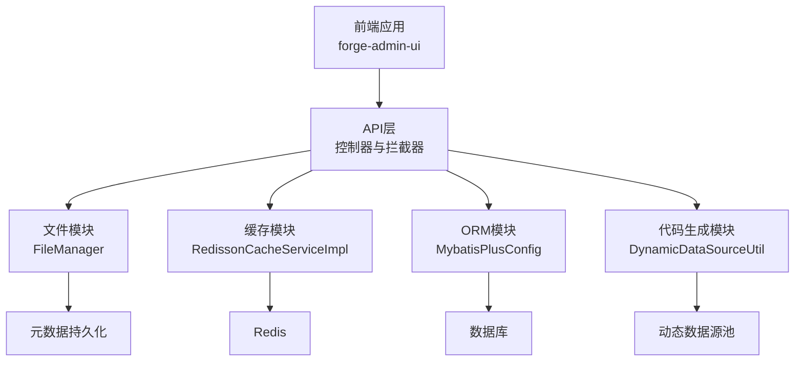
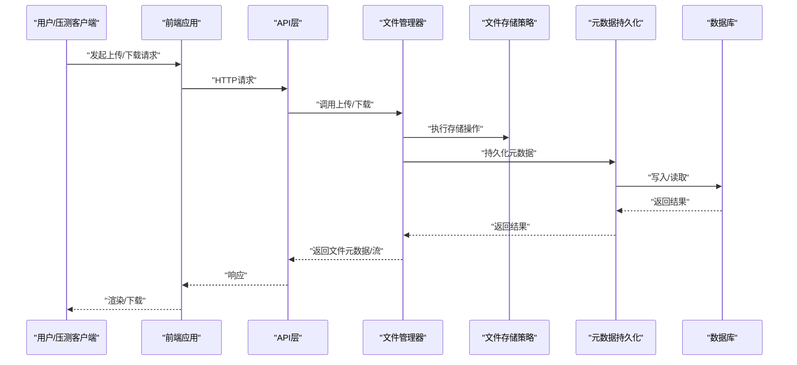
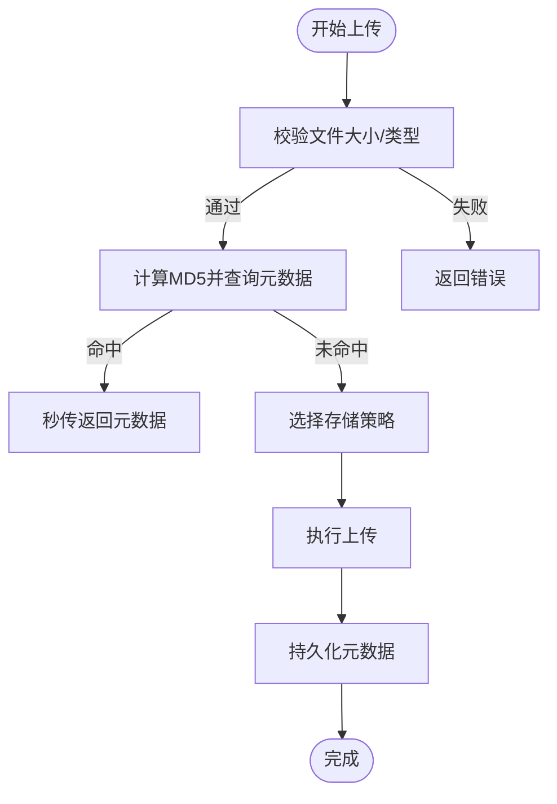
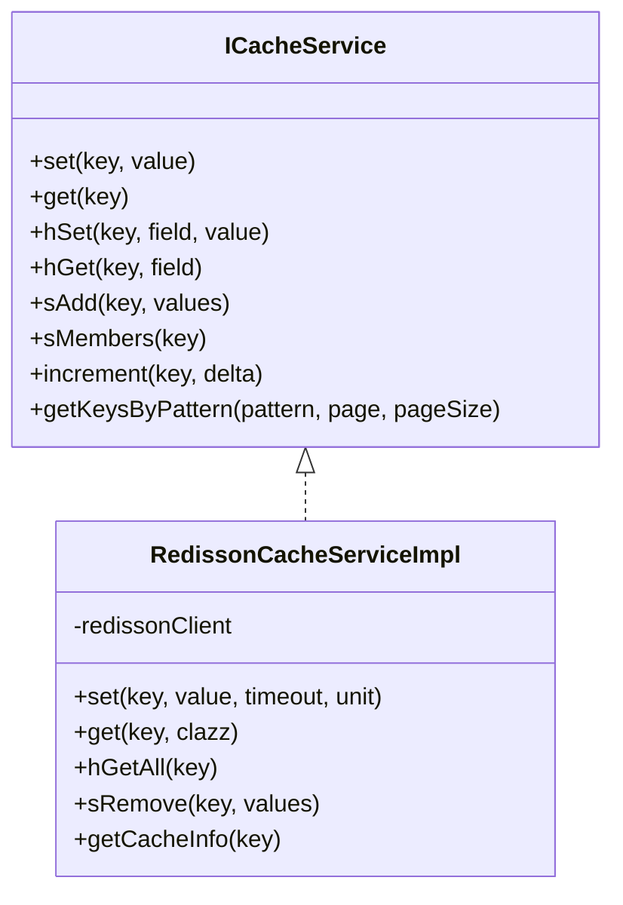
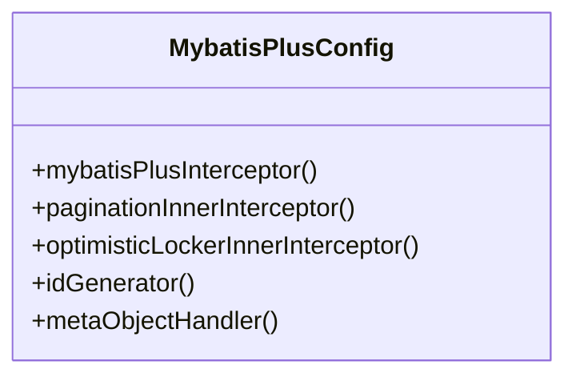
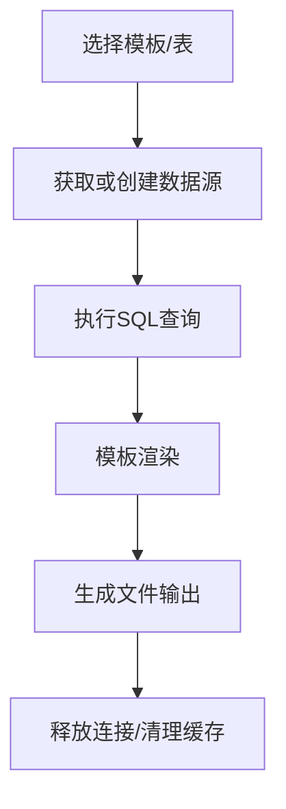
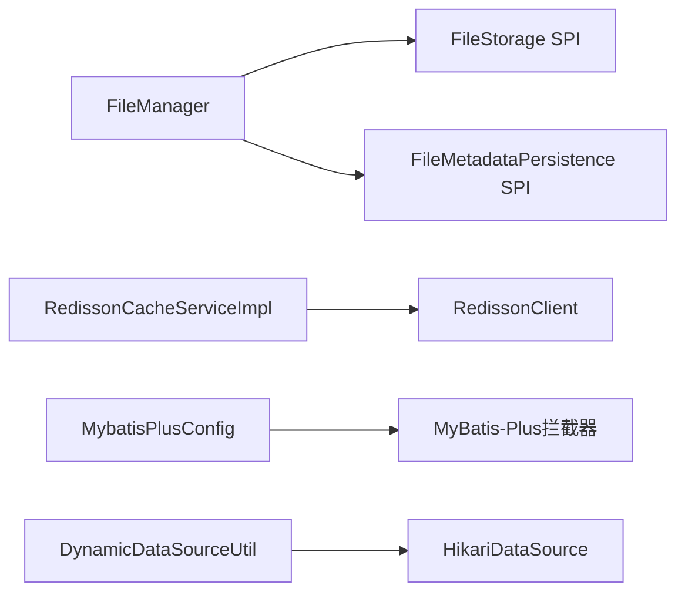

# 性能测试

<cite>
**本文引用的文件**
- [forge-admin-ui/src/views/system/file-list.vue](file://forge-admin-ui/src/views/system/file-list.vue)
- [forge-admin-ui/src/utils/file.js](file://forge-admin-ui/src/utils/file.js)
- [forge/forge-framework/forge-starter-parent/forge-starter-file/src/main/java/com/mdframe/forge/starter/file/core/FileManager.java](file://forge/forge-framework/forge-starter-parent/forge-starter-file/src/main/java/com/mdframe/forge/starter/file/core/FileManager.java)
- [forge/forge-framework/forge-starter-parent/forge-starter-file/target/classes/com/mdframe/forge/starter/file/core/FileManager__Javadoc.json](file://forge/forge-framework/forge-starter-parent/forge-starter-file/target/classes/com/mdframe/forge/starter/file/core/FileManager__Javadoc.json)
- [forge/forge-framework/forge-starter-parent/forge-starter-cache/src/main/java/com/mdframe/forge/starter/cache/service/impl/RedissonCacheServiceImpl.java](file://forge/forge-framework/forge-starter-parent/forge-starter-cache/src/main/java/com/mdframe/forge/starter/cache/service/impl/RedissonCacheServiceImpl.java)
- [forge/forge-framework/forge-starter-parent/forge-starter-orm/src/main/java/com/mdframe/forge/starter/orm/config/MybatisPlusConfig.java](file://forge/forge-framework/forge-starter-parent/forge-starter-orm/src/main/java/com/mdframe/forge/starter/orm/config/MybatisPlusConfig.java)
- [forge/forge-framework/forge-plugin-parent/forge-plugin-generator/src/main/java/com/mdframe/forge/plugin/generator/util/DynamicDataSourceUtil.java](file://forge/forge-framework/forge-plugin-parent/forge-plugin-generator/src/main/java/com/mdframe/forge/plugin/generator/util/DynamicDataSourceUtil.java)
- [forge/forge-framework/forge-starter-parent/forge-starter-api-config/README.md](file://forge/forge-framework/forge-starter-parent/forge-starter-api-config/README.md)
- [plans/api-config-management-plan.md](file://plans/api-config-management-plan.md)
- [forge-admin-ui/.turing_coder_rules/ui-ux-pro-max/data/ux-guidelines.csv](file://forge-admin-ui/.turing_coder_rules/ui-ux-pro-max/data/ux-guidelines.csv)
</cite>

## 目录
1. [简介](#简介)
2. [项目结构](#项目结构)
3. [核心组件](#核心组件)
4. [架构总览](#架构总览)
5. [详细组件分析](#详细组件分析)
6. [依赖关系分析](#依赖关系分析)
7. [性能考量与指标](#性能考量与指标)
8. [故障排查指南](#故障排查指南)
9. [结论](#结论)
10. [附录](#附录)

## 简介
本指南面向Forge框架，围绕JMeter、Gatling等主流性能测试工具，构建一套完整的性能测试体系。内容涵盖压力测试场景设计、负载测试配置、并发测试策略；覆盖代码生成器性能、文件上传下载速度、数据库查询性能、缓存命中率等关键路径；同时提供内存使用分析、CPU占用监控、网络延迟测试方法，并给出性能基线设定、瓶颈识别与优化建议，以及API接口、数据库连接池、线程池的专项测试要点，确保系统在高负载下的稳定性与响应速度。

## 项目结构
Forge框架采用多模块分层架构，前端位于forge-admin-ui，后端由多个starter与plugin组成。与性能测试密切相关的模块包括：
- 文件能力：文件上传下载、分片上传、元数据持久化
- 缓存能力：基于Redisson的多种数据结构缓存
- ORM能力：MyBatis-Plus配置与插件
- 代码生成：动态数据源管理与模板生成
- API配置：两级缓存、事件同步、拦截链路

图表来源
- [forge/forge-framework/forge-starter-parent/forge-starter-file/src/main/java/com/mdframe/forge/starter/file/core/FileManager.java](file://forge/forge-framework/forge-starter-parent/forge-starter-file/src/main/java/com/mdframe/forge/starter/file/core/FileManager.java#L1-L255)
- [forge/forge-framework/forge-starter-parent/forge-starter-cache/src/main/java/com/mdframe/forge/starter/cache/service/impl/RedissonCacheServiceImpl.java](file://forge/forge-framework/forge-starter-parent/forge-starter-cache/src/main/java/com/mdframe/forge/starter/cache/service/impl/RedissonCacheServiceImpl.java#L1-L289)
- [forge/forge-framework/forge-starter-parent/forge-starter-orm/src/main/java/com/mdframe/forge/starter/orm/config/MybatisPlusConfig.java](file://forge/forge-framework/forge-starter-parent/forge-starter-orm/src/main/java/com/mdframe/forge/starter/orm/config/MybatisPlusConfig.java#L1-L97)
- [forge/forge-framework/forge-plugin-parent/forge-plugin-generator/src/main/java/com/mdframe/forge/plugin/generator/util/DynamicDataSourceUtil.java](file://forge/forge-framework/forge-plugin-parent/forge-plugin-generator/src/main/java/com/mdframe/forge/plugin/generator/util/DynamicDataSourceUtil.java#L1-L113)

章节来源
- [forge/forge-framework/forge-starter-parent/forge-starter-file/src/main/java/com/mdframe/forge/starter/file/core/FileManager.java](file://forge/forge-framework/forge-starter-parent/forge-starter-file/src/main/java/com/mdframe/forge/starter/file/core/FileManager.java#L1-L255)
- [forge/forge-framework/forge-starter-parent/forge-starter-cache/src/main/java/com/mdframe/forge/starter/cache/service/impl/RedissonCacheServiceImpl.java](file://forge/forge-framework/forge-starter-parent/forge-starter-cache/src/main/java/com/mdframe/forge/starter/cache/service/impl/RedissonCacheServiceImpl.java#L1-L289)
- [forge/forge-framework/forge-starter-parent/forge-starter-orm/src/main/java/com/mdframe/forge/starter/orm/config/MybatisPlusConfig.java](file://forge/forge-framework/forge-starter-parent/forge-starter-orm/src/main/java/com/mdframe/forge/starter/orm/config/MybatisPlusConfig.java#L1-L97)
- [forge/forge-framework/forge-plugin-parent/forge-plugin-generator/src/main/java/com/mdframe/forge/plugin/generator/util/DynamicDataSourceUtil.java](file://forge/forge-framework/forge-plugin-parent/forge-plugin-generator/src/main/java/com/mdframe/forge/plugin/generator/util/DynamicDataSourceUtil.java#L1-L113)

## 核心组件
- 文件管理器：统一上传、下载、分片上传、URL生成、元数据持久化与校验
- 缓存服务：基于Redisson的键值、哈希、集合、列表、原子计数等操作
- ORM配置：MyBatis-Plus拦截器、分页与乐观锁插件、雪花ID生成器
- 动态数据源：Hikari连接池封装、按数据源ID缓存、查询执行
- API配置：两级缓存（本地+Redis）、事件驱动同步、拦截器链

章节来源
- [forge/forge-framework/forge-starter-parent/forge-starter-file/src/main/java/com/mdframe/forge/starter/file/core/FileManager.java](file://forge/forge-framework/forge-starter-parent/forge-starter-file/src/main/java/com/mdframe/forge/starter/file/core/FileManager.java#L1-L255)
- [forge/forge-framework/forge-starter-parent/forge-starter-cache/src/main/java/com/mdframe/forge/starter/cache/service/impl/RedissonCacheServiceImpl.java](file://forge/forge-framework/forge-starter-parent/forge-starter-cache/src/main/java/com/mdframe/forge/starter/cache/service/impl/RedissonCacheServiceImpl.java#L1-L289)
- [forge/forge-framework/forge-starter-parent/forge-starter-orm/src/main/java/com/mdframe/forge/starter/orm/config/MybatisPlusConfig.java](file://forge/forge-framework/forge-starter-parent/forge-starter-orm/src/main/java/com/mdframe/forge/starter/orm/config/MybatisPlusConfig.java#L1-L97)
- [forge/forge-framework/forge-plugin-parent/forge-plugin-generator/src/main/java/com/mdframe/forge/plugin/generator/util/DynamicDataSourceUtil.java](file://forge/forge-framework/forge-plugin-parent/forge-plugin-generator/src/main/java/com/mdframe/forge/plugin/generator/util/DynamicDataSourceUtil.java#L1-L113)
- [forge/forge-framework/forge-starter-parent/forge-starter-api-config/README.md](file://forge/forge-framework/forge-starter-parent/forge-starter-api-config/README.md#L143-L168)
- [plans/api-config-management-plan.md](file://plans/api-config-management-plan.md#L477-L490)

## 架构总览
以下序列图展示典型请求在性能测试中的关键交互路径，便于设计压测场景与定位瓶颈。

图表来源
- [forge/forge-framework/forge-starter-parent/forge-starter-file/src/main/java/com/mdframe/forge/starter/file/core/FileManager.java](file://forge/forge-framework/forge-starter-parent/forge-starter-file/src/main/java/com/mdframe/forge/starter/file/core/FileManager.java#L55-L135)
- [forge/forge-framework/forge-starter-parent/forge-starter-file/target/classes/com/mdframe/forge/starter/file/core/FileManager__Javadoc.json](file://forge/forge-framework/forge-starter-parent/forge-starter-file/target/classes/com/mdframe/forge/starter/file/core/FileManager__Javadoc.json#L1-L1)

章节来源
- [forge/forge-framework/forge-starter-parent/forge-starter-file/src/main/java/com/mdframe/forge/starter/file/core/FileManager.java](file://forge/forge-framework/forge-starter-parent/forge-starter-file/src/main/java/com/mdframe/forge/starter/file/core/FileManager.java#L55-L135)

## 详细组件分析

### 文件上传下载性能测试
- 测试目标
  - 上传吞吐量（QPS/MBps）、下载带宽、延迟分布
  - 分片上传的并发与续传鲁棒性
  - 元数据持久化对整体时延的影响
- 场景设计
  - 单文件上传：小/中/大文件阶梯式压测
  - 多并发上传：固定并发、逐步加压、突发流量
  - 分片上传：固定分片大小、并发分片、断点续传
  - 下载验证：随机选取文件ID，验证URL有效性与下载完整性
- 关键指标
  - 成功率、平均/95%/99%延迟、吞吐量、连接池使用率
  - IO读写耗时、网络RTT、磁盘/对象存储写入耗时
- 前端配合
  - 使用getFileUrl统一生成访问URL，结合后端签名/直链策略
  - 前端懒加载与图片预览不影响后端接口性能，但需关注渲染开销

图表来源
- [forge/forge-framework/forge-starter-parent/forge-starter-file/src/main/java/com/mdframe/forge/starter/file/core/FileManager.java](file://forge/forge-framework/forge-starter-parent/forge-starter-file/src/main/java/com/mdframe/forge/starter/file/core/FileManager.java#L70-L99)
- [forge-admin-ui/src/utils/file.js](file://forge-admin-ui/src/utils/file.js#L1-L33)

章节来源
- [forge/forge-framework/forge-starter-parent/forge-starter-file/src/main/java/com/mdframe/forge/starter/file/core/FileManager.java](file://forge/forge-framework/forge-starter-parent/forge-starter-file/src/main/java/com/mdframe/forge/starter/file/core/FileManager.java#L55-L135)
- [forge-admin-ui/src/views/system/file-list.vue](file://forge-admin-ui/src/views/system/file-list.vue#L368-L422)
- [forge-admin-ui/src/utils/file.js](file://forge-admin-ui/src/utils/file.js#L1-L33)

### 缓存命中率与性能测试
- 测试目标
  - 键值、哈希、集合、列表、原子计数等操作的QPS与延迟
  - 缓存穿透、击穿、雪崩的防护与恢复能力
  - 事件驱动的跨节点缓存同步延迟
- 场景设计
  - 热键读写混合、冷键访问、批量Key操作
  - 模拟热点Key集中访问，观察TTL与淘汰策略
  - 触发缓存刷新事件，观测L1/L2同步耗时
- 关键指标
  - 命中率、平均/95%延迟、Redis连接池使用率
  - 键空间统计、内存占用、过期键回收率

图表来源
- [forge/forge-framework/forge-starter-parent/forge-starter-cache/src/main/java/com/mdframe/forge/starter/cache/service/impl/RedissonCacheServiceImpl.java](file://forge/forge-framework/forge-starter-parent/forge-starter-cache/src/main/java/com/mdframe/forge/starter/cache/service/impl/RedissonCacheServiceImpl.java#L1-L289)

章节来源
- [forge/forge-framework/forge-starter-parent/forge-starter-cache/src/main/java/com/mdframe/forge/starter/cache/service/impl/RedissonCacheServiceImpl.java](file://forge/forge-framework/forge-starter-parent/forge-starter-cache/src/main/java/com/mdframe/forge/starter/cache/service/impl/RedissonCacheServiceImpl.java#L1-L289)
- [forge/forge-framework/forge-starter-parent/forge-starter-api-config/README.md](file://forge/forge-framework/forge-starter-parent/forge-starter-api-config/README.md#L143-L168)
- [plans/api-config-management-plan.md](file://plans/api-config-management-plan.md#L477-L490)

### 数据库查询与连接池性能测试
- 测试目标
  - 分页查询、乐观锁冲突、ID生成器性能
  - 连接池容量与等待时间、慢查询识别
- 场景设计
  - 大数据量分页扫描、排序字段索引命中
  - 并发更新+乐观锁冲突模拟
  - 连接池饱和与超时重试
- 关键指标
  - QPS、平均/95%延迟、慢查询数量、连接池活跃/等待数

图表来源
- [forge/forge-framework/forge-starter-parent/forge-starter-orm/src/main/java/com/mdframe/forge/starter/orm/config/MybatisPlusConfig.java](file://forge/forge-framework/forge-starter-parent/forge-starter-orm/src/main/java/com/mdframe/forge/starter/orm/config/MybatisPlusConfig.java#L1-L97)

章节来源
- [forge/forge-framework/forge-starter-parent/forge-starter-orm/src/main/java/com/mdframe/forge/starter/orm/config/MybatisPlusConfig.java](file://forge/forge-framework/forge-starter-parent/forge-starter-orm/src/main/java/com/mdframe/forge/starter/orm/config/MybatisPlusConfig.java#L1-L97)

### 代码生成器性能测试
- 测试目标
  - 模板渲染、文件生成、动态数据源切换与连接复用
- 场景设计
  - 多模板并发生成、大数据量表生成
  - 动态数据源池扩容与回收
- 关键指标
  - 生成时延、模板编译缓存命中、连接池利用率

图表来源
- [forge/forge-framework/forge-plugin-parent/forge-plugin-generator/src/main/java/com/mdframe/forge/plugin/generator/util/DynamicDataSourceUtil.java](file://forge/forge-framework/forge-plugin-parent/forge-plugin-generator/src/main/java/com/mdframe/forge/plugin/generator/util/DynamicDataSourceUtil.java#L30-L113)

章节来源
- [forge/forge-framework/forge-plugin-parent/forge-plugin-generator/src/main/java/com/mdframe/forge/plugin/generator/util/DynamicDataSourceUtil.java](file://forge/forge-framework/forge-plugin-parent/forge-plugin-generator/src/main/java/com/mdframe/forge/plugin/generator/util/DynamicDataSourceUtil.java#L1-L113)

### API接口性能测试
- 测试目标
  - 两级缓存命中、拦截器链路、事件同步延迟
- 场景设计
  - 热点接口并发压测、缓存刷新事件风暴
- 关键指标
  - 请求延迟、缓存命中率、事件传播耗时

章节来源
- [forge/forge-framework/forge-starter-parent/forge-starter-api-config/README.md](file://forge/forge-framework/forge-starter-parent/forge-starter-api-config/README.md#L143-L168)
- [plans/api-config-management-plan.md](file://plans/api-config-management-plan.md#L477-L490)

## 依赖关系分析
- 文件模块依赖存储策略SPI与元数据持久化SPI，具备良好的可替换性
- 缓存模块依赖RedissonClient，提供丰富的数据结构与原子操作
- ORM模块通过拦截器插件化扩展，支持分页与乐观锁
- 代码生成模块依赖Hikari连接池，按数据源ID缓存连接

图表来源
- [forge/forge-framework/forge-starter-parent/forge-starter-file/src/main/java/com/mdframe/forge/starter/file/core/FileManager.java](file://forge/forge-framework/forge-starter-parent/forge-starter-file/src/main/java/com/mdframe/forge/starter/file/core/FileManager.java#L1-L255)
- [forge/forge-framework/forge-starter-parent/forge-starter-cache/src/main/java/com/mdframe/forge/starter/cache/service/impl/RedissonCacheServiceImpl.java](file://forge/forge-framework/forge-starter-parent/forge-starter-cache/src/main/java/com/mdframe/forge/starter/cache/service/impl/RedissonCacheServiceImpl.java#L1-L289)
- [forge/forge-framework/forge-starter-parent/forge-starter-orm/src/main/java/com/mdframe/forge/starter/orm/config/MybatisPlusConfig.java](file://forge/forge-framework/forge-starter-parent/forge-starter-orm/src/main/java/com/mdframe/forge/starter/orm/config/MybatisPlusConfig.java#L1-L97)
- [forge/forge-framework/forge-plugin-parent/forge-plugin-generator/src/main/java/com/mdframe/forge/plugin/generator/util/DynamicDataSourceUtil.java](file://forge/forge-framework/forge-plugin-parent/forge-plugin-generator/src/main/java/com/mdframe/forge/plugin/generator/util/DynamicDataSourceUtil.java#L1-L113)

章节来源
- [forge/forge-framework/forge-starter-parent/forge-starter-file/src/main/java/com/mdframe/forge/starter/file/core/FileManager.java](file://forge/forge-framework/forge-starter-parent/forge-starter-file/src/main/java/com/mdframe/forge/starter/file/core/FileManager.java#L1-L255)
- [forge/forge-framework/forge-starter-parent/forge-starter-cache/src/main/java/com/mdframe/forge/starter/cache/service/impl/RedissonCacheServiceImpl.java](file://forge/forge-framework/forge-starter-parent/forge-starter-cache/src/main/java/com/mdframe/forge/starter/cache/service/impl/RedissonCacheServiceImpl.java#L1-L289)
- [forge/forge-framework/forge-starter-parent/forge-starter-orm/src/main/java/com/mdframe/forge/starter/orm/config/MybatisPlusConfig.java](file://forge/forge-framework/forge-starter-parent/forge-starter-orm/src/main/java/com/mdframe/forge/starter/orm/config/MybatisPlusConfig.java#L1-L97)
- [forge/forge-framework/forge-plugin-parent/forge-plugin-generator/src/main/java/com/mdframe/forge/plugin/generator/util/DynamicDataSourceUtil.java](file://forge/forge-framework/forge-plugin-parent/forge-plugin-generator/src/main/java/com/mdframe/forge/plugin/generator/util/DynamicDataSourceUtil.java#L1-L113)

## 性能考量与指标
- 基线设定
  - 在标准硬件与数据库条件下，建立各模块的基线QPS与延迟阈值
  - 以95%延迟为SLA关键指标，设定P99上限
- 监控维度
  - CPU/内存/IO/网络：JVM GC频率、堆外内存、磁盘队列长度
  - 应用指标：请求延迟、错误率、超时率、重试率
  - 中间件指标：Redis连接池、数据库连接池、线程池排队长度
- 瓶颈识别
  - 通过火焰图与慢查询日志定位热点方法与SQL
  - 结合缓存命中率与事件同步延迟判断缓存层问题
- 优化建议
  - 读多写少场景引入CDN与对象存储直链
  - 大事务拆分、批量写入、异步化非关键路径
  - 合理设置连接池与超时参数，避免饥饿与堆积

## 故障排查指南
- 文件模块
  - 上传失败：检查文件大小/类型校验、存储策略可用性、元数据持久化异常
  - 下载异常：确认文件ID存在、存储策略返回流正常、响应头设置正确
- 缓存模块
  - 命中率低：检查Key模式、TTL设置、热点Key分散策略
  - 同步延迟：确认事件发布/订阅通道、节点数量与网络状况
- ORM模块
  - 慢查询：分析分页与排序字段索引、避免N+1、开启慢查询日志
  - 乐观锁冲突：降低并发或优化业务流程
- 代码生成
  - 连接池耗尽：检查数据源ID映射、连接泄漏、池大小配置

章节来源
- [forge/forge-framework/forge-starter-parent/forge-starter-file/src/main/java/com/mdframe/forge/starter/file/core/FileManager.java](file://forge/forge-framework/forge-starter-parent/forge-starter-file/src/main/java/com/mdframe/forge/starter/file/core/FileManager.java#L100-L135)
- [forge/forge-framework/forge-starter-parent/forge-starter-cache/src/main/java/com/mdframe/forge/starter/cache/service/impl/RedissonCacheServiceImpl.java](file://forge/forge-framework/forge-starter-parent/forge-starter-cache/src/main/java/com/mdframe/forge/starter/cache/service/impl/RedissonCacheServiceImpl.java#L216-L275)
- [forge/forge-framework/forge-starter-parent/forge-starter-orm/src/main/java/com/mdframe/forge/starter/orm/config/MybatisPlusConfig.java](file://forge/forge-framework/forge-starter-parent/forge-starter-orm/src/main/java/com/mdframe/forge/starter/orm/config/MybatisPlusConfig.java#L38-L59)
- [forge/forge-framework/forge-plugin-parent/forge-plugin-generator/src/main/java/com/mdframe/forge/plugin/generator/util/DynamicDataSourceUtil.java](file://forge/forge-framework/forge-plugin-parent/forge-plugin-generator/src/main/java/com/mdframe/forge/plugin/generator/util/DynamicDataSourceUtil.java#L38-L42)

## 结论
通过以上测试体系与方法，可在不同层面系统性评估Forge框架在高负载下的性能表现。建议以“基线—压测—分析—优化—回归”的闭环流程持续迭代，结合前端性能指南与UX最佳实践，确保用户体验与系统稳定性双达标。

## 附录
- 前端性能建议参考
  - 图像优化、懒加载、代码分割与缓存策略
  - 屏幕阅读器与可访问性对首屏渲染影响的平衡

章节来源
- [forge-admin-ui/.turing_coder_rules/ui-ux-pro-max/data/ux-guidelines.csv](file://forge-admin-ui/.turing_coder_rules/ui-ux-pro-max/data/ux-guidelines.csv#L47-L50)