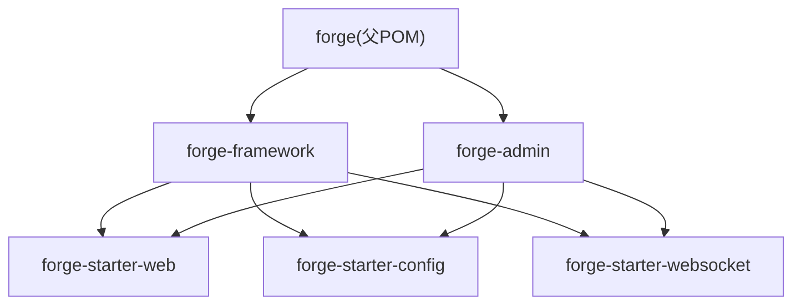
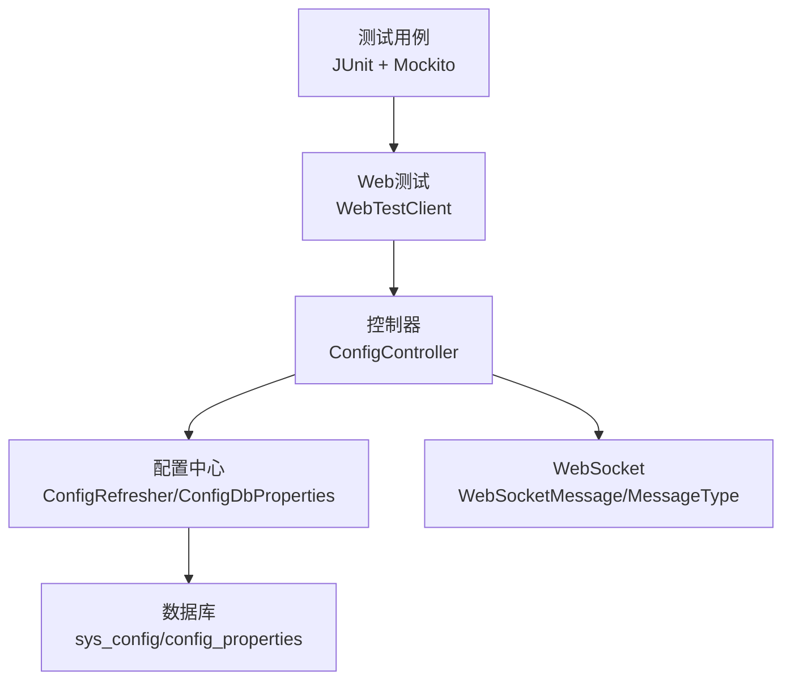
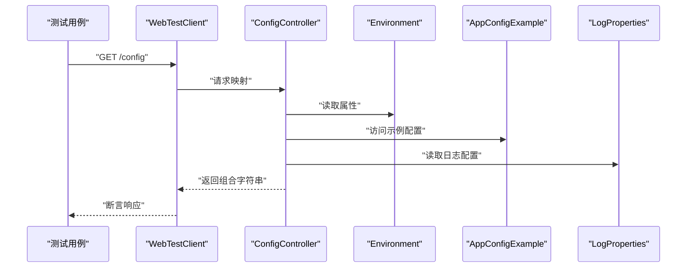
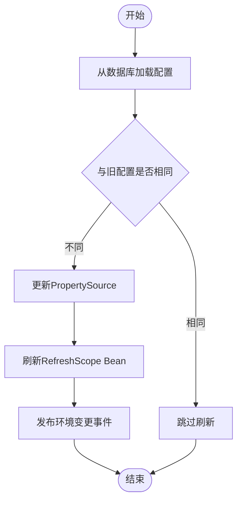
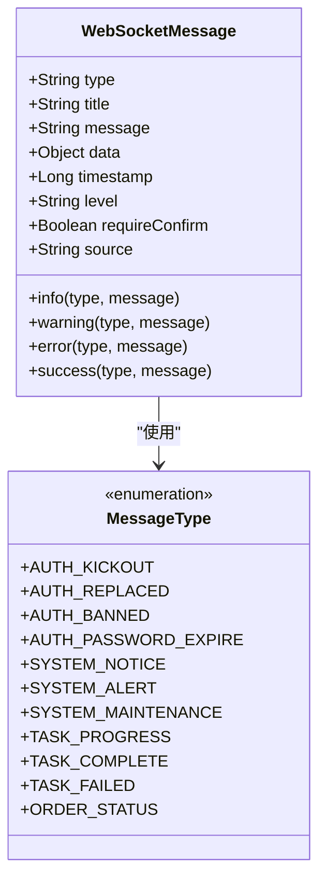
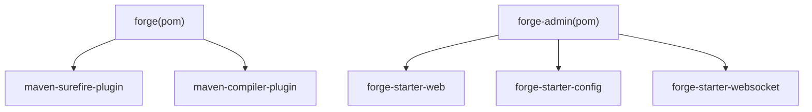

# 测试指南

<cite>
**本文引用的文件**
- [forge/pom.xml](file://forge/pom.xml)
- [forge/forge-admin/pom.xml](file://forge/forge-admin/pom.xml)
- [forge/forge-admin/src/main/java/com/mdframe/forge/admin/ConfigController.java](file://forge/forge-admin/src/main/java/com/mdframe/forge/admin/ConfigController.java)
- [forge/forge-admin/src/main/resources/application.yml](file://forge/forge-admin/src/main/resources/application.yml)
- [forge/forge-framework/forge-starter-parent/forge-starter-web/pom.xml](file://forge/forge-framework/forge-starter-parent/forge-starter-web/pom.xml)
- [forge/forge-framework/forge-starter-parent/forge-starter-config/src/main/java/com/mdframe/forge/starter/property/ConfigDbProperties.java](file://forge/forge-framework/forge-starter-parent/forge-starter-config/src/main/java/com/mdframe/forge/starter/property/ConfigDbProperties.java)
- [forge/forge-framework/forge-starter-parent/forge-starter-config/src/main/java/com/mdframe/forge/starter/property/example/AppConfigExample.java](file://forge/forge-framework/forge-starter-parent/forge-starter-config/src/main/java/com/mdframe/forge/starter/property/example/AppConfigExample.java)
- [forge/forge-framework/forge-starter-parent/forge-starter-config/src/main/java/com/mdframe/forge/starter/property/refresh/ConfigRefresher.java](file://forge/forge-framework/forge-starter-parent/forge-starter-config/src/main/java/com/mdframe/forge/starter/property/refresh/ConfigRefresher.java)
- [forge/forge-framework/forge-starter-parent/forge-starter-config/src/main/java/com/mdframe/forge/starter/config/config/ConfigAutoConfiguration.java](file://forge/forge-framework/forge-starter-parent/forge-starter-config/src/main/java/com/mdframe/forge/starter/config/config/ConfigAutoConfiguration.java)
- [forge/forge-framework/forge-starter-parent/forge-starter-websocket/src/main/java/com/mdframe/forge/starter/websocket/domain/WebSocketMessage.java](file://forge/forge-framework/forge-starter-parent/forge-starter-websocket/src/main/java/com/mdframe/forge/starter/websocket/domain/WebSocketMessage.java)
- [forge/forge-framework/forge-starter-parent/forge-starter-websocket/src/main/java/com/mdframe/forge/starter/websocket/enums/MessageType.java](file://forge/forge-framework/forge-starter-parent/forge-starter-websocket/src/main/java/com/mdframe/forge/starter/websocket/enums/MessageType.java)
- [forge/forge-framework/forge-starter-parent/forge-starter-websocket/src/main/resources/META-INF/spring/org.springframework.boot.autoconfigure.AutoConfiguration.imports](file://forge/forge-framework/forge-starter-parent/forge-starter-websocket/src/main/resources/META-INF/spring/org.springframework.boot.autoconfigure.AutoConfiguration.imports)
- [forge-admin-ui/src/utils/websocket.js](file://forge-admin-ui/src/utils/websocket.js)
</cite>

## 目录
1. [简介](#简介)
2. [项目结构](#项目结构)
3. [核心组件](#核心组件)
4. [架构总览](#架构总览)
5. [详细组件分析](#详细组件分析)
6. [依赖分析](#依赖分析)
7. [性能考虑](#性能考虑)
8. [故障排查指南](#故障排查指南)
9. [结论](#结论)
10. [附录](#附录)

## 简介
本测试指南面向Forge框架，提供覆盖单元测试、集成测试与性能测试的完整测试策略。内容包括：
- JUnit测试框架使用与Maven Surefire插件配置
- Mockito模拟对象创建与测试数据准备
- 控制器测试、服务层测试、数据访问层测试的方法论
- 测试覆盖率要求、测试环境搭建与持续集成配置建议
- 异常处理、异步任务与WebSocket通信的测试要点
- 性能测试工具使用、压力测试场景设计与测试报告分析
- 建立完善的测试体系以确保代码质量与系统稳定性

## 项目结构
Forge采用多模块Maven工程组织，核心模块包括：
- forge：父POM，统一版本与插件配置，含Surefire测试插件与环境Profile
- forge-admin：管理端应用，包含Web控制器与配置示例
- forge-framework：框架与各starter模块集合，包含配置中心、WebSocket、Web容器等

图表来源
- [forge/pom.xml](file://forge/pom.xml#L114-L119)
- [forge/forge-admin/pom.xml](file://forge/forge-admin/pom.xml#L1-L111)
- [forge/forge-framework/forge-starter-parent/forge-starter-web/pom.xml](file://forge/forge-framework/forge-starter-parent/forge-starter-web/pom.xml#L1-L63)

章节来源
- [forge/pom.xml](file://forge/pom.xml#L63-L91)
- [forge/forge-admin/pom.xml](file://forge/forge-admin/pom.xml#L1-L111)

## 核心组件
- 测试框架与插件
  - JUnit与Maven Surefire：通过父POM统一配置，按Profile选择性执行测试用例
  - Lombok、MapStruct等注解处理器：保证测试编译与生成代码可用
- 控制器层
  - 示例控制器：对外提供配置查询接口，便于演示控制器测试
- 配置中心
  - 数据库配置源注册、动态刷新与作用域管理，支撑配置变更的集成测试
- WebSocket
  - 消息模型与类型枚举，结合前端SockJS客户端，支持实时通信测试

章节来源
- [forge/pom.xml](file://forge/pom.xml#L163-L175)
- [forge/forge-admin/src/main/java/com/mdframe/forge/admin/ConfigController.java](file://forge/forge-admin/src/main/java/com/mdframe/forge/admin/ConfigController.java#L1-L38)
- [forge/forge-framework/forge-starter-parent/forge-starter-config/src/main/java/com/mdframe/forge/starter/property/refresh/ConfigRefresher.java](file://forge/forge-framework/forge-starter-parent/forge-starter-config/src/main/java/com/mdframe/forge/starter/property/refresh/ConfigRefresher.java#L51-L156)
- [forge/forge-framework/forge-starter-parent/forge-starter-websocket/src/main/java/com/mdframe/forge/starter/websocket/domain/WebSocketMessage.java](file://forge/forge-framework/forge-starter-parent/forge-starter-websocket/src/main/java/com/mdframe/forge/starter/websocket/domain/WebSocketMessage.java#L1-L98)

## 架构总览
下图展示测试视角下的系统交互：测试通过Spring Boot Test与WebTestClient发起请求，控制器接收请求并调用配置中心与WebSocket组件；配置中心从数据库加载配置并通过刷新器更新环境；WebSocket组件处理消息类型与传输。

图表来源
- [forge/forge-admin/src/main/java/com/mdframe/forge/admin/ConfigController.java](file://forge/forge-admin/src/main/java/com/mdframe/forge/admin/ConfigController.java#L30-L36)
- [forge/forge-framework/forge-starter-parent/forge-starter-config/src/main/java/com/mdframe/forge/starter/property/refresh/ConfigRefresher.java](file://forge/forge-framework/forge-starter-parent/forge-starter-config/src/main/java/com/mdframe/forge/starter/property/refresh/ConfigRefresher.java#L51-L156)
- [forge/forge-framework/forge-starter-parent/forge-starter-websocket/src/main/java/com/mdframe/forge/starter/websocket/domain/WebSocketMessage.java](file://forge/forge-framework/forge-starter-parent/forge-starter-websocket/src/main/java/com/mdframe/forge/starter/websocket/domain/WebSocketMessage.java#L1-L98)

## 详细组件分析

### 控制器测试（ConfigController）
- 测试目标
  - 验证GET /config返回值正确拼接逻辑
  - 验证@Value注入与Environment属性读取
  - 验证SaToken注解对访问控制的影响
- 测试策略
  - 使用WebTestClient发起HTTP GET请求
  - 使用MockBean替换依赖组件，隔离外部系统
  - 准备测试配置属性，断言响应内容
- 关键实现参考
  - 控制器方法路径：[ConfigController.getConfig](file://forge/forge-admin/src/main/java/com/mdframe/forge/admin/ConfigController.java#L30-L36)

图表来源
- [forge/forge-admin/src/main/java/com/mdframe/forge/admin/ConfigController.java](file://forge/forge-admin/src/main/java/com/mdframe/forge/admin/ConfigController.java#L30-L36)

章节来源
- [forge/forge-admin/src/main/java/com/mdframe/forge/admin/ConfigController.java](file://forge/forge-admin/src/main/java/com/mdframe/forge/admin/ConfigController.java#L1-L38)

### 配置中心测试（ConfigRefresher、ConfigDbProperties、AppConfigExample）
- 测试目标
  - 验证数据库配置加载与PropertySource注册
  - 验证配置变更检测与刷新触发
  - 验证@RefreshScope作用域下的配置更新
- 测试策略
  - Mock JdbcTemplate与DataSource，构造sys_config数据
  - 使用@Import与@ActiveProfiles激活测试配置
  - 断言DbPropertySource内容变化与RefreshScope Bean重建
- 关键实现参考
  - 刷新逻辑路径：[ConfigRefresher.refresh](file://forge/forge-framework/forge-starter-parent/forge-starter-config/src/main/java/com/mdframe/forge/starter/property/refresh/ConfigRefresher.java#L51-L86)
  - 属性源注册路径：[DbPropertySourcePostProcessor.postProcessEnvironment](file://forge/forge-framework/forge-starter-parent/forge-starter-config/src/main/java/com/mdframe/forge/starter/property/refresh/ConfigRefresher.java#L39-L49)
  - 示例配置类路径：[AppConfigExample](file://forge/forge-framework/forge-starter-parent/forge-starter-config/src/main/java/com/mdframe/forge/starter/property/example/AppConfigExample.java#L1-L39)
  - 配置属性类路径：[ConfigDbProperties](file://forge/forge-framework/forge-starter-parent/forge-starter-config/src/main/java/com/mdframe/forge/starter/property/ConfigDbProperties.java#L1-L45)

图表来源
- [forge/forge-framework/forge-starter-parent/forge-starter-config/src/main/java/com/mdframe/forge/starter/property/refresh/ConfigRefresher.java](file://forge/forge-framework/forge-starter-parent/forge-starter-config/src/main/java/com/mdframe/forge/starter/property/refresh/ConfigRefresher.java#L51-L86)

章节来源
- [forge/forge-framework/forge-starter-parent/forge-starter-config/src/main/java/com/mdframe/forge/starter/property/refresh/ConfigRefresher.java](file://forge/forge-framework/forge-starter-parent/forge-starter-config/src/main/java/com/mdframe/forge/starter/property/refresh/ConfigRefresher.java#L51-L156)
- [forge/forge-framework/forge-starter-parent/forge-starter-config/src/main/java/com/mdframe/forge/starter/property/ConfigDbProperties.java](file://forge/forge-framework/forge-starter-parent/forge-starter-config/src/main/java/com/mdframe/forge/starter/property/ConfigDbProperties.java#L1-L45)
- [forge/forge-framework/forge-starter-parent/forge-starter-config/src/main/java/com/mdframe/forge/starter/property/example/AppConfigExample.java](file://forge/forge-framework/forge-starter-parent/forge-starter-config/src/main/java/com/mdframe/forge/starter/property/example/AppConfigExample.java#L1-L39)

### WebSocket通信测试（WebSocketMessage、MessageType、前端websocket.js）
- 测试目标
  - 验证消息类型与字段完整性
  - 验证前端SockJS客户端连接与消息收发
- 测试策略
  - 使用Stomp客户端发送/订阅消息，断言消息类型与内容
  - 验证开发环境代理下的URL适配
- 关键实现参考
  - 消息模型路径：[WebSocketMessage](file://forge/forge-framework/forge-starter-parent/forge-starter-websocket/src/main/java/com/mdframe/forge/starter/websocket/domain/WebSocketMessage.java#L1-L98)
  - 消息类型枚举路径：[MessageType](file://forge/forge-framework/forge-starter-parent/forge-starter-websocket/src/main/java/com/mdframe/forge/starter/websocket/enums/MessageType.java#L1-L70)
  - 前端连接逻辑路径：[initWebSocketClient](file://forge-admin-ui/src/utils/websocket.js#L13-L39)

图表来源
- [forge/forge-framework/forge-starter-parent/forge-starter-websocket/src/main/java/com/mdframe/forge/starter/websocket/domain/WebSocketMessage.java](file://forge/forge-framework/forge-starter-parent/forge-starter-websocket/src/main/java/com/mdframe/forge/starter/websocket/domain/WebSocketMessage.java#L1-L98)
- [forge/forge-framework/forge-starter-parent/forge-starter-websocket/src/main/java/com/mdframe/forge/starter/websocket/enums/MessageType.java](file://forge/forge-framework/forge-starter-parent/forge-starter-websocket/src/main/java/com/mdframe/forge/starter/websocket/enums/MessageType.java#L1-L70)

章节来源
- [forge/forge-framework/forge-starter-parent/forge-starter-websocket/src/main/java/com/mdframe/forge/starter/websocket/domain/WebSocketMessage.java](file://forge/forge-framework/forge-starter-parent/forge-starter-websocket/src/main/java/com/mdframe/forge/starter/websocket/domain/WebSocketMessage.java#L1-L98)
- [forge/forge-framework/forge-starter-parent/forge-starter-websocket/src/main/java/com/mdframe/forge/starter/websocket/enums/MessageType.java](file://forge/forge-framework/forge-starter-parent/forge-starter-websocket/src/main/java/com/mdframe/forge/starter/websocket/enums/MessageType.java#L1-L70)
- [forge-admin-ui/src/utils/websocket.js](file://forge-admin-ui/src/utils/websocket.js#L1-L39)

### 异步任务测试（Job模块）
- 测试目标
  - 验证定时任务调度与执行
  - 验证任务状态与日志记录
- 测试策略
  - 使用@ActiveProfiles切换测试环境
  - 使用Mock外部依赖，断言任务执行次数与结果
- 参考配置
  - Job自动配置导入：[org.springframework.boot.autoconfigure.AutoConfiguration.imports](file://forge/forge-framework/forge-plugin-parent/forge-plugin-job/src/main/resources/META-INF/spring/org.springframework.boot.autoconfigure.AutoConfiguration.imports#L1-L1)

章节来源
- [forge/forge-framework/forge-plugin-parent/forge-plugin-job/src/main/resources/META-INF/spring/org.springframework.boot.autoconfigure.AutoConfiguration.imports](file://forge/forge-framework/forge-plugin-parent/forge-plugin-job/src/main/resources/META-INF/spring/org.springframework.boot.autoconfigure.AutoConfiguration.imports#L1-L1)

### 数据访问层测试（MyBatis-Plus）
- 测试目标
  - 验证Mapper接口与XML映射正确性
  - 验证实体与数据库字段映射
- 测试策略
  - 使用嵌入式数据库或H2进行集成测试
  - 使用@Sql脚本初始化测试数据
- 参考配置
  - MyBatis-Plus配置：[application.yml](file://forge/forge-admin/src/main/resources/application.yml#L65-L86)

章节来源
- [forge/forge-admin/src/main/resources/application.yml](file://forge/forge-admin/src/main/resources/application.yml#L65-L86)

## 依赖分析
- 测试相关依赖
  - Spring Boot Starter Web与Undertow：提供Web容器与WebSocket支持
  - 配置中心：数据库配置源注册与动态刷新
  - WebSocket：消息模型与类型枚举
- Maven插件
  - maven-surefire-plugin：统一测试执行与分组
  - maven-compiler-plugin：启用注解处理器

图表来源
- [forge/pom.xml](file://forge/pom.xml#L163-L175)
- [forge/forge-admin/pom.xml](file://forge/forge-admin/pom.xml#L1-L111)
- [forge/forge-framework/forge-starter-parent/forge-starter-web/pom.xml](file://forge/forge-framework/forge-starter-parent/forge-starter-web/pom.xml#L1-L63)

章节来源
- [forge/pom.xml](file://forge/pom.xml#L163-L175)
- [forge/forge-framework/forge-starter-parent/forge-starter-web/pom.xml](file://forge/forge-framework/forge-starter-parent/forge-starter-web/pom.xml#L1-L63)

## 性能考虑
- Undertow容器：在Web容器中使用Undertow以提升并发性能
- 配置中心刷新：避免频繁刷新，合理设置刷新周期
- WebSocket：控制消息频率与批量推送，减少网络开销
- 测试环境：使用独立数据库与资源隔离，避免测试相互干扰

章节来源
- [forge/forge-framework/forge-starter-parent/forge-starter-web/pom.xml](file://forge/forge-framework/forge-starter-parent/forge-starter-web/pom.xml#L26-L43)

## 故障排查指南
- 测试用例未执行
  - 检查Profile与分组配置，确保groups与excludedGroups符合预期
  - 参考：[maven-surefire-plugin配置](file://forge/pom.xml#L163-L175)
- 配置未生效
  - 检查DbPropertySource是否注册成功
  - 检查刷新逻辑是否触发
  - 参考：[ConfigRefresher.refresh](file://forge/forge-framework/forge-starter-parent/forge-starter-config/src/main/java/com/mdframe/forge/starter/property/refresh/ConfigRefresher.java#L51-L86)
- WebSocket连接失败
  - 检查前端SockJS连接URL与代理配置
  - 参考：[initWebSocketClient](file://forge-admin-ui/src/utils/websocket.js#L13-L39)

章节来源
- [forge/pom.xml](file://forge/pom.xml#L163-L175)
- [forge/forge-framework/forge-starter-parent/forge-starter-config/src/main/java/com/mdframe/forge/starter/property/refresh/ConfigRefresher.java](file://forge/forge-framework/forge-starter-parent/forge-starter-config/src/main/java/com/mdframe/forge/starter/property/refresh/ConfigRefresher.java#L51-L86)
- [forge-admin-ui/src/utils/websocket.js](file://forge-admin-ui/src/utils/websocket.js#L13-L39)

## 结论
通过本测试指南，可在Forge框架中建立覆盖全栈的测试体系：以JUnit与Maven Surefire为核心，结合Mockito与WebTestClient进行控制器与集成测试；以配置中心与WebSocket为关键测试对象，覆盖动态配置与实时通信场景；配合性能测试与持续集成，确保系统稳定性与高质量交付。

## 附录
- 测试覆盖率建议
  - 单元测试：关键业务逻辑≥80%
  - 集成测试：核心流程≥90%
  - 覆盖率统计：建议使用JaCoCo插件在CI中收集
- 测试环境搭建
  - 使用application.yml中的spring.profiles.active切换环境
  - 使用@ActiveProfiles与@Import加载测试配置
- 持续集成配置
  - 在CI中执行mvn test，并按Profile分组运行测试
  - 参考：[forge/pom.xml Profile与Surefire配置](file://forge/pom.xml#L63-L91), (file://forge/pom.xml#L163-L175)