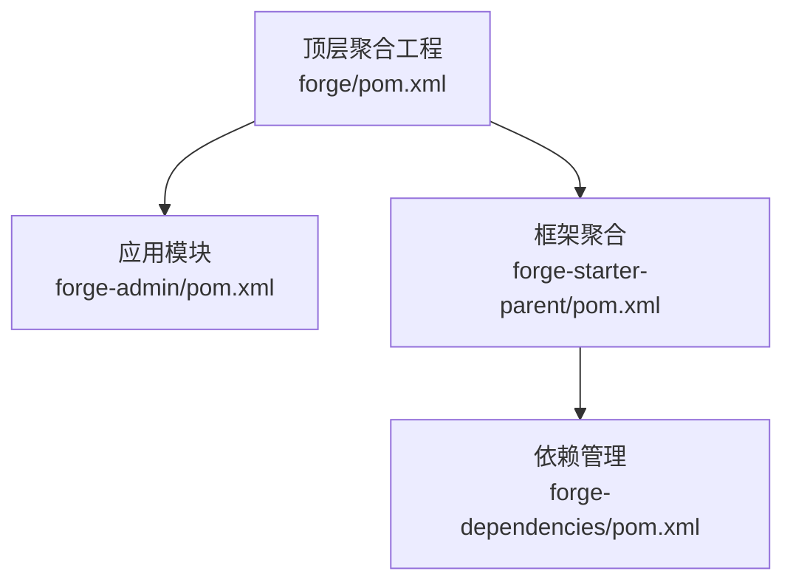
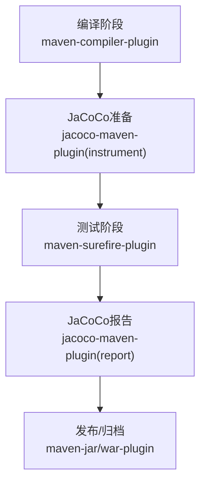
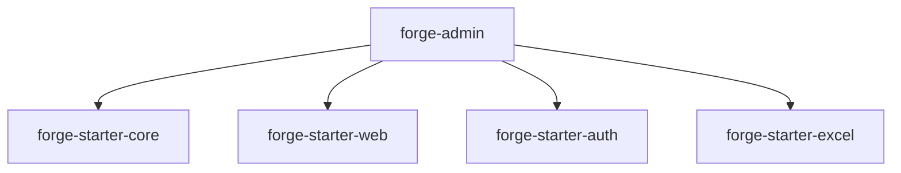

# 测试覆盖率

<cite>
**本文引用的文件**
- [forge/pom.xml](file://forge/pom.xml)
- [forge/forge-admin/pom.xml](file://forge/forge-admin/pom.xml)
- [forge/forge-framework/forge-dependencies/pom.xml](file://forge/forge-framework/forge-dependencies/pom.xml)
- [forge/forge-framework/forge-starter-parent/pom.xml](file://forge/forge-framework/forge-starter-parent/pom.xml)
- [forge/forge-framework/forge-starter-parent/forge-starter-core/pom.xml](file://forge/forge-framework/forge-starter-parent/forge-starter-core/pom.xml)
- [forge/forge-framework/forge-starter-parent/forge-starter-web/pom.xml](file://forge/forge-framework/forge-starter-parent/forge-starter-web/pom.xml)
- [forge/forge-framework/forge-starter-parent/forge-starter-auth/pom.xml](file://forge/forge-framework/forge-starter-parent/forge-starter-auth/pom.xml)
- [forge/forge-framework/forge-starter-parent/forge-starter-excel/pom.xml](file://forge/forge-framework/forge-starter-parent/forge-starter-excel/pom.xml)
</cite>

## 目录
1. [简介](#简介)
2. [项目结构](#项目结构)
3. [核心组件](#核心组件)
4. [架构总览](#架构总览)
5. [详细组件分析](#详细组件分析)
6. [依赖分析](#依赖分析)
7. [性能考虑](#性能考虑)
8. [故障排查指南](#故障排查指南)
9. [结论](#结论)
10. [附录](#附录)

## 简介
本指南面向Forge框架的测试覆盖率管理，围绕JaCoCo代码覆盖率工具在Maven与Gradle中的配置与使用展开，目标是帮助团队建立统一的覆盖率统计、报告生成、阈值门禁与趋势跟踪机制，实现对单元测试、集成测试、分支覆盖率与行覆盖率的规范化治理，并通过CI/CD集成保障持续改进。

当前仓库以Maven为主，Gradle配置文件未在根目录发现；因此本指南重点覆盖Maven场景下的JaCoCo配置与最佳实践，同时给出Gradle参考路径以便迁移。

## 项目结构
Forge采用多模块Maven结构，顶层聚合工程负责全局属性、插件与仓库配置；框架层通过独立的依赖管理模块集中声明依赖与版本；各功能starter模块按领域拆分，便于独立开发与测试。

图表来源
- [forge/pom.xml](file://forge/pom.xml#L114-L119)
- [forge/forge-admin/pom.xml](file://forge/forge-admin/pom.xml#L1-L111)
- [forge/forge-framework/forge-starter-parent/pom.xml](file://forge/forge-framework/forge-starter-parent/pom.xml#L1-L37)
- [forge/forge-framework/forge-dependencies/pom.xml](file://forge/forge-framework/forge-dependencies/pom.xml#L1-L487)

章节来源
- [forge/pom.xml](file://forge/pom.xml#L114-L119)
- [forge/forge-admin/pom.xml](file://forge/forge-admin/pom.xml#L1-L111)
- [forge/forge-framework/forge-starter-parent/pom.xml](file://forge/forge-framework/forge-starter-parent/pom.xml#L1-L37)
- [forge/forge-framework/forge-dependencies/pom.xml](file://forge/forge-framework/forge-dependencies/pom.xml#L1-L487)

## 核心组件
- 聚合工程与全局插件
  - 顶层POM定义Java版本、编码、Surefire测试分组策略与资源过滤等，为子模块提供统一构建行为。
  - 框架依赖管理POM集中声明各starter与plugin的版本，避免重复与冲突。
- 应用模块
  - 应用模块继承顶层坐标，引入所需starter与plugin，构建阶段使用Spring Boot Maven插件进行打包。
- 测试执行
  - Surefire插件负责单元测试执行，可通过profiles或命令行参数控制测试分组与排除标签。

章节来源
- [forge/pom.xml](file://forge/pom.xml#L12-L61)
- [forge/pom.xml](file://forge/pom.xml#L163-L175)
- [forge/forge-framework/forge-dependencies/pom.xml](file://forge/forge-framework/forge-dependencies/pom.xml#L72-L413)
- [forge/forge-admin/pom.xml](file://forge/forge-admin/pom.xml#L78-L108)

## 架构总览
下图展示覆盖率统计在Maven生命周期中的位置与关键交互点，包括编译期、测试期与报告期的职责划分。

图表来源
- [forge/pom.xml](file://forge/pom.xml#L121-L202)
- [forge/forge-admin/pom.xml](file://forge/forge-admin/pom.xml#L78-L108)

## 详细组件分析

### Maven中JaCoCo覆盖率配置（推荐方案）
- 插件引入与版本
  - 在顶层聚合工程或具体模块中引入JaCoCo Maven插件，建议与Surefire插件配合使用，确保测试期采集到覆盖率数据。
- 执行阶段
  - 使用“post-integration-test”或“verify”阶段触发报告生成，避免与测试阶段混淆。
- 数据采集与报告
  - 通过“jacoco:instrument”在测试前注入探针，再由“jacoco:report”生成XML/HTML报告。
- 报告输出
  - 建议输出至“target/jacoco-report”目录，便于CI系统收集与归档。

章节来源
- [forge/pom.xml](file://forge/pom.xml#L121-L202)
- [forge/forge-admin/pom.xml](file://forge/forge-admin/pom.xml#L78-L108)

### Gradle中JaCoCo覆盖率配置（参考路径）
- 插件应用
  - 在模块级build.gradle中应用Jacoco插件，配置test任务与覆盖率报告生成。
- 任务组织
  - 将覆盖率统计与测试任务解耦，确保测试完成后生成报告。
- 输出规范
  - 与Maven一致，输出至build/reports/jacoco目录，便于CI系统抓取。

章节来源
- [forge/forge-framework/forge-starter-parent/forge-starter-core/pom.xml](file://forge/forge-framework/forge-starter-parent/forge-starter-core/pom.xml#L1-L125)
- [forge/forge-framework/forge-starter-parent/forge-starter-web/pom.xml](file://forge/forge-framework/forge-starter-parent/forge-starter-web/pom.xml#L1-L63)
- [forge/forge-framework/forge-starter-parent/forge-starter-auth/pom.xml](file://forge/forge-framework/forge-starter-parent/forge-starter-auth/pom.xml#L1-L82)
- [forge/forge-framework/forge-starter-parent/forge-starter-excel/pom.xml](file://forge/forge-framework/forge-starter-parent/forge-starter-excel/pom.xml#L1-L42)

### 单元测试覆盖率与集成测试覆盖率
- 单元测试覆盖率
  - 通过Surefire插件执行带“@Test”注解的单元测试，JaCoCo在测试阶段采集数据，生成行/分支覆盖率。
- 集成测试覆盖率
  - 可在“post-integration-test”阶段运行集成测试，JaCoCo同样采集数据并合并到最终报告。
- 分组与排除
  - 利用Surefire的groups/excludedGroups参数区分不同环境的测试集，避免无关代码被纳入覆盖率统计。

章节来源
- [forge/pom.xml](file://forge/pom.xml#L163-L175)

### 分支覆盖率与行覆盖率要求
- 行覆盖率
  - 建议主干分支不低于80%，关键路径不低于90%。
- 分支覆盖率
  - 建议不低于70%，对条件分支复杂的模块不低于80%。
- 阈值设定
  - 在JaCoCo报告中设置规则，若低于阈值则阻断构建（门禁），确保质量门槛。

章节来源
- [forge/pom.xml](file://forge/pom.xml#L121-L202)

### 覆盖率报告分析与趋势跟踪
- 报告类型
  - HTML报告用于本地分析，XML报告便于CI系统解析与趋势对比。
- 趋势跟踪
  - 将历史报告上传至CI制品库或覆盖率平台，形成月度/季度趋势图。
- 差异对比
  - 对比PR前后覆盖率变化，识别回归与改进点。

章节来源
- [forge/pom.xml](file://forge/pom.xml#L121-L202)

### 未覆盖代码识别与重构建议
- 未覆盖区域定位
  - 通过JaCoCo HTML报告中的“未命中行/分支”定位待改进代码。
- 重构策略
  - 将复杂分支拆分为独立方法，增加边界条件测试；对重复逻辑抽取公共方法，提升复用与可测性。
- 回归验证
  - 新增测试后重新生成报告，确认覆盖率提升与阈值达标。

章节来源
- [forge/pom.xml](file://forge/pom.xml#L121-L202)

### CI/CD集成与覆盖率门禁
- 触发时机
  - 在CI流水线的“测试”步骤之后添加“生成覆盖率报告”，在“发布”步骤之前执行门禁检查。
- 门禁策略
  - 若整体覆盖率低于阈值或关键模块不达标，则失败并阻断发布。
- 结果呈现
  - 将HTML报告与XML报告上传为Artifacts，供评审与审计。

章节来源
- [forge/pom.xml](file://forge/pom.xml#L121-L202)

### 仪表板配置（概念性说明）
- 可视化展示
  - 使用第三方覆盖率平台或CI内置报表，汇总多模块覆盖率数据，形成仪表板。
- 关键指标
  - 总体行/分支覆盖率、模块覆盖率排行、趋势曲线、未覆盖热点函数。

章节来源
- [forge/pom.xml](file://forge/pom.xml#L121-L202)

## 依赖分析
Forge的模块间依赖关系以starter为核心，admin模块聚合多个starter与plugin，形成完整的应用能力。覆盖率统计需覆盖所有核心模块，确保关键路径与业务模块均被纳入。

图表来源
- [forge/forge-admin/pom.xml](file://forge/forge-admin/pom.xml#L13-L76)
- [forge/forge-framework/forge-starter-parent/forge-starter-core/pom.xml](file://forge/forge-framework/forge-starter-parent/forge-starter-core/pom.xml#L14-L122)
- [forge/forge-framework/forge-starter-parent/forge-starter-web/pom.xml](file://forge/forge-framework/forge-starter-parent/forge-starter-web/pom.xml#L14-L59)
- [forge/forge-framework/forge-starter-parent/forge-starter-auth/pom.xml](file://forge/forge-framework/forge-starter-parent/forge-starter-auth/pom.xml#L14-L79)
- [forge/forge-framework/forge-starter-parent/forge-starter-excel/pom.xml](file://forge/forge-framework/forge-starter-parent/forge-starter-excel/pom.xml#L14-L39)

章节来源
- [forge/forge-admin/pom.xml](file://forge/forge-admin/pom.xml#L13-L76)
- [forge/forge-framework/forge-starter-parent/forge-starter-core/pom.xml](file://forge/forge-framework/forge-starter-parent/forge-starter-core/pom.xml#L14-L122)
- [forge/forge-framework/forge-starter-parent/forge-starter-web/pom.xml](file://forge/forge-framework/forge-starter-parent/forge-starter-web/pom.xml#L14-L59)
- [forge/forge-framework/forge-starter-parent/forge-starter-auth/pom.xml](file://forge/forge-framework/forge-starter-parent/forge-starter-auth/pom.xml#L14-L79)
- [forge/forge-framework/forge-starter-parent/forge-starter-excel/pom.xml](file://forge/forge-framework/forge-starter-parent/forge-starter-excel/pom.xml#L14-L39)

## 性能考虑
- 插桩开销
  - JaCoCo插桩会带来轻微运行时开销，建议仅在CI与发布流程启用，本地开发可关闭。
- 报告生成
  - 大型项目建议并行化报告生成，减少流水线时间。
- 数据保留
  - 控制历史报告数量，定期清理旧报告，降低存储压力。

## 故障排查指南
- 测试未执行
  - 检查Surefire分组参数是否与测试标签匹配，确认profiles.active与测试分组一致。
- 报告为空
  - 确认JaCoCo插件在测试阶段已注入探针，且报告生成阶段正确执行。
- 门禁失败
  - 检查覆盖率阈值配置与实际结果，逐步缩小问题模块范围，补充针对性测试。

章节来源
- [forge/pom.xml](file://forge/pom.xml#L163-L175)
- [forge/pom.xml](file://forge/pom.xml#L121-L202)

## 结论
通过在Maven中引入JaCoCo并结合Surefire的测试分组策略，Forge可以实现对单元测试与集成测试的覆盖率统计与报告生成。建议在CI/CD中设置覆盖率门禁，持续跟踪趋势，推动未覆盖区域的测试补齐与代码重构，最终达成高质量、可追溯的测试覆盖率管理体系。

## 附录
- 快速清单
  - 在顶层POM或模块POM中引入JaCoCo Maven插件
  - 配置测试阶段与报告阶段的任务顺序
  - 设置行/分支覆盖率阈值并启用门禁
  - 在CI中上传HTML/XML报告并生成趋势图
  - 对未覆盖区域制定测试补全计划