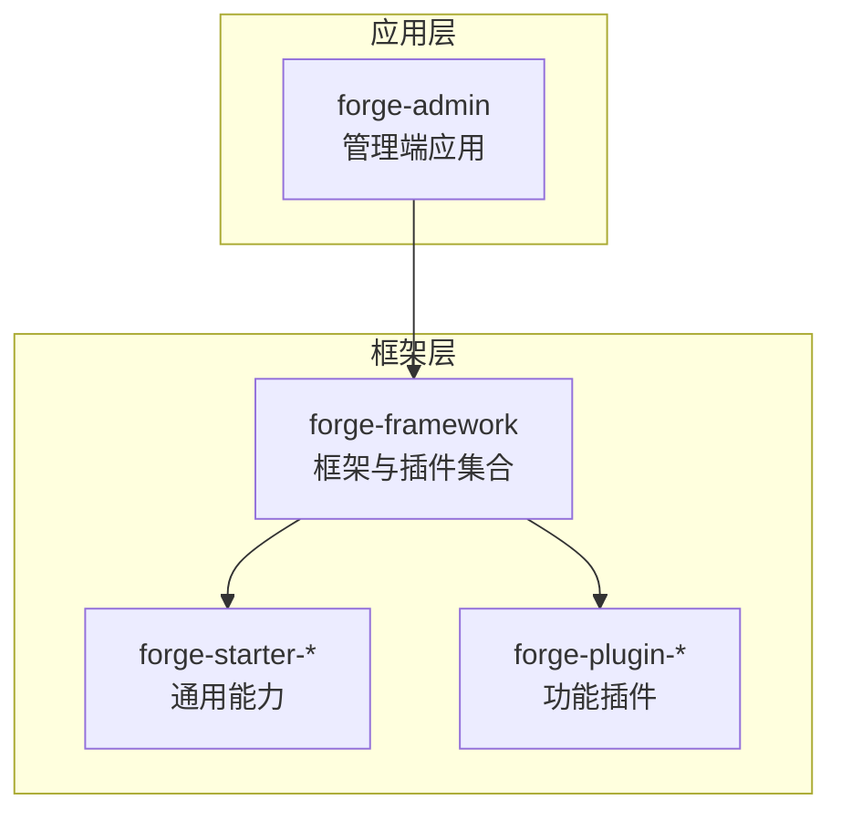
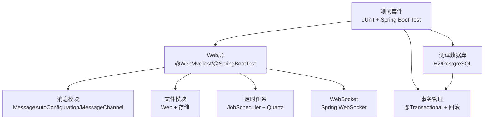
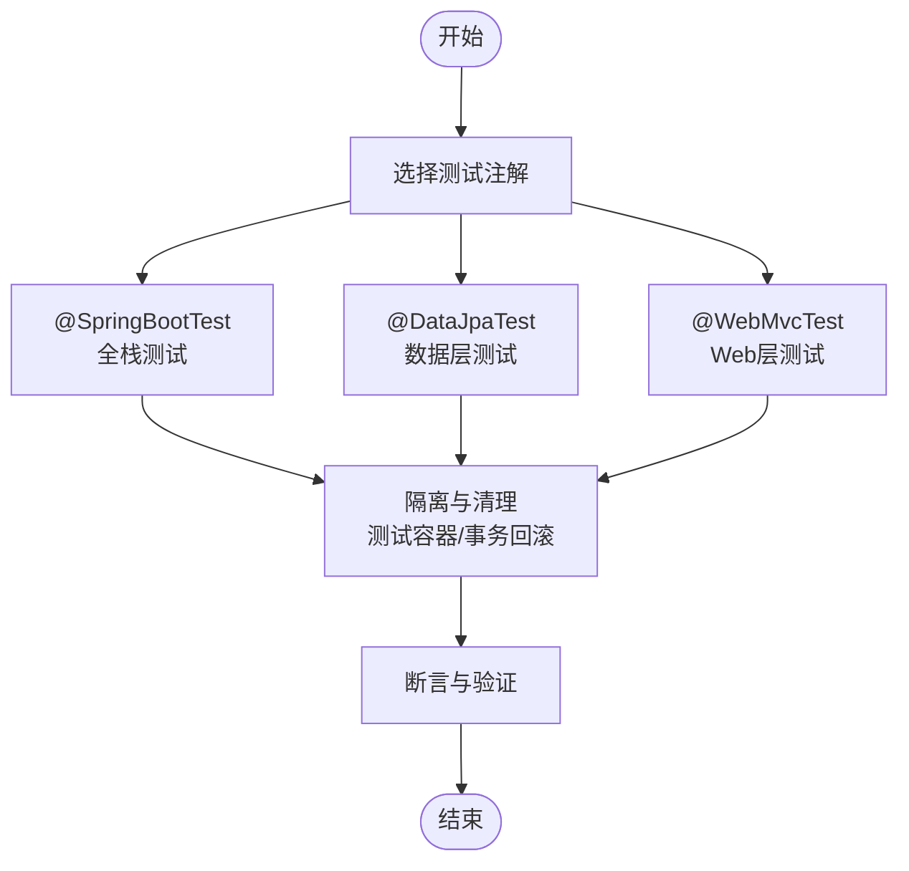
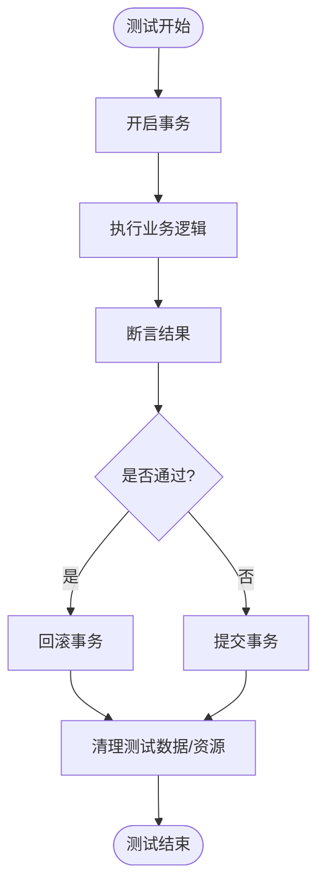
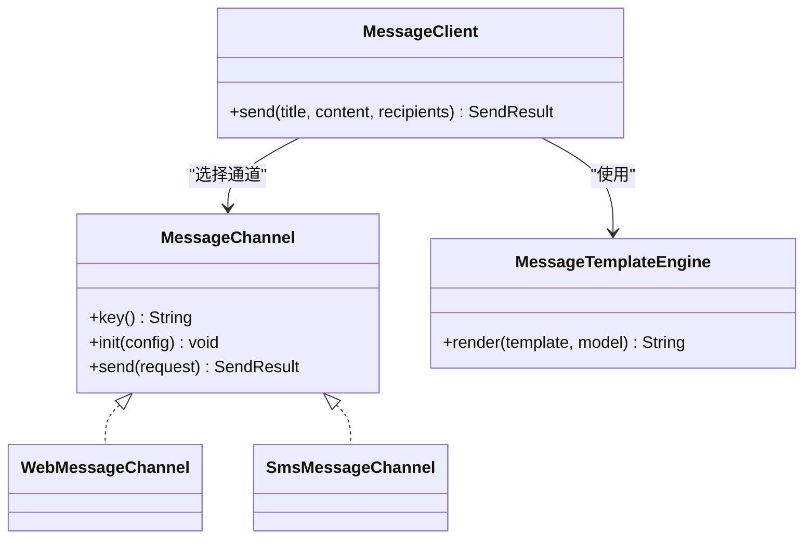
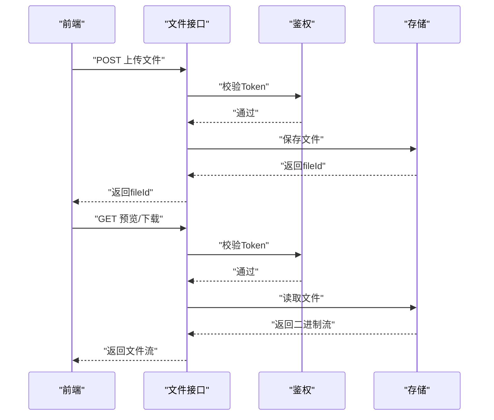
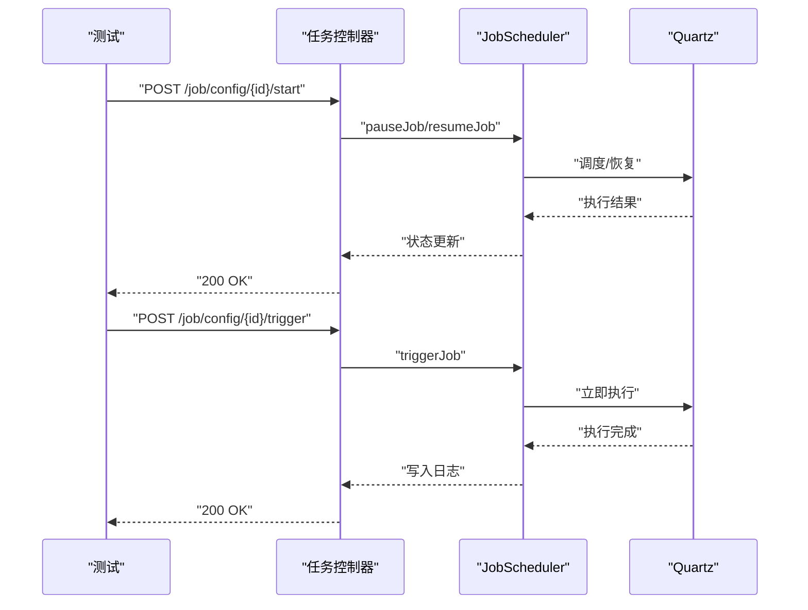
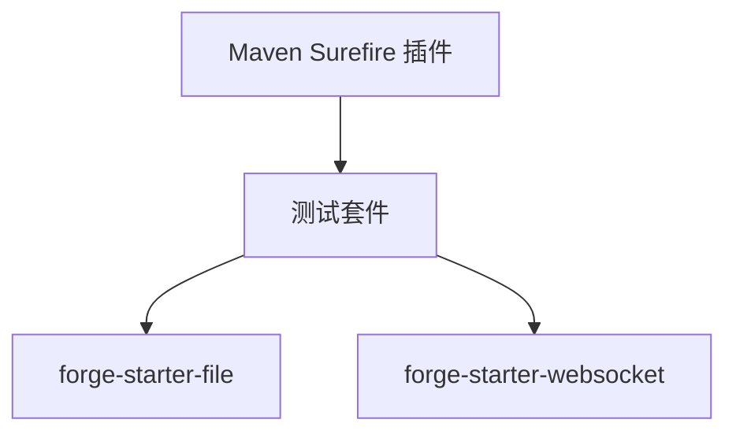

# 集成测试

<cite>
**本文引用的文件**
- [application.yml](file://forge/forge-admin/src/main/resources/application.yml)
- [application-datascope-example.yml](file://forge/forge-framework/forge-starter-parent/forge-starter-datascope/src/main/resources/application-datascope-example.yml)
- [forge-starter-file/pom.xml](file://forge/forge-framework/forge-starter-parent/forge-starter-file/pom.xml)
- [forge-starter-websocket/pom.xml](file://forge/forge-framework/forge-starter-parent/forge-starter-websocket/pom.xml)
- [MessageAutoConfiguration.java](file://forge/forge-framework/forge-starter-parent/forge-starter-message/src/main/java/com/mdframe/forge/starter/message/config/MessageAutoConfiguration.java)
- [MessageChannel.java](file://forge/forge-framework/forge-starter-parent/forge-starter-message/src/main/java/com/mdframe/forge/starter/message/channel/MessageChannel.java)
- [SmsMessageChannel.java](file://forge/forge-framework/forge-starter-parent/forge-starter-message/src/main/java/com/mdframe/forge/starter/message/channel/SmsMessageChannel.java)
- [JobScheduler.java](file://forge/forge-framework/forge-plugin-parent/forge-plugin-job/src/main/java/com/mdframe/forge/plugin/job/scheduler/JobScheduler.java)
- [API.md](file://forge/forge-framework/forge-starter-parent/forge-starter-job/API.md)
- [file-list.vue](file://forge-admin-ui/src/views/system/file-list.vue)
- [file.js](file://forge-admin-ui/src/utils/file.js)
- [FILE_URL_GUIDE.md](file://forge-admin-ui/FILE_URL_GUIDE.md)
- [.flattened-pom.xml](file://forge/.flattened-pom.xml)
</cite>

## 目录
1. [简介](#简介)
2. [项目结构](#项目结构)
3. [核心组件](#核心组件)
4. [架构总览](#架构总览)
5. [详细组件分析](#详细组件分析)
6. [依赖分析](#依赖分析)
7. [性能考虑](#性能考虑)
8. [故障排查指南](#故障排查指南)
9. [结论](#结论)
10. [附录](#附录)

## 简介
本指南面向Forge框架的集成测试实践，围绕Spring Boot测试注解、测试数据库与事务管理、外部服务与消息队列、文件上传下载、定时任务、WebSocket通信等主题，提供可落地的测试策略与流程建议。文档同时覆盖测试数据清理、测试隔离、环境配置、日志分析与性能基准测试，帮助验证模块间协作与系统整体功能。

## 项目结构
Forge采用多模块Maven工程，核心模块包括：
- forge-admin：管理端应用，承载Web层与业务入口
- forge-framework：框架与插件集合，包含starter与plugin两大类
  - forge-starter-*：通用能力封装（如文件、WebSocket、消息、定时任务等）
  - forge-plugin-*：功能插件（如作业调度、生成器等）

**章节来源**
- file://forge/forge-admin/src/main/resources/application.yml#L1-L100
- file://forge/forge-framework/forge-starter-parent/forge-starter-file/pom.xml#L1-L47
- file://forge/forge-framework/forge-starter-parent/forge-starter-websocket/pom.xml#L1-L34

## 核心组件
- 测试注解与运行环境
  - Spring Boot Test：提供@SpringBootTest、@DataJpaTest、@WebMvcTest等注解，分别用于全栈集成、数据层轻量测试与Web层测试
  - Maven Surefire：通过Surefire插件配置分组与排除，便于按环境/场景执行测试
- 测试数据库与事务
  - 使用测试专用数据库（如H2/PostgreSQL），结合事务回滚或测试容器（Testcontainers）实现隔离与可重复性
  - 通过@AutoConfigureTestDatabase与@ImportAutoConfiguration控制数据源与自动装配
- 外部服务与消息
  - 消息通道抽象：MessageChannel接口与MessageAutoConfiguration自动装配，便于替换为Web/SMS等通道进行集成测试
- 文件与WebSocket
  - 文件模块：基于Web层与文件存储能力，结合前端上传/下载流程进行端到端测试
  - WebSocket：基于Spring WebSocket Starter，支持实时通信测试

**章节来源**
- file://forge/.flattened-pom.xml#L163-L172
- file://forge/forge-framework/forge-starter-parent/forge-starter-message/src/main/java/com/mdframe/forge/starter/message/config/MessageAutoConfiguration.java#L14-L46
- file://forge/forge-framework/forge-starter-parent/forge-starter-message/src/main/java/com/mdframe/forge/starter/message/channel/MessageChannel.java#L1-L40

## 架构总览
下图展示集成测试涉及的关键组件与交互关系：

**图表来源**
- [MessageAutoConfiguration.java](file://forge/forge-framework/forge-starter-parent/forge-starter-message/src/main/java/com/mdframe/forge/starter/message/config/MessageAutoConfiguration.java#L14-L46)
- [JobScheduler.java](file://forge/forge-framework/forge-plugin-parent/forge-plugin-job/src/main/java/com/mdframe/forge/plugin/job/scheduler/JobScheduler.java#L1-L219)
- [forge-starter-file/pom.xml](file://forge/forge-framework/forge-starter-parent/forge-starter-file/pom.xml#L1-L47)
- [forge-starter-websocket/pom.xml](file://forge/forge-framework/forge-starter-parent/forge-starter-websocket/pom.xml#L1-L34)

## 详细组件分析

### 测试注解与使用场景
- @SpringBootTest
  - 场景：全栈集成测试，启动完整ApplicationContext，适合端到端验证
  - 建议：配合@TestPropertySource或@ActiveProfiles切换测试环境；使用@AutoConfigureTestDatabase避免真实数据库污染
- @DataJpaTest
  - 场景：仅测试JPA/Repository层，自动配置数据源与实体管理器，适合数据库层快速验证
  - 建议：与@Rollback或事务隔离配合，确保测试后状态一致
- @WebMvcTest
  - 场景：仅测试Web层（控制器、适配器、异常处理器），适合验证HTTP接口行为
  - 建议：通过MockBean注入服务层依赖，隔离外部系统

**章节来源**
- file://forge/.flattened-pom.xml#L163-L172

### 测试数据库与事务管理
- 数据库配置
  - 在测试环境使用内存数据库或专用测试数据库，避免与生产数据冲突
  - 可通过@AutoConfigureTestDatabase与@ImportAutoConfiguration控制自动装配
- 事务策略
  - 使用@Transaction与@Rollback实现测试后回滚
  - 对于批量测试，可使用嵌套事务或分批提交以提升性能
- 数据清理
  - 建议在@BeforeEach/@AfterEach中执行SQL清理或使用Flyway/Hibernate Schema工具重置
  - 对于文件/消息等外部资源，使用临时目录与模拟服务

**章节来源**
- file://forge/forge-framework/forge-starter-parent/forge-starter-datascope/src/main/resources/application-datascope-example.yml#L1-L10

### 外部服务与消息队列测试
- 消息通道抽象
  - MessageChannel接口定义统一发送契约，MessageAutoConfiguration按配置装配不同通道（如Web/SMS）
  - 测试时可用Mock实现或本地通道替代真实第三方网关
- 集成策略
  - 使用@ImportAutoConfiguration引入MessageAutoConfiguration，通过@MockBean替换真实通道
  - 验证消息模板引擎、路由规则与发送结果

**图表来源**
- [MessageAutoConfiguration.java](file://forge/forge-framework/forge-starter-parent/forge-starter-message/src/main/java/com/mdframe/forge/starter/message/config/MessageAutoConfiguration.java#L14-L46)
- [MessageChannel.java](file://forge/forge-framework/forge-starter-parent/forge-starter-message/src/main/java/com/mdframe/forge/starter/message/channel/MessageChannel.java#L1-L40)
- [SmsMessageChannel.java](file://forge/forge-framework/forge-starter-parent/forge-starter-message/src/main/java/com/mdframe/forge/starter/message/channel/SmsMessageChannel.java#L1-L15)

**章节来源**
- file://forge/forge-framework/forge-starter-parent/forge-starter-message/src/main/java/com/mdframe/forge/starter/message/config/MessageAutoConfiguration.java#L14-L46
- file://forge/forge-framework/forge-starter-parent/forge-starter-message/src/main/java/com/mdframe/forge/starter/message/channel/MessageChannel.java#L1-L40
- file://forge/forge-framework/forge-starter-parent/forge-starter-message/src/main/java/com/mdframe/forge/starter/message/channel/SmsMessageChannel.java#L1-L15

### 文件上传下载测试
- 前端流程
  - 上传：前端组件触发上传，成功后刷新列表
  - 下载/预览：通过getFileUrl生成带Token的访问URL，后端校验权限并返回文件流
- 测试要点
  - 验证鉴权头（Authorization Bearer Token）、文件大小限制、Multipart解析
  - 验证下载接口返回正确Content-Type与Content-Disposition
  - 验证预览接口返回Blob并能正确渲染

**图表来源**
- [file-list.vue](file://forge-admin-ui/src/views/system/file-list.vue#L768-L835)
- [file.js](file://forge-admin-ui/src/utils/file.js#L1-L33)
- [FILE_URL_GUIDE.md](file://forge-admin-ui/FILE_URL_GUIDE.md#L144-L169)

**章节来源**
- file://forge-admin-ui/src/views/system/file-list.vue#L768-L835
- file://forge-admin-ui/src/utils/file.js#L1-L33
- file://forge-admin-ui/FILE_URL_GUIDE.md#L144-L169
- file://forge/forge-admin/src/main/resources/application.yml#L41-L47

### 定时任务执行测试
- 组件与接口
  - JobScheduler封装Quartz操作，提供任务增删改查、暂停/恢复、立即触发与Cron热更新
  - API文档定义了任务管理与日志查询的REST接口
- 测试策略
  - 使用@ImportAutoConfiguration加载Job相关配置
  - 通过Mock或本地执行器Handler验证任务调度与日志记录
  - 验证Cron表达式更新后的触发行为

**图表来源**
- [JobScheduler.java](file://forge/forge-framework/forge-plugin-parent/forge-plugin-job/src/main/java/com/mdframe/forge/plugin/job/scheduler/JobScheduler.java#L1-L219)
- [API.md](file://forge/forge-framework/forge-starter-parent/forge-starter-job/API.md#L91-L184)

**章节来源**
- file://forge/forge-framework/forge-plugin-parent/forge-plugin-job/src/main/java/com/mdframe/forge/plugin/job/scheduler/JobScheduler.java#L1-L219
- file://forge/forge-framework/forge-starter-parent/forge-starter-job/API.md#L91-L184

### WebSocket通信测试
- 组件与依赖
  - 通过Spring WebSocket Starter提供基础能力，结合核心starter与加密工具
- 测试要点
  - 建立WebSocket连接，发送/接收消息，验证鉴权与路由
  - 使用模拟服务或本地通道验证消息推送链路

**图表来源**
- [forge-starter-websocket/pom.xml](file://forge/forge-framework/forge-starter-parent/forge-starter-websocket/pom.xml#L1-L34)

**章节来源**
- file://forge/forge-framework/forge-starter-parent/forge-starter-websocket/pom.xml#L1-L34

## 依赖分析
- 测试运行与分组
  - Maven Surefire插件配置groups/excludedGroups，便于按环境/场景执行测试
- 模块依赖
  - 文件模块依赖Web与核心starter
  - WebSocket模块依赖Spring WebSocket Starter与核心starter

**图表来源**
- [.flattened-pom.xml](file://forge/.flattened-pom.xml#L163-L172)
- [forge-starter-file/pom.xml](file://forge/forge-framework/forge-starter-parent/forge-starter-file/pom.xml#L1-L47)
- [forge-starter-websocket/pom.xml](file://forge/forge-framework/forge-starter-parent/forge-starter-websocket/pom.xml#L1-L34)

**章节来源**
- file://forge/.flattened-pom.xml#L163-L172
- file://forge/forge-framework/forge-starter-parent/forge-starter-file/pom.xml#L1-L47
- file://forge/forge-framework/forge-starter-parent/forge-starter-websocket/pom.xml#L1-L34

## 性能考虑
- 测试并发与隔离
  - 使用测试容器或并行数据库实例，避免锁竞争
  - 控制测试粒度，优先使用@WebMvcTest与@DataJpaTest加速反馈
- 基准测试
  - 对关键接口（文件上传/下载、消息发送、任务调度）进行压力测试，记录吞吐与延迟
  - 使用JMH或Spring Benchmark进行热点方法基准评估
- 日志与监控
  - 在测试中开启必要日志级别，定位慢查询与异常
  - 结合指标埋点（如Prometheus）观察测试期间的资源占用

## 故障排查指南
- 测试失败常见原因
  - 数据库状态未清理：检查事务回滚与清理脚本
  - 外部服务未Mock：确认@MockBean与自动装配
  - 文件接口鉴权失败：核对Authorization头与Token有效期
  - WebSocket连接异常：检查握手路径与安全配置
- 日志分析
  - 关注消息通道发送结果、任务调度日志与文件访问日志
  - 使用测试报告聚合工具（如Allure）归档失败用例与堆栈
- 性能问题定位
  - 通过Profiler识别热点方法与阻塞点
  - 对比不同Cron频率下的任务执行耗时

## 结论
通过合理选择测试注解、严格的数据与事务管理、对外部服务与消息通道的抽象与Mock、以及对文件与WebSocket的端到端验证，Forge框架可以建立稳定可靠的集成测试体系。配合性能基准与日志分析，能够持续保障模块协作与系统整体功能的稳定性与可维护性。

## 附录
- 测试环境配置建议
  - 使用独立测试数据库与专用Schema，避免与生产/开发环境冲突
  - 通过@ActiveProfiles与@TestPropertySource切换配置
- 测试数据准备
  - 使用SQL脚本或Fixtures初始化基础数据，确保测试可重复
- 最佳实践清单
  - 每个测试职责单一，断言明确
  - 使用Mock减少外部依赖，提高稳定性
  - 定期清理测试数据与临时资源
  - 对关键路径进行性能回归测试