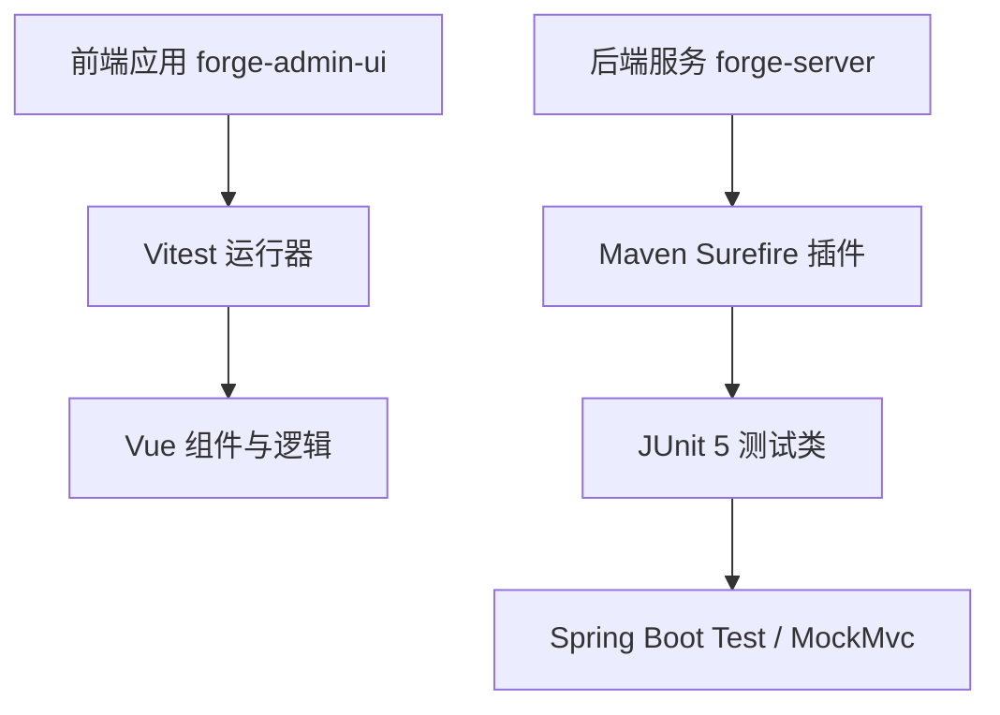
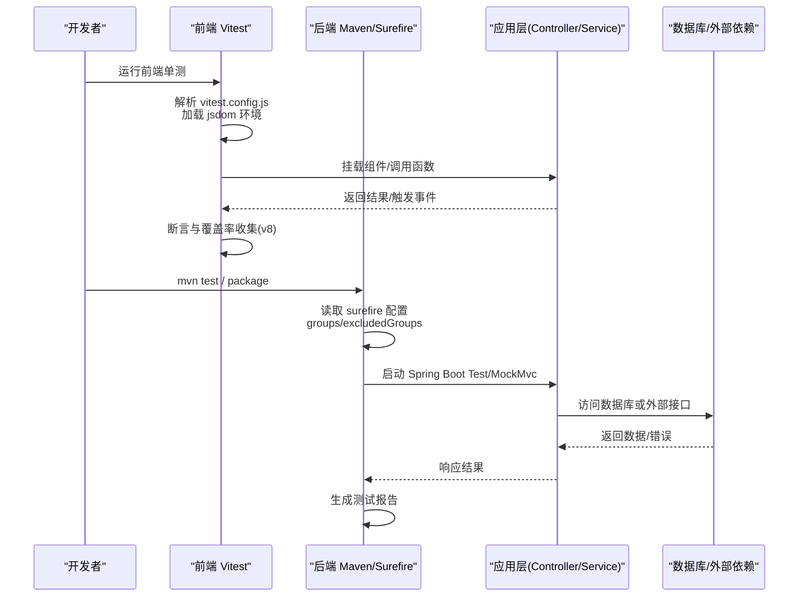
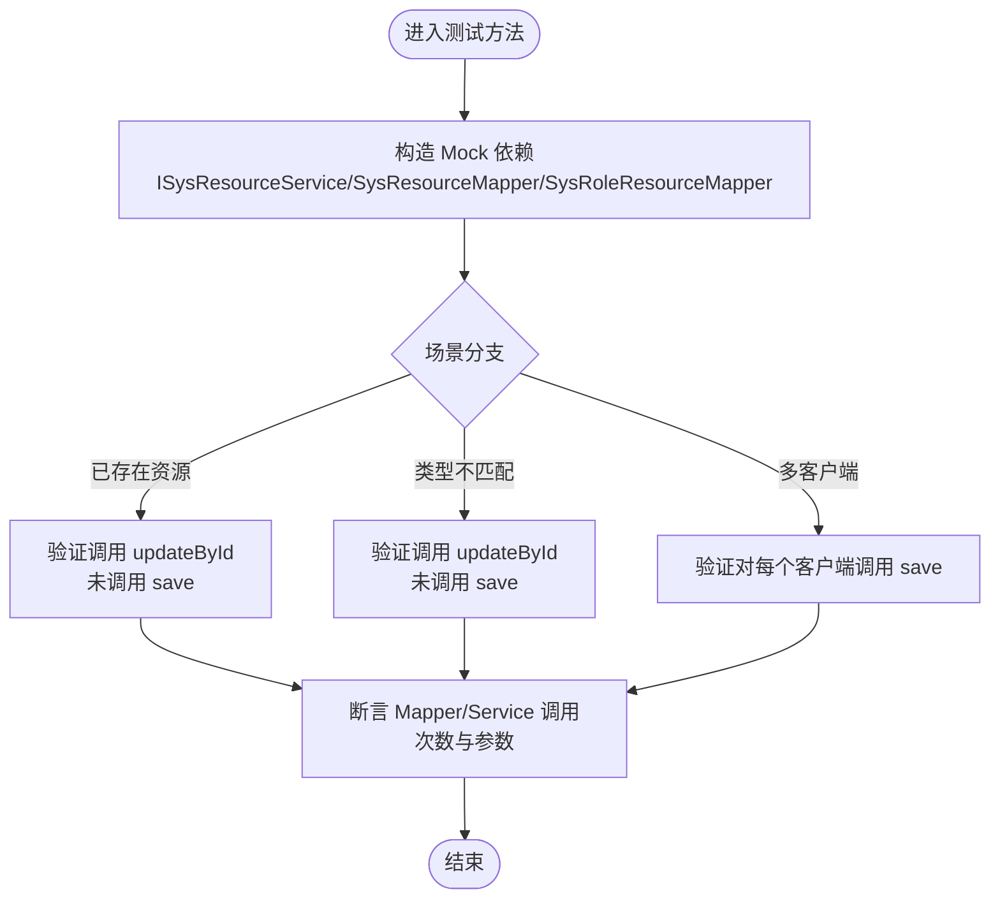
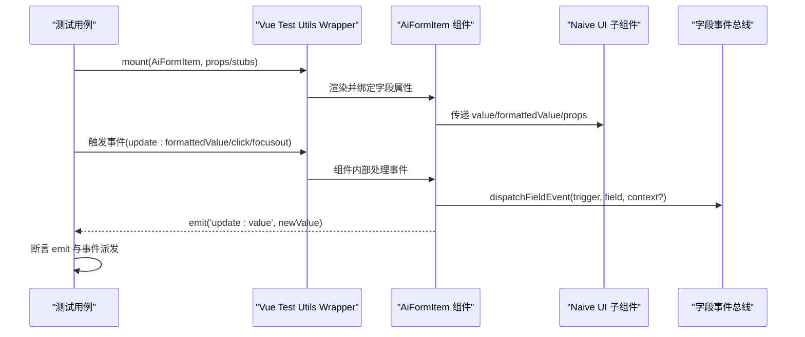
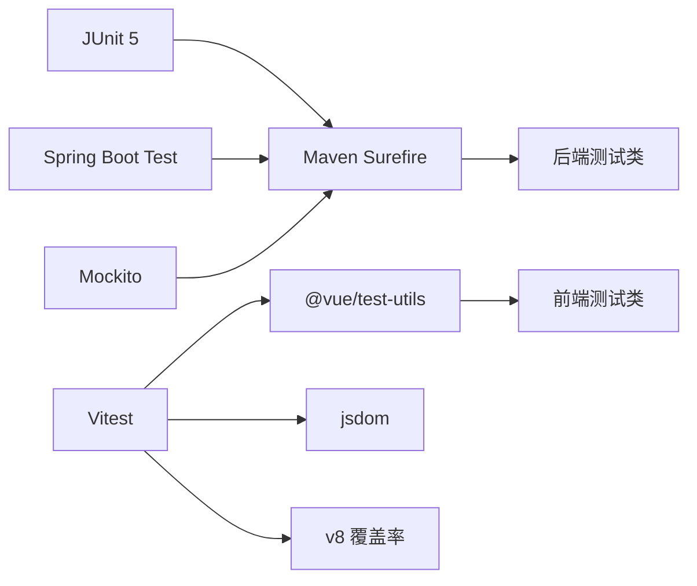

# 测试规范

<cite>
**本文引用的文件**
- [forge-server/pom.xml](file://forge-server/pom.xml)
- [automated-testing-standard.md](file://code-copilot/rules/automated-testing-standard.md)
- [vitest.config.js](file://forge-admin-ui/vitest.config.js)
- [package.json](file://forge-admin-ui/package.json)
- [MenuRegisterAdapterImplTest.java](file://forge-server/forge-admin-server/src/test/java/com/mdframe/forge/admin/bridge/MenuRegisterAdapterImplTest.java)
- [AiFormItem.spec.js](file://forge-admin-ui/src/components/ai-form/__tests__/AiFormItem.spec.js)
</cite>

## 目录
1. [简介](#简介)
2. [项目结构](#项目结构)
3. [核心组件](#核心组件)
4. [架构总览](#架构总览)
5. [详细组件分析](#详细组件分析)
6. [依赖关系分析](#依赖关系分析)
7. [性能考虑](#性能考虑)
8. [故障排查指南](#故障排查指南)
9. [结论](#结论)
10. [附录](#附录)

## 简介
本规范面向 Forge Admin 项目的后端与前端测试，统一单元测试、集成测试、端到端测试的编写标准与执行流程。后端基于 Maven + JUnit 5 + Spring Boot Test；前端基于 Vitest + Vue Test Utils + jsdom。文档覆盖：
- 测试分层与职责边界
- 用例设计原则（命名、断言、隔离、可重复）
- 异步测试处理（Promise、事件、定时器）
- 数据库与 API 测试策略（Mock、内存库、契约测试）
- Mock 数据生成与固定种子数据
- 覆盖率目标与报告输出
- 本地环境搭建、持续集成配置与报告分析

## 项目结构
Forge Admin 采用前后端分离的多模块工程：
- 后端：Maven 多模块，使用 maven-surefire-plugin 管理测试执行，支持按标签分组执行，提供 enable-tests 构建 Profile 控制编译与测试开关。
- 前端：Vite + Vitest，独立 vitest.config.js 以最小化插件依赖提升单测启动速度，jsdom 提供浏览器 DOM API，仅对 flow-designer 等关键目录开启覆盖率统计。

图表来源
- [forge-server/pom.xml:240-253](file://forge-server/pom.xml#L240-L253)
- [vitest.config.js:14-35](file://forge-admin-ui/vitest.config.js#L14-L35)

章节来源
- [forge-server/pom.xml:12-72](file://forge-server/pom.xml#L12-L72)
- [forge-server/pom.xml:240-253](file://forge-server/pom.xml#L240-L253)
- [vitest.config.js:14-35](file://forge-admin-ui/vitest.config.js#L14-L35)
- [package.json:6-17](file://forge-admin-ui/package.json#L6-L17)

## 核心组件
- 后端测试基座
  - 使用 JUnit 5 组织用例，结合 Mockito 进行依赖隔离与行为验证。
  - 通过 Spring Boot Test 与 MockMvc 进行控制器与装配层面的集成测试。
  - 使用 Maven Surefire 的 groups/excludedGroups 实现按标签筛选执行。
- 前端测试基座
  - 使用 Vitest 作为测试运行器，jsdom 提供 DOM 环境。
  - 使用 @vue/test-utils 挂载组件，配合 stubs/mocks 隔离 UI 框架与第三方依赖。
  - 覆盖率由 v8 提供者生成 HTML 与文本报告，范围限定在关键业务组件目录。

章节来源
- [MenuRegisterAdapterImplTest.java:1-120](file://forge-server/forge-admin-server/src/test/java/com/mdframe/forge/admin/bridge/MenuRegisterAdapterImplTest.java#L1-L120)
- [AiFormItem.spec.js:1-268](file://forge-admin-ui/src/components/ai-form/__tests__/AiFormItem.spec.js#L1-L268)
- [forge-server/pom.xml:240-253](file://forge-server/pom.xml#L240-L253)
- [vitest.config.js:14-35](file://forge-admin-ui/vitest.config.js#L14-L35)

## 架构总览
下图展示从代码到测试执行的完整链路，包括后端 Maven 构建与 Surefire 执行、前端 Vitest 运行与覆盖率收集。

图表来源
- [forge-server/pom.xml:240-253](file://forge-server/pom.xml#L240-L253)
- [vitest.config.js:14-35](file://forge-admin-ui/vitest.config.js#L14-L35)

## 详细组件分析

### 后端单元测试：菜单注册适配器
该测试聚焦于菜单资源同步逻辑在不同场景下的行为：
- 已存在客户端资源时执行更新而非插入
- 历史资源类型不匹配时执行更新而非插入
- 同一权限可同时投影到多个客户端

图表来源
- [MenuRegisterAdapterImplTest.java:22-94](file://forge-server/forge-admin-server/src/test/java/com/mdframe/forge/admin/bridge/MenuRegisterAdapterImplTest.java#L22-L94)

章节来源
- [MenuRegisterAdapterImplTest.java:1-120](file://forge-server/forge-admin-server/src/test/java/com/mdframe/forge/admin/bridge/MenuRegisterAdapterImplTest.java#L1-L120)

### 前端组件测试：AI 表单项
该测试覆盖数字字段约束传递、日期格式化存储、字段事件派发与扫码回调等关键路径：
- 数字输入框正确转发 min/max/step 等约束
- 年份/日期范围以格式化字符串绑定与回传
- 字段事件通过共享入口派发 BLUR、SCAN_COMPLETE、MANUAL
- 扫码完成后写入值并派发上下文

图表来源
- [AiFormItem.spec.js:59-144](file://forge-admin-ui/src/components/ai-form/__tests__/AiFormItem.spec.js#L59-L144)
- [AiFormItem.spec.js:146-268](file://forge-admin-ui/src/components/ai-form/__tests__/AiFormItem.spec.js#L146-L268)

章节来源
- [AiFormItem.spec.js:1-268](file://forge-admin-ui/src/components/ai-form/__tests__/AiFormItem.spec.js#L1-L268)

### 测试环境与工具链
- 后端
  - 使用 Maven Surefire 执行 JUnit 5 测试，支持 groups/excludedGroups 过滤。
  - 通过 Profile enable-tests 关闭跳过标志，启用测试编译与执行。
- 前端
  - Vitest 独立配置文件避免加载生产构建插件，提升单测启动速度。
  - jsdom 环境提供 DOMParser、document、EventTarget 等浏览器 API。
  - 覆盖率使用 v8 提供者，输出 text/html 报告，范围限定在 flow-designer 相关组件。

章节来源
- [forge-server/pom.xml:102-127](file://forge-server/pom.xml#L102-L127)
- [forge-server/pom.xml:240-253](file://forge-server/pom.xml#L240-L253)
- [vitest.config.js:14-35](file://forge-admin-ui/vitest.config.js#L14-L35)
- [package.json:6-17](file://forge-admin-ui/package.json#L6-L17)

## 依赖关系分析
- 后端测试依赖
  - JUnit 5、Spring Boot Test、Mockito、MockMvc（通过 spring-boot-starter-test）。
  - Surefire 插件负责测试发现与执行，支持按标签分组。
- 前端测试依赖
  - Vitest、@vue/test-utils、jsdom、v8 覆盖率提供者。
  - 通过 vitest.config.js 中的 alias 与 include 控制解析与扫描范围。

图表来源
- [forge-server/pom.xml:240-253](file://forge-server/pom.xml#L240-L253)
- [vitest.config.js:14-35](file://forge-admin-ui/vitest.config.js#L14-L35)

章节来源
- [forge-server/pom.xml:240-253](file://forge-server/pom.xml#L240-L253)
- [vitest.config.js:14-35](file://forge-admin-ui/vitest.config.js#L14-L35)

## 性能考虑
- 前端单测
  - 使用独立 vitest.config.js 减少插件加载，提高启动速度。
  - 通过 stubs 替换重型 UI 组件，降低渲染开销。
  - 将覆盖率范围限制在关键目录，缩短报告生成时间。
- 后端单测
  - 使用 Mock 替代真实数据库与外部服务，避免 I/O 瓶颈。
  - 通过 Surefire 的 groups 只执行必要用例，缩短 CI 时间。
  - 合理拆分测试类，避免长事务与全局状态污染。

[本节为通用指导，无需特定文件引用]

## 故障排查指南
- 前端测试常见问题
  - 注入 Pinia Store 失败：确保使用 createTestingPinia 并配置 createSpy。
  - 路由相关报错：在测试中 mock vue-router 的 useRoute/useRouter。
  - 组件样式/布局导致断言失败：优先断言行为与 emit，而非 DOM 结构细节。
- 后端测试常见问题
  - 数据库连接失败：确认测试环境数据库可用或使用内存库/容器。
  - 事务未提交导致查询不到数据：在集成测试中使用事务回滚或明确提交。
  - 外部服务超时：使用 MockWebServer 或 WireMock 模拟响应。

章节来源
- [automated-testing-standard.md:1-134](file://code-copilot/rules/automated-testing-standard.md#L1-L134)

## 结论
Forge Admin 的测试体系以后端 JUnit + Spring Boot Test 与前端 Vitest + Vue Test Utils 为核心，借助 Maven Surefire 与 Vitest 的配置实现高效、可控的测试执行与覆盖率收集。遵循增量验证、证据优先、最小闭环的原则，可在保证质量的同时提升迭代效率。建议在各模块持续完善用例覆盖，强化契约测试与端到端验证，形成稳定的质量门禁。

[本节为总结性内容，无需特定文件引用]

## 附录

### 测试分层与职责
- 单元测试
  - 后端：针对 Service/Adapter/工具类的纯逻辑验证，使用 Mockito 隔离依赖。
  - 前端：针对组件/组合式函数的输入输出与副作用验证，使用 stubs/mocks。
- 集成测试
  - 后端：使用 Spring Boot Test + MockMvc 验证控制器装配、鉴权、序列化等。
  - 前端：跨组件交互与状态管理验证，必要时 mock 网络请求。
- 端到端测试
  - 通过启动服务与真实/容器数据库，验证用户主路径流程。
  - 结合脚本或自动化平台执行关键场景，记录执行证据。

### 用例设计原则
- 命名清晰：描述“场景_期望结果”，如 existingClientResourceIsUpdatedInsteadOfInserted。
- 单一职责：一个测试只验证一个行为分支。
- 可重复：不依赖外部状态，使用固定种子数据或 Mock。
- 断言精确：断言返回值、副作用、事件派发与外部调用。

### 异步测试处理
- 前端：使用 async/await 等待 Promise，使用 nextTick 等待视图更新，监听事件后再断言。
- 后端：对异步任务使用 await/CountDownLatch/StepVerifier（若使用 Reactor），或在集成测试中等待任务完成。

### 数据库测试最佳实践
- 使用 Flyway 管理迁移，测试前准备干净 schema。
- 使用内存数据库或 Docker 容器，避免污染本地环境。
- 使用事务包裹测试，结束后自动回滚。
- 对 SQL 变更进行静态检查，避免误用占位符。

### API 测试最佳实践
- 使用 MockMvc 发起请求，断言状态码、响应体与 Header。
- 对鉴权与权限校验进行边界测试，包括内部调用头与普通用户调用。
- 对外部依赖使用 MockWebServer/WireMock，确保稳定与快速。

### Mock 数据生成
- 使用工厂方法或 Faker 生成随机但合法的数据。
- 对枚举、字典、外键关联使用固定集合，保证可复现。
- 对敏感信息脱敏，避免泄露。

### 覆盖率要求与报告
- 前端：v8 提供者，输出 text/html，范围限定关键目录。
- 后端：可引入 JaCoCo 生成覆盖率报告，设定最低阈值作为质量门禁。
- 报告纳入 CI 流水线，失败时阻断合并。

### 环境搭建与执行命令
- 后端
  - 使用 Maven Profile enable-tests 启用测试编译与执行。
  - 通过 surefire 的 groups 指定执行范围。
- 前端
  - 使用 pnpm test 运行 Vitest，pnpm test:ui 打开可视化界面。
  - 使用 pnpm build 验证构建稳定性。

章节来源
- [forge-server/pom.xml:102-127](file://forge-server/pom.xml#L102-L127)
- [forge-server/pom.xml:240-253](file://forge-server/pom.xml#L240-L253)
- [vitest.config.js:14-35](file://forge-admin-ui/vitest.config.js#L14-L35)
- [package.json:6-17](file://forge-admin-ui/package.json#L6-L17)
- [automated-testing-standard.md:81-123](file://code-copilot/rules/automated-testing-standard.md#L81-L123)

### 持续集成配置建议
- 阶段化执行：先运行前端构建与单测，再运行后端编译与单测，最后执行集成/E2E。
- 缓存依赖：缓存 node_modules 与 Maven 仓库，缩短构建时间。
- 并行执行：按模块并行运行测试，聚合报告。
- 质量门禁：设置覆盖率阈值与失败阻断，发布前必须通过。

[本节为通用指导，无需特定文件引用]

### 测试报告分析
- 前端：查看 Vitest 控制台输出与 HTML 报告，定位失败用例与未覆盖分支。
- 后端：查看 Surefire 报告，关注失败堆栈与慢用例。
- 趋势分析：跟踪覆盖率变化与失败回归，持续改进。

[本节为通用指导，无需特定文件引用]