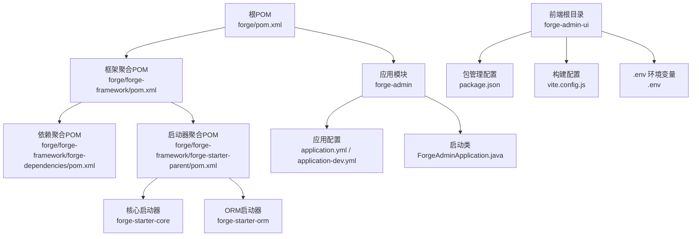
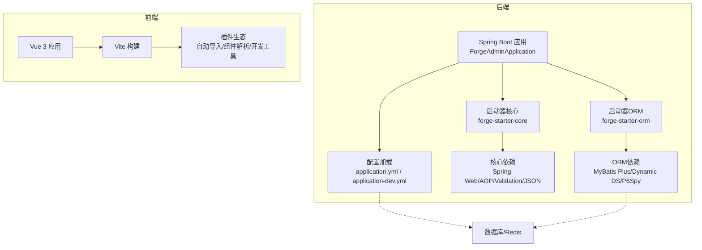
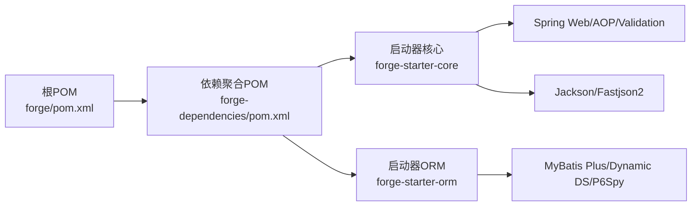

# 版本升级

<cite>
**本文引用的文件**
- [forge/pom.xml](file://forge/pom.xml)
- [forge/forge-framework/pom.xml](file://forge/forge-framework/pom.xml)
- [forge/forge-framework/forge-dependencies/pom.xml](file://forge/forge-framework/forge-dependencies/pom.xml)
- [forge/forge-framework/forge-starter-parent/pom.xml](file://forge/forge-framework/forge-starter-parent/pom.xml)
- [forge/forge-framework/forge-starter-parent/forge-starter-core/pom.xml](file://forge/forge-framework/forge-starter-parent/forge-starter-core/pom.xml)
- [forge/forge-framework/forge-starter-parent/forge-starter-orm/pom.xml](file://forge/forge-framework/forge-starter-parent/forge-starter-orm/pom.xml)
- [forge/forge-admin/src/main/resources/application.yml](file://forge/forge-admin/src/main/resources/application.yml)
- [forge/forge-admin/src/main/resources/application-dev.yml](file://forge/forge-admin/src/main/resources/application-dev.yml)
- [forge/forge-admin/src/main/java/com/mdframe/forge/admin/ForgeAdminApplication.java](file://forge/forge-admin/src/main/java/com/mdframe/forge/admin/ForgeAdminApplication.java)
- [forge-admin-ui/package.json](file://forge-admin-ui/package.json)
- [forge-admin-ui/vite.config.js](file://forge-admin-ui/vite.config.js)
- [forge-admin-ui/.env](file://forge-admin-ui/.env)
</cite>

## 目录
1. [简介](#简介)
2. [项目结构](#项目结构)
3. [核心组件](#核心组件)
4. [架构总览](#架构总览)
5. [详细组件分析](#详细组件分析)
6. [依赖关系分析](#依赖关系分析)
7. [性能考量](#性能考量)
8. [故障排查指南](#故障排查指南)
9. [结论](#结论)
10. [附录](#附录)

## 简介
本指南面向Forge框架的版本升级，覆盖后端（Spring Boot、MyBatis Plus）、前端（Vue 3/Vite）以及第三方组件的升级流程与注意事项。内容包括升级准备、升级步骤、依赖冲突解决、配置迁移、API变更适配、破坏性变更处理、向后兼容策略、回滚方案、升级检查清单、升级日志与验证方法等，确保系统平滑升级并保持功能完整性。

## 项目结构
Forge采用多模块Maven聚合工程组织，后端由“应用模块+框架模块”构成；前端为独立的Vue 3单页应用。后端通过统一的依赖管理与版本属性集中控制，前端通过包管理器统一升级依赖。

图表来源
- [forge/pom.xml](file://forge/pom.xml#L1-L259)
- [forge/forge-framework/pom.xml](file://forge/forge-framework/pom.xml#L1-L117)
- [forge/forge-framework/forge-dependencies/pom.xml](file://forge/forge-framework/forge-dependencies/pom.xml#L1-L487)
- [forge/forge-framework/forge-starter-parent/pom.xml](file://forge/forge-framework/forge-starter-parent/pom.xml#L1-L37)
- [forge/forge-admin/src/main/resources/application.yml](file://forge/forge-admin/src/main/resources/application.yml#L1-L100)
- [forge/forge-admin/src/main/resources/application-dev.yml](file://forge/forge-admin/src/main/resources/application-dev.yml#L1-L70)
- [forge/forge-admin/src/main/java/com/mdframe/forge/admin/ForgeAdminApplication.java](file://forge/forge-admin/src/main/java/com/mdframe/forge/admin/ForgeAdminApplication.java#L1-L18)
- [forge-admin-ui/package.json](file://forge-admin-ui/package.json#L1-L69)
- [forge-admin-ui/vite.config.js](file://forge-admin-ui/vite.config.js#L1-L86)
- [forge-admin-ui/.env](file://forge-admin-ui/.env#L1-L26)

章节来源
- [forge/pom.xml](file://forge/pom.xml#L1-L259)
- [forge/forge-framework/pom.xml](file://forge/forge-framework/pom.xml#L1-L117)
- [forge/forge-framework/forge-dependencies/pom.xml](file://forge/forge-framework/forge-dependencies/pom.xml#L1-L487)
- [forge/forge-framework/forge-starter-parent/pom.xml](file://forge/forge-framework/forge-starter-parent/pom.xml#L1-L37)
- [forge/forge-admin/src/main/resources/application.yml](file://forge/forge-admin/src/main/resources/application.yml#L1-L100)
- [forge/forge-admin/src/main/resources/application-dev.yml](file://forge/forge-admin/src/main/resources/application-dev.yml#L1-L70)
- [forge/forge-admin/src/main/java/com/mdframe/forge/admin/ForgeAdminApplication.java](file://forge/forge-admin/src/main/java/com/mdframe/forge/admin/ForgeAdminApplication.java#L1-L18)
- [forge-admin-ui/package.json](file://forge-admin-ui/package.json#L1-L69)
- [forge-admin-ui/vite.config.js](file://forge-admin-ui/vite.config.js#L1-L86)
- [forge-admin-ui/.env](file://forge-admin-ui/.env#L1-L26)

## 核心组件
- 版本属性与依赖管理
  - 后端版本属性集中在根POM与框架依赖POM中，统一管理Spring Boot、MyBatis Plus、Sa-Token、Hutool、Undertow、MapStruct等版本。
  - 通过dependencyManagement集中声明，子模块按需引入，避免版本漂移。
- 启动器模块
  - 启动器聚合模块包含核心、ORM、Web、缓存、认证、日志、事务、文件、Excel、配置、作业、ID、数据域、消息、多租户、加解密、WebSocket、API配置等子模块，按功能拆分便于复用与升级。
- 应用模块
  - 应用模块使用统一的启动类与配置文件，支持多环境配置与 Undertow 性能参数调优。
- 前端模块
  - 前端使用Vite构建，Vue 3生态，通过package.json统一管理依赖与脚本，支持代理、自动导入、组件解析、开发工具等。

章节来源
- [forge/pom.xml](file://forge/pom.xml#L12-L61)
- [forge/forge-framework/forge-dependencies/pom.xml](file://forge/forge-framework/forge-dependencies/pom.xml#L13-L70)
- [forge/forge-framework/forge-starter-parent/pom.xml](file://forge/forge-framework/forge-starter-parent/pom.xml#L15-L34)
- [forge/forge-admin/src/main/resources/application.yml](file://forge/forge-admin/src/main/resources/application.yml#L1-L100)
- [forge-admin-ui/package.json](file://forge-admin-ui/package.json#L1-L69)

## 架构总览
后端通过Spring Boot启动，加载统一依赖与启动器模块；ORM层基于MyBatis Plus与动态数据源；前端通过Vite构建，与后端接口交互。升级时需关注版本兼容性与配置迁移。

图表来源
- [forge/forge-admin/src/main/java/com/mdframe/forge/admin/ForgeAdminApplication.java](file://forge/forge-admin/src/main/java/com/mdframe/forge/admin/ForgeAdminApplication.java#L8-L10)
- [forge/forge-admin/src/main/resources/application.yml](file://forge/forge-admin/src/main/resources/application.yml#L32-L100)
- [forge/forge-framework/forge-starter-parent/forge-starter-core/pom.xml](file://forge/forge-framework/forge-starter-parent/forge-starter-core/pom.xml#L14-L122)
- [forge/forge-framework/forge-starter-parent/forge-starter-orm/pom.xml](file://forge/forge-framework/forge-starter-parent/forge-starter-orm/pom.xml#L14-L37)
- [forge-admin-ui/vite.config.js](file://forge-admin-ui/vite.config.js#L13-L84)

## 详细组件分析

### Spring Boot 版本升级
- 升级目标与影响面
  - Spring Boot版本位于根POM与框架依赖POM中，升级将影响所有受其管理的依赖（如Web、AOP、Validation、Configuration Processor等）。
  - 升级后需验证启动类、配置文件、自动配置、条件装配、测试标签分组等是否兼容。
- 升级步骤
  1) 在根POM与框架依赖POM中同步更新Spring Boot版本属性。
  2) 清理本地仓库或强制刷新依赖，排除冲突传递依赖。
  3) 编译并运行单元测试，修复不兼容API与配置项。
  4) 启动应用，验证日志级别、静态资源、国际化、多环境激活等。
  5) 运行集成测试，覆盖关键业务流程。
- 注意事项
  - 若使用spring-boot-configuration-processor，请确保版本与Spring Boot一致。
  - 验证Jackson、Validation、Servlet API等是否与新版本兼容。
  - 关注Spring Profile与资源过滤行为变化。

章节来源
- [forge/pom.xml](file://forge/pom.xml#L12-L21)
- [forge/forge-framework/forge-dependencies/pom.xml](file://forge/forge-framework/forge-dependencies/pom.xml#L13-L21)
- [forge/forge-framework/forge-starter-parent/forge-starter-core/pom.xml](file://forge/forge-framework/forge-starter-parent/forge-starter-core/pom.xml#L70-L80)
- [forge/forge-admin/src/main/resources/application.yml](file://forge/forge-admin/src/main/resources/application.yml#L23-L64)

### MyBatis Plus 版本升级
- 升级目标与影响面
  - MyBatis Plus版本位于根POM与框架依赖POM中，升级将影响ORM启动器与相关扩展。
  - 新版本可能调整注解、分页、SQL构造器、字段映射策略等。
- 升级步骤
  1) 在根POM与框架依赖POM中同步更新MyBatis Plus版本属性。
  2) 更新ORM启动器依赖声明，清理传递依赖。
  3) 编译并运行DAO层与Service层测试，修复不兼容API与注解。
  4) 验证Mapper扫描、XML映射、分页插件、性能分析插件等。
  5) 运行数据库相关集成测试，确保CRUD与事务正常。
- 注意事项
  - 关注驼峰映射、缓存、主键策略等配置是否仍有效。
  - 若使用动态数据源，请确认兼容性并更新相关配置。
  - 检查P6Spy SQL分析插件是否与新版本兼容。

章节来源
- [forge/pom.xml](file://forge/pom.xml#L19-L25)
- [forge/forge-framework/forge-dependencies/pom.xml](file://forge/forge-framework/forge-dependencies/pom.xml#L22-L28)
- [forge/forge-framework/forge-starter-parent/forge-starter-orm/pom.xml](file://forge/forge-framework/forge-starter-parent/forge-starter-orm/pom.xml#L21-L36)
- [forge/forge-admin/src/main/resources/application.yml](file://forge/forge-admin/src/main/resources/application.yml#L65-L86)

### 前端依赖升级
- 升级目标与影响面
  - 前端依赖集中在package.json中，包含Vue 3、NaiveUI、Axios、Pinia、路由、开发工具等。
  - 升级可能涉及构建工具（Vite）、插件生态、TypeScript支持、ESLint规则等。
- 升级步骤
  1) 使用包管理器升级命令更新依赖（如使用脚本或工具），或手动修改package.json。
  2) 清理node_modules与锁文件，重新安装依赖。
  3) 运行构建与预览，修复类型错误、插件冲突、样式问题。
  4) 验证代理配置、开发工具、自动导入、组件解析等功能。
  5) 运行测试与E2E，确保交互与页面渲染正常。
- 注意事项
  - 关注Vue 3与NaiveUI的兼容性，必要时同步升级。
  - 检查Vite版本与插件生态的兼容性。
  - 确保开发环境变量（.env）与构建配置（vite.config.js）正确。

章节来源
- [forge-admin-ui/package.json](file://forge-admin-ui/package.json#L1-L69)
- [forge-admin-ui/vite.config.js](file://forge-admin-ui/vite.config.js#L13-L84)
- [forge-admin-ui/.env](file://forge-admin-ui/.env#L1-L26)

### 配置文件迁移
- 后端配置迁移要点
  - 多环境配置：application.yml与application-dev.yml分别承载通用与开发环境配置，升级时需逐项核对配置项是否存在、命名是否变化、默认值是否调整。
  - Undertow参数：升级后需验证线程池、缓冲区、IO线程等参数是否仍适用。
  - Jackson与日期格式：升级后若出现序列化异常，需检查日期格式与反序列化策略。
  - Sa-Token与Redis：升级后验证Redis连接、序列化方式、Token过期策略等。
- 前端配置迁移要点
  - 构建路径与代理：升级Vite后，检查代理规则、公共路径、端口等是否仍符合预期。
  - 环境变量：新增或变更的环境变量需同步至不同环境的配置文件。
  - 插件生态：升级插件后需验证自动导入、组件解析、开发工具等是否正常。

章节来源
- [forge/forge-admin/src/main/resources/application.yml](file://forge/forge-admin/src/main/resources/application.yml#L1-L100)
- [forge/forge-admin/src/main/resources/application-dev.yml](file://forge/forge-admin/src/main/resources/application-dev.yml#L1-L70)
- [forge-admin-ui/vite.config.js](file://forge-admin-ui/vite.config.js#L56-L84)
- [forge-admin-ui/.env](file://forge-admin-ui/.env#L1-L26)

### API变更适配
- Spring Boot升级后的API变更
  - 自动配置与条件装配：升级后部分自动配置可能调整，需检查启动类与配置类是否仍生效。
  - Profile与资源过滤：升级后资源过滤行为可能变化，需验证application*.yml的加载顺序与占位符替换。
  - Servlet API：从Jakarta EE迁移到新的命名空间时，需检查相关依赖与注解。
- ORM相关API变更
  - MyBatis Plus升级后，注解、分页API、SQL构造器等可能调整，需逐项替换。
  - 动态数据源与P6Spy：升级后需验证多数据源切换与SQL日志输出。
- 前端API变更
  - Vue 3 Composition API与TypeScript：升级后需检查类型定义与API签名。
  - 插件与组件：升级后需验证组件属性、事件、插槽等是否兼容。

章节来源
- [forge/forge-framework/forge-starter-parent/forge-starter-core/pom.xml](file://forge/forge-framework/forge-starter-parent/forge-starter-core/pom.xml#L44-L48)
- [forge/forge-framework/forge-starter-parent/forge-starter-orm/pom.xml](file://forge/forge-framework/forge-starter-parent/forge-starter-orm/pom.xml#L21-L36)
- [forge-admin-ui/package.json](file://forge-admin-ui/package.json#L35-L41)

### 破坏性变更与向后兼容
- 破坏性变更识别
  - Spring Boot：关注自动配置变更、Profile激活逻辑、资源过滤策略、Servlet API命名空间迁移。
  - MyBatis Plus：关注注解与API变更、分页策略、SQL构造器行为。
  - 前端：关注Vue 3生态变更、Vite插件生态、TypeScript类型定义。
- 向后兼容策略
  - 使用依赖聚合与版本属性集中管理，确保各模块版本一致。
  - 逐步升级，先在测试环境验证，再灰度发布。
  - 保留兼容性配置与降级策略，确保关键功能可用。

章节来源
- [forge/pom.xml](file://forge/pom.xml#L12-L61)
- [forge/forge-framework/forge-dependencies/pom.xml](file://forge/forge-framework/forge-dependencies/pom.xml#L72-L112)
- [forge-admin-ui/package.json](file://forge-admin-ui/package.json#L1-L69)

### 第三方组件升级
- Sa-Token、Hutool、Redisson、Lock4J、Dynamic DS、MapStruct等均通过依赖聚合统一管理，升级时需同步更新版本属性并验证功能。
- 升级流程
  1) 在依赖聚合POM中更新对应版本属性。
  2) 清理依赖并编译，修复不兼容API。
  3) 运行认证、缓存、分布式锁、多数据源、加解密等关键功能测试。
- 冲突排查
  - 使用依赖树工具定位冲突传递依赖，必要时通过exclusions排除特定传递依赖。

章节来源
- [forge/forge-framework/forge-dependencies/pom.xml](file://forge/forge-framework/forge-dependencies/pom.xml#L13-L70)
- [forge/forge-framework/forge-starter-parent/forge-starter-core/pom.xml](file://forge/forge-framework/forge-starter-parent/forge-starter-core/pom.xml#L121-L121)
- [forge/forge-framework/forge-starter-parent/forge-starter-orm/pom.xml](file://forge/forge-framework/forge-starter-parent/forge-starter-orm/pom.xml#L21-L36)

## 依赖关系分析
后端依赖通过统一的依赖聚合POM集中管理，启动器模块按需引入核心与ORM能力；前端依赖通过package.json统一管理，Vite配置驱动构建与开发体验。

图表来源
- [forge/pom.xml](file://forge/pom.xml#L94-L112)
- [forge/forge-framework/forge-dependencies/pom.xml](file://forge/forge-framework/forge-dependencies/pom.xml#L72-L112)
- [forge/forge-framework/forge-starter-parent/forge-starter-core/pom.xml](file://forge/forge-framework/forge-starter-parent/forge-starter-core/pom.xml#L14-L122)
- [forge/forge-framework/forge-starter-parent/forge-starter-orm/pom.xml](file://forge/forge-framework/forge-starter-parent/forge-starter-orm/pom.xml#L14-L37)

章节来源
- [forge/pom.xml](file://forge/pom.xml#L94-L112)
- [forge/forge-framework/forge-dependencies/pom.xml](file://forge/forge-framework/forge-dependencies/pom.xml#L72-L112)
- [forge/forge-framework/forge-starter-parent/forge-starter-core/pom.xml](file://forge/forge-framework/forge-starter-parent/forge-starter-core/pom.xml#L14-L122)
- [forge/forge-framework/forge-starter-parent/forge-starter-orm/pom.xml](file://forge/forge-framework/forge-starter-parent/forge-starter-orm/pom.xml#L14-L37)

## 性能考量
- Undertow参数调优
  - 升级后需评估IO线程、工作线程、缓冲区大小、直接内存等参数对吞吐与延迟的影响。
- ORM性能
  - 升级MyBatis Plus后，关注分页、批量操作、SQL日志输出等性能指标。
- 前端性能
  - 升级Vite与插件后，关注构建速度、产物体积、运行时性能，必要时调整chunk策略与插件配置。

章节来源
- [forge/forge-admin/src/main/resources/application.yml](file://forge/forge-admin/src/main/resources/application.yml#L8-L22)
- [forge/forge-framework/forge-starter-parent/forge-starter-orm/pom.xml](file://forge/forge-framework/forge-starter-parent/forge-starter-orm/pom.xml#L32-L36)
- [forge-admin-ui/vite.config.js](file://forge-admin-ui/vite.config.js#L81-L84)

## 故障排查指南
- 启动失败
  - 检查Profile与资源过滤是否正确，确认application.yml与application-dev.yml加载顺序。
  - 核对启动类包扫描路径与Mapper扫描路径是否匹配。
- ORM相关错误
  - 核对MyBatis Plus版本与注解、分页API是否兼容。
  - 检查动态数据源与SQL日志插件配置。
- 前端构建/运行异常
  - 清理node_modules与锁文件，重新安装依赖。
  - 检查Vite代理、开发工具、自动导入与组件解析配置。
- 依赖冲突
  - 使用依赖树工具定位冲突传递依赖，必要时通过exclusions排除。
  - 在依赖聚合POM中统一版本，减少冲突概率。

章节来源
- [forge/forge-admin/src/main/java/com/mdframe/forge/admin/ForgeAdminApplication.java](file://forge/forge-admin/src/main/java/com/mdframe/forge/admin/ForgeAdminApplication.java#L8-L10)
- [forge/forge-admin/src/main/resources/application.yml](file://forge/forge-admin/src/main/resources/application.yml#L32-L100)
- [forge/forge-framework/forge-starter-parent/forge-starter-orm/pom.xml](file://forge/forge-framework/forge-starter-parent/forge-starter-orm/pom.xml#L21-L36)
- [forge-admin-ui/vite.config.js](file://forge-admin-ui/vite.config.js#L56-L84)

## 结论
Forge框架的版本升级应遵循“统一版本属性、集中依赖管理、逐步验证”的原则。后端重点在于Spring Boot与MyBatis Plus的兼容性与配置迁移，前端重点在于依赖生态与构建工具的稳定性。通过完善的升级检查清单、日志记录与验证流程，可显著降低升级风险，保障系统平滑过渡。

## 附录

### 升级前准备清单
- 明确升级目标版本（Spring Boot、MyBatis Plus、前端依赖）。
- 备份当前配置文件与数据库。
- 准备测试环境与灰度发布策略。
- 制定回滚方案与应急联系人。

### 升级检查清单（示例）
- 后端
  - 版本属性已更新且一致。
  - 依赖无冲突，编译通过。
  - 启动类与配置加载正常。
  - ORM功能（分页、CRUD、事务）测试通过。
  - 认证、缓存、多数据源、加解密等关键功能验证。
- 前端
  - 依赖安装成功，构建通过。
  - 代理、开发工具、自动导入、组件解析正常。
  - 页面渲染、交互、路由跳转正常。
  - 测试与E2E通过。

### 升级日志与验证方法
- 日志记录
  - 记录升级版本、变更点、测试结果、问题与修复。
- 验证方法
  - 单元测试、集成测试、端到端测试、性能回归测试。
  - 生产环境灰度发布，监控关键指标（启动时间、QPS、错误率、延迟）。