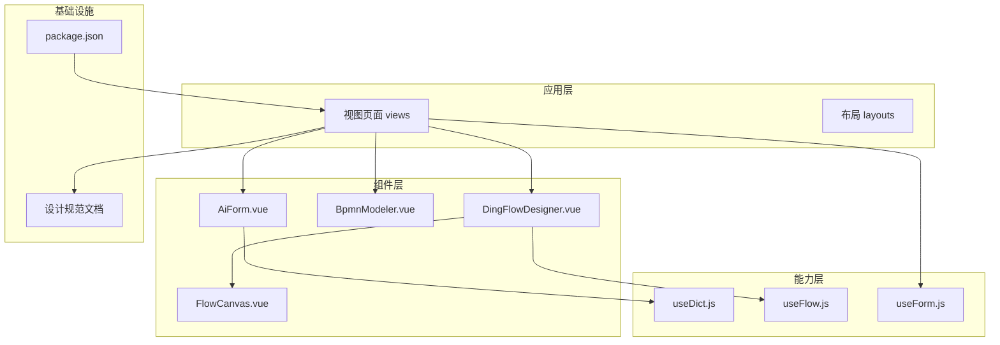
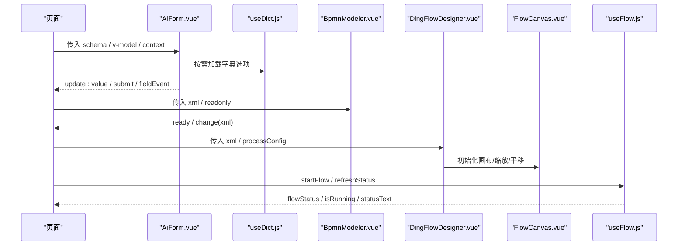
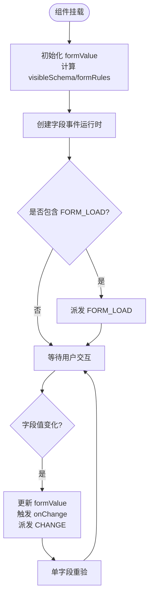
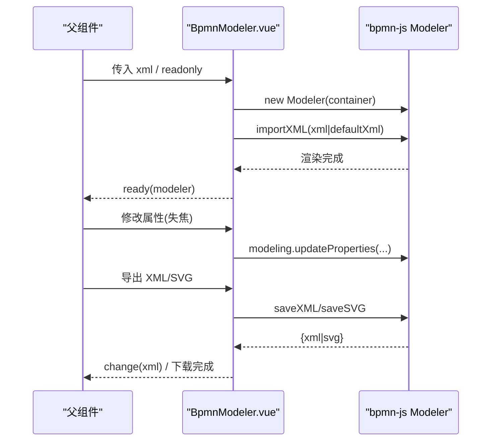
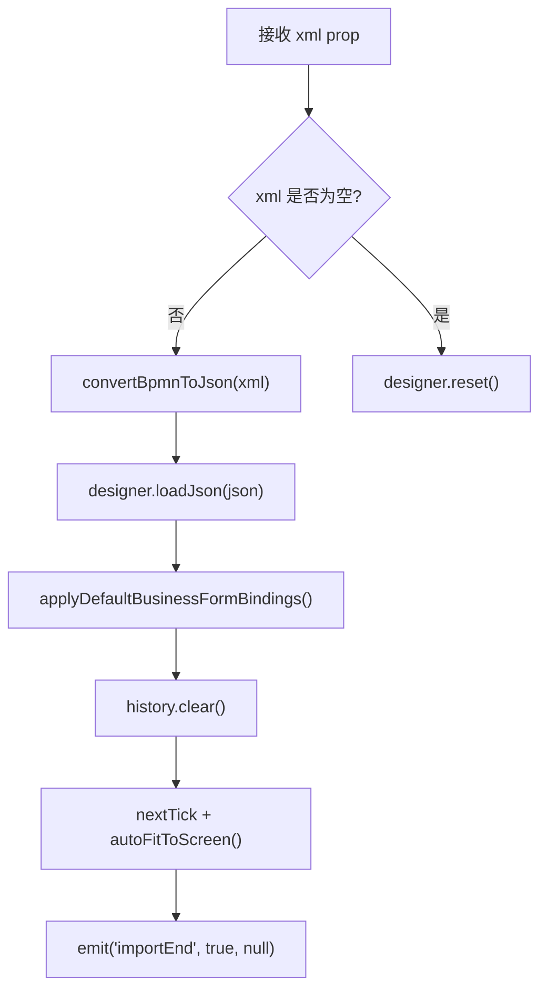
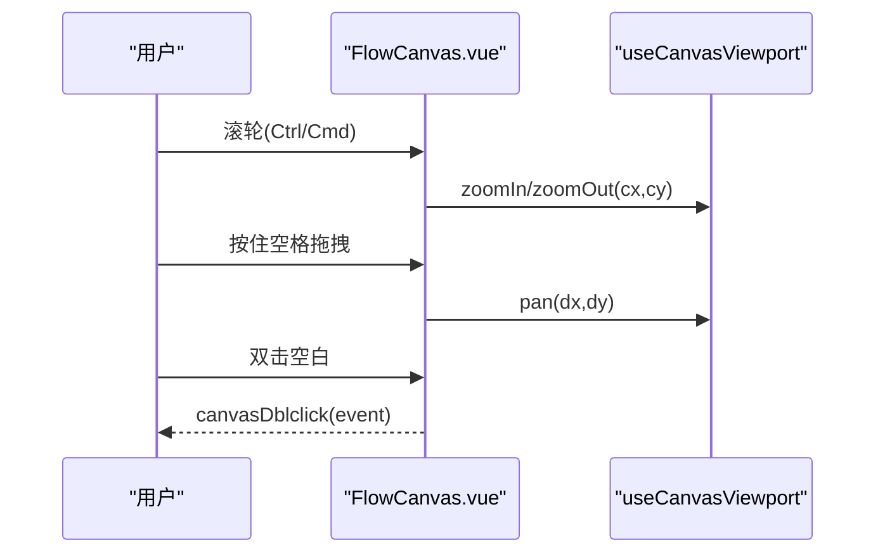
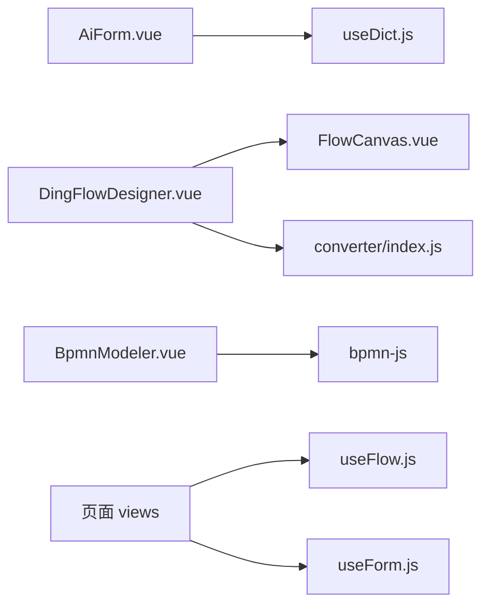

# Vue组件开发

<cite>
**本文引用的文件**
- [package.json](file://forge-admin-ui/package.json)
- [DESIGN.md](file://forge-admin-ui/DESIGN.md)
- [Forge Admin前端开发与组件规范.md](file://forge-admin-ui/Forge%20Admin前端开发与组件规范.md)
- [AiForm.vue](file://forge-admin-ui/src/components/ai-form/AiForm.vue)
- [useDict.js](file://forge-admin-ui/src/composables/useDict.js)
- [useForm.js](file://forge-admin-ui/src/composables/useForm.js)
- [BpmnModeler.vue](file://forge-admin-ui/src/components/bpmn/BpmnModeler.vue)
- [DingFlowDesigner.vue](file://forge-admin-ui/src/components/flow-designer/DingFlowDesigner.vue)
- [FlowCanvas.vue](file://forge-admin-ui/src/components/flow-designer/canvas/FlowCanvas.vue)
- [useFlow.js](file://forge-admin-ui/src/composables/useFlow.js)
</cite>

## 目录
1. [简介](#简介)
2. [项目结构](#项目结构)
3. [核心组件](#核心组件)
4. [架构总览](#架构总览)
5. [详细组件分析](#详细组件分析)
6. [依赖关系分析](#依赖关系分析)
7. [性能考虑](#性能考虑)
8. [故障排查指南](#故障排查指南)
9. [结论](#结论)
10. [附录](#附录)

## 简介
本指南面向 Forge Admin 的 Vue 3 组件开发，聚焦 Composition API 的最佳实践、组件设计原则、Props/Events/插槽规范，以及复杂组件 AiForm、BpmnModeler、FlowDesigner 的实现模式与架构。同时提供测试策略、性能优化技巧与可访问性方案，并给出常用组件的开发示例与复用模式，帮助团队在统一规范下高效构建企业级管理后台。

## 项目结构
- 技术栈与工具链：Vue 3 + Vite + Naive UI + UnoCSS；表单与流程能力通过第三方库集成（bpmn-js、@form-create/*）。
- 目录职责：components 存放可复用组件；composables 封装 useXxx 组合式逻辑；views 组织页面；api 定义接口；stores 管理跨页状态；utils 提供无 UI 工具。
- 设计规范：以 DESIGN.md 和《Forge Admin前端开发与组件规范.md》为约束，强调信息密度、紧凑布局、主题变量、字典驱动、主从工作台等。

**图表来源**
- [package.json:1-107](file://forge-admin-ui/package.json#L1-L107)
- [DESIGN.md:1-277](file://forge-admin-ui/DESIGN.md#L1-L277)
- [Forge Admin前端开发与组件规范.md:1-322](file://forge-admin-ui/Forge%20Admin前端开发与组件规范.md#L1-L322)

**章节来源**
- [package.json:1-107](file://forge-admin-ui/package.json#L1-L107)
- [DESIGN.md:1-277](file://forge-admin-ui/DESIGN.md#L1-L277)
- [Forge Admin前端开发与组件规范.md:1-322](file://forge-admin-ui/Forge%20Admin前端开发与组件规范.md#L1-L322)

## 核心组件
- AiForm：基于 JSON Schema 的动态表单渲染器，支持字段权限、运行时控制、折叠搜索、字段事件、校验规则生成与弹窗表单。
- BpmnModeler：封装 bpmn-js 的流程建模器，提供属性面板、撤销重做、缩放、导出 XML/SVG 等能力。
- DingFlowDesigner：钉钉风格流程设计器，内部使用 FlowCanvas 画布容器与节点/连线渲染，负责 XML/JSON 转换、历史回滚、业务表单绑定与流程配置注入。
- FlowCanvas：画布容器，提供缩放、平移、键盘/鼠标交互、视口坐标转换等通用能力。
- useDict：字典数据加载与缓存，支持并发请求合并、失败重试、按类型获取标签或条目。
- useFlow：业务流程集成 Composable，封装发起、撤回、终止、状态刷新、审批历史与流程图信息等。
- useForm：轻量表单组合式函数，返回 formRef、formModel、校验方法与默认必填规则。

**章节来源**
- [AiForm.vue:1-800](file://forge-admin-ui/src/components/ai-form/AiForm.vue#L1-L800)
- [BpmnModeler.vue:1-620](file://forge-admin-ui/src/components/bpmn/BpmnModeler.vue#L1-L620)
- [DingFlowDesigner.vue:1-200](file://forge-admin-ui/src/components/flow-designer/DingFlowDesigner.vue#L1-L200)
- [FlowCanvas.vue:1-200](file://forge-admin-ui/src/components/flow-designer/canvas/FlowCanvas.vue#L1-L200)
- [useDict.js:1-254](file://forge-admin-ui/src/composables/useDict.js#L1-L254)
- [useFlow.js:1-388](file://forge-admin-ui/src/composables/useFlow.js#L1-L388)
- [useForm.js:1-18](file://forge-admin-ui/src/composables/useForm.js#L1-L18)

## 架构总览
整体采用“页面 → 组件 → 组合式函数 → 外部库/服务”的分层架构：
- 页面通过 AiCrudPage/AiForm 等组件完成 CRUD 与表单；通过 BpmnModeler/DingFlowDesigner 完成流程建模与设计；通过 useFlow 与后端流程服务交互。
- 组件内部通过 computed/watch/ref 管理响应式状态，通过 emit 暴露事件，通过 slots 扩展内容。
- 组合式函数抽离跨组件复用的状态与行为（如字典、流程、表单），降低耦合度。

**图表来源**
- [AiForm.vue:147-800](file://forge-admin-ui/src/components/ai-form/AiForm.vue#L147-L800)
- [useDict.js:130-245](file://forge-admin-ui/src/composables/useDict.js#L130-L245)
- [BpmnModeler.vue:146-546](file://forge-admin-ui/src/components/bpmn/BpmnModeler.vue#L146-L546)
- [DingFlowDesigner.vue:1-200](file://forge-admin-ui/src/components/flow-designer/DingFlowDesigner.vue#L1-L200)
- [FlowCanvas.vue:1-200](file://forge-admin-ui/src/components/flow-designer/canvas/FlowCanvas.vue#L1-L200)
- [useFlow.js:20-288](file://forge-admin-ui/src/composables/useFlow.js#L20-L288)

## 详细组件分析

### AiForm 动态表单组件
- 设计要点
  - 通过 schema 描述字段与行为，结合运行时控制（可见性、禁用、只读）与字段权限映射，实现“配置即表单”。
  - 支持折叠搜索、分组导航、自定义操作插槽、验证反馈开关。
  - 内置字段事件运行时，支持 FORM_LOAD、CHANGE 等触发，并可联动低代码查询源。
  - 校验规则由 schema 与运行时规则归一化后生成，针对数字/日期/选择类字段提供空值判定修正。
- Props/Events/Slots
  - Props：schema、value、context、labelPlacement/Width/Align、size、gridCols/xGap/yGap、showActions、showSubmit/Reset/Cancel、enableCollapse/maxVisibleFields、showFeedback、fieldPermissions、fieldEvents、fieldEventLoadToken、formAssets。
  - Events：update:value、submit、reset、cancel、nodeAction、fieldEvent。
  - Slots：任意命名插槽透传；formAction 用于插入自定义操作区。
- 关键流程
  - 初始化：监听 props.value 同步到内部 formValue；计算 visibleSchema、formRules；创建 fieldEventRuntime。
  - 字段变更：handleFieldChange 更新值、触发 onChange、派发字段事件、单字段重验。
  - 弹窗表单：通过 nodeAction 打开内嵌 AiForm 弹窗，支持独立布局与上下文。
- 复杂度与优化
  - 规则生成与可见性过滤在 computed 中执行，避免重复计算。
  - 字段事件运行时集中管理规则与状态，生命周期在 onMounted/onBeforeUnmount 中正确清理。

**图表来源**
- [AiForm.vue:279-355](file://forge-admin-ui/src/components/ai-form/AiForm.vue#L279-L355)
- [AiForm.vue:582-617](file://forge-admin-ui/src/components/ai-form/AiForm.vue#L582-L617)
- [AiForm.vue:643-675](file://forge-admin-ui/src/components/ai-form/AiForm.vue#L643-L675)

**章节来源**
- [AiForm.vue:1-800](file://forge-admin-ui/src/components/ai-form/AiForm.vue#L1-L800)

### BpmnModeler 流程建模器
- 设计要点
  - 封装 bpmn-js Modeler，提供工具栏（撤销/重做、缩放、导出）、右侧属性面板（ID/名称、用户任务审批设置、服务任务实现、序列流条件）。
  - 自动导入默认模板（含 BPMNDiagram），确保图形信息完整。
  - 通过 modeling API 更新元素属性，保存 XML/SVG 供下载或提交。
- Props/Events/Methods
  - Props：xml、readonly。
  - Events：save、change、ready。
  - Methods：getXML、getSVG、importXML（defineExpose）。
- 关键流程
  - 初始化：onMounted 创建 Modeler，注册 selection.changed/element.changed/commandStack.changed 事件，导入 XML，fit viewport。
  - 属性编辑：根据 selectedElement 类型加载对应属性，失焦时调用 modeling.updateProperties 写回模型。
  - 导出：saveXML/saveSVG 生成文件并下载。

**图表来源**
- [BpmnModeler.vue:146-281](file://forge-admin-ui/src/components/bpmn/BpmnModeler.vue#L146-L281)
- [BpmnModeler.vue:315-436](file://forge-admin-ui/src/components/bpmn/BpmnModeler.vue#L315-L436)
- [BpmnModeler.vue:468-546](file://forge-admin-ui/src/components/bpmn/BpmnModeler.vue#L468-L546)

**章节来源**
- [BpmnModeler.vue:1-620](file://forge-admin-ui/src/components/bpmn/BpmnModeler.vue#L1-L620)

### DingFlowDesigner 流程设计器
- 设计要点
  - 对外保持与旧版 FlowModeler 1:1 兼容（props/events/methods），便于迁移。
  - 内部使用 FlowCanvas 作为画布容器，配合节点/连线渲染、右键菜单、分支头、合并节点等。
  - 负责 XML↔JSON 转换、流程历史（最大栈深度）、流程配置注入（允许发起人撤回、自动审批模式）、业务表单自动绑定。
- Props/Events/Methods
  - Props：xml、readonly、formAssetOptions、formFieldCatalog、autoBindBusinessForm、defaultFormKey、processConfig。
  - Events：change、ready、importStart、importEnd。
  - Methods：setXML/getXML/reset/undo/redo（对外兼容）。
- 关键流程
  - 导入 XML：convertBpmnToJson → loadJson → 自动绑定业务表单 → 清空历史 → 自适应屏幕 → 触发 importEnd。
  - 配置注入：normalizeProcessConfig → 写入 flowJson.config。
  - 业务表单绑定：根据 formAssetOptions/defaultFormKey/autoBindBusinessForm 为 approver 节点填充 formType/formKey/viewKey/permissions 等。

**图表来源**
- [DingFlowDesigner.vue:56-139](file://forge-admin-ui/src/components/flow-designer/DingFlowDesigner.vue#L56-L139)
- [DingFlowDesigner.vue:141-200](file://forge-admin-ui/src/components/flow-designer/DingFlowDesigner.vue#L141-L200)

**章节来源**
- [DingFlowDesigner.vue:1-200](file://forge-admin-ui/src/components/flow-designer/DingFlowDesigner.vue#L1-L200)

### FlowCanvas 画布容器
- 设计要点
  - 提供 transform 缩放/平移容器，支持 Ctrl/Cmd+滚轮缩放、空格+拖拽平移、中键拖拽、双击空白重置。
  - 暴露 resetView/fitToScreen/zoomIn/zoomOut/setScale/screenToCanvas/canvasToScreen 等方法。
  - 通过 useCanvasViewport 组合式函数管理视口状态。
- 交互与可访问性
  - 按钮提供 aria-label；禁用态与导航开关联动；光标样式随交互切换 grab/grabbing。

**图表来源**
- [FlowCanvas.vue:26-163](file://forge-admin-ui/src/components/flow-designer/canvas/FlowCanvas.vue#L26-L163)

**章节来源**
- [FlowCanvas.vue:1-200](file://forge-admin-ui/src/components/flow-designer/canvas/FlowCanvas.vue#L1-L200)

### 组合式函数：useDict、useFlow、useForm
- useDict
  - 全局 Map 缓存字典数据，并发请求合并，失败不污染缓存；支持一次性重试；提供 getLabel/getDict 工具方法。
- useFlow
  - 封装流程状态与操作：startFlow/withdrawFlow/terminateFlow/refreshStatus/getApprovalHistory/getDiagramInfo；计算属性包括 isRunning/isFinished/canStart/canWithdraw/statusText/statusTagType。
- useForm
  - 返回 formRef、formModel、validation、rules，简化基础表单校验。

**章节来源**
- [useDict.js:1-254](file://forge-admin-ui/src/composables/useDict.js#L1-L254)
- [useFlow.js:1-388](file://forge-admin-ui/src/composables/useFlow.js#L1-L388)
- [useForm.js:1-18](file://forge-admin-ui/src/composables/useForm.js#L1-L18)

## 依赖关系分析
- 组件间依赖
  - DingFlowDesigner 依赖 FlowCanvas 与 converter/composables；BpmnModeler 依赖 bpmn-js；AiForm 依赖低代码查询源与字段事件运行时。
- 外部依赖
  - package.json 声明了 bpmn-js、@form-create/*、naive-ui、vue-router、pinia、echarts、codemirror 等。
- 耦合与内聚
  - 通过 composables 解耦业务逻辑（字典、流程、表单），组件专注渲染与交互；通过 defineExpose/emit/slots 明确边界。

**图表来源**
- [package.json:1-107](file://forge-admin-ui/package.json#L1-L107)
- [AiForm.vue:147-800](file://forge-admin-ui/src/components/ai-form/AiForm.vue#L147-L800)
- [DingFlowDesigner.vue:1-200](file://forge-admin-ui/src/components/flow-designer/DingFlowDesigner.vue#L1-L200)
- [FlowCanvas.vue:1-200](file://forge-admin-ui/src/components/flow-designer/canvas/FlowCanvas.vue#L1-L200)
- [BpmnModeler.vue:146-546](file://forge-admin-ui/src/components/bpmn/BpmnModeler.vue#L146-L546)
- [useFlow.js:1-388](file://forge-admin-ui/src/composables/useFlow.js#L1-L388)
- [useForm.js:1-18](file://forge-admin-ui/src/composables/useForm.js#L1-L18)

**章节来源**
- [package.json:1-107](file://forge-admin-ui/package.json#L1-L107)

## 性能考虑
- 列表与树
  - 服务端分页与懒加载；避免全量展开树与扁平列表同时渲染；局部 Loading，禁止全屏遮挡。
- 表单与渲染
  - 使用 computed 派生 options/rule；折叠搜索减少首屏 DOM；字段事件运行时集中管理，避免重复监听。
- 流程设计器
  - 画布使用 transform 缩放/平移，避免大量重排；导入 XML 前校验图形信息，缺失时使用默认模板；历史栈限制最大深度。
- 字典与请求
  - 字典全局缓存与并发合并；失败不污染缓存；必要时一次性重试。
- 动画与主题
  - 仅对 color/background/border/opacity/transform 做动画，时长 120–180ms；亮暗主题一致语义变量。

[本节为通用指导，无需具体文件引用]

## 故障排查指南
- 表单校验异常
  - 检查 schema 中 validation/rules 是否正确；数字/日期/选择类字段需自定义空值校验；单字段重验仅在 nextTick 后进行。
- 字典未回显
  - 确认 useDict 已加载对应 dictType；computed 派生 options；异步加载完成后应能回显。
- 流程建模器导入失败
  - 检查 XML 是否包含 BPMNDiagram；为空或缺失将回退到默认模板；查看控制台错误日志定位。
- 画布交互异常
  - 确认 readonly/allowNavigation 配置；检查鼠标/键盘事件是否被拦截；空间键状态与拖拽状态是否正确释放。
- 流程状态不同步
  - 使用 useFlow.refreshStatus 刷新；businessKey 变化时自动刷新；注意发起/撤回/终止后的状态更新。

**章节来源**
- [AiForm.vue:341-470](file://forge-admin-ui/src/components/ai-form/AiForm.vue#L341-L470)
- [AiForm.vue:665-675](file://forge-admin-ui/src/components/ai-form/AiForm.vue#L665-L675)
- [useDict.js:73-108](file://forge-admin-ui/src/composables/useDict.js#L73-L108)
- [BpmnModeler.vue:223-306](file://forge-admin-ui/src/components/bpmn/BpmnModeler.vue#L223-L306)
- [FlowCanvas.vue:61-141](file://forge-admin-ui/src/components/flow-designer/canvas/FlowCanvas.vue#L61-L141)
- [useFlow.js:89-109](file://forge-admin-ui/src/composables/useFlow.js#L89-L109)

## 结论
本项目以统一的规范与清晰的组件分层，构建了高内聚、低耦合的 Forge Admin 前端体系。AiForm 提供强大的配置化表单能力；BpmnModeler 与 DingFlowDesigner 分别覆盖标准 BPMN 建模与钉钉风格流程设计；FlowCanvas 提供稳定高效的画布交互；useDict/useFlow/useForm 将常见能力抽象为可复用组合式函数。遵循本文档的设计原则与实践建议，可在保证可维护性与性能的同时，快速交付高质量的企业级功能。

[本节为总结性内容，无需具体文件引用]

## 附录
- 常用组件开发示例与复用模式
  - 字典字段：通过 useDict 获取字典数据，computed 派生 options，使用 DictTag/DictSelect 展示与选择。
  - 配置化 CRUD：使用 AiCrudPage 传入 api-config，路径占位符使用 :id；列表密度 medium，详情优先提供 editSchema。
  - 主从工作台：MasterDetailWorkspace 组织左侧对象区与右侧工作区，各自滚动边界清晰。
  - 流程集成：useFlow 封装发起/撤回/终止/状态刷新；审批侧 useFlowTask 封装通过/驳回/转办/签收。

**章节来源**
- [Forge Admin前端开发与组件规范.md:290-322](file://forge-admin-ui/Forge%20Admin前端开发与组件规范.md#L290-L322)
- [useFlow.js:20-288](file://forge-admin-ui/src/composables/useFlow.js#L20-L288)