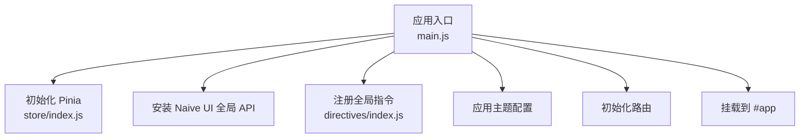
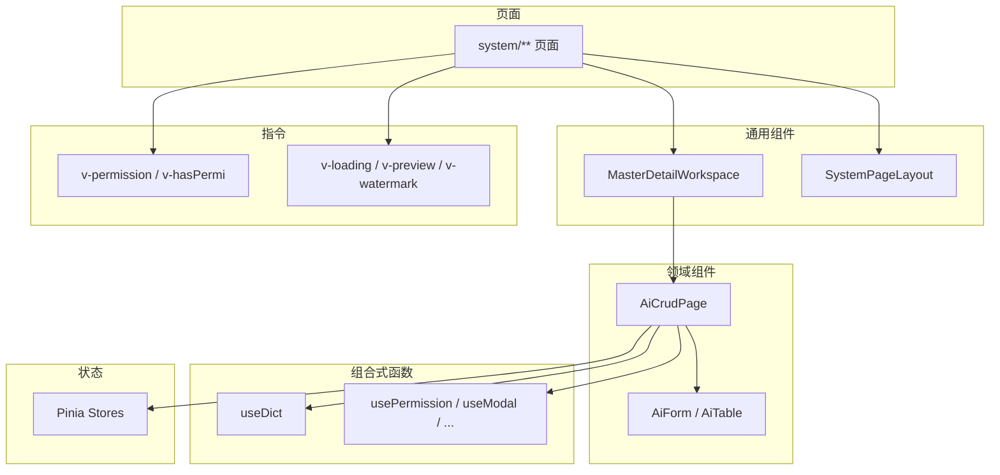
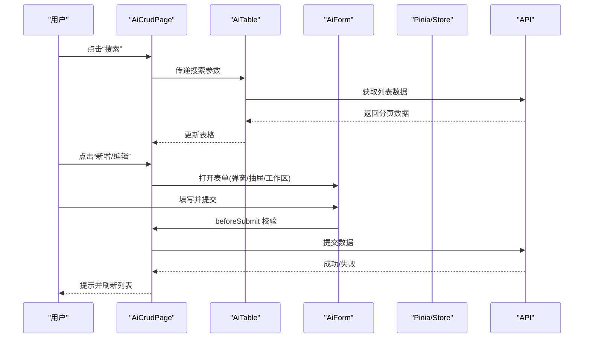
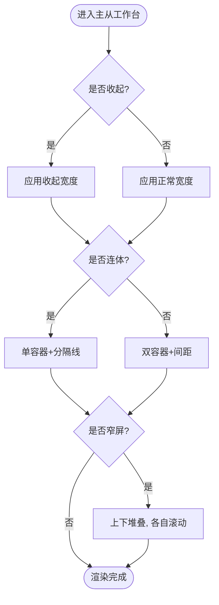
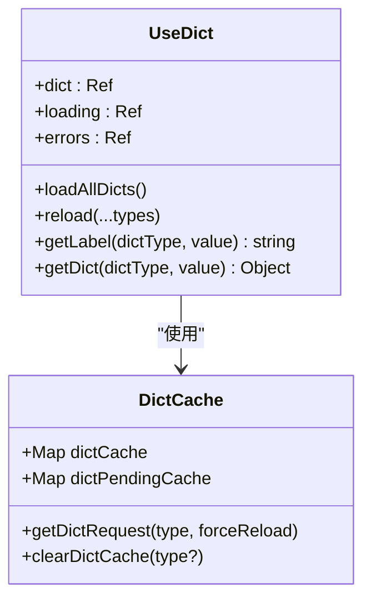
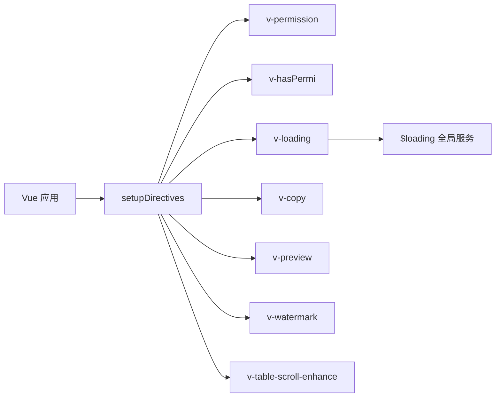
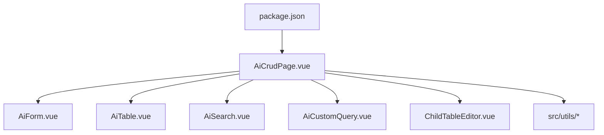

# 组件开发

<cite>
**本文引用的文件**
- [Forge Admin前端开发与组件规范.md](file://forge-admin-ui/Forge%20Admin前端开发与组件规范.md)
- [main.js](file://forge-admin-ui/src/main.js)
- [package.json](file://forge-admin-ui/package.json)
- [MasterDetailWorkspace.vue](file://forge-admin-ui/src/components/common/MasterDetailWorkspace.vue)
- [AiCrudPage.vue](file://forge-admin-ui/src/components/ai-form/AiCrudPage.vue)
- [useDict.js](file://forge-admin-ui/src/composables/useDict.js)
- [index.js（指令注册）](file://forge-admin-ui/src/directives/index.js)
- [index.js（Store 初始化）](file://forge-admin-ui/src/store/index.js)
- [SystemPageLayout.vue](file://forge-admin-ui/src/components/common/SystemPageLayout.vue)
- [index.js（工具模块聚合）](file://forge-admin-ui/src/utils/index.js)
</cite>

## 目录
1. [简介](#简介)
2. [项目结构](#项目结构)
3. [核心组件](#核心组件)
4. [架构总览](#架构总览)
5. [详细组件分析](#详细组件分析)
6. [依赖关系分析](#依赖关系分析)
7. [性能考虑](#性能考虑)
8. [故障排查指南](#故障排查指南)
9. [结论](#结论)
10. [附录](#附录)

## 简介
本指南面向 Forge Admin 前端团队，聚焦 Vue 3 组件开发规范、Composition API 使用模式、组件通信与状态管理策略，并系统说明自定义指令、组合式函数、混入与插槽的使用场景。结合仓库中的实际实现，提供组件测试、性能优化、可访问性支持与主题定制的最佳实践，以及常用组件的开发示例与复用模式，帮助团队在统一规范下高效构建高质量、可维护的前端界面。

## 项目结构
- 技术栈与工程约定
  - 使用 Vue 3 Composition API 与 `<script setup>`；UI 优先 Naive UI；原子样式使用 UnoCSS；请求统一通过项目请求工具。
  - 包管理与脚本：pnpm；构建与预览由 Vite 驱动；ESLint 校验与 Vitest 测试。
- 目录职责
  - api：按业务域定义接口请求。
  - components：跨页面复用的展示与交互组件，包含 ai-form、common、lowcode-builder 等子目录。
  - composables：useXxx 组合式状态与行为。
  - config：应用级静态配置。
  - layouts：应用导航、页签和整体壳层。
  - router：路由与动态路由装配。
  - stores：Pinia 状态；跨页面且有明确生命周期的数据放这里。
  - styles：全局变量、重置和主题样式。
  - utils：无 UI 的纯工具、请求、加密、文件和校验能力。
  - views：路由页面，按业务域组织。
- 启动与初始化流程
  - 入口 main.js 负责创建应用、安装 Store、Naive UI 离散 API、指令、主题、路由与挂载。

图示来源
- [main.js:20-50](file://forge-admin-ui/src/main.js#L20-L50)
- [index.js（Store 初始化）:4-8](file://forge-admin-ui/src/store/index.js#L4-L8)
- [index.js（指令注册）:20-38](file://forge-admin-ui/src/directives/index.js#L20-L38)

章节来源
- [Forge Admin前端开发与组件规范.md:5-39](file://forge-admin-ui/Forge%20Admin前端开发与组件规范.md#L5-L39)
- [package.json:6-18](file://forge-admin-ui/package.json#L6-L18)
- [main.js:20-50](file://forge-admin-ui/src/main.js#L20-L50)

## 核心组件
- AiCrudPage：基于 Naive UI 的完整 CRUD 解决方案，集成搜索、表格、新增、编辑、删除、导入导出、表单工作区与详情面板等能力。
- MasterDetailWorkspace：主从工作台容器，支持左侧对象区域与右侧工作区的连体或分离布局，内置响应式堆叠与滚动边界处理。
- SystemPageLayout：系统页面布局容器，提供满高与滚动边界，避免页面级边距重复设置。
- 字典与表单能力：通过 useDict 组合式函数加载与缓存字典，配合 AiForm/AiTable 完成配置化渲染。

章节来源
- [AiCrudPage.vue:11-800](file://forge-admin-ui/src/components/ai-form/AiCrudPage.vue#L11-L800)
- [MasterDetailWorkspace.vue:1-152](file://forge-admin-ui/src/components/common/MasterDetailWorkspace.vue#L1-L152)
- [SystemPageLayout.vue:1-25](file://forge-admin-ui/src/components/common/SystemPageLayout.vue#L1-L25)
- [useDict.js:1-254](file://forge-admin-ui/src/composables/useDict.js#L1-L254)

## 架构总览
- 组件分层
  - 页面层：views 下的业务页面，通常以 SystemPageLayout 包裹，内部使用 AiCrudPage 或 MasterDetailWorkspace 组织内容。
  - 通用组件层：components/common 提供工作台、表格单元格、图片鉴权、主题设置等通用能力。
  - 领域组件层：components/ai-form 提供配置化 CRUD、表单、表格、搜索、导入导出等能力。
  - 组合式函数层：composables 提供字典、权限、模态框、水印、用户信息等可复用逻辑。
  - 指令层：directives 提供权限控制、复制、图片预览、水印、表格滚动增强等 DOM 级能力。
  - 状态层：stores 使用 Pinia 管理跨页面状态，如用户、权限、标签页、主题等。
- 数据流
  - 页面通过 Api 模块发起请求，返回数据经 AiCrudPage/AiForm 渲染为表格与表单。
  - 字典数据通过 useDict 统一加载与缓存，供多处复用。
  - 指令与组合式函数贯穿页面与组件，提供横切能力。

图示来源
- [AiCrudPage.vue:11-800](file://forge-admin-ui/src/components/ai-form/AiCrudPage.vue#L11-L800)
- [MasterDetailWorkspace.vue:1-152](file://forge-admin-ui/src/components/common/MasterDetailWorkspace.vue#L1-L152)
- [SystemPageLayout.vue:1-25](file://forge-admin-ui/src/components/common/SystemPageLayout.vue#L1-L25)
- [useDict.js:1-254](file://forge-admin-ui/src/composables/useDict.js#L1-L254)
- [index.js（指令注册）:20-38](file://forge-admin-ui/src/directives/index.js#L20-L38)
- [index.js（Store 初始化）:4-8](file://forge-admin-ui/src/store/index.js#L4-L8)

## 详细组件分析

### AiCrudPage 组件分析
- 职责与能力
  - 提供搜索、工具栏、表格、新增/编辑/详情弹窗或抽屉、导入导出、自定义查询、行展开面板、表单工作区与标签页模式。
  - 通过 props 暴露丰富配置项，支持表单与表格的多种渲染模式与交互行为。
  - 透传插槽扩展工具栏、表格与表单区域，便于业务定制。
- 关键交互流程
  - 搜索提交触发列表刷新；分页参数统一为 pageNum、pageSize。
  - 新增/编辑/详情通过 Modal 或 Drawer 打开，支持表单校验、beforeSubmit 钩子与异步提交。
  - 工具栏动作与行操作通过事件回调与 loading 状态管理。
- 可访问性与主题
  - 按钮具备语义化与键盘交互；图标按钮需带 title 或 aria-label。
  - 遵循主题变量与暗色模式适配。

图示来源
- [AiCrudPage.vue:11-800](file://forge-admin-ui/src/components/ai-form/AiCrudPage.vue#L11-L800)

章节来源
- [AiCrudPage.vue:11-800](file://forge-admin-ui/src/components/ai-form/AiCrudPage.vue#L11-L800)
- [Forge Admin前端开发与组件规范.md:80-96](file://forge-admin-ui/Forge%20Admin前端开发与组件规范.md#L80-L96)
- [Forge Admin前端开发与组件规范.md:194-222](file://forge-admin-ui/Forge%20Admin前端开发与组件规范.md#L194-L222)

### MasterDetailWorkspace 组件分析
- 布局与响应式
  - 使用 CSS Grid 实现左右布局，支持收起/展开、连体/分离两种模式。
  - 窄屏自动切换为上下堆叠，两侧各自独立滚动，避免整页与表格双重滚动。
- Props 与插槽
  - asideWidth、collapsedAsideWidth、mainWidth 控制宽度；collapsed、attached 控制布局行为。
  - aside 插槽放置树或筛选导航；默认插槽放置表格或详情。
- 可访问性与主题
  - 分隔线 aria-hidden；背景与边框颜色适配亮/暗主题。

图示来源
- [MasterDetailWorkspace.vue:20-62](file://forge-admin-ui/src/components/common/MasterDetailWorkspace.vue#L20-L62)
- [MasterDetailWorkspace.vue:64-152](file://forge-admin-ui/src/components/common/MasterDetailWorkspace.vue#L64-L152)

章节来源
- [MasterDetailWorkspace.vue:1-152](file://forge-admin-ui/src/components/common/MasterDetailWorkspace.vue#L1-L152)
- [Forge Admin前端开发与组件规范.md:57-79](file://forge-admin-ui/Forge%20Admin前端开发与组件规范.md#L57-L79)

### 组合式函数 useDict 分析
- 功能概述
  - 加载并缓存字典数据，支持多类型并行加载、失败重试、错误隔离。
  - 提供 getLabel/getDict 便捷方法，方便模板与计算属性中使用。
- 缓存与并发控制
  - 使用 Map 缓存已加载字典与正在进行的请求，避免重复请求。
  - Promise.allSettled 保证部分失败不影响其他字典加载。
- 使用建议
  - 在组件中通过 computed 派生 options，确保异步加载后可回显。
  - 对需要强制刷新的场景调用 reload。

图示来源
- [useDict.js:18-92](file://forge-admin-ui/src/composables/useDict.js#L18-L92)
- [useDict.js:130-245](file://forge-admin-ui/src/composables/useDict.js#L130-L245)

章节来源
- [useDict.js:1-254](file://forge-admin-ui/src/composables/useDict.js#L1-L254)
- [Forge Admin前端开发与组件规范.md:113-119](file://forge-admin-ui/Forge%20Admin前端开发与组件规范.md#L113-L119)

### 自定义指令体系
- 指令集合
  - 权限控制：v-permission、v-hasPermi。
  - 交互增强：v-loading、v-copy、v-preview、v-watermark、v-table-scroll-enhance。
- 注册与全局服务
  - 通过 setupDirectives 统一注册，并将 loadingService 注入全局属性 $loading。
- 使用建议
  - 按钮权限通过指令隐藏或移除节点，避免仅依赖前端隐藏保护操作。
  - 表格横向拖拽增强通过指令全局启用。

图示来源
- [index.js（指令注册）:20-38](file://forge-admin-ui/src/directives/index.js#L20-L38)

章节来源
- [index.js（指令注册）:1-42](file://forge-admin-ui/src/directives/index.js#L1-L42)
- [Forge Admin前端开发与组件规范.md:223-228](file://forge-admin-ui/Forge%20Admin前端开发与组件规范.md#L223-L228)

### 状态管理策略
- 初始化与插件
  - 使用 Pinia 创建 store，并启用持久化插件 pinia-plugin-persistedstate。
- 状态划分原则
  - 单个控件、弹窗、筛选值放在组件 ref。
  - 基于当前状态推导的展示值使用 computed。
  - 可复用请求/交互逻辑放入 composables。
  - 登录态、主题、跨页会话放入 Pinia Store。
  - 不随渲染变化的映射/常量放在模块顶层 const。
- 最佳实践
  - 组件不能直接修改父组件传入的对象或数组；通过事件上抛或先复制后提交。
  - watch 只处理副作用；轮询、事件监听和定时器必须在卸载时清理。

章节来源
- [index.js（Store 初始化）:4-8](file://forge-admin-ui/src/store/index.js#L4-L8)
- [Forge Admin前端开发与组件规范.md:171-184](file://forge-admin-ui/Forge%20Admin前端开发与组件规范.md#L171-L184)

### 插槽与混入使用场景
- 插槽
  - AiCrudPage 提供 toolbar、table、form 等多类插槽，用于扩展工具栏、表格列与表单区域。
  - MasterDetailWorkspace 提供 aside 插槽放置左侧导航或树。
- 混入
  - 项目未采用 Options API 混入；推荐将复用逻辑抽为 composables，保持 Composition API 风格一致。

章节来源
- [AiCrudPage.vue:11-800](file://forge-admin-ui/src/components/ai-form/AiCrudPage.vue#L11-L800)
- [MasterDetailWorkspace.vue:1-152](file://forge-admin-ui/src/components/common/MasterDetailWorkspace.vue#L1-L152)
- [Forge Admin前端开发与组件规范.md:7-8](file://forge-admin-ui/Forge%20Admin前端开发与组件规范.md#L7-L8)

## 依赖关系分析
- 组件与工具
  - AiCrudPage 依赖 AiForm、AiTable、AiSearch、AiCustomQuery、ChildTableEditor 等子组件。
  - 工具模块通过 src/utils/index.js 聚合导出，包括 http、file、crypto、storage 等。
- 外部依赖
  - package.json 中声明了 vue、naive-ui、pinia、unocss、axios、echarts 等关键依赖。
- 耦合与内聚
  - 组件职责清晰，通过 props/events/slots 通信；组合式函数与指令提供横切能力，降低组件间耦合。

图示来源
- [AiCrudPage.vue:11-800](file://forge-admin-ui/src/components/ai-form/AiCrudPage.vue#L11-L800)
- [index.js（工具模块聚合）:1-15](file://forge-admin-ui/src/utils/index.js#L1-L15)
- [package.json:19-73](file://forge-admin-ui/package.json#L19-L73)

章节来源
- [package.json:19-73](file://forge-admin-ui/package.json#L19-L73)
- [index.js（工具模块聚合）:1-15](file://forge-admin-ui/src/utils/index.js#L1-L15)

## 性能考虑
- 渲染与交互
  - 表格默认密度 medium，仅在审计/日志等高密度场景使用 small。
  - 单元格渲染逻辑复杂时抽为小组件，避免在 columns 中堆砌逻辑。
  - 使用 computed 派生选项与展示值，减少模板中复杂计算。
- 资源加载
  - 字典数据通过 useDict 缓存与并发控制，避免重复请求。
  - 图片与文件通过 AuthImage 与 getFileUrl 统一处理，避免自行拼接 URL。
- 主题与样式
  - 优先使用主题变量与 UnoCSS；避免大圆角卡片嵌套与无意义渐变阴影。
  - 动画仅作用于 color、background、border、opacity、transform，时长 120–180ms。
- 构建与调试
  - 提交前执行 ESLint 与 pnpm build；必要时使用可视化分析工具评估打包体积。

章节来源
- [Forge Admin前端开发与组件规范.md:121-129](file://forge-admin-ui/Forge%20Admin前端开发与组件规范.md#L121-L129)
- [Forge Admin前端开发与组件规范.md:206-216](file://forge-admin-ui/Forge%20Admin前端开发与组件规范.md#L206-L216)
- [useDict.js:18-92](file://forge-admin-ui/src/composables/useDict.js#L18-L92)

## 故障排查指南
- 常见问题定位
  - 字典字段回显异常：检查 useDict 是否正确加载，options 是否通过 computed 派生。
  - 表格空态与筛选为空：区分“暂无数据”与“没有匹配结果”，提供重置入口。
  - 权限按钮无效：确认 v-permission/v-hasPermi 与后端权限码一致，不要仅依赖前端隐藏。
  - 文件字段显示异常：确认存储的是 fileId，并通过 AuthImage 与 getFileUrl 渲染。
- 调试与验证
  - 最小验证矩阵：列表、查询、重置、分页、增改删、空态、字典回显、文件上传与下载、主从工作台窄屏堆叠、权限操作。
  - 代码评审清单：是否复用现有能力、是否处理 loading/空态/错误/重复点击/卸载、是否遵守字典/租户/权限/文件/加密约定。

章节来源
- [Forge Admin前端开发与组件规范.md:268-288](file://forge-admin-ui/Forge%20Admin前端开发与组件规范.md#L268-L288)
- [useDict.js:130-245](file://forge-admin-ui/src/composables/useDict.js#L130-L245)

## 结论
Forge Admin 前端以 Vue 3 Composition API 为核心，围绕 AiCrudPage、MasterDetailWorkspace、useDict 等关键能力构建了高内聚、低耦合的组件体系。通过统一的指令、组合式函数与 Pinia 状态管理，实现了跨页面的横切能力与可复用逻辑。遵循本指南的规范与实践，可在保证可访问性、主题一致性与性能的前提下，快速交付稳定可靠的后台界面。

## 附录
- 常用示例路径
  - 字典字段使用：参考 useDict 与 DictTag 的组合方式。
  - 配置化 CRUD 的路径占位符：参考 AiCrudPage 的 api-config 配置。
- 最佳实践速查
  - 命名规范：组件 PascalCase、页面 kebab-case、组合式函数 useXxx、Store useXxxStore。
  - 样式层次：优先 Naive UI Props → UnoCSS → scoped CSS → 全局样式。
  - 安全与合规：禁止记录敏感信息到控制台与埋点；权限与加密由后端最终控制。

章节来源
- [Forge Admin前端开发与组件规范.md:98-111](file://forge-admin-ui/Forge%20Admin前端开发与组件规范.md#L98-L111)
- [Forge Admin前端开发与组件规范.md:247-267](file://forge-admin-ui/Forge%20Admin前端开发与组件规范.md#L247-L267)
- [Forge Admin前端开发与组件规范.md:290-322](file://forge-admin-ui/Forge%20Admin前端开发与组件规范.md#L290-L322)