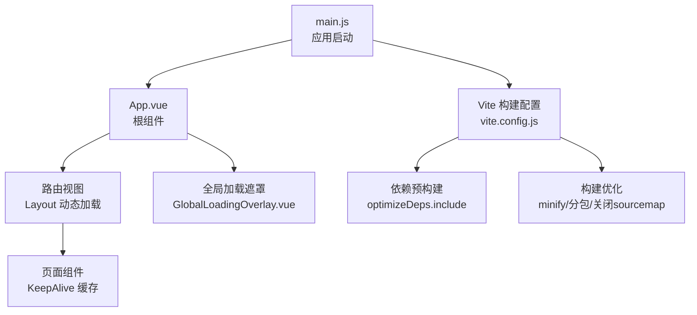
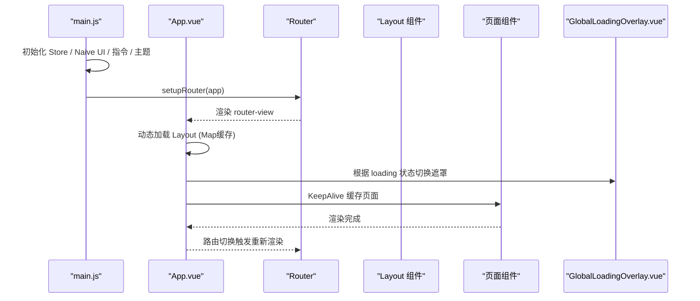
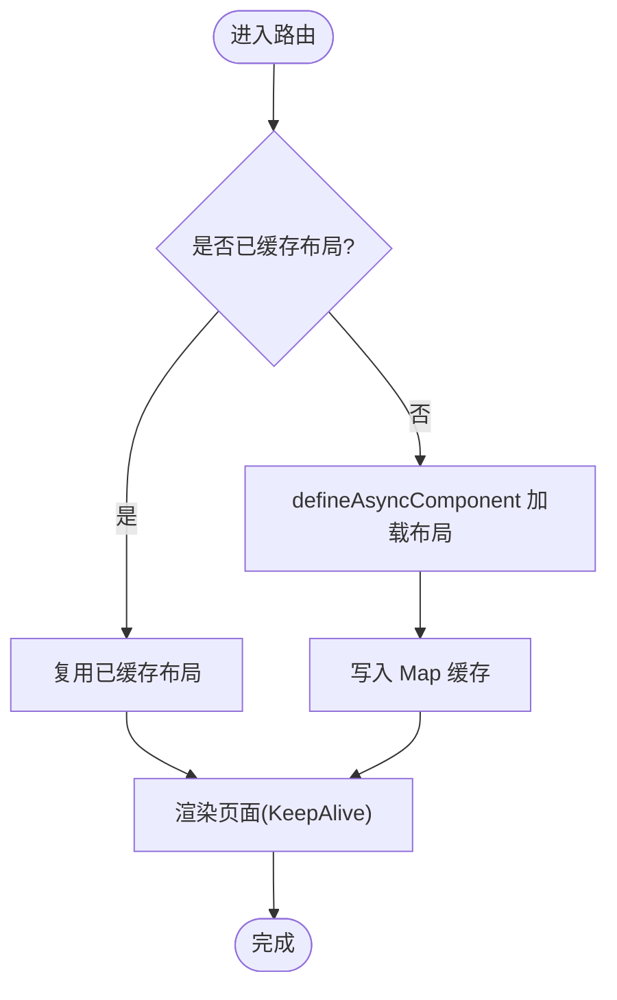
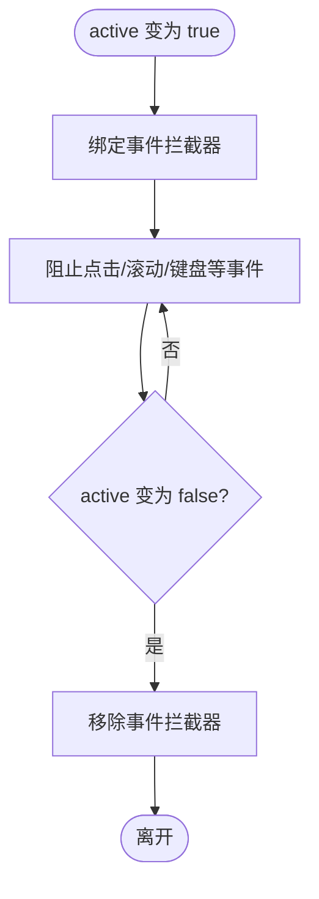
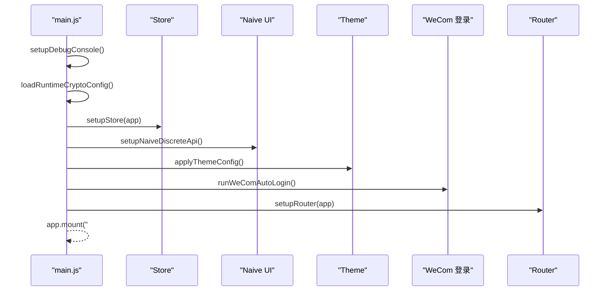
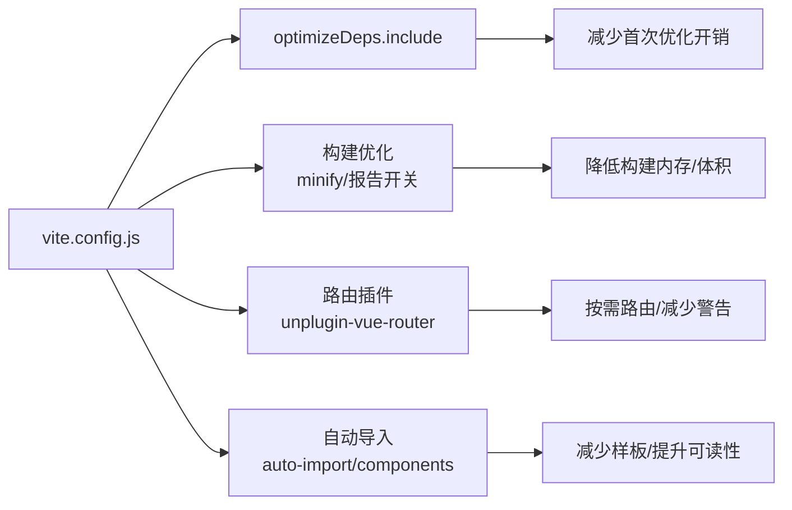

# 组件性能优化

<cite>
**本文引用的文件**
- [App.vue](file://forge-admin-ui/src/App.vue)
- [main.js](file://forge-admin-ui/src/main.js)
- [vite.config.js](file://forge-admin-ui/vite.config.js)
- [package.json](file://forge-admin-ui/package.json)
- [GlobalLoadingOverlay.vue](file://forge-admin-ui/src/components/common/GlobalLoadingOverlay.vue)
</cite>

## 目录
1. [简介](#简介)
2. [项目结构](#项目结构)
3. [核心组件](#核心组件)
4. [架构总览](#架构总览)
5. [详细组件分析](#详细组件分析)
6. [依赖关系分析](#依赖关系分析)
7. [性能考量](#性能考量)
8. [故障排查指南](#故障排查指南)
9. [结论](#结论)
10. [附录](#附录)

## 简介
本指南面向 Forge Admin 的 Vue 3 前端工程，聚焦于组件级与页面级的性能优化实践。内容覆盖渲染性能、内存使用、交互响应时间、懒加载与代码分割、虚拟滚动与大列表优化、状态管理优化（计算属性缓存、侦听器优化）、图片与网络请求优化、资源预加载、性能基准测试与监控、以及大型应用的性能优化案例与经验总结。所有建议均结合仓库中的实际实现进行说明，并提供可落地的配置与代码路径参考。

## 项目结构
Forge Admin 前端采用 Vite + Vue 3 + Pinia + Naive UI 的技术栈，通过路由按需加载布局与页面，配合构建期依赖预优化与分包策略，降低首屏体积与运行时开销。关键入口与初始化流程如下：
- 应用启动：在 main.js 中完成调试面板、加密配置、Store、Naive UI 全局 API、指令、主题、路由等初始化后挂载根组件。
- 根组件 App.vue：负责布局动态加载、KeepAlive 缓存、水印、全局加载态控制等。
- 构建配置 vite.config.js：包含路由插件、自动导入、组件解析、依赖预构建、代理、构建压缩与分包策略等。

图表来源
- [main.js:20-50](file://forge-admin-ui/src/main.js#L20-L50)
- [App.vue:18-30](file://forge-admin-ui/src/App.vue#L18-L30)
- [vite.config.js:21-53](file://forge-admin-ui/vite.config.js#L21-L53)
- [vite.config.js:66-109](file://forge-admin-ui/vite.config.js#L66-L109)
- [vite.config.js:160-173](file://forge-admin-ui/vite.config.js#L160-L173)

章节来源
- [main.js:20-50](file://forge-admin-ui/src/main.js#L20-L50)
- [App.vue:18-30](file://forge-admin-ui/src/App.vue#L18-L30)
- [vite.config.js:21-53](file://forge-admin-ui/vite.config.js#L21-L53)
- [vite.config.js:66-109](file://forge-admin-ui/vite.config.js#L66-L109)
- [vite.config.js:160-173](file://forge-admin-ui/vite.config.js#L160-L173)

## 核心组件
- 根组件 App.vue
  - 动态布局加载：通过 Map 缓存已加载的布局组件，避免重复 import；使用 shallowRef 保持引用稳定，减少不必要的响应式更新。
  - KeepAlive 缓存：根据路由 meta 与 tabStore 控制页面缓存，减少重复渲染。
  - 路由键策略：根据 preserveOnQuery 决定是否以 fullPath 作为 key，避免查询参数变化导致无意义重建。
  - 主题与水印：监听主题变化并应用，叠加全局水印层。
- 全局加载遮罩 GlobalLoadingOverlay.vue
  - 事件拦截：在激活时阻止用户交互事件，防止并发操作引发竞态。
  - 生命周期安全：在卸载时移除事件监听，避免内存泄漏。
  - 过渡动画：使用 Transition 提供平滑显示/隐藏体验。

章节来源
- [App.vue:57-81](file://forge-admin-ui/src/App.vue#L57-L81)
- [App.vue:101-128](file://forge-admin-ui/src/App.vue#L101-L128)
- [App.vue:144-149](file://forge-admin-ui/src/App.vue#L144-L149)
- [GlobalLoadingOverlay.vue:28-81](file://forge-admin-ui/src/components/common/GlobalLoadingOverlay.vue#L28-L81)

## 架构总览
下图展示了从应用启动到页面渲染的关键路径，包括路由守卫、布局加载、页面缓存与全局加载态控制。

图表来源
- [main.js:20-50](file://forge-admin-ui/src/main.js#L20-L50)
- [App.vue:18-30](file://forge-admin-ui/src/App.vue#L18-L30)
- [App.vue:57-81](file://forge-admin-ui/src/App.vue#L57-L81)
- [GlobalLoadingOverlay.vue:28-81](file://forge-admin-ui/src/components/common/GlobalLoadingOverlay.vue#L28-L81)

## 详细组件分析

### 根组件 App.vue 的性能要点
- 动态布局懒加载与缓存
  - 使用 Map 缓存已加载的布局组件，避免重复 import 导致的闪烁与性能损耗。
  - 使用 defineAsyncComponent 与 markRaw 组合，确保异步组件引用稳定且不被响应式包装。
- KeepAlive 与路由键
  - 基于 tabStore.cacheViews 控制页面缓存，减少重复渲染。
  - 根据 preserveOnQuery 选择 key，避免查询参数变化导致无意义的组件重建。
- 主题与水印
  - 监听主题变化并应用，避免全量重绘。
  - 水印层独立渲染，不影响业务组件性能。

图表来源
- [App.vue:57-81](file://forge-admin-ui/src/App.vue#L57-L81)
- [App.vue:124-128](file://forge-admin-ui/src/App.vue#L124-L128)

章节来源
- [App.vue:57-81](file://forge-admin-ui/src/App.vue#L57-L81)
- [App.vue:124-128](file://forge-admin-ui/src/App.vue#L124-L128)

### 全局加载遮罩 GlobalLoadingOverlay.vue 的交互保护
- 事件拦截机制
  - 在 active 为真时，捕获并阻止常见交互事件，防止并发操作。
  - 使用 capture 阶段拦截，确保优先于子组件处理。
- 生命周期管理
  - 监听 active 变化动态绑定/解绑事件，避免内存泄漏。
  - onBeforeUnmount 中清理监听器，保证组件卸载安全。

图表来源
- [GlobalLoadingOverlay.vue:28-81](file://forge-admin-ui/src/components/common/GlobalLoadingOverlay.vue#L28-L81)

章节来源
- [GlobalLoadingOverlay.vue:28-81](file://forge-admin-ui/src/components/common/GlobalLoadingOverlay.vue#L28-L81)

### 应用启动与初始化流程
- 启动顺序
  - 先初始化调试控制台与加密配置，再创建应用实例。
  - 初始化 Store 与 Naive UI 全局 API，确保后续模块可用。
  - 设置指令、主题、企微免登逻辑，最后安装路由并挂载。
- 性能影响
  - 将耗时任务前置或延迟执行，避免阻塞首屏渲染。
  - 通过路由守卫与加载态控制，提升感知性能。

图表来源
- [main.js:20-50](file://forge-admin-ui/src/main.js#L20-L50)

章节来源
- [main.js:20-50](file://forge-admin-ui/src/main.js#L20-L50)

## 依赖关系分析
- 构建与依赖预构建
  - optimizeDeps.include 显式声明常用依赖，避免首次进入时的二次优化与浏览器缓存失效问题。
  - 对大型库（如 bpmn-js、echarts、element-plus）进行预构建，缩短冷启动时间。
- 构建优化
  - 关闭 sourcemap 与压缩体积上报，降低构建内存占用。
  - 使用 oxc 压缩器替代 esbuild，进一步降低内存压力。
  - CSS 压缩使用 esbuild，兼容源码注释规则。
- 路由与组件自动导入
  - unplugin-vue-router 按 views 目录生成路由，排除不必要目录。
  - unplugin-auto-import 与 unplugin-vue-components 自动导入 vue/vue-router API 与 Naive UI 组件，减少样板代码。

图表来源
- [vite.config.js:21-53](file://forge-admin-ui/vite.config.js#L21-L53)
- [vite.config.js:66-109](file://forge-admin-ui/vite.config.js#L66-L109)
- [vite.config.js:160-173](file://forge-admin-ui/vite.config.js#L160-L173)

章节来源
- [vite.config.js:21-53](file://forge-admin-ui/vite.config.js#L21-L53)
- [vite.config.js:66-109](file://forge-admin-ui/vite.config.js#L66-L109)
- [vite.config.js:160-173](file://forge-admin-ui/vite.config.js#L160-L173)

## 性能考量
- 渲染性能
  - 使用 KeepAlive 缓存页面，减少重复渲染成本。
  - 动态布局懒加载与 Map 缓存，避免重复 import 与闪烁。
  - 路由键策略依据 preserveOnQuery，避免查询参数变化导致无意义重建。
- 内存使用
  - 构建阶段关闭 sourcemap 与压缩体积上报，降低构建内存。
  - 使用 oxc 压缩器，内存占用更低。
  - 全局加载遮罩在卸载时清理事件监听，避免内存泄漏。
- 交互响应时间
  - 全局加载遮罩在激活时拦截交互事件，防止并发操作引发的卡顿。
  - 依赖预构建减少首次进入时的优化停顿。
- 懒加载与代码分割
  - 路由与布局按需加载，减少初始包体。
  - 大组件（如图表、编辑器）通过依赖预构建与按需引入降低首屏压力。
- 虚拟滚动与大列表
  - 建议在大数据列表场景中使用虚拟滚动方案（如基于窗口可视区域的只渲染可见项），以减少 DOM 节点数量与重排重绘。
- 状态管理优化
  - 合理使用计算属性缓存复杂派生数据，避免频繁重算。
  - 侦听器尽量细化监听对象，避免宽泛监听导致多余更新。
  - 使用 Pinia 模块化存储，按需订阅与持久化（pinia-plugin-persistedstate）。
- 图片与网络请求优化
  - 图片使用合适格式与尺寸，启用懒加载与占位图。
  - 网络请求合并与去抖节流，避免重复请求；合理设置缓存策略。
- 资源预加载
  - 对关键资源使用预加载/预获取，缩短关键路径时间。
- 性能基准测试与监控
  - 使用浏览器 Performance 面板、Memory 面板与 Network 面板进行定位。
  - 结合 Vite DevTools 与自定义埋点，记录关键指标（首屏时间、交互延迟、长任务等）。
- 大型应用优化案例
  - 通过路由与布局懒加载、依赖预构建、KeepAlive 缓存、全局加载态控制等手段，显著改善首屏与交互流畅度。
  - 针对大表单、流程图编辑器等重型组件，采用按需加载与分块策略，降低主包体积。

[本节为通用指导，不直接分析具体文件]

## 故障排查指南
- 首屏卡顿
  - 检查是否存在未懒加载的大依赖或同步阻塞逻辑。
  - 确认 optimizeDeps.include 是否覆盖了关键依赖，避免首次优化。
- 页面闪烁
  - 检查布局组件是否被重复加载，确认 Map 缓存生效。
  - 核对路由键策略，避免查询参数变化导致重建。
- 内存泄漏
  - 检查全局事件监听是否在组件卸载时正确移除。
  - 确认 KeepAlive 缓存的页面是否正确释放资源。
- 构建内存过高
  - 确认关闭 sourcemap 与 reportCompressedSize。
  - 使用 oxc 压缩器，必要时调整 Node 内存限制。

章节来源
- [GlobalLoadingOverlay.vue:28-81](file://forge-admin-ui/src/components/common/GlobalLoadingOverlay.vue#L28-L81)
- [App.vue:57-81](file://forge-admin-ui/src/App.vue#L57-L81)
- [vite.config.js:160-173](file://forge-admin-ui/vite.config.js#L160-L173)

## 结论
通过对根组件的动态布局加载与缓存、KeepAlive 页面缓存、全局加载遮罩的事件拦截与生命周期管理，以及 Vite 构建期的依赖预构建与构建优化，Forge Admin 在前端性能方面具备良好基础。结合虚拟滚动、状态管理优化、图片与网络请求优化、资源预加载与完善的性能监控与排查流程，可进一步提升大型应用的渲染性能、内存效率与交互响应能力。

[本节为总结性内容，不直接分析具体文件]

## 附录
- 关键脚本与工具
  - 开发：dev、preview、lint:fix、test
  - 构建：build、build:prod、build:stage
  - 依赖升级：up
- 依赖清单
  - 核心框架：vue、vue-router、pinia
  - UI 与工具：naive-ui、@vueuse/core、axios、dayjs、lodash-es
  - 可视化与编辑器：echarts、bpmn-js、codemirror、wangeditor
  - 构建与开发：vite、unocss、unplugin-*、vitest、eslint

章节来源
- [package.json:6-18](file://forge-admin-ui/package.json#L6-L18)
- [package.json:19-74](file://forge-admin-ui/package.json#L19-L74)
- [package.json:75-105](file://forge-admin-ui/package.json#L75-L105)