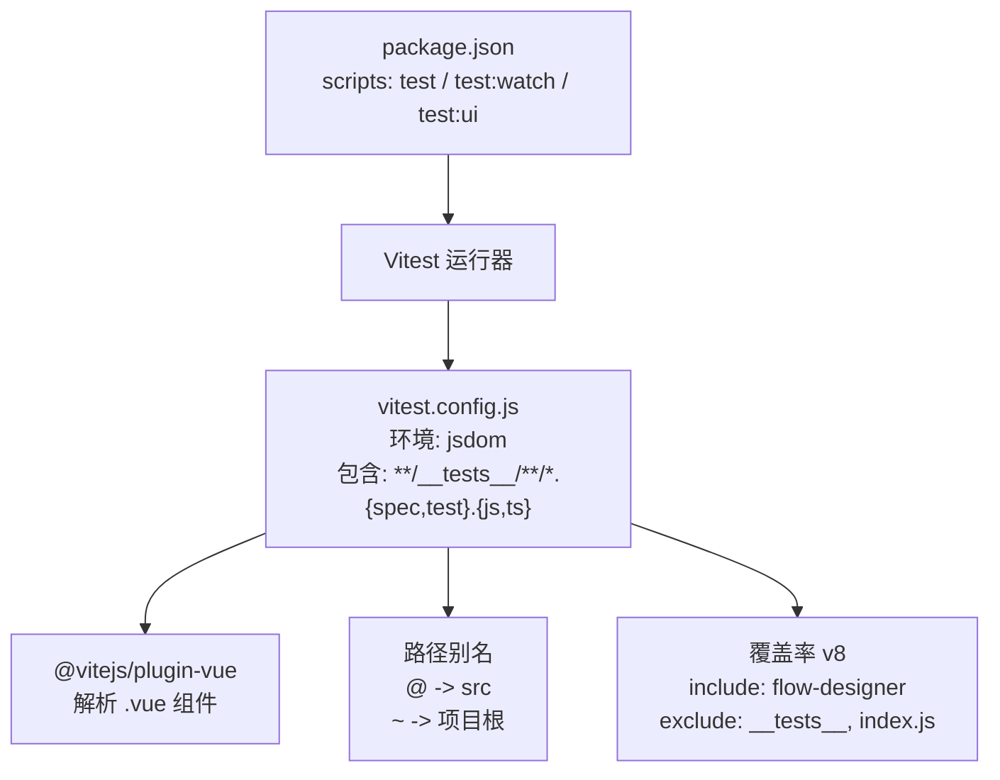
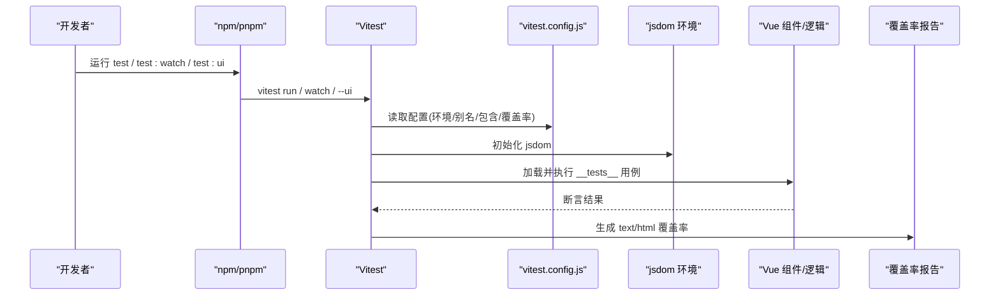
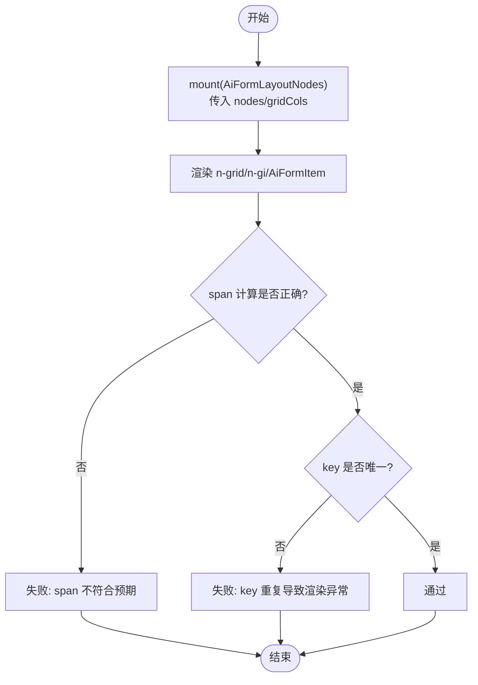
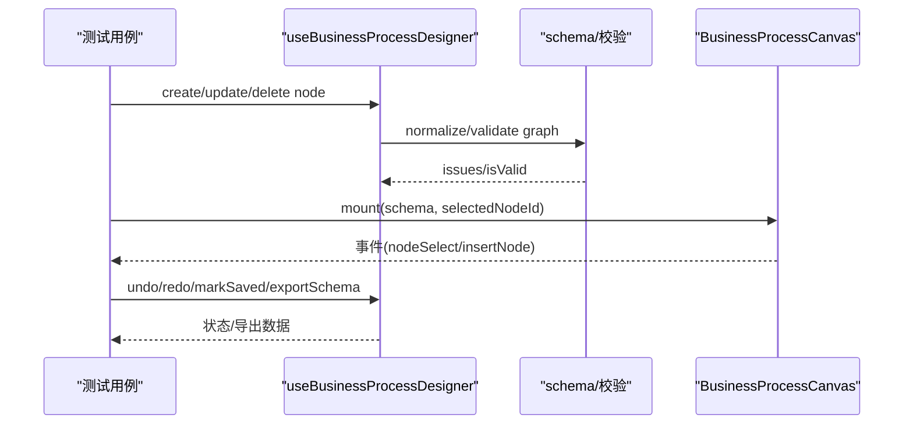
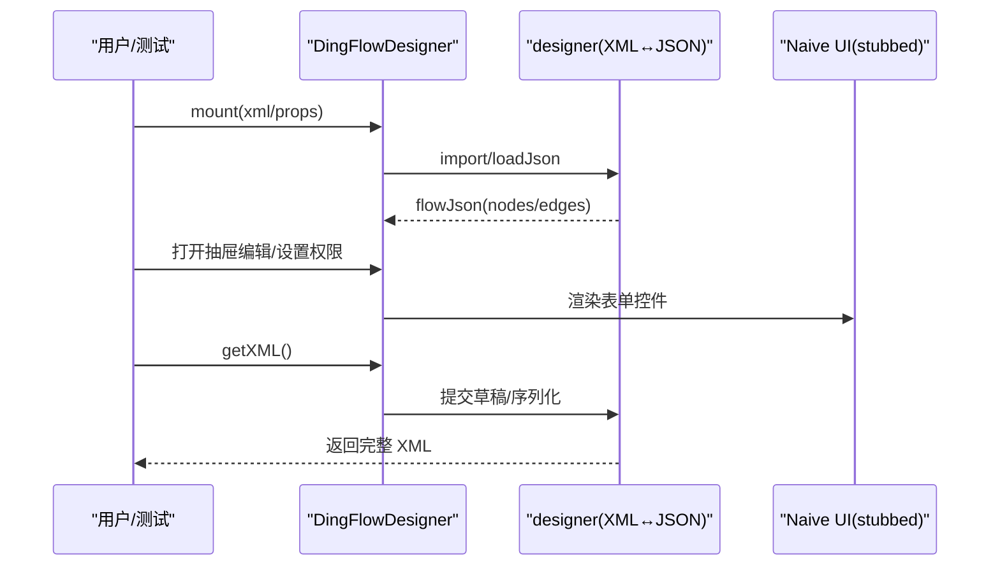
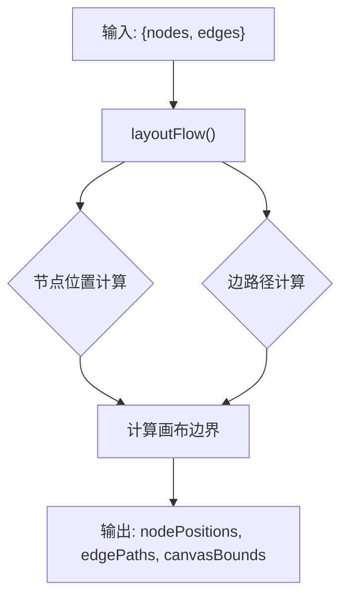
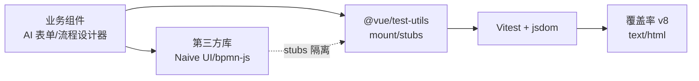

# 组件测试

<cite>
**本文引用的文件**
- [vitest.config.js](file://forge-admin-ui/vitest.config.js)
- [package.json](file://forge-admin-ui/package.json)
- [AiFormLayoutNodes.spec.js](file://forge-admin-ui/src/components/ai-form/__tests__/AiFormLayoutNodes.spec.js)
- [business-process-designer.spec.js](file://forge-admin-ui/src/components/business-process-designer/__tests__/business-process-designer.spec.js)
- [DingFlowDesigner.spec.js](file://forge-admin-ui/src/components/flow-designer/__tests__/DingFlowDesigner.spec.js)
- [layout-engine.spec.js](file://forge-admin-ui/src/components/flow-designer/canvas/__tests__/layout-engine.spec.js)
- [cron-builder.test.js](file://forge-admin-ui/src/components/job/__tests__/cron-builder.test.js)
</cite>

## 目录
1. [简介](#简介)
2. [项目结构](#项目结构)
3. [核心组件](#核心组件)
4. [架构总览](#架构总览)
5. [详细组件分析](#详细组件分析)
6. [依赖分析](#依赖分析)
7. [性能考虑](#性能考虑)
8. [故障排查指南](#故障排查指南)
9. [结论](#结论)
10. [附录](#附录)

## 简介
本指南面向 Forge Admin 前端项目的组件测试，聚焦 Vitest 在 Vue 3 工程中的配置与使用，覆盖单元测试、集成测试与端到端测试策略；总结复杂组件（AI 表单、BPMN/流程设计器、业务过程设计器）的测试方法；给出覆盖率要求、性能测试与快照测试的实施建议；并提供本地环境搭建、持续集成与报告生成的实践。

## 项目结构
- 测试框架与运行入口
  - 使用 Vitest 作为测试运行器，jsdom 作为浏览器环境，启用全局 API。
  - 测试用例统一放在各模块下的 __tests__ 目录，命名以 .spec.js 或 .test.js 结尾。
  - 通过 package.json scripts 提供 run/watch/ui 三种运行方式。
- 独立 Vitest 配置
  - 为提升单测启动速度，Vitest 配置不复用 Vite 构建配置，仅保留解析 .vue 的最小插件集。
  - 路径别名 @ 指向 src，~ 指向项目根，便于测试中引用源码。
  - 覆盖率统计默认针对 flow-designer 子模块，排除测试与聚合 index 文件。

**图示来源**
- [vitest.config.js:1-36](file://forge-admin-ui/vitest.config.js#L1-L36)
- [package.json:6-18](file://forge-admin-ui/package.json#L6-L18)

**章节来源**
- [vitest.config.js:1-36](file://forge-admin-ui/vitest.config.js#L1-L36)
- [package.json:6-18](file://forge-admin-ui/package.json#L6-L18)

## 核心组件
- 测试基座与环境
  - 使用 @vue/test-utils 的 mount 挂载组件，配合 vi.mock 进行依赖模拟。
  - 通过 global.stubs 替换第三方 UI 库组件，避免全局样式与注册问题。
- 断言与交互
  - 基于 expect 进行 DOM 属性、文本、事件触发与状态变更断言。
  - 对异步渲染使用 await wrapper.$nextTick() 或 Promise 等待。
- 覆盖率
  - 使用 v8 提供者生成 text/html 报告，当前范围限定于流程设计器相关代码，便于快速定位核心质量指标。

**章节来源**
- [AiFormLayoutNodes.spec.js:1-46](file://forge-admin-ui/src/components/ai-form/__tests__/AiFormLayoutNodes.spec.js#L1-L46)
- [DingFlowDesigner.spec.js:42-75](file://forge-admin-ui/src/components/flow-designer/__tests__/DingFlowDesigner.spec.js#L42-L75)
- [vitest.config.js:22-35](file://forge-admin-ui/vitest.config.js#L22-L35)

## 架构总览
下图展示从脚本到运行时的关键链路：npm script 调用 Vitest，Vitest 加载独立配置，初始化 jsdom 环境并解析 Vue 组件，执行 __tests__ 下的用例，产出覆盖率报告。

**图示来源**
- [package.json:6-18](file://forge-admin-ui/package.json#L6-L18)
- [vitest.config.js:1-36](file://forge-admin-ui/vitest.config.js#L1-L36)

## 详细组件分析

### AI 表单布局节点测试（AiFormLayoutNodes）
- 目标
  - 验证栅格 span 语义与设计器一致，确保 row 容器与字段节点的列数计算正确。
  - 保证复制组件后 key 唯一性，避免 Vue keyed diff 异常。
- 关键点
  - 使用 stubs 替换 NGrid/NGi/AiFormItem，暴露 data-span/data-cols/data-key 等属性用于断言。
  - 通过 setProps 动态更新 nodes，验证 keyed children 的唯一性与渲染数量。
  - 断言不同顶层 gridCols 下 span 的钳制行为与默认值。

**图示来源**
- [AiFormLayoutNodes.spec.js:39-108](file://forge-admin-ui/src/components/ai-form/__tests__/AiFormLayoutNodes.spec.js#L39-L108)
- [AiFormLayoutNodes.spec.js:110-149](file://forge-admin-ui/src/components/ai-form/__tests__/AiFormLayoutNodes.spec.js#L110-L149)

**章节来源**
- [AiFormLayoutNodes.spec.js:1-150](file://forge-admin-ui/src/components/ai-form/__tests__/AiFormLayoutNodes.spec.js#L1-L150)

### 业务过程设计器测试（Business Process Designer）
- 目标
  - 校验业务过程 schema 的创建、归一化、校验规则与可视化布局。
  - 验证条件表达式编译/解析、节点增删改、撤销重做、脏标记与导出深拷贝。
  - 验证画布共享视口与边层、插入控制、审批/条件分支布局与路由。
- 关键点
  - 直接导入业务过程相关的工具函数与组件进行单元/集成测试。
  - 通过 useBusinessProcessDesigner 操作 schema，断言图结构与约束。
  - 对 BusinessProcessCanvas 进行挂载与交互断言（点击、选择、插入）。

**图示来源**
- [business-process-designer.spec.js:18-114](file://forge-admin-ui/src/components/business-process-designer/__tests__/business-process-designer.spec.js#L18-L114)
- [business-process-designer.spec.js:187-381](file://forge-admin-ui/src/components/business-process-designer/__tests__/business-process-designer.spec.js#L187-L381)
- [business-process-designer.spec.js:383-586](file://forge-admin-ui/src/components/business-process-designer/__tests__/business-process-designer.spec.js#L383-L586)

**章节来源**
- [business-process-designer.spec.js:1-708](file://forge-admin-ui/src/components/business-process-designer/__tests__/business-process-designer.spec.js#L1-L708)

### 钉钉流程设计器测试（DingFlowDesigner）
- 目标
  - 验证 XML 输入加载、JSON 往返、只读模式、发起节点与网关分支配置。
  - 断言抽屉草稿提交、权限字段持久化、复杂驳回回路布局。
- 关键点
  - 通过 STUBS 替换 Naive UI 组件，减少外部依赖干扰。
  - 使用 getXML/setXML/reset 等方法进行状态切换与断言。
  - 对分支标签位置与重叠进行几何断言，保障 UX 稳定性。

**图示来源**
- [DingFlowDesigner.spec.js:70-75](file://forge-admin-ui/src/components/flow-designer/__tests__/DingFlowDesigner.spec.js#L70-L75)
- [DingFlowDesigner.spec.js:144-238](file://forge-admin-ui/src/components/flow-designer/__tests__/DingFlowDesigner.spec.js#L144-L238)
- [DingFlowDesigner.spec.js:286-412](file://forge-admin-ui/src/components/flow-designer/__tests__/DingFlowDesigner.spec.js#L286-L412)

**章节来源**
- [DingFlowDesigner.spec.js:1-413](file://forge-admin-ui/src/components/flow-designer/__tests__/DingFlowDesigner.spec.js#L1-L413)

### 流程布局引擎测试（layout-engine）
- 目标
  - 验证线性与分支流程的节点位置、边路径类型、画布边界与尺寸默认值。
  - 确保空输入与可选项覆盖不会引发异常。
- 关键点
  - 直接对 layoutFlow 进行纯函数式测试，关注输出数据结构与几何约束。
  - 对网关菱形尺寸与连线端点连接点进行精确断言。

**图示来源**
- [layout-engine.spec.js:1-122](file://forge-admin-ui/src/components/flow-designer/canvas/__tests__/layout-engine.spec.js#L1-L122)

**章节来源**
- [layout-engine.spec.js:1-122](file://forge-admin-ui/src/components/flow-designer/canvas/__tests__/layout-engine.spec.js#L1-L122)

### Cron 构建器测试（cron-builder）
- 目标
  - 验证简单调度表达式构建与解析，复杂表达式回退专家模式。
- 关键点
  - 对 buildCronExpression/parseCronExpression 进行双向一致性断言。

**章节来源**
- [cron-builder.test.js:1-26](file://forge-admin-ui/src/components/job/__tests__/cron-builder.test.js#L1-L26)

## 依赖分析
- 运行时依赖
  - Vue 3、Naive UI、bpmn-js、diagram-js 等被组件广泛使用，测试中通过 stubs 隔离。
- 测试依赖
  - vitest、@vue/test-utils、jsdom、@vitest/ui 用于运行与 UI 调试。
- 耦合关系
  - 测试用例与业务逻辑强内聚，集中在对应模块的 __tests__ 目录，降低跨模块耦合。
  - 覆盖率范围集中于 flow-designer，体现该模块复杂度与质量重点。

**图示来源**
- [package.json:75-105](file://forge-admin-ui/package.json#L75-L105)
- [vitest.config.js:22-35](file://forge-admin-ui/vitest.config.js#L22-L35)

**章节来源**
- [package.json:75-105](file://forge-admin-ui/package.json#L75-L105)
- [vitest.config.js:22-35](file://forge-admin-ui/vitest.config.js#L22-L35)

## 性能考虑
- 启动与执行
  - 使用独立 vitest.config.js 避免生产构建插件开销，缩短冷启动时间。
  - 通过 stubs 替换重型 UI 组件，减少渲染与样式解析成本。
- 覆盖率采集
  - 仅对高复杂度模块开启覆盖率，避免全量扫描拖慢 CI。
- 建议
  - 将大型第三方库（如 bpmn-js）进一步拆分为可测试的纯函数接口，便于更快更稳地测试。
  - 对布局算法类逻辑采用无 DOM 的纯函数测试，提高吞吐。

[本节为通用指导，不直接分析具体文件]

## 故障排查指南
- 常见问题
  - 组件未注册或样式缺失：使用 global.stubs 替换 UI 组件，确保最小可用模板。
  - 路由依赖：使用 vi.mock('vue-router') 提供 useRoute/useRouter 的简化实现。
  - 异步渲染：使用 await wrapper.$nextTick() 或等待 Promise 后再断言。
  - 键冲突：确保 v-for 的 key 唯一，必要时通过 data-key 暴露 vnode.key 进行断言。
- 定位技巧
  - 使用 vitest --ui 交互式查看用例与断言失败详情。
  - 缩小测试范围至最小复现用例，逐步添加依赖与交互。
  - 对布局类问题，打印节点位置与边路径，结合几何断言定位偏差。

**章节来源**
- [AiFormLayoutNodes.spec.js:6-14](file://forge-admin-ui/src/components/ai-form/__tests__/AiFormLayoutNodes.spec.js#L6-L14)
- [DingFlowDesigner.spec.js:42-75](file://forge-admin-ui/src/components/flow-designer/__tests__/DingFlowDesigner.spec.js#L42-L75)

## 结论
本项目已建立以 Vitest 为核心的组件测试体系，围绕 AI 表单、业务过程与流程设计器等复杂组件形成稳定的单测与集成测用例。通过独立配置、stubbing 与几何断言等手段，有效保障了核心交互与布局的正确性。建议在后续迭代中扩展覆盖率范围、引入性能基准与快照回归，并在 CI 中固化报告与门禁。

[本节为总结性内容，不直接分析具体文件]

## 附录

### 测试策略与最佳实践
- 单元测试
  - 对纯函数（如 cron-builder、layout-engine）进行输入输出断言，无需 DOM。
  - 对工具函数（条件表达式编译/解析）进行双向一致性测试。
- 集成测试
  - 使用 mount 挂载真实组件，stub 第三方 UI，断言事件与状态流转。
  - 对设计器工作流（增删改、撤销重做、脏标记、导出）进行端到端式用例编排。
- 端到端测试
  - 可在现有基础上接入 Playwright/Cypress，覆盖浏览器级交互与网络请求。
- 模拟依赖
  - 使用 vi.mock 模拟 vue-router、API 调用、Pinia store 等外部依赖。
- 事件触发
  - 通过 trigger('click'/'change'/'input') 模拟用户交互，断言 emitted 事件。
- 异步处理
  - 使用 await wrapper.$nextTick() 或 async/await 等待渲染完成。
- 断言编写
  - 优先断言可见行为（DOM 属性、文本、事件），再断言内部状态。
  - 对布局类断言使用坐标、尺寸、路径类型等几何约束。

[本节为通用指导，不直接分析具体文件]

### 覆盖率要求
- 当前配置
  - 覆盖率提供者：v8
  - 报告格式：text、html
  - 包含范围：src/components/flow-designer/**/*.{js,ts,vue}
  - 排除：__tests__ 与聚合 index.js
- 建议
  - 逐步扩大覆盖率范围至 ai-form、business-process-designer 等核心模块。
  - 设定阈值（如行覆盖率≥80%、分支覆盖率≥70%）并在 CI 中阻断低覆盖率合并。

**章节来源**
- [vitest.config.js:26-35](file://forge-admin-ui/vitest.config.js#L26-L35)

### 性能测试
- 建议方案
  - 使用 Vitest 的 benchmark 能力对布局算法、表达式编译等热点路径进行基准测试。
  - 对大流程图渲染进行内存与耗时监控，记录回归基线。
- 实施要点
  - 固定输入规模，多次采样取中位数。
  - 对比不同优化版本的性能差异，辅助决策。

[本节为通用指导，不直接分析具体文件]

### 快照测试
- 适用场景
  - 复杂组件的渲染结构变化较大时，可使用快照捕获 DOM 结构，防止意外回归。
- 注意事项
  - 快照易受样式与第三方库版本影响，建议仅对稳定输出的结构化片段使用。
  - 定期审查快照变更，避免“快照漂移”。

[本节为通用指导，不直接分析具体文件]

### 环境搭建与运行
- 安装依赖
  - 在项目根或 forge-admin-ui 目录下执行包管理器安装命令。
- 运行测试
  - 单次运行：pnpm test
  - 监听模式：pnpm test:watch
  - UI 模式：pnpm test:ui
- 生成覆盖率
  - 运行测试后，在 coverage 目录查看 text/html 报告。

**章节来源**
- [package.json:6-18](file://forge-admin-ui/package.json#L6-L18)

### 持续集成与报告
- CI 建议
  - 在流水线中执行 pnpm test 与 pnpm test:ui（可选），并上传覆盖率报告。
  - 设置覆盖率阈值门禁，低于阈值则失败。
- 报告归档
  - 将 html 报告作为工件保存，便于历史对比与审计。

[本节为通用指导，不直接分析具体文件]