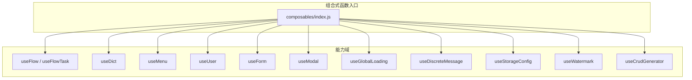
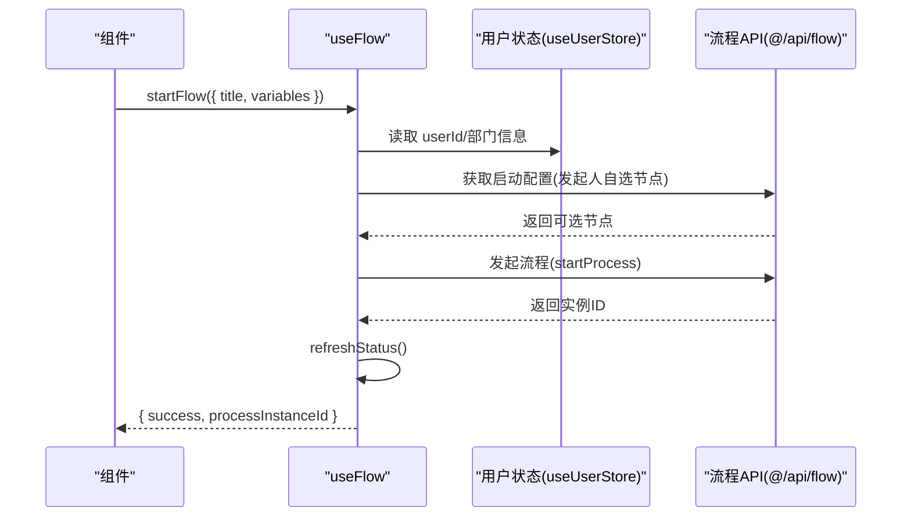
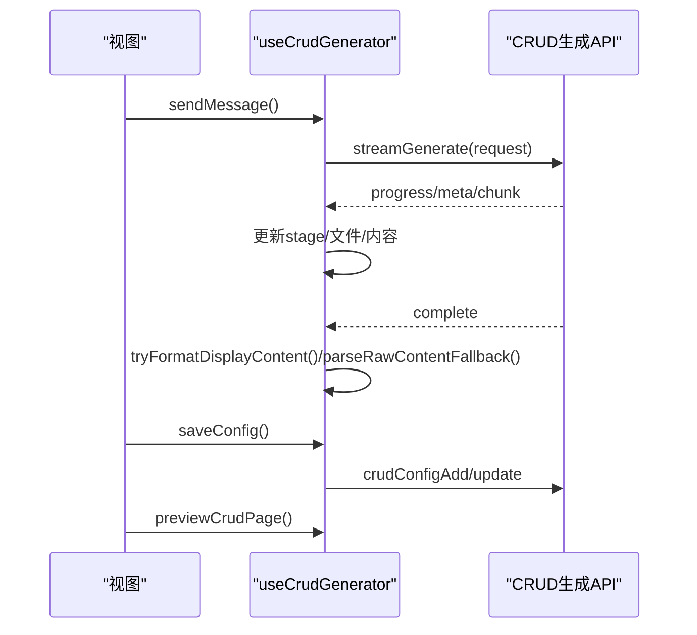
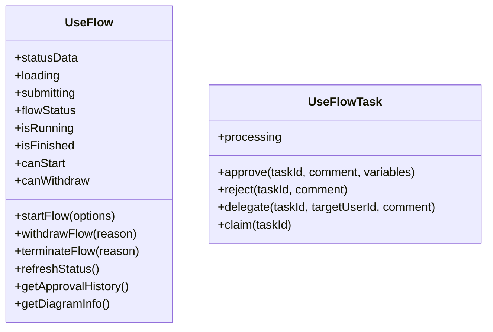
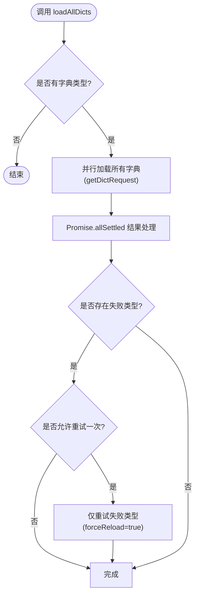
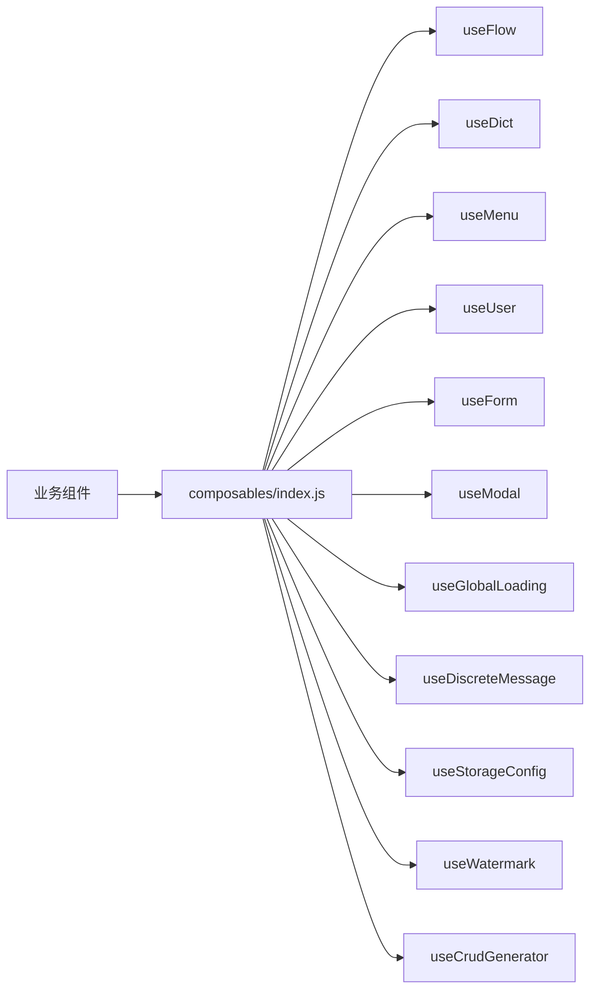

# 组合式函数开发

<cite>
**本文引用的文件**
- [forge-admin-ui/src/composables/index.js](file://forge-admin-ui/src/composables/index.js)
- [forge-admin-ui/src/composables/useCrudGenerator.js](file://forge-admin-ui/src/composables/useCrudGenerator.js)
- [forge-admin-ui/src/composables/useFlow.js](file://forge-admin-ui/src/composables/useFlow.js)
- [forge-admin-ui/src/composables/useUser.js](file://forge-admin-ui/src/composables/useUser.js)
- [forge-admin-ui/src/composables/useForm.js](file://forge-admin-ui/src/composables/useForm.js)
- [forge-admin-ui/src/composables/useDict.js](file://forge-admin-ui/src/composables/useDict.js)
- [forge-admin-ui/src/composables/useModal.js](file://forge-admin-ui/src/composables/useModal.js)
- [forge-admin-ui/src/composables/useMenu.js](file://forge-admin-ui/src/composables/useMenu.js)
- [forge-admin-ui/src/composables/useGlobalLoading.js](file://forge-admin-ui/src/composables/useGlobalLoading.js)
- [forge-admin-ui/src/composables/useDiscreteMessage.js](file://forge-admin-ui/src/composables/useDiscreteMessage.js)
- [forge-admin-ui/src/composables/useStorageConfig.js](file://forge-admin-ui/src/composables/useStorageConfig.js)
- [forge-admin-ui/src/composables/useWatermark.js](file://forge-admin-ui/src/composables/useWatermark.js)
- [forge-admin-ui/src/composables/__tests__/useDict.spec.js](file://forge-admin-ui/src/composables/__tests__/useDict.spec.js)
- [forge-admin-ui/package.json](file://forge-admin-ui/package.json)
</cite>

## 目录
1. [简介](#简介)
2. [项目结构](#项目结构)
3. [核心组件](#核心组件)
4. [架构总览](#架构总览)
5. [详细组件分析](#详细组件分析)
6. [依赖关系分析](#依赖关系分析)
7. [性能考量](#性能考量)
8. [故障排查指南](#故障排查指南)
9. [结论](#结论)
10. [附录](#附录)

## 简介
本指南面向 Forge Admin 前端项目的组合式函数（Composables）开发与使用，聚焦 Composition API 的设计思想与工程实践。内容涵盖：
- 状态共享、逻辑复用与测试友好性的设计原则
- 现有组合式函数的实现模式与职责边界（如 useCrudGenerator、useFlow、useUser 等）
- 开发规范（命名约定、参数设计、返回值规范、错误处理）
- 测试策略与性能优化技巧
- 如何创建业务相关组合式函数与通用工具函数

## 项目结构
Forge Admin 前端的组合式函数集中于 forge-admin-ui/src/composables 目录，并通过 index.js 统一导出，便于在页面或组件中按需引入。该目录包含多种能力域的组合式函数：
- 业务编排：useFlow、useFlowTask
- 数据与配置：useDict、useStorageConfig、useCodeAppMetadata
- 交互与体验：useModal、useGlobalLoading、useWatermark、useDiscreteMessage
- 导航与权限：useMenu
- 表单与生成器：useForm、useCrudGenerator
- 用户与认证：useUser

图表来源
- [forge-admin-ui/src/composables/index.js:1-10](file://forge-admin-ui/src/composables/index.js#L1-L10)

章节来源
- [forge-admin-ui/src/composables/index.js:1-10](file://forge-admin-ui/src/composables/index.js#L1-L10)

## 核心组件
- useFlow / useFlowTask：封装业务流程发起、撤回、终止、审批任务处理等，屏蔽流程引擎细节，提供计算属性（运行/结束/可操作状态）和统一方法。
- useDict：字典数据加载与缓存，支持并发请求合并、失败重试、按类型获取标签/项。
- useMenu：菜单数据处理、活跃项计算、导航跳转（含外链、SSO、报表目标、iframe 内嵌）。
- useUser：用户信息展示、头像加载、下拉菜单与退出登录流程。
- useForm：轻量表单 ref、模型与校验规则封装，返回数组形式便于解构。
- useModal：模态框 ref 与确认按钮 loading 状态绑定。
- useGlobalLoading：全局加载状态管理，自动推断文本、延迟显示、最小可见时间、请求级注入。
- useDiscreteMessage：基于 Naive UI 的离散消息封装。
- useStorageConfig：默认存储配置的全局缓存与 computed 访问。
- useWatermark：水印配置加载、动态内容解析、Canvas 绘制与样式输出。
- useCrudGenerator：AI 驱动的 CRUD 配置生成会话管理、SSE 流式接收、多文件分片解析、保存与预览。

章节来源
- [forge-admin-ui/src/composables/useFlow.js:1-388](file://forge-admin-ui/src/composables/useFlow.js#L1-L388)
- [forge-admin-ui/src/composables/useDict.js:1-254](file://forge-admin-ui/src/composables/useDict.js#L1-L254)
- [forge-admin-ui/src/composables/useMenu.js:1-577](file://forge-admin-ui/src/composables/useMenu.js#L1-L577)
- [forge-admin-ui/src/composables/useUser.js:1-164](file://forge-admin-ui/src/composables/useUser.js#L1-L164)
- [forge-admin-ui/src/composables/useForm.js:1-18](file://forge-admin-ui/src/composables/useForm.js#L1-L18)
- [forge-admin-ui/src/composables/useModal.js:1-13](file://forge-admin-ui/src/composables/useModal.js#L1-L13)
- [forge-admin-ui/src/composables/useGlobalLoading.js:1-352](file://forge-admin-ui/src/composables/useGlobalLoading.js#L1-L352)
- [forge-admin-ui/src/composables/useDiscreteMessage.js:1-16](file://forge-admin-ui/src/composables/useDiscreteMessage.js#L1-L16)
- [forge-admin-ui/src/composables/useStorageConfig.js:1-69](file://forge-admin-ui/src/composables/useStorageConfig.js#L1-L69)
- [forge-admin-ui/src/composables/useWatermark.js:1-315](file://forge-admin-ui/src/composables/useWatermark.js#L1-L315)
- [forge-admin-ui/src/composables/useCrudGenerator.js:1-869](file://forge-admin-ui/src/composables/useCrudGenerator.js#L1-L869)

## 架构总览
组合式函数遵循“单一职责 + 高内聚”的原则，通过 Vue 响应式 API（ref/computed/watch）组织状态与副作用，对外暴露稳定的 API 契约。典型调用链如下：

图表来源
- [forge-admin-ui/src/composables/useFlow.js:121-162](file://forge-admin-ui/src/composables/useFlow.js#L121-L162)
- [forge-admin-ui/src/composables/useFlow.js:89-109](file://forge-admin-ui/src/composables/useFlow.js#L89-L109)

章节来源
- [forge-admin-ui/src/composables/useFlow.js:1-388](file://forge-admin-ui/src/composables/useFlow.js#L1-L388)

## 详细组件分析

### useCrudGenerator：AI 驱动 CRUD 配置生成
- 职责：管理 AI 会话、SSE 流式接收、多文件内容拼装、JSON 格式化、保存与预览。
- 关键流程：发送消息 -> SSE 进度/元数据/分块 -> 阶段映射到文件 -> 完成时兜底解析 -> 保存配置 -> 预览页面。
- 错误处理：捕获网络与解析异常，提示用户；支持中止生成。
- 性能：避免重复请求、增量更新 displayContent、JSON 美化减少渲染抖动。

图表来源
- [forge-admin-ui/src/composables/useCrudGenerator.js:231-320](file://forge-admin-ui/src/composables/useCrudGenerator.js#L231-L320)
- [forge-admin-ui/src/composables/useCrudGenerator.js:322-448](file://forge-admin-ui/src/composables/useCrudGenerator.js#L322-L448)
- [forge-admin-ui/src/composables/useCrudGenerator.js:450-582](file://forge-admin-ui/src/composables/useCrudGenerator.js#L450-L582)
- [forge-admin-ui/src/composables/useCrudGenerator.js:620-671](file://forge-admin-ui/src/composables/useCrudGenerator.js#L620-L671)
- [forge-admin-ui/src/composables/useCrudGenerator.js:766-777](file://forge-admin-ui/src/composables/useCrudGenerator.js#L766-L777)

章节来源
- [forge-admin-ui/src/composables/useCrudGenerator.js:1-869](file://forge-admin-ui/src/composables/useCrudGenerator.js#L1-L869)

### useFlow / useFlowTask：业务流程集成
- 职责：封装流程生命周期（发起、撤回、终止）、任务处理（通过、驳回、转办、签收），并提供状态计算属性。
- 关键点：businessKey 变化自动刷新；发起人自选节点收集；统一提交态与错误返回。

图表来源
- [forge-admin-ui/src/composables/useFlow.js:20-288](file://forge-admin-ui/src/composables/useFlow.js#L20-L288)
- [forge-admin-ui/src/composables/useFlow.js:294-387](file://forge-admin-ui/src/composables/useFlow.js#L294-L387)

章节来源
- [forge-admin-ui/src/composables/useFlow.js:1-388](file://forge-admin-ui/src/composables/useFlow.js#L1-L388)

### useDict：字典数据管理与缓存
- 职责：按字典类型加载数据，全局缓存与并发去重，失败重试，提供 getLabel/getDict。
- 关键点：Promise.allSettled 逐项处理；pending 队列避免重复请求；clearDictCache 用于测试与刷新。

图表来源
- [forge-admin-ui/src/composables/useDict.js:155-207](file://forge-admin-ui/src/composables/useDict.js#L155-L207)
- [forge-admin-ui/src/composables/useDict.js:73-108](file://forge-admin-ui/src/composables/useDict.js#L73-L108)

章节来源
- [forge-admin-ui/src/composables/useDict.js:1-254](file://forge-admin-ui/src/composables/useDict.js#L1-L254)

### useMenu：菜单与导航
- 职责：处理菜单数据、活跃项计算、路由跳转（含外链、SSO、报表目标、iframe）。
- 关键点：computed 派生 processedMenus/flatMenuItems；handleMenuSelect 统一入口；支持 query 参数透传与标题注入。

章节来源
- [forge-admin-ui/src/composables/useMenu.js:1-577](file://forge-admin-ui/src/composables/useMenu.js#L1-L577)

### useUser：用户信息与认证
- 职责：用户名/头像计算、下拉菜单行为、退出登录流程。
- 关键点：头像 URL 解析；退出时调用 store 与 API；错误区分静默认证错误。

章节来源
- [forge-admin-ui/src/composables/useUser.js:1-164](file://forge-admin-ui/src/composables/useUser.js#L1-L164)

### useForm：表单封装
- 职责：返回 formRef、formModel、validation、rules 的数组形式，简化模板绑定。
- 关键点：使用 lodash-es 深拷贝初始值；rules 提供必填默认规则。

章节来源
- [forge-admin-ui/src/composables/useForm.js:1-18](file://forge-admin-ui/src/composables/useForm.js#L1-L18)

### useModal：模态框封装
- 职责：提供 modalRef 与 okLoading 计算属性，方便控制确认按钮加载态。

章节来源
- [forge-admin-ui/src/composables/useModal.js:1-13](file://forge-admin-ui/src/composables/useModal.js#L1-L13)

### useGlobalLoading：全局加载状态
- 职责：统一管理全局加载显示、文本推断、延迟显示、最小可见时间、请求级注入。
- 关键点：withGlobalLoading/managedFetch/attachRequestGlobalLoading 三种接入方式；document 锁防止误操作。

章节来源
- [forge-admin-ui/src/composables/useGlobalLoading.js:1-352](file://forge-admin-ui/src/composables/useGlobalLoading.js#L1-L352)

### useDiscreteMessage：离散消息
- 职责：封装 Naive UI 的消息 API，提供 success/error/warning/info/loading。

章节来源
- [forge-admin-ui/src/composables/useDiscreteMessage.js:1-16](file://forge-admin-ui/src/composables/useDiscreteMessage.js#L1-L16)

### useStorageConfig：存储配置缓存
- 职责：加载并缓存默认存储配置，提供 computed 访问 storageType/fileSize/allowedTypes。

章节来源
- [forge-admin-ui/src/composables/useStorageConfig.js:1-69](file://forge-admin-ui/src/composables/useStorageConfig.js#L1-L69)

### useWatermark：水印功能
- 职责：加载水印配置、解析动态内容（用户信息/字典）、Canvas 绘制、样式输出与定时刷新。
- 关键点：白名单路径跳过；监听用户信息变化；清理定时器。

章节来源
- [forge-admin-ui/src/composables/useWatermark.js:1-315](file://forge-admin-ui/src/composables/useWatermark.js#L1-L315)

## 依赖关系分析
- 内部依赖：组合式函数之间保持松耦合，主要通过 Pinia Store（如 useUserStore、useAuthStore、usePermissionStore）与 utils/api 进行协作。
- 外部依赖：Vue 3 响应式 API、Naive UI（消息/对话框）、Axios/Vue Router、@vueuse/core、lodash-es 等。
- 模块导出：composables/index.js 作为统一入口，便于按需导入。

图表来源
- [forge-admin-ui/src/composables/index.js:1-10](file://forge-admin-ui/src/composables/index.js#L1-L10)

章节来源
- [forge-admin-ui/src/composables/index.js:1-10](file://forge-admin-ui/src/composables/index.js#L1-L10)
- [forge-admin-ui/package.json:19-73](file://forge-admin-ui/package.json#L19-L73)

## 性能考量
- 字典缓存与并发去重：useDict 使用 Map 缓存与 pending 队列，避免重复请求与竞态。
- 全局加载节流：useGlobalLoading 设置延迟显示与最小可见时间，避免闪烁。
- 流式渲染：useCrudGenerator 对 SSE 分块增量更新 displayContent，并在完成后尝试 JSON 美化，减少重排。
- 计算属性派生：useMenu/useUser/useWatermark 大量使用 computed，降低不必要的重新计算。
- 资源释放：useWatermark 在卸载时清理定时器；useCrudGenerator 支持中止生成。

[本节为通用指导，不直接分析具体文件]

## 故障排查指南
- 字典加载失败：检查接口返回码与字段映射；必要时调用 clearDictCache 后 reload。
- 流程发起失败：确认 businessKey/title 必填；检查发起人自选节点配置；查看 refreshStatus 后的状态。
- 全局加载未关闭：确认 withGlobalLoading/managedFetch 的 finally 分支执行；检查 attachRequestGlobalLoading 是否被正确注入。
- 水印不显示：检查 token 与白名单；确认 enable 与 content 解析结果；查看 Canvas 生成的 dataURL。
- 菜单跳转异常：确认 handleMenuSelect 的路径解析与 SSO/报表目标判断；检查 route.meta.parentKey 与 activeKey 计算。

章节来源
- [forge-admin-ui/src/composables/useDict.js:155-207](file://forge-admin-ui/src/composables/useDict.js#L155-L207)
- [forge-admin-ui/src/composables/useFlow.js:121-162](file://forge-admin-ui/src/composables/useFlow.js#L121-L162)
- [forge-admin-ui/src/composables/useGlobalLoading.js:244-311](file://forge-admin-ui/src/composables/useGlobalLoading.js#L244-L311)
- [forge-admin-ui/src/composables/useWatermark.js:174-224](file://forge-admin-ui/src/composables/useWatermark.js#L174-L224)
- [forge-admin-ui/src/composables/useMenu.js:461-560](file://forge-admin-ui/src/composables/useMenu.js#L461-L560)

## 结论
Forge Admin 的组合式函数体系以清晰职责、稳定契约与良好测试性为核心，覆盖业务编排、数据与配置、交互体验、导航权限等关键领域。通过统一的导出入口与模块化设计，开发者可以快速复用与扩展能力。建议在新功能开发中遵循本文的规范与最佳实践，确保代码一致性、可维护性与高性能。

[本节为总结性内容，不直接分析具体文件]

## 附录

### 组合式函数开发规范
- 命名约定
  - 文件名：useXxx.js（动词+名词，语义明确）
  - 导出：默认导出或具名导出均可，优先具名以便 tree-shaking
  - 入口：index.js 统一 re-export，便于集中导入
- 参数设计
  - 首参通常为上下文标识（如 processKey/businessKeyRef/dictTypes）
  - 可选参数使用对象展开，提供默认值与校验
  - 回调函数（如 selectInitiatorApprovers）需具备明确的入参与返回约束
- 返回值规范
  - 状态：ref/computed 暴露只读或双向绑定
  - 方法：异步方法返回 Promise，统一成功/失败结构（如 { success, message/data }）
  - 事件：如需事件，建议使用自定义事件或回调
- 错误处理
  - 网络层：统一拦截与提示（结合 useDiscreteMessage）
  - 业务层：抛出明确错误或返回结构化结果
  - 资源清理：onUnmounted/finally 中释放定时器、AbortController 等
- 测试策略
  - 单元测试：针对纯函数与缓存逻辑（如 useDict 的 getDictData/clearDictCache）
  - 模拟依赖：mock API 与 store，验证分支与异常路径
  - 端到端：结合 vitest/ui 进行交互验证

章节来源
- [forge-admin-ui/src/composables/useDict.js:1-254](file://forge-admin-ui/src/composables/useDict.js#L1-L254)
- [forge-admin-ui/src/composables/useFlow.js:1-388](file://forge-admin-ui/src/composables/useFlow.js#L1-L388)
- [forge-admin-ui/src/composables/useGlobalLoading.js:1-352](file://forge-admin-ui/src/composables/useGlobalLoading.js#L1-L352)
- [forge-admin-ui/src/composables/useDiscreteMessage.js:1-16](file://forge-admin-ui/src/composables/useDiscreteMessage.js#L1-L16)

### 测试示例与脚本
- 测试框架：vitest（见 package.json scripts）
- 用例参考：useDict 的 managed cache endpoint 测试，验证接口路径与数据转换

章节来源
- [forge-admin-ui/package.json:6-17](file://forge-admin-ui/package.json#L6-L17)
- [forge-admin-ui/src/composables/__tests__/useDict.spec.js:1-34](file://forge-admin-ui/src/composables/__tests__/useDict.spec.js#L1-L34)

### 创建业务相关组合式函数与通用工具函数
- 业务相关
  - 明确输入（上下文/标识）与输出（状态/方法）
  - 封装复杂流程（如流程发起、审批任务处理）
  - 提供计算属性简化 UI 状态（如 isRunning/isFinished）
- 通用工具
  - 无副作用或副作用可控（如 useGlobalLoading 的请求级注入）
  - 可插拔与可扩展（如 useWatermark 的内容解析器注册）
  - 易于测试（纯函数优先，外部依赖可 mock）

[本节为通用指导，不直接分析具体文件]