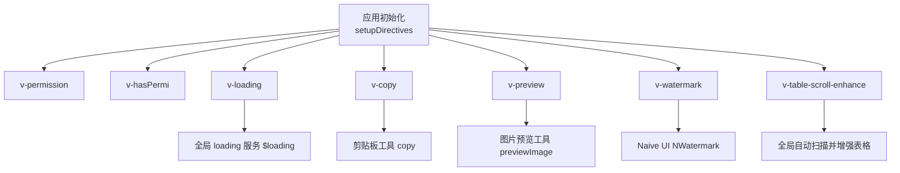
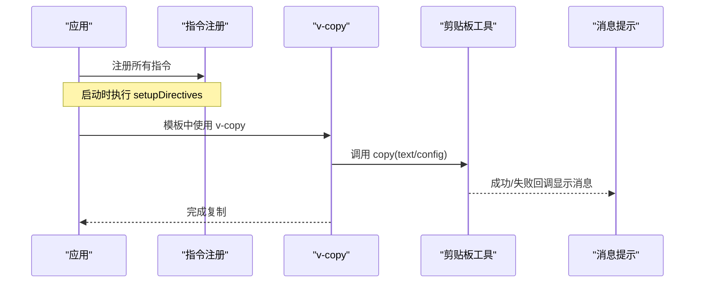
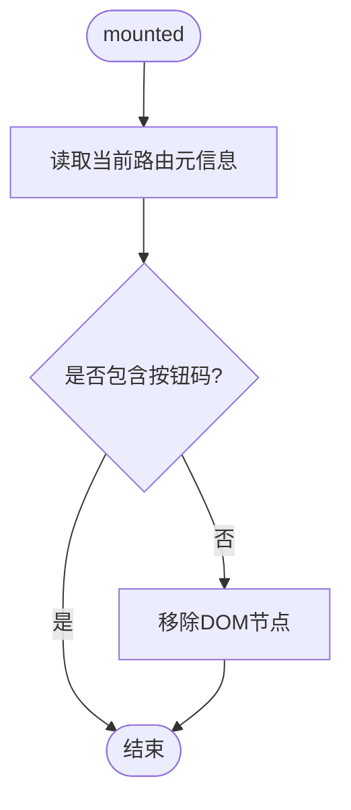
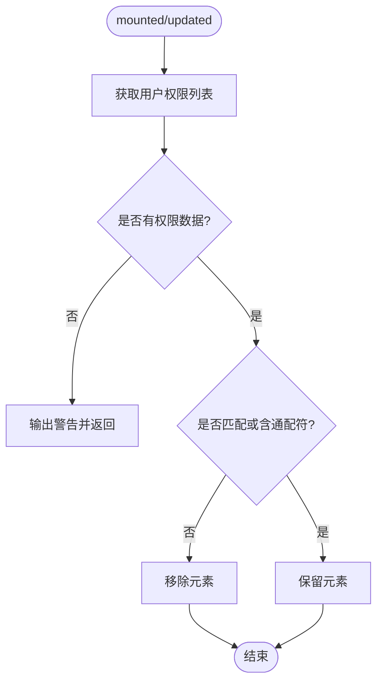
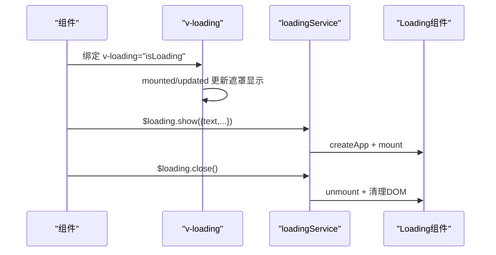
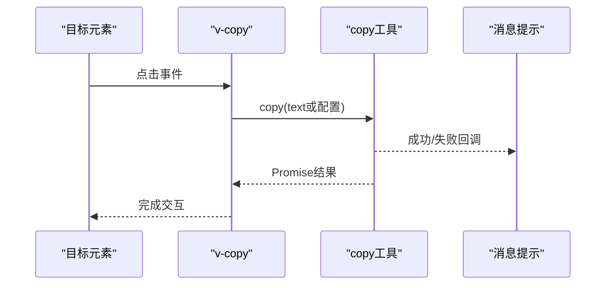
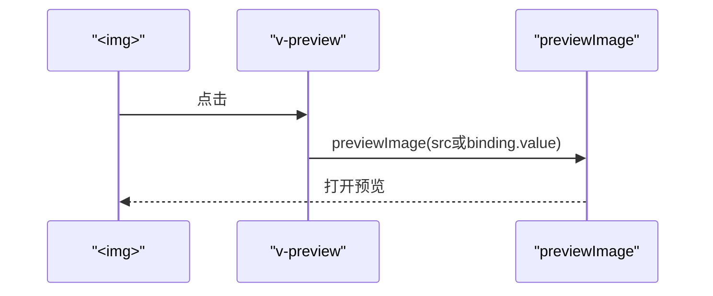
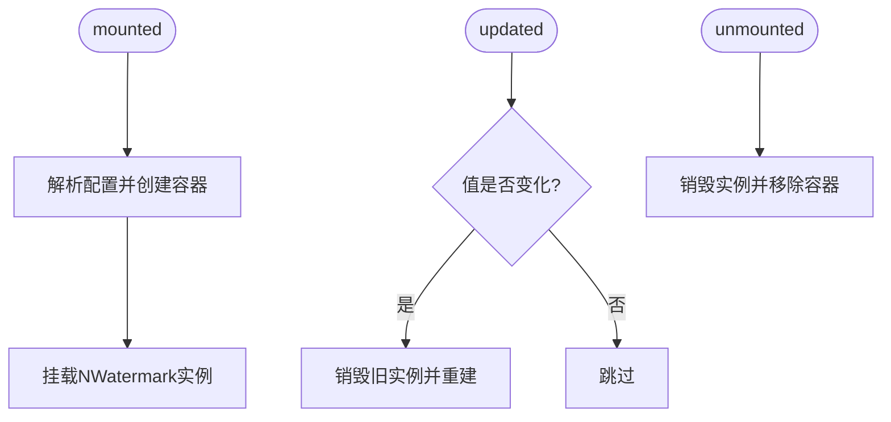
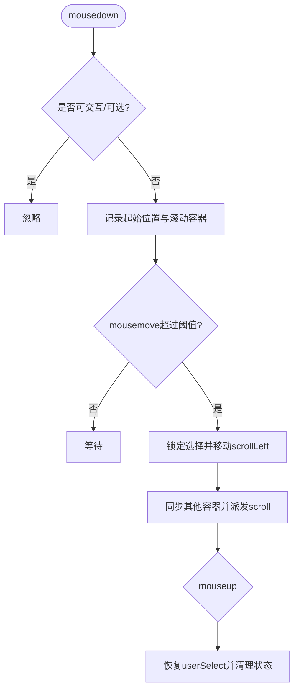
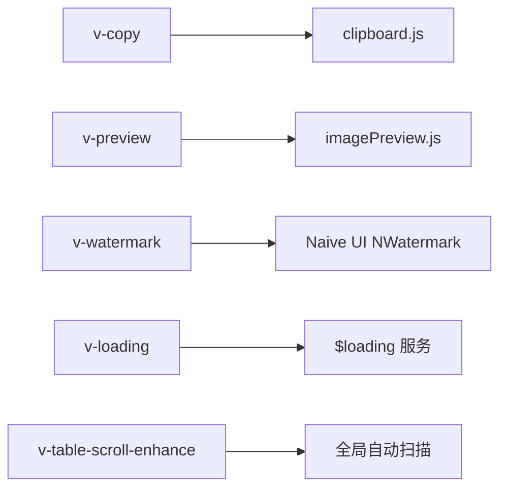

# 自定义指令开发

<cite>
**本文引用的文件**
- [index.js](file://forge-admin-ui/src/directives/index.js)
- [copy.js](file://forge-admin-ui/src/directives/modules/copy.js)
- [hasPermi.js](file://forge-admin-ui/src/directives/modules/hasPermi.js)
- [loading.js](file://forge-admin-ui/src/directives/modules/loading.js)
- [preview.js](file://forge-admin-ui/src/directives/modules/preview.js)
- [tableScrollEnhance.js](file://forge-admin-ui/src/directives/modules/tableScrollEnhance.js)
- [watermark.js](file://forge-admin-ui/src/directives/modules/watermark.js)
- [clipboard.js](file://forge-admin-ui/src/utils/clipboard.js)
- [imagePreview.js](file://forge-admin-ui/src/utils/imagePreview.js)
- [AiTable.vue](file://forge-admin-ui/src/components/ai-form/AiTable.vue)
</cite>

## 目录
1. [简介](#简介)
2. [项目结构](#项目结构)
3. [核心组件](#核心组件)
4. [架构总览](#架构总览)
5. [详细组件分析](#详细组件分析)
6. [依赖关系分析](#依赖关系分析)
7. [性能考虑](#性能考虑)
8. [故障排查指南](#故障排查指南)
9. [结论](#结论)
10. [附录](#附录)

## 简介
本指南面向Forge Admin前端（Vue 3）的自定义指令开发，系统讲解指令生命周期钩子、参数绑定与事件处理机制，并结合项目中已有的权限控制、表单加载遮罩、图片预览、水印、表格横向拖拽增强等指令进行深度剖析。同时提供最佳实践（性能优化、错误处理、兼容性）、测试方法与调试技巧，以及如何创建可复用的业务指令与通用指令。

## 项目结构
指令统一注册在应用入口中，各功能模块按职责拆分到 modules 目录，工具函数独立于 utils 目录，便于复用与测试。

图表来源
- [index.js:20-38](file://forge-admin-ui/src/directives/index.js#L20-L38)
- [tableScrollEnhance.js:380-395](file://forge-admin-ui/src/directives/modules/tableScrollEnhance.js#L380-L395)
- [loading.js:9-49](file://forge-admin-ui/src/directives/modules/loading.js#L9-L49)
- [copy.js:1-2](file://forge-admin-ui/src/directives/modules/copy.js#L1-L2)
- [preview.js:1-2](file://forge-admin-ui/src/directives/modules/preview.js#L1-L2)
- [watermark.js:1-1](file://forge-admin-ui/src/directives/modules/watermark.js#L1-L1)

章节来源
- [index.js:1-42](file://forge-admin-ui/src/directives/index.js#L1-L42)

## 核心组件
- v-permission：基于路由元信息控制按钮显隐，适合页面级按钮级权限控制。
- v-hasPermi：基于用户权限集合判断，支持数组匹配与通配符，适合操作级权限控制。
- v-loading：为任意元素添加局部加载遮罩；同时暴露全局 loading 服务，用于全屏加载。
- v-copy：点击复制文本或对象配置，兼容现代 Clipboard API 与降级方案。
- v-preview：点击图片触发预览，支持单图与多图预览。
- v-watermark：为容器添加水印，支持字符串与对象配置，基于 Naive UI 的水印组件。
- v-table-scroll-enhance：为表格区域增加“按住拖动横向滚动”的能力，并同步表头与多滚动容器。

章节来源
- [index.js:9-38](file://forge-admin-ui/src/directives/index.js#L9-L38)
- [hasPermi.js:7-42](file://forge-admin-ui/src/directives/modules/hasPermi.js#L7-L42)
- [loading.js:52-136](file://forge-admin-ui/src/directives/modules/loading.js#L52-L136)
- [copy.js:9-70](file://forge-admin-ui/src/directives/modules/copy.js#L9-L70)
- [preview.js:11-68](file://forge-admin-ui/src/directives/modules/preview.js#L11-L68)
- [watermark.js:24-129](file://forge-admin-ui/src/directives/modules/watermark.js#L24-L129)
- [tableScrollEnhance.js:256-415](file://forge-admin-ui/src/directives/modules/tableScrollEnhance.js#L256-L415)

## 架构总览
指令通过 setupDirectives 集中注册，部分指令提供全局能力（如 loading 服务、表格全局增强）。指令内部遵循 Vue 3 指令生命周期：mounted/updated/unmounted，并在 updated 中处理绑定值变化，在 unmounted 中清理事件监听与实例，避免内存泄漏。

图表来源
- [index.js:20-38](file://forge-admin-ui/src/directives/index.js#L20-L38)
- [copy.js:9-70](file://forge-admin-ui/src/directives/modules/copy.js#L9-L70)
- [clipboard.js:8-68](file://forge-admin-ui/src/utils/clipboard.js#L8-L68)

## 详细组件分析

### v-permission（路由按钮级权限）
- 生命周期：mounted 读取当前路由 meta.btns，若未包含绑定值则移除元素。
- 适用场景：根据路由元数据控制按钮可见性，适合页面内按钮级权限。
- 注意事项：依赖 router.currentRoute，确保路由已就绪。

图表来源
- [index.js:9-18](file://forge-admin-ui/src/directives/index.js#L9-L18)

章节来源
- [index.js:9-18](file://forge-admin-ui/src/directives/index.js#L9-L18)

### v-hasPermi（操作级权限）
- 生命周期：mounted/updated 从 store 获取权限列表，支持数组匹配与全量通配符。
- 适用场景：基于用户权限集合控制操作按钮或区块显示。
- 注意事项：若权限数据尚未加载，会跳过检查并给出警告，避免误删。

图表来源
- [hasPermi.js:7-42](file://forge-admin-ui/src/directives/modules/hasPermi.js#L7-L42)

章节来源
- [hasPermi.js:7-42](file://forge-admin-ui/src/directives/modules/hasPermi.js#L7-L42)

### v-loading（局部与全局加载）
- 生命周期：
  - mounted：确保定位上下文，创建遮罩与 Loading 组件实例，初始状态由 binding.value 决定。
  - updated：当 binding.value 变化时切换显示/隐藏。
  - unmounted：卸载组件实例并移除 DOM，释放资源。
- 全局服务：loadingService.show/close 提供全屏加载能力，挂载到 app.config.globalProperties.$loading。
- 适用场景：表单提交、异步请求时的局部或全局加载反馈。

图表来源
- [loading.js:9-49](file://forge-admin-ui/src/directives/modules/loading.js#L9-L49)
- [loading.js:52-136](file://forge-admin-ui/src/directives/modules/loading.js#L52-L136)
- [index.js:36-38](file://forge-admin-ui/src/directives/index.js#L36-L38)

章节来源
- [loading.js:52-136](file://forge-admin-ui/src/directives/modules/loading.js#L52-L136)
- [index.js:36-38](file://forge-admin-ui/src/directives/index.js#L36-L38)

### v-copy（复制文本）
- 生命周期：
  - mounted：绑定点击事件，存储处理器引用以便后续更新与销毁。
  - updated：解绑旧事件并重新绑定新处理器，保证最新绑定值生效。
  - unmounted：解绑事件并清理引用，防止内存泄漏。
- 参数绑定：支持字符串或对象配置（text/success/error），内部调用剪贴板工具。
- 兼容性：优先使用 navigator.clipboard，否则回退到 execCommand 方案。

图表来源
- [copy.js:9-70](file://forge-admin-ui/src/directives/modules/copy.js#L9-L70)
- [clipboard.js:8-68](file://forge-admin-ui/src/utils/clipboard.js#L8-L68)

章节来源
- [copy.js:9-70](file://forge-admin-ui/src/directives/modules/copy.js#L9-L70)
- [clipboard.js:8-68](file://forge-admin-ui/src/utils/clipboard.js#L8-L68)

### v-preview（图片预览）
- 生命周期：
  - mounted：校验元素类型，绑定点击事件，设置 cursor。
  - updated：更新处理器以响应绑定值变化。
  - unmounted：解绑事件并清理引用。
- 参数绑定：支持直接绑定大图地址，或默认使用 img.src。
- 实现：调用图片预览工具，基于 Naive UI 的图片预览能力。

图表来源
- [preview.js:11-68](file://forge-admin-ui/src/directives/modules/preview.js#L11-L68)
- [imagePreview.js:13-108](file://forge-admin-ui/src/utils/imagePreview.js#L13-L108)

章节来源
- [preview.js:11-68](file://forge-admin-ui/src/directives/modules/preview.js#L11-L68)
- [imagePreview.js:13-108](file://forge-admin-ui/src/utils/imagePreview.js#L13-L108)

### v-watermark（水印）
- 生命周期：
  - mounted：创建水印实例，注入 NWatermark 组件。
  - updated：仅当值变化时重建实例，减少开销。
  - unmounted：销毁实例并移除容器。
- 参数绑定：支持字符串或对象配置（content/image/fontSize/fontColor/rotate等）。
- 实现：为元素创建绝对定位容器，挂载独立 Vue 应用实例渲染水印。

图表来源
- [watermark.js:24-129](file://forge-admin-ui/src/directives/modules/watermark.js#L24-L129)

章节来源
- [watermark.js:24-129](file://forge-admin-ui/src/directives/modules/watermark.js#L24-L129)

### v-table-scroll-enhance（表格横向拖拽增强）
- 生命周期：
  - mounted：绑定鼠标事件，建立状态机，收集滚动容器。
  - updated：当配置变化或禁用属性变化时重新绑定；否则刷新状态。
  - unmounted：清理事件监听、定时器与样式类名，恢复 user-select。
- 核心逻辑：
  - 识别可交互目标与可选内容，避免冲突。
  - 计算阈值，区分拖拽与点击。
  - 同步多个滚动容器的 scrollLeft，并派发 scroll 事件。
  - 全局自动扫描 .n-data-table 并启用增强。
- 适用场景：大数据量表格横向滚动体验优化。

图表来源
- [tableScrollEnhance.js:256-355](file://forge-admin-ui/src/directives/modules/tableScrollEnhance.js#L256-L355)
- [tableScrollEnhance.js:380-395](file://forge-admin-ui/src/directives/modules/tableScrollEnhance.js#L380-L395)

章节来源
- [tableScrollEnhance.js:256-415](file://forge-admin-ui/src/directives/modules/tableScrollEnhance.js#L256-L415)

## 依赖关系分析
- 指令与工具：
  - v-copy 依赖 clipboard.js 的 copy 方法。
  - v-preview 依赖 imagePreview.js 的 previewImage。
  - v-watermark 依赖 Naive UI 的 NWatermark。
- 指令与全局：
  - v-loading 暴露 loadingService 到全局属性 $loading。
  - v-table-scroll-enhance 提供全局自动增强能力。

图表来源
- [copy.js:1-2](file://forge-admin-ui/src/directives/modules/copy.js#L1-L2)
- [preview.js:1-2](file://forge-admin-ui/src/directives/modules/preview.js#L1-L2)
- [watermark.js:1-1](file://forge-admin-ui/src/directives/modules/watermark.js#L1-L1)
- [loading.js:9-49](file://forge-admin-ui/src/directives/modules/loading.js#L9-L49)
- [tableScrollEnhance.js:380-395](file://forge-admin-ui/src/directives/modules/tableScrollEnhance.js#L380-L395)

章节来源
- [index.js:20-38](file://forge-admin-ui/src/directives/index.js#L20-L38)

## 性能考虑
- 事件监听管理：
  - 在 updated 中先解绑再重绑，避免重复监听。
  - 在 unmounted 中彻底清理事件与定时器，防止内存泄漏。
- 最小化重排重绘：
  - v-loading 仅在必要时创建/卸载组件实例。
  - v-watermark 仅在值变化时重建实例。
- 滚动同步优化：
  - 使用 WeakMap/WeakSet 保存状态，降低全局变量污染。
  - 通过 passive 事件监听提升滚动性能。
- 全局增强策略：
  - 表格增强采用 MutationObserver 延迟扫描，避免频繁查询。
- 兼容性：
  - 剪贴板优先使用现代 API，回退到 execCommand。
  - 水印与预览基于 UI 库，确保跨浏览器一致性。

[本节为通用指导，不直接分析具体文件]

## 故障排查指南
- 权限相关：
  - v-hasPermi 在权限数据未加载时会跳过检查并输出警告，需确认权限数据初始化时机。
  - v-permission 依赖路由元信息，确保路由 meta.btns 正确配置。
- 复制失败：
  - 非安全上下文或非 HTTPS 环境可能无法使用 Clipboard API，将回退到 execCommand。
  - 检查消息提示是否可用，确保 window.$message 存在。
- 图片预览异常：
  - 确保传入图片地址有效；预览容器会在关闭后自动清理。
- 水印不显示：
  - 确保目标元素具有定位上下文（position 非 static）。
  - 检查 NWatermark 配置项是否正确。
- 表格拖拽无效：
  - 检查是否命中可交互目标或可选内容导致忽略。
  - 确认表格容器类名与选择器匹配。

章节来源
- [hasPermi.js:17-23](file://forge-admin-ui/src/directives/modules/hasPermi.js#L17-L23)
- [index.js:9-18](file://forge-admin-ui/src/directives/index.js#L9-L18)
- [clipboard.js:8-68](file://forge-admin-ui/src/utils/clipboard.js#L8-L68)
- [imagePreview.js:13-108](file://forge-admin-ui/src/utils/imagePreview.js#L13-L108)
- [watermark.js:50-54](file://forge-admin-ui/src/directives/modules/watermark.js#L50-L54)
- [tableScrollEnhance.js:67-73](file://forge-admin-ui/src/directives/modules/tableScrollEnhance.js#L67-L73)

## 结论
本项目中的自定义指令覆盖了权限控制、加载反馈、复制、图片预览、水印与表格交互增强等常见场景。通过统一的注册方式与清晰的生命周期管理，实现了高内聚、低耦合的可复用能力。建议在新业务场景中优先复用现有指令，按需扩展参数与事件，保持性能与兼容性。

[本节为总结，不直接分析具体文件]

## 附录

### 指令开发与使用最佳实践
- 生命周期规范：
  - mounted：初始化 DOM、绑定事件、创建实例。
  - updated：比较 binding.value 与 oldValue，增量更新。
  - unmounted：解绑事件、卸载实例、清理 DOM 引用。
- 参数设计：
  - 支持字符串与对象两种形式，提高易用性与扩展性。
  - 对关键参数做校验与默认值处理。
- 事件处理：
  - 使用唯一处理器引用，避免重复绑定。
  - 在 updated 中及时解绑旧事件。
- 性能优化：
  - 避免在高频事件中执行重计算，必要时节流/防抖。
  - 使用 WeakMap/WeakSet 存储实例状态。
- 错误处理：
  - 对外部依赖（API、UI库）做防御性编程。
  - 提供清晰的警告与错误日志。
- 兼容性：
  - 针对浏览器差异提供降级方案。
  - 谨慎修改全局样式与行为。

[本节为通用指导，不直接分析具体文件]

### 测试方法与调试技巧
- 单元测试：
  - 模拟 DOM 与事件，验证指令在不同 binding 值下的行为。
  - 验证 updated 与 unmounted 的资源清理。
- 集成测试：
  - 在真实组件中使用指令，观察渲染与交互效果。
  - 结合表格增强指令，验证滚动同步与事件冒泡。
- 调试技巧：
  - 利用控制台日志与警告快速定位问题。
  - 使用浏览器开发者工具检查事件监听与 DOM 树变化。
  - 对全局增强指令，观察 MutationObserver 触发的扫描过程。

[本节为通用指导，不直接分析具体文件]

### 可复用业务指令与通用指令示例
- 业务指令：
  - 基于 v-hasPermi 封装特定业务域的权限指令，简化模板使用。
  - 基于 v-loading 封装表单提交专用指令，内置加载文案与样式。
- 通用指令：
  - 基于 v-copy 封装多格式复制（JSON、URL、二维码等）。
  - 基于 v-preview 封装媒体预览（图片、视频缩略图）。
  - 基于 v-watermark 封装企业级水印（动态内容、多行排版）。

[本节为通用指导，不直接分析具体文件]

### 实际使用参考
- 表格横向拖拽增强在 AI 表单表格中的使用示例：

章节来源
- [AiTable.vue:51](file://forge-admin-ui/src/components/ai-form/AiTable.vue#L51)