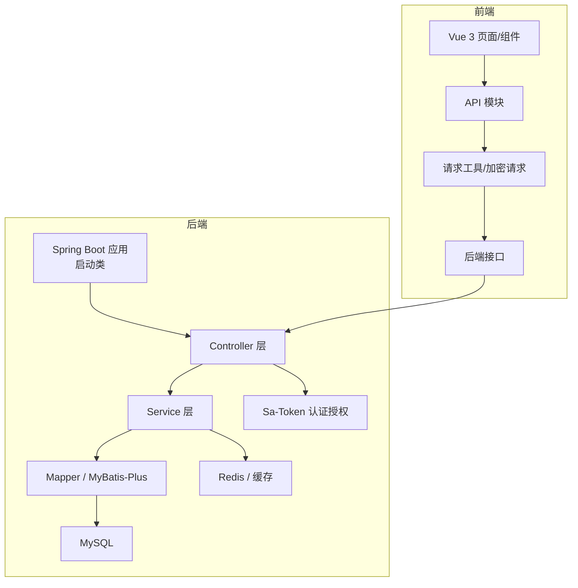
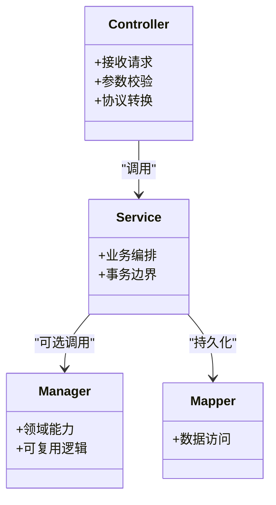
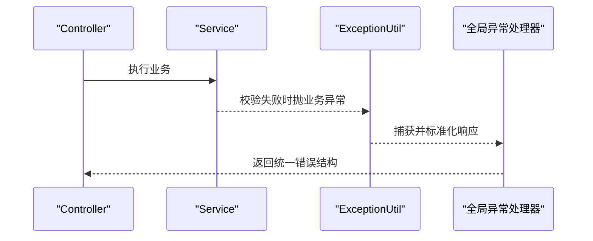
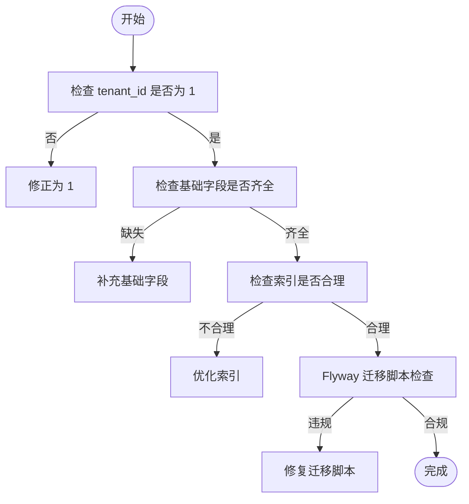
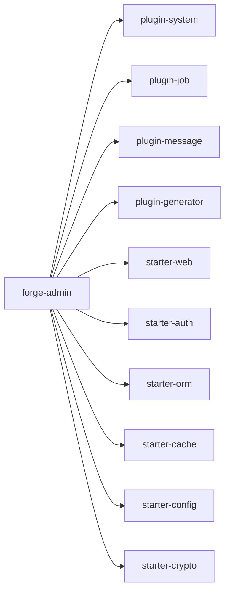

# 编码规范

<cite>
**本文引用的文件**
- [Forge Admin前端开发与组件规范.md](file://forge-admin-ui/Forge%20Admin前端开发与组件规范.md)
- [编码规范.md](file://code-copilot/rules/coding-style.md)
- [工程上下文.md](file://code-copilot/rules/project-context.md)
- [application.yml](file://forge-server/forge-admin-server/src/main/resources/application.yml)
- [ForgeAdminApplication.java](file://forge-server/forge-admin-server/src/main/java/com/mdframe/forge/admin/ForgeAdminApplication.java)
- [BusinessException.java](file://forge-server/forge-framework/forge-starter-parent/forge-starter-core/src/main/java/com/mdframe/forge/starter/core/exception/BusinessException.java)
- [ExceptionUtil.java](file://forge-server/forge-framework/forge-starter-parent/forge-starter-core/src/main/java/com/mdframe/forge/starter/core/exception/ExceptionUtil.java)
- [EXCEPTION_USAGE.md](file://forge-server/forge-framework/forge-starter-parent/forge-starter-core/EXCEPTION_USAGE.md)
- [sql-seeds.md](file://.agents/skills/forge-codegen-crud/references/sql-seeds.md)
- [.commitlintrc.js](file://forge-report-ui/.commitlintrc.js)
</cite>

## 目录
1. [引言](#引言)
2. [项目结构](#项目结构)
3. [核心组件](#核心组件)
4. [架构总览](#架构总览)
5. [详细组件分析](#详细组件分析)
6. [依赖关系分析](#依赖关系分析)
7. [性能考虑](#性能考虑)
8. [故障排查指南](#故障排查指南)
9. [结论](#结论)
10. [附录](#附录)

## 引言
本规范面向 Forge Admin 全栈团队，统一 Java 后端、Vue 前端、SQL、配置文件与 Git 提交实践。目标是通过一致的命名、格式、注释、错误处理与最佳实践，降低协作成本、提升可维护性与交付质量；同时提供 IDE 配置建议与代码检查工具集成方案，确保规范在开发全流程中自动落地。

## 项目结构
- 后端采用 Spring Boot + MyBatis-Plus + Sa-Token 的分层架构，模块以插件化方式组织，启动入口扫描指定包并启用 AOP。
- 前端基于 Vue 3 Composition API、Naive UI、UnoCSS、Vite，页面与组件职责清晰，API 调用集中管理。
- 数据库使用 Flyway 进行版本化管理，迁移脚本遵循严格命名与幂等原则。
- 构建与运行：后端 Maven，前端 pnpm；前后端通过统一请求工具与鉴权机制交互。

**图示来源**
- [ForgeAdminApplication.java:8-15](file://forge-server/forge-admin-server/src/main/java/com/mdframe/forge/admin/ForgeAdminApplication.java#L8-L15)
- [application.yml:1-228](file://forge-server/forge-admin-server/src/main/resources/application.yml#L1-L228)

**章节来源**
- [工程上下文.md:51-206](file://code-copilot/rules/project-context.md#L51-L206)
- [Forge Admin前端开发与组件规范.md:20-39](file://forge-admin-ui/Forge%20Admin前端开发与组件规范.md#L20-L39)

## 核心组件
- 异常体系：业务异常 BusinessException 与工具 ExceptionUtil，配合全局异常处理器统一返回。
- 配置中心：application.yml 统一管理服务器、日志、MyBatis-Plus、Sa-Token、Flyway、能力开关等。
- 前端 CRUD：AiCrudPage/AiForm/AiTable 等组件统一列表、表单、表格行为与字典渲染。
- SQL 迁移：Flyway 迁移脚本命名与幂等写入规则，保障数据库版本一致。

**章节来源**
- [BusinessException.java:66-85](file://forge-server/forge-framework/forge-starter-parent/forge-starter-core/src/main/java/com/mdframe/forge/starter/core/exception/BusinessException.java#L66-L85)
- [ExceptionUtil.java:1-194](file://forge-server/forge-framework/forge-starter-parent/forge-starter-core/src/main/java/com/mdframe/forge/starter/core/exception/ExceptionUtil.java#L1-L194)
- [EXCEPTION_USAGE.md:1-63](file://forge-server/forge-framework/forge-starter-parent/forge-starter-core/EXCEPTION_USAGE.md#L1-L63)
- [application.yml:1-228](file://forge-server/forge-admin-server/src/main/resources/application.yml#L1-L228)
- [Forge Admin前端开发与组件规范.md:80-96](file://forge-admin-ui/Forge%20Admin前端开发与组件规范.md#L80-L96)
- [sql-seeds.md:1-11](file://.agents/skills/forge-codegen-crud/references/sql-seeds.md#L1-L11)

## 架构总览
后端分层清晰：Controller 接收请求并做协议转换，Service 编排业务逻辑与事务边界，Manager（可选）封装领域能力，Mapper 专注数据访问。前端按 Views → Components → Composables → API → Utils 的层次组织，保证职责单一与复用性。

**图示来源**
- [工程上下文.md:176-193](file://code-copilot/rules/project-context.md#L176-L193)

## 详细组件分析

### Java 后端编码规范
- 命名约定
  - 类名大驼峰，方法名小驼峰且动词开头，常量全大写下划线分隔，抽象类以 Abstract/Base 开头，测试类以被测类名+Test 结尾。
  - 禁止拼音与中英混拼命名。
- 异常处理
  - 业务异常使用自定义 BusinessException，携带错误码；系统异常向上抛出由统一处理器兜底；禁止吞异常并在 catch 中记录日志。
- 日志
  - Controller 入口 INFO 并记录关键参数；异常 ERROR 并记录完整堆栈；禁止记录用户敏感信息。
- 其他约束
  - if/else/for/while 必须加括号；接口需考虑幂等；并发场景说明同步策略；魔法值定义为常量；外部调用设置超时并降级；状态变更走状态机；禁止提交含个人信息的测试数据。

**章节来源**
- [编码规范.md:6-29](file://code-copilot/rules/coding-style.md#L6-L29)

### 异常处理模式与最佳实践
- 推荐用法
  - 直接抛错：throw new BusinessException("...")
  - 带码抛错：throw new BusinessException(400, "...")
  - 链式设置：new BusinessException().setCode(...).setMessage(...).setData(...)
  - 条件抛错：ExceptionUtil.throwIf(condition, code, message)
  - 包装异常：ExceptionUtil.wrap(throwable, code, message)
- 注意事项
  - 避免空 catch；catch 中必须记录日志；对外只暴露必要错误信息。

**图示来源**
- [ExceptionUtil.java:13-91](file://forge-server/forge-framework/forge-starter-parent/forge-starter-core/src/main/java/com/mdframe/forge/starter/core/exception/ExceptionUtil.java#L13-L91)
- [EXCEPTION_USAGE.md:10-63](file://forge-server/forge-framework/forge-starter-parent/forge-starter-core/EXCEPTION_USAGE.md#L10-L63)

**章节来源**
- [BusinessException.java:66-85](file://forge-server/forge-framework/forge-starter-parent/forge-starter-core/src/main/java/com/mdframe/forge/starter/core/exception/BusinessException.java#L66-L85)
- [ExceptionUtil.java:1-194](file://forge-server/forge-framework/forge-starter-parent/forge-starter-core/src/main/java/com/mdframe/forge/starter/core/exception/ExceptionUtil.java#L1-L194)
- [EXCEPTION_USAGE.md:1-63](file://forge-server/forge-framework/forge-starter-parent/forge-starter-core/EXCEPTION_USAGE.md#L1-L63)

### Vue 前端编码规范
- 技术与基本约定
  - 使用 Vue 3 Composition API 与 <script setup>；UI 优先 Naive UI；样式用 UnoCSS；请求统一经项目工具。
  - 页面为操作控制台，不添加无业务价值的营销式元素或持续动画。
- 目录职责
  - api 按业务域定义接口；components 放跨页复用组件；composables 放 useXxx；config 放静态配置；layouts 放壳层；router 放路由；stores 放 Pinia；utils 放纯工具；views 按业务域组织页面。
- 页面布局与工作区
  - /system/** 由 SystemPageLayout 提供统一边距；CRUD 根节点保持最小；主从工作区使用 MasterDetailWorkspace。
- 组件选择
  - 标准 CRUD 使用 AiCrudPage；表单使用 AiForm；表格使用 AiTable；字典使用 DictSelect/DictTag/useDict；图片使用 AuthImage；左树右表使用 MasterDetailWorkspace。
- 命名规范
  - 组件 PascalCase.vue；页面新页面 kebab-case.vue；组合式函数 usePascalCase；Store useXxxStore；普通函数 camelCase；常量 UPPER_SNAKE_CASE；CSS 类前缀+kebab-case；事件动词开头 kebab-case。
- 接口、状态与字典
  - API 放 src/api/<domain>.js；普通请求用 request；敏感提交用 postEncrypt；REST 语义 GET/POST/PUT/DELETE；远端字典 useDict；Schema 用 computed 派生；仅当前页面状态放 ref，跨页共享放 Pinia。
- 样式与交互
  - 主题变量优先；操作链接语义色；企业后台边框层级留白区分；动效限制属性与时长；亮暗主题兼容。
- 提交前检查
  - git diff --check；ESLint 对修改文件；pnpm build；变更低代码协议时验证默认值、回显、空态与窄屏；不提交敏感信息与无关产物。
- SFC 组织顺序
  - template → script setup → style scoped；import 分组；defineOptions name；Props 声明类型与默认；Emits 暴露必要事件；模板不写复杂计算；v-for 稳定 key；异步请求处理 loading/异常/finally。
- 状态边界
  - 控件状态 ref；推导值 computed；可复用逻辑 composables；登录态/跨页会话 Pinia；常量模块顶层 const；watch 仅副作用；清理资源。
- 模板与可访问性
  - 语义标签；非按钮不可点击；图标按钮 title/aria-label；图片 alt；焦点管理；长文本省略或展开。
- 表单、表格与 CRUD
  - Schema computed；字段与 DTO 一致；详情优先 editSchema；beforeSubmit 处理；复杂编辑独立工作台；Modal/Drawer 少字段；删除二次确认；分页 pageNum/pageSize；文件用 AuthImage；空态区分。
- 路由、权限与导航
  - 路由 views/<domain>；动态路由装配；权限 usePermission；URL 表达状态；KeepAlive 注意刷新与释放。
- 请求、文件与安全
  - 统一 @/utils/request；API 函数动词+资源命名；params/data 明确；不记录敏感信息到控制台；权限/租户/数据范围后端控制；上传存 fileId；批量导入导出局部 loading。
- 样式工程规范
  - 优先 Props → UnoCSS → scoped → styles；不用 !important；选择器以组件根类前缀；禁止负 margin/绝对定位修正；断点 960/768；容器溢出策略。
- 测试、排查与评审清单
  - 最小验证矩阵；评审关注复用、加载/空态/错误/重复点击、字典/租户/权限/文件/加密、主题/窄屏、改动范围。

**章节来源**
- [Forge Admin前端开发与组件规范.md:5-137](file://forge-admin-ui/Forge%20Admin前端开发与组件规范.md#L5-L137)
- [Forge Admin前端开发与组件规范.md:138-289](file://forge-admin-ui/Forge%20Admin前端开发与组件规范.md#L138-L289)

### SQL 编写规范
- 租户 ID 规则
  - 业务数据的 tenant_id 必须设为 1（默认租户），禁止设为 0；原因：多租户拦截器会在 SELECT 追加 WHERE tenant_id = 当前租户，tenant_id=0 的数据对非零租户不可见，导致字典为空。
- 其他 SQL 规范
  - 业务表基础字段 id、tenant_id、create_by、create_time、create_dept、update_by、update_time；utf8mb4、InnoDB；高频字段建索引；禁止提交凭据；Flyway 迁移脚本禁止 ${...} 模板，确需入库使用 CONCAT('$', '{token}') 并扫描残留。
- Flyway 迁移规则
  - 文件名 V<next>__lower_snake_case_description.sql；CREATE TABLE IF NOT EXISTS；INSERT ... SELECT ... WHERE NOT EXISTS；显式列名；删除旧索引前先查询 information_schema；禁止提交生产密钥。

**图示来源**
- [编码规范.md:37-50](file://code-copilot/rules/coding-style.md#L37-L50)
- [sql-seeds.md:1-11](file://.agents/skills/forge-codegen-crud/references/sql-seeds.md#L1-L11)

**章节来源**
- [编码规范.md:37-50](file://code-copilot/rules/coding-style.md#L37-L50)
- [sql-seeds.md:1-11](file://.agents/skills/forge-codegen-crud/references/sql-seeds.md#L1-L11)

### 配置文件规范
- 应用配置
  - application.yml 统一管理端口、Undertow、日志级别、国际化、Multipart、Jackson、Flyway、MyBatis-Plus、Sa-Token、能力开关等。
- 环境隔离
  - 通过 profiles.active 切换环境；敏感配置使用环境变量注入；Flyway 位置与环境变量控制。
- 安全与能力开关
  - MCP、Capability、Crypto、Open Gateway 等能力通过环境变量开启/关闭；默认关闭或按需开启，避免生产误配。

**章节来源**
- [application.yml:1-228](file://forge-server/forge-admin-server/src/main/resources/application.yml#L1-L228)

### Git 提交规范
- 分支保护
  - 禁止 master 分支变更；编码前检查当前分支。
- 提交粒度
  - 每个 task/fix 完成后自动 commit，保持一个任务一个提交；提交前执行编译检查；禁止自动 Push，保留审查机会。
- 消息格式
  - [<变更名>] <中文简述>；报告端使用 @commitlint/config-conventional 约束。

**章节来源**
- [编码规范.md:30-36](file://code-copilot/rules/coding-style.md#L30-L36)
- [.commitlintrc.js:1-3](file://forge-report-ui/.commitlintrc.js#L1-L3)

## 依赖关系分析
- 后端模块依赖
  - 主应用依赖系统、定时任务、消息、生成器、流程客户端与各 starter（Web、Auth、ORM、Cache、Config、Crypto、ID、Idempotent、Datascope、WebSocket、Trans、Social、Message、Job）。
- 分层依赖
  - Controller → Service → Manager（可选）→ Mapper；Entity/DTO/VO 分离。
- 前端依赖
  - Views → Components → Composables → API → Utils；Pinia 管理跨页状态。

**图示来源**
- [工程上下文.md:149-174](file://code-copilot/rules/project-context.md#L149-L174)

**章节来源**
- [工程上下文.md:149-174](file://code-copilot/rules/project-context.md#L149-L174)

## 性能考虑
- 后端
  - Undertow 线程与缓冲配置合理；MyBatis-Plus 开启缓存；Jackson 序列化配置避免多余输出；Flyway 迁移幂等减少重复执行。
- 前端
  - 组件懒加载与按需引入；表格密度 medium 默认；字典异步加载后回显；文件下载/预览复用工具避免重复请求；避免无意义动画。
- 数据库
  - 高频字段索引；复合索引遵循最左前缀；避免全表扫描；Flyway 脚本幂等与增量更新。

[本节为通用指导，无需特定文件引用]

## 故障排查指南
- 字典为空
  - 检查数据库中对应字典数据的 tenant_id 是否为 1；若为 0 会被多租户拦截器过滤。
- 图片无法显示
  - 直接使用 URL 作为 img src 不会携带 Authorization header；应使用 AuthImage 组件或通过 getFileUrl 获取鉴权链接。
- 异常未捕获
  - 检查是否存在空 catch；确保 catch 中记录日志；业务异常通过 ExceptionUtil 抛出并由全局处理器统一返回。
- 迁移失败
  - 检查 Flyway 脚本命名与幂等；确认无 ${...} 模板残留；删除旧索引前先查询信息表。

**章节来源**
- [编码规范.md:37-50](file://code-copilot/rules/coding-style.md#L37-L50)
- [EXCEPTION_USAGE.md:10-63](file://forge-server/forge-framework/forge-starter-parent/forge-starter-core/EXCEPTION_USAGE.md#L10-L63)
- [sql-seeds.md:1-11](file://.agents/skills/forge-codegen-crud/references/sql-seeds.md#L1-L11)

## 结论
本规范通过统一的命名、格式、注释、错误处理与最佳实践，结合 IDE 配置与代码检查工具，确保 Forge Admin 在后端、前端、SQL、配置与 Git 提交各环节保持一致性与高质量。建议在团队内推广并纳入 CI 流程，持续改进与演进。

## 附录

### IDE 配置建议
- 后端（Java/Spring Boot）
  - 启用 Lombok、MapStruct 注解处理器；配置 SonarQube/Checkstyle 规则；IDEA 格式化对齐 Maven 配置；开启实时编译与热部署。
- 前端（Vue/Vite）
  - 安装 ESLint、Prettier、Vue 插件；配置 eslint.config.js 与 prettier.config.js；启用保存时自动修复；VS Code 推荐 Vue 官方扩展与 UnoCSS 支持。
- 数据库
  - 使用 DataGrip/Navicat 连接 MySQL；启用 SQL 格式化与 Flyway 插件；迁移脚本命名与幂等检查。

### 代码检查工具集成方案
- 后端
  - Maven 集成 Checkstyle、SpotBugs、Sonar；CI 阶段执行 mvn clean install 与单元测试。
- 前端
  - pnpm 脚本集成 eslint、build；提交前钩子执行 lint 与 build；PR 阶段强制通过。
- SQL
  - Flyway 校验迁移脚本；CI 阶段执行迁移并验证幂等；禁止包含敏感信息。

[本节为通用指导，无需特定文件引用]