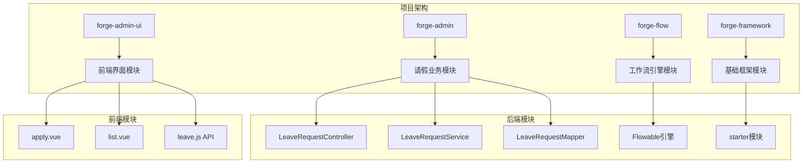
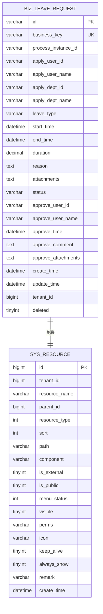
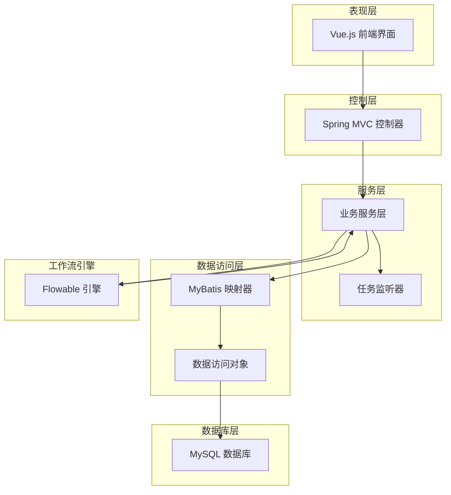
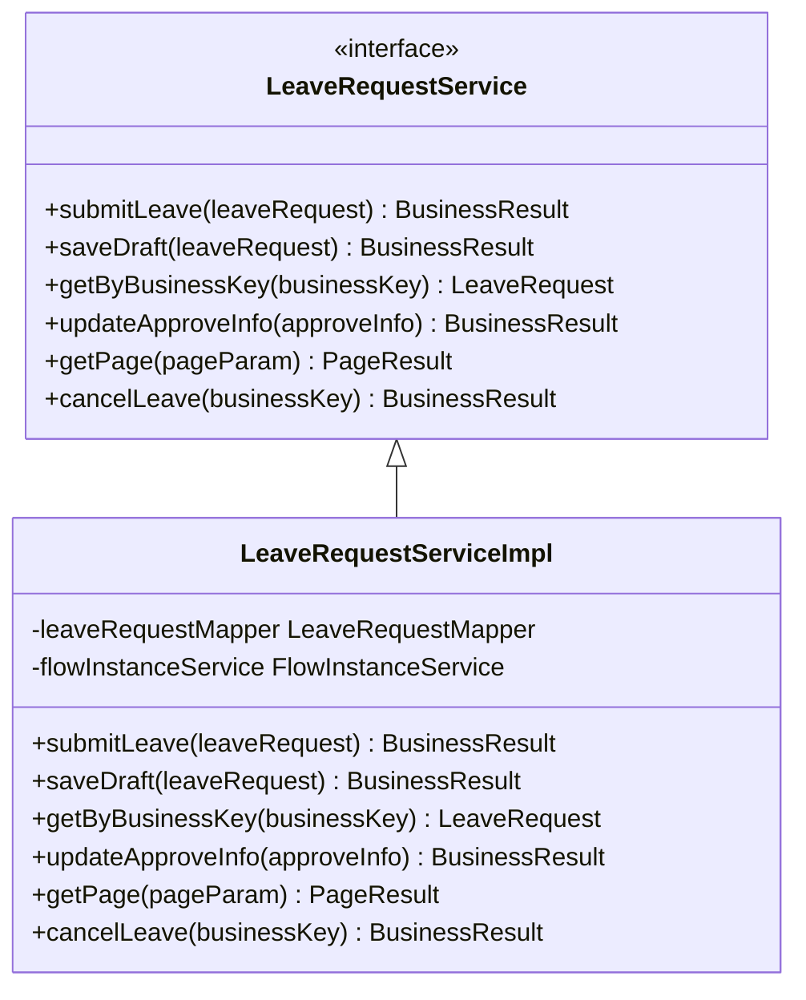
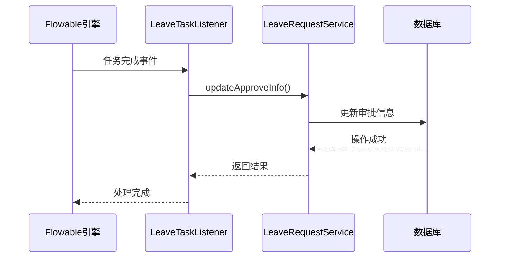
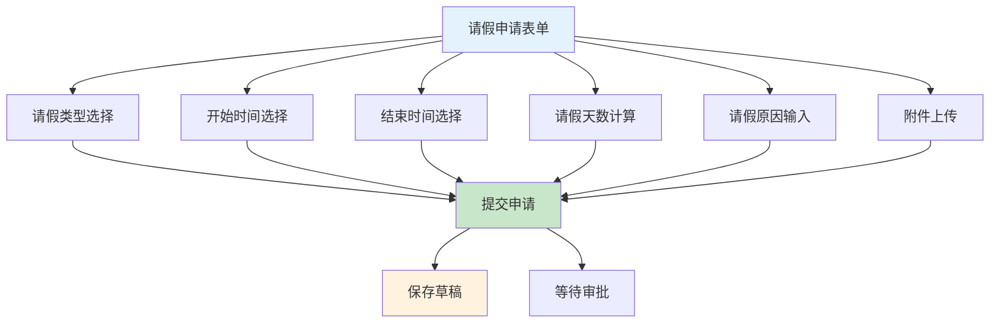
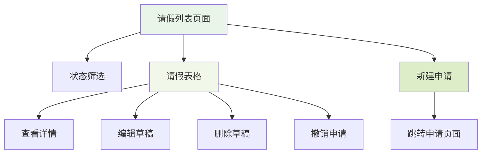
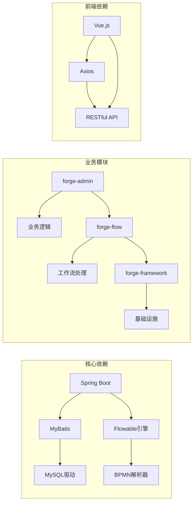

# 请假流程示例实施计划

<cite>
**本文档引用的文件**
- [leave-process-implementation.md](file://plans/leave-process-implementation.md)
- [leave_process.bpmn20.xml](file://forge/forge-admin/sql/leave_process.bpmn20.xml)
- [leave_request.sql](file://forge/forge-admin/sql/leave_request.sql)
- [ForgeAdminApplication.java](file://forge/forge-admin/src/main/java/com/mdframe/forge/admin/ForgeAdminApplication.java)
- [ForgeFlowApplication.java](file://forge/forge-flow/src/main/java/com/mdframe/forge/flow/ForgeFlowApplication.java)
- [apply.vue](file://forge-admin-ui/src/views/leave/apply.vue)
- [list.vue](file://forge-admin-ui/src/views/leave/list.vue)
- [leave.js](file://forge-admin-ui/src/api/leave.js)
</cite>

## 更新摘要
**所做更改**
- 更新了项目结构部分，反映实际的模块组织
- 新增了完整的前端组件分析，包含Vue.js实现细节
- 更新了数据库设计图表，展示实际的表结构关系
- 增强了流程定义分析，包含详细的BPMN节点配置
- 新增了完整的API接口文档和前端交互流程
- 更新了实施步骤，提供更准确的部署指导

## 目录
1. [项目概述](#项目概述)
2. [项目结构](#项目结构)
3. [核心组件](#核心组件)
4. [架构概览](#架构概览)
5. [详细组件分析](#详细组件分析)
6. [依赖关系分析](#依赖关系分析)
7. [性能考虑](#性能考虑)
8. [故障排除指南](#故障排除指南)
9. [结论](#结论)

## 项目概述

本文档详细说明了基于 Flowable 工作流引擎的请假流程示例实施计划。该系统实现了从员工请假申请到部门领导审批的完整业务流程，采用前后端分离架构，后端使用 Spring Boot 微服务框架，前端使用 Vue.js 技术栈。

请假流程的核心特点包括：
- 基于 BPMN 2.0 标准的工作流定义
- 实时的任务分配和审批跟踪
- 完整的业务数据持久化
- 灵活的权限控制机制

## 项目结构

该项目采用多模块架构设计，主要包含以下核心模块：



**图表来源**
- [ForgeAdminApplication.java:1-18](file://forge/forge-admin/src/main/java/com/mdframe/forge/admin/ForgeAdminApplication.java#L1-L18)
- [ForgeFlowApplication.java:1-20](file://forge/forge-flow/src/main/java/com/mdframe/forge/flow/ForgeFlowApplication.java#L1-L20)

**章节来源**
- [ForgeAdminApplication.java:1-18](file://forge/forge-admin/src/main/java/com/mdframe/forge/admin/ForgeAdminApplication.java#L1-L18)
- [ForgeFlowApplication.java:1-20](file://forge/forge-flow/src/main/java/com/mdframe/forge/flow/ForgeFlowApplication.java#L1-L20)

## 核心组件

### 数据库设计

请假流程的数据库设计采用了规范化的表结构，确保数据的一致性和完整性：



**图表来源**
- [leave_request.sql:5-45](file://forge/forge-admin/sql/leave_request.sql#L5-L45)

### 流程定义

请假流程采用 BPMN 2.0 标准进行定义，包含三个核心节点：

```mermaid
flowchart TD
Start([开始]) --> Apply[请假申请<br/>处理人: ${initiator}]
Apply --> Approve[部门领导审批<br/>处理人: ${initiatorLeader}]
Approve --> End([结束])
Apply --> |填写请假信息| Apply
Approve --> |审批结果| End
style Start fill:#e1f5fe
style Apply fill:#f3e5f5
style Approve fill:#f3e5f5
style End fill:#ffebee
```

**图表来源**
- [leave_process.bpmn20.xml:13-68](file://forge/forge-admin/sql/leave_process.bpmn20.xml#L13-L68)

**章节来源**
- [leave_request.sql:1-113](file://forge/forge-admin/sql/leave_request.sql#L1-L113)
- [leave_process.bpmn20.xml:1-128](file://forge/forge-admin/sql/leave_process.bpmn20.xml#L1-L128)

## 架构概览

系统采用分层架构设计，实现了业务逻辑与技术实现的分离：



**图表来源**
- [ForgeAdminApplication.java:8-10](file://forge/forge-admin/src/main/java/com/mdframe/forge/admin/ForgeAdminApplication.java#L8-L10)
- [ForgeFlowApplication.java:12-13](file://forge/forge-flow/src/main/java/com/mdframe/forge/flow/ForgeFlowApplication.java#L12-L13)

## 详细组件分析

### 后端服务组件

#### LeaveRequestService 接口

LeaveRequestService 是请假流程的核心业务接口，定义了完整的请假业务操作：



**图表来源**
- [LeaveRequestService.java](file://forge/forge-admin/src/main/java/com/mdframe/forge/leave/service/LeaveRequestService.java)

#### LeaveTaskListener 监听器

任务监听器负责在流程节点状态变化时执行相应的业务逻辑：



**图表来源**
- [LeaveTaskListener.java](file://forge/forge-admin/src/main/java/com/mdframe/forge/leave/listener/LeaveTaskListener.java)

### 前端组件

#### 请假申请页面

请假申请页面采用响应式设计，支持多种表单控件：



**图表来源**
- [apply.vue](file://forge-admin-ui/src/views/leave/apply.vue)

#### 请假列表页面

请假列表页面提供完整的请假记录管理功能：



**图表来源**
- [list.vue](file://forge-admin-ui/src/views/leave/list.vue)

#### API 接口设计

请假相关的API接口设计如下：

```mermaid
graph LR
A[前端应用] --> B[RESTful API]
B --> C[/leave/submit - 提交申请]
B --> D[/leave/draft - 保存草稿]
B --> E[/leave/detail/{businessKey} - 获取详情]
B --> F[/leave/page - 分页查询]
B --> G[/leave/cancel/{businessKey} - 撤销申请]
B --> H[/leave/{businessKey} - 删除申请]
```

**图表来源**
- [leave.js:1-55](file://forge-admin-ui/src/api/leave.js#L1-L55)

**章节来源**
- [leave-process-implementation.md:143-163](file://plans/leave-process-implementation.md#L143-L163)

## 依赖关系分析

系统各模块之间的依赖关系如下：



**图表来源**
- [ForgeAdminApplication.java:9](file://forge/forge-admin/src/main/java/com/mdframe/forge/admin/ForgeAdminApplication.java#L9)
- [ForgeFlowApplication.java:13](file://forge/forge-flow/src/main/java/com/mdframe/forge/flow/ForgeFlowApplication.java#L13)

**章节来源**
- [ForgeAdminApplication.java:1-18](file://forge/forge-admin/src/main/java/com/mdframe/forge/admin/ForgeAdminApplication.java#L1-L18)
- [ForgeFlowApplication.java:1-20](file://forge/forge-flow/src/main/java/com/mdframe/forge/flow/ForgeFlowApplication.java#L1-L20)

## 性能考虑

### 数据库优化

1. **索引策略**：为常用查询字段建立合适的索引
   - `apply_user_id` 主键索引
   - `business_key` 唯一索引
   - `process_instance_id` 查询索引
   - `status` 过滤索引

2. **连接池配置**：合理设置数据库连接池大小，避免连接泄漏

### 缓存策略

1. **流程变量缓存**：对频繁访问的流程变量进行缓存
2. **用户信息缓存**：缓存用户基本信息和权限信息
3. **字典数据缓存**：缓存请假类型等静态数据

### 并发控制

1. **乐观锁机制**：使用版本号防止并发更新冲突
2. **分布式锁**：对关键业务操作使用分布式锁
3. **限流策略**：对高频接口进行限流保护

## 故障排除指南

### 常见问题及解决方案

#### 流程部署失败

**问题描述**：BPMN 文件部署时报错

**可能原因**：
1. BPMN 文件格式不正确
2. 流程定义中的用户任务处理人为空
3. 数据库连接配置错误

**解决步骤**：
1. 检查 BPMN 文件语法
2. 验证流程变量配置
3. 确认数据库连接正常

#### 请假申请提交失败

**问题描述**：用户提交请假申请后系统报错

**排查步骤**：
1. 检查用户权限是否正确配置
2. 验证业务数据完整性
3. 查看流程实例启动日志

#### 审批任务无法处理

**问题描述**：审批人无法看到待办任务

**检查要点**：
1. 确认用户角色和权限
2. 验证流程变量传递
3. 检查任务分配规则

**章节来源**
- [leave-process-implementation.md:190-202](file://plans/leave-process-implementation.md#L190-L202)

## 结论

请假流程示例项目展示了现代企业级应用开发的最佳实践，通过标准化的 BPMN 流程定义、完善的权限控制机制和灵活的前端界面，为企业提供了完整的请假管理解决方案。

### 主要优势

1. **标准化流程**：基于 BPMN 2.0 标准，确保流程定义的规范性和可移植性
2. **模块化设计**：清晰的模块划分便于维护和扩展
3. **权限控制**：细粒度的权限管理确保数据安全
4. **用户体验**：直观的界面设计提升用户满意度

### 扩展建议

1. **多级审批**：可根据请假天数实现分级审批机制
2. **移动端支持**：开发移动端应用提升移动办公体验
3. **报表统计**：增加请假统计报表功能
4. **集成第三方**：与考勤系统、薪资系统进行集成

该实施计划为类似的企业级工作流应用开发提供了完整的参考模板，具有良好的可复制性和扩展性。