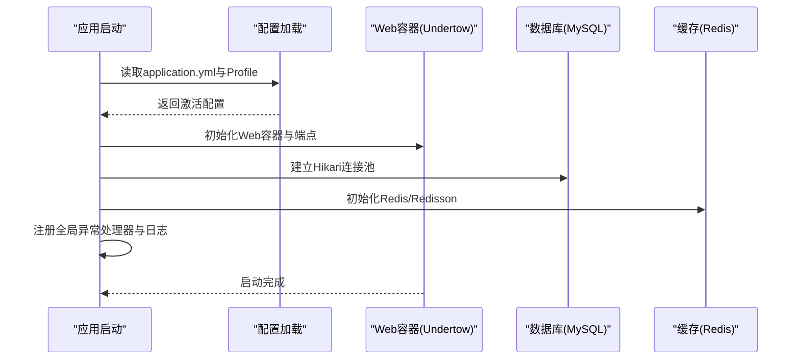
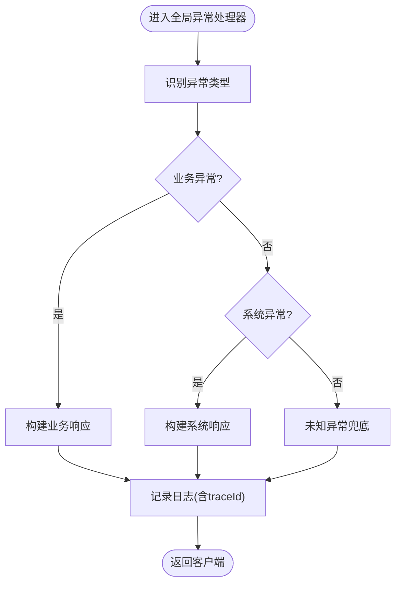
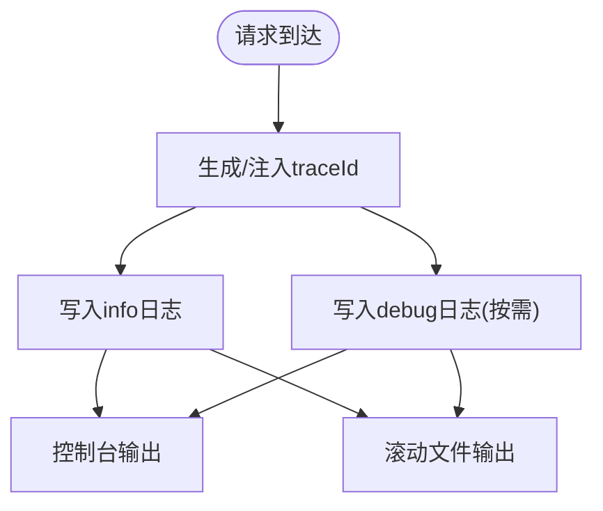
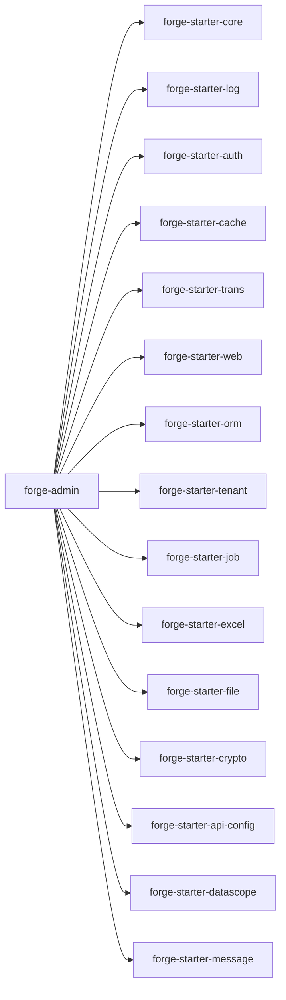

# 调试与故障排除

<cite>
**本文引用的文件**
- [application.yml](file://forge/forge-admin/src/main/resources/application.yml)
- [application-dev.yml](file://forge/forge-admin/src/main/resources/application-dev.yml)
- [logback.xml](file://forge/forge-admin/src/main/resources/logback.xml)
- [GlobalExceptionHandler.java](file://forge/forge-framework/forge-starter-parent/forge-starter-core/src/main/java/com/mdframe/forge/starter/core/exception/GlobalExceptionHandler.java)
- [ExceptionUtil.java](file://forge/forge-framework/forge-starter-parent/forge-starter-core/src/main/java/com/mdframe/forge/starter/core/exception/ExceptionUtil.java)
- [ForgeAdminApplication.java](file://forge/forge-admin/src/main/java/com/mdframe/forge/admin/ForgeAdminApplication.java)
- [ConfigController.java](file://forge/forge-admin/src/main/java/com/mdframe/forge/admin/ConfigController.java)
- [README.md](file://forge/README.md)
- [README.en.md](file://forge/README.en.md)
</cite>

## 目录
1. [简介](#简介)
2. [项目结构](#项目结构)
3. [核心组件](#核心组件)
4. [架构总览](#架构总览)
5. [详细组件分析](#详细组件分析)
6. [依赖关系分析](#依赖关系分析)
7. [性能考量](#性能考量)
8. [故障排除指南](#故障排除指南)
9. [结论](#结论)
10. [附录](#附录)

## 简介
本指南面向Forge框架的开发者与运维人员，提供系统化的调试与故障排除方法。内容涵盖日志分析技巧、异常堆栈解读、性能瓶颈定位、常见问题诊断流程、错误代码含义与解决方案步骤，并给出开发与生产环境的配置要点、数据库连接问题处理、调试与性能分析工具使用建议，以及系统监控指标与告警配置思路。

## 项目结构
Forge项目采用多模块结构，核心运行时位于forge-admin模块，框架能力通过forge-framework中的starter与插件模块提供。日志与配置集中在admin模块的resources目录下；全局异常处理由core starter提供；开发与生产配置通过profile进行切换。

```mermaid
graph TB
subgraph "应用层"
Admin["forge-admin<br/>应用入口与配置"]
end
subgraph "框架层"
Core["forge-starter-core<br/>全局异常处理"]
LogStarter["forge-starter-log<br/>日志能力"]
AuthStarter["forge-starter-auth<br/>认证鉴权"]
CacheStarter["forge-starter-cache<br/>缓存"]
TransStarter["forge-starter-trans<br/>事务"]
WebStarter["forge-starter-web<br/>Web支持"]
OrmStarter["forge-starter-orm<br/>ORM支持"]
TenantStarter["forge-starter-tenant<br/>多租户"]
JobStarter["forge-starter-job<br/>定时任务"]
ExcelStarter["forge-starter-excel<br/>Excel导出"]
FileStarter["forge-starter-file<br/>文件存储"]
CryptoStarter["forge-starter-crypto<br/>加解密"]
ApiCfgStarter["forge-starter-api-config<br/>接口配置"]
DataScopeStarter["forge-starter-datascope<br/>数据范围"]
MessageStarter["forge-starter-message<br/>消息"]
end
subgraph "基础设施"
DB["MySQL"]
Redis["Redis"]
Undertow["Undertow"]
end
Admin --> Core
Admin --> LogStarter
Admin --> AuthStarter
Admin --> CacheStarter
Admin --> TransStarter
Admin --> WebStarter
Admin --> OrmStarter
Admin --> TenantStarter
Admin --> JobStarter
Admin --> ExcelStarter
Admin --> FileStarter
Admin --> CryptoStarter
Admin --> ApiCfgStarter
Admin --> DataScopeStarter
Admin --> MessageStarter
Admin --> Undertow
Admin --> DB
Admin --> Redis
```

图表来源
- [ForgeAdminApplication.java](file://forge/forge-admin/src/main/java/com/mdframe/forge/admin/ForgeAdminApplication.java#L1-L200)
- [application.yml](file://forge/forge-admin/src/main/resources/application.yml#L1-L100)
- [application-dev.yml](file://forge/forge-admin/src/main/resources/application-dev.yml#L1-L70)

章节来源
- [ForgeAdminApplication.java](file://forge/forge-admin/src/main/java/com/mdframe/forge/admin/ForgeAdminApplication.java#L1-L200)
- [application.yml](file://forge/forge-admin/src/main/resources/application.yml#L1-L100)
- [application-dev.yml](file://forge/forge-admin/src/main/resources/application-dev.yml#L1-L70)

## 核心组件
- 全局异常处理：统一捕获未处理异常，生成标准化响应，便于前端与监控系统消费。
- 日志系统：基于Logback，支持控制台与滚动文件输出，包含traceId上下文，便于链路追踪。
- 配置中心：通过Spring Profile切换开发/生产环境，集中管理数据库、Redis、日志等配置。
- Web容器：默认使用Undertow，可调IO线程与工作线程，适配高并发场景。
- ORM与数据源：MyBatis-Plus + HikariCP动态数据源，支持主从与连接池参数调优。

章节来源
- [GlobalExceptionHandler.java](file://forge/forge-framework/forge-starter-parent/forge-starter-core/src/main/java/com/mdframe/forge/starter/core/exception/GlobalExceptionHandler.java#L1-L200)
- [logback.xml](file://forge/forge-admin/src/main/resources/logback.xml#L1-L49)
- [application.yml](file://forge/forge-admin/src/main/resources/application.yml#L1-L100)
- [application-dev.yml](file://forge/forge-admin/src/main/resources/application-dev.yml#L1-L70)

## 架构总览
Forge应用启动后，加载配置与Profile，初始化Web容器与各starter模块，建立数据库与Redis连接，注册全局异常处理器与日志配置，随后对外提供REST服务。

图表来源
- [ForgeAdminApplication.java](file://forge/forge-admin/src/main/java/com/mdframe/forge/admin/ForgeAdminApplication.java#L1-L200)
- [application.yml](file://forge/forge-admin/src/main/resources/application.yml#L1-L100)
- [application-dev.yml](file://forge/forge-admin/src/main/resources/application-dev.yml#L1-L70)

## 详细组件分析

### 全局异常处理
- 统一异常拦截：捕获业务与系统异常，构造标准响应结构，避免敏感信息泄露。
- 异常分类：区分业务异常与系统异常，分别返回不同状态码与提示。
- 上下文保留：在日志中记录traceId，便于跨服务链路定位。

图表来源
- [GlobalExceptionHandler.java](file://forge/forge-framework/forge-starter-parent/forge-starter-core/src/main/java/com/mdframe/forge/starter/core/exception/GlobalExceptionHandler.java#L1-L200)

章节来源
- [GlobalExceptionHandler.java](file://forge/forge-framework/forge-starter-parent/forge-starter-core/src/main/java/com/mdframe/forge/starter/core/exception/GlobalExceptionHandler.java#L1-L200)

### 日志系统与链路追踪
- 输出目标：控制台与按日滚动的文件，便于本地开发与生产归档。
- 日志格式：包含traceId、时间戳、线程、级别、类名、方法行号、消息。
- 模块级别：框架与业务日志分级输出，SQL日志可按需开启。

图表来源
- [logback.xml](file://forge/forge-admin/src/main/resources/logback.xml#L1-L49)

章节来源
- [logback.xml](file://forge/forge-admin/src/main/resources/logback.xml#L1-L49)

### 配置与Profile切换
- 开发环境：默认启用开发配置，包含数据库、Redis、Hikari连接池参数。
- 生产环境：通过Profile切换，建议在部署时显式指定。
- 关键配置项：服务器端口、Undertow线程、日志级别、MyBatis-Plus、Sa-Token、国际化等。

章节来源
- [application.yml](file://forge/forge-admin/src/main/resources/application.yml#L1-L100)
- [application-dev.yml](file://forge/forge-admin/src/main/resources/application-dev.yml#L1-L70)

### 数据库连接与性能
- 连接池：HikariCP，支持最大连接数、最小空闲、连接超时、空闲与生命周期等参数。
- SQL日志：MyBatis-Plus配置了日志实现，可在开发阶段开启以观察SQL。
- 批处理优化：开发配置中启用了批处理重写选项，注意批量操作的性能与数据库压力平衡。

章节来源
- [application-dev.yml](file://forge/forge-admin/src/main/resources/application-dev.yml#L1-L70)
- [application.yml](file://forge/forge-admin/src/main/resources/application.yml#L65-L85)

### Web容器与线程模型
- Undertow：可配置IO线程与工作线程数量，适合高并发I/O密集型场景。
- 请求限制：支持POST内容大小、静态资源路径、日期格式等。

章节来源
- [application.yml](file://forge/forge-admin/src/main/resources/application.yml#L1-L52)

### 认证与会话
- Sa-Token：使用Redis存储会话，支持分布式登录、单点登录等能力。
- Redis配置：主机、端口、密码、数据库索引、超时等。

章节来源
- [application.yml](file://forge/forge-admin/src/main/resources/application.yml#L86-L100)
- [application-dev.yml](file://forge/forge-admin/src/main/resources/application-dev.yml#L35-L48)

## 依赖关系分析
- 应用依赖于core starter提供的全局异常处理，确保一致的错误语义。
- 日志模块通过Logback配置生效，覆盖框架与业务包的日志级别。
- Web容器与ORM、缓存、认证等模块协同工作，形成完整的运行时依赖图。

图表来源
- [ForgeAdminApplication.java](file://forge/forge-admin/src/main/java/com/mdframe/forge/admin/ForgeAdminApplication.java#L1-L200)

章节来源
- [ForgeAdminApplication.java](file://forge/forge-admin/src/main/java/com/mdframe/forge/admin/ForgeAdminApplication.java#L1-L200)

## 性能考量
- 连接池参数：根据QPS与事务时长调整最大连接、最小空闲、超时与生命周期。
- SQL性能：开启SQL日志定位慢查询，结合索引与分页优化。
- 缓存命中：合理设置缓存过期与淘汰策略，降低数据库压力。
- 并发模型：根据CPU核数与请求特征调整Undertow IO与worker线程数。
- 批量操作：谨慎使用批处理优化，评估数据库负载与延迟。

## 故障排除指南

### 日志分析技巧
- 定位入口：优先查看包含traceId的日志行，串联同一请求的全链路日志。
- 分级排查：先看ERROR，再看WARN，最后DEBUG（必要时开启）。
- SQL审计：在开发环境开启SQL日志，观察慢查询与重复执行。
- 文件轮转：关注日志文件大小与滚动策略，避免磁盘占满。

章节来源
- [logback.xml](file://forge/forge-admin/src/main/resources/logback.xml#L1-L49)

### 异常堆栈解读
- 业务异常：通常由业务校验或规则触发，返回码与提示明确，优先修复参数与边界条件。
- 系统异常：多为底层依赖失败（数据库、Redis、网络），需结合日志与监控定位。
- 全局异常：确认异常是否被正确捕获与包装，避免敏感信息泄露。

章节来源
- [GlobalExceptionHandler.java](file://forge/forge-framework/forge-starter-parent/forge-starter-core/src/main/java/com/mdframe/forge/starter/core/exception/GlobalExceptionHandler.java#L1-L200)

### 性能瓶颈定位
- CPU/线程：检查Undertow线程池是否饱和，适当增加worker线程。
- 数据库：观察慢查询与锁等待，优化索引与SQL。
- 缓存：评估命中率与过期策略，减少热点key抖动。
- 网络：排查外部依赖（如第三方接口）延迟与超时。

### 常见问题与诊断流程
- 应用无法启动
  - 检查配置文件与Profile是否正确加载。
  - 查看启动日志中的异常堆栈与依赖初始化顺序。
  - 确认数据库与Redis连通性。
- 接口返回异常
  - 在全局异常处理器处确认异常类型与响应结构。
  - 结合traceId在日志中回溯请求链路。
- 登录/鉴权失败
  - 检查Sa-Token与Redis配置，确认会话是否正常写入。
  - 核对Token生成与解析逻辑。
- 数据库连接失败
  - 校验URL、用户名、密码与驱动。
  - 检查Hikari连接池参数与防火墙策略。
- 性能抖动
  - 分析慢查询与热点接口，优化SQL与缓存。
  - 调整Undertow线程与连接池参数。

### 错误代码与含义
- 业务错误：由业务异常处理器封装，返回码与消息由具体业务定义。
- 系统错误：由全局异常处理器统一返回，包含错误码、消息与traceId。
- 建议：在文档中维护错误码清单，便于前后端与运维统一理解。

章节来源
- [GlobalExceptionHandler.java](file://forge/forge-framework/forge-starter-parent/forge-starter-core/src/main/java/com/mdframe/forge/starter/core/exception/GlobalExceptionHandler.java#L1-L200)

### 解决方案步骤
- 快速止损：降级非核心功能、临时关闭批量任务、限流或熔断。
- 逐层排查：配置—>网络—>缓存—>数据库—>业务逻辑。
- 验证修复：在测试环境复现并验证，灰度发布到生产。
- 回滚预案：保留上一个稳定版本的部署包与配置备份。

### 开发环境调试配置
- Profile：使用开发配置文件，启用SQL日志与较高日志级别。
- 工具：IDE断点调试、Postman/Httpie接口测试、本地Redis与MySQL。
- 参数：适当增大连接池与线程数，缩短日志滚动周期以便分析。

章节来源
- [application-dev.yml](file://forge/forge-admin/src/main/resources/application-dev.yml#L1-L70)
- [application.yml](file://forge/forge-admin/src/main/resources/application.yml#L1-L100)

### 生产环境问题排查
- 逐步降级：先关闭非关键接口，再排查核心链路。
- 采样观测：开启采样日志与关键指标监控，避免全量日志影响性能。
- 变更回滚：依据变更记录回退到上一个稳定版本。

### 数据库连接问题处理
- 连接参数：核对URL、驱动、用户名、密码与字符集。
- 连接池：检查最大连接、空闲、超时与生命周期参数。
- 网络：确认防火墙与内网策略，测试连通性。
- 压力：观察连接池峰值与等待队列长度，必要时扩容或优化SQL。

章节来源
- [application-dev.yml](file://forge/forge-admin/src/main/resources/application-dev.yml#L1-L70)

### 调试与性能分析工具
- 调试工具：IDE断点、远程调试、JVM分析器。
- 性能分析：火焰图、GC日志分析、线程dump。
- 网络抓包：tcpdump/wireshark、浏览器开发者工具、APM代理。
- 日志分析：ELK/EFK、日志聚合平台、正则过滤与统计。

### 系统监控指标与告警
- 指标建议：QPS、P95/P99延迟、错误率、连接池使用率、Redis命中率、GC停顿。
- 告警策略：阈值告警、趋势告警、同比异常告警。
- 视图仪表：接入Prometheus/Grafana或云监控平台。

### 故障恢复策略
- 快速恢复：自动重启、健康检查、熔断与降级。
- 渐进恢复：灰度放量、流量切分、回滚预案。
- 复盘总结：根因分析、改进计划、演练与培训。

## 结论
通过规范的配置管理、完善的日志体系、统一的异常处理与性能监控，Forge框架能够在开发与生产环境中高效定位与解决问题。建议团队建立标准化的排障流程与知识库，持续优化配置与性能参数，提升系统的稳定性与可维护性。

## 附录
- 项目文档与使用说明可参考根目录下的README文件，获取更多背景与使用指导。

章节来源
- [README.md](file://forge/README.md#L1-L500)
- [README.en.md](file://forge/README.en.md#L1-L500)