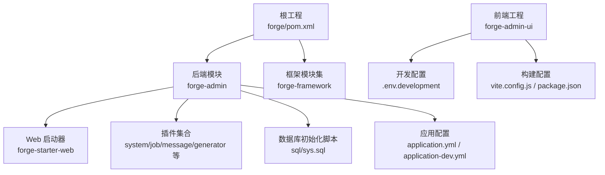
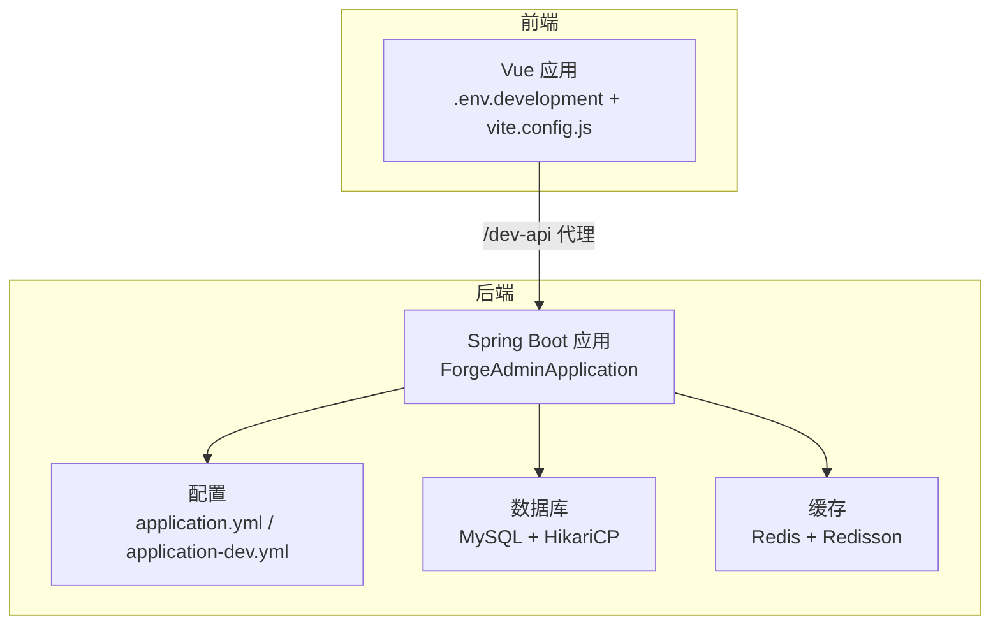
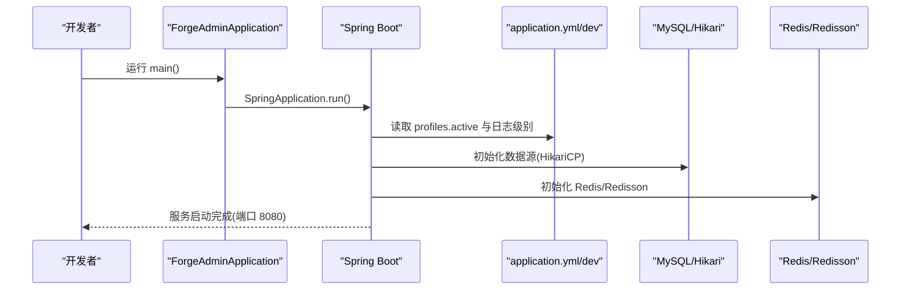
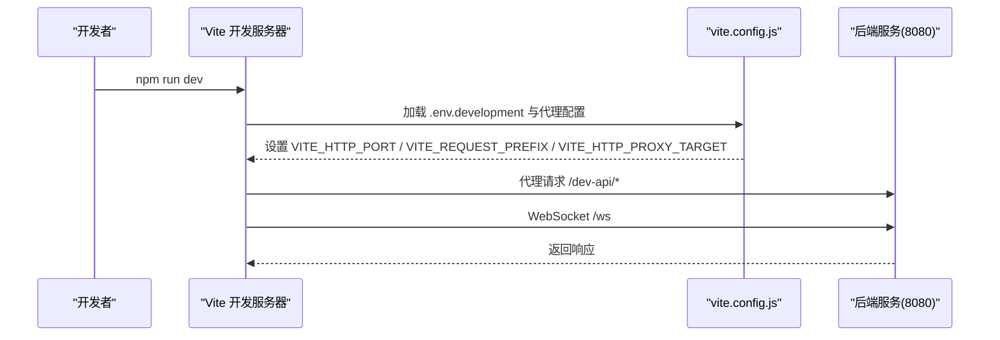
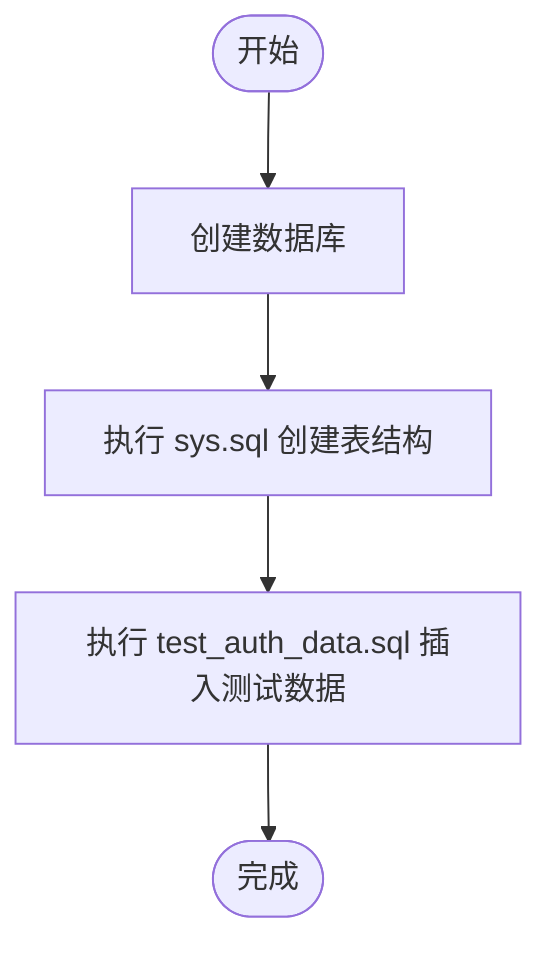
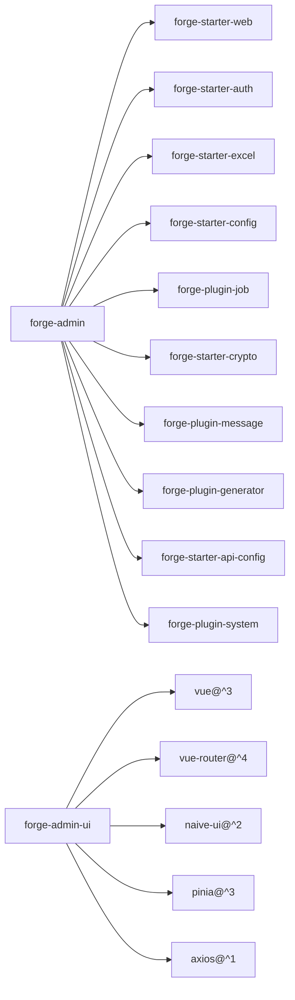

# 快速开始

<cite>
**本文引用的文件**
- [forge/pom.xml](file://forge/pom.xml)
- [forge/forge-admin/pom.xml](file://forge/forge-admin/pom.xml)
- [forge/forge-admin/src/main/java/com/mdframe/forge/admin/ForgeAdminApplication.java](file://forge/forge-admin/src/main/java/com/mdframe/forge/admin/ForgeAdminApplication.java)
- [forge/forge-admin/src/main/resources/application.yml](file://forge/forge-admin/src/main/resources/application.yml)
- [forge/forge-admin/src/main/resources/application-dev.yml](file://forge/forge-admin/src/main/resources/application-dev.yml)
- [forge/forge-framework/forge-starter-parent/forge-starter-web/pom.xml](file://forge/forge-framework/forge-starter-parent/forge-starter-web/pom.xml)
- [forge-admin-ui/package.json](file://forge-admin-ui/package.json)
- [forge-admin-ui/vite.config.js](file://forge-admin-ui/vite.config.js)
- [forge-admin-ui/.env.development](file://forge-admin-ui/.env.development)
- [forge-admin-ui/.env](file://forge-admin-ui/.env)
- [forge/forge-admin/sql/sys.sql](file://forge/forge-admin/sql/sys.sql)
- [forge/forge-admin/src/main/resources/sql/test_auth_data.sql](file://forge/forge-admin/src/main/resources/sql/test_auth_data.sql)
</cite>

## 目录
1. [简介](#简介)
2. [项目结构](#项目结构)
3. [核心组件](#核心组件)
4. [架构总览](#架构总览)
5. [详细组件解析](#详细组件解析)
6. [依赖关系分析](#依赖关系分析)
7. [性能注意事项](#性能注意事项)
8. [故障排查指南](#故障排查指南)
9. [结论](#结论)
10. [附录](#附录)

## 简介
本指南面向首次接触 Forge 框架的新手开发者，帮助你在约 30 分钟内完成从零到一的完整入门体验。你将学会：
- 准备开发环境（JDK 17+、Node.js、MySQL、Redis）
- 克隆仓库、安装依赖、初始化数据库
- 修改配置、启动后端与前端
- 访问系统、体验核心功能
- 常见问题排查与端口冲突、数据库连接等实用技巧

## 项目结构
Forge 采用多模块 Maven 工程，分为后端 Spring Boot 子工程与前端 Vue 子工程，配合统一的依赖与构建配置。

图表来源
- [forge/pom.xml](file://forge/pom.xml#L114-L117)
- [forge/forge-admin/pom.xml](file://forge/forge-admin/pom.xml#L13-L76)
- [forge/forge-framework/forge-starter-parent/forge-starter-web/pom.xml](file://forge/forge-framework/forge-starter-parent/forge-starter-web/pom.xml#L14-L59)
- [forge/forge-admin/sql/sys.sql](file://forge/forge-admin/sql/sys.sql#L1-L200)
- [forge/forge-admin/src/main/resources/application.yml](file://forge/forge-admin/src/main/resources/application.yml#L1-L100)
- [forge/forge-admin/src/main/resources/application-dev.yml](file://forge/forge-admin/src/main/resources/application-dev.yml#L1-L70)
- [forge-admin-ui/vite.config.js](file://forge-admin-ui/vite.config.js#L1-L86)
- [forge-admin-ui/.env.development](file://forge-admin-ui/.env.development#L1-L16)

章节来源
- [forge/pom.xml](file://forge/pom.xml#L114-L117)
- [forge/forge-admin/pom.xml](file://forge/forge-admin/pom.xml#L13-L76)
- [forge/forge-framework/forge-starter-parent/forge-starter-web/pom.xml](file://forge/forge-framework/forge-starter-parent/forge-starter-web/pom.xml#L14-L59)
- [forge/forge-admin/src/main/resources/application.yml](file://forge/forge-admin/src/main/resources/application.yml#L1-L100)
- [forge/forge-admin/src/main/resources/application-dev.yml](file://forge/forge-admin/src/main/resources/application-dev.yml#L1-L70)
- [forge-admin-ui/vite.config.js](file://forge-admin-ui/vite.config.js#L1-L86)
- [forge-admin-ui/.env.development](file://forge-admin-ui/.env.development#L1-L16)

## 核心组件
- 后端启动类：位于后端模块，负责加载 Spring Boot 并扫描核心包。
- 应用配置：集中于 application.yml 与环境特定的 application-dev.yml，包含服务器端口、数据库、Redis、MyBatis Plus、Sa-Token 等关键配置。
- 前端开发配置：通过 .env.development 指定前端本地端口、请求前缀与后端代理目标；vite.config.js 提供代理、别名与插件配置。
- 数据库初始化：提供系统表结构与测试数据初始化脚本，便于快速体验。

章节来源
- [forge/forge-admin/src/main/java/com/mdframe/forge/admin/ForgeAdminApplication.java](file://forge/forge-admin/src/main/java/com/mdframe/forge/admin/ForgeAdminApplication.java#L1-L18)
- [forge/forge-admin/src/main/resources/application.yml](file://forge/forge-admin/src/main/resources/application.yml#L1-L100)
- [forge/forge-admin/src/main/resources/application-dev.yml](file://forge/forge-admin/src/main/resources/application-dev.yml#L1-L70)
- [forge-admin-ui/.env.development](file://forge-admin-ui/.env.development#L1-L16)
- [forge-admin-ui/vite.config.js](file://forge-admin-ui/vite.config.js#L1-L86)
- [forge/forge-admin/sql/sys.sql](file://forge/forge-admin/sql/sys.sql#L1-L200)
- [forge/forge-admin/src/main/resources/sql/test_auth_data.sql](file://forge/forge-admin/src/main/resources/sql/test_auth_data.sql#L1-L168)

## 架构总览
下图展示了前后端交互与配置的关键节点：

图表来源
- [forge/forge-admin/src/main/java/com/mdframe/forge/admin/ForgeAdminApplication.java](file://forge/forge-admin/src/main/java/com/mdframe/forge/admin/ForgeAdminApplication.java#L8-L15)
- [forge/forge-admin/src/main/resources/application.yml](file://forge/forge-admin/src/main/resources/application.yml#L1-L100)
- [forge/forge-admin/src/main/resources/application-dev.yml](file://forge/forge-admin/src/main/resources/application-dev.yml#L1-L70)
- [forge-admin-ui/.env.development](file://forge-admin-ui/.env.development#L1-L16)
- [forge-admin-ui/vite.config.js](file://forge-admin-ui/vite.config.js#L56-L80)

## 详细组件解析

### 后端启动流程
后端通过 Spring Boot 启动类加载配置与扫描包， Undertow 作为 Web 容器提供高性能 HTTP 服务。

图表来源
- [forge/forge-admin/src/main/java/com/mdframe/forge/admin/ForgeAdminApplication.java](file://forge/forge-admin/src/main/java/com/mdframe/forge/admin/ForgeAdminApplication.java#L8-L15)
- [forge/forge-admin/src/main/resources/application.yml](file://forge/forge-admin/src/main/resources/application.yml#L1-L100)
- [forge/forge-admin/src/main/resources/application-dev.yml](file://forge/forge-admin/src/main/resources/application-dev.yml#L1-L70)

章节来源
- [forge/forge-admin/src/main/java/com/mdframe/forge/admin/ForgeAdminApplication.java](file://forge/forge-admin/src/main/java/com/mdframe/forge/admin/ForgeAdminApplication.java#L1-L18)
- [forge/forge-admin/src/main/resources/application.yml](file://forge/forge-admin/src/main/resources/application.yml#L1-L100)
- [forge/forge-admin/src/main/resources/application-dev.yml](file://forge/forge-admin/src/main/resources/application-dev.yml#L1-L70)

### 前端开发流程
前端通过 Vite 在本地启动开发服务器，使用代理将特定前缀的请求转发至后端，同时支持 WebSocket。

图表来源
- [forge-admin-ui/.env.development](file://forge-admin-ui/.env.development#L1-L16)
- [forge-admin-ui/vite.config.js](file://forge-admin-ui/vite.config.js#L56-L80)

章节来源
- [forge-admin-ui/.env.development](file://forge-admin-ui/.env.development#L1-L16)
- [forge-admin-ui/vite.config.js](file://forge-admin-ui/vite.config.js#L1-L86)

### 数据库初始化流程
系统提供完整的数据库表结构与测试数据初始化脚本，便于快速体验。

图表来源
- [forge/forge-admin/sql/sys.sql](file://forge/forge-admin/sql/sys.sql#L1-L200)
- [forge/forge-admin/src/main/resources/sql/test_auth_data.sql](file://forge/forge-admin/src/main/resources/sql/test_auth_data.sql#L1-L168)

章节来源
- [forge/forge-admin/sql/sys.sql](file://forge/forge-admin/sql/sys.sql#L1-L200)
- [forge/forge-admin/src/main/resources/sql/test_auth_data.sql](file://forge/forge-admin/src/main/resources/sql/test_auth_data.sql#L1-L168)

## 依赖关系分析
后端模块聚合了 Web、认证、Excel、配置、消息、定时任务、代码生成等能力，前端依赖 Vue 3、NaiveUI、Axios 等生态工具。

图表来源
- [forge/forge-admin/pom.xml](file://forge/forge-admin/pom.xml#L13-L76)
- [forge/forge-framework/forge-starter-parent/forge-starter-web/pom.xml](file://forge/forge-framework/forge-starter-parent/forge-starter-web/pom.xml#L14-L59)
- [forge-admin-ui/package.json](file://forge-admin-ui/package.json#L13-L41)

章节来源
- [forge/forge-admin/pom.xml](file://forge/forge-admin/pom.xml#L13-L76)
- [forge/forge-framework/forge-starter-parent/forge-starter-web/pom.xml](file://forge/forge-framework/forge-starter-parent/forge-starter-web/pom.xml#L14-L59)
- [forge-admin-ui/package.json](file://forge-admin-ui/package.json#L1-L68)

## 性能注意事项
- Undertow 作为 Web 容器，具备更高的并发与更低的延迟，适合高吞吐场景。
- HikariCP 连接池参数已预设，建议结合实际负载调整最大连接数、空闲超时等参数。
- Redis/Redisson 用于分布式会话与锁，注意合理设置连接池大小与超时时间。
- MyBatis Plus 的驼峰映射与日志实现已启用，便于调试与性能观测。

章节来源
- [forge/forge-admin/src/main/resources/application.yml](file://forge/forge-admin/src/main/resources/application.yml#L8-L22)
- [forge/forge-admin/src/main/resources/application-dev.yml](file://forge/forge-admin/src/main/resources/application-dev.yml#L19-L33)
- [forge/forge-framework/forge-starter-parent/forge-starter-web/pom.xml](file://forge/forge-framework/forge-starter-parent/forge-starter-web/pom.xml#L26-L43)

## 故障排查指南
- 端口冲突
  - 后端默认端口 8080，若被占用，请在应用配置中修改端口。
  - 前端默认端口 3000，若被占用，请在前端环境变量中修改。
- 数据库连接失败
  - 确认 MySQL 地址、端口、账号、密码与数据库名正确。
  - 若使用动态数据源，请确认主库配置与 HikariCP 参数合理。
- Redis 连接异常
  - 确认 Redis 地址、端口、密码与数据库索引正确。
  - 如启用 Redisson，请核对单机配置与连接池参数。
- 前端代理无效
  - 确认请求前缀与代理目标一致，且后端已启动。
  - 检查代理 rewrite 规则与 WebSocket 代理配置。
- 登录与权限问题
  - 使用测试账号与密码进行登录，确认测试数据已导入。
  - 检查资源表与角色权限映射是否正确。

章节来源
- [forge/forge-admin/src/main/resources/application.yml](file://forge/forge-admin/src/main/resources/application.yml#L2-L22)
- [forge/forge-admin/src/main/resources/application-dev.yml](file://forge/forge-admin/src/main/resources/application-dev.yml#L1-L70)
- [forge-admin-ui/.env.development](file://forge-admin-ui/.env.development#L1-L16)
- [forge-admin-ui/vite.config.js](file://forge-admin-ui/vite.config.js#L56-L80)
- [forge/forge-admin/src/main/resources/sql/test_auth_data.sql](file://forge/forge-admin/src/main/resources/sql/test_auth_data.sql#L154-L168)

## 结论
通过本指南，你已经完成了 Forge 框架的环境准备、依赖安装、数据库初始化与前后端启动。建议在完成基础体验后，逐步探索各模块的使用方式与扩展点，以满足更复杂的业务需求。

## 附录

### 环境准备清单
- JDK 17 或以上
- Node.js 18+（推荐 LTS）
- MySQL 8.0+（或兼容版本）
- Redis 6.0+（可选）

章节来源
- [forge/pom.xml](file://forge/pom.xml#L18-L18)
- [forge-admin-ui/package.json](file://forge-admin-ui/package.json#L1-L68)

### 依赖安装步骤
- 后端依赖
  - 使用 Maven 安装依赖与插件，确保 Java 版本符合要求。
- 前端依赖
  - 使用包管理器安装依赖，确保 Node.js 版本符合要求。

章节来源
- [forge/pom.xml](file://forge/pom.xml#L121-L202)
- [forge/forge-admin/pom.xml](file://forge/forge-admin/pom.xml#L78-L108)
- [forge-admin-ui/package.json](file://forge-admin-ui/package.json#L1-L68)

### 数据库初始化步骤
- 创建数据库
- 执行系统表结构脚本
- 执行测试数据脚本

章节来源
- [forge/forge-admin/sql/sys.sql](file://forge/forge-admin/sql/sys.sql#L1-L200)
- [forge/forge-admin/src/main/resources/sql/test_auth_data.sql](file://forge/forge-admin/src/main/resources/sql/test_auth_data.sql#L1-L168)

### 启动运行步骤
- 启动后端
  - 运行后端启动类，确认日志无错误。
- 启动前端
  - 启动前端开发服务器，打开浏览器访问对应地址。
- 访问系统
  - 使用测试账号登录，体验系统功能。

章节来源
- [forge/forge-admin/src/main/java/com/mdframe/forge/admin/ForgeAdminApplication.java](file://forge/forge-admin/src/main/java/com/mdframe/forge/admin/ForgeAdminApplication.java#L12-L15)
- [forge-admin-ui/.env.development](file://forge-admin-ui/.env.development#L1-L16)
- [forge-admin-ui/vite.config.js](file://forge-admin-ui/vite.config.js#L56-L80)
- [forge/forge-admin/src/main/resources/sql/test_auth_data.sql](file://forge/forge-admin/src/main/resources/sql/test_auth_data.sql#L154-L168)