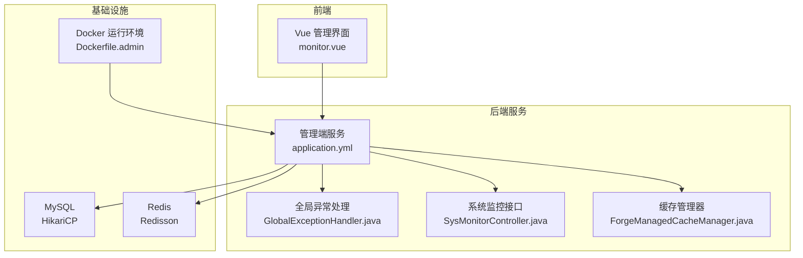
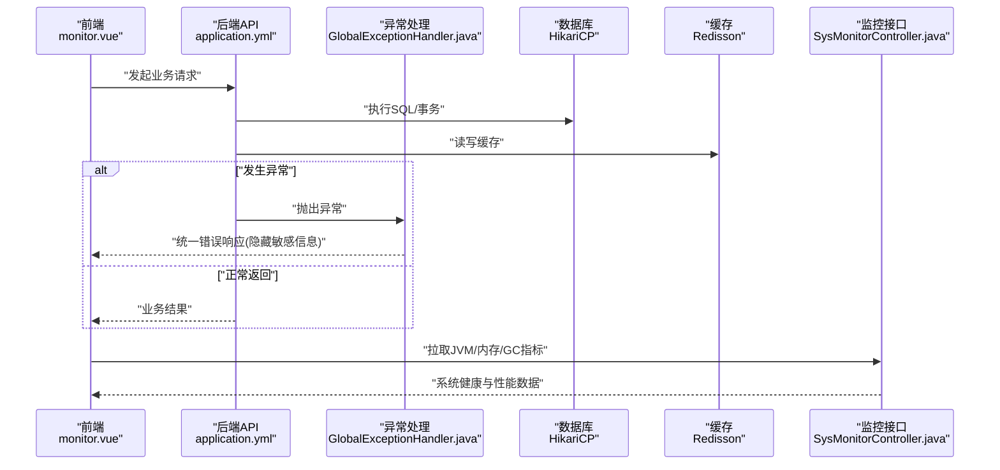
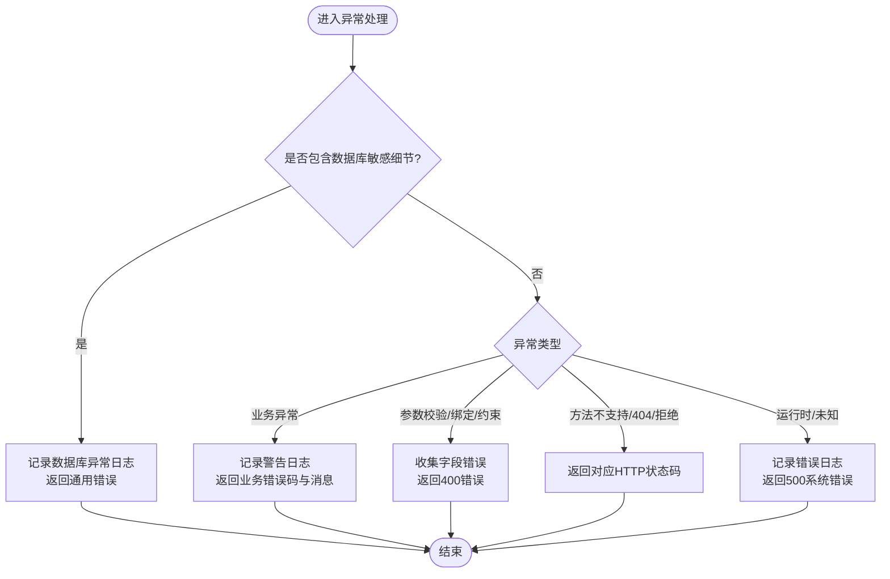
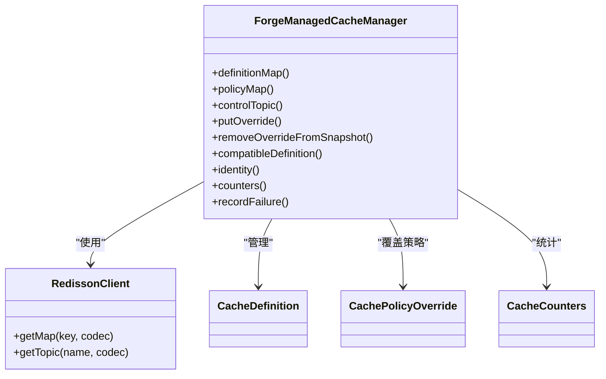
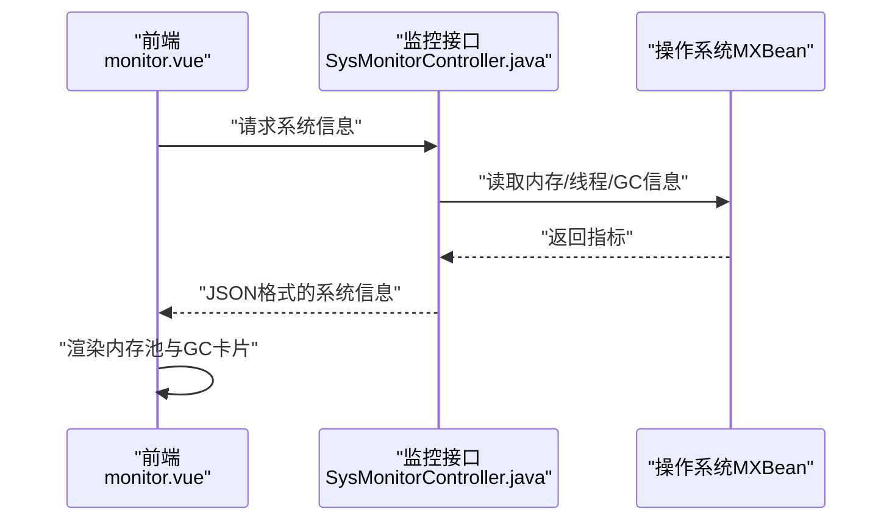
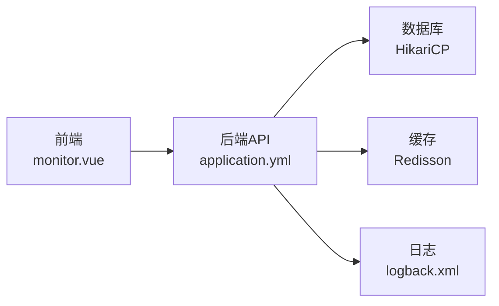

# 故障排查与FAQ

<cite>
**本文引用的文件**
- [application.yml](file://forge-server/forge-admin-server/src/main/resources/application.yml)
- [logback.xml](file://forge-server/forge-admin-server/src/main/resources/logback.xml)
- [application-datasource.yml](file://docker-forge-admin/application-datasource.yml)
- [GlobalExceptionHandler.java](file://forge-server/forge-framework/forge-starter-parent/forge-starter-core/src/main/java/com/mdframe/forge/starter/core/exception/GlobalExceptionHandler.java)
- [ForgeManagedCacheManager.java](file://forge-server/forge-framework/forge-starter-parent/forge-starter-cache/src/main/java/com/mdframe/forge/starter/cache/managed/ForgeManagedCacheManager.java)
- [SysMonitorController.java](file://forge-server/forge-framework/forge-plugin-parent/forge-plugin-system/src/main/java/com/mdframe/forge/plugin/system/controller/SysMonitorController.java)
- [monitor.vue](file://forge-admin-ui/src/views/system/monitor.vue)
- [package.json](file://forge-admin-ui/package.json)
- [Dockerfile.admin](file://docker/Dockerfile.admin)
- [AiProviderFailureDiagnostics.java](file://forge-server/forge-framework/forge-plugin-parent/forge-plugin-ai/src/main/java/com/mdframe/forge/plugin/ai/provider/support/AiProviderFailureDiagnostics.java)
- [spec.md（统一错误诊断）](file://code-copilot/changes/unified-error-diagnostics/spec.md)
</cite>

## 目录
1. [简介](#简介)
2. [项目结构](#项目结构)
3. [核心组件](#核心组件)
4. [架构总览](#架构总览)
5. [详细组件分析](#详细组件分析)
6. [依赖关系分析](#依赖关系分析)
7. [性能注意事项](#性能注意事项)
8. [故障排查指南](#故障排查指南)
9. [结论](#结论)
10. [附录](#附录)

## 简介
本文件面向 Forge Admin 的运维、开发与测试人员，提供系统化的故障排查方法与常见问题解答。内容覆盖环境问题、配置问题、性能问题与兼容性问题；深入说明日志分析方法、性能分析工具使用、内存分析技巧与网络调试手段；并给出常见错误代码解释、数据库连接问题、Redis 缓存问题与前端构建问题的排查步骤，以及调试工具推荐与最佳实践建议。

## 项目结构
本项目采用前后端分离与多模块后端架构：
- 后端服务：Spring Boot + Undertow，包含管理端、应用端、流程引擎、报表等模块，通过 starter 与 plugin 机制扩展能力。
- 数据层：MySQL（HikariCP 连接池）、Redis（Redisson），支持动态数据源与缓存策略。
- 前端：Vue3 + Vite，提供监控页面与系统管理能力。
- 部署：Docker Compose 编排，环境变量注入关键配置。

**图表来源**
- [application.yml:1-228](file://forge-server/forge-admin-server/src/main/resources/application.yml#L1-L228)
- [GlobalExceptionHandler.java:1-335](file://forge-server/forge-framework/forge-starter-parent/forge-starter-core/src/main/java/com/mdframe/forge/starter/core/exception/GlobalExceptionHandler.java#L1-L335)
- [SysMonitorController.java:178-296](file://forge-server/forge-framework/forge-plugin-parent/forge-plugin-system/src/main/java/com/mdframe/forge/plugin/system/controller/SysMonitorController.java#L178-L296)
- [ForgeManagedCacheManager.java:419-521](file://forge-server/forge-framework/forge-starter-parent/forge-starter-cache/src/main/java/com/mdframe/forge/starter/cache/managed/ForgeManagedCacheManager.java#L419-L521)
- [application-datasource.yml:1-61](file://docker-forge-admin/application-datasource.yml#L1-L61)
- [Dockerfile.admin:1-39](file://docker/Dockerfile.admin#L1-L39)

**章节来源**
- [application.yml:1-228](file://forge-server/forge-admin-server/src/main/resources/application.yml#L1-L228)
- [logback.xml:1-49](file://forge-server/forge-admin-server/src/main/resources/logback.xml#L1-L49)
- [application-datasource.yml:1-61](file://docker-forge-admin/application-datasource.yml#L1-L61)
- [Dockerfile.admin:1-39](file://docker/Dockerfile.admin#L1-L39)

## 核心组件
- 全局异常处理器：统一捕获业务异常、参数校验异常、数据库异常等，屏蔽敏感信息，返回规范响应。
- 缓存管理器：基于 Redisson 的分布式缓存，提供定义、策略覆盖、统计与失败记录。
- 系统监控控制器：暴露 JVM、内存池、线程、GC 等运行时指标，供前端展示。
- 日志框架：Logback 输出带 traceId 的结构化日志，便于链路追踪。
- 启动与环境：Docker 镜像通过环境变量注入数据库、Redis 与 Flow 地址等关键配置。

**章节来源**
- [GlobalExceptionHandler.java:1-335](file://forge-server/forge-framework/forge-starter-parent/forge-starter-core/src/main/java/com/mdframe/forge/starter/core/exception/GlobalExceptionHandler.java#L1-L335)
- [ForgeManagedCacheManager.java:419-521](file://forge-server/forge-framework/forge-starter-parent/forge-starter-cache/src/main/java/com/mdframe/forge/starter/cache/managed/ForgeManagedCacheManager.java#L419-L521)
- [SysMonitorController.java:178-296](file://forge-server/forge-framework/forge-plugin-parent/forge-plugin-system/src/main/java/com/mdframe/forge/plugin/system/controller/SysMonitorController.java#L178-L296)
- [logback.xml:1-49](file://forge-server/forge-admin-server/src/main/resources/logback.xml#L1-L49)
- [Dockerfile.admin:1-39](file://docker/Dockerfile.admin#L1-L39)

## 架构总览
下图展示了请求从前端到后端，再到数据库与缓存的完整链路，以及异常处理与监控采集的关键节点。

**图表来源**
- [application.yml:1-228](file://forge-server/forge-admin-server/src/main/resources/application.yml#L1-L228)
- [GlobalExceptionHandler.java:1-335](file://forge-server/forge-framework/forge-starter-parent/forge-starter-core/src/main/java/com/mdframe/forge/starter/core/exception/GlobalExceptionHandler.java#L1-L335)
- [application-datasource.yml:1-61](file://docker-forge-admin/application-datasource.yml#L1-L61)
- [SysMonitorController.java:178-296](file://forge-server/forge-framework/forge-plugin-parent/forge-plugin-system/src/main/java/com/mdframe/forge/plugin/system/controller/SysMonitorController.java#L178-L296)

## 详细组件分析

### 全局异常处理与错误码
- 统一拦截各类异常，识别数据库相关异常并屏蔽 SQL、密码、Token 等敏感细节。
- 对业务异常、参数校验异常、方法不支持、404、访问拒绝、上传大小超限等进行分类处理。
- 未知异常兜底返回通用系统错误消息，避免泄露堆栈或内部实现。

**图表来源**
- [GlobalExceptionHandler.java:1-335](file://forge-server/forge-framework/forge-starter-parent/forge-starter-core/src/main/java/com/mdframe/forge/starter/core/exception/GlobalExceptionHandler.java#L1-L335)

**章节来源**
- [GlobalExceptionHandler.java:66-288](file://forge-server/forge-framework/forge-starter-parent/forge-starter-core/src/main/java/com/mdframe/forge/starter/core/exception/GlobalExceptionHandler.java#L66-L288)

### 缓存管理与 Redis 诊断
- 缓存定义与策略通过 Redisson RMap 持久化，支持命名空间隔离与策略覆盖。
- 提供命中、未命中、写入、淘汰、失败计数统计，便于定位缓存异常。
- 控制主题用于跨实例同步策略变更，确保一致性。

**图表来源**
- [ForgeManagedCacheManager.java:419-521](file://forge-server/forge-framework/forge-starter-parent/forge-starter-cache/src/main/java/com/mdframe/forge/starter/cache/managed/ForgeManagedCacheManager.java#L419-L521)

**章节来源**
- [ForgeManagedCacheManager.java:419-521](file://forge-server/forge-framework/forge-starter-parent/forge-starter-cache/src/main/java/com/mdframe/forge/starter/cache/managed/ForgeManagedCacheManager.java#L419-L521)

### 系统监控与内存分析
- 后端暴露 JVM、内存池、线程、GC 等信息，前端以表格与卡片形式展示。
- 支持获取物理内存、交换空间、类加载数量、编译信息等，辅助性能调优。

**图表来源**
- [SysMonitorController.java:178-296](file://forge-server/forge-framework/forge-plugin-parent/forge-plugin-system/src/main/java/com/mdframe/forge/plugin/system/controller/SysMonitorController.java#L178-L296)
- [monitor.vue:201-247](file://forge-admin-ui/src/views/system/monitor.vue#L201-L247)

**章节来源**
- [SysMonitorController.java:178-296](file://forge-server/forge-framework/forge-plugin-parent/forge-plugin-system/src/main/java/com/mdframe/forge/plugin/system/controller/SysMonitorController.java#L178-L296)
- [monitor.vue:201-247](file://forge-admin-ui/src/views/system/monitor.vue#L201-L247)

### 启动与环境配置
- Docker 镜像通过环境变量注入 MySQL、Redis、Flow 客户端地址等关键配置。
- Spring Boot 应用通过 application.yml 与 logback.xml 控制端口、上下文路径、日志级别与输出位置。
- Flyway 迁移默认启用，可配置迁移脚本位置与基线版本。

**章节来源**
- [Dockerfile.admin:14-38](file://docker/Dockerfile.admin#L14-L38)
- [application.yml:1-228](file://forge-server/forge-admin-server/src/main/resources/application.yml#L1-L228)
- [logback.xml:1-49](file://forge-server/forge-admin-server/src/main/resources/logback.xml#L1-L49)

## 依赖关系分析
- 后端服务依赖数据库与 Redis，通过 HikariCP 与 Redisson 进行连接管理。
- 前端通过 HTTP 调用后端 API，并消费监控接口数据。
- 日志框架贯穿全链路，traceId 可用于关联请求与日志。

**图表来源**
- [application.yml:1-228](file://forge-server/forge-admin-server/src/main/resources/application.yml#L1-L228)
- [application-datasource.yml:1-61](file://docker-forge-admin/application-datasource.yml#L1-L61)
- [logback.xml:1-49](file://forge-server/forge-admin-server/src/main/resources/logback.xml#L1-L49)

**章节来源**
- [application.yml:1-228](file://forge-server/forge-admin-server/src/main/resources/application.yml#L1-L228)
- [application-datasource.yml:1-61](file://docker-forge-admin/application-datasource.yml#L1-L61)
- [logback.xml:1-49](file://forge-server/forge-admin-server/src/main/resources/logback.xml#L1-L49)

## 性能注意事项
- Undertow 线程与缓冲区：合理设置 IO 线程数与工作线程池大小，避免阻塞任务堆积。
- 数据库连接池：调整最大连接数、空闲超时与生命周期，防止连接泄漏与频繁创建销毁。
- Redis 连接池：根据并发量调整连接池大小与 Netty 线程数，降低延迟与丢包率。
- 缓存命中率：关注统计计数器，定位热点键与失效风暴。
- 前端构建：Vite 构建时增加 Node 堆大小，避免内存不足导致构建失败。

[本节为通用指导，不直接分析具体文件]

## 故障排查指南

### 环境与启动问题
- 症状：应用无法启动或端口占用。
- 检查点：
  - 查看 application.yml 中 server.port 与 context-path。
  - 确认 Dockerfile.admin 中 JAVA_OPTS、SPRING_PROFILES_ACTIVE、MYSQL_*、REDIS_*、FLOW_CLIENT_URL 等环境变量已正确注入。
  - 检查 Flyway 迁移是否成功，必要时调整 FORGE_FLYWAY_ENABLED 与 locations。
- 操作建议：
  - 在容器外单独打印环境变量，确认值符合预期。
  - 临时关闭 Flyway 验证是否为迁移脚本导致启动失败。
  - 若端口冲突，修改端口或释放占用进程。

**章节来源**
- [application.yml:1-228](file://forge-server/forge-admin-server/src/main/resources/application.yml#L1-L228)
- [Dockerfile.admin:14-38](file://docker/Dockerfile.admin#L14-L38)

### 数据库连接问题
- 症状：SQL 执行失败、连接超时、权限拒绝、死锁或表不存在。
- 检查点：
  - 查看 application-datasource.yml 中 JDBC URL、用户名、密码、HikariCP 参数。
  - 观察 GlobalExceptionHandler 中的数据库异常标记，判断是否命中 SQL 语法、完整性约束、通信链路失败等。
  - 检查数据库字符集与排序规则一致性（参考统一错误诊断文档）。
- 操作建议：
  - 使用数据库客户端直连验证连通性与权限。
  - 调整 connectionTimeout、maxPoolSize 与 idleTimeout，缓解高并发下的连接争用。
  - 修复 SQL 或表结构后重试，必要时回滚迁移。

**章节来源**
- [application-datasource.yml:1-61](file://docker-forge-admin/application-datasource.yml#L1-L61)
- [GlobalExceptionHandler.java:66-288](file://forge-server/forge-framework/forge-starter-parent/forge-starter-core/src/main/java/com/mdframe/forge/starter/core/exception/GlobalExceptionHandler.java#L66-L288)
- [spec.md（统一错误诊断）:551-583](file://code-copilot/changes/unified-error-diagnostics/spec.md#L551-L583)

### Redis 缓存问题
- 症状：缓存读不到、写入失败、策略不同步、统计失败计数上升。
- 检查点：
  - 查看 application-datasource.yml 中 spring.data.redis.* 与 redisson.config。
  - 关注 ForgeManagedCacheManager 的定义映射、策略映射与控制主题。
  - 检查 Redis 地址、端口、密码与连接池大小。
- 操作建议：
  - 使用 redis-cli 或可视化工具验证连通性与 key 是否存在。
  - 调整 connectionPoolSize、nettyThreads 与重试次数，提升稳定性。
  - 清理异常策略覆盖，恢复默认定义。

**章节来源**
- [application-datasource.yml:23-44](file://docker-forge-admin/application-datasource.yml#L23-L44)
- [ForgeManagedCacheManager.java:419-521](file://forge-server/forge-framework/forge-starter-parent/forge-starter-cache/src/main/java/com/mdframe/forge/starter/cache/managed/ForgeManagedCacheManager.java#L419-L521)

### 前端构建问题
- 症状：构建时报内存不足、插件重复、模块解析失败。
- 检查点：
  - package.json 中 build 脚本已设置 node --max_old_space_size=4096。
  - 检查 Vite 插件是否重复注册，避免多个 Vue 插件冲突。
  - 确认 TypeScript/JS 模块解析配置与别名一致。
- 操作建议：
  - 增大 Node 堆大小或减少并行构建任务。
  - 移除重复插件或使用单一入口配置。
  - 使用 vite-plugin-vue-devtools 与浏览器开发者工具辅助定位。

**章节来源**
- [package.json:6-17](file://forge-admin-ui/package.json#L6-L17)

### 日志分析方法
- 查看日志位置与格式：logback.xml 定义了日志路径与包含 traceId 的输出格式。
- 过滤关键字：结合 GlobalExceptionHandler 的数据库异常标记，快速定位 SQL 与连接问题。
- 链路追踪：通过 traceId 关联前端请求与后端日志，缩小问题范围。
- 建议：生产环境将日志接入集中式日志平台，按模块与级别拆分文件。

**章节来源**
- [logback.xml:1-49](file://forge-server/forge-admin-server/src/main/resources/logback.xml#L1-L49)
- [GlobalExceptionHandler.java:66-288](file://forge-server/forge-framework/forge-starter-parent/forge-starter-core/src/main/java/com/mdframe/forge/starter/core/exception/GlobalExceptionHandler.java#L66-L288)

### 性能分析与内存分析技巧
- 使用 SysMonitorController 暴露的指标观察 JVM、内存池、线程与 GC。
- 关注 GC 收集次数与时间，识别频繁 Full GC 或老年代增长过快。
- 结合前端 monitor.vue 可视化面板，持续跟踪性能趋势。
- 建议：在生产开启 JMX 与外部监控（如 Prometheus + Grafana），定期导出快照。

**章节来源**
- [SysMonitorController.java:178-296](file://forge-server/forge-framework/forge-plugin-parent/forge-plugin-system/src/main/java/com/mdframe/forge/plugin/system/controller/SysMonitorController.java#L178-L296)
- [monitor.vue:201-247](file://forge-admin-ui/src/views/system/monitor.vue#L201-L247)

### 网络调试手段
- 使用 curl 或 Postman 直接调用后端 API，排除前端问题。
- 检查 Nginx 反向代理与防火墙规则，确认端口与域名解析正确。
- 通过浏览器开发者工具的 Network 面板查看请求头、响应体与耗时。
- 若涉及 HTTPS，检查证书与跨域配置。

[本节为通用指导，不直接分析具体文件]

### 常见错误代码解释
- 400：参数校验失败、类型不匹配、缺少必需参数、上传大小超限。
- 403：访问拒绝，无权限访问资源。
- 404：请求的资源不存在。
- 405：不支持的请求方法。
- 500：系统异常或数据库异常（已屏蔽敏感信息）。

**章节来源**
- [GlobalExceptionHandler.java:94-262](file://forge-server/forge-framework/forge-starter-parent/forge-starter-core/src/main/java/com/mdframe/forge/starter/core/exception/GlobalExceptionHandler.java#L94-L262)

### AI 提供者失败诊断
- 当 AI 调用失败时，可通过 AiProviderFailureDiagnostics 提取错误码与类型，限制消息长度，便于日志与告警。
- 建议：结合统一错误诊断文档，完善错误编号与解决文档链接。

**章节来源**
- [AiProviderFailureDiagnostics.java:63-89](file://forge-server/forge-framework/forge-plugin-parent/forge-plugin-ai/src/main/java/com/mdframe/forge/plugin/ai/provider/support/AiProviderFailureDiagnostics.java#L63-L89)
- [spec.md（统一错误诊断）:31-57](file://code-copilot/changes/unified-error-diagnostics/spec.md#L31-L57)

## 结论
通过统一的异常处理、结构化的日志输出、完善的监控接口与合理的配置管理，Forge Admin 提供了良好的可观测性与可维护性。建议在生产环境中持续优化数据库与缓存连接池、加强日志集中化与监控告警，并结合前端构建的最佳实践，保障系统稳定与高性能。

[本节为总结性内容，不直接分析具体文件]

## 附录
- 调试工具推荐：
  - 后端：JDK Mission Control、Arthas、Micrometer + Prometheus。
  - 前端：Vite DevTools、浏览器开发者工具、Rollup Visualizer。
  - 数据库：MySQL Workbench、DBeaver、慢查询日志。
  - 缓存：Redis CLI、RedisInsight。
- 最佳实践建议：
  - 严格区分开发、测试、生产配置，使用环境变量注入敏感信息。
  - 建立统一的错误码与文档体系，确保错误可追溯与可解决。
  - 定期进行容量规划与压测，验证连接池与线程模型。
  - 对关键路径添加埋点与告警，提前发现潜在风险。

[本节为通用指导，不直接分析具体文件]