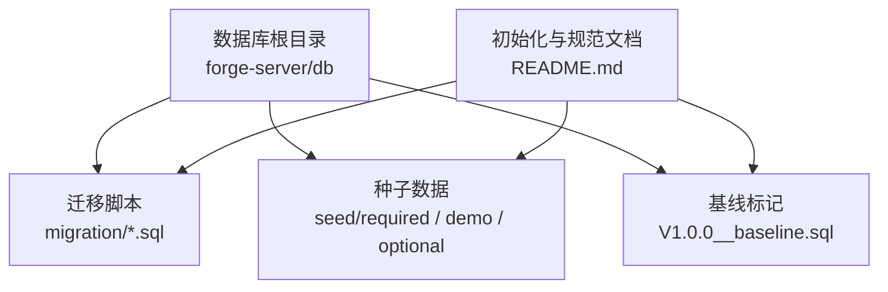
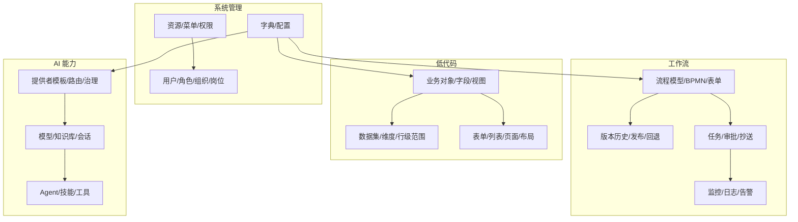
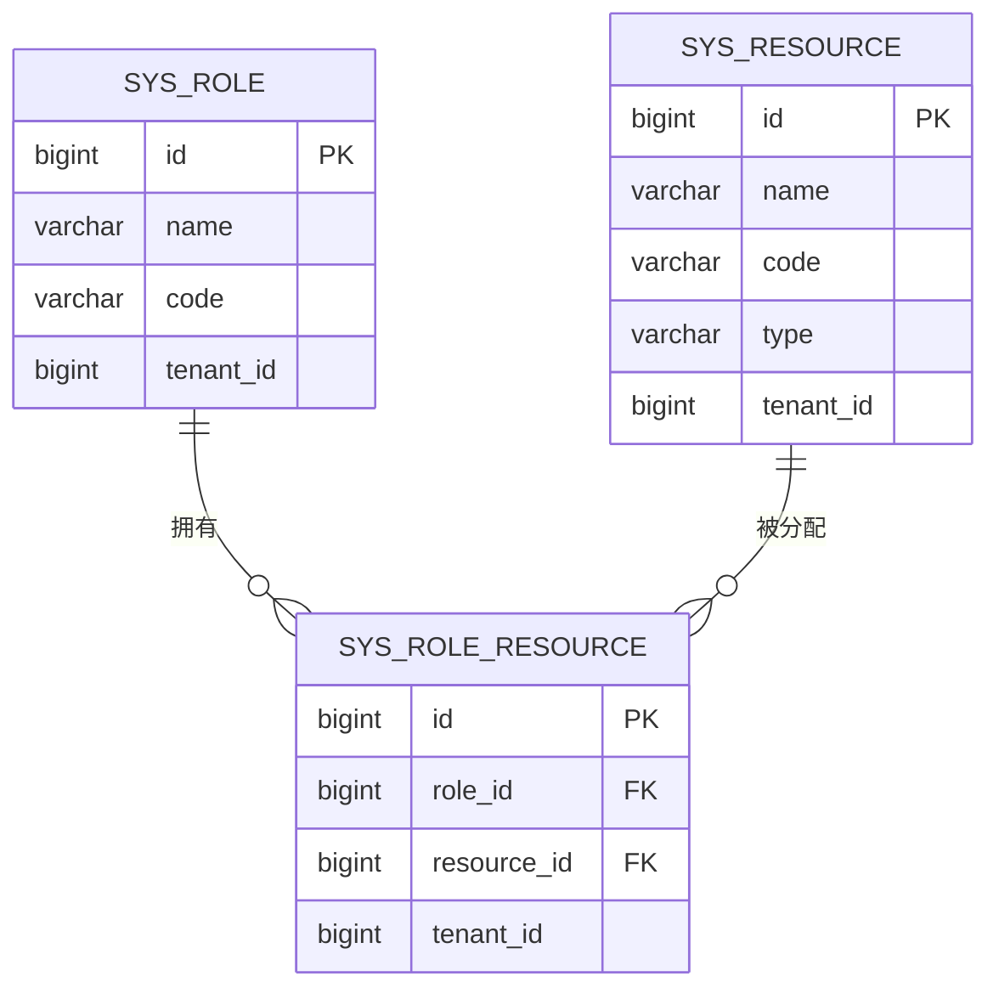
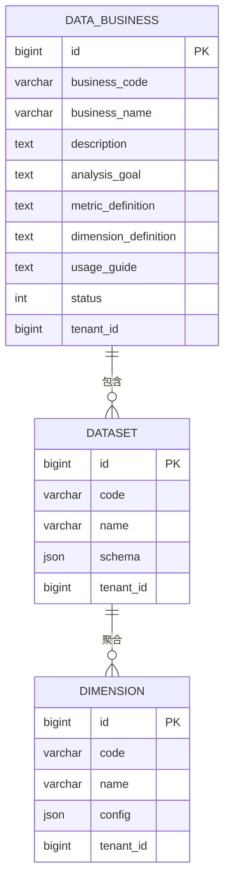
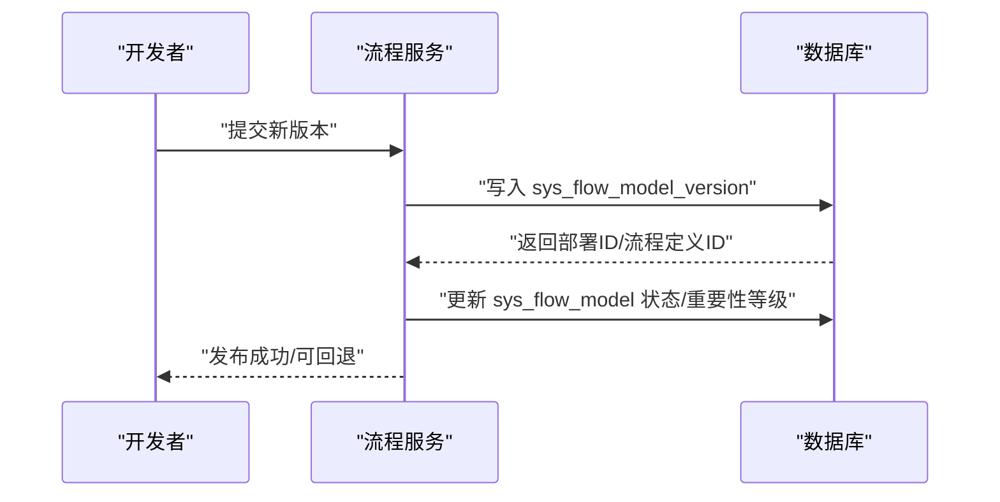
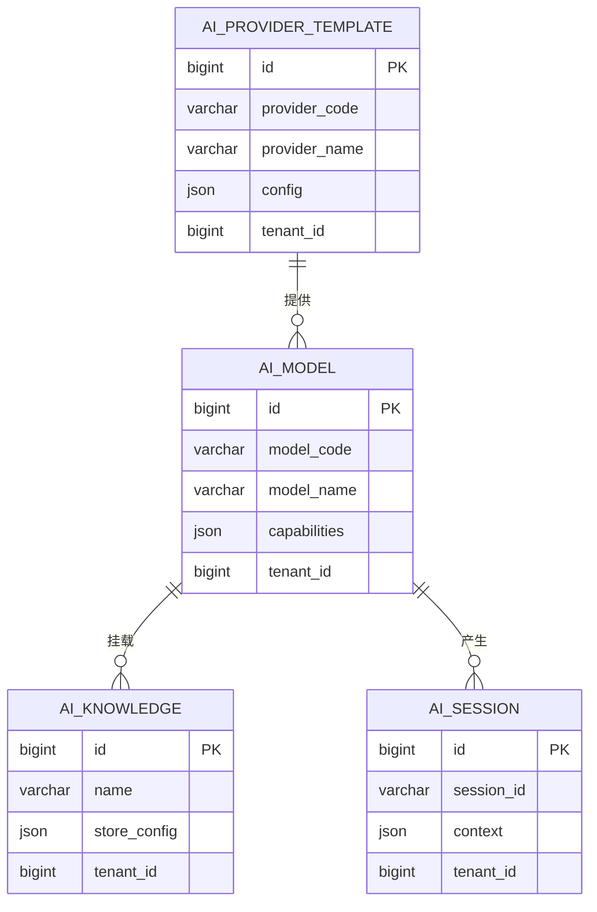
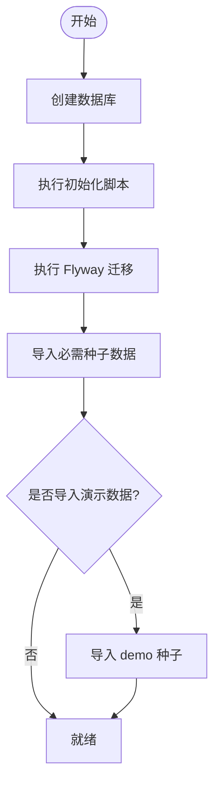
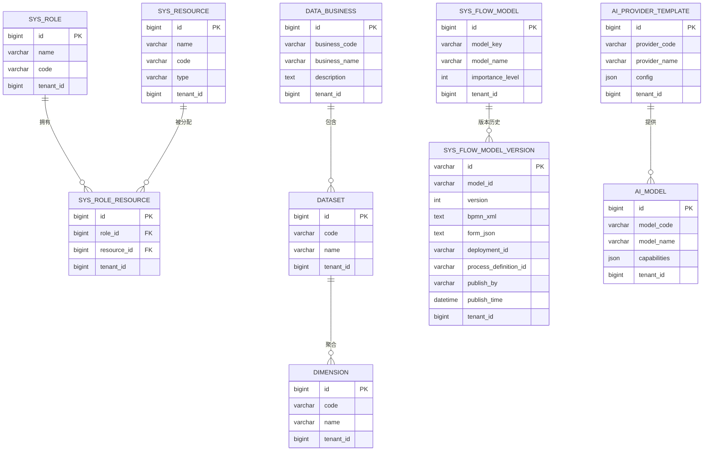

# 数据库设计

<cite>
**本文引用的文件**
- [README.md](file://forge-server/db/README.md)
- [V1.0.0__baseline.sql](file://forge-server/db/migration/V1.0.0__baseline.sql)
- [flow_version_init.sql](file://forge-admin-server/src/main/resources/sql/flow_version_init.sql)
- [test_auth_data.sql](file://forge-admin-server/src/main/resources/sql/test_auth_data.sql)
- [SysRoleResourceMapper.xml](file://forge-framework/forge-plugin-parent/forge-plugin-system/src/main/resources/mapper/SysRoleResourceMapper.xml)
- [R__sys_resource.sql](file://forge-server/db/seed/required/R__sys_resource.sql)
- [R__sys_dict.sql](file://forge-server/db/seed/required/R__sys_dict.sql)
- [R__ai_provider_template.sql](file://forge-server/db/seed/required/R__ai_provider_template.sql)
- [D__demo_dashboard_project.sql](file://forge-server/db/seed/demo/D__demo_dashboard_project.sql)
- [D__demo_data_business.sql](file://forge-server/db/seed/demo/D__demo_data_business.sql)
- [D__demo_dataset.sql](file://forge-server/db/seed/demo/D__demo_dataset.sql)
</cite>

## 目录
1. [简介](#简介)
2. [项目结构](#项目结构)
3. [核心组件](#核心组件)
4. [架构总览](#架构总览)
5. [详细组件分析](#详细组件分析)
6. [依赖关系分析](#依赖关系分析)
7. [性能考虑](#性能考虑)
8. [故障排查指南](#故障排查指南)
9. [结论](#结论)
10. [附录](#附录)

## 简介
本文件面向 Forge Admin 的数据库设计与治理，聚焦系统管理、低代码、工作流与 AI 能力四大域的核心表结构、实体关系、字段定义、主外键约束、索引设计、数据验证规则，以及 Flyway 版本化迁移策略、种子数据管理与社区导出规范。同时提供 ER 图、典型查询示例、备份恢复策略与安全加固建议，帮助读者快速理解并安全演进数据库。

## 项目结构
Forge Admin 的数据库资产集中在 forge-server/db 目录下，采用“基线 + 增量迁移 + 种子数据”的组织方式：
- 基线：V1.0.0__baseline.sql 作为 Flyway 基线，历史结构由后端初始化脚本生成。
- 迁移：migration 目录按版本号命名 Vx.y.z__说明.sql，用于增量变更。
- 种子：seed/required 为系统必需数据；seed/demo 为演示数据；seed/optional 为可选模块数据。
- 初始化与工具：README.md 提供了完整的一键初始化、Flyway 开关、新增迁移与种子数据的规范与命令。

图表来源
- [README.md:129-165](file://forge-server/db/README.md#L129-L165)
- [V1.0.0__baseline.sql:1-4](file://forge-server/db/migration/V1.0.0__baseline.sql#L1-L4)

章节来源
- [README.md:1-105](file://forge-server/db/README.md#L1-L105)
- [README.md:129-165](file://forge-server/db/README.md#L129-L165)
- [README.md:166-259](file://forge-server/db/README.md#L166-L259)
- [V1.0.0__baseline.sql:1-4](file://forge-server/db/migration/V1.0.0__baseline.sql#L1-L4)

## 核心组件
- 系统管理域：用户、角色、资源、字典、配置等基础权限与元数据。
- 低代码域：业务对象、数据集、维度、表单/列表/页面等运行时元数据（通过迁移逐步完善）。
- 工作流域：流程模型、版本历史、任务、监控、通知等（含 BPMN 与表单配置）。
- AI 能力域：AI 提供者模板、模型、会话、知识、Agent、多模态等扩展能力。

上述域通过统一的租户隔离、逻辑删除、审计字段与字典枚举进行规范化建模，并通过迁移脚本持续演进。

章节来源
- [README.md:166-259](file://forge-server/db/README.md#L166-L259)

## 架构总览
下图展示 Forge Admin 数据库在系统管理、低代码、工作流与 AI 四大域的宏观关系，以及它们如何通过统一的基础设施（租户、字典、资源）协同工作。

[此图为概念性架构图，不直接映射具体源文件，故无图表来源]

## 详细组件分析

### 系统管理域
- 资源与权限
  - 资源表 sys_resource 承载菜单、按钮与 API 等资源项，配合角色资源关联表 sys_role_resource 实现 RBAC。
  - 测试数据脚本展示了角色与资源的绑定关系，便于本地验证权限链路。
- 字典与配置
  - 字典类型与数据通过 sys_dict_type/sys_dict_data 维护，支撑各域枚举值。
  - 系统配置表 sys_config 用于平台级参数。
- 种子数据
  - required 下的 R__sys_resource.sql、R__sys_dict.sql、R__ai_provider_template.sql 为必需种子占位文件，保持幂等且不包含敏感数据。

图表来源
- [SysRoleResourceMapper.xml:5-19](file://forge-framework/forge-plugin-parent/forge-plugin-system/src/main/resources/mapper/SysRoleResourceMapper.xml#L5-L19)
- [test_auth_data.sql:93-122](file://forge-admin-server/src/main/resources/sql/test_auth_data.sql#L93-L122)

章节来源
- [test_auth_data.sql:93-122](file://forge-admin-server/src/main/resources/sql/test_auth_data.sql#L93-L122)
- [SysRoleResourceMapper.xml:5-19](file://forge-framework/forge-plugin-parent/forge-plugin-system/src/main/resources/mapper/SysRoleResourceMapper.xml#L5-L19)
- [R__sys_resource.sql:1-3](file://forge-server/db/seed/required/R__sys_resource.sql#L1-L3)
- [R__sys_dict.sql:1-3](file://forge-server/db/seed/required/R__sys_dict.sql#L1-L3)
- [R__ai_provider_template.sql:1-3](file://forge-server/db/seed/required/R__ai_provider_template.sql#L1-L3)

### 低代码域
- 业务对象与数据集
  - 业务对象 data_business 描述业务语义、指标口径、使用指南等，并与数据集 dataset 建立一对多关系。
  - 数据集进一步关联维度 dimension，支持多维分析与查询。
- 演示数据
  - seed/demo 下提供演示用的业务、数据集与大屏项目数据，便于快速体验。

图表来源
- [D__demo_data_business.sql](file://forge-server/db/seed/demo/D__demo_data_business.sql)
- [D__demo_dataset.sql](file://forge-server/db/seed/demo/D__demo_dataset.sql)

章节来源
- [D__demo_data_business.sql](file://forge-server/db/seed/demo/D__demo_data_business.sql)
- [D__demo_dataset.sql](file://forge-server/db/seed/demo/D__demo_dataset.sql)
- [D__demo_dashboard_project.sql](file://forge-server/db/seed/demo/D__demo_dashboard_project.sql)

### 工作流域
- 流程模型与版本
  - 流程模型表 sys_flow_model 承载 BPMN 与表单配置，新增重要性等级字段以区分普通与重要流程。
  - 版本历史表 sys_flow_model_version 记录每次发布的 BPMN XML、表单 JSON、部署 ID、发布人与时间等，并提供唯一键 model_id+version 保证版本唯一性。
- 字典与菜单
  - 版本标记 flow_version_tag 与重要性等级 flow_importance_level 通过字典统一管理。
  - 版本管理菜单与权限可通过资源表配置（示例脚本中给出注释化的插入语句）。

图表来源
- [flow_version_init.sql:7-28](file://forge-admin-server/src/main/resources/sql/flow_version_init.sql#L7-L28)
- [flow_version_init.sql:31-33](file://forge-admin-server/src/main/resources/sql/flow_version_init.sql#L31-L33)
- [flow_version_init.sql:36-63](file://forge-admin-server/src/main/resources/sql/flow_version_init.sql#L36-L63)
- [flow_version_init.sql:74-96](file://forge-admin-server/src/main/resources/sql/flow_version_init.sql#L74-L96)

章节来源
- [flow_version_init.sql:7-28](file://forge-admin-server/src/main/resources/sql/flow_version_init.sql#L7-L28)
- [flow_version_init.sql:31-33](file://forge-admin-server/src/main/resources/sql/flow_version_init.sql#L31-L33)
- [flow_version_init.sql:36-63](file://forge-admin-server/src/main/resources/sql/flow_version_init.sql#L36-L63)
- [flow_version_init.sql:74-96](file://forge-admin-server/src/main/resources/sql/flow_version_init.sql#L74-L96)

### AI 能力域
- 提供者与模型
  - ai_provider_template 存储 AI 提供者模板与适配信息，支撑多厂商接入与路由治理。
  - 模型表 ai_model 与知识库、会话、Agent、技能等扩展表共同构成 AI 能力底座。
- 种子数据
  - required 下的 R__ai_provider_template.sql 为必需种子占位文件，保持幂等且不包含敏感数据。

图表来源
- [R__ai_provider_template.sql:1-3](file://forge-server/db/seed/required/R__ai_provider_template.sql#L1-L3)

章节来源
- [R__ai_provider_template.sql:1-3](file://forge-server/db/seed/required/R__ai_provider_template.sql#L1-L3)

## 依赖关系分析
- 迁移与基线
  - V1.0.0__baseline.sql 声明基线，后续所有结构变更以 Vx.y.z__说明.sql 形式追加。
- 初始化与种子
  - README.md 明确初始化顺序：创建库 → 执行初始化脚本 → 执行 migration → 执行 required seed → 可选 demo/optional。
- 权限与资源
  - SysRoleResourceMapper.xml 定义了角色-资源批量插入与查询，test_auth_data.sql 提供本地测试数据。

图表来源
- [README.md:45-77](file://forge-server/db/README.md#L45-L77)
- [README.md:129-165](file://forge-server/db/README.md#L129-L165)

章节来源
- [V1.0.0__baseline.sql:1-4](file://forge-server/db/migration/V1.0.0__baseline.sql#L1-L4)
- [README.md:45-77](file://forge-server/db/README.md#L45-L77)
- [README.md:129-165](file://forge-server/db/README.md#L129-L165)
- [SysRoleResourceMapper.xml:5-19](file://forge-framework/forge-plugin-parent/forge-plugin-system/src/main/resources/mapper/SysRoleResourceMapper.xml#L5-L19)
- [test_auth_data.sql:93-122](file://forge-admin-server/src/main/resources/sql/test_auth_data.sql#L93-L122)

## 性能考虑
- 索引设计
  - 流程版本历史表对 (model_id, version) 设置唯一键，并对 model_id 建立索引，提升按模型查询与版本定位性能。
  - 建议在高频查询列上补充复合索引（如租户、状态、时间），并结合执行计划优化。
- 查询优化
  - 分页查询需确保 where 条件命中索引；避免全表扫描与隐式类型转换。
  - 大字段（BPMN XML、JSON）尽量按需加载，减少 IO。
- 事务与锁
  - 发布/回退等关键操作应使用短事务，避免长事务持有锁。
- 统计信息与分区
  - 定期收集统计信息；对超大表（如日志、会话）考虑按时间分区。
- 连接与缓存
  - 合理设置连接池大小；热点字典与配置可使用应用层缓存。

[本节为通用性能建议，不直接分析具体文件]

## 故障排查指南
- 初始化失败
  - 检查环境变量 FORGE_FLYWAY_ENABLED 与迁移目录配置是否正确。
  - 确认数据库字符集与排序规则一致，避免中文乱码或比较异常。
- 权限问题
  - 核对角色-资源绑定是否生效，参考测试数据脚本中的绑定样例。
  - 使用 Mapper 提供的查询接口验证角色权限集合。
- 敏感数据泄露
  - 社区导出前运行 dry-run 检查，确保不包含 password、token、secret、key、phone、email 等敏感字段。
- 版本回退异常
  - 检查流程模型重要性等级与权限控制，重要流程需更高权限才能回退。

章节来源
- [README.md:129-165](file://forge-server/db/README.md#L129-L165)
- [README.md:260-348](file://forge-server/db/README.md#L260-L348)
- [test_auth_data.sql:93-122](file://forge-admin-server/src/main/resources/sql/test_auth_data.sql#L93-L122)
- [SysRoleResourceMapper.xml:5-19](file://forge-framework/forge-plugin-parent/forge-plugin-system/src/main/resources/mapper/SysRoleResourceMapper.xml#L5-L19)
- [flow_version_init.sql:31-63](file://forge-admin-server/src/main/resources/sql/flow_version_init.sql#L31-L63)

## 结论
Forge Admin 数据库采用清晰的领域划分与严格的版本化管理策略，结合字典枚举、租户隔离与逻辑删除，形成可扩展、可治理的数据底座。通过 Flyway 迁移与种子数据机制，既能保障环境一致性，又能支持快速迭代与社区同步。建议在生产环境中严格遵循迁移与种子规范，配合索引优化、备份恢复与安全加固，持续提升稳定性与性能。

[本节为总结性内容，不直接分析具体文件]

## 附录

### ER 图（核心实体关系）

图表来源
- [SysRoleResourceMapper.xml:5-19](file://forge-framework/forge-plugin-parent/forge-plugin-system/src/main/resources/mapper/SysRoleResourceMapper.xml#L5-L19)
- [flow_version_init.sql:7-28](file://forge-admin-server/src/main/resources/sql/flow_version_init.sql#L7-L28)
- [flow_version_init.sql:31-33](file://forge-admin-server/src/main/resources/sql/flow_version_init.sql#L31-L33)
- [R__ai_provider_template.sql:1-3](file://forge-server/db/seed/required/R__ai_provider_template.sql#L1-L3)

### 典型查询示例
- 查询某角色的资源集合
  - 使用角色资源 Mapper 的查询方法，按租户与角色获取资源 ID 列表。
- 查询流程模型的版本历史
  - 按 model_id 与 version 唯一键定位版本，或通过 model_id 索引检索最新版本。
- 查询业务对象及其数据集
  - 从 data_business 关联 dataset，再聚合 dimension，构建多维分析上下文。

章节来源
- [SysRoleResourceMapper.xml:13-19](file://forge-framework/forge-plugin-parent/forge-plugin-system/src/main/resources/mapper/SysRoleResourceMapper.xml#L13-L19)
- [flow_version_init.sql:7-28](file://forge-admin-server/src/main/resources/sql/flow_version_init.sql#L7-L28)
- [D__demo_data_business.sql](file://forge-server/db/seed/demo/D__demo_data_business.sql)
- [D__demo_dataset.sql](file://forge-server/db/seed/demo/D__demo_dataset.sql)

### Flyway 版本化管理策略
- 基线与迁移
  - 基线：V1.0.0__baseline.sql 标记基线位置。
  - 迁移：新增结构变更时，新增 Vx.y.z__说明.sql，仅允许小写英文、数字与下划线，禁止中文文件名与真实业务数据。
- 启动行为
  - 默认关闭自动迁移，需设置环境变量 FORGE_FLYWAY_ENABLED=true 才会在启动时执行迁移。
  - 迁移目录与表名可在配置中指定。

章节来源
- [README.md:129-165](file://forge-server/db/README.md#L129-L165)
- [README.md:166-197](file://forge-server/db/README.md#L166-L197)
- [V1.0.0__baseline.sql:1-4](file://forge-server/db/migration/V1.0.0__baseline.sql#L1-L4)

### 数据迁移脚本规范
- 命名：V版本号__说明.sql
- 内容：仅包含结构变更或幂等的初始化数据，避免真实业务数据。
- 校验：社区导出前使用 dry-run 检查迁移与种子命名、白名单/黑名单、敏感字段。

章节来源
- [README.md:166-197](file://forge-server/db/README.md#L166-L197)
- [README.md:260-348](file://forge-server/db/README.md#L260-L348)

### 种子数据管理
- 必需数据：seed/required，系统启动必需，默认导入。
- 演示数据：seed/demo，需显式参数导入。
- 可选数据：seed/optional，需显式参数导入。
- 幂等性：所有种子脚本应保持幂等，避免重复执行报错。

章节来源
- [README.md:198-259](file://forge-server/db/README.md#L198-L259)
- [R__sys_resource.sql:1-3](file://forge-server/db/seed/required/R__sys_resource.sql#L1-L3)
- [R__sys_dict.sql:1-3](file://forge-server/db/seed/required/R__sys_dict.sql#L1-L3)
- [R__ai_provider_template.sql:1-3](file://forge-server/db/seed/required/R__ai_provider_template.sql#L1-L3)

### 备份恢复策略
- 全量备份：定期执行全量导出，保留最近若干份快照。
- 增量备份：结合 binlog 或时间点恢复，缩短 RTO。
- 恢复演练：定期演练恢复流程，验证可用性与一致性。
- 脱敏与合规：导出与共享前进行敏感字段脱敏与合规检查。

[本节为通用运维建议，不直接分析具体文件]

### 数据安全保护措施
- 敏感字段：导出脚本会检测 password、token、secret、key、phone、email 等敏感格式，失败则阻止发布。
- 权限最小化：基于 RBAC 的资源访问控制，结合租户隔离限制跨租户访问。
- 加密与密钥：避免在数据库中明文存储密钥，必要时使用加密存储与密钥轮换。
- 审计与日志：关键操作记录审计日志，便于追溯与合规。

章节来源
- [README.md:260-348](file://forge-server/db/README.md#L260-L348)