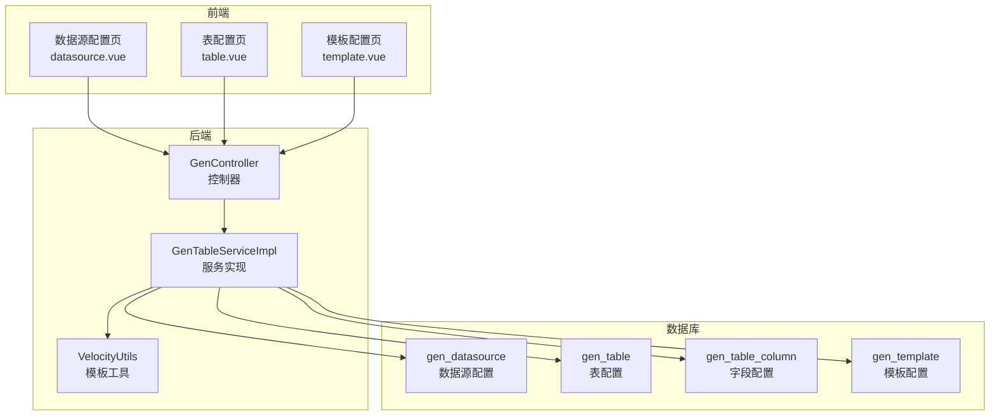
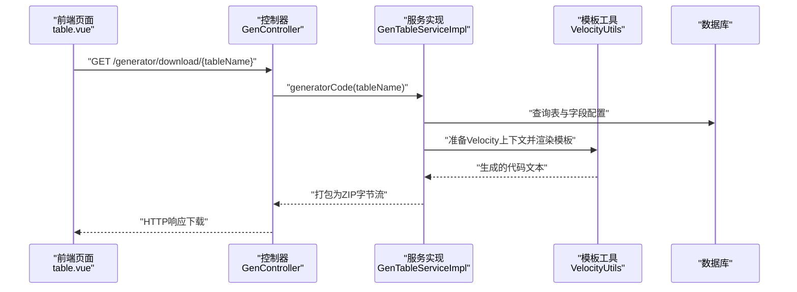
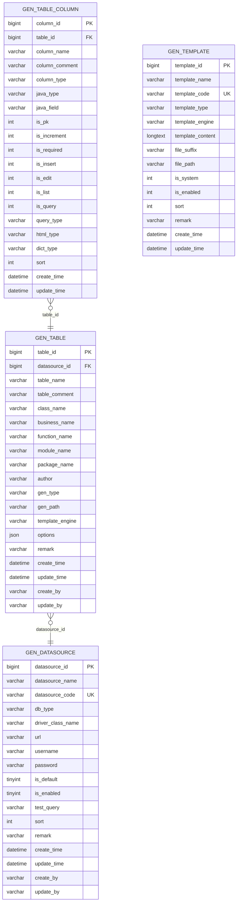
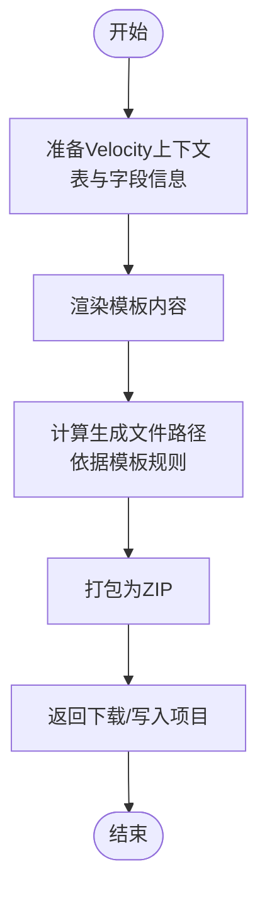
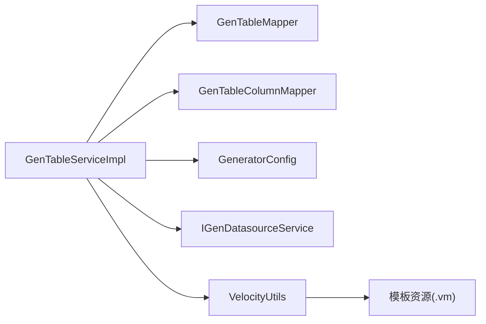

# 代码生成器表结构

<cite>
**本文引用的文件**
- [gen_datasource.sql](file://forge/forge-admin/sql/gen_datasource.sql)
- [generator_tables.sql](file://forge/forge-framework/forge-plugin-parent/forge-plugin-generator/src/main/resources/sql/generator_tables.sql)
- [GenTable.java](file://forge/forge-framework/forge-plugin-parent/forge-plugin-generator/src/main/java/com/mdframe/forge/plugin/generator/domain/entity/GenTable.java)
- [GenTableColumn.java](file://forge/forge-framework/forge-plugin-parent/forge-plugin-generator/src/main/java/com/mdframe/forge/plugin/generator/domain/entity/GenTableColumn.java)
- [GenTemplate.java](file://forge/forge-framework/forge-plugin-parent/forge-plugin-generator/src/main/java/com/mdframe/forge/plugin/generator/domain/entity/GenTemplate.java)
- [GenController.java](file://forge/forge-framework/forge-plugin-parent/forge-plugin-generator/src/main/java/com/mdframe/forge/plugin/generator/controller/GenController.java)
- [GenTableServiceImpl.java](file://forge/forge-framework/forge-plugin-parent/forge-plugin-generator/src/main/java/com/mdframe/forge/plugin/generator/service/impl/GenTableServiceImpl.java)
- [VelocityUtils.java](file://forge/forge-framework/forge-plugin-parent/forge-plugin-generator/src/main/java/com/mdframe/forge/plugin/generator/util/VelocityUtils.java)
- [entity.java.vm](file://forge/forge-framework/forge-plugin-parent/forge-plugin-generator/src/main/resources/templates/vm/entity.java.vm)
- [controller.java.vm](file://forge/forge-framework/forge-plugin-parent/forge-plugin-generator/src/main/resources/templates/vm/controller.java.vm)
- [datasource.vue](file://forge-admin-ui/src/views/generator/datasource.vue)
- [table.vue](file://forge-admin-ui/src/views/generator/table.vue)
- [template.vue](file://forge-admin-ui/src/views/generator/template.vue)
</cite>

## 目录
1. [简介](#简介)
2. [项目结构](#项目结构)
3. [核心组件](#核心组件)
4. [架构总览](#架构总览)
5. [详细组件分析](#详细组件分析)
6. [依赖关系分析](#依赖关系分析)
7. [性能考虑](#性能考虑)
8. [故障排除指南](#故障排除指南)
9. [结论](#结论)

## 简介
本文件面向开发者与运维人员，系统化梳理代码生成器模块的数据库表结构与配置机制，重点覆盖以下核心表：
- gen_datasource：数据源配置表
- gen_table：表配置表（业务属性与生成参数）
- gen_table_column：字段配置表（映射关系与显示规则）
- gen_template：模板配置表（生成规则与模板内容）

通过字段含义说明、表关系图、生成流程与实际使用示例，帮助快速理解并正确使用代码生成的数据模型。

## 项目结构
代码生成器相关的核心位置分布如下：
- 后端SQL脚本与实体类：forge/forge-framework/forge-plugin-parent/forge-plugin-generator
- 前端页面与交互：forge-admin-ui/src/views/generator
- 后端控制器与服务：forge/forge-framework/forge-plugin-parent/forge-plugin-generator/src/main/java/com/mdframe/forge/plugin/generator

图表来源
- [datasource.vue](file://forge-admin-ui/src/views/generator/datasource.vue#L1-L350)
- [table.vue](file://forge-admin-ui/src/views/generator/table.vue#L1-L396)
- [template.vue](file://forge-admin-ui/src/views/generator/template.vue#L1-L542)
- [GenController.java](file://forge/forge-framework/forge-plugin-parent/forge-plugin-generator/src/main/java/com/mdframe/forge/plugin/generator/controller/GenController.java#L75-L141)
- [GenTableServiceImpl.java](file://forge/forge-framework/forge-plugin-parent/forge-plugin-generator/src/main/java/com/mdframe/forge/plugin/generator/service/impl/GenTableServiceImpl.java#L29-L116)
- [VelocityUtils.java](file://forge/forge-framework/forge-plugin-parent/forge-plugin-generator/src/main/java/com/mdframe/forge/plugin/generator/util/VelocityUtils.java#L1-L154)
- [generator_tables.sql](file://forge/forge-framework/forge-plugin-parent/forge-plugin-generator/src/main/resources/sql/generator_tables.sql#L3-L102)

章节来源
- [generator_tables.sql](file://forge/forge-framework/forge-plugin-parent/forge-plugin-generator/src/main/resources/sql/generator_tables.sql#L1-L103)
- [datasource.vue](file://forge-admin-ui/src/views/generator/datasource.vue#L1-L350)
- [table.vue](file://forge-admin-ui/src/views/generator/table.vue#L1-L396)
- [template.vue](file://forge-admin-ui/src/views/generator/template.vue#L1-L542)

## 核心组件
本节从“表结构—实体类—前端配置—生成流程”的维度，系统说明四个核心表的设计与职责。

- gen_datasource（数据源配置表）
  - 职责：统一管理可选的数据库连接信息，支持默认数据源与启用状态控制。
  - 关键字段：datasource_id、datasource_name、datasource_code、db_type、driver_class_name、url、username、password、is_default、is_enabled、test_query、sort、remark、create_time、update_time、create_by、update_by。
  - 约束：datasource_code 唯一；索引：is_default、is_enabled。
  - 默认数据源：系统内置一条默认数据源记录，便于首次使用。

- gen_table（表配置表）
  - 职责：定义某张物理表在代码生成中的业务属性与生成参数。
  - 关键字段：table_id、datasource_id、table_name、table_comment、class_name、business_name、function_name、module_name、package_name、author、gen_type、gen_path、template_engine、options、remark、create_time、update_time、create_by、update_by。
  - 关系：外键指向 gen_datasource；唯一约束为 (datasource_id, table_name)。
  - 业务属性：模块名、包路径、作者、生成方式（下载/直接生成）、模板引擎（Velocity/Freemarker/AI）等。

- gen_table_column（字段配置表）
  - 职责：对 gen_table 的字段进行细化配置，决定生成代码中字段的Java类型、是否参与增删改查、查询方式、显示类型、字典类型等。
  - 关键字段：column_id、table_id、column_name、column_comment、column_type、java_type、java_field、is_pk、is_increment、is_required、is_insert、is_edit、is_list、is_query、query_type、html_type、dict_type、sort、create_time、update_time。
  - 关系：外键指向 gen_table；索引：table_id。

- gen_template（模板配置表）
  - 职责：定义各类代码模板（实体、Mapper、Service、Controller、DTO、VO、SQL等）的生成规则与模板内容。
  - 关键字段：template_id、template_name、template_code、template_type、template_engine、template_content、file_suffix、file_path、is_system、is_enabled、sort、remark、create_time、update_time。
  - 约束：template_code 唯一；模板类型枚举覆盖常见后端代码与SQL脚本。

章节来源
- [generator_tables.sql](file://forge/forge-framework/forge-plugin-parent/forge-plugin-generator/src/main/resources/sql/generator_tables.sql#L3-L102)
- [gen_datasource.sql](file://forge/forge-admin/sql/gen_datasource.sql#L1-L49)
- [GenTable.java](file://forge/forge-framework/forge-plugin-parent/forge-plugin-generator/src/main/java/com/mdframe/forge/plugin/generator/domain/entity/GenTable.java#L1-L147)
- [GenTableColumn.java](file://forge/forge-framework/forge-plugin-parent/forge-plugin-generator/src/main/java/com/mdframe/forge/plugin/generator/domain/entity/GenTableColumn.java#L1-L59)
- [GenTemplate.java](file://forge/forge-framework/forge-plugin-parent/forge-plugin-generator/src/main/java/com/mdframe/forge/plugin/generator/domain/entity/GenTemplate.java#L1-L89)

## 架构总览
代码生成的端到端流程如下：
- 前端页面负责配置数据源、表与模板，并触发生成。
- 控制器接收请求，调用服务层完成导入、配置校验、模板渲染与打包输出。
- 服务层基于模板引擎（Velocity/Freemarker）渲染模板，生成代码文件并返回给前端或下载。

图表来源
- [table.vue](file://forge-admin-ui/src/views/generator/table.vue#L354-L378)
- [GenController.java](file://forge/forge-framework/forge-plugin-parent/forge-plugin-generator/src/main/java/com/mdframe/forge/plugin/generator/controller/GenController.java#L118-L127)
- [GenTableServiceImpl.java](file://forge/forge-framework/forge-plugin-parent/forge-plugin-generator/src/main/java/com/mdframe/forge/plugin/generator/service/impl/GenTableServiceImpl.java#L113-L146)
- [VelocityUtils.java](file://forge/forge-framework/forge-plugin-parent/forge-plugin-generator/src/main/java/com/mdframe/forge/plugin/generator/util/VelocityUtils.java#L148-L154)

## 详细组件分析

### 数据源配置表（gen_datasource）
- 设计要点
  - 唯一标识：datasource_code，确保全局唯一。
  - 连接信息：db_type、driver_class_name、url、username、password。
  - 状态与排序：is_default、is_enabled、sort。
  - 安全性：password 采用加密存储策略（由系统统一处理）。
- 字段详细说明（节选）
  - datasource_id：自增主键
  - datasource_name：数据源名称
  - datasource_code：数据源编码（唯一）
  - db_type：数据库类型（MySQL/Oracle/PostgreSQL/SQLServer）
  - driver_class_name：JDBC驱动类名
  - url：JDBC连接地址
  - username/password：认证凭据
  - is_default/is_enabled：默认启用状态
  - test_query：测试查询SQL，默认 SELECT 1
  - sort/remark：排序与备注
  - create_time/update_time/create_by/update_by：审计字段
- 前端交互
  - 支持新增、编辑、删除、测试连接、启用/禁用切换。
  - 测试连接调用后端接口验证连通性。

章节来源
- [generator_tables.sql](file://forge/forge-framework/forge-plugin-parent/forge-plugin-generator/src/main/resources/sql/generator_tables.sql#L3-L26)
- [gen_datasource.sql](file://forge/forge-admin/sql/gen_datasource.sql#L1-L49)
- [datasource.vue](file://forge-admin-ui/src/views/generator/datasource.vue#L60-L350)

### 表配置表（gen_table）
- 设计要点
  - 关联数据源：datasource_id 指向 gen_datasource。
  - 唯一约束：(datasource_id, table_name)，避免同一数据源下重复导入同名表。
  - 业务属性：module_name、package_name、className、businessName、functionName 等。
  - 生成参数：gen_type（下载/项目）、gen_path、template_engine（Velocity/Freemarker/AI）、options（扩展JSON）。
- 字段详细说明（节选）
  - table_id：自增主键
  - datasource_id：所属数据源
  - table_name/table_comment：物理表名与注释
  - className/businessName/functionName：实体类名、业务名、功能名
  - moduleName/packageName/author：模块、包、作者
  - gen_type/gen_path/template_engine：生成方式与模板引擎
  - options：其他生成选项（JSON）
  - remark、create_time/update_time/create_by/update_by：审计字段
- 前端交互
  - 支持导入表、配置表属性、字段配置、预览与生成。
  - 生成方式支持下载代码包或直接生成到项目。

章节来源
- [generator_tables.sql](file://forge/forge-framework/forge-plugin-parent/forge-plugin-generator/src/main/resources/sql/generator_tables.sql#L32-L56)
- [GenTable.java](file://forge/forge-framework/forge-plugin-parent/forge-plugin-generator/src/main/java/com/mdframe/forge/plugin/generator/domain/entity/GenTable.java#L1-L147)
- [table.vue](file://forge-admin-ui/src/views/generator/table.vue#L110-L396)

### 字段配置表（gen_table_column）
- 设计要点
  - 关联表：table_id 指向 gen_table。
  - 映射关系：column_name/column_type → java_type/java_field。
  - 业务规则：is_insert/is_edit/is_list/is_query 控制增删改查与列表展示；query_type 定义查询条件；html_type 定义前端显示控件类型；dict_type 绑定字典转换。
  - 排序：sort 决定字段顺序。
- 字段详细说明（节选）
  - column_id：自增主键
  - table_id：所属表
  - column_name/column_comment：字段名与注释
  - column_type/java_type/java_field：物理类型→Java类型→Java字段名
  - is_pk/is_increment/is_required：主键、自增、必填
  - is_insert/is_edit/is_list/is_query：是否参与增删改查与列表/查询
  - query_type/html_type/dict_type：查询方式、HTML控件类型、字典类型
  - sort：排序
  - create_time/update_time：审计字段
- 前端交互
  - 在“表配置”页点击“字段”，进入字段配置弹窗，逐项调整生成行为。

章节来源
- [generator_tables.sql](file://forge/forge-framework/forge-plugin-parent/forge-plugin-generator/src/main/resources/sql/generator_tables.sql#L58-L82)
- [GenTableColumn.java](file://forge/forge-framework/forge-plugin-parent/forge-plugin-generator/src/main/java/com/mdframe/forge/plugin/generator/domain/entity/GenTableColumn.java#L1-L59)
- [table.vue](file://forge-admin-ui/src/views/generator/table.vue#L341-L396)

### 模板配置表（gen_template）
- 设计要点
  - 唯一约束：template_code，保证模板编码唯一。
  - 模板类型：涵盖实体、Mapper、Mapper XML、Service、ServiceImpl、Controller、DTO、VO、Query、SQL脚本等。
  - 模板引擎：template_engine 支持 VELOCITY/FREEMARKER/AI。
  - 文件规则：file_suffix、file_path 定义生成文件后缀与相对路径。
  - 系统内置：is_system 标记系统自带模板，通常不可删除。
- 字段详细说明（节选）
  - template_id：自增主键
  - template_name/template_code：模板名称与编码
  - template_type：模板类型（枚举）
  - template_engine：模板引擎
  - template_content：模板内容（Velocity/Freemarker语法）
  - file_suffix/file_path：文件后缀与生成路径
  - is_system/is_enabled/sort：系统内置、启用状态与排序
  - remark、create_time/update_time：审计字段
- 前端交互
  - 支持新增、编辑、复制、删除（系统内置不可删）、预览（选择表后渲染）。
  - 预览弹窗通过 /generator/template/preview 接口渲染模板。

章节来源
- [generator_tables.sql](file://forge/forge-framework/forge-plugin-parent/forge-plugin-generator/src/main/resources/sql/generator_tables.sql#L84-L102)
- [GenTemplate.java](file://forge/forge-framework/forge-plugin-parent/forge-plugin-generator/src/main/java/com/mdframe/forge/plugin/generator/domain/entity/GenTemplate.java#L1-L89)
- [template.vue](file://forge-admin-ui/src/views/generator/template.vue#L124-L542)

### 表关系图

图表来源
- [generator_tables.sql](file://forge/forge-framework/forge-plugin-parent/forge-plugin-generator/src/main/resources/sql/generator_tables.sql#L3-L102)

### 生成流程与模板渲染
- 模板渲染流程
  - 服务层准备 Velocity 上下文（包含表与字段信息），调用模板工具渲染。
  - 渲染后的代码按模板规则生成文件路径（如 entity.java.vm → 目标包路径下的实体类文件）。
- 模板示例
  - 实体类模板：entity.java.vm，根据字段生成实体类、注解与字段。
  - 控制器模板：controller.java.vm，生成标准的REST接口与日志注解。

图表来源
- [GenTableServiceImpl.java](file://forge/forge-framework/forge-plugin-parent/forge-plugin-generator/src/main/java/com/mdframe/forge/plugin/generator/service/impl/GenTableServiceImpl.java#L113-L146)
- [VelocityUtils.java](file://forge/forge-framework/forge-plugin-parent/forge-plugin-generator/src/main/java/com/mdframe/forge/plugin/generator/util/VelocityUtils.java#L148-L154)
- [entity.java.vm](file://forge/forge-framework/forge-plugin-parent/forge-plugin-generator/src/main/resources/templates/vm/entity.java.vm#L1-L58)
- [controller.java.vm](file://forge/forge-framework/forge-plugin-parent/forge-plugin-generator/src/main/resources/templates/vm/controller.java.vm#L1-L99)

## 依赖关系分析
- 组件耦合
  - GenTableServiceImpl 依赖 GenTableMapper、GenTableColumnMapper、GeneratorConfig、IGenDatasourceService。
  - 模板渲染依赖 VelocityUtils 与模板资源（.vm 文件）。
- 外部依赖
  - 数据库：MySQL/Oracle/PostgreSQL/SQLServer（由 db_type 与 driver_class_name 驱动）。
  - 模板引擎：Velocity（默认）与 Freemarker（可选）。
- 潜在风险
  - 模板语法错误会导致渲染异常，需在模板页预览阶段发现。
  - 字段配置不当（如 dict_type 未匹配字典类型）可能导致运行期翻译失败。

图表来源
- [GenTableServiceImpl.java](file://forge/forge-framework/forge-plugin-parent/forge-plugin-generator/src/main/java/com/mdframe/forge/plugin/generator/service/impl/GenTableServiceImpl.java#L37-L40)
- [VelocityUtils.java](file://forge/forge-framework/forge-plugin-parent/forge-plugin-generator/src/main/java/com/mdframe/forge/plugin/generator/util/VelocityUtils.java#L1-L154)

章节来源
- [GenTableServiceImpl.java](file://forge/forge-framework/forge-plugin-parent/forge-plugin-generator/src/main/java/com/mdframe/forge/plugin/generator/service/impl/GenTableServiceImpl.java#L29-L116)
- [VelocityUtils.java](file://forge/forge-framework/forge-plugin-parent/forge-plugin-generator/src/main/java/com/mdframe/forge/plugin/generator/util/VelocityUtils.java#L1-L154)

## 性能考虑
- 数据源连接
  - 使用 is_default 与 is_enabled 快速筛选可用数据源，减少无效连接尝试。
  - test_query 保持轻量（如 SELECT 1），避免长事务阻塞。
- 表与字段导入
  - 导入时先删除旧配置再重建，避免重复数据导致的渲染开销。
  - 字段配置表建立索引 idx_table_id，提升字段查询效率。
- 模板渲染
  - 优先使用 Velocity（默认），模板内容尽量简洁，避免复杂逻辑。
  - 批量生成时合并为ZIP，减少IO次数。

## 故障排除指南
- 数据源测试失败
  - 检查 db_type 与 driver_class_name 是否匹配；核对 url、username、password。
  - 确认网络可达与防火墙放行。
- 生成失败
  - 检查模板编码与模板类型是否一致；确认模板内容语法正确。
  - 若为 Velocity，检查模板变量是否在上下文中提供（如 className、columns 等）。
- 字段映射异常
  - 核对 gen_table_column 的 java_type 与 java_field 是否符合 Java 规范。
  - 若使用字典翻译，确认 dict_type 与系统字典配置一致。
- 权限与安全
  - password 字段加密存储，编辑时若不填写则不更新密码。

章节来源
- [datasource.vue](file://forge-admin-ui/src/views/generator/datasource.vue#L329-L350)
- [template.vue](file://forge-admin-ui/src/views/generator/template.vue#L429-L475)
- [GenTableColumn.java](file://forge/forge-framework/forge-plugin-parent/forge-plugin-generator/src/main/java/com/mdframe/forge/plugin/generator/domain/entity/GenTableColumn.java#L1-L59)

## 结论
代码生成器通过四张核心表实现了“数据源—表—字段—模板”的完整闭环：gen_datasource 提供连接能力，gen_table 定义业务与生成参数，gen_table_column 精细化字段映射，gen_template 描述生成规则与模板内容。结合前端可视化配置与后端模板渲染，开发者可高效产出标准化代码，降低重复劳动并提升一致性。