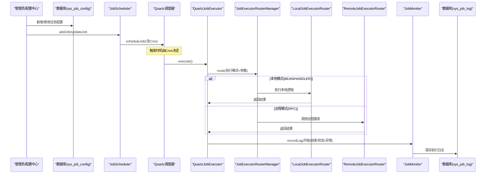
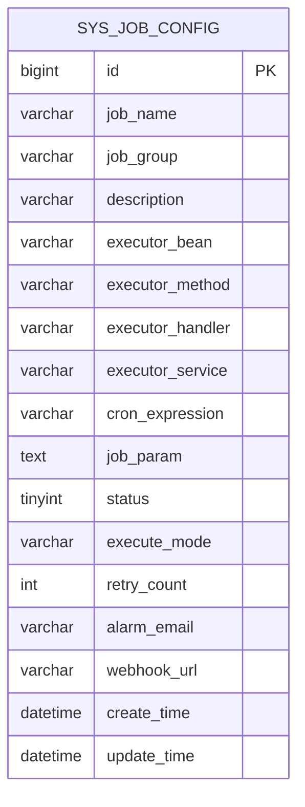
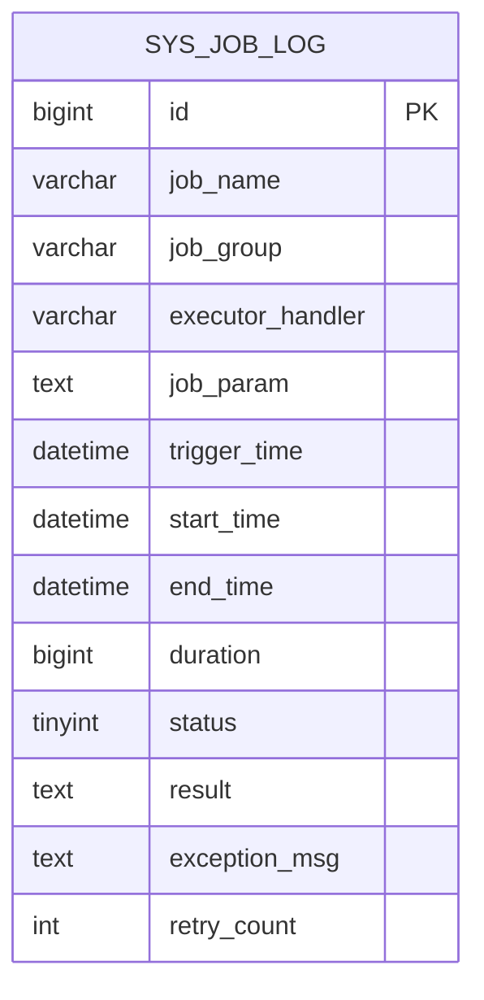
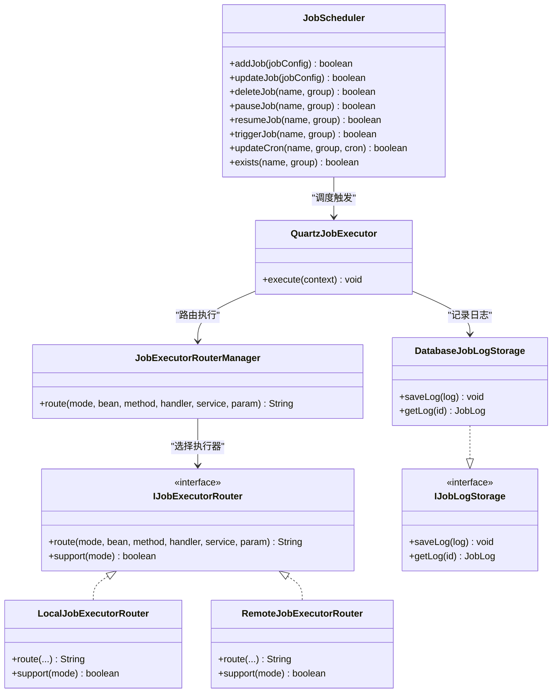
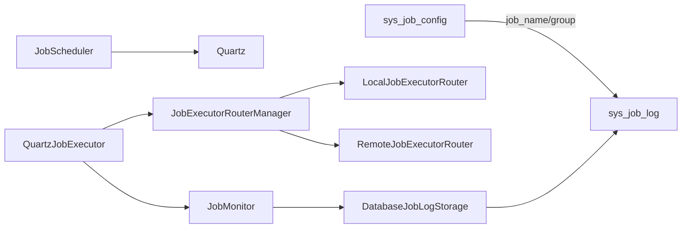
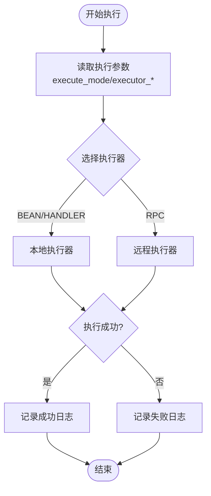

# 定时任务表结构

<cite>
**本文档引用的文件**
- [job_tables.sql](file://forge/forge-framework/forge-starter-parent/forge-starter-job/sql/job_tables.sql)
- [SysJobConfig.java](file://forge/forge-framework/forge-plugin-parent/forge-plugin-job/src/main/java/com/mdframe/forge/plugin/job/entity/SysJobConfig.java)
- [JobConfig.java](file://forge/forge-framework/forge-plugin-parent/forge-plugin-job/src/main/java/com/mdframe/forge/plugin/job/model/JobConfig.java)
- [SysJobLog.java](file://forge/forge-framework/forge-plugin-parent/forge-plugin-job/src/main/java/com/mdframe/forge/plugin/job/entity/SysJobLog.java)
- [JobLog.java](file://forge/forge-framework/forge-plugin-parent/forge-plugin-job/src/main/java/com/mdframe/forge/plugin/job/model/JobLog.java)
- [JobScheduler.java](file://forge/forge-framework/forge-plugin-parent/forge-plugin-job/src/main/java/com/mdframe/forge/plugin/job/scheduler/JobScheduler.java)
- [QuartzJobExecutor.java](file://forge/forge-framework/forge-plugin-parent/forge-plugin-job/src/main/java/com/mdframe/forge/plugin/job/scheduler/QuartzJobExecutor.java)
- [JobExecutorRouterManager.java](file://forge/forge-framework/forge-plugin-parent/forge-plugin-job/src/main/java/com/mdframe/forge/plugin/job/executor/JobExecutorRouterManager.java)
- [LocalJobExecutorRouter.java](file://forge/forge-framework/forge-plugin-parent/forge-plugin-job/src/main/java/com/mdframe/forge/plugin/job/executor/impl/LocalJobExecutorRouter.java)
- [RemoteJobExecutorRouter.java](file://forge/forge-framework/forge-plugin-parent/forge-plugin-job/src/main/java/com/mdframe/forge/plugin/job/executor/impl/RemoteJobExecutorRouter.java)
- [DatabaseJobLogStorage.java](file://forge/forge-framework/forge-plugin-parent/forge-plugin-job/src/main/java/com/mdframe/forge/plugin/job/service/impl/DatabaseJobLogStorage.java)
- [IJobLogStorage.java](file://forge/forge-framework/forge-plugin-parent/forge-plugin-job/src/main/java/com/mdframe/forge/plugin/job/spi/IJobLogStorage.java)
- [JobMonitor.java](file://forge/forge-framework/forge-plugin-parent/forge-plugin-job/src/main/java/com/mdframe/forge/plugin/job/monitor/JobMonitor.java)
- [JobHandler.java](file://forge/forge-framework/forge-starter-parent/forge-starter-job/src/main/java/com/mdframe/forge/starter/job/annotation/JobHandler.java)
- [ScheduledJob.java](file://forge/forge-framework/forge-starter-parent/forge-starter-job/src/main/java/com/mdframe/forge/starter/job/annotation/ScheduledJob.java)
</cite>

## 目录
1. [简介](#简介)
2. [项目结构](#项目结构)
3. [核心组件](#核心组件)
4. [架构总览](#架构总览)
5. [详细组件分析](#详细组件分析)
6. [依赖关系分析](#依赖关系分析)
7. [性能考虑](#性能考虑)
8. [故障排查指南](#故障排查指南)
9. [结论](#结论)
10. [附录](#附录)

## 简介
本文件面向分布式定时任务系统的开发者与运维人员，系统性梳理定时任务模块的数据库表结构设计与调度流程。重点覆盖三类数据表：
- 任务配置表：存储任务定义、执行规则与参数配置
- 任务执行日志表：记录每次任务执行的状态、耗时、结果与异常
- 任务历史表：用于统计与监控的历史聚合（如需）

同时，文档提供任务调度流程图、表关系图与配置示例，帮助快速理解数据模型与监控机制。

## 项目结构
定时任务模块位于后端工程的插件化子模块中，数据库脚本与业务实现分离：
- SQL脚本：定义任务配置表与日志表结构
- Java实体与模型：映射数据库表结构，封装任务配置与日志模型
- 调度器与执行器：基于Quartz的调度与多模式执行路由
- 日志存储SPI：支持数据库持久化与扩展存储（如ES/MongoDB）

```mermaid
graph TB
subgraph "数据库层"
CFG["sys_job_config<br/>任务配置表"]
LOG["sys_job_log<br/>任务执行日志表"]
end
subgraph "调度与执行"
SCHED["JobScheduler<br/>调度管理器"]
EXEC["QuartzJobExecutor<br/>执行入口"]
ROUTER["JobExecutorRouterManager<br/>执行器路由管理"]
LOCAL["LocalJobExecutorRouter<br/>本地执行器"]
REMOTE["RemoteJobExecutorRouter<br/>远程执行器"]
end
subgraph "日志与监控"
MONITOR["JobMonitor<br/>监控与告警"]
STORAGE["DatabaseJobLogStorage<br/>数据库日志存储"]
end
CFG <- --> SCHED
SCHED --> EXEC
EXEC --> ROUTER
ROUTER --> LOCAL
ROUTER --> REMOTE
EXEC --> MONITOR
MONITOR --> STORAGE
LOG -.-> MONITOR
```

图表来源
- [job_tables.sql](file://forge/forge-framework/forge-starter-parent/forge-starter-job/sql/job_tables.sql#L1-L48)
- [JobScheduler.java](file://forge/forge-framework/forge-plugin-parent/forge-plugin-job/src/main/java/com/mdframe/forge/plugin/job/scheduler/JobScheduler.java#L1-L220)
- [QuartzJobExecutor.java](file://forge/forge-framework/forge-plugin-parent/forge-plugin-job/src/main/java/com/mdframe/forge/plugin/job/scheduler/QuartzJobExecutor.java#L1-L61)
- [JobExecutorRouterManager.java](file://forge/forge-framework/forge-plugin-parent/forge-plugin-job/src/main/java/com/mdframe/forge/plugin/job/executor/JobExecutorRouterManager.java#L1-L41)
- [LocalJobExecutorRouter.java](file://forge/forge-framework/forge-plugin-parent/forge-plugin-job/src/main/java/com/mdframe/forge/plugin/job/executor/impl/LocalJobExecutorRouter.java#L1-L49)
- [RemoteJobExecutorRouter.java](file://forge/forge-framework/forge-plugin-parent/forge-plugin-job/src/main/java/com/mdframe/forge/plugin/job/executor/impl/RemoteJobExecutorRouter.java#L16-L56)
- [DatabaseJobLogStorage.java](file://forge/forge-framework/forge-plugin-parent/forge-plugin-job/src/main/java/com/mdframe/forge/plugin/job/service/impl/DatabaseJobLogStorage.java#L1-L40)

章节来源
- [job_tables.sql](file://forge/forge-framework/forge-starter-parent/forge-starter-job/sql/job_tables.sql#L1-L48)

## 核心组件
- 任务配置表（sys_job_config）：存储任务元数据、执行规则与参数
- 任务执行日志表（sys_job_log）：记录每次任务执行的生命周期与结果
- 调度管理器（JobScheduler）：封装Quartz任务的增删改查与热更新
- 执行入口（QuartzJobExecutor）：统一触发执行，路由到本地或远程执行器
- 执行器路由管理（JobExecutorRouterManager）：按执行模式选择本地/远程执行器
- 日志存储SPI（IJobLogStorage）：抽象日志持久化，当前默认数据库实现
- 监控与告警（JobMonitor）：计算耗时、记录日志、触发告警

章节来源
- [SysJobConfig.java](file://forge/forge-framework/forge-plugin-parent/forge-plugin-job/src/main/java/com/mdframe/forge/plugin/job/entity/SysJobConfig.java#L1-L97)
- [JobConfig.java](file://forge/forge-framework/forge-plugin-parent/forge-plugin-job/src/main/java/com/mdframe/forge/plugin/job/model/JobConfig.java#L1-L98)
- [SysJobLog.java](file://forge/forge-framework/forge-plugin-parent/forge-plugin-job/src/main/java/com/mdframe/forge/plugin/job/entity/SysJobLog.java)
- [JobLog.java](file://forge/forge-framework/forge-plugin-parent/forge-plugin-job/src/main/java/com/mdframe/forge/plugin/job/model/JobLog.java)
- [JobScheduler.java](file://forge/forge-framework/forge-plugin-parent/forge-plugin-job/src/main/java/com/mdframe/forge/plugin/job/scheduler/JobScheduler.java#L1-L220)
- [QuartzJobExecutor.java](file://forge/forge-framework/forge-plugin-parent/forge-plugin-job/src/main/java/com/mdframe/forge/plugin/job/scheduler/QuartzJobExecutor.java#L1-L61)
- [JobExecutorRouterManager.java](file://forge/forge-framework/forge-plugin-parent/forge-plugin-job/src/main/java/com/mdframe/forge/plugin/job/executor/JobExecutorRouterManager.java#L1-L41)
- [DatabaseJobLogStorage.java](file://forge/forge-framework/forge-plugin-parent/forge-plugin-job/src/main/java/com/mdframe/forge/plugin/job/service/impl/DatabaseJobLogStorage.java#L1-L40)
- [IJobLogStorage.java](file://forge/forge-framework/forge-plugin-parent/forge-plugin-job/src/main/java/com/mdframe/forge/plugin/job/spi/IJobLogStorage.java#L1-L20)
- [JobMonitor.java](file://forge/forge-framework/forge-plugin-parent/forge-plugin-job/src/main/java/com/mdframe/forge/plugin/job/monitor/JobMonitor.java)

## 架构总览
下图展示定时任务从配置到执行再到日志落库的完整链路：



图表来源
- [JobScheduler.java](file://forge/forge-framework/forge-plugin-parent/forge-plugin-job/src/main/java/com/mdframe/forge/plugin/job/scheduler/JobScheduler.java#L23-L65)
- [QuartzJobExecutor.java](file://forge/forge-framework/forge-plugin-parent/forge-plugin-job/src/main/java/com/mdframe/forge/plugin/job/scheduler/QuartzJobExecutor.java#L21-L59)
- [JobExecutorRouterManager.java](file://forge/forge-framework/forge-plugin-parent/forge-plugin-job/src/main/java/com/mdframe/forge/plugin/job/executor/JobExecutorRouterManager.java#L24-L40)
- [LocalJobExecutorRouter.java](file://forge/forge-framework/forge-plugin-parent/forge-plugin-job/src/main/java/com/mdframe/forge/plugin/job/executor/impl/LocalJobExecutorRouter.java#L19-L39)
- [RemoteJobExecutorRouter.java](file://forge/forge-framework/forge-plugin-parent/forge-plugin-job/src/main/java/com/mdframe/forge/plugin/job/executor/impl/RemoteJobExecutorRouter.java#L29-L45)
- [DatabaseJobLogStorage.java](file://forge/forge-framework/forge-plugin-parent/forge-plugin-job/src/main/java/com/mdframe/forge/plugin/job/service/impl/DatabaseJobLogStorage.java#L23-L28)

## 详细组件分析

### 任务配置表（sys_job_config）
- 设计目标：集中存储任务定义、执行规则与参数，支撑调度器动态加载与热更新
- 关键字段说明
  - 主键与唯一索引：id（自增），联合唯一索引(job_name, job_group)
  - 任务标识：job_name、job_group
  - 描述与元信息：description、create_time、update_time
  - 执行器配置：executor_bean、executor_method、executor_handler、executor_service
  - 执行规则：cron_expression
  - 参数与策略：job_param、execute_mode、retry_count
  - 状态与通知：status、alarm_email、webhook_url
- 执行模式
  - BEAN：通过Spring容器获取Bean并调用指定方法
  - HANDLER：通过Handler名称路由到处理器
  - RPC：通过远程服务名调用远端服务
- 状态管理
  - status=1表示运行中，status=0表示暂停；调度器会根据状态决定是否暂停Job



图表来源
- [job_tables.sql](file://forge/forge-framework/forge-starter-parent/forge-starter-job/sql/job_tables.sql#L2-L22)
- [SysJobConfig.java](file://forge/forge-framework/forge-plugin-parent/forge-plugin-job/src/main/java/com/mdframe/forge/plugin/job/entity/SysJobConfig.java#L14-L96)
- [JobConfig.java](file://forge/forge-framework/forge-plugin-parent/forge-plugin-job/src/main/java/com/mdframe/forge/plugin/job/model/JobConfig.java#L11-L97)

章节来源
- [job_tables.sql](file://forge/forge-framework/forge-starter-parent/forge-starter-job/sql/job_tables.sql#L1-L22)
- [SysJobConfig.java](file://forge/forge-framework/forge-plugin-parent/forge-plugin-job/src/main/java/com/mdframe/forge/plugin/job/entity/SysJobConfig.java#L1-L97)
- [JobConfig.java](file://forge/forge-framework/forge-plugin-parent/forge-plugin-job/src/main/java/com/mdframe/forge/plugin/job/model/JobConfig.java#L1-L98)

### 任务执行日志表（sys_job_log）
- 设计目标：记录每次任务执行的全生命周期，便于审计、排障与性能分析
- 关键字段说明
  - 任务标识：job_name、job_group、executor_handler
  - 参数与时间：job_param、trigger_time、start_time、end_time、duration(ms)
  - 结果与异常：status（1成功/0失败）、result、exception_msg
  - 重试次数：retry_count
  - 索引优化：对job_name、trigger_time、status建立索引，支持高频查询
- 性能与容量
  - 建议结合业务进行归档或分区策略，避免日志表无限增长



图表来源
- [job_tables.sql](file://forge/forge-framework/forge-starter-parent/forge-starter-job/sql/job_tables.sql#L25-L43)
- [SysJobLog.java](file://forge/forge-framework/forge-plugin-parent/forge-plugin-job/src/main/java/com/mdframe/forge/plugin/job/entity/SysJobLog.java)
- [JobLog.java](file://forge/forge-framework/forge-plugin-parent/forge-plugin-job/src/main/java/com/mdframe/forge/plugin/job/model/JobLog.java)

章节来源
- [job_tables.sql](file://forge/forge-framework/forge-starter-parent/forge-starter-job/sql/job_tables.sql#L24-L43)
- [SysJobLog.java](file://forge/forge-framework/forge-plugin-parent/forge-plugin-job/src/main/java/com/mdframe/forge/plugin/job/entity/SysJobLog.java)
- [JobLog.java](file://forge/forge-framework/forge-plugin-parent/forge-plugin-job/src/main/java/com/mdframe/forge/plugin/job/model/JobLog.java)

### 任务历史表（可选）
- 设计建议：若需做长期统计与报表，可引入任务历史表（如sys_job_history），用于聚合统计与趋势分析
- 典型字段：job_name、job_group、统计周期、成功/失败次数、平均耗时、最大/最小耗时、首次执行时间、最近执行时间
- 生成策略：可通过定时任务定期汇总sys_job_log中的数据，写入历史表

[本节为概念性内容，不直接对应具体源码文件]

### 调度与执行链路
- 调度器（JobScheduler）
  - 提供任务的新增、更新、删除、暂停、恢复、立即触发、Cron热更新等能力
  - 通过Quartz的JobDetail与Trigger绑定Cron表达式，支持错失触发处理策略
- 执行入口（QuartzJobExecutor）
  - 从JobDataMap读取执行参数，调用路由管理器执行任务
  - 在finally中统一记录执行日志，包含开始/结束时间、耗时、状态与异常
- 执行器路由（JobExecutorRouterManager）
  - 维护多种执行器路由器，按执行模式选择本地或远程执行
  - 支持BEAN/HANDLER本地模式与RPC远程模式
- 日志存储（DatabaseJobLogStorage）
  - 实现IJobLogStorage接口，默认将日志持久化到sys_job_log
  - 可扩展为ES/MongoDB等其他存储介质



图表来源
- [JobScheduler.java](file://forge/forge-framework/forge-plugin-parent/forge-plugin-job/src/main/java/com/mdframe/forge/plugin/job/scheduler/JobScheduler.java#L1-L220)
- [QuartzJobExecutor.java](file://forge/forge-framework/forge-plugin-parent/forge-plugin-job/src/main/java/com/mdframe/forge/plugin/job/scheduler/QuartzJobExecutor.java#L1-L61)
- [JobExecutorRouterManager.java](file://forge/forge-framework/forge-plugin-parent/forge-plugin-job/src/main/java/com/mdframe/forge/plugin/job/executor/JobExecutorRouterManager.java#L1-L41)
- [LocalJobExecutorRouter.java](file://forge/forge-framework/forge-plugin-parent/forge-plugin-job/src/main/java/com/mdframe/forge/plugin/job/executor/impl/LocalJobExecutorRouter.java#L1-L49)
- [RemoteJobExecutorRouter.java](file://forge/forge-framework/forge-plugin-parent/forge-plugin-job/src/main/java/com/mdframe/forge/plugin/job/executor/impl/RemoteJobExecutorRouter.java#L16-L56)
- [DatabaseJobLogStorage.java](file://forge/forge-framework/forge-plugin-parent/forge-plugin-job/src/main/java/com/mdframe/forge/plugin/job/service/impl/DatabaseJobLogStorage.java#L1-L40)
- [IJobLogStorage.java](file://forge/forge-framework/forge-plugin-parent/forge-plugin-job/src/main/java/com/mdframe/forge/plugin/job/spi/IJobLogStorage.java#L1-L20)

章节来源
- [JobScheduler.java](file://forge/forge-framework/forge-plugin-parent/forge-plugin-job/src/main/java/com/mdframe/forge/plugin/job/scheduler/JobScheduler.java#L1-L220)
- [QuartzJobExecutor.java](file://forge/forge-framework/forge-plugin-parent/forge-plugin-job/src/main/java/com/mdframe/forge/plugin/job/scheduler/QuartzJobExecutor.java#L1-L61)
- [JobExecutorRouterManager.java](file://forge/forge-framework/forge-plugin-parent/forge-plugin-job/src/main/java/com/mdframe/forge/plugin/job/executor/JobExecutorRouterManager.java#L1-L41)
- [LocalJobExecutorRouter.java](file://forge/forge-framework/forge-plugin-parent/forge-plugin-job/src/main/java/com/mdframe/forge/plugin/job/executor/impl/LocalJobExecutorRouter.java#L1-L49)
- [RemoteJobExecutorRouter.java](file://forge/forge-framework/forge-plugin-parent/forge-plugin-job/src/main/java/com/mdframe/forge/plugin/job/executor/impl/RemoteJobExecutorRouter.java#L16-L56)
- [DatabaseJobLogStorage.java](file://forge/forge-framework/forge-plugin-parent/forge-plugin-job/src/main/java/com/mdframe/forge/plugin/job/service/impl/DatabaseJobLogStorage.java#L1-L40)
- [IJobLogStorage.java](file://forge/forge-framework/forge-plugin-parent/forge-plugin-job/src/main/java/com/mdframe/forge/plugin/job/spi/IJobLogStorage.java#L1-L20)

### 配置示例与最佳实践
- 本地Bean模式（单体）
  - execute_mode: BEAN
  - executor_bean: 目标Bean名称
  - executor_method: 目标方法名
  - job_param: JSON字符串参数（如需）
- Handler模式（单体）
  - execute_mode: HANDLER
  - executor_handler: 处理器名称
  - job_param: JSON字符串参数
- RPC模式（分布式）
  - execute_mode: RPC
  - executor_service: 远程服务名
  - executor_handler: 远程处理器名称
  - job_param: JSON字符串参数
- Cron表达式
  - 建议使用标准Cron表达式，配合Quartz的错失触发处理策略
- 状态与重试
  - status=1运行，status=0暂停
  - retry_count用于失败重试次数限制
- 告警与通知
  - alarm_email与webhook_url用于异常告警

章节来源
- [job_tables.sql](file://forge/forge-framework/forge-starter-parent/forge-starter-job/sql/job_tables.sql#L1-L48)
- [JobConfig.java](file://forge/forge-framework/forge-plugin-parent/forge-plugin-job/src/main/java/com/mdframe/forge/plugin/job/model/JobConfig.java#L1-L98)
- [SysJobConfig.java](file://forge/forge-framework/forge-plugin-parent/forge-plugin-job/src/main/java/com/mdframe/forge/plugin/job/entity/SysJobConfig.java#L1-L97)

## 依赖关系分析
- 表间关系
  - sys_job_config与sys_job_log无外键约束，通过job_name/job_group关联
  - 建议在应用层保证一致性，避免悬挂数据
- 组件耦合
  - JobScheduler依赖Quartz与JobConfig模型
  - QuartzJobExecutor依赖路由管理器与监控器
  - 日志存储通过SPI解耦，便于扩展
- 外部依赖
  - Quartz用于调度
  - MyBatis-Plus用于SysJobConfig实体映射
  - Spring容器用于Bean注入与条件装配



图表来源
- [job_tables.sql](file://forge/forge-framework/forge-starter-parent/forge-starter-job/sql/job_tables.sql#L1-L48)
- [JobScheduler.java](file://forge/forge-framework/forge-plugin-parent/forge-plugin-job/src/main/java/com/mdframe/forge/plugin/job/scheduler/JobScheduler.java#L1-L220)
- [QuartzJobExecutor.java](file://forge/forge-framework/forge-plugin-parent/forge-plugin-job/src/main/java/com/mdframe/forge/plugin/job/scheduler/QuartzJobExecutor.java#L1-L61)
- [JobExecutorRouterManager.java](file://forge/forge-framework/forge-plugin-parent/forge-plugin-job/src/main/java/com/mdframe/forge/plugin/job/executor/JobExecutorRouterManager.java#L1-L41)
- [LocalJobExecutorRouter.java](file://forge/forge-framework/forge-plugin-parent/forge-plugin-job/src/main/java/com/mdframe/forge/plugin/job/executor/impl/LocalJobExecutorRouter.java#L1-L49)
- [RemoteJobExecutorRouter.java](file://forge/forge-framework/forge-plugin-parent/forge-plugin-job/src/main/java/com/mdframe/forge/plugin/job/executor/impl/RemoteJobExecutorRouter.java#L16-L56)
- [DatabaseJobLogStorage.java](file://forge/forge-framework/forge-plugin-parent/forge-plugin-job/src/main/java/com/mdframe/forge/plugin/job/service/impl/DatabaseJobLogStorage.java#L1-L40)

章节来源
- [job_tables.sql](file://forge/forge-framework/forge-starter-parent/forge-starter-job/sql/job_tables.sql#L1-L48)
- [JobScheduler.java](file://forge/forge-framework/forge-plugin-parent/forge-plugin-job/src/main/java/com/mdframe/forge/plugin/job/scheduler/JobScheduler.java#L1-L220)
- [QuartzJobExecutor.java](file://forge/forge-framework/forge-plugin-parent/forge-plugin-job/src/main/java/com/mdframe/forge/plugin/job/scheduler/QuartzJobExecutor.java#L1-L61)
- [JobExecutorRouterManager.java](file://forge/forge-framework/forge-plugin-parent/forge-plugin-job/src/main/java/com/mdframe/forge/plugin/job/executor/JobExecutorRouterManager.java#L1-L41)
- [LocalJobExecutorRouter.java](file://forge/forge-framework/forge-plugin-parent/forge-plugin-job/src/main/java/com/mdframe/forge/plugin/job/executor/impl/LocalJobExecutorRouter.java#L1-L49)
- [RemoteJobExecutorRouter.java](file://forge/forge-framework/forge-plugin-parent/forge-plugin-job/src/main/java/com/mdframe/forge/plugin/job/executor/impl/RemoteJobExecutorRouter.java#L16-L56)
- [DatabaseJobLogStorage.java](file://forge/forge-framework/forge-plugin-parent/forge-plugin-job/src/main/java/com/mdframe/forge/plugin/job/service/impl/DatabaseJobLogStorage.java#L1-L40)

## 性能考虑
- 索引优化
  - sys_job_log对job_name、trigger_time、status建立索引，提升查询效率
- 日志容量治理
  - 建议按月/季度归档或清理历史日志，避免表膨胀
- 执行模式选择
  - 本地模式延迟低，适合轻量任务；RPC模式适合跨服务场景
- Cron表达式
  - 合理设置触发频率，避免高并发抖动
- 监控与告警
  - 结合日志表的异常字段与耗时字段，建立阈值告警

[本节提供通用指导，不直接分析具体文件]

## 故障排查指南
- 常见问题定位
  - 任务未触发：检查sys_job_config.status与Cron表达式；确认JobScheduler是否正确addJob
  - 执行异常：查看sys_job_log.exception_msg与QuartzJobExecutor日志
  - 执行超时：关注sys_job_log.duration与执行器路由耗时
  - 分布式执行失败：核对executor_service与executor_handler配置
- 排查步骤
  - 核对任务配置：job_name、job_group、execute_mode、executor_*、cron_expression
  - 查看调度状态：JobScheduler.exists与pause/resume状态
  - 检查日志：sys_job_log中status=0的记录与异常详情
  - 验证路由：确认JobExecutorRouterManager选择了正确的执行器

章节来源
- [job_tables.sql](file://forge/forge-framework/forge-starter-parent/forge-starter-job/sql/job_tables.sql#L1-L48)
- [SysJobLog.java](file://forge/forge-framework/forge-plugin-parent/forge-plugin-job/src/main/java/com/mdframe/forge/plugin/job/entity/SysJobLog.java)
- [JobLog.java](file://forge/forge-framework/forge-plugin-parent/forge-plugin-job/src/main/java/com/mdframe/forge/plugin/job/model/JobLog.java)
- [QuartzJobExecutor.java](file://forge/forge-framework/forge-plugin-parent/forge-plugin-job/src/main/java/com/mdframe/forge/plugin/job/scheduler/QuartzJobExecutor.java#L1-L61)
- [JobExecutorRouterManager.java](file://forge/forge-framework/forge-plugin-parent/forge-plugin-job/src/main/java/com/mdframe/forge/plugin/job/executor/JobExecutorRouterManager.java#L1-L41)

## 结论
本文档系统化梳理了定时任务模块的数据库表结构与调度执行链路，明确了任务配置、执行日志与可选历史表的设计要点，并提供了流程图与类图帮助理解。通过合理的索引、容量治理与监控告警，可有效支撑生产环境的稳定运行。

[本节为总结性内容，不直接分析具体文件]

## 附录
- 注解支持
  - JobHandler：标记定时任务处理器，自动注册到任务注册中心
  - ScheduledJob：Spring Bean直连模式的定时任务注解，自动注册到Quartz调度器
- 关键流程图（算法实现）
  - 任务执行流程（QuartzJobExecutor.execute）
  - 执行器路由选择（JobExecutorRouterManager.route）
  - 日志记录与持久化（DatabaseJobLogStorage.saveLog）



图表来源
- [QuartzJobExecutor.java](file://forge/forge-framework/forge-plugin-parent/forge-plugin-job/src/main/java/com/mdframe/forge/plugin/job/scheduler/QuartzJobExecutor.java#L21-L59)
- [JobExecutorRouterManager.java](file://forge/forge-framework/forge-plugin-parent/forge-plugin-job/src/main/java/com/mdframe/forge/plugin/job/executor/JobExecutorRouterManager.java#L24-L40)
- [LocalJobExecutorRouter.java](file://forge/forge-framework/forge-plugin-parent/forge-plugin-job/src/main/java/com/mdframe/forge/plugin/job/executor/impl/LocalJobExecutorRouter.java#L19-L39)
- [RemoteJobExecutorRouter.java](file://forge/forge-framework/forge-plugin-parent/forge-plugin-job/src/main/java/com/mdframe/forge/plugin/job/executor/impl/RemoteJobExecutorRouter.java#L29-L45)
- [DatabaseJobLogStorage.java](file://forge/forge-framework/forge-plugin-parent/forge-plugin-job/src/main/java/com/mdframe/forge/plugin/job/service/impl/DatabaseJobLogStorage.java#L23-L28)

章节来源
- [JobHandler.java](file://forge/forge-framework/forge-starter-parent/forge-starter-job/src/main/java/com/mdframe/forge/starter/job/annotation/JobHandler.java#L1-L29)
- [ScheduledJob.java](file://forge/forge-framework/forge-starter-parent/forge-starter-job/src/main/java/com/mdframe/forge/starter/job/annotation/ScheduledJob.java#L1-L39)
- [QuartzJobExecutor.java](file://forge/forge-framework/forge-plugin-parent/forge-plugin-job/src/main/java/com/mdframe/forge/plugin/job/scheduler/QuartzJobExecutor.java#L1-L61)
- [JobExecutorRouterManager.java](file://forge/forge-framework/forge-plugin-parent/forge-plugin-job/src/main/java/com/mdframe/forge/plugin/job/executor/JobExecutorRouterManager.java#L1-L41)
- [DatabaseJobLogStorage.java](file://forge/forge-framework/forge-plugin-parent/forge-plugin-job/src/main/java/com/mdframe/forge/plugin/job/service/impl/DatabaseJobLogStorage.java#L1-L40)