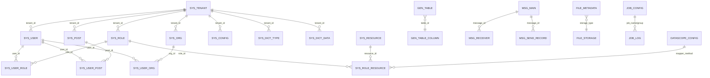
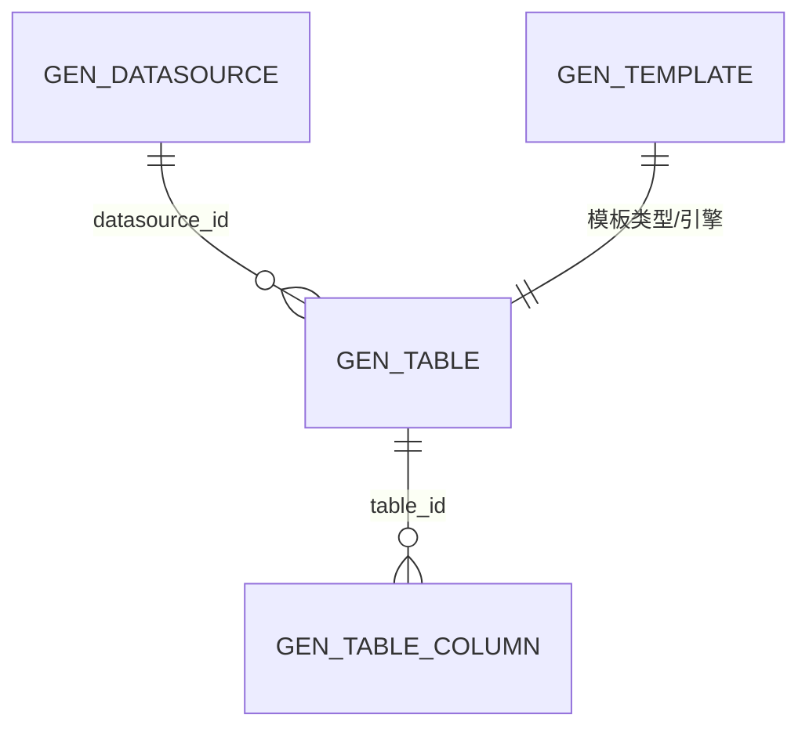
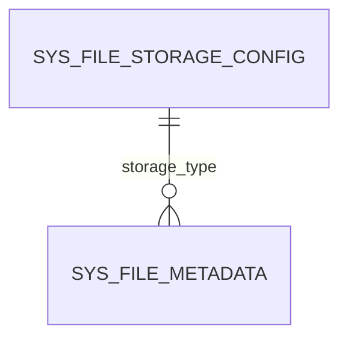
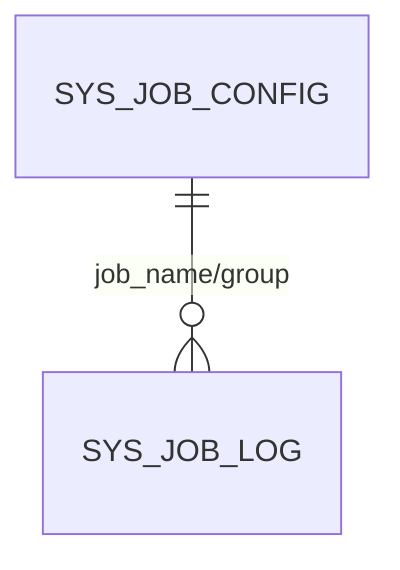
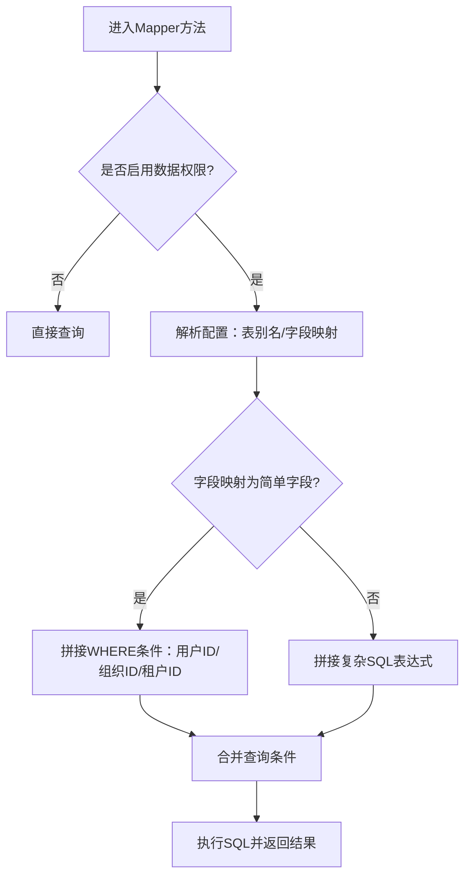
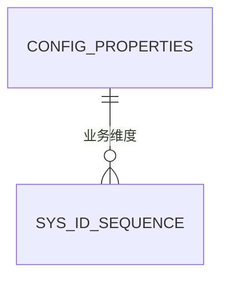
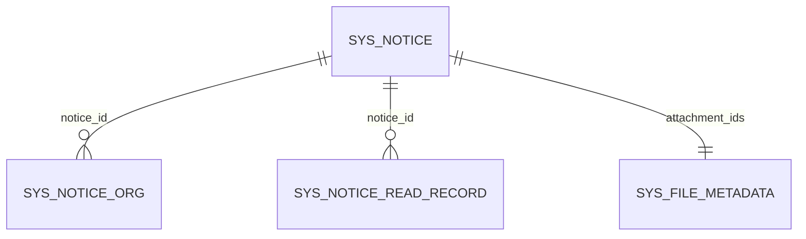
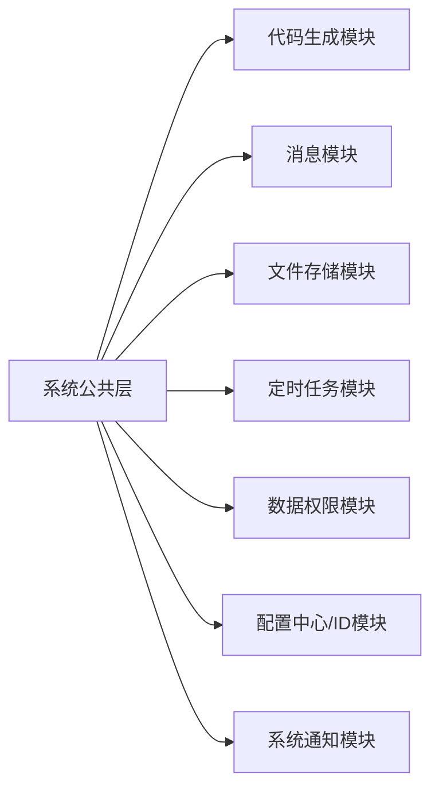

# 数据库设计

<cite>
**本文引用的文件**   
- [application.yml](file://forge/forge-admin/src/main/resources/application.yml)
- [application-dev.yml](file://forge/forge-admin/src/main/resources/application-dev.yml)
- [sys.sql](file://forge/forge-admin/sql/sys.sql)
- [gen_datasource.sql](file://forge/forge-admin/sql/gen_datasource.sql)
- [generator_tables.sql](file://forge/forge-framework/forge-plugin-parent/forge-plugin-generator/src/main/resources/sql/generator_tables.sql)
- [message_tables.sql](file://forge/forge-framework/forge-plugin-parent/forge-plugin-message/src/main/resources/sql/message_tables.sql)
- [file_storage.sql](file://forge/forge-framework/forge-starter-parent/forge-starter-file/sql/file_storage.sql)
- [job_tables.sql](file://forge/forge-framework/forge-starter-parent/forge-starter-job/sql/job_tables.sql)
- [datascope_tables.sql](file://forge/forge-framework/forge-starter-parent/forge-starter-datascope/sql/datascope_tables.sql)
- [config_properties.sql](file://forge/forge-framework/forge-starter-parent/forge-starter-config/sql/config_properties.sql)
- [id_tables.sql](file://forge/forge-framework/forge-starter-parent/forge-starter-id/sql/id_tables.sql)
- [init_data.sql](file://forge/forge-framework/forge-starter-parent/forge-starter-id/sql/init_data.sql)
- [sys_notice.sql](file://forge/forge-framework/forge-plugin-parent/forge-plugin-system/src/main/resources/sql/sys_notice.sql)
- [sys_notice_dict.sql](file://forge/forge-framework/forge-plugin-parent/forge-plugin-system/src/main/resources/sql/sys_notice_dict.sql)
- [sys_notice_extend.sql](file://forge/forge-framework/forge-plugin-parent/forge-plugin-system/src/main/resources/sql/sys_notice_extend.sql)
</cite>

## 目录
1. 引言
2. 项目结构
3. 核心组件
4. 架构总览
5. 详细组件分析
6. 依赖分析
7. 性能考量
8. 故障排查指南
9. 结论
10. 附录

## 引言
本文件面向Forge框架的数据库设计与实现，聚焦于核心业务表结构、字段定义、索引与约束关系，并覆盖用户管理、角色权限、代码生成、文件存储、定时任务、数据权限、配置中心、分布式ID、系统通知等模块。文档同时提供ER图、表关系图与数据字典，帮助开发者快速理解数据模型的设计思路与业务含义；并给出数据库迁移策略、版本管理、性能优化建议以及数据安全、备份恢复与扩展性考虑的最佳实践。

## 项目结构
Forge框架采用“核心模块 + 插件模块”的分层架构，数据库层面以“系统公共表 + 各插件/模块独立表”组织，配合统一的租户隔离字段与多租户索引策略，支撑多租户场景下的数据隔离与查询性能。

```mermaid
graph TB
subgraph "系统公共层"
SYS_TENANT["sys_tenant<br/>租户表"]
SYS_USER["sys_user<br/>用户表"]
SYS_ORG["sys_org<br/>组织表"]
SYS_POST["sys_post<br/>岗位表"]
SYS_ROLE["sys_role<br/>角色表"]
SYS_RESOURCE["sys_resource<br/>系统资源表"]
SYS_USER_ROLE["sys_user_role<br/>用户-角色关联"]
SYS_USER_POST["sys_user_post<br/>用户-岗位关联"]
SYS_USER_ORG["sys_user_org<br/>用户-组织关联"]
SYS_ROLE_RESOURCE["sys_role_resource<br/>角色-资源关联"]
SYS_CONFIG["sys_config<br/>系统配置"]
SYS_DICT_TYPE["sys_dict_type<br/>字典类型"]
SYS_DICT_DATA["sys_dict_data<br/>字典数据"]
SYS_OPERATION_LOG["sys_operation_log<br/>操作日志"]
SYS_LOGIN_LOG["sys_login_log<br/>登录日志"]
end
subgraph "插件/模块层"
GEN_DATASOURCE["gen_datasource<br/>代码生成数据源"]
GEN_TABLE["gen_table<br/>代码生成表配置"]
GEN_TABLE_COLUMN["gen_table_column<br/>代码生成字段配置"]
GEN_TEMPLATE["gen_template<br/>代码生成模板配置"]
MSG_MAIN["sys_message<br/>消息主表"]
MSG_RECEIVER["sys_message_receiver<br/>消息接收人"]
MSG_SEND_RECORD["sys_message_send_record<br/>消息发送记录"]
MSG_TEMPLATE["sys_message_template<br/>消息模板"]
FILE_STORAGE["sys_file_storage_config<br/>文件存储配置"]
FILE_METADATA["sys_file_metadata<br/>文件元数据"]
JOB_CONFIG["sys_job_config<br/>任务配置"]
JOB_LOG["sys_job_log<br/>任务执行日志"]
DATASCOPE_CONFIG["sys_data_scope_config<br/>数据权限配置"]
ROLE_DATASCOPE["sys_role_data_scope<br/>角色-自定义数据权限"]
CONFIG_PROPS["config_properties<br/>配置属性"]
ID_SEQUENCE["sys_id_sequence<br/>分布式ID序列"]
end
SYS_USER --> SYS_USER_ROLE
SYS_ROLE --> SYS_ROLE_RESOURCE
SYS_USER --> SYS_USER_POST
SYS_USER --> SYS_USER_ORG
SYS_USER_ROLE --> SYS_ROLE
SYS_USER_POST --> SYS_POST
SYS_USER_ORG --> SYS_ORG
SYS_ROLE_RESOURCE --> SYS_RESOURCE
GEN_TABLE --> GEN_TABLE_COLUMN
MSG_MAIN --> MSG_RECEIVER
MSG_MAIN --> MSG_SEND_RECORD
MSG_MAIN --> MSG_TEMPLATE
FILE_METADATA --> FILE_STORAGE
JOB_CONFIG --> JOB_LOG
DATASCOPE_CONFIG --> SYS_RESOURCE
ROLE_DATASCOPE --> SYS_ROLE
```



图表来源
- [sys.sql](file://forge/forge-admin/sql/sys.sql#L11-L333)
- [generator_tables.sql](file://forge/forge-framework/forge-plugin-parent/forge-plugin-generator/src/main/resources/sql/generator_tables.sql#L3-L103)
- [message_tables.sql](file://forge/forge-framework/forge-plugin-parent/forge-plugin-message/src/main/resources/sql/message_tables.sql#L3-L90)
- [file_storage.sql](file://forge/forge-framework/forge-starter-parent/forge-starter-file/sql/file_storage.sql#L4-L75)
- [job_tables.sql](file://forge/forge-framework/forge-starter-parent/forge-starter-job/sql/job_tables.sql#L1-L48)
- [datascope_tables.sql](file://forge/forge-framework/forge-starter-parent/forge-starter-datascope/sql/datascope_tables.sql#L1-L100)
- [config_properties.sql](file://forge/forge-framework/forge-starter-parent/forge-starter-config/sql/config_properties.sql#L1-L31)
- [id_tables.sql](file://forge/forge-framework/forge-starter-parent/forge-starter-id/sql/id_tables.sql#L1-L12)

章节来源
- [sys.sql](file://forge/forge-admin/sql/sys.sql#L1-L333)
- [application.yml](file://forge/forge-admin/src/main/resources/application.yml#L65-L100)
- [application-dev.yml](file://forge/forge-admin/src/main/resources/application-dev.yml#L1-L70)

## 核心组件
本节概述数据库层的核心表与职责边界，强调多租户字段、唯一约束与常用索引，便于后续模块化扩展与性能优化。

- 租户表（sys_tenant）
  - 作用：多租户根实体，支持租户级别资源隔离与计费/配额管理。
  - 关键字段：tenant_name（唯一）、tenant_status、expire_time、tenant_desc。
  - 索引：uk_tenant_name、idx_tenant_status。

- 用户表（sys_user）
  - 作用：用户主体，支持用户名、手机号、邮箱、身份证唯一性校验。
  - 关键字段：tenant_id、username（租户内唯一）、user_status、last_login_time、login_count。
  - 索引：uk_tenant_username、uk_phone、uk_email、uk_id_card、idx_tenant_status、idx_user_type。

- 组织表（sys_org）
  - 作用：树形组织结构，支持祖先链、排序与层级查询。
  - 关键字段：parent_id、ancestors、org_type、org_status、leader_id。
  - 索引：uk_tenant_org_name、idx_tenant_parent、idx_org_status、idx_ancestors。

- 岗位表（sys_post）
  - 作用：岗位与组织绑定，支持岗位类型与排序。
  - 关键字段：post_code（租户内唯一）、org_id、post_type、post_status。
  - 索引：uk_tenant_post_code、uk_tenant_org_post、idx_tenant_org、idx_post_status。

- 角色表（sys_role）
  - 作用：角色与权限标识，支持数据权限范围（全部/本租户/本组织/本人等）。
  - 关键字段：role_name（租户内唯一）、role_key（权限标识）、data_scope、is_system。
  - 索引：uk_tenant_role_name、uk_tenant_role_key、idx_tenant_status、idx_data_scope。

- 系统资源表（sys_resource）
  - 作用：统一管理菜单、按钮、API，支持路由、组件、权限标识、API方法与URL。
  - 关键字段：resource_type、perms、api_method、api_url、is_public、visible。
  - 索引：uk_tenant_resource、idx_tenant_parent、idx_resource_type、idx_api_url_method。

- 用户-角色/岗位/组织关联表
  - 作用：多对多关系解耦，支持主岗/主组织标记。
  - 关键索引：idx_user_id、idx_role_id、idx_post_id、idx_org_id、idx_user_main_post、idx_user_main_org。

- 配置与字典
  - sys_config：系统参数键值，tenant_id+config_key唯一。
  - sys_dict_type / sys_dict_data：字典类型与数据，支持父子联动与默认标记。

- 日志
  - sys_operation_log / sys_login_log：操作与登录审计，按时间、状态、用户建立索引。

章节来源
- [sys.sql](file://forge/forge-admin/sql/sys.sql#L11-L333)

## 架构总览
下图展示数据库层的整体关系，突出“系统公共层”与“插件/模块层”的职责划分，以及跨层的典型关联。



图表来源
- [sys.sql](file://forge/forge-admin/sql/sys.sql#L11-L333)
- [generator_tables.sql](file://forge/forge-framework/forge-plugin-parent/forge-plugin-generator/src/main/resources/sql/generator_tables.sql#L3-L103)
- [message_tables.sql](file://forge/forge-framework/forge-plugin-parent/forge-plugin-message/src/main/resources/sql/message_tables.sql#L3-L90)
- [file_storage.sql](file://forge/forge-framework/forge-starter-parent/forge-starter-file/sql/file_storage.sql#L4-L75)
- [job_tables.sql](file://forge/forge-framework/forge-starter-parent/forge-starter-job/sql/job_tables.sql#L1-L48)
- [datascope_tables.sql](file://forge/forge-framework/forge-starter-parent/forge-starter-datascope/sql/datascope_tables.sql#L1-L100)

## 详细组件分析

### 用户管理与角色权限
- 设计要点
  - 多租户隔离：所有用户相关表均含tenant_id，配合唯一索引保证租户内唯一性。
  - 权限模型：sys_resource统一承载菜单/按钮/API，sys_role_resource将角色与资源解耦，支持灵活授权。
  - 数据权限：sys_data_scope_config通过Mapper方法与字段映射，支持用户ID、组织ID、租户ID的简单或复杂SQL表达式。
- 关键索引
  - 用户：uk_tenant_username、uk_phone、uk_email、uk_id_card、idx_tenant_status、idx_user_type。
  - 角色：uk_tenant_role_name、uk_tenant_role_key、idx_tenant_status、idx_data_scope。
  - 资源：uk_tenant_resource、idx_resource_type、idx_api_url_method。
  - 关联：uk_user_role、uk_user_post、uk_user_org、idx_user_main_post、idx_user_main_org。

```mermaid
classDiagram
class SysTenant {
+id
+tenant_name
+tenant_status
}
class SysUser {
+id
+tenant_id
+username
+user_status
+last_login_time
}
class SysRole {
+id
+tenant_id
+role_name
+role_key
+data_scope
}
class SysResource {
+id
+tenant_id
+resource_type
+perms
+api_method
+api_url
}
class SysUserRole
class SysUserPost
class SysUserOrg
class SysRoleResource
SysTenant ||--o{ SysUser : "tenant_id"
SysUser ||--o{ SysUserRole : "user_id"
SysRole ||--o{ SysUserRole : "role_id"
SysRole ||--o{ SysRoleResource : "role_id"
SysResource ||--o{ SysRoleResource : "resource_id"
```

图表来源
- [sys.sql](file://forge/forge-admin/sql/sys.sql#L11-L333)
- [datascope_tables.sql](file://forge/forge-framework/forge-starter-parent/forge-starter-datascope/sql/datascope_tables.sql#L1-L100)

章节来源
- [sys.sql](file://forge/forge-admin/sql/sys.sql#L11-L333)
- [datascope_tables.sql](file://forge/forge-framework/forge-starter-parent/forge-starter-datascope/sql/datascope_tables.sql#L1-L100)

### 代码生成
- 表结构
  - gen_datasource：数据源配置，支持默认/启用标记与测试查询。
  - gen_table / gen_table_column：表与字段配置，支持生成选项、查询方式、HTML类型、字典类型等。
  - gen_template：模板配置，支持模板类型、引擎、文件后缀与路径。
- 关键索引
  - uk_datasource_code、idx_is_default、idx_is_enabled。
  - uk_datasource_table、idx_datasource_id。
  - uk_template_code。



图表来源
- [generator_tables.sql](file://forge/forge-framework/forge-plugin-parent/forge-plugin-generator/src/main/resources/sql/generator_tables.sql#L3-L103)
- [gen_datasource.sql](file://forge/forge-admin/sql/gen_datasource.sql#L4-L49)

章节来源
- [generator_tables.sql](file://forge/forge-framework/forge-plugin-parent/forge-plugin-generator/src/main/resources/sql/generator_tables.sql#L1-L103)
- [gen_datasource.sql](file://forge/forge-admin/sql/gen_datasource.sql#L1-L49)

### 文件存储
- 表结构
  - sys_file_storage_config：存储策略配置（本地/MinIO/OSS等），含端点、密钥、桶、域名、HTTPS、大小限制、类型白名单等。
  - sys_file_metadata：文件元数据，含业务类型/ID、上传者、访问URL、缩略图、下载次数、过期时间等。
- 关键索引
  - idx_storage_type、idx_is_default。
  - idx_file_id、idx_md5、idx_business、idx_uploader、idx_upload_time。



图表来源
- [file_storage.sql](file://forge/forge-framework/forge-starter-parent/forge-starter-file/sql/file_storage.sql#L4-L75)

章节来源
- [file_storage.sql](file://forge/forge-framework/forge-starter-parent/forge-starter-file/sql/file_storage.sql#L1-L75)

### 定时任务
- 表结构
  - sys_job_config：任务配置，含Bean/Handler/RPC执行模式、Cron表达式、重试次数、告警与WebHook。
  - sys_job_log：任务执行日志，含触发/开始/结束时间、耗时、状态、结果与异常。
- 关键索引
  - uk_job_name_group。
  - idx_job_name、idx_trigger_time、idx_status。



图表来源
- [job_tables.sql](file://forge/forge-framework/forge-starter-parent/forge-starter-job/sql/job_tables.sql#L1-L48)

章节来源
- [job_tables.sql](file://forge/forge-framework/forge-starter-parent/forge-starter-job/sql/job_tables.sql#L1-L48)

### 数据权限
- 设计要点
  - sys_data_scope_config：按Mapper方法配置数据权限，支持用户ID、组织ID、租户ID的简单字段或复杂SQL表达式。
  - sys_role_data_scope：角色与自定义组织权限的关联。
- 关键索引
  - uk_tenant_mapper、idx_resource_code、idx_enabled。



图表来源
- [datascope_tables.sql](file://forge/forge-framework/forge-starter-parent/forge-starter-datascope/sql/datascope_tables.sql#L1-L100)

章节来源
- [datascope_tables.sql](file://forge/forge-framework/forge-starter-parent/forge-starter-datascope/sql/datascope_tables.sql#L1-L100)

### 配置中心与分布式ID
- 配置中心（config_properties）
  - 支持键值、分组、类型（STRING/NUMBER/BOOLEAN/JSON）、启用状态与创建/更新信息。
  - 索引：uk_key、idx_group、idx_enabled。
- 分布式ID（sys_id_sequence）
  - 支持biz_key维度、步长、版本（乐观锁）、重置策略（NONE/DAILY/HOURLY）、序列长度与前缀。
  - 主键：biz_key。



图表来源
- [config_properties.sql](file://forge/forge-framework/forge-starter-parent/forge-starter-config/sql/config_properties.sql#L1-L31)
- [id_tables.sql](file://forge/forge-framework/forge-starter-parent/forge-starter-id/sql/id_tables.sql#L1-L12)
- [init_data.sql](file://forge/forge-framework/forge-starter-parent/forge-starter-id/sql/init_data.sql#L1-L15)

章节来源
- [config_properties.sql](file://forge/forge-framework/forge-starter-parent/forge-starter-config/sql/config_properties.sql#L1-L31)
- [id_tables.sql](file://forge/forge-framework/forge-starter-parent/forge-starter-id/sql/id_tables.sql#L1-L12)
- [init_data.sql](file://forge/forge-framework/forge-starter-parent/forge-starter-id/sql/init_data.sql#L1-L15)

### 系统通知
- 表结构
  - sys_notice：公告/新闻/系统公告，支持发布状态、生效/失效时间、置顶排序、附件ID列表、阅读次数。
  - sys_notice_org：公告与组织的关联。
  - sys_notice_read_record：公告已读记录。
  - 字典：公告类型与发布状态字典初始化。
- 关键索引
  - sys_notice：idx_tenant_id、idx_publish_status、idx_notice_type、idx_effective_time、idx_expiration_time、idx_is_top_sort。
  - sys_notice_org：idx_notice_id、idx_org_id、idx_tenant_id。
  - sys_notice_read_record：uk_notice_user、idx_notice_id、idx_user_id、idx_tenant_id。



图表来源
- [sys_notice.sql](file://forge/forge-framework/forge-plugin-parent/forge-plugin-system/src/main/resources/sql/sys_notice.sql#L1-L36)
- [sys_notice_extend.sql](file://forge/forge-framework/forge-plugin-parent/forge-plugin-system/src/main/resources/sql/sys_notice_extend.sql#L4-L43)
- [sys_notice_dict.sql](file://forge/forge-framework/forge-plugin-parent/forge-plugin-system/src/main/resources/sql/sys_notice_dict.sql#L1-L20)

章节来源
- [sys_notice.sql](file://forge/forge-framework/forge-plugin-parent/forge-plugin-system/src/main/resources/sql/sys_notice.sql#L1-L36)
- [sys_notice_extend.sql](file://forge/forge-framework/forge-plugin-parent/forge-plugin-system/src/main/resources/sql/sys_notice_extend.sql#L1-L43)
- [sys_notice_dict.sql](file://forge/forge-framework/forge-plugin-parent/forge-plugin-system/src/main/resources/sql/sys_notice_dict.sql#L1-L20)

## 依赖分析
- 组件耦合
  - 系统公共层作为核心，被各模块广泛引用（用户/角色/资源/日志/配置/字典）。
  - 代码生成模块依赖gen_datasource与gen_template，间接依赖gen_table与gen_table_column。
  - 文件存储模块依赖存储配置与元数据表。
  - 定时任务模块独立，与系统公共层弱耦合。
  - 数据权限模块通过资源与角色解耦，降低对业务表的侵入。
- 外部依赖
  - 数据源：MySQL（HikariCP连接池）。
  - 缓存：Redis（Sa-Token在线会话、Redisson分布式能力）。



图表来源
- [sys.sql](file://forge/forge-admin/sql/sys.sql#L11-L333)
- [generator_tables.sql](file://forge/forge-framework/forge-plugin-parent/forge-plugin-generator/src/main/resources/sql/generator_tables.sql#L3-L103)
- [message_tables.sql](file://forge/forge-framework/forge-plugin-parent/forge-plugin-message/src/main/resources/sql/message_tables.sql#L3-L90)
- [file_storage.sql](file://forge/forge-framework/forge-starter-parent/forge-starter-file/sql/file_storage.sql#L4-L75)
- [job_tables.sql](file://forge/forge-framework/forge-starter-parent/forge-starter-job/sql/job_tables.sql#L1-L48)
- [datascope_tables.sql](file://forge/forge-framework/forge-starter-parent/forge-starter-datascope/sql/datascope_tables.sql#L1-L100)
- [config_properties.sql](file://forge/forge-framework/forge-starter-parent/forge-starter-config/sql/config_properties.sql#L1-L31)
- [id_tables.sql](file://forge/forge-framework/forge-starter-parent/forge-starter-id/sql/id_tables.sql#L1-L12)
- [sys_notice.sql](file://forge/forge-framework/forge-plugin-parent/forge-plugin-system/src/main/resources/sql/sys_notice.sql#L1-L36)

章节来源
- [application.yml](file://forge/forge-admin/src/main/resources/application.yml#L65-L100)
- [application-dev.yml](file://forge/forge-admin/src/main/resources/application-dev.yml#L1-L70)

## 性能考量
- 索引策略
  - 多租户字段统一纳入唯一索引与复合索引，确保隔离与查询效率。
  - 高频过滤字段（如status、type、time）建立专用索引，避免全表扫描。
  - 资源表API查询通过api_url+api_method复合索引优化。
- 连接池与事务
  - HikariCP连接池参数（最大连接、最小空闲、连接超时、空闲/最大生命周期）直接影响并发与延迟。
  - MyBatis-Plus全局配置（驼峰映射、缓存、主键策略）提升ORM性能。
- 写入优化
  - 批量写入（rewriteBatchedStatements）显著提升批量插入/更新/删除性能，但需权衡数据库压力。
- 缓存与会话
  - Sa-Token结合Redis实现高性能会话存储与在线用户管理。
- 日志与审计
  - 操作日志与登录日志按时间与状态建立索引，便于审计与故障定位。

章节来源
- [application.yml](file://forge/forge-admin/src/main/resources/application.yml#L65-L100)
- [application-dev.yml](file://forge/forge-admin/src/main/resources/application-dev.yml#L1-L70)
- [sys.sql](file://forge/forge-admin/sql/sys.sql#L134-L165)

## 故障排查指南
- 常见问题
  - 唯一约束冲突：租户内唯一键冲突（用户名、角色key、字典组合、数据源编码等），需检查tenant_id与业务键的组合唯一性。
  - 多租户隔离失效：确认查询是否带上tenant_id，索引是否包含tenant_id前缀。
  - API权限未生效：核对sys_resource的perms与调用方权限标识是否一致，sys_role_resource是否正确关联。
  - 文件上传失败：检查sys_file_storage_config的endpoint/密钥/bucket/domain/allowed_types/max_file_size配置。
  - 任务调度异常：核对sys_job_config的cron表达式与执行模式，查看sys_job_log的异常信息。
- 排查步骤
  - 通过索引命中情况判断查询性能瓶颈。
  - 查看操作/登录日志定位异常行为与时间点。
  - 检查Redis连接与会话状态，确认Sa-Token配置正确。

章节来源
- [sys.sql](file://forge/forge-admin/sql/sys.sql#L1-L333)
- [message_tables.sql](file://forge/forge-framework/forge-plugin-parent/forge-plugin-message/src/main/resources/sql/message_tables.sql#L1-L90)
- [job_tables.sql](file://forge/forge-framework/forge-starter-parent/forge-starter-job/sql/job_tables.sql#L1-L48)
- [file_storage.sql](file://forge/forge-framework/forge-starter-parent/forge-starter-file/sql/file_storage.sql#L1-L75)

## 结论
Forge框架的数据库设计以“多租户 + 统一资源 + 可插拔模块”为核心理念，通过系统公共表与模块独立表的清晰分离，既满足了通用治理需求，又为扩展提供了稳定基座。配合完善的索引策略、连接池与缓存配置，可在保证数据一致性的同时兼顾性能与可维护性。建议在生产环境中持续关注索引维护、日志归档与备份策略，确保系统长期稳定运行。

## 附录

### 数据库迁移策略与版本管理
- 版本化脚本
  - 将各模块DDL与初始化数据拆分为独立SQL文件，按模块命名（如generator_tables.sql、message_tables.sql、file_storage.sql、job_tables.sql、datascope_tables.sql、config_properties.sql、id_tables.sql、sys_notice*.sql）。
  - 在每次变更时增加注释说明版本号与变更内容，便于回溯与对比。
- 迁移流程
  - 开发环境：先执行公共层（sys.sql）再执行模块层脚本。
  - 生产环境：通过CI/CD流水线执行迁移脚本，先执行无风险DDL，再执行带数据的初始化脚本。
  - 回滚策略：保留上一版本脚本，针对关键变更提供逆向SQL（如删除索引、回滚列定义）。
- 工具建议
  - 使用数据库版本管理工具（如Flyway/liquibase）自动化迁移与校验。
  - 对大表DDL（如加索引、改列）采用在线DDL或分批处理，避免长时间锁表。

章节来源
- [sys.sql](file://forge/forge-admin/sql/sys.sql#L1-L333)
- [generator_tables.sql](file://forge/forge-framework/forge-plugin-parent/forge-plugin-generator/src/main/resources/sql/generator_tables.sql#L1-L103)
- [message_tables.sql](file://forge/forge-framework/forge-plugin-parent/forge-plugin-message/src/main/resources/sql/message_tables.sql#L1-L90)
- [file_storage.sql](file://forge/forge-framework/forge-starter-parent/forge-starter-file/sql/file_storage.sql#L1-L75)
- [job_tables.sql](file://forge/forge-framework/forge-starter-parent/forge-starter-job/sql/job_tables.sql#L1-L48)
- [datascope_tables.sql](file://forge/forge-framework/forge-starter-parent/forge-starter-datascope/sql/datascope_tables.sql#L1-L100)
- [config_properties.sql](file://forge/forge-framework/forge-starter-parent/forge-starter-config/sql/config_properties.sql#L1-L31)
- [id_tables.sql](file://forge/forge-framework/forge-starter-parent/forge-starter-id/sql/id_tables.sql#L1-L12)
- [sys_notice.sql](file://forge/forge-framework/forge-plugin-parent/forge-plugin-system/src/main/resources/sql/sys_notice.sql#L1-L36)

### 数据安全与备份恢复
- 数据安全
  - 密码字段（sys_user.password）与敏感配置（gen_datasource.password）采用加密存储，避免明文泄露。
  - 文件存储配置（access_key/secret_key）通过密钥管理服务或环境变量注入，避免硬编码。
  - API权限与资源标识（sys_resource.perms、api_url/method）严格管控，防止越权访问。
- 备份与恢复
  - 建议采用增量+全量备份策略，定期校验备份完整性。
  - 生产库与开发/测试库隔离，变更前在测试库验证SQL与索引影响。
  - 使用只读副本或逻辑备份工具（如mysqldump/Percona XtraBackup）降低RTO/RPO。

章节来源
- [sys.sql](file://forge/forge-admin/sql/sys.sql#L30-L62)
- [gen_datasource.sql](file://forge/forge-admin/sql/gen_datasource.sql#L4-L25)
- [file_storage.sql](file://forge/forge-framework/forge-starter-parent/forge-starter-file/sql/file_storage.sql#L10-L21)

### 扩展性考虑
- 模块化扩展
  - 新增模块遵循现有命名规范与索引策略，优先复用系统公共表（如sys_resource、sys_config、sys_dict_*）。
  - 对于强隔离需求的业务，可引入独立schema或库，通过统一网关或中间件进行访问控制。
- 性能扩展
  - 读写分离：热点表（如sys_user、sys_operation_log）通过分库分表或只读副本缓解压力。
  - 缓存策略：高频配置与字典加载至Redis，降低数据库压力。
  - 异步化：日志、消息、文件上传等异步处理，减少主流程阻塞。

章节来源
- [sys.sql](file://forge/forge-admin/sql/sys.sql#L1-L333)
- [application.yml](file://forge/forge-admin/src/main/resources/application.yml#L65-L100)
- [application-dev.yml](file://forge/forge-admin/src/main/resources/application-dev.yml#L1-L70)