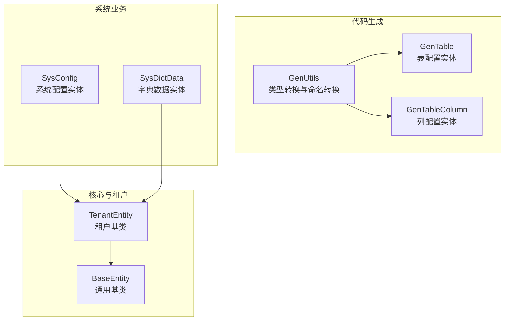
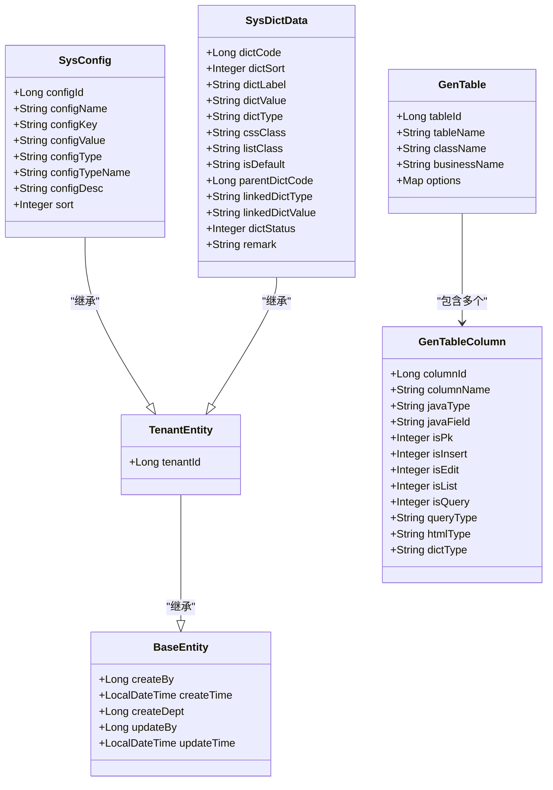
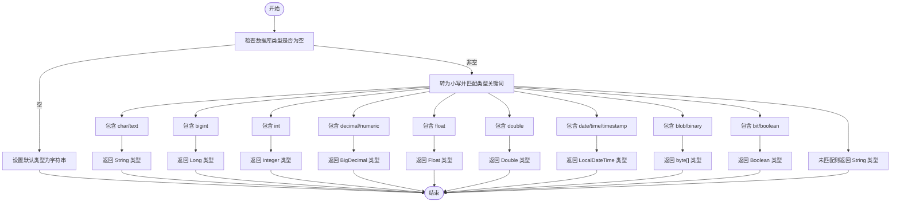
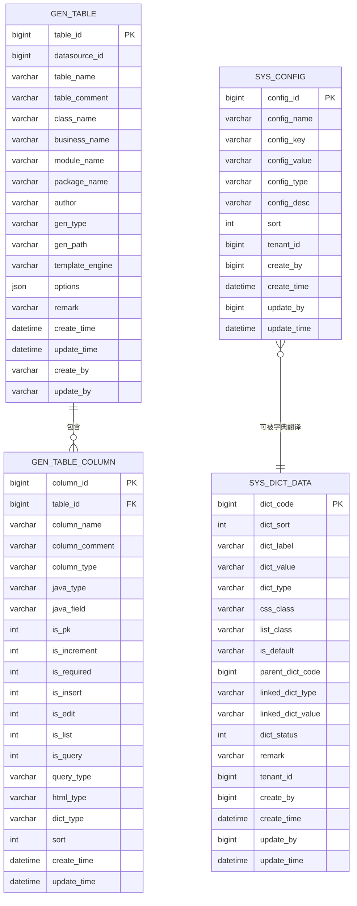
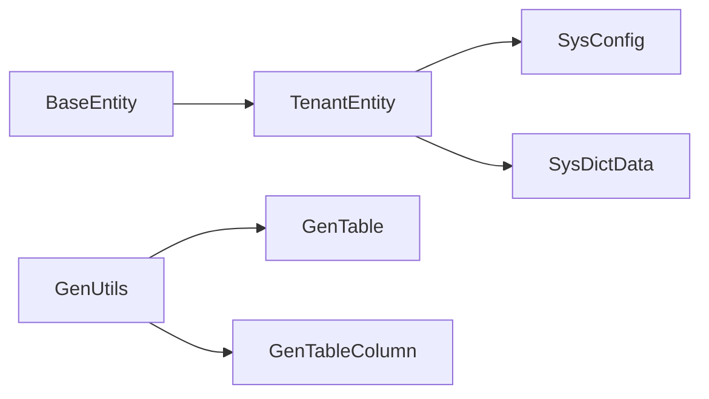

# 数据模型设计概念

<cite>
**本文引用的文件**
- [GenUtils.java](file://forge/forge-framework/forge-plugin-parent/forge-plugin-generator/src/main/java/com/mdframe/forge/plugin/generator/util/GenUtils.java)
- [GenTable.java](file://forge/forge-framework/forge-plugin-parent/forge-plugin-generator/src/main/java/com/mdframe/forge/plugin/generator/domain/entity/GenTable.java)
- [GenTableColumn.java](file://forge/forge-framework/forge-plugin-parent/forge-plugin-generator/src/main/java/com/mdframe/forge/plugin/generator/domain/entity/GenTableColumn.java)
- [SysConfig.java](file://forge/forge-framework/forge-plugin-parent/forge-plugin-system/src/main/java/com/mdframe/forge/plugin/system/entity/SysConfig.java)
- [SysDictData.java](file://forge/forge-framework/forge-plugin-parent/forge-plugin-system/src/main/java/com/mdframe/forge/plugin/system/entity/SysDictData.java)
- [BaseEntity.java](file://forge/forge-framework/forge-starter-parent/forge-starter-core/src/main/java/com/mdframe/forge/starter/core/domain/BaseEntity.java)
- [TenantEntity.java](file://forge/forge-framework/forge-starter-parent/forge-starter-tenant/src/main/java/com/mdframe/forge/starter/tenant/core/TenantEntity.java)
</cite>

## 目录
1. [引言](#引言)
2. [项目结构](#项目结构)
3. [核心组件](#核心组件)
4. [架构总览](#架构总览)
5. [详细组件分析](#详细组件分析)
6. [依赖分析](#依赖分析)
7. [性能考虑](#性能考虑)
8. [故障排查指南](#故障排查指南)
9. [结论](#结论)
10. [附录](#附录)

## 引言
本文件系统化阐述Forge框架中的数据模型设计概念，覆盖设计原则、命名规范、字段设计标准、实体与数据库表的映射关系、字段类型转换规则、注解使用规范，并结合实际代码示例，给出扩展性、性能与安全方面的设计建议与最佳实践，帮助开发者建立统一的数据建模方法论。

## 项目结构
Forge框架采用多模块分层组织，数据模型相关能力主要分布在以下模块：
- 代码生成插件：提供数据库表到实体类的映射与类型转换逻辑
- 系统插件：提供系统配置、字典等业务实体
- 启动器核心：提供通用基类与租户基类，统一字段与行为
- 注解与翻译：提供字典翻译与字段翻译能力

**图示来源**
- [GenUtils.java](file://forge/forge-framework/forge-plugin-parent/forge-plugin-generator/src/main/java/com/mdframe/forge/plugin/generator/util/GenUtils.java#L15-L238)
- [GenTable.java](file://forge/forge-framework/forge-plugin-parent/forge-plugin-generator/src/main/java/com/mdframe/forge/plugin/generator/domain/entity/GenTable.java#L14-L147)
- [GenTableColumn.java](file://forge/forge-framework/forge-plugin-parent/forge-plugin-generator/src/main/java/com/mdframe/forge/plugin/generator/domain/entity/GenTableColumn.java#L12-L59)
- [SysConfig.java](file://forge/forge-framework/forge-plugin-parent/forge-plugin-system/src/main/java/com/mdframe/forge/plugin/system/entity/SysConfig.java#L14-L62)
- [SysDictData.java](file://forge/forge-framework/forge-plugin-parent/forge-plugin-system/src/main/java/com/mdframe/forge/plugin/system/entity/SysDictData.java#L12-L85)
- [BaseEntity.java](file://forge/forge-framework/forge-starter-parent/forge-starter-core/src/main/java/com/mdframe/forge/starter/core/domain/BaseEntity.java#L15-L52)
- [TenantEntity.java](file://forge/forge-framework/forge-starter-parent/forge-starter-tenant/src/main/java/com/mdframe/forge/starter/tenant/core/TenantEntity.java#L10-L19)

**章节来源**
- [GenUtils.java](file://forge/forge-framework/forge-plugin-parent/forge-plugin-generator/src/main/java/com/mdframe/forge/plugin/generator/util/GenUtils.java#L15-L238)
- [GenTable.java](file://forge/forge-framework/forge-plugin-parent/forge-plugin-generator/src/main/java/com/mdframe/forge/plugin/generator/domain/entity/GenTable.java#L14-L147)
- [GenTableColumn.java](file://forge/forge-framework/forge-plugin-parent/forge-plugin-generator/src/main/java/com/mdframe/forge/plugin/generator/domain/entity/GenTableColumn.java#L12-L59)
- [SysConfig.java](file://forge/forge-framework/forge-plugin-parent/forge-plugin-system/src/main/java/com/mdframe/forge/plugin/system/entity/SysConfig.java#L14-L62)
- [SysDictData.java](file://forge/forge-framework/forge-plugin-parent/forge-plugin-system/src/main/java/com/mdframe/forge/plugin/system/entity/SysDictData.java#L12-L85)
- [BaseEntity.java](file://forge/forge-framework/forge-starter-parent/forge-starter-core/src/main/java/com/mdframe/forge/starter/core/domain/BaseEntity.java#L15-L52)
- [TenantEntity.java](file://forge/forge-framework/forge-starter-parent/forge-starter-tenant/src/main/java/com/mdframe/forge/starter/tenant/core/TenantEntity.java#L10-L19)

## 核心组件
- 通用基类与租户基类：统一创建/更新字段与租户标识，减少重复字段与逻辑
- 代码生成工具：负责数据库类型到Java类型的映射、列名到字段名的命名转换、查询类型与HTML类型的推断
- 业务实体：系统配置与字典数据等，体现注解驱动的字典翻译与多租户支持

**章节来源**
- [BaseEntity.java](file://forge/forge-framework/forge-starter-parent/forge-starter-core/src/main/java/com/mdframe/forge/starter/core/domain/BaseEntity.java#L15-L52)
- [TenantEntity.java](file://forge/forge-framework/forge-starter-parent/forge-starter-tenant/src/main/java/com/mdframe/forge/starter/tenant/core/TenantEntity.java#L10-L19)
- [GenUtils.java](file://forge/forge-framework/forge-plugin-parent/forge-plugin-generator/src/main/java/com/mdframe/forge/plugin/generator/util/GenUtils.java#L15-L238)
- [SysConfig.java](file://forge/forge-framework/forge-plugin-parent/forge-plugin-system/src/main/java/com/mdframe/forge/plugin/system/entity/SysConfig.java#L14-L62)
- [SysDictData.java](file://forge/forge-framework/forge-plugin-parent/forge-plugin-system/src/main/java/com/mdframe/forge/plugin/system/entity/SysDictData.java#L12-L85)

## 架构总览
Forge数据模型通过“基类统一 + 注解增强 + 代码生成”的方式实现：
- 基类统一：所有业务实体继承通用基类，自动具备创建/更新字段与填充策略
- 租户隔离：租户基类在通用基类之上增加租户标识，便于多租户场景下的数据隔离
- 注解增强：通过字典翻译与字段翻译注解，实现运行时的值域展示与关联查询
- 代码生成：根据数据库元数据自动生成实体类、字段类型、查询与HTML类型，降低手工映射成本

**图示来源**
- [BaseEntity.java](file://forge/forge-framework/forge-starter-parent/forge-starter-core/src/main/java/com/mdframe/forge/starter/core/domain/BaseEntity.java#L15-L52)
- [TenantEntity.java](file://forge/forge-framework/forge-starter-parent/forge-starter-tenant/src/main/java/com/mdframe/forge/starter/tenant/core/TenantEntity.java#L10-L19)
- [GenTable.java](file://forge/forge-framework/forge-plugin-parent/forge-plugin-generator/src/main/java/com/mdframe/forge/plugin/generator/domain/entity/GenTable.java#L14-L147)
- [GenTableColumn.java](file://forge/forge-framework/forge-plugin-parent/forge-plugin-generator/src/main/java/com/mdframe/forge/plugin/generator/domain/entity/GenTableColumn.java#L12-L59)
- [SysConfig.java](file://forge/forge-framework/forge-plugin-parent/forge-plugin-system/src/main/java/com/mdframe/forge/plugin/system/entity/SysConfig.java#L14-L62)
- [SysDictData.java](file://forge/forge-framework/forge-plugin-parent/forge-plugin-system/src/main/java/com/mdframe/forge/plugin/system/entity/SysDictData.java#L12-L85)

## 详细组件分析

### 代码生成工具：类型转换与命名规范
- 数据库类型到Java类型的映射：涵盖字符串、整数、浮点、精度数值、日期时间、二进制、布尔等常见类型
- 列名到字段名的驼峰命名转换：统一字段命名风格，避免SQL关键字冲突
- 表名到类名的帕斯卡命名转换：支持移除表前缀与模块化包路径生成
- 查询类型与HTML类型的智能推断：字符串默认LIKE，数值默认EQ；日期时间映射为DATETIME等
- 字典类型识别：从字段注释中解析字典项，自动标注dictType
- 基类字段排除：对创建/更新等通用字段进行插入/编辑/列表/查询的默认开关控制

**图示来源**
- [GenUtils.java](file://forge/forge-framework/forge-plugin-parent/forge-plugin-generator/src/main/java/com/mdframe/forge/plugin/generator/util/GenUtils.java#L18-L48)

**章节来源**
- [GenUtils.java](file://forge/forge-framework/forge-plugin-parent/forge-plugin-generator/src/main/java/com/mdframe/forge/plugin/generator/util/GenUtils.java#L15-L238)

### 实体类与数据库表的映射关系
- MyBatis-Plus注解映射：通过@TableId、@TableName、@TableField等注解将实体字段与数据库表/列精确对应
- JSON序列化格式化：通过@JsonFormat统一时间字段的输出格式
- 类型处理器：复杂字段（如Map）使用JacksonTypeHandler进行序列化存储
- 非持久化字段：通过exist=false声明仅用于业务流转，不参与数据库映射

**图示来源**
- [GenTable.java](file://forge/forge-framework/forge-plugin-parent/forge-plugin-generator/src/main/java/com/mdframe/forge/plugin/generator/domain/entity/GenTable.java#L14-L147)
- [GenTableColumn.java](file://forge/forge-framework/forge-plugin-parent/forge-plugin-generator/src/main/java/com/mdframe/forge/plugin/generator/domain/entity/GenTableColumn.java#L12-L59)
- [SysConfig.java](file://forge/forge-framework/forge-plugin-parent/forge-plugin-system/src/main/java/com/mdframe/forge/plugin/system/entity/SysConfig.java#L14-L62)
- [SysDictData.java](file://forge/forge-framework/forge-plugin-parent/forge-plugin-system/src/main/java/com/mdframe/forge/plugin/system/entity/SysDictData.java#L12-L85)

**章节来源**
- [GenTable.java](file://forge/forge-framework/forge-plugin-parent/forge-plugin-generator/src/main/java/com/mdframe/forge/plugin/generator/domain/entity/GenTable.java#L14-L147)
- [GenTableColumn.java](file://forge/forge-framework/forge-plugin-parent/forge-plugin-generator/src/main/java/com/mdframe/forge/plugin/generator/domain/entity/GenTableColumn.java#L12-L59)
- [SysConfig.java](file://forge/forge-framework/forge-plugin-parent/forge-plugin-system/src/main/java/com/mdframe/forge/plugin/system/entity/SysConfig.java#L14-L62)
- [SysDictData.java](file://forge/forge-framework/forge-plugin-parent/forge-plugin-system/src/main/java/com/mdframe/forge/plugin/system/entity/SysDictData.java#L12-L85)

### 字段设计标准与注解使用规范
- 统一字段：创建/更新字段由基类提供，确保一致性与审计能力
- 租户字段：租户基类提供tenantId，便于多租户隔离
- 字典翻译：通过@DictTrans与@TransField标注字典类型，实现运行时值域展示
- 时间格式化：通过@JsonFormat统一时间输出格式
- 复杂字段处理：使用TypeHandler对Map等复杂类型进行序列化存储
- 非持久化字段：通过@TableField(exist=false)声明业务字段，避免误映射

**章节来源**
- [BaseEntity.java](file://forge/forge-framework/forge-starter-parent/forge-starter-core/src/main/java/com/mdframe/forge/starter/core/domain/BaseEntity.java#L15-L52)
- [TenantEntity.java](file://forge/forge-framework/forge-starter-parent/forge-starter-tenant/src/main/java/com/mdframe/forge/starter/tenant/core/TenantEntity.java#L10-L19)
- [SysConfig.java](file://forge/forge-framework/forge-plugin-parent/forge-plugin-system/src/main/java/com/mdframe/forge/plugin/system/entity/SysConfig.java#L14-L62)
- [GenTable.java](file://forge/forge-framework/forge-plugin-parent/forge-plugin-generator/src/main/java/com/mdframe/forge/plugin/generator/domain/entity/GenTable.java#L89-L90)

### 扩展性设计与性能优化
- 扩展性
  - 通过租户基类天然支持多租户隔离，无需在业务实体中重复定义租户字段
  - 代码生成器支持表前缀移除、模块化包路径生成，便于按功能域扩展
  - 字典翻译注解可扩展至更多业务实体，统一值域展示
- 性能优化
  - 使用MyBatis-Plus的自动填充策略减少手动赋值开销
  - 对复杂字段采用JSON序列化存储，降低Schema复杂度
  - 通过查询类型与HTML类型预设，减少前端/后端重复判断

**章节来源**
- [TenantEntity.java](file://forge/forge-framework/forge-starter-parent/forge-starter-tenant/src/main/java/com/mdframe/forge/starter/tenant/core/TenantEntity.java#L10-L19)
- [GenUtils.java](file://forge/forge-framework/forge-plugin-parent/forge-plugin-generator/src/main/java/com/mdframe/forge/plugin/generator/util/GenUtils.java#L57-L81)
- [SysConfig.java](file://forge/forge-framework/forge-plugin-parent/forge-plugin-system/src/main/java/com/mdframe/forge/plugin/system/entity/SysConfig.java#L14-L62)

### 数据安全策略
- 多租户隔离：通过tenantId字段实现天然的数据边界，防止跨租户访问
- 字段级注解：通过@DictTrans与@TransField实现值域安全展示，避免直接暴露内部编码
- 时间格式化：统一输出格式，避免因时区差异导致的安全与合规问题

**章节来源**
- [TenantEntity.java](file://forge/forge-framework/forge-starter-parent/forge-starter-tenant/src/main/java/com/mdframe/forge/starter/tenant/core/TenantEntity.java#L10-L19)
- [SysConfig.java](file://forge/forge-framework/forge-plugin-parent/forge-plugin-system/src/main/java/com/mdframe/forge/plugin/system/entity/SysConfig.java#L14-L62)

## 依赖分析
- 组件耦合
  - 业务实体均依赖租户基类，间接依赖通用基类，形成清晰的继承层次
  - 代码生成工具独立于业务实体，仅依赖配置与数据库元数据
- 外部依赖
  - MyBatis-Plus注解与TypeHandler用于ORM映射与复杂字段序列化
  - Jackson注解用于JSON序列化格式化

**图示来源**
- [BaseEntity.java](file://forge/forge-framework/forge-starter-parent/forge-starter-core/src/main/java/com/mdframe/forge/starter/core/domain/BaseEntity.java#L15-L52)
- [TenantEntity.java](file://forge/forge-framework/forge-starter-parent/forge-starter-tenant/src/main/java/com/mdframe/forge/starter/tenant/core/TenantEntity.java#L10-L19)
- [SysConfig.java](file://forge/forge-framework/forge-plugin-parent/forge-plugin-system/src/main/java/com/mdframe/forge/plugin/system/entity/SysConfig.java#L14-L62)
- [SysDictData.java](file://forge/forge-framework/forge-plugin-parent/forge-plugin-system/src/main/java/com/mdframe/forge/plugin/system/entity/SysDictData.java#L12-L85)
- [GenUtils.java](file://forge/forge-framework/forge-plugin-parent/forge-plugin-generator/src/main/java/com/mdframe/forge/plugin/generator/util/GenUtils.java#L15-L238)
- [GenTable.java](file://forge/forge-framework/forge-plugin-parent/forge-plugin-generator/src/main/java/com/mdframe/forge/plugin/generator/domain/entity/GenTable.java#L14-L147)
- [GenTableColumn.java](file://forge/forge-framework/forge-plugin-parent/forge-plugin-generator/src/main/java/com/mdframe/forge/plugin/generator/domain/entity/GenTableColumn.java#L12-L59)

**章节来源**
- [GenUtils.java](file://forge/forge-framework/forge-plugin-parent/forge-plugin-generator/src/main/java/com/mdframe/forge/plugin/generator/util/GenUtils.java#L15-L238)
- [GenTable.java](file://forge/forge-framework/forge-plugin-parent/forge-plugin-generator/src/main/java/com/mdframe/forge/plugin/generator/domain/entity/GenTable.java#L14-L147)
- [GenTableColumn.java](file://forge/forge-framework/forge-plugin-parent/forge-plugin-generator/src/main/java/com/mdframe/forge/plugin/generator/domain/entity/GenTableColumn.java#L12-L59)
- [SysConfig.java](file://forge/forge-framework/forge-plugin-parent/forge-plugin-system/src/main/java/com/mdframe/forge/plugin/system/entity/SysConfig.java#L14-L62)
- [SysDictData.java](file://forge/forge-framework/forge-plugin-parent/forge-plugin-system/src/main/java/com/mdframe/forge/plugin/system/entity/SysDictData.java#L12-L85)
- [BaseEntity.java](file://forge/forge-framework/forge-starter-parent/forge-starter-core/src/main/java/com/mdframe/forge/starter/core/domain/BaseEntity.java#L15-L52)
- [TenantEntity.java](file://forge/forge-framework/forge-starter-parent/forge-starter-tenant/src/main/java/com/mdframe/forge/starter/tenant/core/TenantEntity.java#L10-L19)

## 性能考虑
- 自动填充策略：利用MyBatis-Plus的FieldFill减少手动赋值，降低出错率与性能损耗
- JSON序列化：复杂配置字段采用JSON存储，简化Schema并提升读写效率
- 查询类型预设：字符串默认LIKE、数值默认EQ，减少运行时判断分支
- 字段翻译缓存：字典翻译注解可在上层服务中结合缓存机制，减少重复查询

[本节为通用指导，无需列出具体文件来源]

## 故障排查指南
- 字段类型映射异常
  - 现象：生成的Java类型不符合预期
  - 排查：确认数据库类型关键词是否被正确识别，必要时在注释中补充字典定义以触发智能识别
- 命名转换不一致
  - 现象：字段名与期望命名风格不符
  - 排查：检查表前缀配置与命名转换逻辑，确保大小写与下划线处理符合预期
- 字典翻译未生效
  - 现象：显示为原始编码而非标签
  - 排查：确认@DictTrans与@TransField的字典类型配置是否正确，以及字典数据是否存在且启用
- 多租户数据越权
  - 现象：查询到其他租户数据
  - 排查：确认租户上下文是否正确传递，实体是否继承租户基类并包含tenantId过滤

**章节来源**
- [GenUtils.java](file://forge/forge-framework/forge-plugin-parent/forge-plugin-generator/src/main/java/com/mdframe/forge/plugin/generator/util/GenUtils.java#L137-L154)
- [SysConfig.java](file://forge/forge-framework/forge-plugin-parent/forge-plugin-system/src/main/java/com/mdframe/forge/plugin/system/entity/SysConfig.java#L14-L62)
- [TenantEntity.java](file://forge/forge-framework/forge-starter-parent/forge-starter-tenant/src/main/java/com/mdframe/forge/starter/tenant/core/TenantEntity.java#L10-L19)

## 结论
Forge框架通过“基类统一 + 注解增强 + 代码生成”的数据模型设计，实现了跨模块的一致性、可扩展性与可维护性。遵循本文档的设计原则与最佳实践，可显著提升开发效率与系统稳定性。

[本节为总结性内容，无需列出具体文件来源]

## 附录
- 设计原则
  - 一致性：统一字段与命名规范，减少认知负担
  - 可扩展：租户基类与注解体系支持横向扩展
  - 可维护：代码生成与自动填充降低手工维护成本
- 最佳实践
  - 新增实体优先继承租户基类，确保多租户支持
  - 使用注解明确字段用途与展示方式
  - 复杂配置采用JSON存储并配合TypeHandler
  - 在数据库注释中补充字典定义，提升代码生成质量

[本节为通用指导，无需列出具体文件来源]