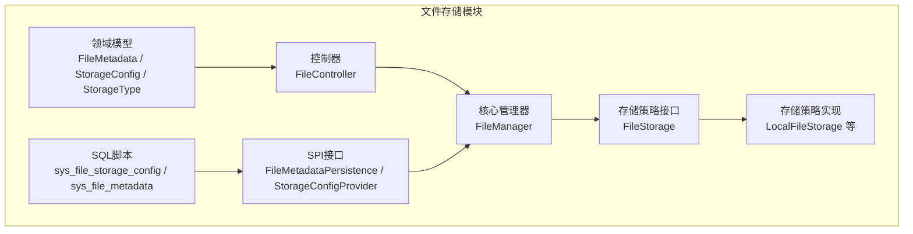
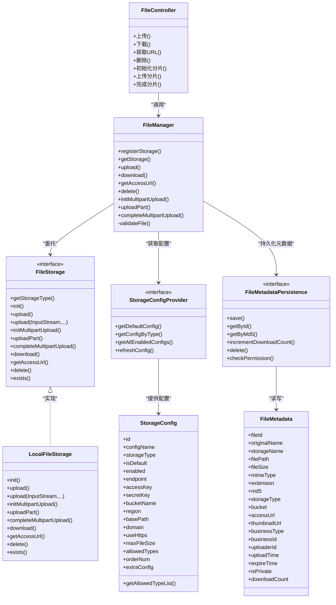
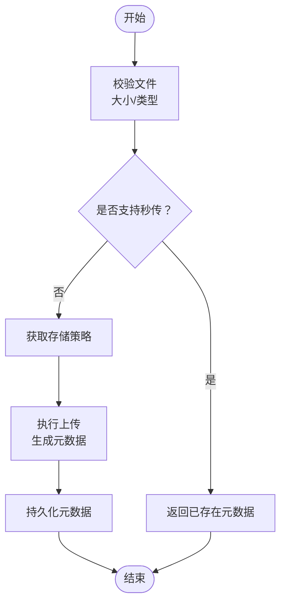
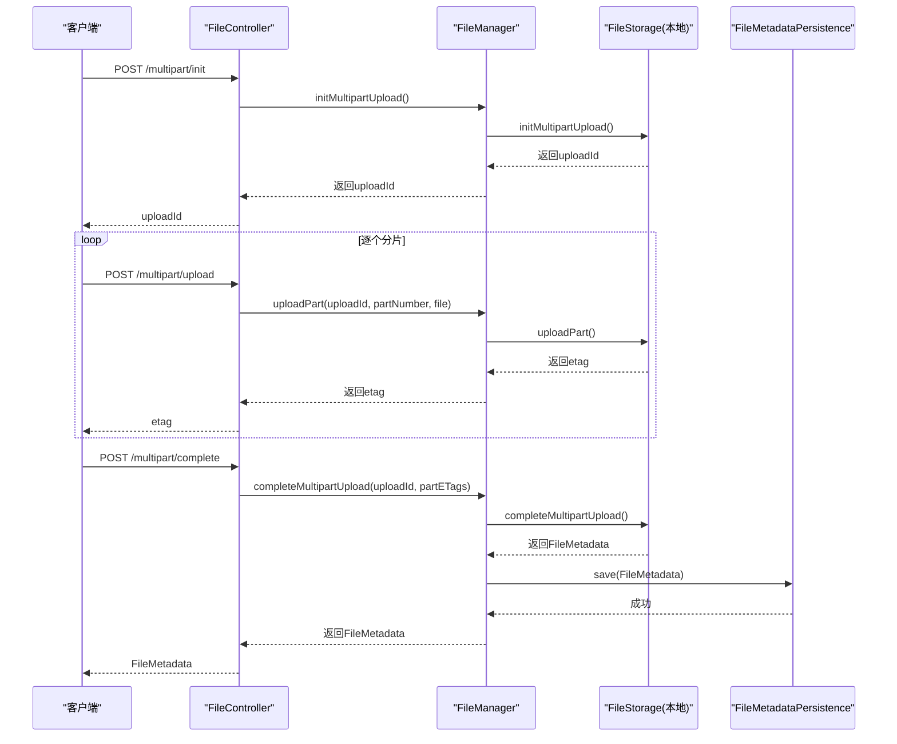
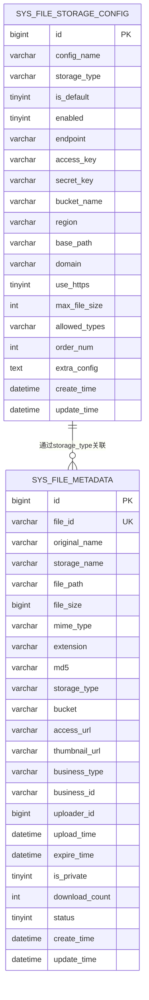

# 文件存储表结构

<cite>
**本文引用的文件**
- [file_storage.sql](file://forge/forge-framework/forge-starter-parent/forge-starter-file/sql/file_storage.sql)
- [FileMetadata.java](file://forge/forge-framework/forge-starter-parent/forge-starter-file/src/main/java/com/mdframe/forge/starter/file/model/FileMetadata.java)
- [StorageConfig.java](file://forge/forge-framework/forge-starter-parent/forge-starter-file/src/main/java/com/mdframe/forge/starter/file/model/StorageConfig.java)
- [StorageType.java](file://forge/forge-framework/forge-starter-parent/forge-starter-file/src/main/java/com/mdframe/forge/starter/file/enums/StorageType.java)
- [FileStorage.java](file://forge/forge-framework/forge-starter-parent/forge-starter-file/src/main/java/com/mdframe/forge/starter/file/storage/FileStorage.java)
- [FileManager.java](file://forge/forge-framework/forge-starter-parent/forge-starter-file/src/main/java/com/mdframe/forge/starter/file/core/FileManager.java)
- [FileController.java](file://forge/forge-framework/forge-starter-parent/forge-starter-file/src/main/java/com/mdframe/forge/starter/file/controller/FileController.java)
- [FileMetadataPersistence.java](file://forge/forge-framework/forge-starter-parent/forge-starter-file/src/main/java/com/mdframe/forge/starter/file/spi/FileMetadataPersistence.java)
- [StorageConfigProvider.java](file://forge/forge-framework/forge-starter-parent/forge-starter-file/src/main/java/com/mdframe/forge/starter/file/spi/StorageConfigProvider.java)
- [LocalFileStorage.java](file://forge/forge-framework/forge-starter-parent/forge-starter-file/src/main/java/com/mdframe/forge/starter/file/storage/impl/LocalFileStorage.java)
</cite>

## 目录
1. [简介](#简介)
2. [项目结构](#项目结构)
3. [核心组件](#核心组件)
4. [架构总览](#架构总览)
5. [详细组件分析](#详细组件分析)
6. [依赖关系分析](#依赖关系分析)
7. [性能考虑](#性能考虑)
8. [故障排查指南](#故障排查指南)
9. [结论](#结论)
10. [附录](#附录)

## 简介
本文件聚焦于文件存储模块的数据库表结构与数据模型，系统性梳理以下内容：
- 文件元数据表：字段定义、字段含义、索引设计、字段与业务的映射关系
- 存储配置表：配置项设计、存储策略配置、默认策略与启用控制
- 分片上传表：分片管理与上传状态跟踪（基于本地实现的上下文管理）
- 文件存储流程：上传、下载、分片上传、URL生成、删除的端到端流程
- 表关系图与配置示例：帮助开发者快速理解数据模型与存储策略

## 项目结构
文件存储模块位于后端子模块中，包含数据库脚本、领域模型、存储策略接口、核心管理器与控制器等层次化组件。

图表来源
- [file_storage.sql](file://forge/forge-framework/forge-starter-parent/forge-starter-file/sql/file_storage.sql#L1-L75)
- [FileMetadata.java](file://forge/forge-framework/forge-starter-parent/forge-starter-file/src/main/java/com/mdframe/forge/starter/file/model/FileMetadata.java#L1-L110)
- [StorageConfig.java](file://forge/forge-framework/forge-starter-parent/forge-starter-file/src/main/java/com/mdframe/forge/starter/file/model/StorageConfig.java#L1-L109)
- [StorageType.java](file://forge/forge-framework/forge-starter-parent/forge-starter-file/src/main/java/com/mdframe/forge/starter/file/enums/StorageType.java#L1-L50)
- [FileStorage.java](file://forge/forge-framework/forge-starter-parent/forge-starter-file/src/main/java/com/mdframe/forge/starter/file/storage/FileStorage.java#L1-L110)
- [FileManager.java](file://forge/forge-framework/forge-starter-parent/forge-starter-file/src/main/java/com/mdframe/forge/starter/file/core/FileManager.java#L1-L255)
- [FileController.java](file://forge/forge-framework/forge-starter-parent/forge-starter-file/src/main/java/com/mdframe/forge/starter/file/controller/FileController.java#L1-L117)
- [FileMetadataPersistence.java](file://forge/forge-framework/forge-starter-parent/forge-starter-file/src/main/java/com/mdframe/forge/starter/file/spi/FileMetadataPersistence.java#L1-L41)
- [StorageConfigProvider.java](file://forge/forge-framework/forge-starter-parent/forge-starter-file/src/main/java/com/mdframe/forge/starter/file/spi/StorageConfigProvider.java#L1-L33)
- [LocalFileStorage.java](file://forge/forge-framework/forge-starter-parent/forge-starter-file/src/main/java/com/mdframe/forge/starter/file/storage/impl/LocalFileStorage.java#L161-L252)

章节来源
- [file_storage.sql](file://forge/forge-framework/forge-starter-parent/forge-starter-file/sql/file_storage.sql#L1-L75)
- [FileController.java](file://forge/forge-framework/forge-starter-parent/forge-starter-file/src/main/java/com/mdframe/forge/starter/file/controller/FileController.java#L1-L117)
- [FileManager.java](file://forge/forge-framework/forge-starter-parent/forge-starter-file/src/main/java/com/mdframe/forge/starter/file/core/FileManager.java#L1-L255)

## 核心组件
- 数据库表
  - sys_file_storage_config：存储策略配置表，记录不同存储类型的参数、启用状态、默认策略等
  - sys_file_metadata：文件元数据表，记录文件的唯一标识、路径、大小、MIME、业务关联、访问URL等
- 领域模型
  - StorageConfig：存储策略配置的Java模型，包含配置项与解析逻辑
  - FileMetadata：文件元数据的Java模型，用于传输与持久化
  - StorageType：存储策略枚举，统一管理支持的存储类型
- SPI接口
  - StorageConfigProvider：提供默认/按类型获取配置、刷新配置等能力
  - FileMetadataPersistence：提供元数据的保存、查询、计数更新、删除、权限校验等能力
- 核心管理器
  - FileManager：统一编排上传、下载、删除、分片上传、URL生成等流程，并进行文件校验与秒传处理
- 控制器
  - FileController：对外暴露REST接口，支持普通上传、分片上传、下载、URL生成、删除
- 存储策略接口与实现
  - FileStorage：定义存储策略的统一接口
  - LocalFileStorage：本地文件系统实现，包含分片上传的上下文管理

章节来源
- [file_storage.sql](file://forge/forge-framework/forge-starter-parent/forge-starter-file/sql/file_storage.sql#L1-L75)
- [StorageConfig.java](file://forge/forge-framework/forge-starter-parent/forge-starter-file/src/main/java/com/mdframe/forge/starter/file/model/StorageConfig.java#L1-L109)
- [FileMetadata.java](file://forge/forge-framework/forge-starter-parent/forge-starter-file/src/main/java/com/mdframe/forge/starter/file/model/FileMetadata.java#L1-L110)
- [StorageType.java](file://forge/forge-framework/forge-starter-parent/forge-starter-file/src/main/java/com/mdframe/forge/starter/file/enums/StorageType.java#L1-L50)
- [FileStorage.java](file://forge/forge-framework/forge-starter-parent/forge-starter-file/src/main/java/com/mdframe/forge/starter/file/storage/FileStorage.java#L1-L110)
- [FileManager.java](file://forge/forge-framework/forge-starter-parent/forge-starter-file/src/main/java/com/mdframe/forge/starter/file/core/FileManager.java#L1-L255)
- [FileController.java](file://forge/forge-framework/forge-starter-parent/forge-starter-file/src/main/java/com/mdframe/forge/starter/file/controller/FileController.java#L1-L117)
- [FileMetadataPersistence.java](file://forge/forge-framework/forge-starter-parent/forge-starter-file/src/main/java/com/mdframe/forge/starter/file/spi/FileMetadataPersistence.java#L1-L41)
- [StorageConfigProvider.java](file://forge/forge-framework/forge-starter-parent/forge-starter-file/src/main/java/com/mdframe/forge/starter/file/spi/StorageConfigProvider.java#L1-L33)
- [LocalFileStorage.java](file://forge/forge-framework/forge-starter-parent/forge-starter-file/src/main/java/com/mdframe/forge/starter/file/storage/impl/LocalFileStorage.java#L161-L252)

## 架构总览
文件存储模块采用“控制器-管理器-存储策略接口-具体实现”的分层架构，结合SPI接口实现配置与元数据的可插拔式持久化。

图表来源
- [FileController.java](file://forge/forge-framework/forge-starter-parent/forge-starter-file/src/main/java/com/mdframe/forge/starter/file/controller/FileController.java#L1-L117)
- [FileManager.java](file://forge/forge-framework/forge-starter-parent/forge-starter-file/src/main/java/com/mdframe/forge/starter/file/core/FileManager.java#L1-L255)
- [FileStorage.java](file://forge/forge-framework/forge-starter-parent/forge-starter-file/src/main/java/com/mdframe/forge/starter/file/storage/FileStorage.java#L1-L110)
- [LocalFileStorage.java](file://forge/forge-framework/forge-starter-parent/forge-starter-file/src/main/java/com/mdframe/forge/starter/file/storage/impl/LocalFileStorage.java#L161-L252)
- [StorageConfigProvider.java](file://forge/forge-framework/forge-starter-parent/forge-starter-file/src/main/java/com/mdframe/forge/starter/file/spi/StorageConfigProvider.java#L1-L33)
- [FileMetadataPersistence.java](file://forge/forge-framework/forge-starter-parent/forge-starter-file/src/main/java/com/mdframe/forge/starter/file/spi/FileMetadataPersistence.java#L1-L41)
- [StorageConfig.java](file://forge/forge-framework/forge-starter-parent/forge-starter-file/src/main/java/com/mdframe/forge/starter/file/model/StorageConfig.java#L1-L109)
- [FileMetadata.java](file://forge/forge-framework/forge-starter-parent/forge-starter-file/src/main/java/com/mdframe/forge/starter/file/model/FileMetadata.java#L1-L110)

## 详细组件分析

### 文件元数据表（sys_file_metadata）
- 设计目标
  - 统一记录文件的元信息，支撑上传、下载、访问、业务关联、统计与权限控制
- 字段定义与含义
  - 主键与唯一标识：id、file_id（唯一）
  - 基本信息：original_name、storage_name、file_path、file_size、mime_type、extension、md5
  - 存储与访问：storage_type、bucket、access_url、thumbnail_url
  - 业务关联：business_type、business_id
  - 用户与时间：uploader_id、upload_time、expire_time、create_time、update_time
  - 状态与统计：is_private、download_count、status
- 索引设计
  - idx_file_id：按file_id查询与去重
  - idx_md5：秒传优化
  - idx_business：按业务类型与ID查询
  - idx_uploader：按上传者查询
  - idx_upload_time：按上传时间排序或范围查询
- 字段与业务映射
  - 存储策略：通过storage_type关联sys_file_storage_config
  - 业务类型与ID：支持按业务维度归档与检索
  - 访问URL：access_url由存储策略实现生成
  - 私有标志：is_private用于控制访问策略
  - 下载计数：download_count用于统计与运营分析
- 复杂度与性能
  - 查询：基于索引的单条查询为O(logN)，批量查询受索引覆盖影响
  - 更新：download_count自增与时间戳更新为常数开销
  - 秒传：基于md5的快速匹配，避免重复存储

章节来源
- [file_storage.sql](file://forge/forge-framework/forge-starter-parent/forge-starter-file/sql/file_storage.sql#L28-L60)
- [FileMetadata.java](file://forge/forge-framework/forge-starter-parent/forge-starter-file/src/main/java/com/mdframe/forge/starter/file/model/FileMetadata.java#L1-L110)
- [FileManager.java](file://forge/forge-framework/forge-starter-parent/forge-starter-file/src/main/java/com/mdframe/forge/starter/file/core/FileManager.java#L74-L98)

### 存储配置表（sys_file_storage_config）
- 设计目标
  - 统一管理不同存储类型的配置，支持多策略并存与默认策略选择
- 配置项设计
  - 基本信息：config_name、storage_type、is_default、enabled
  - 访问参数：endpoint、access_key、secret_key、bucket_name、region、domain、use_https
  - 本地参数：base_path
  - 限制与排序：max_file_size（MB）、allowed_types（逗号分隔）、order_num
  - 扩展：extra_config（JSON）
  - 时间戳：create_time、update_time
- 索引设计
  - idx_storage_type：按存储类型筛选
  - idx_is_default：快速定位默认策略
- 存储策略配置
  - 默认策略：is_default=1，作为未指定时的回退
  - 启用控制：enabled=1表示可用
  - 类型枚举：通过StorageType统一管理，支持local/minio/aliyun_oss/tencent_cos/qiniu等
- 配置示例
  - 本地存储：base_path、max_file_size、allowed_types、order_num
  - MinIO示例：endpoint、access_key、secret_key、bucket_name、use_https、max_file_size、allowed_types

章节来源
- [file_storage.sql](file://forge/forge-framework/forge-starter-parent/forge-starter-file/sql/file_storage.sql#L1-L26)
- [StorageConfig.java](file://forge/forge-framework/forge-starter-parent/forge-starter-file/src/main/java/com/mdframe/forge/starter/file/model/StorageConfig.java#L1-L109)
- [StorageType.java](file://forge/forge-framework/forge-starter-parent/forge-starter-file/src/main/java/com/mdframe/forge/starter/file/enums/StorageType.java#L1-L50)

### 分片上传表（基于本地实现的上下文管理）
- 设计目标
  - 支持大文件分片上传，提升稳定性与断点续传能力
- 上下文管理（本地实现）
  - 上传ID：initMultipartUpload返回uploadId，作为本次分片上传的会话标识
  - 分片存储：uploadPart将每个分片写入临时目录，记录分片号到文件名的映射
  - 完成合并：completeMultipartUpload按顺序拼接分片，生成最终文件，清理临时目录
  - 临时目录：每个uploadId对应一个独立的临时目录，避免并发冲突
- 上传状态跟踪
  - 通过内存中的上下文映射维护分片进度
  - 分片ETag：本地实现中以分片文件名作为ETag占位
- 流程要点
  - 初始化：生成uploadId与临时目录
  - 上传分片：按分片号写入文件，记录映射
  - 完成：顺序合并分片，构建FileMetadata并持久化

章节来源
- [FileManager.java](file://forge/forge-framework/forge-starter-parent/forge-starter-file/src/main/java/com/mdframe/forge/starter/file/core/FileManager.java#L180-L218)
- [LocalFileStorage.java](file://forge/forge-framework/forge-starter-parent/forge-starter-file/src/main/java/com/mdframe/forge/starter/file/storage/impl/LocalFileStorage.java#L161-L252)

### 文件存储流程图
- 普通上传流程

图表来源
- [FileManager.java](file://forge/forge-framework/forge-starter-parent/forge-starter-file/src/main/java/com/mdframe/forge/starter/file/core/FileManager.java#L56-L98)
- [FileMetadataPersistence.java](file://forge/forge-framework/forge-starter-parent/forge-starter-file/src/main/java/com/mdframe/forge/starter/file/spi/FileMetadataPersistence.java#L1-L41)

- 分片上传流程

图表来源
- [FileController.java](file://forge/forge-framework/forge-starter-parent/forge-starter-file/src/main/java/com/mdframe/forge/starter/file/controller/FileController.java#L75-L115)
- [FileManager.java](file://forge/forge-framework/forge-starter-parent/forge-starter-file/src/main/java/com/mdframe/forge/starter/file/core/FileManager.java#L180-L218)
- [LocalFileStorage.java](file://forge/forge-framework/forge-starter-parent/forge-starter-file/src/main/java/com/mdframe/forge/starter/file/storage/impl/LocalFileStorage.java#L161-L252)
- [FileMetadataPersistence.java](file://forge/forge-framework/forge-starter-parent/forge-starter-file/src/main/java/com/mdframe/forge/starter/file/spi/FileMetadataPersistence.java#L1-L41)

### 表关系图

图表来源
- [file_storage.sql](file://forge/forge-framework/forge-starter-parent/forge-starter-file/sql/file_storage.sql#L1-L75)

## 依赖关系分析
- 组件耦合
  - FileController依赖FileManager提供统一能力
  - FileManager依赖FileStorage接口与SPI接口（StorageConfigProvider、FileMetadataPersistence）
  - LocalFileStorage实现FileStorage接口，承载本地分片上传逻辑
- 外部依赖
  - 数据库：sys_file_storage_config与sys_file_metadata
  - 文件系统：本地分片上传依赖临时目录与顺序合并
- 可能的循环依赖
  - 当前结构为单向依赖（控制器→管理器→策略接口→实现），无循环依赖迹象
- 接口契约
  - FileStorage定义了上传/下载/分片上传/URL生成/删除等标准方法
  - SPI接口定义了配置与元数据的读写契约

章节来源
- [FileController.java](file://forge/forge-framework/forge-starter-parent/forge-starter-file/src/main/java/com/mdframe/forge/starter/file/controller/FileController.java#L1-L117)
- [FileManager.java](file://forge/forge-framework/forge-starter-parent/forge-starter-file/src/main/java/com/mdframe/forge/starter/file/core/FileManager.java#L1-L255)
- [FileStorage.java](file://forge/forge-framework/forge-starter-parent/forge-starter-file/src/main/java/com/mdframe/forge/starter/file/storage/FileStorage.java#L1-L110)
- [LocalFileStorage.java](file://forge/forge-framework/forge-starter-parent/forge-starter-file/src/main/java/com/mdframe/forge/starter/file/storage/impl/LocalFileStorage.java#L161-L252)
- [StorageConfigProvider.java](file://forge/forge-framework/forge-starter-parent/forge-starter-file/src/main/java/com/mdframe/forge/starter/file/spi/StorageConfigProvider.java#L1-L33)
- [FileMetadataPersistence.java](file://forge/forge-framework/forge-starter-parent/forge-starter-file/src/main/java/com/mdframe/forge/starter/file/spi/FileMetadataPersistence.java#L1-L41)

## 性能考虑
- 索引优化
  - 在高频查询字段上建立索引（如file_id、md5、business_type+business_id、uploader_id、upload_time）
- 秒传机制
  - 基于md5的快速匹配减少重复存储与IO
- 分片上传
  - 本地实现采用顺序合并，适合中小规模场景；大规模建议使用对象存储的原生分片能力
- 下载统计
  - download_count自增应配合合适的并发控制，避免热点竞争

## 故障排查指南
- 常见问题
  - 文件大小超限：检查sys_file_storage_config.max_file_size与文件实际大小
  - 不支持的文件类型：检查sys_file_storage_config.allowed_types与文件扩展名
  - 存储类型不支持：确认storage_type是否在StorageType枚举中
  - 分片上传失败：检查uploadId是否有效、分片是否按序上传、临时目录权限
- 排查步骤
  - 上传失败：查看FileManager.validateFile日志与异常信息
  - 下载失败：确认FileMetadata是否存在、存储策略是否正确、URL是否过期
  - 分片上传：核对uploadId、分片ETag列表与顺序

章节来源
- [FileManager.java](file://forge/forge-framework/forge-starter-parent/forge-starter-file/src/main/java/com/mdframe/forge/starter/file/core/FileManager.java#L220-L253)
- [FileController.java](file://forge/forge-framework/forge-starter-parent/forge-starter-file/src/main/java/com/mdframe/forge/starter/file/controller/FileController.java#L1-L117)

## 结论
该文件存储模块通过清晰的表结构与分层架构，实现了统一的文件元数据管理与多存储策略支持。文件元数据表覆盖上传、访问、业务关联与统计需求；存储配置表提供灵活的策略配置；分片上传通过本地实现保障了大文件的稳定上传。结合SPI接口，业务侧可按需扩展配置与元数据持久化方案。

## 附录
- 配置示例（来自SQL脚本）
  - 本地存储：配置名称、存储类型、是否默认、是否启用、基础路径、最大文件大小、允许类型、排序
  - MinIO存储：配置名称、存储类型、是否默认、是否启用、端点、访问密钥、密钥、存储桶、是否HTTPS、最大文件大小、允许类型、排序
- 关键字段速览
  - 文件元数据：file_id、original_name、storage_name、file_path、file_size、mime_type、extension、md5、storage_type、bucket、access_url、thumbnail_url、business_type、business_id、uploader_id、upload_time、expire_time、is_private、download_count、status
  - 存储配置：config_name、storage_type、is_default、enabled、endpoint、access_key、secret_key、bucket_name、region、base_path、domain、use_https、max_file_size、allowed_types、order_num、extra_config

章节来源
- [file_storage.sql](file://forge/forge-framework/forge-starter-parent/forge-starter-file/sql/file_storage.sql#L62-L75)
- [StorageConfig.java](file://forge/forge-framework/forge-starter-parent/forge-starter-file/src/main/java/com/mdframe/forge/starter/file/model/StorageConfig.java#L1-L109)
- [FileMetadata.java](file://forge/forge-framework/forge-starter-parent/forge-starter-file/src/main/java/com/mdframe/forge/starter/file/model/FileMetadata.java#L1-L110)