# 核心业务表结构

<cite>
**本文引用的文件**
- [sys.sql](file://forge/forge-admin/sql/sys.sql)
- [test_auth_data.sql](file://forge/forge-admin/src/main/resources/sql/test_auth_data.sql)
- [SysUser.java](file://forge/forge-framework/forge-plugin-parent/forge-plugin-system/src/main/java/com/mdframe/forge/plugin/system/entity/SysUser.java)
- [SysOrg.java](file://forge/forge-framework/forge-plugin-parent/forge-plugin-system/src/main/java/com/mdframe/forge/plugin/system/entity/SysOrg.java)
- [SysPost.java](file://forge/forge-framework/forge-plugin-parent/forge-plugin-system/src/main/java/com/mdframe/forge/plugin/system/entity/SysPost.java)
- [SysRole.java](file://forge/forge-framework/forge-plugin-parent/forge-plugin-system/src/main/java/com/mdframe/forge/plugin/system/entity/SysRole.java)
- [SysResource.java](file://forge/forge-framework/forge-plugin-parent/forge-plugin-system/src/main/java/com/mdframe/forge/plugin/system/entity/SysResource.java)
- [SysUserOrg.java](file://forge/forge-framework/forge-plugin-parent/forge-plugin-system/src/main/java/com/mdframe/forge/plugin/system/entity/SysUserOrg.java)
- [SysUser.java](file://forge/forge-framework/forge-plugin-parent/forge-plugin-system/src/main/java/com/mdframe/forge/plugin/system/entity/SysUser.java)
- [SysUserRole.java](file://forge/forge-framework/forge-plugin-parent/forge-plugin-system/src/main/java/com/mdframe/forge/plugin/system/entity/SysUserRole.java)
- [SysUserPost.java](file://forge/forge-framework/forge-plugin-parent/forge-plugin-system/src/main/java/com/mdframe/forge/plugin/system/entity/SysUserPost.java)
- [SysRoleResource.java](file://forge/forge-framework/forge-plugin-parent/forge-plugin-system/src/main/java/com/mdframe/forge/plugin/system/entity/SysRoleResource.java)
- [SysConfig.java](file://forge/forge-framework/forge-plugin-parent/forge-plugin-system/src/main/java/com/mdframe/forge/plugin/system/entity/SysConfig.java)
- [SysDictType.java](file://forge/forge-framework/forge-plugin-parent/forge-plugin-system/src/main/java/com/mdframe/forge/plugin/system/entity/SysDictType.java)
- [SysDictData.java](file://forge/forge-framework/forge-plugin-parent/forge-plugin-system/src/main/java/com/mdframe/forge/plugin/system/entity/SysDictData.java)
- [SysOperationLog.java](file://forge/forge-framework/forge-plugin-parent/forge-plugin-system/src/main/java/com/mdframe/forge/plugin/system/entity/SysOperationLog.java)
- [SysLoginLog.java](file://forge/forge-framework/forge-plugin-parent/forge-plugin-system/src/main/java/com/mdframe/forge/plugin/system/entity/SysLoginLog.java)
- [UserOrgBindDTO.java](file://forge/forge-framework/forge-plugin-parent/forge-plugin-system/src/main/java/com/mdframe/forge/plugin/system/dto/UserOrgBindDTO.java)
</cite>

## 目录
1. [简介](#简介)
2. [项目结构](#项目结构)
3. [核心组件](#核心组件)
4. [架构总览](#架构总览)
5. [详细组件分析](#详细组件分析)
6. [依赖分析](#依赖分析)
7. [性能考虑](#性能考虑)
8. [故障排查指南](#故障排查指南)
9. [结论](#结论)

## 简介
本文件聚焦系统管理模块的基础数据表设计，系统性梳理用户、角色、菜单、部门、岗位等核心业务表的字段定义、数据类型、约束关系与索引设计，阐明表间外键关系与数据完整性约束，解释业务逻辑字段的作用，并提供表结构图、字段说明表与典型数据示例，帮助开发者快速理解并正确使用该业务数据模型。

## 项目结构
系统管理模块的数据模型由两部分构成：
- 数据库层：统一在系统管理模块的 SQL 中定义，包含用户、角色、资源（菜单/按钮/API）、组织、岗位、配置、字典、日志等表。
- Java 实体层：在系统插件模块中以 MyBatis-Plus 实体类映射数据库表，体现字段与业务含义。

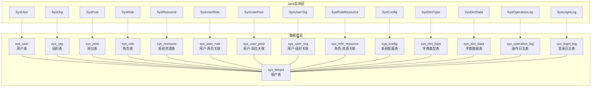

图表来源
- [sys.sql](file://forge/forge-admin/sql/sys.sql#L11-L333)
- [SysUser.java](file://forge/forge-framework/forge-plugin-parent/forge-plugin-system/src/main/java/com/mdframe/forge/plugin/system/entity/SysUser.java#L17-L114)
- [SysOrg.java](file://forge/forge-framework/forge-plugin-parent/forge-plugin-system/src/main/java/com/mdframe/forge/plugin/system/entity/SysOrg.java#L16-L92)
- [SysPost.java](file://forge/forge-framework/forge-plugin-parent/forge-plugin-system/src/main/java/com/mdframe/forge/plugin/system/entity/SysPost.java#L14-L60)
- [SysRole.java](file://forge/forge-framework/forge-plugin-parent/forge-plugin-system/src/main/java/com/mdframe/forge/plugin/system/entity/SysRole.java#L14-L60)
- [SysResource.java](file://forge/forge-framework/forge-plugin-parent/forge-plugin-system/src/main/java/com/mdframe/forge/plugin/system/entity/SysResource.java#L14-L121)
- [SysUserOrg.java](file://forge/forge-framework/forge-plugin-parent/forge-plugin-system/src/main/java/com/mdframe/forge/plugin/system/entity/SysUserOrg.java#L14-L50)

章节来源
- [sys.sql](file://forge/forge-admin/sql/sys.sql#L1-L333)

## 核心组件
本节对系统管理模块的核心业务表进行逐项说明，覆盖字段定义、数据类型、约束与索引、业务含义与典型用途。

- 租户表（sys_tenant）
  - 字段要点：主键、租户名称唯一、状态索引；支持租户级业务隔离与查询优化。
  - 约束与索引：唯一索引（租户名称），状态索引。
  - 典型用途：多租户场景下的租户维度数据隔离。

- 用户表（sys_user）
  - 字段要点：用户名（租户内唯一）、手机号/邮箱/身份证唯一、状态、头像、登录统计、性别枚举、用户类型枚举。
  - 约束与索引：用户名（租户+用户名唯一）、手机号唯一、邮箱唯一、身份证唯一、状态复合索引、用户类型索引。
  - 典型用途：用户身份与权限主体，承载登录、个人信息与统计信息。

- 组织表（sys_org）
  - 字段要点：组织名称（租户+组织名唯一）、父子关系（祖先链）、类型、状态、负责人、联系方式、地址。
  - 约束与索引：组织名唯一、父子关系索引、状态索引、祖先链索引。
  - 典型用途：构建组织树，支撑组织维度的数据权限与用户归属。

- 岗位表（sys_post）
  - 字段要点：岗位编码（租户内唯一）、所属组织、岗位名称、状态、类型、排序。
  - 约束与索引：岗位编码唯一、组织+岗位名唯一、状态索引、组织索引。
  - 典型用途：岗位与组织绑定，支撑职责与权限边界。

- 角色表（sys_role）
  - 字段要点：角色名（租户+角色名唯一）、角色键（租户+角色键唯一）、数据范围枚举、排序、状态、是否内置、备注。
  - 约束与索引：角色名唯一、角色键唯一、状态索引、数据范围索引。
  - 典型用途：集中式权限抽象，配合数据范围策略实现细粒度访问控制。

- 系统资源表（sys_resource）
  - 字段要点：资源名称、父子关系、资源类型（目录/菜单/按钮/API）、排序、路由、组件、权限标识、API方法与URL、可见性、缓存与显示策略等。
  - 约限与索引：权限标识唯一（租户+类型+权限标识）、父子关系索引、类型索引、API URL+方法组合索引。
  - 典型用途：统一管理菜单、按钮与API权限，支撑前端路由与后端鉴权。

- 用户-角色关联表（sys_user_role）
  - 字段要点：租户+用户+角色唯一、创建时间。
  - 约束与索引：唯一索引（租户+用户+角色）、用户索引、角色索引。
  - 典型用途：用户具备多个角色，支撑权限叠加与继承。

- 用户-岗位关联表（sys_user_post）
  - 字段要点：租户+用户+岗位唯一、是否主岗、创建时间。
  - 约束与索引：唯一索引、用户+主岗组合索引。
  - 典型用途：用户可有多岗位，区分主岗与兼岗。

- 用户-组织关联表（sys_user_org）
  - 字段要点：租户+用户+组织唯一、是否主组织、创建时间。
  - 约束与索引：唯一索引、用户+主组织组合索引。
  - 典型用途：用户可属于多个组织，区分主组织与兼职组织。

- 角色-资源关联表（sys_role_resource）
  - 字段要点：租户+角色+资源唯一、创建时间。
  - 约束与索引：唯一索引、资源索引。
  - 典型用途：角色具备多种资源权限，支撑菜单、按钮与API授权。

- 系统配置表（sys_config）
  - 字段要点：参数键（租户+键唯一）、键值、类型、描述、排序。
  - 约束与索引：键唯一、类型索引。
  - 典型用途：系统运行期配置项管理。

- 字典类型表（sys_dict_type）
  - 字段要点：字典类型（租户+类型唯一）、状态、备注。
  - 约束与索引：类型唯一、状态索引。
  - 典型用途：字典分类管理。

- 字典数据表（sys_dict_data）
  - 字段要点：字典标签、键值、类型、排序、样式、默认标记、父子关系、关联字典、状态。
  - 约束与索引：类型+键值唯一、父子关系索引、关联字典索引。
  - 典型用途：字典项明细，支撑前端展示与业务枚举。

- 操作日志表（sys_operation_log）
  - 字段要点：操作模块、类型、描述、请求方法/URL、参数/结果、错误信息、状态、IP/位置、UA、耗时、时间。
  - 约束与索引：租户+用户索引、时间索引、状态索引、URL前缀索引。
  - 典型用途：审计与问题追踪。

- 登录日志表（sys_login_log）
  - 字段要点：登录类型、状态、IP/位置、浏览器/OS、UA、消息、时间。
  - 约束与索引：租户+用户索引、时间索引、状态索引。
  - 典型用途：安全审计与异常登录监控。

章节来源
- [sys.sql](file://forge/forge-admin/sql/sys.sql#L11-L333)

## 架构总览
系统管理模块采用“多租户+权限中心+组织岗位”的基础数据模型，围绕用户、角色、资源三要素实现菜单、按钮与API的统一管控，并通过组织与岗位建立用户归属关系，结合数据范围策略实现精细化权限控制。

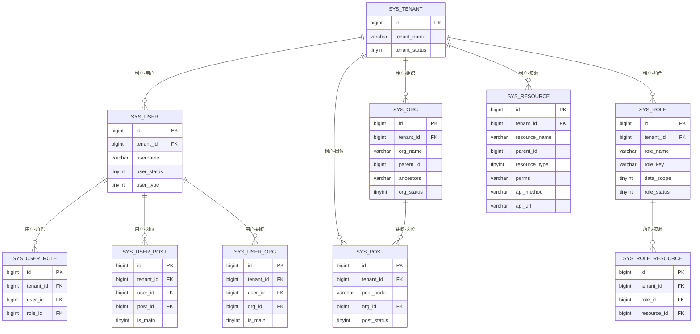

图表来源
- [sys.sql](file://forge/forge-admin/sql/sys.sql#L11-L333)

## 详细组件分析

### 用户表（sys_user）与实体映射
- 字段与类型：包含用户标识、认证凭据、状态、统计与基本信息等。
- 约束与索引：用户名/手机号/邮箱/身份证唯一，状态+租户复合索引，用户类型索引。
- 业务逻辑：支持多租户内用户名唯一，便于跨租户隔离；密码加密存储，登录统计用于行为分析。
- Java映射：SysUser 实体类对应数据库字段，体现租户继承与通用基类能力。

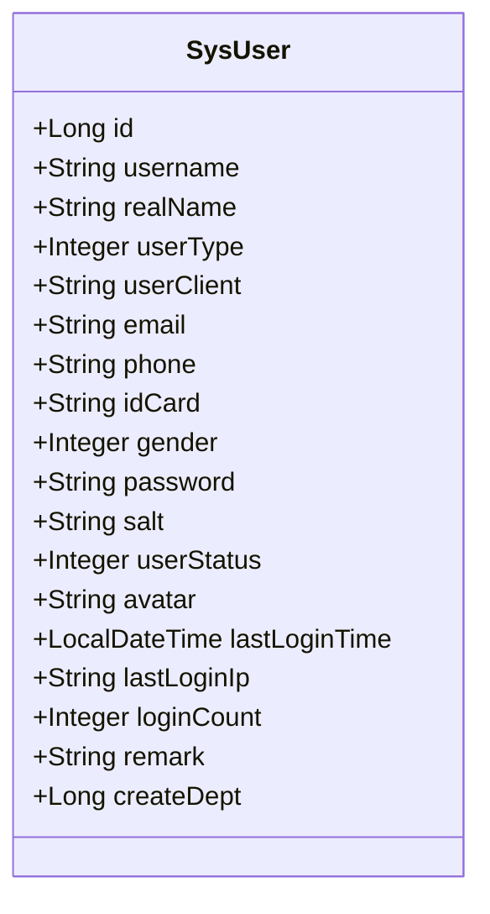

图表来源
- [SysUser.java](file://forge/forge-framework/forge-plugin-parent/forge-plugin-system/src/main/java/com/mdframe/forge/plugin/system/entity/SysUser.java#L17-L114)

章节来源
- [sys.sql](file://forge/forge-admin/sql/sys.sql#L30-L62)
- [SysUser.java](file://forge/forge-framework/forge-plugin-parent/forge-plugin-system/src/main/java/com/mdframe/forge/plugin/system/entity/SysUser.java#L17-L114)

### 组织表（sys_org）与实体映射
- 字段与类型：组织名称、父子关系、祖先链、类型、状态、负责人、联系方式、地址。
- 约束与索引：组织名唯一，父子关系与状态索引，祖先链索引。
- 业务逻辑：通过祖先链与父子关系维护组织树，支撑层级化数据权限与用户归属。
- Java映射：SysOrg 实体类包含子节点集合，便于树形渲染。

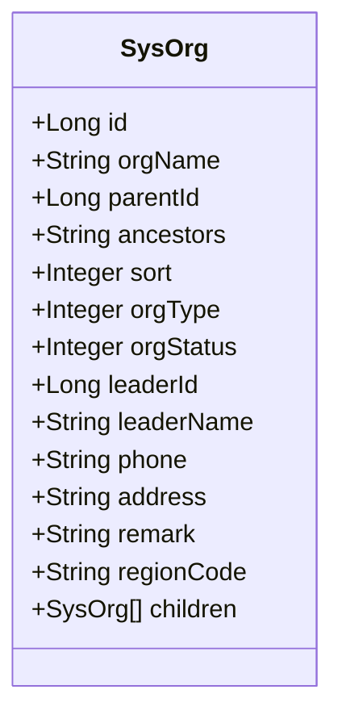

图表来源
- [SysOrg.java](file://forge/forge-framework/forge-plugin-parent/forge-plugin-system/src/main/java/com/mdframe/forge/plugin/system/entity/SysOrg.java#L16-L92)

章节来源
- [sys.sql](file://forge/forge-admin/sql/sys.sql#L64-L88)
- [SysOrg.java](file://forge/forge-framework/forge-plugin-parent/forge-plugin-system/src/main/java/com/mdframe/forge/plugin/system/entity/SysOrg.java#L16-L92)

### 岗位表（sys_post）与实体映射
- 字段与类型：岗位编码（租户内唯一）、所属组织、岗位名称、状态、类型、排序。
- 约束与索引：岗位编码唯一，组织+岗位名唯一，状态与组织索引。
- 业务逻辑：岗位与组织绑定，支持管理/技术/业务等类型划分，支撑职责与权限边界。
- Java映射：SysPost 实体类映射岗位相关字段。

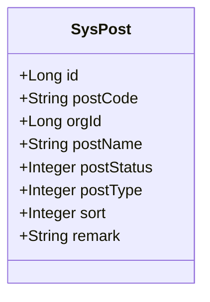

图表来源
- [SysPost.java](file://forge/forge-framework/forge-plugin-parent/forge-plugin-system/src/main/java/com/mdframe/forge/plugin/system/entity/SysPost.java#L14-L60)

章节来源
- [sys.sql](file://forge/forge-admin/sql/sys.sql#L90-L110)
- [SysPost.java](file://forge/forge-framework/forge-plugin-parent/forge-plugin-system/src/main/java/com/mdframe/forge/plugin/system/entity/SysPost.java#L14-L60)

### 角色表（sys_role）与实体映射
- 字段与类型：角色名（租户内唯一）、角色键（租户内唯一）、数据范围枚举、排序、状态、是否内置、备注。
- 约束与索引：角色名唯一、角色键唯一、状态与数据范围索引。
- 业务逻辑：数据范围枚举支撑“全部/本租户/本组织/本组织及子组织/个人”等策略。
- Java映射：SysRole 实体类映射角色相关字段。

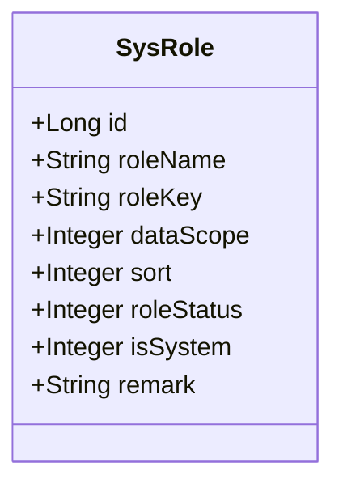

图表来源
- [SysRole.java](file://forge/forge-framework/forge-plugin-parent/forge-plugin-system/src/main/java/com/mdframe/forge/plugin/system/entity/SysRole.java#L14-L60)

章节来源
- [sys.sql](file://forge/forge-admin/sql/sys.sql#L112-L132)
- [SysRole.java](file://forge/forge-framework/forge-plugin-parent/forge-plugin-system/src/main/java/com/mdframe/forge/plugin/system/entity/SysRole.java#L14-L60)

### 系统资源表（sys_resource）与实体映射
- 字段与类型：资源名称、父子关系、资源类型（目录/菜单/按钮/API）、排序、路由、组件、权限标识、API方法与URL、可见性、缓存与显示策略等。
- 约束与索引：权限标识唯一（租户+类型+权限标识）、父子关系索引、类型索引、API URL+方法组合索引。
- 业务逻辑：统一管理菜单、按钮与API权限，支撑前端路由与后端鉴权。
- Java映射：SysResource 实体类映射资源相关字段，包含子资源列表用于树形结构。

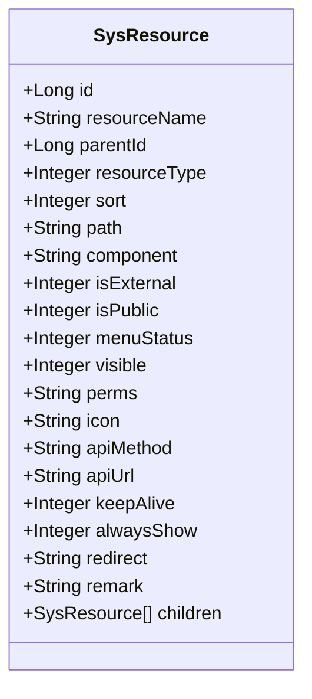

图表来源
- [SysResource.java](file://forge/forge-framework/forge-plugin-parent/forge-plugin-system/src/main/java/com/mdframe/forge/plugin/system/entity/SysResource.java#L14-L121)

章节来源
- [sys.sql](file://forge/forge-admin/sql/sys.sql#L134-L165)
- [SysResource.java](file://forge/forge-framework/forge-plugin-parent/forge-plugin-system/src/main/java/com/mdframe/forge/plugin/system/entity/SysResource.java#L14-L121)

### 关联表与实体映射
- 用户-角色关联（sys_user_role）：唯一索引（租户+用户+角色），支撑用户多角色授权。
- 用户-岗位关联（sys_user_post）：唯一索引（租户+用户+岗位），支撑用户多岗位与主/兼岗区分。
- 用户-组织关联（sys_user_org）：唯一索引（租户+用户+组织），支撑用户多组织与主/兼职组织区分。
- 角色-资源关联（sys_role_resource）：唯一索引（租户+角色+资源），支撑角色权限集管理。

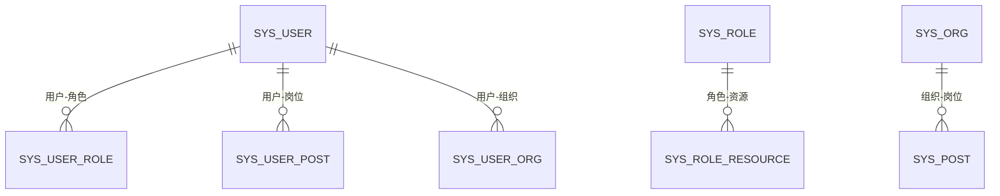

图表来源
- [sys.sql](file://forge/forge-admin/sql/sys.sql#L167-L221)

章节来源
- [sys.sql](file://forge/forge-admin/sql/sys.sql#L167-L221)

### 配置与字典表
- 系统配置表（sys_config）：参数键（租户+键唯一）、类型、描述、排序。
- 字典类型表（sys_dict_type）：字典类型（租户+类型唯一）、状态。
- 字典数据表（sys_dict_data）：字典标签、键值、类型、排序、样式、默认标记、父子关系、关联字典、状态。

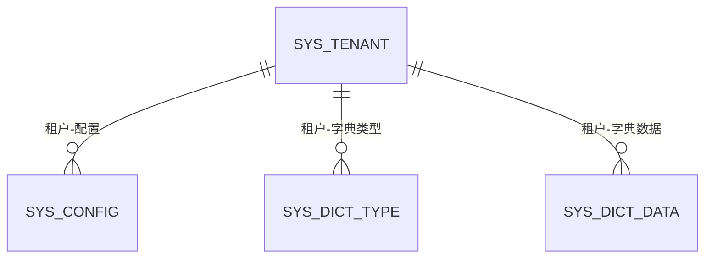

图表来源
- [sys.sql](file://forge/forge-admin/sql/sys.sql#L223-L284)

章节来源
- [sys.sql](file://forge/forge-admin/sql/sys.sql#L223-L284)

### 日志表
- 操作日志表（sys_operation_log）：操作模块、类型、描述、请求方法/URL、参数/结果、错误信息、状态、IP/位置、UA、耗时、时间。
- 登录日志表（sys_login_log）：登录类型、状态、IP/位置、浏览器/OS、UA、消息、时间。

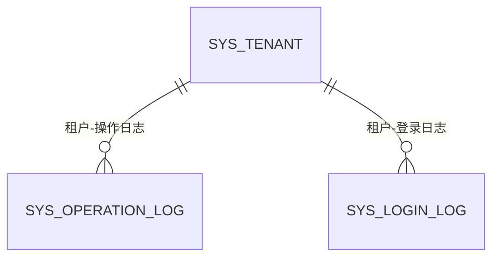

图表来源
- [sys.sql](file://forge/forge-admin/sql/sys.sql#L286-L333)

章节来源
- [sys.sql](file://forge/forge-admin/sql/sys.sql#L286-L333)

## 依赖分析
- 多租户隔离：除日志表外，核心业务表均包含租户字段，通过“租户+唯一键”组合实现租户内唯一性与隔离。
- 关系耦合：用户与组织/岗位/角色通过中间表解耦，避免一对多/多对多直接外键带来的复杂性。
- 索引策略：围绕常用查询条件（租户+状态、租户+父级、资源类型、API URL+方法、用户+主岗/主组织）建立索引，兼顾查询性能与写入成本。
- 业务一致性：通过唯一索引与业务规则（如主岗位/主组织）保证数据一致性与业务语义。

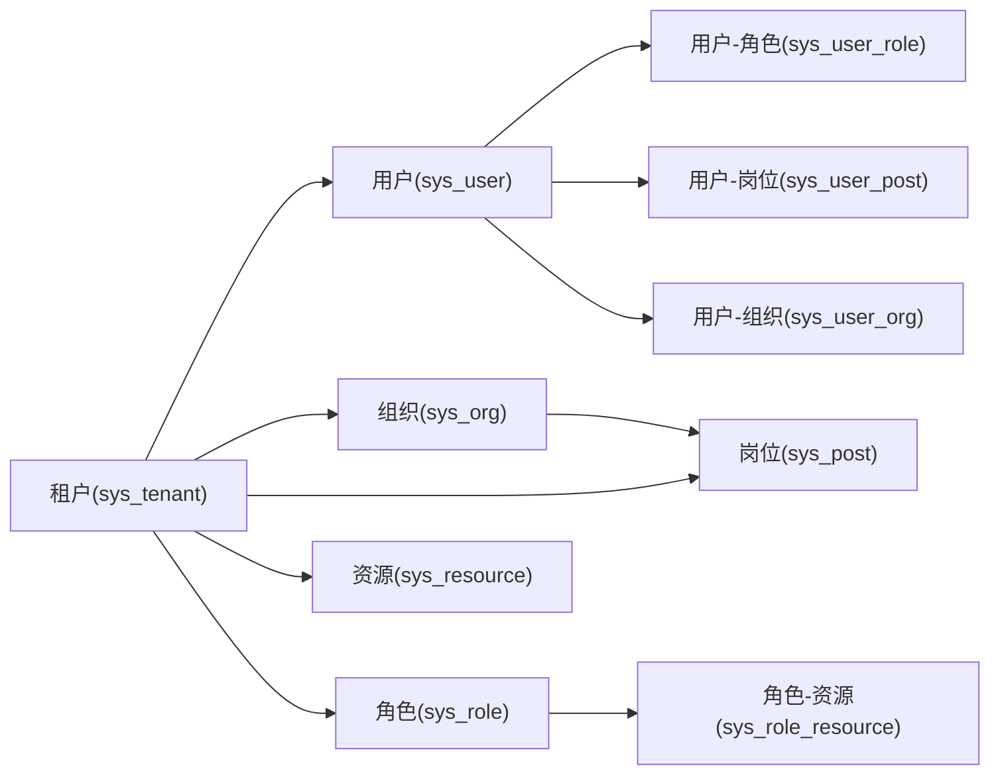

图表来源
- [sys.sql](file://forge/forge-admin/sql/sys.sql#L11-L333)

章节来源
- [sys.sql](file://forge/forge-admin/sql/sys.sql#L11-L333)

## 性能考虑
- 唯一索引与复合索引：在高并发场景下，合理利用唯一索引与复合索引可显著降低重复写入与查询成本。
- 索引选择性：针对高频过滤字段（如状态、类型、租户）建立索引，提升查询效率。
- 写入优化：批量导入与事务控制，避免频繁的小事务导致锁竞争。
- 日志表：操作日志与登录日志建议按月分区或定期归档，减少热数据膨胀。

## 故障排查指南
- 唯一冲突：当出现用户名/手机号/邮箱/身份证或角色键/岗位编码唯一冲突时，检查租户维度与输入数据是否重复。
- 权限缺失：若用户无法访问菜单或API，检查角色-资源关联与资源表权限标识配置。
- 数据范围异常：若用户看到不应见的数据，检查角色数据范围配置与用户-组织/岗位关联。
- 日志定位：通过操作日志与登录日志的请求URL、状态与错误信息定位问题根因。

章节来源
- [sys.sql](file://forge/forge-admin/sql/sys.sql#L11-L333)

## 结论
系统管理模块以“多租户+权限中心+组织岗位”为核心，通过用户、角色、资源、组织、岗位等表的协同，形成完整的权限与数据边界模型。配套的配置、字典与日志体系进一步完善了系统的可运维性与可观测性。遵循本文的字段定义、约束与索引设计，可有效保障数据一致性与查询性能，满足企业级权限治理需求。