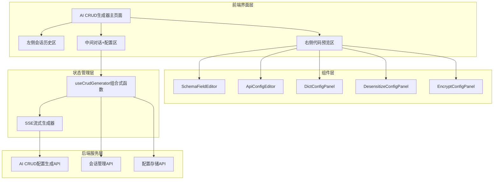
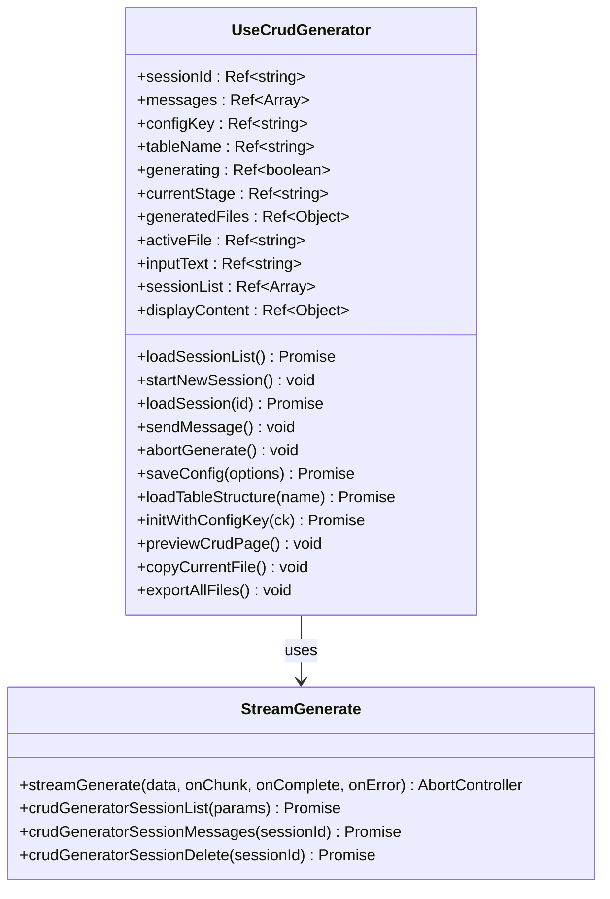
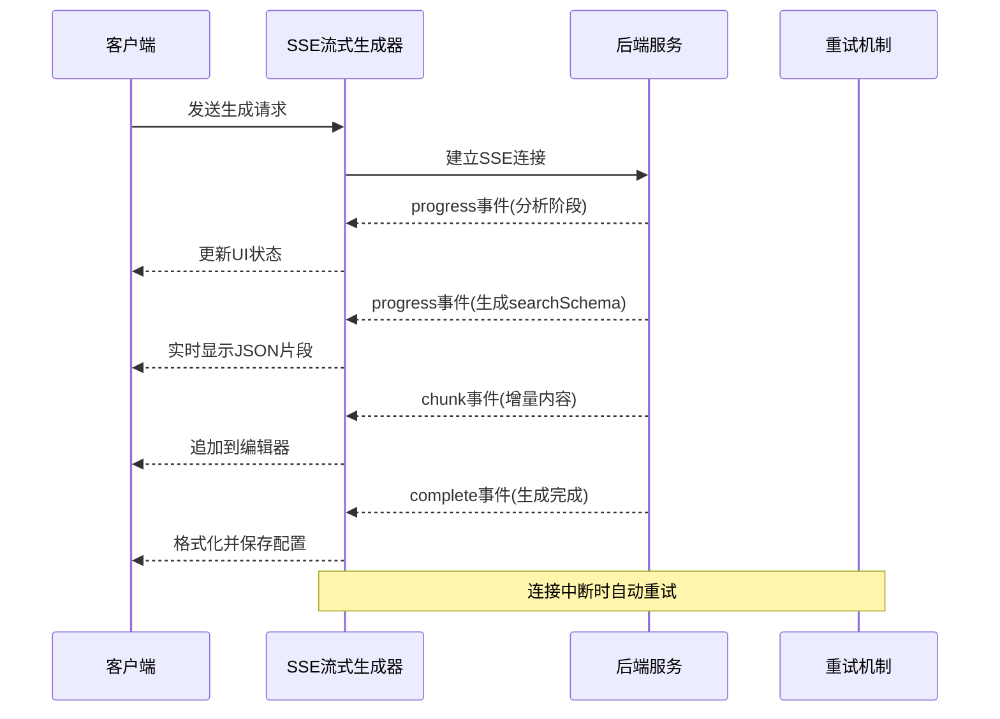
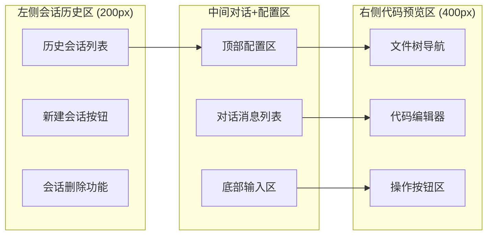
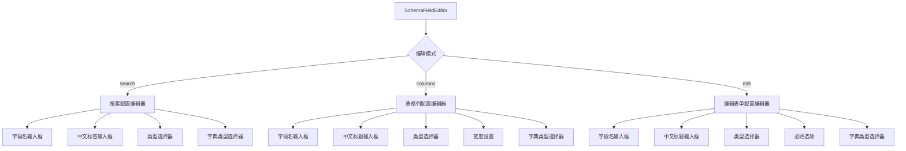
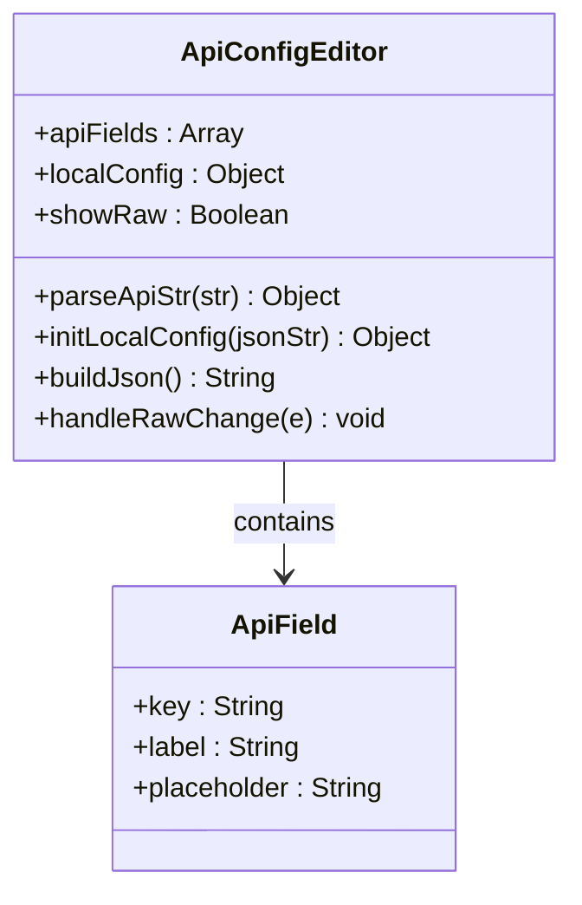
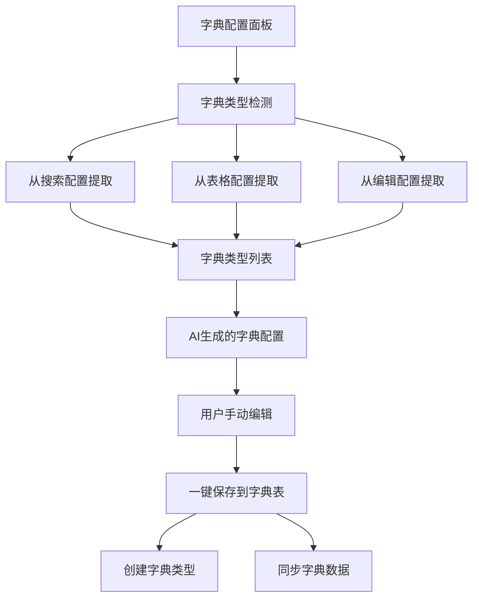
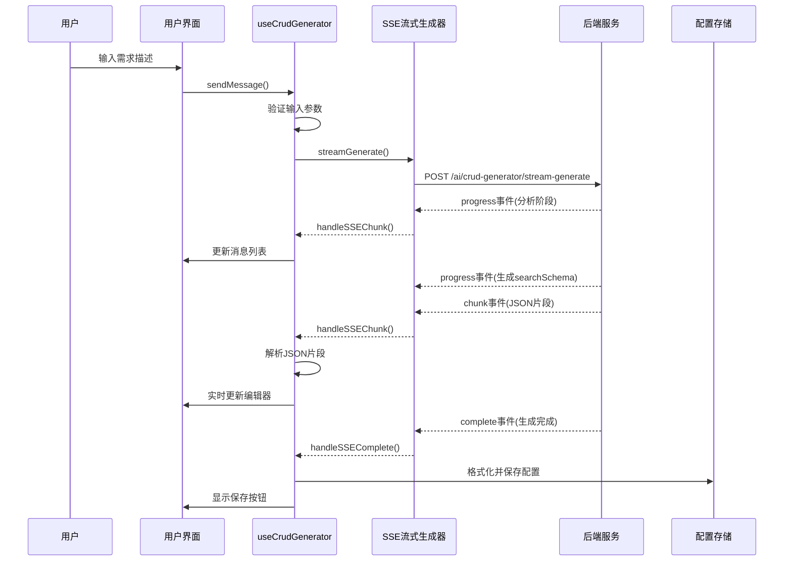
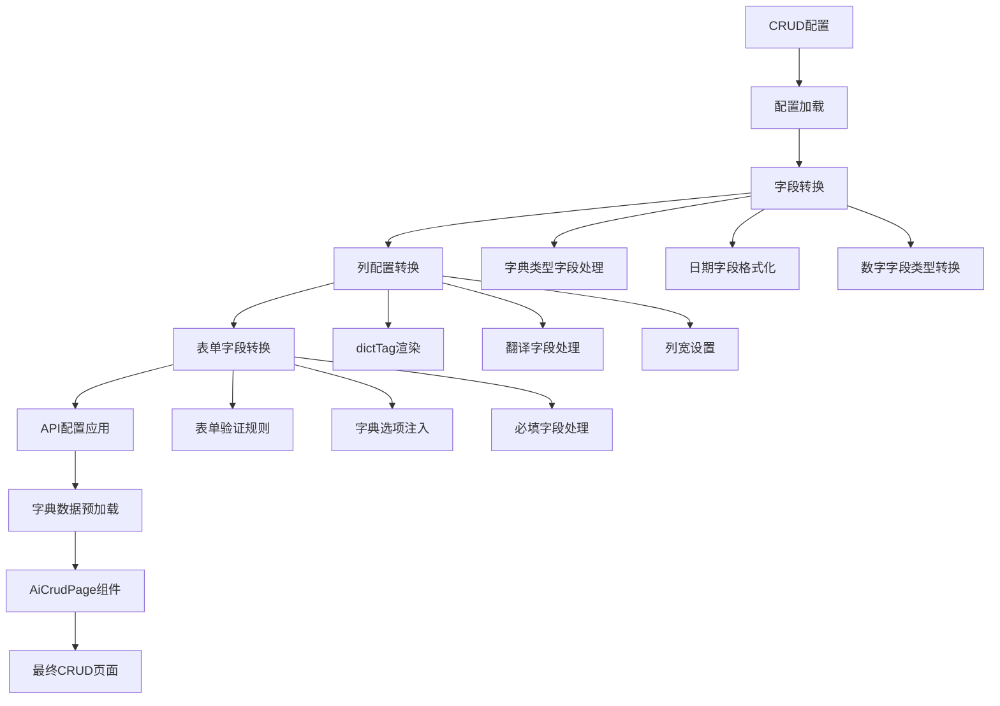

# AI CRUD生成器

<cite>
**本文档引用的文件**
- [2026-04-21-crud-generator-design.md](file://docs/superpowers/specs/2026-04-21-crud-generator-design.md)
- [crud-generator.vue](file://forge-admin-ui/src/views/ai/crud-generator.vue)
- [useCrudGenerator.js](file://forge-admin-ui/src/composables/useCrudGenerator.js)
- [crud-generator.js](file://forge-admin-ui/src/api/crud-generator.js)
- [SchemaFieldEditor.vue](file://forge-admin-ui/src/views/ai/components/SchemaFieldEditor.vue)
- [ApiConfigEditor.vue](file://forge-admin-ui/src/views/ai/components/ApiConfigEditor.vue)
- [DictConfigPanel.vue](file://forge-admin-ui/src/views/ai/components/DictConfigPanel.vue)
- [DesensitizeConfigPanel.vue](file://forge-admin-ui/src/views/ai/components/DesensitizeConfigPanel.vue)
- [EncryptConfigPanel.vue](file://forge-admin-ui/src/views/ai/components/EncryptConfigPanel.vue)
- [AiCrudPage.vue](file://forge-admin-ui/src/components/ai-form/AiCrudPage.vue)
- [crud-config.vue](file://forge-admin-ui/src/views/ai/crud-config.vue)
- [crud-page.vue](file://forge-admin-ui/src/views/ai/crud-page.vue)
- [ai.js](file://forge-admin-ui/src/api/ai.js)
</cite>

## 目录
1. [项目概述](#项目概述)
2. [系统架构](#系统架构)
3. [核心组件分析](#核心组件分析)
4. [AI CRUD生成器设计](#ai-crud生成器设计)
5. [前端组件详解](#前端组件详解)
6. [数据流分析](#数据流分析)
7. [性能考虑](#性能考虑)
8. [故障排除指南](#故障排除指南)
9. [总结](#总结)

## 项目概述

AI CRUD生成器是一个基于Vue 3和Naive UI构建的专业级AI驱动的CRUD页面配置生成系统。该项目旨在提供类似豆包/Cursor的AI生成体验，通过智能对话和可视化编辑器，帮助开发者快速生成完整的CRUD页面配置。

### 主要特性

- **智能对话生成**：支持流式分阶段输出，实时展示生成进度
- **可视化编辑器**：提供专门的配置编辑器，支持字段、表格、表单等配置
- **会话历史管理**：支持历史会话查看和管理
- **实时预览**：生成的配置可在线编辑和预览
- **多格式导出**：支持JSON格式导出和复制功能

## 系统架构

**图表来源**
- [crud-generator.vue:1-748](file://forge-admin-ui/src/views/ai/crud-generator.vue#L1-L748)
- [useCrudGenerator.js:1-676](file://forge-admin-ui/src/composables/useCrudGenerator.js#L1-L676)

## 核心组件分析

### useCrudGenerator组合式函数

useCrudGenerator是整个AI CRUD生成器的核心状态管理模块，负责管理生成器的所有状态和业务逻辑。

**图表来源**
- [useCrudGenerator.js:13-676](file://forge-admin-ui/src/composables/useCrudGenerator.js#L13-L676)
- [crud-generator.js:18-147](file://forge-admin-ui/src/api/crud-generator.js#L18-L147)

### SSE流式生成器

SSE（Server-Sent Events）流式生成器负责处理与后端的实时通信，支持断线重连和错误处理。

**图表来源**
- [crud-generator.js:18-135](file://forge-admin-ui/src/api/crud-generator.js#L18-L135)

**章节来源**
- [useCrudGenerator.js:1-676](file://forge-admin-ui/src/composables/useCrudGenerator.js#L1-L676)
- [crud-generator.js:1-147](file://forge-admin-ui/src/api/crud-generator.js#L1-L147)

## AI CRUD生成器设计

### 三栏布局设计

AI CRUD生成器采用创新的三栏布局设计，提供最佳的用户体验：

**图表来源**
- [2026-04-21-crud-generator-design.md:35-60](file://docs/superpowers/specs/2026-04-21-crud-generator-design.md#L35-L60)

### 流式分阶段输出

系统支持六种分阶段的流式输出，每种阶段都有明确的视觉反馈：

| 阶段 | 描述 | 视觉反馈 |
|------|------|----------|
| analyzing | 分析需求 | "正在分析需求..." |
| generating-meta | 推断元数据 | 显示configKey和表名 |
| generating-search | 生成搜索配置 | 实时显示searchSchema |
| generating-columns | 生成表格列配置 | 实时显示columnsSchema |
| generating-edit | 生成编辑表单配置 | 实时显示editSchema |
| generating-api | 生成API配置 | 实时显示apiConfig |
| generating-sql | 生成建表SQL | 实时显示createTableSql |

**章节来源**
- [2026-04-21-crud-generator-design.md:123-130](file://docs/superpowers/specs/2026-04-21-crud-generator-design.md#L123-L130)
- [useCrudGenerator.js:213-251](file://forge-admin-ui/src/composables/useCrudGenerator.js#L213-L251)

## 前端组件详解

### SchemaFieldEditor可视化编辑器

SchemaFieldEditor是专门用于字段配置的可视化编辑器，支持三种模式：

**图表来源**
- [SchemaFieldEditor.vue:1-552](file://forge-admin-ui/src/views/ai/components/SchemaFieldEditor.vue#L1-L552)

### API配置编辑器

API配置编辑器提供直观的RESTful API配置界面：

**图表来源**
- [ApiConfigEditor.vue:1-183](file://forge-admin-ui/src/views/ai/components/ApiConfigEditor.vue#L1-L183)

### 字典配置面板

字典配置面板支持字典类型的自动检测和批量管理：

**图表来源**
- [DictConfigPanel.vue:100-206](file://forge-admin-ui/src/views/ai/components/DictConfigPanel.vue#L100-L206)

**章节来源**
- [SchemaFieldEditor.vue:1-552](file://forge-admin-ui/src/views/ai/components/SchemaFieldEditor.vue#L1-L552)
- [ApiConfigEditor.vue:1-183](file://forge-admin-ui/src/views/ai/components/ApiConfigEditor.vue#L1-L183)
- [DictConfigPanel.vue:1-553](file://forge-admin-ui/src/views/ai/components/DictConfigPanel.vue#L1-L553)

## 数据流分析

### 生成流程

AI CRUD生成器的数据流遵循严格的处理顺序：

**图表来源**
- [useCrudGenerator.js:137-211](file://forge-admin-ui/src/composables/useCrudGenerator.js#L137-L211)
- [crud-generator.js:18-135](file://forge-admin-ui/src/api/crud-generator.js#L18-L135)

### 配置渲染流程

配置渲染流程展示了从配置到最终页面的完整转换过程：

**图表来源**
- [crud-page.vue:42-119](file://forge-admin-ui/src/views/ai/crud-page.vue#L42-L119)

**章节来源**
- [crud-generator.vue:1-748](file://forge-admin-ui/src/views/ai/crud-generator.vue#L1-L748)
- [crud-page.vue:1-235](file://forge-admin-ui/src/views/ai/crud-page.vue#L1-L235)

## 性能考虑

### 前端性能优化

AI CRUD生成器在前端层面采用了多项性能优化策略：

1. **虚拟滚动**：对于大量会话历史和字段配置，使用虚拟滚动技术提升渲染性能
2. **懒加载组件**：编辑器组件采用懒加载，减少初始包体积
3. **防抖处理**：输入验证和配置保存采用防抖机制，避免频繁的API调用
4. **内存管理**：及时清理SSE连接和定时器，防止内存泄漏

### 后端性能优化

后端服务同样注重性能优化：

1. **流式响应**：使用SSE实现流式响应，避免大响应体的内存占用
2. **连接池管理**：合理配置数据库连接池，提高并发处理能力
3. **缓存策略**：对常用配置和字典数据进行缓存
4. **异步处理**：长耗时任务采用异步处理，避免阻塞主线程

## 故障排除指南

### 常见问题及解决方案

| 问题类型 | 症状 | 可能原因 | 解决方案 |
|----------|------|----------|----------|
| SSE连接中断 | 生成过程中断 | 网络不稳定 | 自动重试机制，检查网络连接 |
| JSON解析失败 | 配置无法保存 | AI输出格式不规范 | 手动修复JSON格式或重新生成 |
| 编辑器加载慢 | Monaco编辑器初始化缓慢 | 库体积过大 | 使用CDN或懒加载 |
| 会话历史丢失 | 刷新后会话消失 | 本地存储问题 | 检查浏览器存储权限 |
| 配置渲染错误 | 页面显示异常 | 配置格式错误 | 检查配置JSON格式 |

### 调试技巧

1. **控制台调试**：利用浏览器开发者工具监控SSE连接状态
2. **网络面板**：检查SSE事件流的接收情况
3. **状态检查**：通过Vue DevTools检查useCrudGenerator的状态变化
4. **错误日志**：关注后端服务的日志输出，定位具体错误

**章节来源**
- [useCrudGenerator.js:426-431](file://forge-admin-ui/src/composables/useCrudGenerator.js#L426-L431)
- [crud-generator.js:111-129](file://forge-admin-ui/src/api/crud-generator.js#L111-L129)

## 总结

AI CRUD生成器是一个功能完整、用户体验优秀的AI驱动开发工具。通过智能对话、可视化编辑和实时预览，它大大提升了CRUD页面开发的效率和质量。

### 核心优势

1. **智能化生成**：基于AI的智能配置生成，减少重复劳动
2. **可视化编辑**：直观的配置编辑界面，降低学习成本
3. **实时反馈**：流式输出和实时预览，提供良好的交互体验
4. **灵活配置**：支持多种配置选项和自定义扩展
5. **完整生态**：从生成到渲染的完整开发流程支持

### 技术亮点

- 采用Vue 3 Composition API和TypeScript，确保代码质量和可维护性
- 使用Naive UI构建现代化的用户界面
- 实现了完整的SSE流式通信机制
- 提供丰富的可视化编辑器组件
- 支持多语言和国际化

AI CRUD生成器代表了现代Web开发工具的发展方向，通过AI技术的应用，显著提升了开发效率和用户体验。随着技术的不断演进，该系统将继续完善，为开发者提供更好的支持和服务。