# AI CRUD生成器

<cite>
**本文档引用的文件**
- [2026-04-21-crud-generator-design.md](file://docs/superpowers/specs/2026-04-21-crud-generator-design.md)
- [crud-generator.vue](file://forge-admin-ui/src/views/ai/crud-generator.vue)
- [useCrudGenerator.js](file://forge-admin-ui/src/composables/useCrudGenerator.js)
- [crud-generator.js](file://forge-admin-ui/src/api/crud-generator.js)
- [SchemaFieldEditor.vue](file://forge-admin-ui/src/views/ai/components/SchemaFieldEditor.vue)
- [ApiConfigEditor.vue](file://forge-admin-ui/src/views/ai/components/ApiConfigEditor.vue)
- [DictConfigPanel.vue](file://forge-admin-ui/src/views/ai/components/DictConfigPanel.vue)
- [DesensitizeConfigPanel.vue](file://forge-admin-ui/src/views/ai/components/DesensitizeConfigPanel.vue)
- [EncryptConfigPanel.vue](file://forge-admin-ui/src/views/ai/components/EncryptConfigPanel.vue)
- [AiCrudPage.vue](file://forge-admin-ui/src/components/ai-form/AiCrudPage.vue)
- [crud-config.vue](file://forge-admin-ui/src/views/ai/crud-config.vue)
- [crud-page.vue](file://forge-admin-ui/src/views/ai/crud-page.vue)
- [ai.js](file://forge-admin-ui/src/api/ai.js)
- [SimpleCrudTemplate.vue](file://forge-admin-ui/src/components/page-templates/SimpleCrudTemplate.vue)
- [TreeCrudTemplate.vue](file://forge-admin-ui/src/components/page-templates/TreeCrudTemplate.vue)
- [page-template.js](file://forge-admin-ui/src/api/page-template.js)
- [page-template.vue](file://forge-admin-ui/src/views/ai/page-template.vue)
- [catalog/index.js](file://forge-admin-ui/src/catalog/index.js)
- [AiPageTemplateController.java](file://forge/forge-framework/forge-plugin-parent/forge-plugin-generator/src/main/java/com/mdframe/forge/plugin/generator/controller/AiPageTemplateController.java)
- [AiPageTemplateService.java](file://forge/forge-framework/forge-plugin-parent/forge-plugin-generator/src/main/java/com/mdframe/forge/plugin/generator/service/AiPageTemplateService.java)
- [AiPageTemplate.java](file://forge/forge-framework/forge-plugin-parent/forge-plugin-generator/src/main/java/com/mdframe/forge/plugin/generator/domain/entity/AiPageTemplate.java)
</cite>

## 目录
1. [项目概述](#项目概述)
2. [系统架构](#系统架构)
3. [核心组件分析](#核心组件分析)
4. [AI CRUD生成器设计](#ai-crud生成器设计)
5. [页面模板管理功能](#页面模板管理功能)
6. [前端组件详解](#前端组件详解)
7. [数据流分析](#数据流分析)
8. [性能考虑](#性能考虑)
9. [故障排除指南](#故障排除指南)
10. [总结](#总结)

## 项目概述

AI CRUD生成器是一个基于Vue 3和Naive UI构建的专业级AI驱动的CRUD页面配置生成系统。该项目旨在提供类似豆包/Cursor的AI生成体验，通过智能对话和可视化编辑器，帮助开发者快速生成完整的CRUD页面配置。

**重大增强**：系统现已支持页面模板管理功能，包括标准CRUD模板和树形CRUD模板，为不同数据结构提供专门的页面布局和交互方式。

### 主要特性

- **智能对话生成**：支持流式分阶段输出，实时展示生成进度
- **可视化编辑器**：提供专门的配置编辑器，支持字段、表格、表单等配置
- **会话历史管理**：支持历史会话查看和管理
- **实时预览**：生成的配置可在线编辑和预览
- **多格式导出**：支持JSON格式导出和复制功能
- **页面模板管理**：支持标准CRUD和树形CRUD等多种页面模板
- **模板定制化**：可配置AI提示词约束、默认配置和Schema约束

## 系统架构

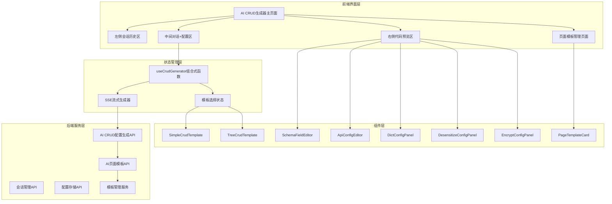

**图表来源**
- [crud-generator.vue:1-828](file://forge-admin-ui/src/views/ai/crud-generator.vue#L1-L828)
- [useCrudGenerator.js:1-676](file://forge-admin-ui/src/composables/useCrudGenerator.js#L1-L676)
- [page-template.vue:1-692](file://forge-admin-ui/src/views/ai/page-template.vue#L1-L692)

## 核心组件分析

### useCrudGenerator组合式函数

useCrudGenerator是整个AI CRUD生成器的核心状态管理模块，负责管理生成器的所有状态和业务逻辑。

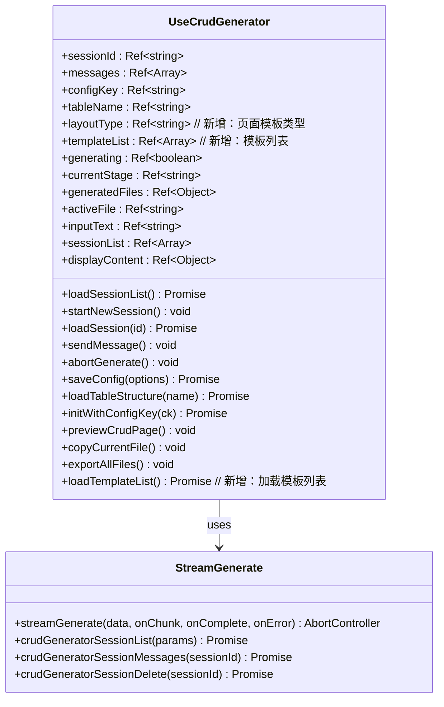

**图表来源**
- [useCrudGenerator.js:13-676](file://forge-admin-ui/src/composables/useCrudGenerator.js#L13-L676)
- [crud-generator.js:18-147](file://forge-admin-ui/src/api/crud-generator.js#L18-L147)

### 页面模板目录系统

页面模板目录系统负责将模板键映射到具体的Vue组件，支持动态异步加载。

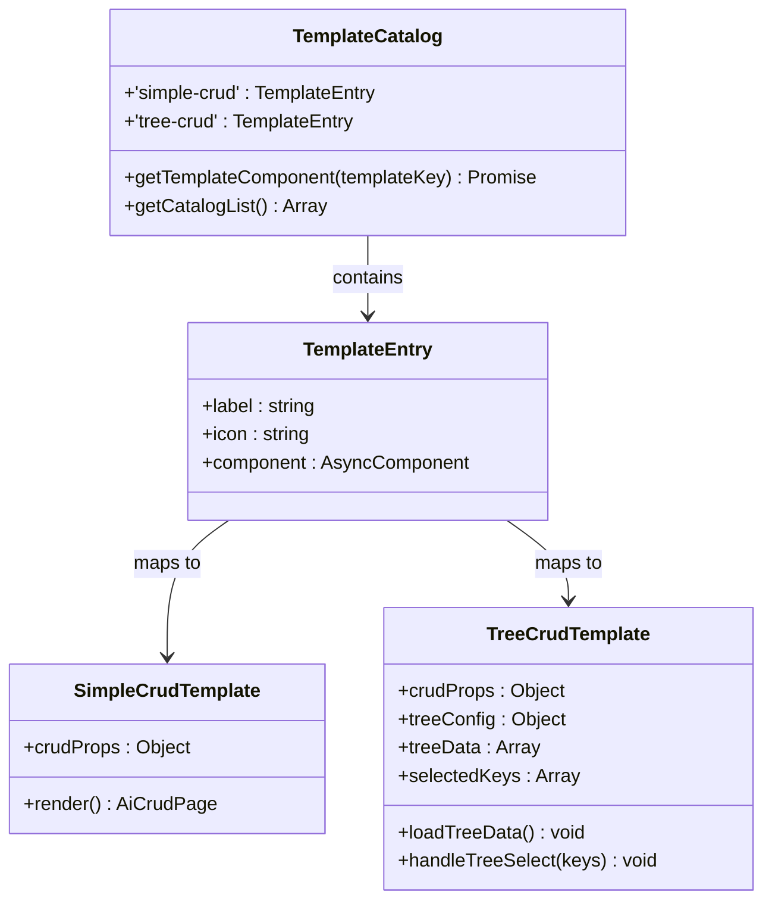

**图表来源**
- [catalog/index.js:1-54](file://forge-admin-ui/src/catalog/index.js#L1-L54)
- [SimpleCrudTemplate.vue:1-21](file://forge-admin-ui/src/components/page-templates/SimpleCrudTemplate.vue#L1-L21)
- [TreeCrudTemplate.vue:1-143](file://forge-admin-ui/src/components/page-templates/TreeCrudTemplate.vue#L1-L143)

**章节来源**
- [useCrudGenerator.js:1-676](file://forge-admin-ui/src/composables/useCrudGenerator.js#L1-L676)
- [crud-generator.js:1-147](file://forge-admin-ui/src/api/crud-generator.js#L1-L147)
- [catalog/index.js:1-54](file://forge-admin-ui/src/catalog/index.js#L1-L54)

## AI CRUD生成器设计

### 三栏布局设计

AI CRUD生成器采用创新的三栏布局设计，提供最佳的用户体验：

```mermaid
graph LR
subgraph "左侧会话历史区 (200px)"
A[历史会话列表]
B[新建会话按钮]
C[会话删除功能]
end
subgraph "中间对话+配置区"
D[顶部配置区]
E[对话消息列表]
F[底部输入区]
G[模板选择区域] // 新增
end
subgraph "右侧代码预览区 (400px)"
H[文件树导航]
I[代码编辑器]
J[操作按钮区]
end
A --> D
D --> G
E --> H
F --> J
G --> H
```

**图表来源**
- [2026-04-21-crud-generator-design.md:35-60](file://docs/superpowers/specs/2026-04-21-crud-generator-design.md#L35-L60)

### 流式分阶段输出

系统支持六种分阶段的流式输出，每种阶段都有明确的视觉反馈：

| 阶段 | 描述 | 视觉反馈 |
|------|------|----------|
| analyzing | 分析需求 | "正在分析需求..." |
| generating-meta | 推断元数据 | 显示configKey和表名 |
| generating-search | 生成搜索配置 | 实时显示searchSchema |
| generating-columns | 生成表格列配置 | 实时显示columnsSchema |
| generating-edit | 生成编辑表单配置 | 实时显示editSchema |
| generating-api | 生成API配置 | 实时显示apiConfig |
| generating-sql | 生成建表SQL | 实时显示createTableSql |

### 页面模板选择机制

新增的页面模板选择功能允许用户在生成CRUD配置时选择合适的页面布局：

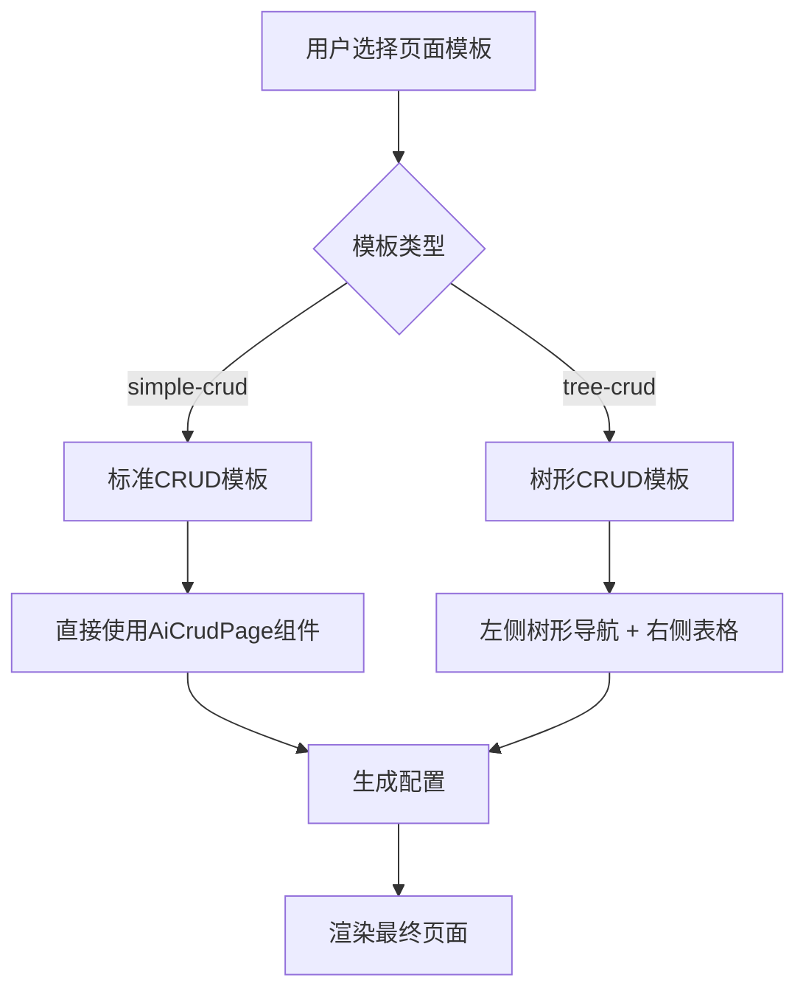

**图表来源**
- [crud-generator.vue:57-77](file://forge-admin-ui/src/views/ai/crud-generator.vue#L57-L77)

**章节来源**
- [2026-04-21-crud-generator-design.md:123-130](file://docs/superpowers/specs/2026-04-21-crud-generator-design.md#L123-L130)
- [useCrudGenerator.js:213-251](file://forge-admin-ui/src/composables/useCrudGenerator.js#L213-L251)

## 页面模板管理功能

### 模板类型

系统目前支持两种主要的页面模板类型：

#### 标准CRUD模板 (simple-crud)
- **适用场景**：平坦型数据的属性增删改查
- **布局特点**：单一页面，支持搜索、表格列表、弹窗/抽屉表单编辑
- **配置特点**：简洁明了，适合大多数常规业务场景

#### 树形CRUD模板 (tree-crud)
- **适用场景**：具有父子层级结构的数据（如部门、分类、组织架构）
- **布局特点**：左侧树形导航 + 右侧标准CRUD表格
- **配置特点**：支持树形数据的筛选和操作，自动注入父节点过滤

### 模板管理界面

页面模板管理界面提供了完整的模板生命周期管理：

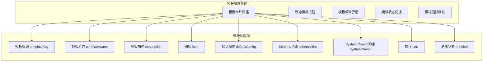

**图表来源**
- [page-template.vue:21-109](file://forge-admin-ui/src/views/ai/page-template.vue#L21-L109)
- [page-template.vue:127-223](file://forge-admin-ui/src/views/ai/page-template.vue#L127-L223)

### 后端模板服务

后端提供了完整的模板管理服务，支持模板的增删改查和状态管理：

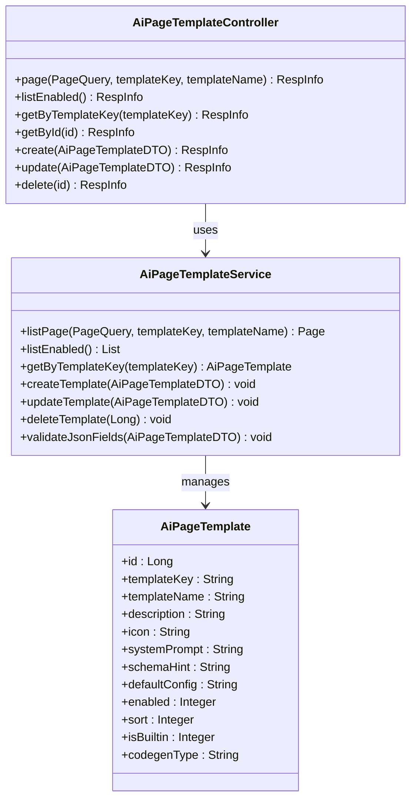

**图表来源**
- [AiPageTemplateController.java:1-76](file://forge/forge-framework/forge-plugin-parent/forge-plugin-generator/src/main/java/com/mdframe/forge/plugin/generator/controller/AiPageTemplateController.java#L1-L76)
- [AiPageTemplateService.java:1-136](file://forge/forge-framework/forge-plugin-parent/forge-plugin-generator/src/main/java/com/mdframe/forge/plugin/generator/service/AiPageTemplateService.java#L1-L136)
- [AiPageTemplate.java:1-54](file://forge/forge-framework/forge-plugin-parent/forge-plugin-generator/src/main/java/com/mdframe/forge/plugin/generator/domain/entity/AiPageTemplate.java#L1-L54)

**章节来源**
- [page-template.vue:1-692](file://forge-admin-ui/src/views/ai/page-template.vue#L1-L692)
- [AiPageTemplateController.java:1-76](file://forge/forge-framework/forge-plugin-parent/forge-plugin-generator/src/main/java/com/mdframe/forge/plugin/generator/controller/AiPageTemplateController.java#L1-L76)
- [AiPageTemplateService.java:1-136](file://forge/forge-framework/forge-plugin-parent/forge-plugin-generator/src/main/java/com/mdframe/forge/plugin/generator/service/AiPageTemplateService.java#L1-L136)
- [AiPageTemplate.java:1-54](file://forge/forge-framework/forge-plugin-parent/forge-plugin-generator/src/main/java/com/mdframe/forge/plugin/generator/domain/entity/AiPageTemplate.java#L1-L54)

## 前端组件详解

### SimpleCrudTemplate组件

SimpleCrudTemplate是最简单的页面模板实现，直接复用标准的AiCrudPage组件：

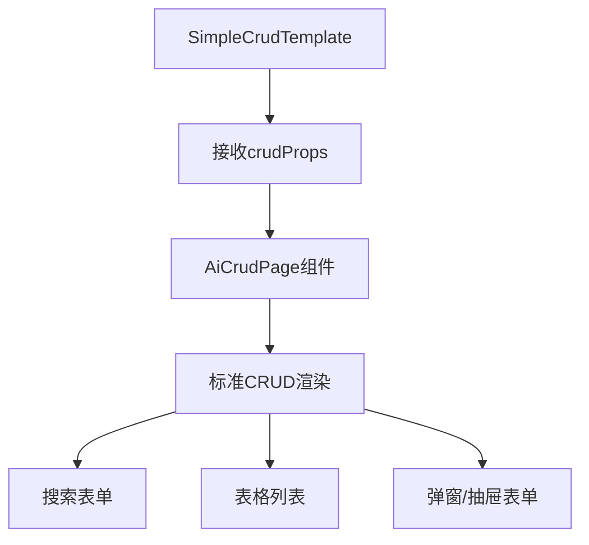

**图表来源**
- [SimpleCrudTemplate.vue:1-21](file://forge-admin-ui/src/components/page-templates/SimpleCrudTemplate.vue#L1-L21)

### TreeCrudTemplate组件

TreeCrudTemplate实现了复杂的树形布局，支持左侧树形导航和右侧表格的联动：

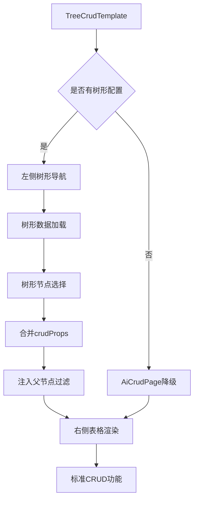

**图表来源**
- [TreeCrudTemplate.vue:1-143](file://forge-admin-ui/src/components/page-templates/TreeCrudTemplate.vue#L1-L143)

### API配置编辑器

API配置编辑器提供直观的RESTful API配置界面：

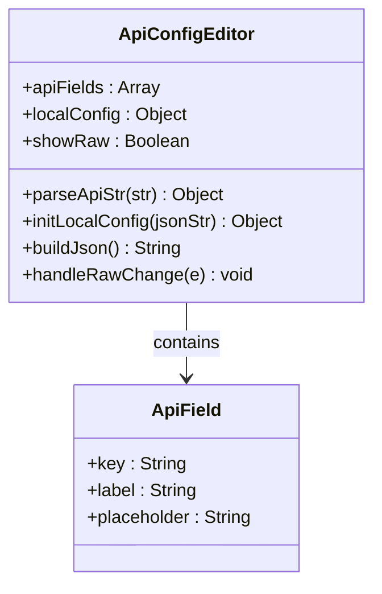

**图表来源**
- [ApiConfigEditor.vue:1-183](file://forge-admin-ui/src/views/ai/components/ApiConfigEditor.vue#L1-L183)

### 字典配置面板

字典配置面板支持字典类型的自动检测和批量管理：

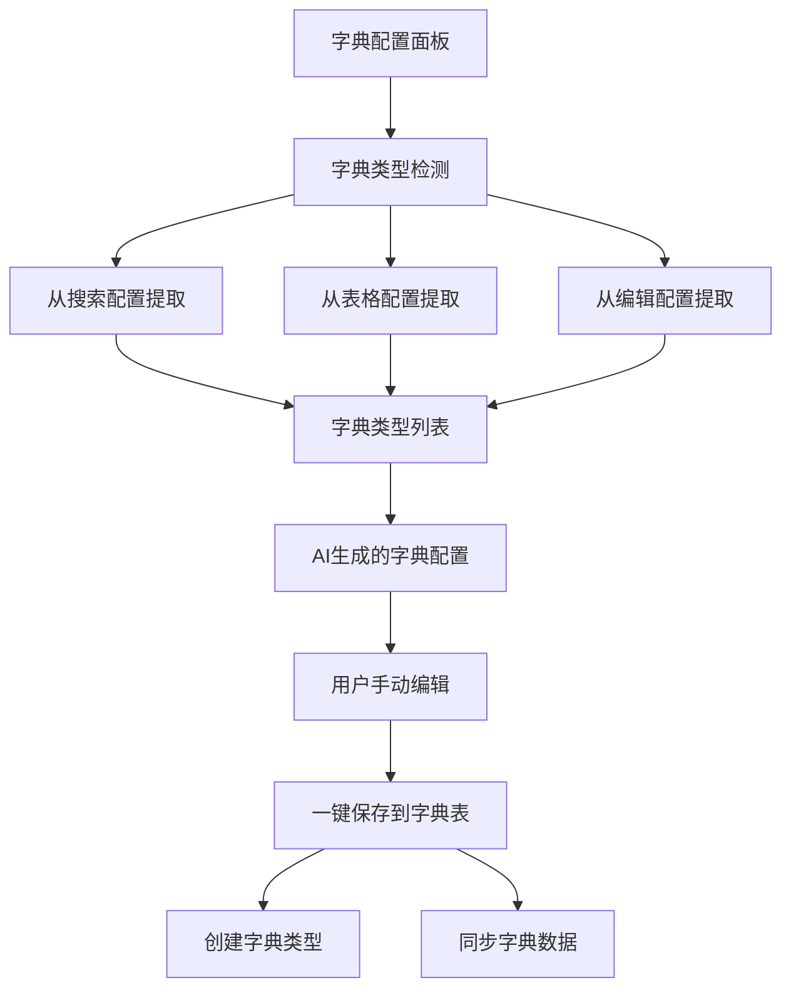

**图表来源**
- [DictConfigPanel.vue:100-206](file://forge-admin-ui/src/views/ai/components/DictConfigPanel.vue#L100-L206)

**章节来源**
- [SimpleCrudTemplate.vue:1-21](file://forge-admin-ui/src/components/page-templates/SimpleCrudTemplate.vue#L1-L21)
- [TreeCrudTemplate.vue:1-143](file://forge-admin-ui/src/components/page-templates/TreeCrudTemplate.vue#L1-L143)
- [ApiConfigEditor.vue:1-183](file://forge-admin-ui/src/views/ai/components/ApiConfigEditor.vue#L1-L183)
- [DictConfigPanel.vue:1-553](file://forge-admin-ui/src/views/ai/components/DictConfigPanel.vue#L1-L553)

## 数据流分析

### 生成流程

AI CRUD生成器的数据流遵循严格的处理顺序：

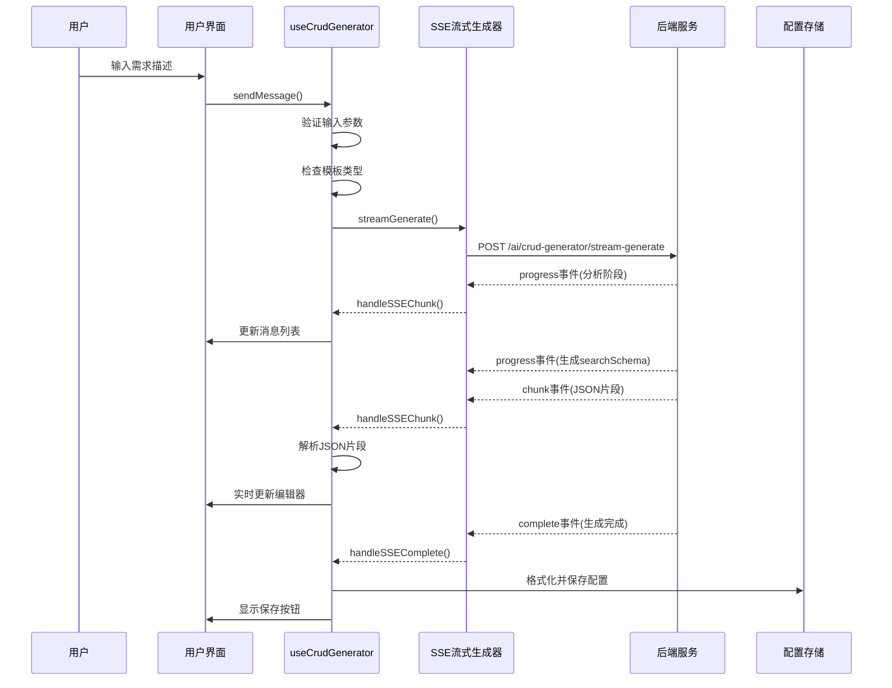

**图表来源**
- [useCrudGenerator.js:137-211](file://forge-admin-ui/src/composables/useCrudGenerator.js#L137-L211)
- [crud-generator.js:18-135](file://forge-admin-ui/src/api/crud-generator.js#L18-L135)

### 模板渲染流程

模板渲染流程展示了从模板选择到最终页面渲染的完整过程：

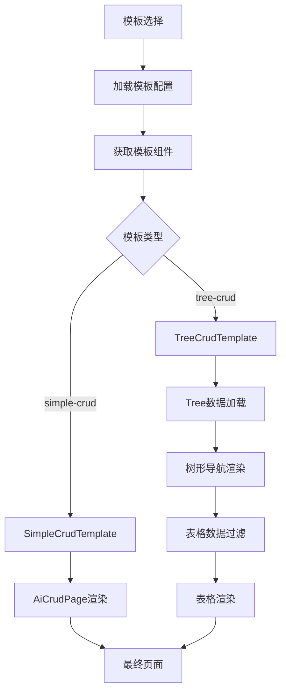

**图表来源**
- [crud-page.vue:186-227](file://forge-admin-ui/src/views/ai/crud-page.vue#L186-L227)
- [catalog/index.js:34-41](file://forge-admin-ui/src/catalog/index.js#L34-L41)

### 配置渲染流程

配置渲染流程展示了从配置到最终页面的完整转换过程：

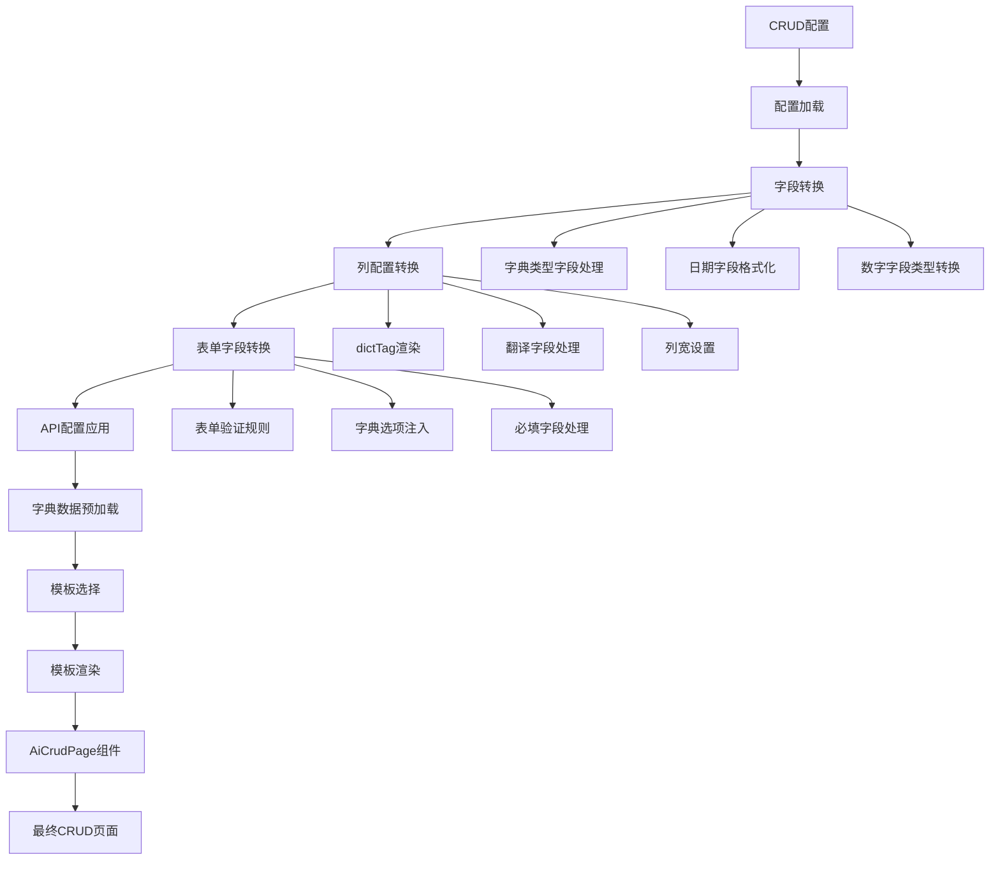

**图表来源**
- [crud-page.vue:42-119](file://forge-admin-ui/src/views/ai/crud-page.vue#L42-L119)

**章节来源**
- [crud-generator.vue:1-828](file://forge-admin-ui/src/views/ai/crud-generator.vue#L1-L828)
- [crud-page.vue:1-235](file://forge-admin-ui/src/views/ai/crud-page.vue#L1-L235)

## 性能考虑

### 前端性能优化

AI CRUD生成器在前端层面采用了多项性能优化策略：

1. **虚拟滚动**：对于大量会话历史和字段配置，使用虚拟滚动技术提升渲染性能
2. **懒加载组件**：编辑器组件采用懒加载，减少初始包体积
3. **防抖处理**：输入验证和配置保存采用防抖机制，避免频繁的API调用
4. **内存管理**：及时清理SSE连接和定时器，防止内存泄漏
5. **模板异步加载**：页面模板采用异步组件加载，减少首屏负担

### 后端性能优化

后端服务同样注重性能优化：

1. **流式响应**：使用SSE实现流式响应，避免大响应体的内存占用
2. **连接池管理**：合理配置数据库连接池，提高并发处理能力
3. **缓存策略**：对常用配置和字典数据进行缓存
4. **异步处理**：长耗时任务采用异步处理，避免阻塞主线程
5. **模板缓存**：页面模板配置进行缓存，减少重复查询

## 故障排除指南

### 常见问题及解决方案

| 问题类型 | 症状 | 可能原因 | 解决方案 |
|----------|------|----------|----------|
| SSE连接中断 | 生成过程中断 | 网络不稳定 | 自动重试机制，检查网络连接 |
| JSON解析失败 | 配置无法保存 | AI输出格式不规范 | 手动修复JSON格式或重新生成 |
| 编辑器加载慢 | Monaco编辑器初始化缓慢 | 库体积过大 | 使用CDN或懒加载 |
| 会话历史丢失 | 刷新后会话消失 | 本地存储问题 | 检查浏览器存储权限 |
| 配置渲染错误 | 页面显示异常 | 配置格式错误 | 检查配置JSON格式 |
| 模板加载失败 | 页面模板无法显示 | 模板组件未注册 | 检查模板目录配置 |
| 树形数据错误 | 树形CRUD显示异常 | API配置不正确 | 检查tree接口配置 |

### 调试技巧

1. **控制台调试**：利用浏览器开发者工具监控SSE连接状态
2. **网络面板**：检查SSE事件流的接收情况
3. **状态检查**：通过Vue DevTools检查useCrudGenerator的状态变化
4. **错误日志**：关注后端服务的日志输出，定位具体错误
5. **模板调试**：检查模板目录中的组件注册情况

**章节来源**
- [useCrudGenerator.js:426-431](file://forge-admin-ui/src/composables/useCrudGenerator.js#L426-L431)
- [crud-generator.js:111-129](file://forge-admin-ui/src/api/crud-generator.js#L111-L129)

## 总结

AI CRUD生成器经过重大增强，现已发展为一个功能完整、模板化的专业级AI驱动开发工具。通过智能对话、可视化编辑、实时预览和页面模板管理，它大大提升了CRUD页面开发的效率和质量。

### 核心优势

1. **智能化生成**：基于AI的智能配置生成，减少重复劳动
2. **可视化编辑**：直观的配置编辑界面，降低学习成本
3. **实时反馈**：流式输出和实时预览，提供良好的交互体验
4. **灵活配置**：支持多种配置选项和自定义扩展
5. **完整生态**：从生成到渲染的完整开发流程支持
6. **模板化设计**：支持标准CRUD和树形CRUD等多种页面模板
7. **可定制化**：模板可配置AI提示词约束、默认配置和Schema约束

### 技术亮点

- 采用Vue 3 Composition API和TypeScript，确保代码质量和可维护性
- 使用Naive UI构建现代化的用户界面
- 实现了完整的SSE流式通信机制
- 提供丰富的可视化编辑器组件
- 支持多语言和国际化
- 实现了完整的页面模板管理系统
- 支持树形数据的专用页面模板

AI CRUD生成器代表了现代Web开发工具的发展方向，通过AI技术和模板化设计的应用，显著提升了开发效率和用户体验。随着技术的不断演进，该系统将继续完善，为开发者提供更好的支持和服务。