# AI数据大屏

<cite>
**本文引用的文件**
- [ContentConfigurations/index.vue](file://forge-report-ui/src/views/chart/ContentConfigurations/index.vue)
- [ChartSetting/index.vue](file://forge-report-ui/src/views/chart/ContentConfigurations/components/ChartSetting/index.vue)
- [CanvasPage/index.vue](file://forge-report-ui/src/views/chart/ContentConfigurations/components/CanvasPage/index.vue)
- [ChartsSearch/index.vue](file://forge-report-ui/src/views/chart/ContentCharts/components/ChartsSearch/index.vue)
- [packages/index.ts](file://forge-report-ui/src/packages/index.ts)
- [components/FgAI/componentRegistry.ts](file://forge-report-ui/src/components/FgAI/componentRegistry.ts)
- [components/FgAI/aiEngine.ts](file://forge-report-ui/src/components/FgAI/aiEngine.ts)
- [hooks/useSync.hook.ts](file://forge-report-ui/src/views/chart/hooks/useSync.hook.ts)
- [utils/reportPages.ts](file://forge-report-ui/src/utils/reportPages.ts)
- [api/data/dataset.ts](file://forge-admin-ui/src/api/data/dataset.ts)
- [DataDatasetRuntimeService.java](file://forge-server/forge-framework/forge-plugin-parent/forge-plugin-data/src/main/java/com/mdframe/forge/plugin/data/service/DataDatasetRuntimeService.java)
- [FgVChart/register.ts](file://forge-report-ui/src/components/FgVChart/register.ts)
- [dashboard-generate-record.vue](file://forge-admin-ui/src/views/ai/dashboard-generate-record.vue)
- [stats-dashboard.vue](file://forge-admin-ui/src/views/app-center/stats-dashboard.vue)
</cite>

## 目录
1. [简介](#简介)
2. [项目结构](#项目结构)
3. [核心组件](#核心组件)
4. [架构总览](#架构总览)
5. [详细组件分析](#详细组件分析)
6. [依赖关系分析](#依赖关系分析)
7. [性能考虑](#性能考虑)
8. [故障排查指南](#故障排查指南)
9. [结论](#结论)
10. [附录](#附录)

## 简介
本文件为 Forge Admin 的“AI数据大屏”提供系统化、可落地的技术文档。内容覆盖可视化编辑器实现原理、图表组件体系、数据绑定机制、响应式布局、数据源连接与数据集管理、图表样式定制与交互效果设置，以及大屏发布预览、模板市场、组件开发规范、性能优化策略与部署运维监控方案。读者可据此快速理解并高效使用或扩展该能力。

## 项目结构
本项目由前后端协同构成：
- 前端（报表/大屏）：位于 forge-report-ui，包含可视化画布、组件库、配置面板、事件与动画、主题与渲染等。
- 前端（管理控制台）：位于 forge-admin-ui，提供数据源、数据集、分类、权限、行级范围、预览与运行时查询等管理能力。
- 后端：位于 forge-server，提供数据集运行期服务、查询执行器、元数据装配等能力。

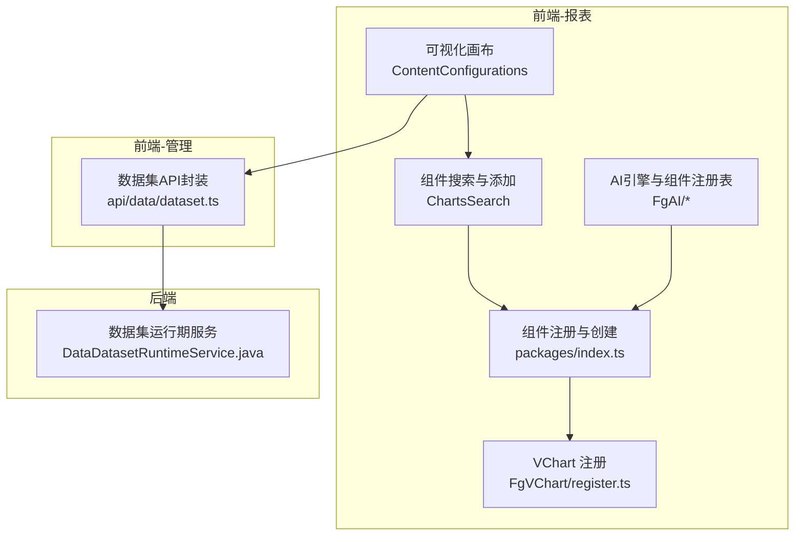

**图示来源**
- [ContentConfigurations/index.vue:1-200](file://forge-report-ui/src/views/chart/ContentConfigurations/index.vue#L1-L200)
- [ChartsSearch/index.vue:151-197](file://forge-report-ui/src/views/chart/ContentCharts/components/ChartsSearch/index.vue#L151-L197)
- [packages/index.ts:32-71](file://forge-report-ui/src/packages/index.ts#L32-L71)
- [components/FgAI/componentRegistry.ts:147-203](file://forge-report-ui/src/components/FgAI/componentRegistry.ts#L147-L203)
- [components/FgAI/aiEngine.ts:158-193](file://forge-report-ui/src/components/FgAI/aiEngine.ts#L158-L193)
- [FgVChart/register.ts:1-28](file://forge-report-ui/src/components/FgVChart/register.ts#L1-L28)
- [api/data/dataset.ts:138-219](file://forge-admin-ui/src/api/data/dataset.ts#L138-L219)
- [DataDatasetRuntimeService.java:1-32](file://forge-server/forge-framework/forge-plugin-parent/forge-plugin-data/src/main/java/com/mdframe/forge/plugin/data/service/DataDatasetRuntimeService.java#L1-L32)

**章节来源**
- [ContentConfigurations/index.vue:1-200](file://forge-report-ui/src/views/chart/ContentConfigurations/index.vue#L1-L200)
- [ChartsSearch/index.vue:151-197](file://forge-report-ui/src/views/chart/ContentCharts/components/ChartsSearch/index.vue#L151-L197)
- [packages/index.ts:32-71](file://forge-report-ui/src/packages/index.ts#L32-L71)
- [components/FgAI/componentRegistry.ts:147-203](file://forge-report-ui/src/components/FgAI/componentRegistry.ts#L147-L203)
- [components/FgAI/aiEngine.ts:158-193](file://forge-report-ui/src/components/FgAI/aiEngine.ts#L158-L193)
- [FgVChart/register.ts:1-28](file://forge-report-ui/src/components/FgVChart/register.ts#L1-L28)
- [api/data/dataset.ts:138-219](file://forge-admin-ui/src/api/data/dataset.ts#L138-L219)
- [DataDatasetRuntimeService.java:1-32](file://forge-server/forge-framework/forge-plugin-parent/forge-plugin-data/src/main/java/com/mdframe/forge/plugin/data/service/DataDatasetRuntimeService.java#L1-L32)

## 核心组件
- 可视化编辑器
  - 画布与页面：支持尺寸、缩放、锁定比例、适配视图等操作。
  - 组件设置：名称、几何属性、外观（滤镜/透明度/变换）、组件专属配置。
  - 图层与分组：支持分组、层级管理与状态展示。
  - 工具栏与快捷键：对齐线、选择框、历史记录、水印等。
- 组件库管理
  - 动态注册与缓存：按包/分类/键名懒加载，提升首屏与切换速度。
  - 统一注册表：聚合图表、信息、表格、装饰、图片、图标等类别。
  - VChart 生态：按需注册图表类型、组件与动画。
- 数据源与数据集
  - 数据源连接：在管理端配置连接后，通过数据集暴露字段与查询能力。
  - 数据集管理：分页、预览、同步字段、发布/下线、分类管理、运行时查询。
  - 运行时服务：后端提供查询执行、元数据装配、访问控制与结果返回。
- 模板市场
  - 应用中心模板面板：支持官方模板浏览、启用与源码交付模式。
- 大屏发布与预览
  - 编辑态保存与同步：组件列表、全局请求配置、画布配置的归一化与持久化。
  - 预览态渲染：根据存储模型重建组件实例并渲染。

**章节来源**
- [CanvasPage/index.vue:1-38](file://forge-report-ui/src/views/chart/ContentConfigurations/components/CanvasPage/index.vue#L1-L38)
- [ChartSetting/index.vue:1-108](file://forge-report-ui/src/views/chart/ContentConfigurations/components/ChartSetting/index.vue#L1-L108)
- [packages/index.ts:32-71](file://forge-report-ui/src/packages/index.ts#L32-L71)
- [components/FgAI/componentRegistry.ts:147-203](file://forge-report-ui/src/components/FgAI/componentRegistry.ts#L147-L203)
- [FgVChart/register.ts:1-28](file://forge-report-ui/src/components/FgVChart/register.ts#L1-L28)
- [api/data/dataset.ts:138-219](file://forge-admin-ui/src/api/data/dataset.ts#L138-L219)
- [DataDatasetRuntimeService.java:1-32](file://forge-server/forge-framework/forge-plugin-parent/forge-plugin-data/src/main/java/com/mdframe/forge/plugin/data/service/DataDatasetRuntimeService.java#L1-L32)
- [AppMarketPanel.vue:22-161](file://forge-admin-ui/src/views/app-center/components/AppMarketPanel.vue#L22-L161)

## 架构总览
下图展示了从用户操作到数据渲染的关键链路：用户在可视化编辑器中添加图表组件，系统动态注册并创建组件实例；组件通过数据集进行数据绑定，调用后端运行期服务获取数据；最终在画布中渲染并支持交互与联动。

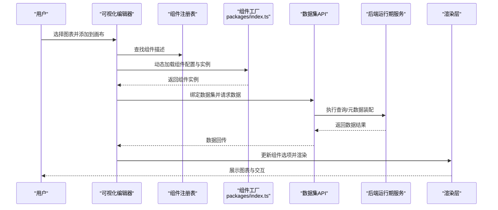

**图示来源**
- [ChartsSearch/index.vue:151-197](file://forge-report-ui/src/views/chart/ContentCharts/components/ChartsSearch/index.vue#L151-L197)
- [packages/index.ts:32-71](file://forge-report-ui/src/packages/index.ts#L32-L71)
- [components/FgAI/componentRegistry.ts:147-203](file://forge-report-ui/src/components/FgAI/componentRegistry.ts#L147-L203)
- [api/data/dataset.ts:138-219](file://forge-admin-ui/src/api/data/dataset.ts#L138-L219)
- [DataDatasetRuntimeService.java:1-32](file://forge-server/forge-framework/forge-plugin-parent/forge-plugin-data/src/main/java/com/mdframe/forge/plugin/data/service/DataDatasetRuntimeService.java#L1-L32)

## 详细组件分析

### 可视化编辑器：画布与页面配置
- 画布尺寸与缩放：支持宽度、高度输入与校验，锁定比例时禁止修改，提供“适配视图”按钮以调整显示。
- 页面配置：维护画布配置对象，包括尺寸、缩放、锁定等状态，供其他模块读取。
- 响应式行为：结合缩放与视口计算，保证在不同屏幕下布局一致。

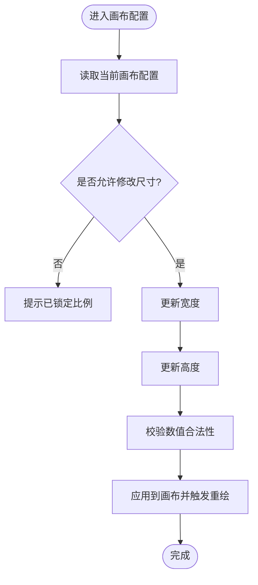

**图示来源**
- [CanvasPage/index.vue:1-38](file://forge-report-ui/src/views/chart/ContentConfigurations/components/CanvasPage/index.vue#L1-L38)

**章节来源**
- [CanvasPage/index.vue:1-38](file://forge-report-ui/src/views/chart/ContentConfigurations/components/CanvasPage/index.vue#L1-L38)

### 可视化编辑器：组件设置面板
- 基础设置：名称、几何属性（位置、尺寸）。
- 外观设置：滤镜、透明度、变换等视觉样式。
- 组件专属配置：根据组件类型动态挂载对应配置项。
- 目标数据绑定：通过 Hook 获取当前选中组件的数据结构与配置上下文。

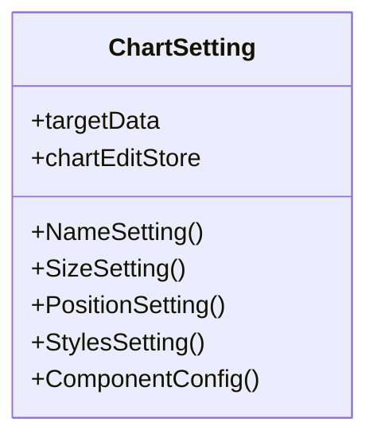

**图示来源**
- [ChartSetting/index.vue:1-108](file://forge-report-ui/src/views/chart/ContentConfigurations/components/ChartSetting/index.vue#L1-L108)

**章节来源**
- [ChartSetting/index.vue:1-108](file://forge-report-ui/src/views/chart/ContentConfigurations/components/ChartSetting/index.vue#L1-L108)

### 组件库管理：动态注册与创建
- 懒加载与缓存：按包/分类/键名构建唯一键，首次加载后缓存，避免重复网络请求。
- 组件创建：根据配置类型生成组件实例，支持重定向组件（如图片/图标库）。
- 组件安装：将图表组件与配置组件安装至全局 Vue 实例，便于后续渲染与配置。

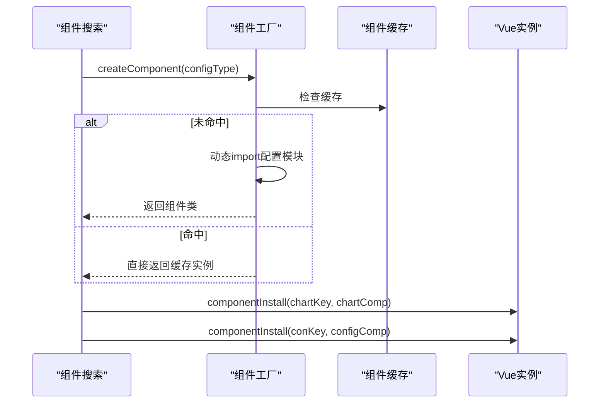

**图示来源**
- [packages/index.ts:32-71](file://forge-report-ui/src/packages/index.ts#L32-L71)
- [ChartsSearch/index.vue:151-197](file://forge-report-ui/src/views/chart/ContentCharts/components/ChartsSearch/index.vue#L151-L197)

**章节来源**
- [packages/index.ts:32-71](file://forge-report-ui/src/packages/index.ts#L32-L71)
- [ChartsSearch/index.vue:151-197](file://forge-report-ui/src/views/chart/ContentCharts/components/ChartsSearch/index.vue#L151-L197)

### 组件注册表与AI引擎集成
- 组件注册表：聚合多类组件（图表、信息、表格、装饰、图片、图标），构建扁平映射，便于AI与编辑器统一检索。
- AI引擎：根据配置类型动态注册并创建组件实例，智能合并 option 与数据集请求参数，支持重定向组件场景。

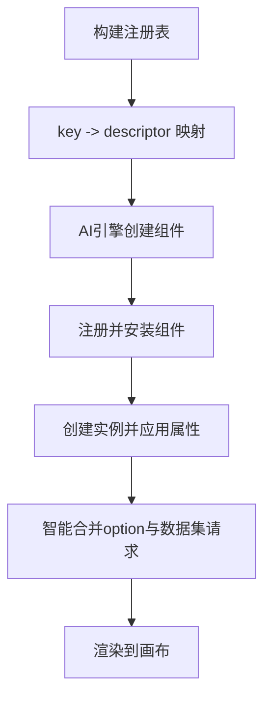

**图示来源**
- [components/FgAI/componentRegistry.ts:147-203](file://forge-report-ui/src/components/FgAI/componentRegistry.ts#L147-L203)
- [components/FgAI/aiEngine.ts:158-193](file://forge-report-ui/src/components/FgAI/aiEngine.ts#L158-L193)

**章节来源**
- [components/FgAI/componentRegistry.ts:147-203](file://forge-report-ui/src/components/FgAI/componentRegistry.ts#L147-L203)
- [components/FgAI/aiEngine.ts:158-193](file://forge-report-ui/src/components/FgAI/aiEngine.ts#L158-L193)

### 数据源连接与数据集管理
- 数据集API：提供分页、详情、创建/更新/删除、发布/下线、字段同步、预览、元数据获取、分类树、运行时查询等接口。
- 运行时服务：后端服务组合数据集服务、访问控制、连接服务、字段服务与查询执行器，提供可用数据集列表与查询能力。

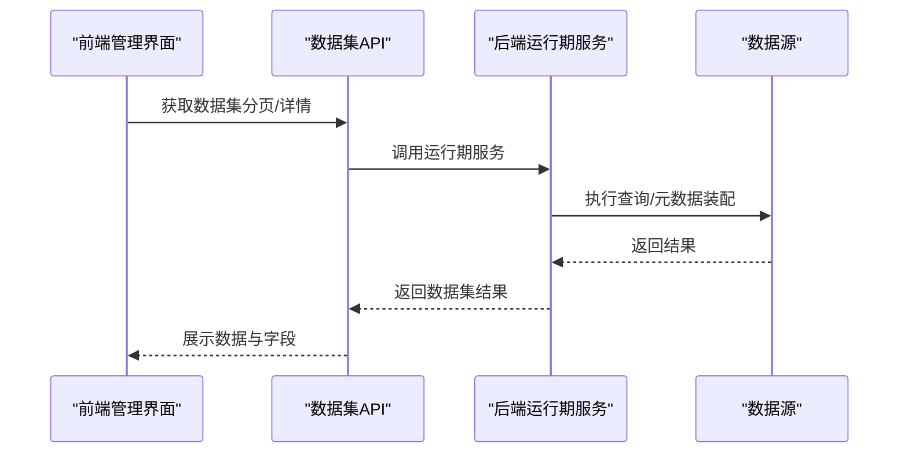

**图示来源**
- [api/data/dataset.ts:138-219](file://forge-admin-ui/src/api/data/dataset.ts#L138-L219)
- [DataDatasetRuntimeService.java:1-32](file://forge-server/forge-framework/forge-plugin-parent/forge-plugin-data/src/main/java/com/mdframe/forge/plugin/data/service/DataDatasetRuntimeService.java#L1-L32)

**章节来源**
- [api/data/dataset.ts:138-219](file://forge-admin-ui/src/api/data/dataset.ts#L138-L219)
- [DataDatasetRuntimeService.java:1-32](file://forge-server/forge-framework/forge-plugin-parent/forge-plugin-data/src/main/java/com/mdframe/forge/plugin/data/service/DataDatasetRuntimeService.java#L1-L32)

### 图表样式定制与交互效果
- 样式定制：通过外观设置面板统一配置滤镜、透明度、变换等，支持分组与单个组件差异化。
- 交互效果：基于事件系统与动作配置，支持点击、悬停、联动等交互；可通过高级事件与自定义动作扩展。
- 主题与渲染：VChart 注册图表类型、组件与动画，确保一致的交互体验。

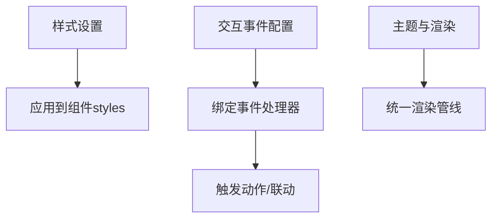

**图示来源**
- [ChartSetting/index.vue:1-108](file://forge-report-ui/src/views/chart/ContentConfigurations/components/ChartSetting/index.vue#L1-L108)
- [FgVChart/register.ts:1-28](file://forge-report-ui/src/components/FgVChart/register.ts#L1-L28)

**章节来源**
- [ChartSetting/index.vue:1-108](file://forge-report-ui/src/views/chart/ContentConfigurations/components/ChartSetting/index.vue#L1-L108)
- [FgVChart/register.ts:1-28](file://forge-report-ui/src/components/FgVChart/register.ts#L1-L28)

### 大屏发布与预览
- 编辑态保存：归一化画布配置、全局请求配置与组件列表，确保数据结构稳定。
- 预览态渲染：根据存储模型重建组件实例，动态注册并渲染，保持与编辑态一致。
- 同步与加载：异步加载组件与子分组，逐步更新进度，提升大项目加载体验。

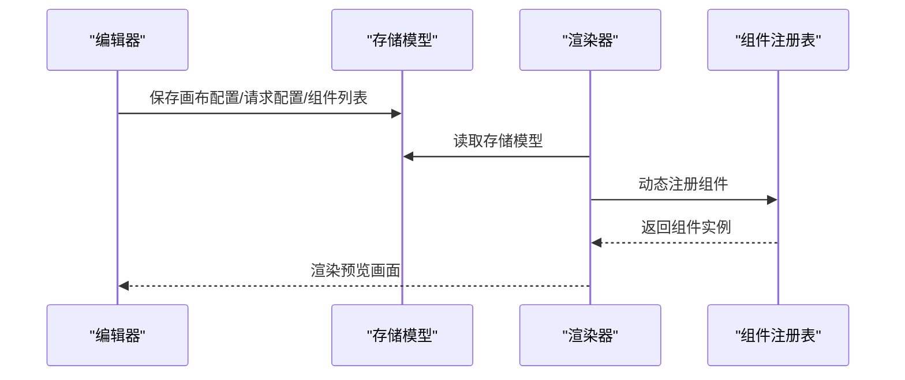

**图示来源**
- [utils/reportPages.ts:203-229](file://forge-report-ui/src/utils/reportPages.ts#L203-L229)
- [hooks/useSync.hook.ts:116-192](file://forge-report-ui/src/views/chart/hooks/useSync.hook.ts#L116-L192)

**章节来源**
- [utils/reportPages.ts:203-229](file://forge-report-ui/src/utils/reportPages.ts#L203-L229)
- [hooks/useSync.hook.ts:116-192](file://forge-report-ui/src/views/chart/hooks/useSync.hook.ts#L116-L192)

### 模板市场与应用中心
- 模板面板：展示官方模板卡片，支持在线启用与源码交付两种模式。
- 业务报表看板：按业务单元展示数量、阶段、金额、流程结果与趋势，支持周期筛选与指标自动识别。

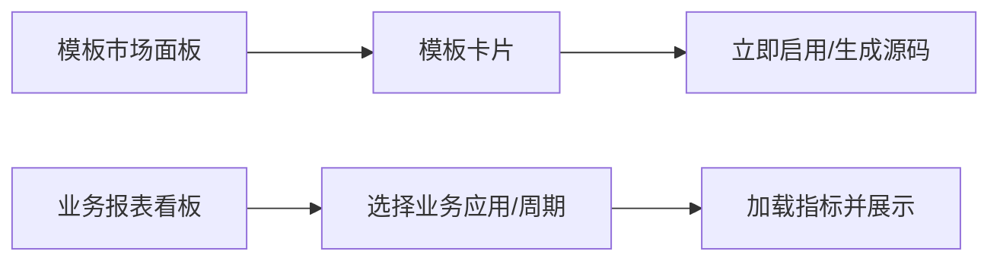

**图示来源**
- [AppMarketPanel.vue:22-161](file://forge-admin-ui/src/views/app-center/components/AppMarketPanel.vue#L22-L161)
- [stats-dashboard.vue:1-209](file://forge-admin-ui/src/views/app-center/stats-dashboard.vue#L1-L209)

**章节来源**
- [AppMarketPanel.vue:22-161](file://forge-admin-ui/src/views/app-center/components/AppMarketPanel.vue#L22-L161)
- [stats-dashboard.vue:1-209](file://forge-admin-ui/src/views/app-center/stats-dashboard.vue#L1-L209)

## 依赖关系分析
- 组件依赖：编辑器依赖组件注册表与工厂，后者依赖懒加载与缓存机制；VChart 作为底层渲染库被统一注册。
- 数据依赖：前端数据集API依赖后端运行期服务，后者组合多个服务完成查询与元数据装配。
- 耦合与内聚：组件注册与创建解耦于编辑器，便于扩展新组件；数据集API与后端服务职责清晰，便于独立演进。

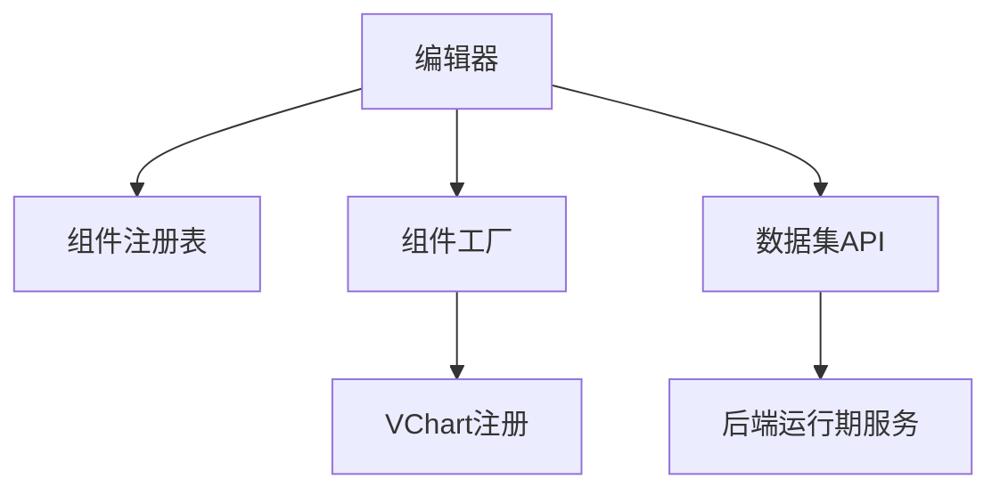

**图示来源**
- [packages/index.ts:32-71](file://forge-report-ui/src/packages/index.ts#L32-L71)
- [components/FgAI/componentRegistry.ts:147-203](file://forge-report-ui/src/components/FgAI/componentRegistry.ts#L147-L203)
- [FgVChart/register.ts:1-28](file://forge-report-ui/src/components/FgVChart/register.ts#L1-L28)
- [api/data/dataset.ts:138-219](file://forge-admin-ui/src/api/data/dataset.ts#L138-L219)
- [DataDatasetRuntimeService.java:1-32](file://forge-server/forge-framework/forge-plugin-parent/forge-plugin-data/src/main/java/com/mdframe/forge/plugin/data/service/DataDatasetRuntimeService.java#L1-L32)

**章节来源**
- [packages/index.ts:32-71](file://forge-report-ui/src/packages/index.ts#L32-L71)
- [components/FgAI/componentRegistry.ts:147-203](file://forge-report-ui/src/components/FgAI/componentRegistry.ts#L147-L203)
- [FgVChart/register.ts:1-28](file://forge-report-ui/src/components/FgVChart/register.ts#L1-L28)
- [api/data/dataset.ts:138-219](file://forge-admin-ui/src/api/data/dataset.ts#L138-L219)
- [DataDatasetRuntimeService.java:1-32](file://forge-server/forge-framework/forge-plugin-parent/forge-plugin-data/src/main/java/com/mdframe/forge/plugin/data/service/DataDatasetRuntimeService.java#L1-L32)

## 性能考虑
- 组件懒加载与缓存：通过包/分类/键名缓存配置模块，减少重复导入与网络开销。
- 增量渲染与进度反馈：加载组件列表时按进度更新百分比，提升大项目体验。
- 数据查询优化：合理设置数据集最大行数与超时时间，利用缓存与分页降低负载。
- 主题与渲染：统一注册VChart组件与动画，避免重复初始化带来的性能损耗。

[本节为通用性能建议，不直接分析具体文件]

## 故障排查指南
- 组件无法渲染
  - 检查组件是否已正确注册与安装。
  - 确认动态导入路径与缓存键是否正确。
- 数据为空或报错
  - 核对数据集连接与字段同步状态。
  - 查看运行时查询接口返回与后端日志。
- 交互无效
  - 检查事件绑定与动作配置是否生效。
  - 确认VChart组件与插件是否已注册。
- 大屏预览异常
  - 验证存储模型的画布配置与组件列表是否完整。
  - 检查组件实例创建与option合并逻辑。

**章节来源**
- [api/data/dataset.ts:138-219](file://forge-admin-ui/src/api/data/dataset.ts#L138-L219)
- [DataDatasetRuntimeService.java:1-32](file://forge-server/forge-framework/forge-plugin-parent/forge-plugin-data/src/main/java/com/mdframe/forge/plugin/data/service/DataDatasetRuntimeService.java#L1-L32)
- [packages/index.ts:32-71](file://forge-report-ui/src/packages/index.ts#L32-L71)
- [FgVChart/register.ts:1-28](file://forge-report-ui/src/components/FgVChart/register.ts#L1-L28)

## 结论
Forge Admin 的AI数据大屏以可视化编辑器为核心，结合动态组件注册、统一注册表与VChart渲染能力，构建了可扩展、高性能的大屏解决方案。数据源与数据集管理提供了稳定的数据接入与治理能力，模板市场与应用中心则降低了使用门槛。通过规范的组件开发与性能优化策略，可在复杂业务场景中快速交付高质量的数据大屏。

[本节为总结性内容，不直接分析具体文件]

## 附录
- 大屏设计指南
  - 明确业务指标与受众，选择合适的图表类型与信息密度。
  - 利用分组与面板组织信息层次，保持视觉一致性。
  - 合理使用主题与配色，确保可读性与品牌统一。
- 组件开发规范
  - 遵循包/分类/键名的命名约定，提供默认宽高与描述。
  - 实现统一的配置项结构与事件接口，便于编辑器集成。
  - 提供示例数据与测试用例，确保稳定性。
- 部署发布与运维监控
  - 前端静态资源部署至CDN，开启缓存与压缩。
  - 后端服务配置连接池、超时与重试策略，监控查询耗时与错误率。
  - 建立告警与日志采集，定期审计数据集权限与访问情况。

[本节为通用指导，不直接分析具体文件]