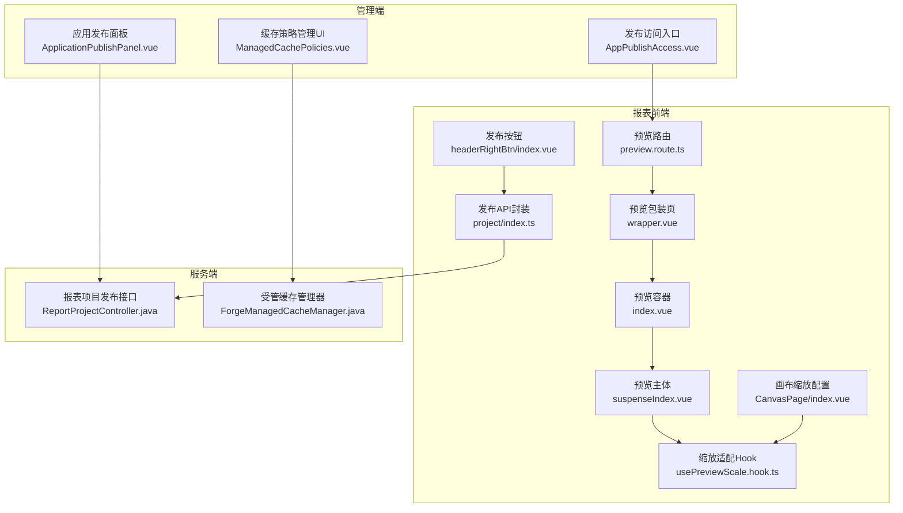
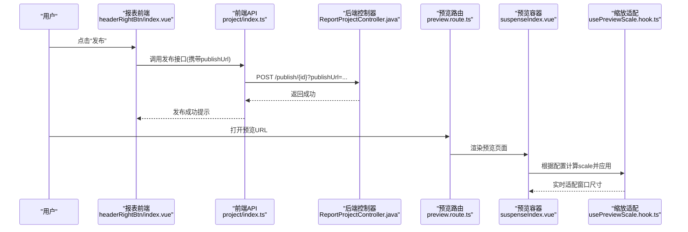
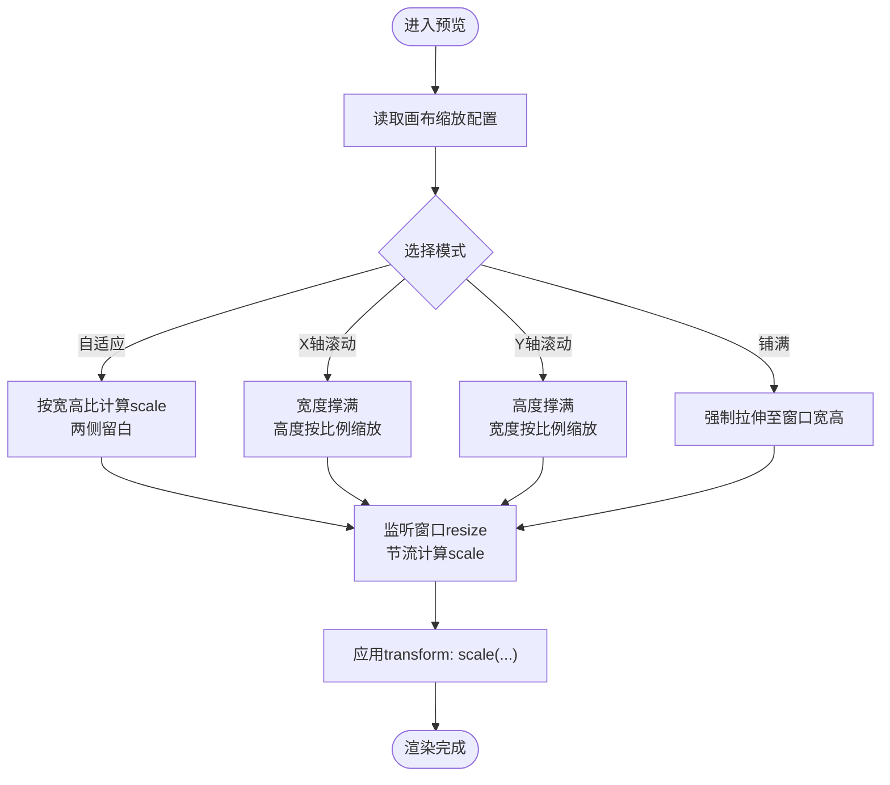
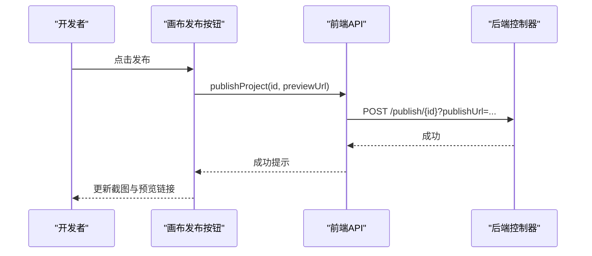
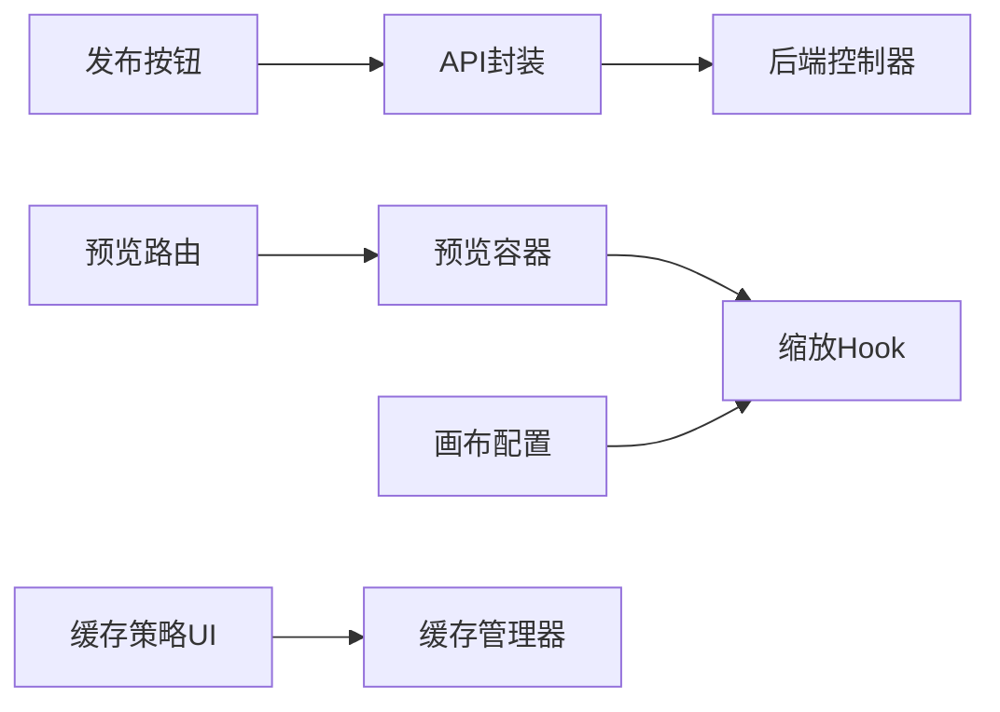

# 发布与预览

<cite>
**本文引用的文件**
- [preview.route.ts](file://forge-report-ui/src/router/modules/preview.route.ts)
- [wrapper.vue](file://forge-report-ui/src/views/preview/wrapper.vue)
- [index.vue](file://forge-report-ui/src/views/preview/index.vue)
- [suspenseIndex.vue](file://forge-report-ui/src/views/preview/suspenseIndex.vue)
- [usePreviewScale.hook.ts](file://forge-report-ui/src/hooks/usePreviewScale.hook.ts)
- [headerRightBtn/index.vue](file://forge-report-ui/src/views/chart/ContentHeader/headerRightBtn/index.vue)
- [project/index.ts](file://forge-report-ui/src/api/project/index.ts)
- [ReportProjectController.java](file://forge-server/forge-report-server/src/main/java/com/mdframe/forge/report/project/controller/ReportProjectController.java)
- [ApplicationPublishPanel.vue](file://forge-admin-ui/src/views/app-center/application-workspace/ApplicationPublishPanel.vue)
- [AppPublishAccess.vue](file://forge-admin-ui/src/views/app-center/components/publish/AppPublishAccess.vue)
- [ManagedCachePolicies.vue](file://forge-admin-ui/src/views/system/cache/ManagedCachePolicies.vue)
- [ForgeManagedCacheManager.java](file://forge-server/forge-framework/forge-starter-parent/forge-starter-cache/src/main/java/com/mdframe/forge/starter/cache/managed/ForgeManagedCacheManager.java)
- [canvasPage/index.vue](file://forge-report-ui/src/views/chart/ContentConfigurations/components/CanvasPage/index.vue)
</cite>

## 目录
1. [简介](#简介)
2. [项目结构](#项目结构)
3. [核心组件](#核心组件)
4. [架构总览](#架构总览)
5. [详细组件分析](#详细组件分析)
6. [依赖关系分析](#依赖关系分析)
7. [性能考虑](#性能考虑)
8. [故障排查指南](#故障排查指南)
9. [结论](#结论)
10. [附录](#附录)

## 简介
本文件面向 Forge Admin 的大屏发布与预览能力，覆盖预览模式实现原理、缩放适配、全屏显示、移动端适配；发布流程的配置选项、权限设置、缓存策略与 CDN 部署建议；以及发布最佳实践、性能调优方案、监控告警配置与故障恢复策略。内容基于仓库中报表大屏前端、路由与预览渲染、后端发布接口、应用发布面板与访问入口等代码进行梳理与说明。

## 项目结构
围绕“大屏发布与预览”，涉及的主要模块如下：
- 报表前端（forge-report-ui）
  - 预览路由与页面：preview.route.ts、views/preview/*
  - 缩放适配 Hook：hooks/usePreviewScale.hook.ts
  - 画布配置（缩放模式选择）：views/chart/ContentConfigurations/components/CanvasPage/index.vue
  - 发布入口与调用：views/chart/ContentHeader/headerRightBtn/index.vue、api/project/index.ts
- 管理端（forge-admin-ui）
  - 应用发布面板：application-workspace/ApplicationPublishPanel.vue
  - 发布后访问入口展示：components/publish/AppPublishAccess.vue
  - 缓存策略管理：system/cache/ManagedCachePolicies.vue
- 服务端（forge-server）
  - 报表项目发布接口：forge-report-server/.../controller/ReportProjectController.java
  - 受管缓存管理器：forge-starter-cache/.../ForgeManagedCacheManager.java

图表来源
- [preview.route.ts:1-21](file://forge-report-ui/src/router/modules/preview.route.ts#L1-L21)
- [wrapper.vue:1-31](file://forge-report-ui/src/views/preview/wrapper.vue#L1-L31)
- [index.vue:1-10](file://forge-report-ui/src/views/preview/index.vue#L1-L10)
- [suspenseIndex.vue:1-38](file://forge-report-ui/src/views/preview/suspenseIndex.vue#L1-L38)
- [usePreviewScale.hook.ts:1-219](file://forge-report-ui/src/hooks/usePreviewScale.hook.ts#L1-L219)
- [canvasPage/index.vue:474-523](file://forge-report-ui/src/views/chart/ContentConfigurations/components/CanvasPage/index.vue#L474-L523)
- [headerRightBtn/index.vue:107-202](file://forge-report-ui/src/views/chart/ContentHeader/headerRightBtn/index.vue#L107-L202)
- [project/index.ts:62-91](file://forge-report-ui/src/api/project/index.ts#L62-L91)
- [ReportProjectController.java:84-109](file://forge-server/forge-report-server/src/main/java/com/mdframe/forge/report/project/controller/ReportProjectController.java#L84-L109)
- [ApplicationPublishPanel.vue:251-297](file://forge-admin-ui/src/views/app-center/application-workspace/ApplicationPublishPanel.vue#L251-L297)
- [AppPublishAccess.vue:1-31](file://forge-admin-ui/src/views/app-center/components/publish/AppPublishAccess.vue#L1-L31)
- [ManagedCachePolicies.vue:56-424](file://forge-admin-ui/src/views/system/cache/ManagedCachePolicies.vue#L56-L424)
- [ForgeManagedCacheManager.java:291-322](file://forge-server/forge-framework/forge-starter-parent/forge-starter-cache/src/main/java/com/mdframe/forge/starter/cache/managed/ForgeManagedCacheManager.java#L291-L322)

章节来源
- [preview.route.ts:1-21](file://forge-report-ui/src/router/modules/preview.route.ts#L1-L21)
- [wrapper.vue:1-31](file://forge-report-ui/src/views/preview/wrapper.vue#L1-L31)
- [index.vue:1-10](file://forge-report-ui/src/views/preview/index.vue#L1-L10)
- [suspenseIndex.vue:1-38](file://forge-report-ui/src/views/preview/suspenseIndex.vue#L1-L38)
- [usePreviewScale.hook.ts:1-219](file://forge-report-ui/src/hooks/usePreviewScale.hook.ts#L1-L219)
- [canvasPage/index.vue:474-523](file://forge-report-ui/src/views/chart/ContentConfigurations/components/CanvasPage/index.vue#L474-L523)
- [headerRightBtn/index.vue:107-202](file://forge-report-ui/src/views/chart/ContentHeader/headerRightBtn/index.vue#L107-L202)
- [project/index.ts:62-91](file://forge-report-ui/src/api/project/index.ts#L62-L91)
- [ReportProjectController.java:84-109](file://forge-server/forge-report-server/src/main/java/com/mdframe/forge/report/project/controller/ReportProjectController.java#L84-L109)
- [ApplicationPublishPanel.vue:251-297](file://forge-admin-ui/src/views/app-center/application-workspace/ApplicationPublishPanel.vue#L251-L297)
- [AppPublishAccess.vue:1-31](file://forge-admin-ui/src/views/app-center/components/publish/AppPublishAccess.vue#L1-L31)
- [ManagedCachePolicies.vue:56-424](file://forge-admin-ui/src/views/system/cache/ManagedCachePolicies.vue#L56-L424)
- [ForgeManagedCacheManager.java:291-322](file://forge-server/forge-framework/forge-starter-parent/forge-starter-cache/src/main/java/com/mdframe/forge/starter/cache/managed/ForgeManagedCacheManager.java#L291-L322)

## 核心组件
- 预览路由与容器
  - 通过独立路由注册预览页，便于以独立 URL 打开大屏。
  - 预览包装页负责从父窗口同步编辑数据变更并重建预览实例，保证所见即所得。
- 缩放适配
  - 提供多种缩放模式：自适应（保持比例留白）、X轴滚动、Y轴滚动、铺满（拉伸）。
  - 使用节流监听窗口尺寸变化，动态计算 scale 并应用到容器。
- 发布入口与流程
  - 报表前端在画布右上角触发发布，生成预览链接并调用后端发布接口。
  - 管理端提供应用级发布面板，支持幂等发布、检查提示与结果刷新。
- 访问控制
  - 发布后可生成电脑端与移动端访问地址，并提供二维码快速打开。
  - 数据集与页面入口具备访问权限配置能力，可限制可见范围。
- 缓存策略
  - 提供受管缓存策略的可视化配置与运行态监控，支持本地/Redis/多级模式与TTL、容量等参数。
  - 服务端周期性拉取远程策略快照并回退到安全默认策略。

章节来源
- [preview.route.ts:1-21](file://forge-report-ui/src/router/modules/preview.route.ts#L1-L21)
- [wrapper.vue:1-31](file://forge-report-ui/src/views/preview/wrapper.vue#L1-L31)
- [usePreviewScale.hook.ts:1-219](file://forge-report-ui/src/hooks/usePreviewScale.hook.ts#L1-L219)
- [headerRightBtn/index.vue:107-202](file://forge-report-ui/src/views/chart/ContentHeader/headerRightBtn/index.vue#L107-L202)
- [project/index.ts:62-91](file://forge-report-ui/src/api/project/index.ts#L62-L91)
- [ReportProjectController.java:84-109](file://forge-server/forge-report-server/src/main/java/com/mdframe/forge/report/project/controller/ReportProjectController.java#L84-L109)
- [ApplicationPublishPanel.vue:251-297](file://forge-admin-ui/src/views/app-center/application-workspace/ApplicationPublishPanel.vue#L251-L297)
- [AppPublishAccess.vue:1-31](file://forge-admin-ui/src/views/app-center/components/publish/AppPublishAccess.vue#L1-L31)
- [ManagedCachePolicies.vue:56-424](file://forge-admin-ui/src/views/system/cache/ManagedCachePolicies.vue#L56-L424)
- [ForgeManagedCacheManager.java:291-322](file://forge-server/forge-framework/forge-starter-parent/forge-starter-cache/src/main/java/com/mdframe/forge/starter/cache/managed/ForgeManagedCacheManager.java#L291-L322)

## 架构总览
下图展示了“大屏预览与发布”的前后端交互链路：用户在画布点击发布，前端构造预览URL并调用后端接口；后端完成版本化与资源落盘；用户通过独立预览路由加载渲染，并根据缩放配置适配不同屏幕。

图表来源
- [headerRightBtn/index.vue:107-202](file://forge-report-ui/src/views/chart/ContentHeader/headerRightBtn/index.vue#L107-L202)
- [project/index.ts:62-91](file://forge-report-ui/src/api/project/index.ts#L62-L91)
- [ReportProjectController.java:84-109](file://forge-server/forge-report-server/src/main/java/com/mdframe/forge/report/project/controller/ReportProjectController.java#L84-L109)
- [preview.route.ts:1-21](file://forge-report-ui/src/router/modules/preview.route.ts#L1-L21)
- [suspenseIndex.vue:1-38](file://forge-report-ui/src/views/preview/suspenseIndex.vue#L1-L38)
- [usePreviewScale.hook.ts:1-219](file://forge-report-ui/src/hooks/usePreviewScale.hook.ts#L1-L219)

## 详细组件分析

### 预览模式与缩放适配
- 预览路由与容器
  - 通过独立路由挂载预览页，便于分享与嵌入。
  - 包装页监听父窗口事件，同步最新编辑数据并重建预览实例，确保预览与编辑一致。
- 缩放模式
  - 自适应：按画布宽高比计算缩放，两侧留白。
  - X轴滚动：宽度撑满，高度按比例缩放，出现纵向滚动条。
  - Y轴滚动：高度撑满，宽度按比例缩放，出现横向滚动条。
  - 铺满：强制拉伸至窗口宽高，可能变形。
- 实现要点
  - 使用节流函数监听窗口 resize，避免频繁重排。
  - 通过 CSS transform: scale(...) 实现高性能缩放。
  - 画布配置界面提供缩放模式切换，影响运行时行为。

图表来源
- [usePreviewScale.hook.ts:1-219](file://forge-report-ui/src/hooks/usePreviewScale.hook.ts#L1-L219)
- [canvasPage/index.vue:474-523](file://forge-report-ui/src/views/chart/ContentConfigurations/components/CanvasPage/index.vue#L474-L523)
- [suspenseIndex.vue:1-38](file://forge-report-ui/src/views/preview/suspenseIndex.vue#L1-L38)

章节来源
- [wrapper.vue:1-31](file://forge-report-ui/src/views/preview/wrapper.vue#L1-L31)
- [usePreviewScale.hook.ts:1-219](file://forge-report-ui/src/hooks/usePreviewScale.hook.ts#L1-L219)
- [canvasPage/index.vue:474-523](file://forge-report-ui/src/views/chart/ContentConfigurations/components/CanvasPage/index.vue#L474-L523)
- [suspenseIndex.vue:1-38](file://forge-report-ui/src/views/preview/suspenseIndex.vue#L1-L38)

### 发布流程与配置选项
- 前端发布入口
  - 在画布右上角触发发布，先获取预览路径，拼接当前项目ID生成预览URL，再调用后端发布接口。
  - 发布成功后更新截图与预览链接，并在项目列表中可直接预览或分享。
- 后端发布接口
  - 接收项目ID与预览URL，执行发布逻辑（版本化与资源落盘），返回成功响应。
- 管理端发布面板
  - 提供“检查并发布”能力，支持幂等键防止重复提交，发布完成后刷新历史版本列表。
- 配置项
  - 预览模式：自适应、滚动、铺满。
  - 发布目标：报表项目 vs 业务应用（管理端面板）。
  - 幂等性：通过唯一键保障重复点击不产生多份版本。

图表来源
- [headerRightBtn/index.vue:107-202](file://forge-report-ui/src/views/chart/ContentHeader/headerRightBtn/index.vue#L107-L202)
- [project/index.ts:62-91](file://forge-report-ui/src/api/project/index.ts#L62-L91)
- [ReportProjectController.java:84-109](file://forge-server/forge-report-server/src/main/java/com/mdframe/forge/report/project/controller/ReportProjectController.java#L84-L109)
- [ApplicationPublishPanel.vue:251-297](file://forge-admin-ui/src/views/app-center/application-workspace/ApplicationPublishPanel.vue#L251-L297)

章节来源
- [headerRightBtn/index.vue:107-202](file://forge-report-ui/src/views/chart/ContentHeader/headerRightBtn/index.vue#L107-L202)
- [project/index.ts:62-91](file://forge-report-ui/src/api/project/index.ts#L62-L91)
- [ReportProjectController.java:84-109](file://forge-server/forge-report-server/src/main/java/com/mdframe/forge/report/project/controller/ReportProjectController.java#L84-L109)
- [ApplicationPublishPanel.vue:251-297](file://forge-admin-ui/src/views/app-center/application-workspace/ApplicationPublishPanel.vue#L251-L297)

### 访问控制与安全
- 发布后访问入口
  - 提供电脑端与移动端两种访问方式，支持二维码快速打开。
  - 当门户不可用时给出明确状态提示。
- 权限与数据范围
  - 数据集支持公开/私有模式，私有模式下仅对授权主体可见可用。
  - 页面入口可绑定资源ID与权限码，用于角色级访问控制。
- 建议
  - 为敏感大屏启用私有访问模式，并最小化授权主体。
  - 结合网关层鉴权与IP白名单增强安全性。

章节来源
- [AppPublishAccess.vue:1-31](file://forge-admin-ui/src/views/app-center/components/publish/AppPublishAccess.vue#L1-L31)
- [dataset.vue:1096-1258](file://forge-admin-ui/src/views/data/dataset.vue#L1096-L1258)
- [application-permission-utils.js:61-91](file://forge-admin-ui/src/views/app-center/application-permission-utils.js#L61-L91)

### 缓存策略与CDN部署
- 受管缓存策略
  - 支持本地、Redis、多级缓存模式，可配置TTL、容量、是否缓存空值等。
  - 前端提供策略列表与编辑弹窗，后端周期性拉取远程策略快照并校验，异常时回退到默认策略。
- CDN 部署建议
  - 将静态资源（JS/CSS/图片/字体）托管至CDN，开启强缓存与版本化文件名。
  - 预览页与发布产物分离部署，预览走CDN加速，编辑环境直连后端。
  - 针对大数据量图表，启用浏览器缓存与HTTP缓存头优化首屏与交互。

章节来源
- [ManagedCachePolicies.vue:56-424](file://forge-admin-ui/src/views/system/cache/ManagedCachePolicies.vue#L56-L424)
- [ForgeManagedCacheManager.java:291-322](file://forge-server/forge-framework/forge-starter-parent/forge-starter-cache/src/main/java/com/mdframe/forge/starter/cache/managed/ForgeManagedCacheManager.java#L291-L322)

## 依赖关系分析
- 前端依赖
  - 预览路由依赖预览容器与缩放Hook；发布按钮依赖API封装；画布配置影响运行时缩放行为。
- 前后端耦合点
  - 发布接口契约：项目ID与预览URL；后端负责版本化与资源落盘。
  - 预览URL由前端拼接，需保证域名与端口一致性。
- 缓存依赖
  - 管理端UI依赖后端策略分页接口；服务端依赖Redisson客户端进行策略同步。

图表来源
- [headerRightBtn/index.vue:107-202](file://forge-report-ui/src/views/chart/ContentHeader/headerRightBtn/index.vue#L107-L202)
- [project/index.ts:62-91](file://forge-report-ui/src/api/project/index.ts#L62-L91)
- [ReportProjectController.java:84-109](file://forge-server/forge-report-server/src/main/java/com/mdframe/forge/report/project/controller/ReportProjectController.java#L84-L109)
- [preview.route.ts:1-21](file://forge-report-ui/src/router/modules/preview.route.ts#L1-L21)
- [suspenseIndex.vue:1-38](file://forge-report-ui/src/views/preview/suspenseIndex.vue#L1-L38)
- [usePreviewScale.hook.ts:1-219](file://forge-report-ui/src/hooks/usePreviewScale.hook.ts#L1-L219)
- [canvasPage/index.vue:474-523](file://forge-report-ui/src/views/chart/ContentConfigurations/components/CanvasPage/index.vue#L474-L523)
- [ManagedCachePolicies.vue:56-424](file://forge-admin-ui/src/views/system/cache/ManagedCachePolicies.vue#L56-L424)
- [ForgeManagedCacheManager.java:291-322](file://forge-server/forge-framework/forge-starter-parent/forge-starter-cache/src/main/java/com/mdframe/forge/starter/cache/managed/ForgeManagedCacheManager.java#L291-L322)

## 性能考虑
- 渲染性能
  - 使用 transform: scale 进行缩放，减少重排重绘。
  - 对窗口 resize 事件使用节流，降低计算频率。
- 网络与缓存
  - 启用浏览器强缓存与CDN，静态资源带版本号。
  - 合理设置HTTP缓存头，缩短首屏时间。
- 数据加载
  - 对大屏常用数据采用受管缓存策略，区分本地与Redis TTL，避免热点查询压垮数据库。
- 发布与版本
  - 使用幂等发布键，避免重复构建与资源膨胀。
  - 发布产物与预览资源分离，便于灰度与回滚。

[本节为通用性能指导，不直接分析具体文件]

## 故障排查指南
- 预览空白或样式错乱
  - 检查预览路由是否正确挂载，确认预览URL可访问。
  - 核对画布缩放配置与容器尺寸，必要时切换为“自适应”或“铺满”验证。
- 发布失败
  - 检查发布接口返回信息，确认预览URL格式正确。
  - 查看管理端发布面板的错误提示与日志，确认幂等键未冲突。
- 缓存异常
  - 若策略校验失败，服务端会记录失败并回退到默认策略；检查本地与Redis TTL配置合法性。
  - 通过缓存策略管理页面查看各策略的运行状态与失败次数。
- 访问受限
  - 确认数据集是否为私有模式且已授权；检查页面入口权限码与角色绑定。

章节来源
- [ReportProjectController.java:84-109](file://forge-server/forge-report-server/src/main/java/com/mdframe/forge/report/project/controller/ReportProjectController.java#L84-L109)
- [ApplicationPublishPanel.vue:251-297](file://forge-admin-ui/src/views/app-center/application-workspace/ApplicationPublishPanel.vue#L251-L297)
- [ManagedCachePolicies.vue:56-424](file://forge-admin-ui/src/views/system/cache/ManagedCachePolicies.vue#L56-L424)
- [ForgeManagedCacheManager.java:291-322](file://forge-server/forge-framework/forge-starter-parent/forge-starter-cache/src/main/java/com/mdframe/forge/starter/cache/managed/ForgeManagedCacheManager.java#L291-L322)

## 结论
Forge Admin 的大屏预览与发布体系在前端提供灵活的缩放适配与一键发布能力，在后端提供稳定的版本化发布接口与受管缓存策略。通过合理的权限控制、缓存策略与CDN部署，可实现高可用、高性能的大屏发布与预览体验。建议在关键场景下结合监控告警与灰度发布，持续优化大屏的稳定性与用户体验。

[本节为总结性内容，不直接分析具体文件]

## 附录
- 常见配置项速查
  - 预览缩放模式：自适应、X轴滚动、Y轴滚动、铺满。
  - 发布目标：报表项目（前端发布按钮）或业务应用（管理端面板）。
  - 缓存模式：本地、Redis、多级；TTL与容量可调。
- 最佳实践清单
  - 发布前执行最终检查，关注警告项。
  - 为大屏启用私有访问模式并最小化授权主体。
  - 静态资源上CDN并开启强缓存；预览与编辑环境分离。
  - 使用幂等发布键，避免重复构建。
  - 定期审查缓存策略，关注失败率与命中率。

[本节为补充信息，不直接分析具体文件]