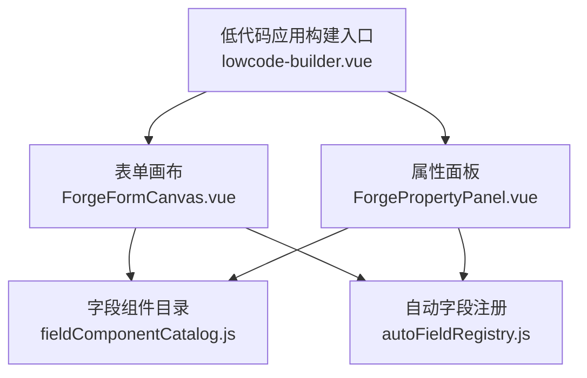
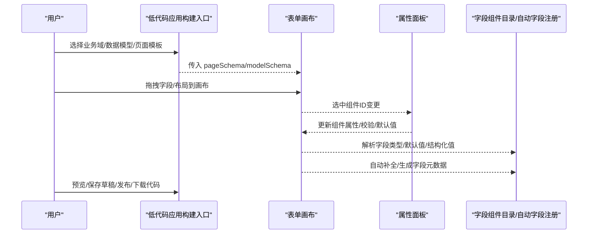
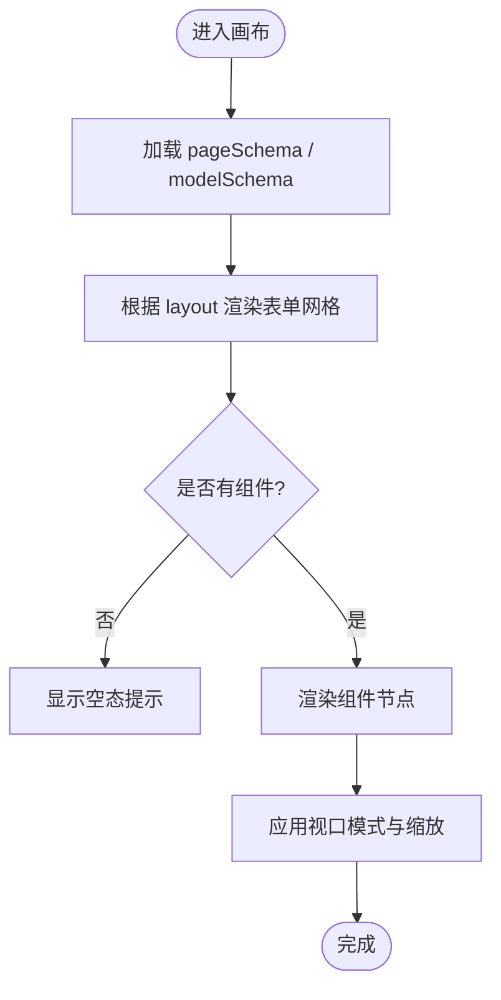
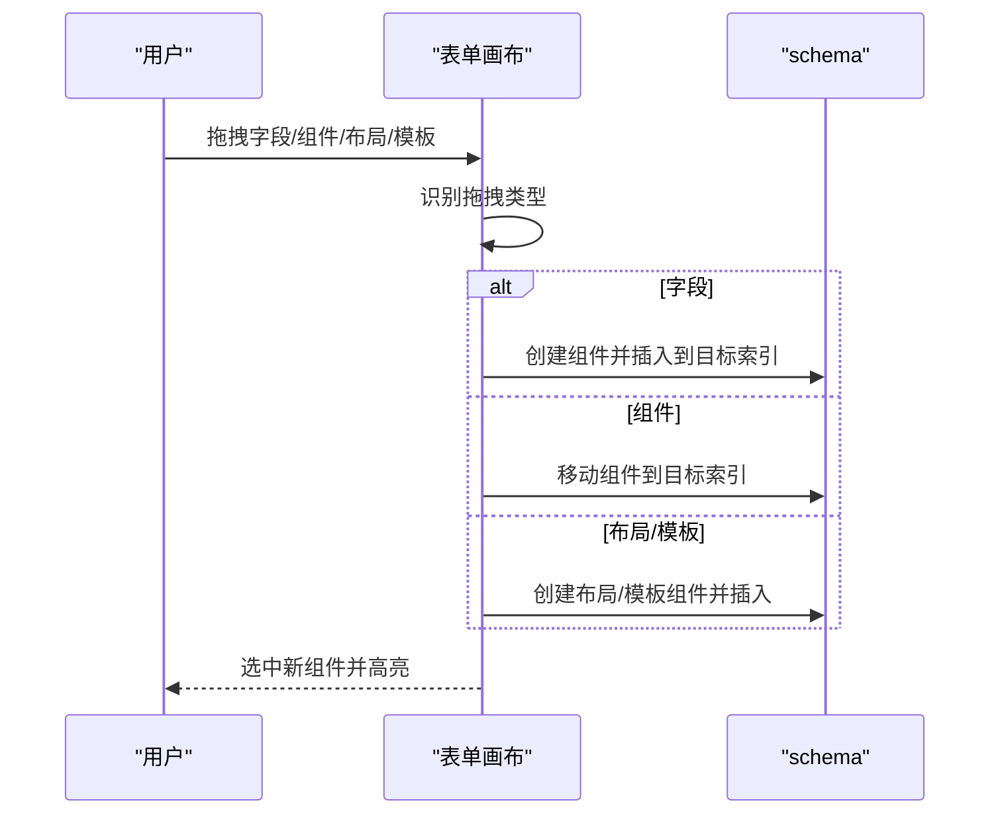
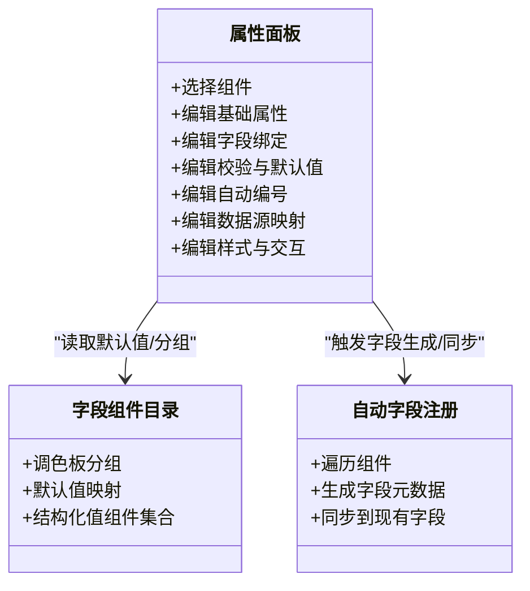
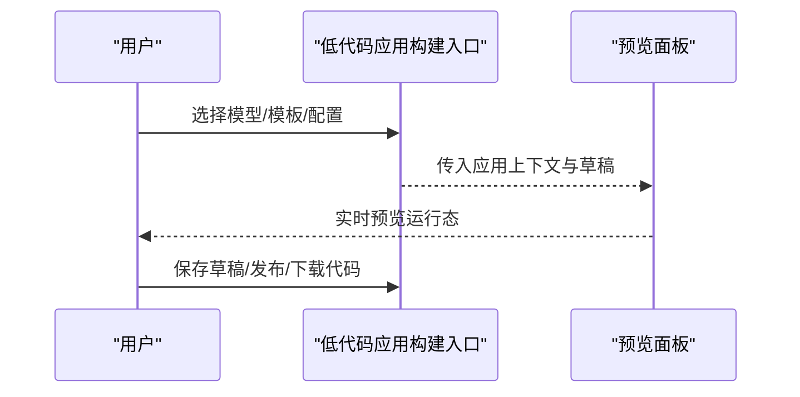
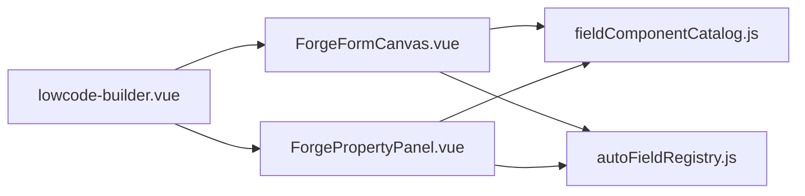

# 可视化编辑器

<cite>
**本文引用的文件**
- [lowcode-builder.vue](file://forge-admin-ui/src/views/ai/lowcode-builder.vue)
- [ForgeFormCanvas.vue](file://forge-admin-ui/src/views/app-center/components/designer/forge-form-designer/ForgeFormCanvas.vue)
- [ForgePropertyPanel.vue](file://forge-admin-ui/src/views/app-center/components/designer/forge-form-designer/ForgePropertyPanel.vue)
- [fieldComponentCatalog.js](file://forge-admin-ui/src/views/app-center/components/designer/form-first/fieldComponentCatalog.js)
- [autoFieldRegistry.js](file://forge-admin-ui/src/views/app-center/components/designer/form-first/autoFieldRegistry.js)
</cite>

## 目录
1. [简介](#简介)
2. [项目结构](#项目结构)
3. [核心组件](#核心组件)
4. [架构总览](#架构总览)
5. [详细组件分析](#详细组件分析)
6. [依赖关系分析](#依赖关系分析)
7. [性能考虑](#性能考虑)
8. [故障排查指南](#故障排查指南)
9. [结论](#结论)
10. [附录](#附录)

## 简介
本文件面向 Forge Admin 的可视化编辑器，围绕画布初始化、组件拖拽、属性配置、实时预览等核心能力，系统阐述编辑器的架构设计、组件注册机制、数据绑定流程与响应式布局算法。文档同时覆盖图表类组件的配置选项、样式定制与交互效果设置，并提供使用指南、组件开发规范、性能优化策略及常见问题解决方案，帮助读者快速上手并高效扩展编辑器能力。

## 项目结构
可视化编辑器由“应用构建入口”“表单画布”“属性面板”“字段组件目录”“自动字段注册”等模块组成：
- 应用构建入口：负责业务域选择、数据模型绑定、页面模板选择、草稿保存、预览与发布、代码生成下载。
- 表单画布：承载拖拽放置、节点渲染、视口缩放与设备模拟、网格布局与间距控制。
- 属性面板：提供选中组件的属性编辑、校验规则、默认值、自动编号、数据源映射、样式与交互开关等。
- 字段组件目录：集中声明字段类型到组件类型的映射、调色板分组与默认值。
- 自动字段注册：从画布组件推导或创建后端字段元数据，保证设计与运行时一致。

**图示来源**
- [lowcode-builder.vue:1-800](file://forge-admin-ui/src/views/ai/lowcode-builder.vue#L1-L800)
- [ForgeFormCanvas.vue:1-768](file://forge-admin-ui/src/views/app-center/components/designer/forge-form-designer/ForgeFormCanvas.vue#L1-L768)
- [ForgePropertyPanel.vue:1-800](file://forge-admin-ui/src/views/app-center/components/designer/forge-form-designer/ForgePropertyPanel.vue#L1-L800)
- [fieldComponentCatalog.js:1-29](file://forge-admin-ui/src/views/app-center/components/designer/form-first/fieldComponentCatalog.js#L1-L29)
- [autoFieldRegistry.js:1-109](file://forge-admin-ui/src/views/app-center/components/designer/form-first/autoFieldRegistry.js#L1-L109)

**章节来源**
- [lowcode-builder.vue:1-800](file://forge-admin-ui/src/views/ai/lowcode-builder.vue#L1-L800)
- [ForgeFormCanvas.vue:1-768](file://forge-admin-ui/src/views/app-center/components/designer/forge-form-designer/ForgeFormCanvas.vue#L1-L768)
- [ForgePropertyPanel.vue:1-800](file://forge-admin-ui/src/views/app-center/components/designer/forge-form-designer/ForgePropertyPanel.vue#L1-L800)
- [fieldComponentCatalog.js:1-29](file://forge-admin-ui/src/views/app-center/components/designer/form-first/fieldComponentCatalog.js#L1-L29)
- [autoFieldRegistry.js:1-109](file://forge-admin-ui/src/views/app-center/components/designer/form-first/autoFieldRegistry.js#L1-L109)

## 核心组件
- 低代码应用构建入口：提供“数据源→页面设计→实时预览→发布上线→代码输出”的完整工作流；支持多模型选择、主模型指定、菜单与发布配置、草稿保存与代码包下载。
- 表单画布：实现拖放新增/移动组件、根区域插入、空态提示、视口缩放、设备模式切换、栅格列数与间距控制。
- 属性面板：按组件类型动态展示属性，支持基础标识、字段绑定、校验、默认值、自动编号、数据源映射（静态/上下文/远程）、样式与交互开关。
- 字段组件目录：维护字段类型到组件类型的映射、调色板分组、结构化值组件集合。
- 自动字段注册：遍历画布组件，为缺失字段自动生成字段元数据，确保前后端一致性。

**章节来源**
- [lowcode-builder.vue:1-800](file://forge-admin-ui/src/views/ai/lowcode-builder.vue#L1-L800)
- [ForgeFormCanvas.vue:1-768](file://forge-admin-ui/src/views/app-center/components/designer/forge-form-designer/ForgeFormCanvas.vue#L1-L768)
- [ForgePropertyPanel.vue:1-800](file://forge-admin-ui/src/views/app-center/components/designer/forge-form-designer/ForgePropertyPanel.vue#L1-L800)
- [fieldComponentCatalog.js:1-29](file://forge-admin-ui/src/views/app-center/components/designer/form-first/fieldComponentCatalog.js#L1-L29)
- [autoFieldRegistry.js:1-109](file://forge-admin-ui/src/views/app-center/components/designer/form-first/autoFieldRegistry.js#L1-L109)

## 架构总览
编辑器采用“入口编排 + 画布渲染 + 属性编辑 + 字段资产”的分层架构：
- 入口层：管理应用级状态（领域、模型、页面模板、草稿、发布），协调各子视图。
- 画布层：基于 schema 驱动渲染，处理拖拽、缩放、视口与网格布局。
- 属性层：根据选中组件类型动态渲染属性表单，双向更新 schema。
- 资产层：统一字段组件目录与自动字段注册，保障设计与运行态一致。

**图示来源**
- [lowcode-builder.vue:1-800](file://forge-admin-ui/src/views/ai/lowcode-builder.vue#L1-L800)
- [ForgeFormCanvas.vue:1-768](file://forge-admin-ui/src/views/app-center/components/designer/forge-form-designer/ForgeFormCanvas.vue#L1-L768)
- [ForgePropertyPanel.vue:1-800](file://forge-admin-ui/src/views/app-center/components/designer/forge-form-designer/ForgePropertyPanel.vue#L1-L800)
- [fieldComponentCatalog.js:1-29](file://forge-admin-ui/src/views/app-center/components/designer/form-first/fieldComponentCatalog.js#L1-L29)
- [autoFieldRegistry.js:1-109](file://forge-admin-ui/src/views/app-center/components/designer/form-first/autoFieldRegistry.js#L1-L109)

## 详细组件分析

### 画布初始化与渲染
- 初始化流程：入口加载领域与模型后，将 pageSchema 与 modelSchema 注入画布；画布根据 layout 配置渲染表单网格，支持 labelPlacement、labelWidth、size、gridColumns、columnGap、rowGap 等。
- 空态与占位：当 components 为空时显示空态提示，支持拖入根区域。
- 视口与缩放：提供桌面/窄屏/弹窗/抽屉/移动等预设模式，支持自定义宽度与缩放比例，Ctrl/⌘+滚轮缩放。
- 网格布局算法：通过 gridTemplateColumns 与 gap 计算栅格列数与间距，限制最大列数，保证响应式对齐。

**图示来源**
- [ForgeFormCanvas.vue:1-768](file://forge-admin-ui/src/views/app-center/components/designer/forge-form-designer/ForgeFormCanvas.vue#L1-L768)

**章节来源**
- [ForgeFormCanvas.vue:1-768](file://forge-admin-ui/src/views/app-center/components/designer/forge-form-designer/ForgeFormCanvas.vue#L1-L768)

### 组件拖拽与插入
- 拖拽类型：区分组件、字段、布局、模板四类 MIME，避免误拖。
- 插入逻辑：根区域 drop 时根据目标索引插入或移动组件；支持“前插/后插”位置指示。
- 错误反馈：拖放失败时显示错误提示，清空拖拽状态。
- 事件冒泡：在预览模式下禁用拖拽，防止误操作。

**图示来源**
- [ForgeFormCanvas.vue:1-768](file://forge-admin-ui/src/views/app-center/components/designer/forge-form-designer/ForgeFormCanvas.vue#L1-L768)

**章节来源**
- [ForgeFormCanvas.vue:1-768](file://forge-admin-ui/src/views/app-center/components/designer/forge-form-designer/ForgeFormCanvas.vue#L1-L768)

### 属性配置与数据绑定
- 基础属性：显示名称、组件类型切换、区块说明、组件标题。
- 字段绑定：字段编码、列名映射、是否创建缺失字段、锁定状态。
- 校验与默认值：常用校验预设、正则表达式、默认值选择器与手动输入。
- 自动编号：启用开关、规则选择、填充策略、触发时机、隐藏与只读控制、预览与错误提示。
- 数据源映射：静态/上下文/远程三种来源，支持接口地址、方法、响应路径、参数 JSON、字段映射（显示文本/值/标题/描述）。
- 样式与交互：水印、富文本、Markdown、条码/二维码、HTML/Vue 组件、菜单/分页/倒计时/数值动画等组件专属属性。

**图示来源**
- [ForgePropertyPanel.vue:1-800](file://forge-admin-ui/src/views/app-center/components/designer/forge-form-designer/ForgePropertyPanel.vue#L1-L800)
- [fieldComponentCatalog.js:1-29](file://forge-admin-ui/src/views/app-center/components/designer/form-first/fieldComponentCatalog.js#L1-L29)
- [autoFieldRegistry.js:1-109](file://forge-admin-ui/src/views/app-center/components/designer/form-first/autoFieldRegistry.js#L1-L109)

**章节来源**
- [ForgePropertyPanel.vue:1-800](file://forge-admin-ui/src/views/app-center/components/designer/forge-form-designer/ForgePropertyPanel.vue#L1-L800)
- [fieldComponentCatalog.js:1-29](file://forge-admin-ui/src/views/app-center/components/designer/form-first/fieldComponentCatalog.js#L1-L29)
- [autoFieldRegistry.js:1-109](file://forge-admin-ui/src/views/app-center/components/designer/form-first/autoFieldRegistry.js#L1-L109)

### 实时预览与应用构建
- 步骤导航：数据源→页面设计→实时预览→发布上线→代码输出。
- 数据源：选择单/多模型，指定主模型，同步运行时模型与页面设计模型。
- 预览：在独立面板中查看运行态效果，支持表单/详情/列表等场景。
- 发布与代码：保存草稿、发布版本、预览/下载代码包，支持 Group ID 等代码生成选项。

**图示来源**
- [lowcode-builder.vue:1-800](file://forge-admin-ui/src/views/ai/lowcode-builder.vue#L1-L800)

**章节来源**
- [lowcode-builder.vue:1-800](file://forge-admin-ui/src/views/ai/lowcode-builder.vue#L1-L800)

### 图表组件配置、样式与交互
- 配置项：内容、尺寸、颜色、误差等级、显示文本开关、格式/码制、条高、旋转、间隔、层级等。
- 样式定制：字体大小/行高/字重、颜色/样式/对齐、宽高/旋转、图片水印透明度与尺寸。
- 交互效果：倒计时激活、数值动画起止与时长、分页页码与每页数量、分割面板方向与默认尺寸等。

**章节来源**
- [ForgePropertyPanel.vue:1-800](file://forge-admin-ui/src/views/app-center/components/designer/forge-form-designer/ForgePropertyPanel.vue#L1-L800)

## 依赖关系分析
- 入口依赖：低代码应用构建入口依赖预览面板、发布面板、菜单选择器等，协调草稿与发布生命周期。
- 画布依赖：表单画布依赖字段组件目录与自动字段注册，用于拖拽时的类型解析与字段生成。
- 属性面板依赖：属性面板依赖字段组件目录获取默认值与分组，依赖自动字段注册进行字段元数据同步。
- 字段资产：字段组件目录提供统一的默认值映射与调色板分组，自动字段注册确保设计与后端字段一致。

**图示来源**
- [lowcode-builder.vue:1-800](file://forge-admin-ui/src/views/ai/lowcode-builder.vue#L1-L800)
- [ForgeFormCanvas.vue:1-768](file://forge-admin-ui/src/views/app-center/components/designer/forge-form-designer/ForgeFormCanvas.vue#L1-L768)
- [ForgePropertyPanel.vue:1-800](file://forge-admin-ui/src/views/app-center/components/designer/forge-form-designer/ForgePropertyPanel.vue#L1-L800)
- [fieldComponentCatalog.js:1-29](file://forge-admin-ui/src/views/app-center/components/designer/form-first/fieldComponentCatalog.js#L1-L29)
- [autoFieldRegistry.js:1-109](file://forge-admin-ui/src/views/app-center/components/designer/form-first/autoFieldRegistry.js#L1-L109)

**章节来源**
- [lowcode-builder.vue:1-800](file://forge-admin-ui/src/views/ai/lowcode-builder.vue#L1-L800)
- [ForgeFormCanvas.vue:1-768](file://forge-admin-ui/src/views/app-center/components/designer/forge-form-designer/ForgeFormCanvas.vue#L1-L768)
- [ForgePropertyPanel.vue:1-800](file://forge-admin-ui/src/views/app-center/components/designer/forge-form-designer/ForgePropertyPanel.vue#L1-L800)
- [fieldComponentCatalog.js:1-29](file://forge-admin-ui/src/views/app-center/components/designer/form-first/fieldComponentCatalog.js#L1-L29)
- [autoFieldRegistry.js:1-109](file://forge-admin-ui/src/views/app-center/components/designer/form-first/autoFieldRegistry.js#L1-L109)

## 性能考虑
- 视口缩放与渲染：使用 transform 缩放画布，减少重排；限制缩放范围避免过度计算。
- 网格布局：固定最大列数，合理设置 gap，避免过多列导致布局抖动。
- 拖拽性能：区分拖拽类型，仅在必要时创建组件；预览模式禁用拖拽以减少事件开销。
- 属性编辑：按需渲染属性面板，避免一次性渲染大量复杂控件。
- 自动字段：增量生成与去重，避免重复字段与冗余计算。

[本节为通用指导，不直接分析具体文件]

## 故障排查指南
- 拖放无效：检查是否在预览模式；确认拖拽类型是否为支持的 MIME；查看错误提示并清理拖拽状态。
- 字段未生效：确认字段绑定已填写且未被锁定；检查自动编号规则与触发时机；验证默认值与校验规则。
- 数据源无数据：检查远程接口地址与方法；确认响应路径与字段映射；核对请求参数 JSON。
- 布局错乱：调整栅格列数与间距；检查父容器宽度与缩放比例；确认组件 span 设置合理。
- 自动编号异常：预览规则并查看错误信息；确认填充策略与触发时机；检查规则模板与上下文变量。

**章节来源**
- [ForgeFormCanvas.vue:1-768](file://forge-admin-ui/src/views/app-center/components/designer/forge-form-designer/ForgeFormCanvas.vue#L1-L768)
- [ForgePropertyPanel.vue:1-800](file://forge-admin-ui/src/views/app-center/components/designer/forge-form-designer/ForgePropertyPanel.vue#L1-L800)

## 结论
Forge Admin 可视化编辑器以清晰的分层架构与强大的组件生态，实现了从数据源到页面设计、从属性配置到实时预览与发布的完整闭环。通过字段组件目录与自动字段注册，确保了设计与运行的一致性；通过视口缩放与网格布局，提供了灵活的响应式设计体验。遵循本文档的使用指南与开发规范，可高效扩展组件能力并优化编辑器性能。

[本节为总结性内容，不直接分析具体文件]

## 附录
- 使用指南
  - 新建应用：选择业务域与数据模型，设定页面模板与菜单信息，保存草稿。
  - 页面设计：从左侧拖拽字段/布局到画布，调整属性与校验，预览效果。
  - 发布上线：校验并发布，生成菜单与数据库对象，支持回滚。
  - 代码输出：预览或下载代码包，便于二次开发与集成。
- 组件开发规范
  - 组件需声明 componentKey、props、validation、visibility 等标准字段。
  - 字段组件需在目录中登记默认值与结构化值类型。
  - 自动字段生成需兼容已有字段编码，避免冲突。
- 性能优化策略
  - 合理使用视口缩放与网格布局，避免过度嵌套。
  - 延迟加载复杂属性面板，按需渲染。
  - 批量更新 schema，减少频繁重渲染。

[本节为补充性内容，不直接分析具体文件]