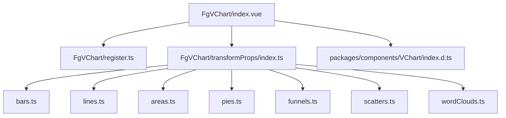
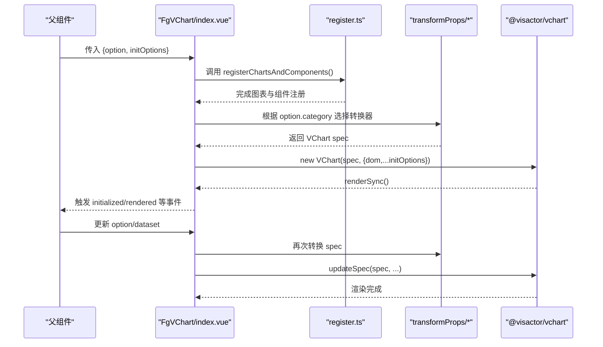
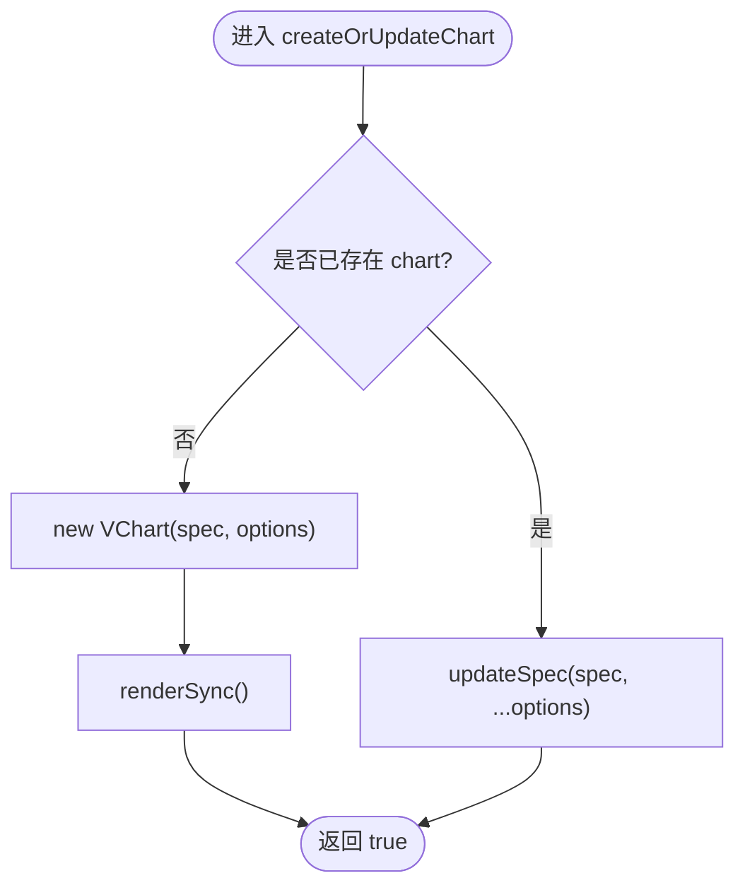
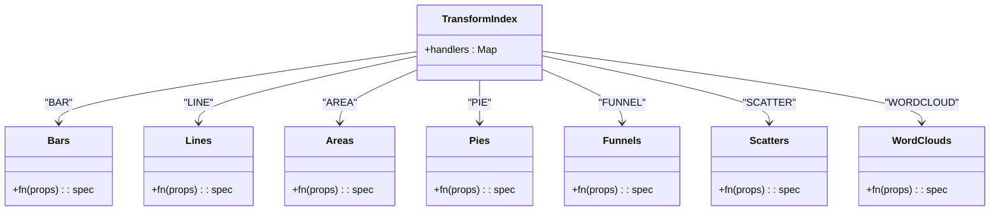
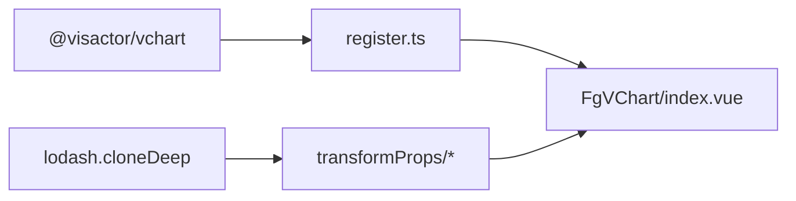

# VChart组件库

<cite>
**本文引用的文件**
- [index.vue](file://forge-report-ui/src/components/FgVChart/index.vue)
- [register.ts](file://forge-report-ui/src/components/FgVChart/register.ts)
- [transformProps/index.ts](file://forge-report-ui/src/components/FgVChart/transformProps/index.ts)
- [bars.ts](file://forge-report-ui/src/components/FgVChart/transformProps/bars.ts)
- [lines.ts](file://forge-report-ui/src/components/FgVChart/transformProps/lines.ts)
- [areas.ts](file://forge-report-ui/src/components/FgVChart/transformProps/areas.ts)
- [pies.ts](file://forge-report-ui/src/components/FgVChart/transformProps/pies.ts)
- [funnels.ts](file://forge-report-ui/src/components/FgVChart/transformProps/funnels.ts)
- [scatters.ts](file://forge-report-ui/src/components/FgVChart/transformProps/scatters.ts)
- [wordClouds.ts](file://forge-report-ui/src/components/FgVChart/transformProps/wordClouds.ts)
- [index.d.ts](file://forge-report-ui/src/packages/components/VChart/index.d.ts)
</cite>

## 目录
1. [简介](#简介)
2. [项目结构](#项目结构)
3. [核心组件](#核心组件)
4. [架构总览](#架构总览)
5. [详细组件分析](#详细组件分析)
6. [依赖关系分析](#依赖关系分析)
7. [性能考量](#性能考量)
8. [故障排查指南](#故障排查指南)
9. [结论](#结论)
10. [附录](#附录)

## 简介
本仓库为 Forge Admin 的报表前端模块中封装的 VChart 图表组件库。该组件库基于 VisActor VChart，提供面积图、柱状图、折线图、饼图、漏斗图、散点图、词云图等统一封装，具备以下特点：
- 统一的配置入口与类型定义，便于在业务页面中快速接入
- 通过 transformProps 将上层配置转换为 VChart 原生 spec，屏蔽差异
- 事件透传与生命周期管理，支持刷新、释放等能力
- 按需注册图表与组件，减少包体体积并提升渲染性能

## 项目结构
围绕 FgVChart 的核心目录与职责如下：
- components/FgVChart：通用 VChart 容器组件，负责实例化、更新、事件转发与资源释放
- components/FgVChart/transformProps：按图表类型转换 props 到 VChart spec
- packages/components/VChart：各图表类型的配置项类型定义与示例数据（用于设计器或可视化配置）

图示来源
- [index.vue:1-251](file://forge-report-ui/src/components/FgVChart/index.vue#L1-L251)
- [register.ts:1-30](file://forge-report-ui/src/components/FgVChart/register.ts#L1-L30)
- [transformProps/index.ts:1-20](file://forge-report-ui/src/components/FgVChart/transformProps/index.ts#L1-L20)
- [bars.ts:1-46](file://forge-report-ui/src/components/FgVChart/transformProps/bars.ts#L1-L46)
- [lines.ts:1-44](file://forge-report-ui/src/components/FgVChart/transformProps/lines.ts#L1-L44)
- [areas.ts:1-33](file://forge-report-ui/src/components/FgVChart/transformProps/areas.ts#L1-L33)
- [pies.ts:1-133](file://forge-report-ui/src/components/FgVChart/transformProps/pies.ts#L1-L133)
- [funnels.ts:1-29](file://forge-report-ui/src/components/FgVChart/transformProps/funnels.ts#L1-L29)
- [scatters.ts:1-36](file://forge-report-ui/src/components/FgVChart/transformProps/scatters.ts#L1-L36)
- [wordClouds.ts:1-22](file://forge-report-ui/src/components/FgVChart/transformProps/wordClouds.ts#L1-L22)
- [index.d.ts:1-87](file://forge-report-ui/src/packages/components/VChart/index.d.ts#L1-L87)

章节来源
- [index.vue:1-251](file://forge-report-ui/src/components/FgVChart/index.vue#L1-L251)
- [index.d.ts:1-87](file://forge-report-ui/src/packages/components/VChart/index.d.ts#L1-L87)

## 核心组件
- FgVChart 容器组件
  - 职责：创建/更新 VChart 实例、监听 option/dataset 变化、挂载事件、暴露 refresh/release
  - 关键特性：
    - 通过 registerChartsAndComponents 按需注册图表与组件
    - 使用 transformProps 根据 category 选择对应转换器生成 spec
    - 支持 deepWatch 控制 option 深度监听行为
    - 事件列表覆盖鼠标、触摸、拖拽、缩放、刷选、钻取、图例等
    - 卸载时自动 release 实例，避免内存泄漏

章节来源
- [index.vue:10-79](file://forge-report-ui/src/components/FgVChart/index.vue#L10-L79)
- [index.vue:140-191](file://forge-report-ui/src/components/FgVChart/index.vue#L140-L191)
- [index.vue:193-249](file://forge-report-ui/src/components/FgVChart/index.vue#L193-L249)
- [register.ts:1-30](file://forge-report-ui/src/components/FgVChart/register.ts#L1-L30)

## 架构总览
下图展示了从父组件传入 option/dataset 到最终渲染的完整流程，以及事件回传到父组件的路径。

图示来源
- [index.vue:167-218](file://forge-report-ui/src/components/FgVChart/index.vue#L167-L218)
- [register.ts:7-28](file://forge-report-ui/src/components/FgVChart/register.ts#L7-L28)
- [transformProps/index.ts:1-20](file://forge-report-ui/src/components/FgVChart/transformProps/index.ts#L1-L20)

## 详细组件分析

### 通用容器 FgVChart
- Props
  - option：包含 category/type 及各类图表特有配置；同时可携带 dataset
  - initOptions：VChart 初始化选项，支持 deepWatch 控制 option 监听策略
- 状态与生命周期
  - 首次渲染：new VChart + renderSync
  - 更新：updateSpec 增量更新，避免重建实例
  - 销毁：onBeforeUnmount 中 release
- 事件
  - 内置事件白名单，透传至父组件（如 click、legendItemClick、dataZoomChange 等）
- 对外方法
  - refresh：强制重新渲染
  - release：手动释放实例

图示来源
- [index.vue:193-218](file://forge-report-ui/src/components/FgVChart/index.vue#L193-L218)

章节来源
- [index.vue:140-249](file://forge-report-ui/src/components/FgVChart/index.vue#L140-L249)

### 配置转换层 transformProps
- 作用：将上层统一的 IOption 转换为 VChart 原生 spec，处理 tooltip 字段映射、坐标轴组装、标签样式等
- 分类处理器：
  - bars：组装 axes、修正 tooltip 颜色字段、label 线宽归一
  - lines：同 bars 的 axes 与 tooltip 处理
  - areas：同 lines 的 axes 与 tooltip 处理
  - pies：tooltip 处理，并在启用 extensionMark 时为饼图添加内阴影与内外环装饰
  - funnels：开启 label 可见性
  - scatters：axes 格式化（x 轴数值保留两位小数）
  - wordClouds：tooltip 颜色字段映射

图示来源
- [transformProps/index.ts:1-20](file://forge-report-ui/src/components/FgVChart/transformProps/index.ts#L1-L20)
- [bars.ts:1-46](file://forge-report-ui/src/components/FgVChart/transformProps/bars.ts#L1-L46)
- [lines.ts:1-44](file://forge-report-ui/src/components/FgVChart/transformProps/lines.ts#L1-L44)
- [areas.ts:1-33](file://forge-report-ui/src/components/FgVChart/transformProps/areas.ts#L1-L33)
- [pies.ts:1-133](file://forge-report-ui/src/components/FgVChart/transformProps/pies.ts#L1-L133)
- [funnels.ts:1-29](file://forge-report-ui/src/components/FgVChart/transformProps/funnels.ts#L1-L29)
- [scatters.ts:1-36](file://forge-report-ui/src/components/FgVChart/transformProps/scatters.ts#L1-L36)
- [wordClouds.ts:1-22](file://forge-report-ui/src/components/FgVChart/transformProps/wordClouds.ts#L1-L22)

章节来源
- [transformProps/index.ts:1-20](file://forge-report-ui/src/components/FgVChart/transformProps/index.ts#L1-L20)
- [bars.ts:1-46](file://forge-report-ui/src/components/FgVChart/transformProps/bars.ts#L1-L46)
- [lines.ts:1-44](file://forge-report-ui/src/components/FgVChart/transformProps/lines.ts#L1-L44)
- [areas.ts:1-33](file://forge-report-ui/src/components/FgVChart/transformProps/areas.ts#L1-L33)
- [pies.ts:1-133](file://forge-report-ui/src/components/FgVChart/transformProps/pies.ts#L1-L133)
- [funnels.ts:1-29](file://forge-report-ui/src/components/FgVChart/transformProps/funnels.ts#L1-L29)
- [scatters.ts:1-36](file://forge-report-ui/src/components/FgVChart/transformProps/scatters.ts#L1-L36)
- [wordClouds.ts:1-22](file://forge-report-ui/src/components/FgVChart/transformProps/wordClouds.ts#L1-L22)

### 类型与枚举（IOption）
- 图表类别枚举：BAR、PIE、LINE、AREA、FUNNEL、WORDCLOUD、SCATTER
- 各类 Option 接口：
  - IBarOption / ILineOption / IAreaOption：包含 xAxis/yAxis 名称与通用坐标轴配置
  - IPieOption / IFunnelOption / IWordCloudOption / IScatterOption：各自继承 VChart 对应 Spec
- 联合类型 IOption：统一入口类型，供 FgVChart 接收

章节来源
- [index.d.ts:1-87](file://forge-report-ui/src/packages/components/VChart/index.d.ts#L1-L87)

### 各图表类型使用要点与配置说明
- 面积图（Areas）
  - 配置重点：xAxis/yAxis 名称与样式、tooltip 文本颜色映射、label 线宽归一
  - 适用场景：趋势展示、堆叠面积对比
- 柱状图（Bars）
  - 配置重点：axes 方向与间距、tooltip 键值标题颜色、label 显示
  - 适用场景：分类对比、排名展示
- 折线图（Lines）
  - 配置重点：axes 与刻度格式化、tooltip 样式、平滑曲线与标记点
  - 适用场景：时间序列、多系列趋势
- 饼图（Pies）
  - 配置重点：extensionMark 开关以启用内阴影与内外环装饰、中心文案区域留白
  - 适用场景：占比构成、单一维度分布
- 漏斗图（Funnels）
  - 配置重点：label 可见性、层级顺序与转化率标注
  - 适用场景：转化链路、阶段筛选
- 散点图（Scatters）
  - 配置重点：xAxis 数值格式化（保留两位小数）、yAxis 范围与刻度
  - 适用场景：相关性分析、异常点检测
- 词云图（WordClouds）
  - 配置重点：词频权重、字体大小映射、tooltip 内容定制
  - 适用场景：关键词热度、文本摘要

章节来源
- [areas.ts:1-33](file://forge-report-ui/src/components/FgVChart/transformProps/areas.ts#L1-L33)
- [bars.ts:1-46](file://forge-report-ui/src/components/FgVChart/transformProps/bars.ts#L1-L46)
- [lines.ts:1-44](file://forge-report-ui/src/components/FgVChart/transformProps/lines.ts#L1-L44)
- [pies.ts:1-133](file://forge-report-ui/src/components/FgVChart/transformProps/pies.ts#L1-L133)
- [funnels.ts:1-29](file://forge-report-ui/src/components/FgVChart/transformProps/funnels.ts#L1-L29)
- [scatters.ts:1-36](file://forge-report-ui/src/components/FgVChart/transformProps/scatters.ts#L1-L36)
- [wordClouds.ts:1-22](file://forge-report-ui/src/components/FgVChart/transformProps/wordClouds.ts#L1-L22)

## 依赖关系分析
- 运行时依赖
  - @visactor/vchart：图表内核与注册表
  - lodash.cloneDeep：深拷贝配置，避免污染原始 props
- 组件注册
  - 图表：bar、area、line、pie、scatter、funnel、wordcloud
  - 组件：tooltip、十字准线、离散图例、标签
  - 插件：DOM Tooltip Handler、动画
- 耦合与解耦
  - FgVChart 仅依赖 transformProps 与 register，不感知具体图表实现细节
  - 新增图表只需扩展 transformProps 与 index.d.ts 类型即可

图示来源
- [register.ts:1-30](file://forge-report-ui/src/components/FgVChart/register.ts#L1-L30)
- [bars.ts:1-46](file://forge-report-ui/src/components/FgVChart/transformProps/bars.ts#L1-L46)
- [index.vue:10-18](file://forge-report-ui/src/components/FgVChart/index.vue#L10-L18)

章节来源
- [register.ts:1-30](file://forge-report-ui/src/components/FgVChart/register.ts#L1-L30)
- [transformProps/index.ts:1-20](file://forge-report-ui/src/components/FgVChart/transformProps/index.ts#L1-L20)

## 性能考量
- 按需注册：仅注册所需图表与组件，降低首屏体积与初始化开销
- 增量更新：使用 updateSpec 而非重建实例，减少重排与重绘
- 数据变更优化：dataset 单独监听且默认浅比较，避免不必要的深层遍历
- 动画与交互：启用动画插件以提升体验，但可根据场景关闭以减少开销
- 内存管理：组件卸载时释放实例，防止内存泄漏

[本节为通用性能建议，无需特定文件引用]

## 故障排查指南
- 图表未渲染
  - 检查是否调用了 registerChartsAndComponents
  - 确认传入的 category/type 是否在 IOption 联合类型中
  - 查看 transformProps 是否正确组装 axes 与 tooltip
- 事件不生效
  - 确认事件名在事件白名单内
  - 检查父组件是否正确绑定事件监听
- 更新无效
  - 确认 option 或 dataset 确实发生变化
  - 若使用 deepWatch=false，确保对象引用更新
- 内存占用过高
  - 确认组件卸载后是否调用 release
  - 避免频繁创建新实例，优先使用 updateSpec

章节来源
- [index.vue:20-79](file://forge-report-ui/src/components/FgVChart/index.vue#L20-L79)
- [index.vue:167-218](file://forge-report-ui/src/components/FgVChart/index.vue#L167-L218)
- [index.vue:234-249](file://forge-report-ui/src/components/FgVChart/index.vue#L234-L249)

## 结论
本组件库通过 FgVChart 容器与 transformProps 转换层，将 VChart 的能力以统一、易用的方式暴露给业务侧。其按需注册、增量更新、事件透传与完善的类型定义，使其适合在企业级报表与可视化场景中规模化使用。后续可在 transformProps 中继续扩展更多图表类型与样式规范，进一步提升一致性与可维护性。

[本节为总结性内容，无需特定文件引用]

## 附录

### API 参考（来自源码）
- 组件属性
  - option：包含 category/type 与各图表特有配置，并可携带 dataset
  - initOptions：VChart 初始化选项，支持 deepWatch
- 组件事件（部分）
  - 交互类：click、dblclick、mousemove、mouseover、mouseout、mouseenter、mouseleave、wheel
  - 触摸类：touchstart、touchend、touchmove、tap、swipe
  - 拖拽/手势：dragstart、dragend、drag、pan、pinch、press
  - 数据交互：dataZoomChange、scrollBarChange、brushStart/Change/End/Clear、drill
  - 图例：legendItemClick、legendItemHover、legendItemUnHover、legendFilter
  - 生命周期：initialized、rendered、renderFinished、animationFinished、layoutStart、layoutEnd、afterResizef
- 暴露方法
  - refresh：强制重新渲染
  - release：释放实例

章节来源
- [index.vue:140-158](file://forge-report-ui/src/components/FgVChart/index.vue#L140-L158)
- [index.vue:20-79](file://forge-report-ui/src/components/FgVChart/index.vue#L20-L79)
- [index.vue:241-249](file://forge-report-ui/src/components/FgVChart/index.vue#L241-L249)

### 自定义主题与国际化
- 主题
  - 通过 VChart 的 theme 配置或 spec 中的样式字段进行主题定制
  - 建议在 transformProps 中集中处理 tooltip 颜色等跨图表一致的样式
- 国际化
  - 可通过 tooltip、axis、legend 等配置的文本字段进行本地化
  - 建议在业务层注入 i18n 文本后再传入 option

[本节为通用实践建议，无需特定文件引用]

### 无障碍访问与企业最佳实践
- 无障碍
  - 为关键交互元素提供 aria-label 与键盘导航支持
  - 利用 tooltip 与图例提供足够的上下文信息
- 企业最佳实践
  - 统一配置规范：在 transformProps 中收敛样式与行为差异
  - 性能监控：记录渲染耗时与内存峰值，定位瓶颈
  - 错误边界：对异常数据进行兜底处理，保证页面稳定性

[本节为通用实践建议，无需特定文件引用]