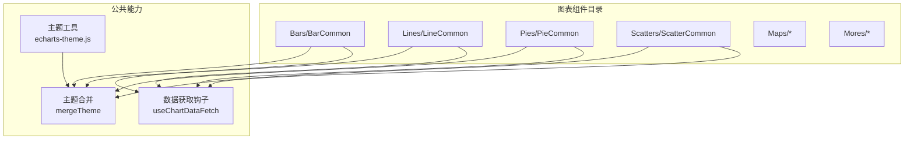
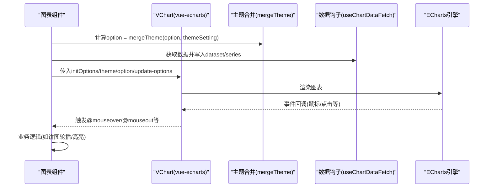
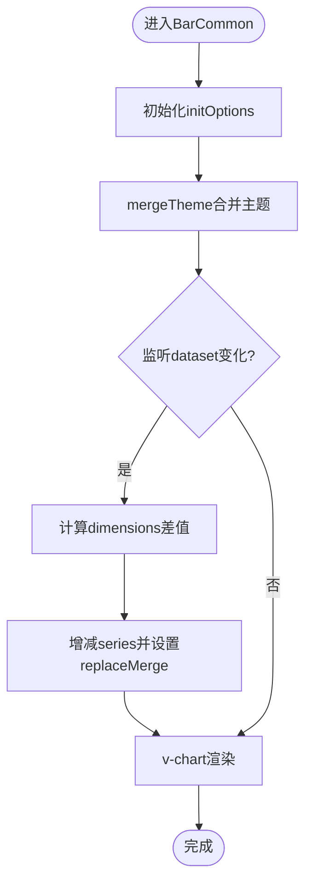
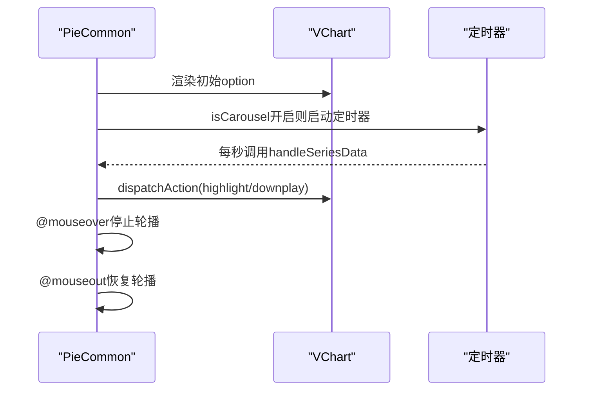
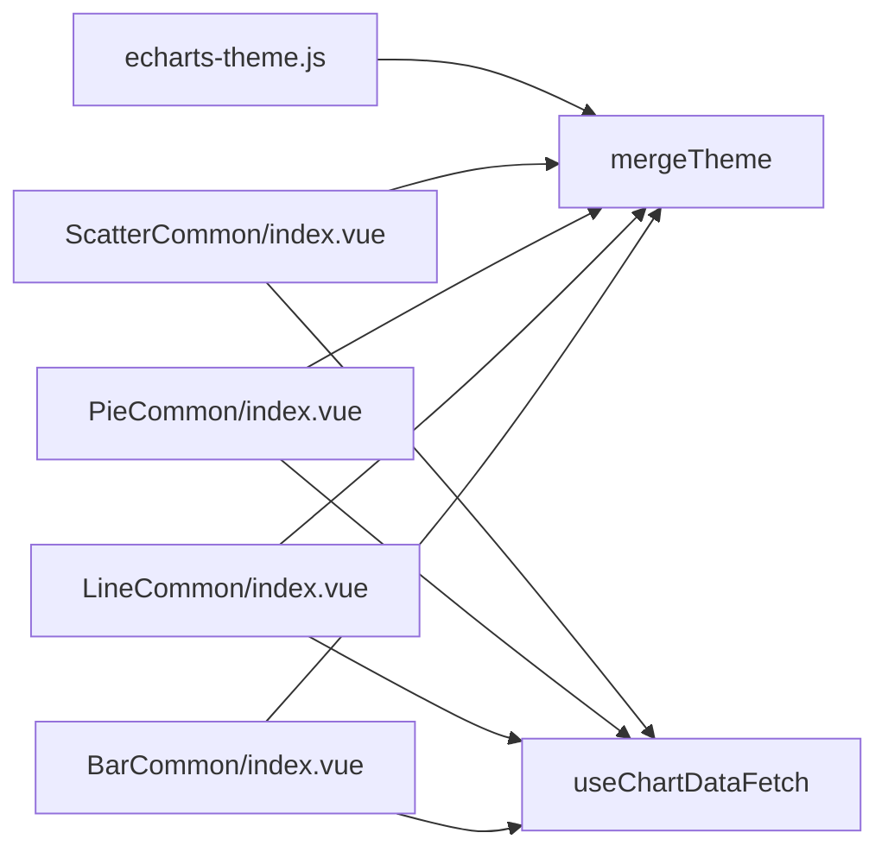

# 图表组件库

<cite>
**本文引用的文件**
- [forge-report-ui/src/packages/components/Charts/Bars/BarCommon/index.vue](file://forge-report-ui/src/packages/components/Charts/Bars/BarCommon/index.vue)
- [forge-report-ui/src/packages/components/Charts/Lines/LineCommon/index.vue](file://forge-report-ui/src/packages/components/Charts/Lines/LineCommon/index.vue)
- [forge-report-ui/src/packages/components/Charts/Pies/PieCommon/index.vue](file://forge-report-ui/src/packages/components/Charts/Pies/PieCommon/index.vue)
- [forge-report-ui/src/packages/components/Charts/Scatters/ScatterCommon/index.vue](file://forge-report-ui/src/packages/components/Charts/Scatters/ScatterCommon/index.vue)
- [forge-report-ui/src/packages/components/Charts/Mores/Graph/config.ts](file://forge-report-ui/src/packages/components/Charts/Mores/Graph/config.ts)
- [forge-admin-ui/src/utils/echarts-theme.js](file://forge-admin-ui/src/utils/echarts-theme.js)
</cite>

## 目录
1. [简介](#简介)
2. [项目结构](#项目结构)
3. [核心组件](#核心组件)
4. [架构总览](#架构总览)
5. [详细组件分析](#详细组件分析)
6. [依赖关系分析](#依赖关系分析)
7. [性能考量](#性能考量)
8. [故障排查指南](#故障排查指南)
9. [结论](#结论)
10. [附录](#附录)

## 简介
本文件为 Forge Admin 的图表组件库提供系统化文档，覆盖支持的图表类型、配置选项、主题样式、数据绑定方式、事件处理与扩展能力。重点包含柱状图、折线图、饼图、地图、散点图等常用图表的使用方法与最佳实践，并给出组件开发指南、性能优化建议、兼容性说明与常见问题排查方法。

## 项目结构
图表组件主要位于报告端（forge-report-ui）的 packages/components/Charts 目录下，按图表类型分目录组织：Bars（柱状图）、Lines（折线图）、Pies（饼图）、Scatters（散点图）、Maps（地图）、Mores（更多图表如关系图、雷达、漏斗等）。每个子图表由 index.vue（渲染）、config.ts（默认配置与系列项模板）、data.json（示例数据）组成，并通过统一的合并主题与数据获取机制集成到编辑器与预览环境。

图示来源
- [forge-report-ui/src/packages/components/Charts/Bars/BarCommon/index.vue:1-98](file://forge-report-ui/src/packages/components/Charts/Bars/BarCommon/index.vue#L1-L98)
- [forge-report-ui/src/packages/components/Charts/Lines/LineCommon/index.vue:1-85](file://forge-report-ui/src/packages/components/Charts/Lines/LineCommon/index.vue#L1-L85)
- [forge-report-ui/src/packages/components/Charts/Pies/PieCommon/index.vue:1-154](file://forge-report-ui/src/packages/components/Charts/Pies/PieCommon/index.vue#L1-L154)
- [forge-report-ui/src/packages/components/Charts/Scatters/ScatterCommon/index.vue:1-100](file://forge-report-ui/src/packages/components/Charts/Scatters/ScatterCommon/index.vue#L1-L100)
- [forge-admin-ui/src/utils/echarts-theme.js:1-519](file://forge-admin-ui/src/utils/echarts-theme.js#L1-L519)

章节来源
- [forge-report-ui/src/packages/components/Charts/Bars/BarCommon/index.vue:1-98](file://forge-report-ui/src/packages/components/Charts/Bars/BarCommon/index.vue#L1-L98)
- [forge-report-ui/src/packages/components/Charts/Lines/LineCommon/index.vue:1-85](file://forge-report-ui/src/packages/components/Charts/Lines/LineCommon/index.vue#L1-L85)
- [forge-report-ui/src/packages/components/Charts/Pies/PieCommon/index.vue:1-154](file://forge-report-ui/src/packages/components/Charts/Pies/PieCommon/index.vue#L1-L154)
- [forge-report-ui/src/packages/components/Charts/Scatters/ScatterCommon/index.vue:1-100](file://forge-report-ui/src/packages/components/Charts/Scatters/ScatterCommon/index.vue#L1-L100)
- [forge-admin-ui/src/utils/echarts-theme.js:1-519](file://forge-admin-ui/src/utils/echarts-theme.js#L1-L519)

## 核心组件
- 柱状图（BarCommon）：基于 vue-echarts + ECharts BarChart，支持 dataset 维度动态增减、主题合并、自动尺寸适配。
- 折线图（LineCommon）：基于 LineChart，支持平滑曲线、面积填充、主题预设与响应式布局。
- 饼图（PieCommon）：支持环形/玫瑰/普通模式切换、轮播高亮、鼠标交互控制。
- 散点图（ScatterCommon）：支持普通散点与特效散点、标记线/面/点、dataset 多系列映射。
- 关系图（Graph）：支持 none/circular/force 布局、力引导参数、标签位置与动画开关。
- 地图（Maps）：基础地图与高德地图两种实现，支持 GeoJSON 加载与区域高亮。

章节来源
- [forge-report-ui/src/packages/components/Charts/Bars/BarCommon/index.vue:1-98](file://forge-report-ui/src/packages/components/Charts/Bars/BarCommon/index.vue#L1-L98)
- [forge-report-ui/src/packages/components/Charts/Lines/LineCommon/index.vue:1-85](file://forge-report-ui/src/packages/components/Charts/Lines/LineCommon/index.vue#L1-L85)
- [forge-report-ui/src/packages/components/Charts/Pies/PieCommon/index.vue:1-154](file://forge-report-ui/src/packages/components/Charts/Pies/PieCommon/index.vue#L1-L154)
- [forge-report-ui/src/packages/components/Charts/Scatters/ScatterCommon/index.vue:1-100](file://forge-report-ui/src/packages/components/Charts/Scatters/ScatterCommon/index.vue#L1-L100)
- [forge-report-ui/src/packages/components/Charts/Mores/Graph/config.ts:1-86](file://forge-report-ui/src/packages/components/Charts/Mores/Graph/config.ts#L1-L86)

## 架构总览
图表组件统一通过以下流程工作：
- 初始化：使用 useCanvasInitOptions 生成 canvas 初始化选项，传入 v-chart。
- 主题：通过 mergeTheme 将 chartConfig.option 与 themeSetting 合并，确保全局主题一致。
- 数据：通过 useChartDataFetch 从编辑态或数据源拉取数据，更新 dataset 或 series。
- 渲染：v-chart 根据 option 渲染；在预览模式下使用 manual-update 避免重复更新。
- 事件：各组件监听 hover/highlight/downplay 等事件，实现交互逻辑（如饼图轮播）。

图示来源
- [forge-report-ui/src/packages/components/Charts/Bars/BarCommon/index.vue:1-98](file://forge-report-ui/src/packages/components/Charts/Bars/BarCommon/index.vue#L1-L98)
- [forge-report-ui/src/packages/components/Charts/Lines/LineCommon/index.vue:1-85](file://forge-report-ui/src/packages/components/Charts/Lines/LineCommon/index.vue#L1-L85)
- [forge-report-ui/src/packages/components/Charts/Pies/PieCommon/index.vue:1-154](file://forge-report-ui/src/packages/components/Charts/Pies/PieCommon/index.vue#L1-L154)
- [forge-report-ui/src/packages/components/Charts/Scatters/ScatterCommon/index.vue:1-100](file://forge-report-ui/src/packages/components/Charts/Scatters/ScatterCommon/index.vue#L1-L100)

## 详细组件分析

### 柱状图（BarCommon）
- 功能要点
  - 使用 dataset 管理维度与系列，支持动态增减 series 以匹配 dimensions。
  - 通过 replaceMergeArr 强制替换 series，解决 dataset 变更时系列数不同导致的合并问题。
  - 自动 resize，主题合并后渲染。
- 关键配置
  - initOptions：由 useCanvasInitOptions 生成，结合 themeSetting。
  - update-options.replaceMerge：用于在 dataset 变化时重置 series。
  - includes：用于限定主题合并范围（来自 config.ts）。
- 数据绑定
  - useChartDataFetch 返回 vChartRef，并在回调中更新 dataset。
- 事件与交互
  - 继承通用 tooltip/legend/grid 行为，可叠加自定义 formatter。

图示来源
- [forge-report-ui/src/packages/components/Charts/Bars/BarCommon/index.vue:1-98](file://forge-report-ui/src/packages/components/Charts/Bars/BarCommon/index.vue#L1-L98)

章节来源
- [forge-report-ui/src/packages/components/Charts/Bars/BarCommon/index.vue:1-98](file://forge-report-ui/src/packages/components/Charts/Bars/BarCommon/index.vue#L1-L98)

### 折线图（LineCommon）
- 功能要点
  - 基于 LineChart，支持平滑曲线、面积图、标记点/线。
  - 同样通过 dataset 维度驱动 series 数量，使用 replaceMerge 保证稳定更新。
- 关键配置
  - smooth、areaStyle、showSymbol、emphasis 等可通过 config.ts 暴露。
  - 响应式 grid/legend/xAxis/yAxis 可由主题工具提供。
- 数据绑定
  - useChartDataFetch 更新 dataset，watch 同步 series 数量。
- 事件与交互
  - 支持 tooltip、legend 筛选、dataZoom 缩放等。

章节来源
- [forge-report-ui/src/packages/components/Charts/Lines/LineCommon/index.vue:1-85](file://forge-report-ui/src/packages/components/Charts/Lines/LineCommon/index.vue#L1-L85)

### 饼图（PieCommon）
- 功能要点
  - 支持 normal/ring/rose 三种模式切换，自动调整 radius/roseType。
  - 支持轮播高亮：isCarousel=true 时定时 highlight/downplay 当前扇区。
  - 鼠标悬停暂停轮播，离开恢复。
- 关键配置
  - type 控制模式；isCarousel 控制轮播；radius/roseType 控制外观。
- 数据绑定
  - useChartDataFetch 更新数据，onMounted 初始化最大长度。
- 事件与交互
  - @mouseover/@mouseout 控制轮播启停；dispatchAction 控制高亮/取消。

图示来源
- [forge-report-ui/src/packages/components/Charts/Pies/PieCommon/index.vue:1-154](file://forge-report-ui/src/packages/components/Charts/Pies/PieCommon/index.vue#L1-L154)

章节来源
- [forge-report-ui/src/packages/components/Charts/Pies/PieCommon/index.vue:1-154](file://forge-report-ui/src/packages/components/Charts/Pies/PieCommon/index.vue#L1-L154)

### 散点图（ScatterCommon）
- 功能要点
  - 支持 ScatterChart 与 EffectScatterChart，可叠加 MarkLine/MarkArea/MarkPoint。
  - dataset 数组形式映射多个 series，每个 series 带 datasetIndex。
- 关键配置
  - symbolSize、effect 参数、mark 系列等可在 config.ts 中暴露。
- 数据绑定
  - watch dataset，动态生成 series 列表并设置 replaceMerge。
- 事件与交互
  - 支持 tooltip、legend、dataZoom、emphasis 等。

章节来源
- [forge-report-ui/src/packages/components/Charts/Scatters/ScatterCommon/index.vue:1-100](file://forge-report-ui/src/packages/components/Charts/Scatters/ScatterCommon/index.vue#L1-L100)

### 关系图（Graph）
- 功能要点
  - 支持 none/circular/force 布局，力引导参数可调（repulsion/gravity/edgeLength/friction）。
  - 标签显示与位置可配置，支持标签防重叠。
- 关键配置
  - layout、label.show/position/formatter、lineStyle.curveness、force.*。
- 数据绑定
  - 使用 data.json 中的 nodes/links/categories 构建数据集。
- 事件与交互
  - 支持 tooltip、legend、拖拽节点（需额外启用）。

章节来源
- [forge-report-ui/src/packages/components/Charts/Mores/Graph/config.ts:1-86](file://forge-report-ui/src/packages/components/Charts/Mores/Graph/config.ts#L1-L86)

### 地图（Maps）
- 功能要点
  - MapBase：基于 GeoJSON 的基础地图，支持区域高亮与数据映射。
  - MapAmap：基于高德地图的增强地图，适合地理可视化场景。
- 关键配置
  - geoJson 数据源、区域字段映射、颜色映射规则、tooltip 格式化。
- 数据绑定
  - 通过 dataset 或 series.data 注入区域数据。
- 事件与交互
  - 支持区域点击、悬浮高亮、缩放平移等。

章节来源
- [forge-report-ui/src/packages/components/Charts/Maps/MapBase/index.vue:1-200](file://forge-report-ui/src/packages/components/Charts/Maps/MapBase/index.vue#L1-L200)
- [forge-report-ui/src/packages/components/Charts/Maps/MapAmap/index.vue:1-200](file://forge-report-ui/src/packages/components/Charts/Maps/MapAmap/index.vue#L1-L200)

## 依赖关系分析
- 运行时依赖
  - vue-echarts（v-chart）作为渲染容器。
  - ECharts core/charts/components/renderers按需引入，减少包体积。
- 主题与样式
  - 主题工具 echarts-theme.js 提供统一配色、文本、坐标轴、提示框、进度条、标记等样式，以及暗色模式切换与响应式配置。
- 数据流
  - useChartDataFetch 负责数据获取与更新；dataset 驱动系列数量；replaceMerge 解决增量合并问题。
- 组件耦合
  - 各图表组件对 mergeTheme 与 useChartDataFetch 强依赖，保持配置与数据解耦。

图示来源
- [forge-report-ui/src/packages/components/Charts/Bars/BarCommon/index.vue:1-98](file://forge-report-ui/src/packages/components/Charts/Bars/BarCommon/index.vue#L1-L98)
- [forge-report-ui/src/packages/components/Charts/Lines/LineCommon/index.vue:1-85](file://forge-report-ui/src/packages/components/Charts/Lines/LineCommon/index.vue#L1-L85)
- [forge-report-ui/src/packages/components/Charts/Pies/PieCommon/index.vue:1-154](file://forge-report-ui/src/packages/components/Charts/Pies/PieCommon/index.vue#L1-L154)
- [forge-report-ui/src/packages/components/Charts/Scatters/ScatterCommon/index.vue:1-100](file://forge-report-ui/src/packages/components/Charts/Scatters/ScatterCommon/index.vue#L1-L100)
- [forge-admin-ui/src/utils/echarts-theme.js:1-519](file://forge-admin-ui/src/utils/echarts-theme.js#L1-L519)

章节来源
- [forge-report-ui/src/packages/components/Charts/Bars/BarCommon/index.vue:1-98](file://forge-report-ui/src/packages/components/Charts/Bars/BarCommon/index.vue#L1-L98)
- [forge-report-ui/src/packages/components/Charts/Lines/LineCommon/index.vue:1-85](file://forge-report-ui/src/packages/components/Charts/Lines/LineCommon/index.vue#L1-L85)
- [forge-report-ui/src/packages/components/Charts/Pies/PieCommon/index.vue:1-154](file://forge-report-ui/src/packages/components/Charts/Pies/PieCommon/index.vue#L1-L154)
- [forge-report-ui/src/packages/components/Charts/Scatters/ScatterCommon/index.vue:1-100](file://forge-report-ui/src/packages/components/Charts/Scatters/ScatterCommon/index.vue#L1-L100)
- [forge-admin-ui/src/utils/echarts-theme.js:1-519](file://forge-admin-ui/src/utils/echarts-theme.js#L1-L519)

## 性能考量
- 按需引入 ECharts 模块：仅注册需要的 charts/components/renderers，降低打包体积与初始化开销。
- 使用 dataset 管理数据：便于批量更新与维度映射，减少 series 手动维护成本。
- replaceMerge 策略：在 dataset 维度变化时强制替换 series，避免增量合并带来的性能抖动与状态不一致。
- 自动尺寸与懒更新：autoresize 与 manual-update（预览模式）减少不必要的重绘。
- 主题合并：通过 mergeTheme 集中管理样式，避免重复计算与样式冲突。
- 大数据量优化：启用 dataZoom、采样、降采样、虚拟滚动（配合外部方案）以提升交互流畅度。
- 动画控制：合理设置 animationDuration/easing，复杂图表可关闭动画提升首屏性能。

[本节为通用性能建议，不直接分析具体文件]

## 故障排查指南
- 现象：dataset 维度变更后系列数量未同步
  - 原因：ECharts 增量合并导致 series 数量不一致
  - 处理：使用 replaceMerge=['series'] 强制替换，参考柱状图/折线图/散点图的 watch 逻辑
  - 参考路径
    - [forge-report-ui/src/packages/components/Charts/Bars/BarCommon/index.vue:56-92](file://forge-report-ui/src/packages/components/Charts/Bars/BarCommon/index.vue#L56-L92)
    - [forge-report-ui/src/packages/components/Charts/Lines/LineCommon/index.vue:55-79](file://forge-report-ui/src/packages/components/Charts/Lines/LineCommon/index.vue#L55-L79)
    - [forge-report-ui/src/packages/components/Charts/Scatters/ScatterCommon/index.vue:72-96](file://forge-report-ui/src/packages/components/Charts/Scatters/ScatterCommon/index.vue#L72-L96)
- 现象：饼图轮播异常或无法停止
  - 原因：isCarousel 状态与定时器未正确清理
  - 处理：在 @mouseover 停止、@mouseout 恢复；数据更新时清理旧定时器
  - 参考路径
    - [forge-report-ui/src/packages/components/Charts/Pies/PieCommon/index.vue:69-100](file://forge-report-ui/src/packages/components/Charts/Pies/PieCommon/index.vue#L69-L100)
    - [forge-report-ui/src/packages/components/Charts/Pies/PieCommon/index.vue:127-138](file://forge-report-ui/src/packages/components/Charts/Pies/PieCommon/index.vue#L127-L138)
- 现象：主题切换后样式错乱
  - 原因：未应用统一主题或原始 option 被覆盖
  - 处理：使用 applyThemeToChart/toggleEChartsTheme 重新应用主题；确保 mergeTheme 包含必要字段
  - 参考路径
    - [forge-admin-ui/src/utils/echarts-theme.js:476-508](file://forge-admin-ui/src/utils/echarts-theme.js#L476-L508)
- 现象：地图无数据或区域高亮无效
  - 原因：geoJson 字段映射错误或数据格式不符
  - 处理：检查 name/value 字段映射、校验数据完整性；确认 regionKey 与 geoJson 名称一致
  - 参考路径
    - [forge-report-ui/src/packages/components/Charts/Maps/MapBase/index.vue:1-200](file://forge-report-ui/src/packages/components/Charts/Maps/MapBase/index.vue#L1-L200)

章节来源
- [forge-report-ui/src/packages/components/Charts/Bars/BarCommon/index.vue:56-92](file://forge-report-ui/src/packages/components/Charts/Bars/BarCommon/index.vue#L56-L92)
- [forge-report-ui/src/packages/components/Charts/Lines/LineCommon/index.vue:55-79](file://forge-report-ui/src/packages/components/Charts/Lines/LineCommon/index.vue#L55-L79)
- [forge-report-ui/src/packages/components/Charts/Pies/PieCommon/index.vue:69-100](file://forge-report-ui/src/packages/components/Charts/Pies/PieCommon/index.vue#L69-L100)
- [forge-report-ui/src/packages/components/Charts/Pies/PieCommon/index.vue:127-138](file://forge-report-ui/src/packages/components/Charts/Pies/PieCommon/index.vue#L127-L138)
- [forge-admin-ui/src/utils/echarts-theme.js:476-508](file://forge-admin-ui/src/utils/echarts-theme.js#L476-L508)
- [forge-report-ui/src/packages/components/Charts/Maps/MapBase/index.vue:1-200](file://forge-report-ui/src/packages/components/Charts/Maps/MapBase/index.vue#L1-L200)

## 结论
Forge Admin 图表组件库以 vue-echarts 为核心，结合统一的主题系统与数据钩子，提供了开箱即用的柱状图、折线图、饼图、散点图、关系图与地图等常见可视化能力。通过 dataset 驱动、replaceMerge 策略与自动 resize，兼顾了易用性与性能。建议在新增图表时遵循现有模式：定义 config.ts、封装 index.vue、复用 mergeTheme 与 useChartDataFetch，并完善主题与响应式配置。

[本节为总结性内容，不直接分析具体文件]

## 附录

### 常用图表配置速查
- 柱状图
  - 维度：xAxis/dimensions
  - 系列：series[]（由 dataset 维度自动生成）
  - 交互：tooltip、legend、dataZoom
  - 参考路径
    - [forge-report-ui/src/packages/components/Charts/Bars/BarCommon/index.vue:1-98](file://forge-report-ui/src/packages/components/Charts/Bars/BarCommon/index.vue#L1-L98)
- 折线图
  - 样式：smooth、areaStyle、showSymbol
  - 交互：tooltip、legend、dataZoom
  - 参考路径
    - [forge-report-ui/src/packages/components/Charts/Lines/LineCommon/index.vue:1-85](file://forge-report-ui/src/packages/components/Charts/Lines/LineCommon/index.vue#L1-L85)
- 饼图
  - 模式：normal/ring/rose（type）
  - 轮播：isCarousel
  - 参考路径
    - [forge-report-ui/src/packages/components/Charts/Pies/PieCommon/index.vue:1-154](file://forge-report-ui/src/packages/components/Charts/Pies/PieCommon/index.vue#L1-L154)
- 散点图
  - 系列：dataset 数组映射 series[]
  - 标记：markLine/markArea/markPoint
  - 参考路径
    - [forge-report-ui/src/packages/components/Charts/Scatters/ScatterCommon/index.vue:1-100](file://forge-report-ui/src/packages/components/Charts/Scatters/ScatterCommon/index.vue#L1-L100)
- 关系图
  - 布局：none/circular/force
  - 力引导：repulsion/gravity/edgeLength/friction
  - 参考路径
    - [forge-report-ui/src/packages/components/Charts/Mores/Graph/config.ts:1-86](file://forge-report-ui/src/packages/components/Charts/Mores/Graph/config.ts#L1-L86)
- 地图
  - 数据：geoJson + 区域字段映射
  - 交互：hover/click、缩放平移
  - 参考路径
    - [forge-report-ui/src/packages/components/Charts/Maps/MapBase/index.vue:1-200](file://forge-report-ui/src/packages/components/Charts/Maps/MapBase/index.vue#L1-L200)

### 主题与样式
- 主题来源：CSS 变量与暗色模式检测，统一输出 ECharts 主题对象
- 工具函数
  - getEChartsTheme：生成主题对象
  - generateChartGradient：生成渐变
  - getResponsiveConfig：响应式布局
  - toggleEChartsTheme/applyThemeToChart：主题切换与应用
- 参考路径
  - [forge-admin-ui/src/utils/echarts-theme.js:1-519](file://forge-admin-ui/src/utils/echarts-theme.js#L1-L519)

### 组件开发指南
- 新建图表步骤
  - 创建目录与文件：index.vue（渲染）、config.ts（默认配置与 includes）、data.json（示例数据）
  - 注册 ECharts 模块：use([...]) 按需引入
  - 初始化：useCanvasInitOptions 生成 initOptions
  - 主题：computed option = mergeTheme(chartConfig.option, themeSetting, includes)
  - 数据：useChartDataFetch 获取数据并更新 dataset/series
  - 交互：添加事件处理器（如 @mouseover/@mouseout），必要时使用 dispatchAction
- 最佳实践
  - 使用 dataset 管理维度与系列，避免手动维护 series 数量
  - 在 dataset 维度变化时使用 replaceMerge 保证稳定更新
  - 通过 includes 限制主题合并范围，避免覆盖用户配置
  - 预览模式使用 manual-update 避免重复更新

[本节为通用开发指导，不直接分析具体文件]