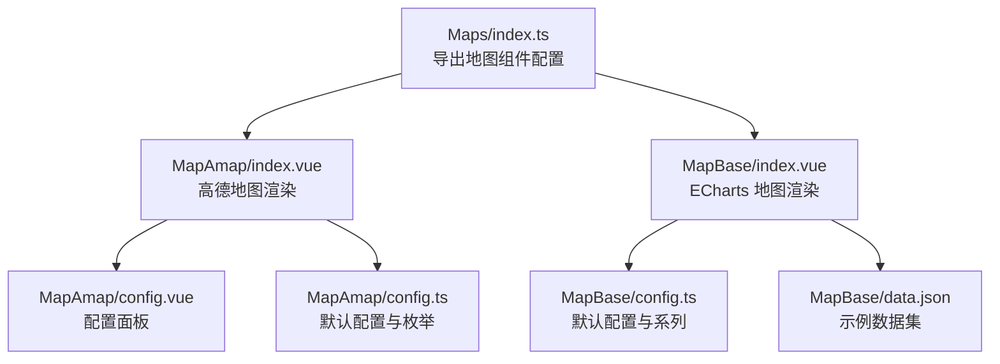
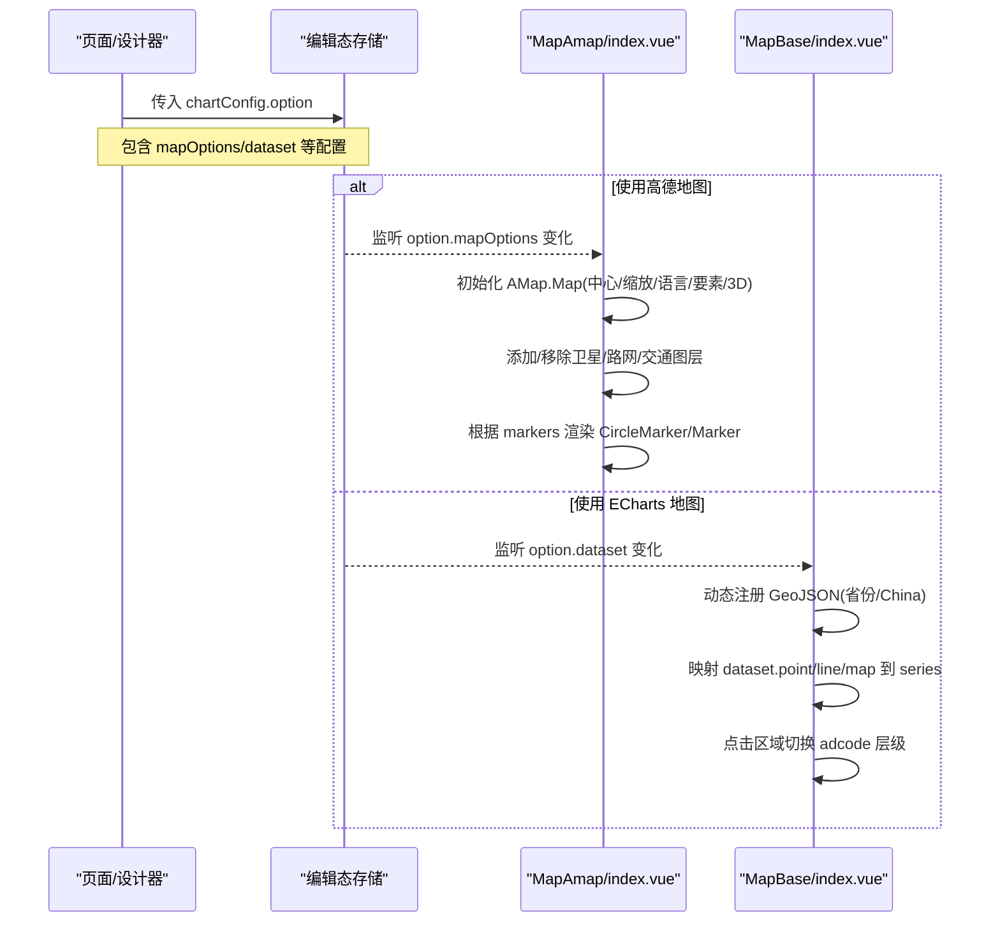
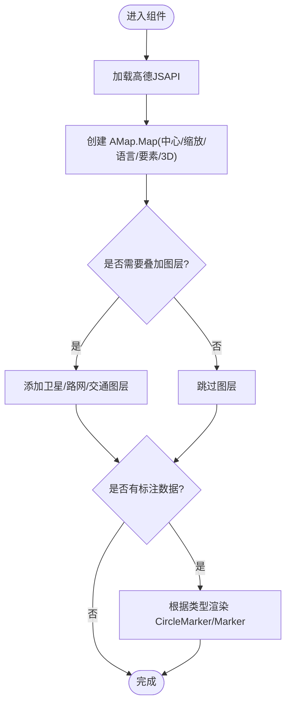
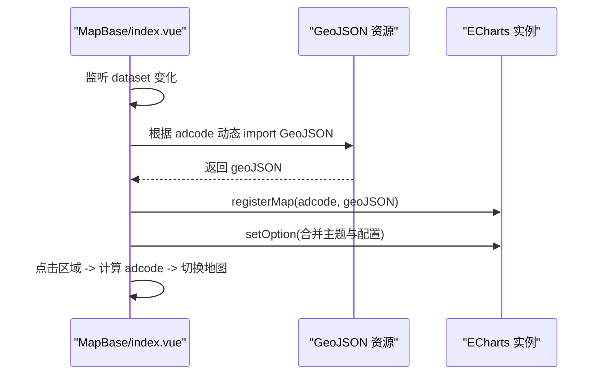
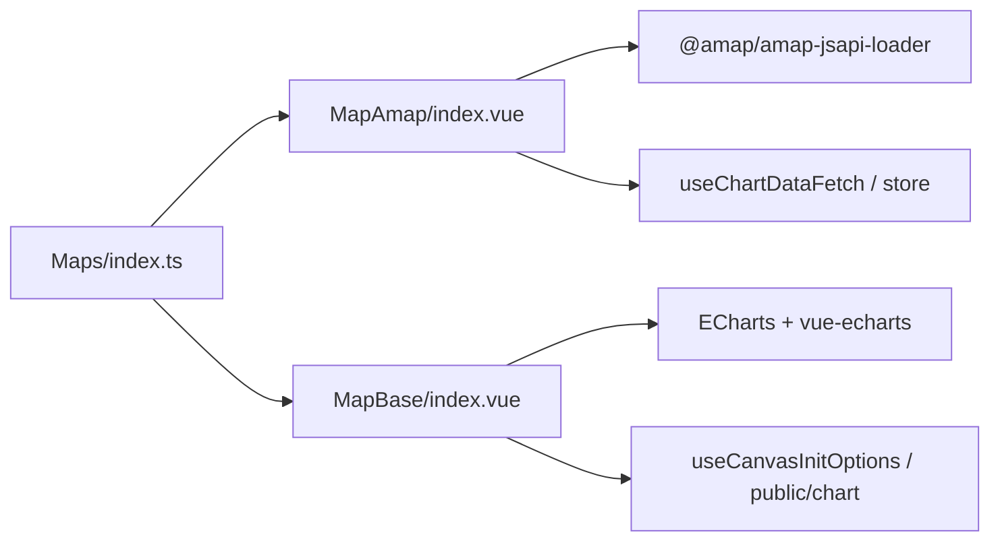

# 地图组件

<cite>
**本文引用的文件**
- [MapAmap/index.vue](file://forge-report-ui/src/packages/components/Charts/Maps/MapAmap/index.vue)
- [MapAmap/config.vue](file://forge-report-ui/src/packages/components/Charts/Maps/MapAmap/config.vue)
- [MapAmap/config.ts](file://forge-report-ui/src/packages/components/Charts/Maps/MapAmap/config.ts)
- [MapBase/index.vue](file://forge-report-ui/src/packages/components/Charts/Maps/MapBase/index.vue)
- [MapBase/config.ts](file://forge-report-ui/src/packages/components/Charts/Maps/MapBase/config.ts)
- [MapBase/data.json](file://forge-report-ui/src/packages/components/Charts/Maps/MapBase/data.json)
- [Maps/index.ts](file://forge-report-ui/src/packages/components/Charts/Maps/index.ts)
</cite>

## 目录
1. [简介](#简介)
2. [项目结构](#项目结构)
3. [核心组件](#核心组件)
4. [架构总览](#架构总览)
5. [详细组件分析](#详细组件分析)
6. [依赖关系分析](#依赖关系分析)
7. [性能与优化](#性能与优化)
8. [故障排查指南](#故障排查指南)
9. [结论](#结论)
10. [附录：配置项速查](#附录：配置项速查)

## 简介
本章节面向 Forge Admin 报表可视化中的地图组件，覆盖两种实现：
- MapAmap：基于高德地图 JS API 的交互式地图，支持主题、图层叠加、标注（点/圆）、3D 视图等。
- MapBase：基于 ECharts 的地理数据可视化，支持中国及省级地图、动态 GeoJSON 加载、区域点击钻取、散点与流向线等。

文档将系统说明两类地图的配置选项、数据绑定、样式定制、事件处理、图层管理、标注系统与扩展能力，并提供集成示例、性能优化、离线支持与移动端适配建议。

## 项目结构
地图组件位于报表前端包中，统一注册在地图模块索引下，便于设计器与运行时按需引入。

图表来源
- [Maps/index.ts:1-4](file://forge-report-ui/src/packages/components/Charts/Maps/index.ts#L1-L4)
- [MapAmap/index.vue:1-165](file://forge-report-ui/src/packages/components/Charts/Maps/MapAmap/index.vue#L1-L165)
- [MapBase/index.vue:1-269](file://forge-report-ui/src/packages/components/Charts/Maps/MapBase/index.vue#L1-L269)

章节来源
- [Maps/index.ts:1-4](file://forge-report-ui/src/packages/components/Charts/Maps/index.ts#L1-L4)

## 核心组件
- MapAmap
  - 使用 @amap/amap-jsapi-loader 动态加载高德地图 JSAPI，创建地图实例并设置中心、缩放、语言、显示要素、3D 模式等。
  - 支持卫星、路网、实时交通三类 TileLayer 叠加，可独立控制显隐、透明度、zIndex 与缩放范围。
  - 支持圆形标点与定位标点两种标注类型，通过 dataset.markers 驱动渲染。
  - 通过 mapOptions 变更深度监听触发重建或更新。
- MapBase
  - 基于 ECharts 的地图能力，注册 geo 与 series（effectScatter、map、lines）。
  - 支持按 adcode 动态 import GeoJSON，china 时可选择是否显示南海诸岛。
  - 支持点击区域进行层级钻取与返回上级。
  - 通过 dataset 的 point/line/map/pieces 字段映射到对应 series。

章节来源
- [MapAmap/index.vue:45-99](file://forge-report-ui/src/packages/components/Charts/Maps/MapAmap/index.vue#L45-L99)
- [MapAmap/index.vue:101-132](file://forge-report-ui/src/packages/components/Charts/Maps/MapAmap/index.vue#L101-L132)
- [MapBase/index.vue:84-108](file://forge-report-ui/src/packages/components/Charts/Maps/MapBase/index.vue#L84-L108)
- [MapBase/index.vue:117-134](file://forge-report-ui/src/packages/components/Charts/Maps/MapBase/index.vue#L117-L134)
- [MapBase/index.vue:144-192](file://forge-report-ui/src/packages/components/Charts/Maps/MapBase/index.vue#L144-L192)

## 架构总览
下图展示两种地图组件在运行时的初始化与数据流路径。

图表来源
- [MapAmap/index.vue:134-163](file://forge-report-ui/src/packages/components/Charts/Maps/MapAmap/index.vue#L134-L163)
- [MapBase/index.vue:194-254](file://forge-report-ui/src/packages/components/Charts/Maps/MapBase/index.vue#L194-L254)

## 详细组件分析

### MapAmap（高德地图）
- 属性与配置
  - 基础：语言、Key、自定义样式 ID、主题、显示要素、文字标注开关。
  - 位置：经度、纬度、初始缩放。
  - 模式：2D/3D；3D 模式下支持天空色与俯仰角。
  - 标记：类型（圆形标点/定位标点/隐藏），颜色等样式。
  - 图层：卫星、路网、实时交通，分别支持显隐、zIndex、透明度、缩放范围。
- 数据绑定
  - dataset.markers：数组，每项含 position（经纬度）与 value（半径等）。
  - 当 mapMarkerType 为 Marker 时，使用定位标点；为 CircleMarker 时，使用圆形标点。
- 事件与交互
  - 当前实现未直接暴露地图事件回调；可通过后续扩展在 initMap 后挂载事件。
- 生命周期与更新
  - 对 option.mapOptions 进行深度监听，变化时重新初始化地图。
  - 对 option.dataset 监听，调用 dataHandle 更新标注。
- 典型用法
  - 在高德控制台申请 Key 并在配置中填入。
  - 选择主题或自定义样式 ID 以匹配品牌风格。
  - 开启卫星/路网/交通图层用于业务场景。
  - 通过 dataset.markers 动态更新标注。

图表来源
- [MapAmap/index.vue:45-99](file://forge-report-ui/src/packages/components/Charts/Maps/MapAmap/index.vue#L45-L99)
- [MapAmap/index.vue:101-132](file://forge-report-ui/src/packages/components/Charts/Maps/MapAmap/index.vue#L101-L132)

章节来源
- [MapAmap/config.vue:1-169](file://forge-report-ui/src/packages/components/Charts/Maps/MapAmap/config.vue#L1-L169)
- [MapAmap/config.ts:54-100](file://forge-report-ui/src/packages/components/Charts/Maps/MapAmap/config.ts#L54-L100)
- [MapAmap/index.vue:45-163](file://forge-report-ui/src/packages/components/Charts/Maps/MapAmap/index.vue#L45-L163)

### MapBase（ECharts 地图）
- 属性与配置
  - mapRegion：adcode（china/省份代码）、是否显示南海诸岛、是否允许点击进入下级、返回按钮尺寸与颜色。
  - tooltip、visualMap：提示与分段着色。
  - geo：地图类型、漫游、缩放等。
  - series：effectScatter（散点）、map（区域面）、lines（流向线）三类系列。
- 数据绑定
  - dataset.point：effectScatter 数据，格式为 [name, [lng,lat], value]。
  - dataset.line：lines 数据，coords 为起止坐标。
  - dataset.map：map 系列数据，name/value。
  - dataset.pieces：visualMap 分段规则。
- 交互与事件
  - 点击区域：若启用 enter，则记录历史并切换到子级地图；提供“返回上级”按钮。
  - 切换 adcode：监听 adcode 变化，动态注册 GeoJSON 并刷新。
- 典型用法
  - 全国视图：adcode=china，可按需显示南海诸岛。
  - 省级视图：adcode=省份代码，自动异步加载对应 GeoJSON。
  - 结合 visualMap 做区域热力/分级着色。
  - 用 lines 绘制流向/路径，配合 effectScatter 标注热点。

图表来源
- [MapBase/index.vue:84-108](file://forge-report-ui/src/packages/components/Charts/Maps/MapBase/index.vue#L84-L108)
- [MapBase/index.vue:117-134](file://forge-report-ui/src/packages/components/Charts/Maps/MapBase/index.vue#L117-L134)
- [MapBase/index.vue:144-192](file://forge-report-ui/src/packages/components/Charts/Maps/MapBase/index.vue#L144-L192)

章节来源
- [MapBase/config.ts:10-176](file://forge-report-ui/src/packages/components/Charts/Maps/MapBase/config.ts#L10-L176)
- [MapBase/data.json:1-106](file://forge-report-ui/src/packages/components/Charts/Maps/MapBase/data.json#L1-L106)
- [MapBase/index.vue:1-269](file://forge-report-ui/src/packages/components/Charts/Maps/MapBase/index.vue#L1-L269)

## 依赖关系分析
- 组件注册
  - Maps/index.ts 同时导出 MapBase 与 MapAmap 的配置，供设计器与运行时统一识别。
- 外部依赖
  - MapAmap：@amap/amap-jsapi-loader 与高德地图 JSAPI。
  - MapBase：ECharts（core/charts/renderers/components）与 vue-echarts。
- 内部依赖
  - 两者均依赖公共工具：useChartDataFetch、mergeTheme、setOption、isPreview 等。

图表来源
- [Maps/index.ts:1-4](file://forge-report-ui/src/packages/components/Charts/Maps/index.ts#L1-L4)
- [MapAmap/index.vue:6-12](file://forge-report-ui/src/packages/components/Charts/Maps/MapAmap/index.vue#L6-L12)
- [MapBase/index.vue:31-45](file://forge-report-ui/src/packages/components/Charts/Maps/MapBase/index.vue#L31-L45)

章节来源
- [Maps/index.ts:1-4](file://forge-report-ui/src/packages/components/Charts/Maps/index.ts#L1-L4)

## 性能与优化
- 地图初始化与资源加载
  - MapAmap：按需加载高德 JSAPI，避免首屏阻塞；仅在必要时添加图层，减少渲染开销。
  - MapBase：按需 import GeoJSON，仅在切换区域时加载对应资源；china 时可选是否加载南海诸岛。
- 数据更新策略
  - MapAmap：对 mapOptions 深度监听，dataset 浅监听；批量移除旧标注后再添加新标注，避免重复渲染。
  - MapBase：监听 dataset 变化，仅映射必要字段到 series；预览模式下手动触发更新。
- 视觉与交互
  - 合理设置 zIndex、opacity、zooms 范围，避免不必要的重绘。
  - 关闭不必要的 features 与 label，降低复杂场景下的渲染压力。
- 移动端适配
  - 适当降低初始缩放级别与图层数量；在弱网环境下优先加载基础底图。
  - 使用触摸友好的交互（如放大缩小、双击聚焦）以提升体验。
- 离线地图支持
  - MapAmap：可将高德静态瓦片或离线 SDK 接入（需遵循高德授权协议），替换在线加载逻辑。
  - MapBase：将 GeoJSON 本地化，避免网络请求；对频繁切换的区域预缓存 JSON。

[本节为通用指导，不直接分析具体文件]

## 故障排查指南
- 高德地图无法加载
  - 检查 amapKey 是否正确配置；确认网络可达与域名白名单。
  - 查看浏览器控制台错误信息，确认版本与插件列表是否匹配。
- 标注不显示
  - 确认 dataset.markers 存在且格式正确（position/value）。
  - 检查 mapMarkerType 与 marker 样式配置是否生效。
- ECharts 地图无数据
  - 确认 dataset.point/line/map/pieces 已正确传入。
  - 检查 adcode 对应的 GeoJSON 是否成功注册。
- 区域点击无效
  - 确认 mapRegion.enter 已开启；检查 e.name 与 region name 匹配逻辑。
- 性能卡顿
  - 减少图层叠加与标注数量；调整 zooms 范围与透明度；避免频繁 deep watch 大对象。

章节来源
- [MapAmap/index.vue:45-99](file://forge-report-ui/src/packages/components/Charts/Maps/MapAmap/index.vue#L45-L99)
- [MapAmap/index.vue:101-132](file://forge-report-ui/src/packages/components/Charts/Maps/MapAmap/index.vue#L101-L132)
- [MapBase/index.vue:84-108](file://forge-report-ui/src/packages/components/Charts/Maps/MapBase/index.vue#L84-L108)
- [MapBase/index.vue:144-192](file://forge-report-ui/src/packages/components/Charts/Maps/MapBase/index.vue#L144-L192)

## 结论
MapAmap 与 MapBase 分别满足“高保真交互地图”和“轻量级地理数据可视化”两类需求。前者适合需要丰富图层与 3D 效果的场景，后者更适合快速构建区域数据看板与联动分析。通过合理的配置与数据绑定，二者均可支撑地理位置可视化、区域数据关联、动态标注、路径规划等常见业务场景。在生产环境中，建议结合性能优化与离线策略，确保在不同网络与设备条件下的稳定表现。

[本节为总结性内容，不直接分析具体文件]

## 附录：配置项速查
- MapAmap
  - 基础：lang、amapKey、amapStyleKeyCustom、amapStyleKey、features、showLabel
  - 位置：amapLon、amapLat、amapZindex
  - 模式：viewMode（2D/3D）、pitch、skyColor
  - 标记：mapMarkerType（CircleMarker/Marker/none）、marker.fillColor 等
  - 图层：satelliteTileLayer、roadNetTileLayer、trafficTileLayer（show/zIndex/opacity/zooms）
- MapBase
  - 区域：mapRegion.adcode、showHainanIsLands、enter、backSize、backColor
  - 提示与着色：tooltip、visualMap（pieces/inRange/textStyle）
  - 地理：geo（type/roam/map/selectedMode/zoom）
  - 系列：series[0] effectScatter、series[1] map、series[2] lines（effect/lineStyle）
  - 数据：dataset.point/line/map/pieces

章节来源
- [MapAmap/config.vue:1-169](file://forge-report-ui/src/packages/components/Charts/Maps/MapAmap/config.vue#L1-L169)
- [MapAmap/config.ts:54-100](file://forge-report-ui/src/packages/components/Charts/Maps/MapAmap/config.ts#L54-L100)
- [MapBase/config.ts:10-176](file://forge-report-ui/src/packages/components/Charts/Maps/MapBase/config.ts#L10-L176)
- [MapBase/data.json:1-106](file://forge-report-ui/src/packages/components/Charts/Maps/MapBase/data.json#L1-L106)