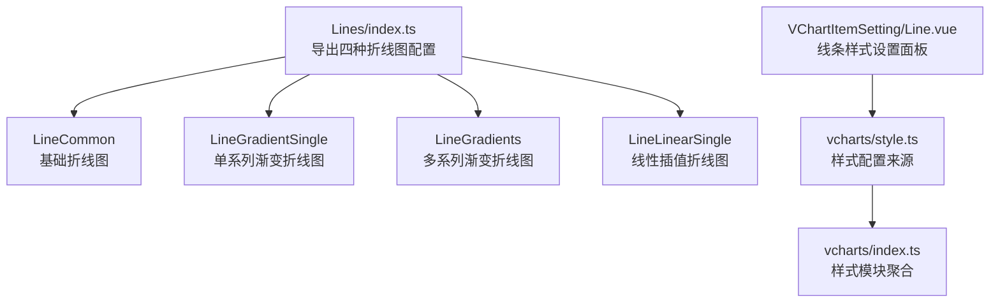
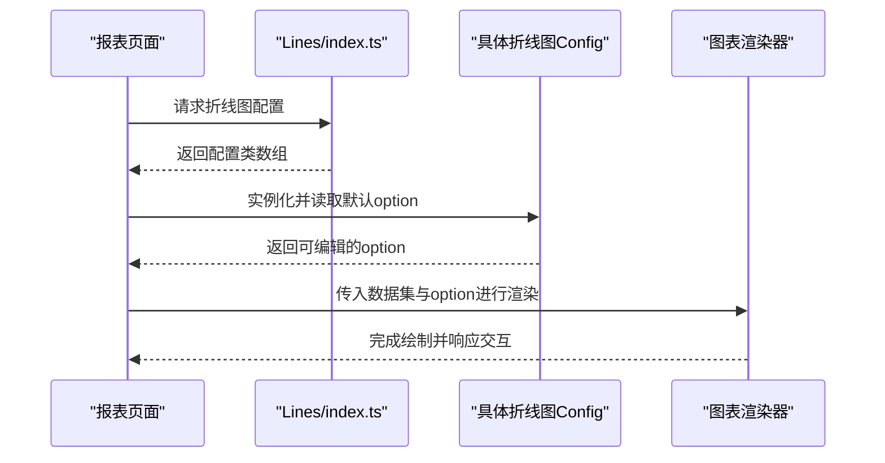
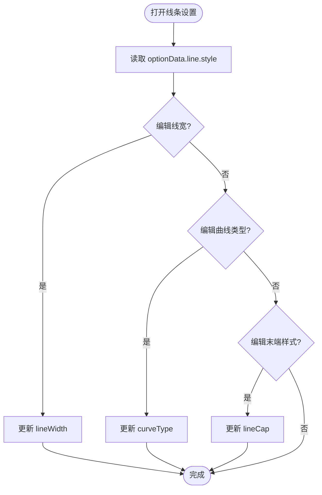
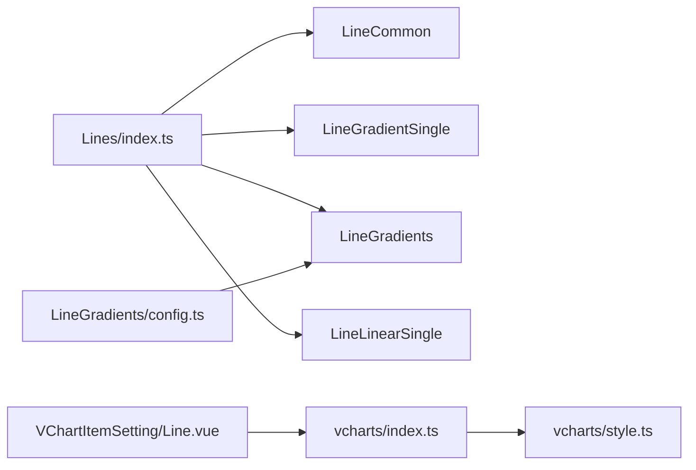

# 折线图组件

<cite>
**本文引用的文件**
- [Lines/index.ts](file://forge-report-ui/src/packages/components/Charts/Lines/index.ts)
- [LineGradients/config.ts](file://forge-report-ui/src/packages/components/Charts/Lines/LineGradients/config.ts)
- [Line.vue](file://forge-report-ui/src/components/Pages/VChartItemSetting/Line.vue)
- [vcharts/index.ts](file://forge-report-ui/src/packages/chartConfiguration/vcharts/index.ts)
</cite>

## 目录
1. [简介](#简介)
2. [项目结构](#项目结构)
3. [核心组件](#核心组件)
4. [架构总览](#架构总览)
5. [详细组件分析](#详细组件分析)
6. [依赖关系分析](#依赖关系分析)
7. [性能考虑](#性能考虑)
8. [故障排查指南](#故障排查指南)
9. [结论](#结论)
10. [附录](#附录)

## 简介
本文件为 Forge Admin 报告端（forge-report-ui）中折线图组件的权威文档，覆盖以下四类折线图：
- LineCommon：基础折线图
- LineGradientSingle：单系列渐变折线图
- LineGradients：多系列渐变折线图
- LineLinearSingle：线性插值折线图

文档将系统说明各类型的配置项、数据绑定方式、样式定制能力，以及事件处理、渐变效果、线性插值、动画过渡等特性。同时提供使用示例与最佳实践，并给出大数据量渲染与交互体验优化建议。

## 项目结构
折线图相关代码主要位于 forge-report-ui 的 packages/components/Charts/Lines 目录下，并通过统一入口导出；图表项设置面板在 components/Pages/VChartItemSetting 下，用于可视化编辑折线样式等选项。

图示来源
- [Lines/index.ts:1-6](file://forge-report-ui/src/packages/components/Charts/Lines/index.ts#L1-L6)
- [Line.vue:1-34](file://forge-report-ui/src/components/Pages/VChartItemSetting/Line.vue#L1-L34)
- [vcharts/index.ts:1-4](file://forge-report-ui/src/packages/chartConfiguration/vcharts/index.ts#L1-L4)

章节来源
- [Lines/index.ts:1-6](file://forge-report-ui/src/packages/components/Charts/Lines/index.ts#L1-L6)
- [Line.vue:1-34](file://forge-report-ui/src/components/Pages/VChartItemSetting/Line.vue#L1-L34)
- [vcharts/index.ts:1-4](file://forge-report-ui/src/packages/chartConfiguration/vcharts/index.ts#L1-L4)

## 核心组件
- 统一注册与导出：通过 Lines/index.ts 集中导出四种折线图配置类，便于报表设计器或运行时按需加载。
- 多系列渐变折线图：LineGradients/config.ts 展示了多 series 的默认配置，包含 tooltip、坐标轴、dataset、series 列表、areaStyle 渐变填充等。
- 线条样式设置：VChartItemSetting/Line.vue 提供对 line.style.lineWidth、curveType、lineCap 的可视化编辑，数据来源为 vcharts 样式配置。

章节来源
- [Lines/index.ts:1-6](file://forge-report-ui/src/packages/components/Charts/Lines/index.ts#L1-L6)
- [LineGradients/config.ts:9-92](file://forge-report-ui/src/packages/components/Charts/Lines/LineGradients/config.ts#L9-L92)
- [Line.vue:1-34](file://forge-report-ui/src/components/Pages/VChartItemSetting/Line.vue#L1-L34)
- [vcharts/index.ts:1-4](file://forge-report-ui/src/packages/chartConfiguration/vcharts/index.ts#L1-L4)

## 架构总览
折线图在报表中的典型调用链如下：报表页面选择“折线图”类型 -> 由 Lines/index.ts 暴露的配置类初始化图表实例 -> 根据数据集生成 dataset/series -> 应用主题与样式 -> 渲染到画布。

图示来源
- [Lines/index.ts:1-6](file://forge-report-ui/src/packages/components/Charts/Lines/index.ts#L1-L6)
- [LineGradients/config.ts:9-92](file://forge-report-ui/src/packages/components/Charts/Lines/LineGradients/config.ts#L9-L92)

## 详细组件分析

### LineCommon（基础折线图）
- 定位：最基础的折线展示，适合单系列或少量系列的趋势对比。
- 关键配置要点（基于通用折线配置约定）：
  - 数据绑定：通常通过 dataset 或 series.data 绑定时间序列或分类数据。
  - 样式：支持 lineStyle.width、type、color；symbol 点样式；smooth 平滑曲线开关。
  - 交互：tooltip 触发方式、axisPointer 指示器类型。
  - 动画：enterAnimation、dataAnimation 控制入场与数据更新动画。
- 适用场景：KPI 趋势、指标监控、简单时序对比。

章节来源
- [Lines/index.ts:1-6](file://forge-report-ui/src/packages/components/Charts/Lines/index.ts#L1-L6)

### LineGradientSingle（单系列渐变折线图）
- 定位：单条折线配合区域渐变填充，强调趋势与体量感。
- 关键配置要点：
  - areaStyle 使用线性渐变，从顶部主色向底部透明过渡，突出视觉层次。
  - 可通过 theme/colors 动态切换渐变色系。
  - 推荐开启 symbol 以增强关键节点可读性。
- 适用场景：营收趋势、流量趋势、转化率等单指标重点展示。

章节来源
- [LineGradients/config.ts:28-84](file://forge-report-ui/src/packages/components/Charts/Lines/LineGradients/config.ts#L28-L84)

### LineGradients（多系列渐变折线图）
- 定位：多条折线各自带渐变区域填充，适合多指标同屏对比。
- 关键配置要点：
  - series 数组定义多个折线，每条独立配置 areaStyle 渐变颜色。
  - tooltip 设置为 axis 触发，便于横向对比同一时间点各系列值。
  - xAxis 为 category，yAxis 为 value，dataset 承载数据源。
- 适用场景：多维度指标对比（如不同渠道、不同产品线的趋势）。

章节来源
- [LineGradients/config.ts:9-92](file://forge-report-ui/src/packages/components/Charts/Lines/LineGradients/config.ts#L9-L92)

### LineLinearSingle（线性插值折线图）
- 定位：以线性插值连接数据点，强调连续性与变化速率。
- 关键配置要点：
  - 通过 smooth 或 interpolation 相关属性控制插值形态（若底层引擎支持）。
  - 对于高频采样数据，建议关闭不必要的 symbol 以提升性能。
  - 结合 dataZoom 实现缩放浏览。
- 适用场景：传感器数据、实时流式指标、高频采样曲线。

章节来源
- [Lines/index.ts:1-6](file://forge-report-ui/src/packages/components/Charts/Lines/index.ts#L1-L6)

### 线条样式与可视化编辑
- VChartItemSetting/Line.vue 提供对 line.style.lineWidth、curveType、lineCap 的可视化编辑，数据绑定至 optionData.line.style。
- 样式选项来源于 vcharts 样式配置模块，便于统一主题管理。

图示来源
- [Line.vue:1-34](file://forge-report-ui/src/components/Pages/VChartItemSetting/Line.vue#L1-L34)
- [vcharts/index.ts:1-4](file://forge-report-ui/src/packages/chartConfiguration/vcharts/index.ts#L1-L4)

章节来源
- [Line.vue:1-34](file://forge-report-ui/src/components/Pages/VChartItemSetting/Line.vue#L1-L34)
- [vcharts/index.ts:1-4](file://forge-report-ui/src/packages/chartConfiguration/vcharts/index.ts#L1-L4)

## 依赖关系分析
- 组件注册依赖：Lines/index.ts 聚合四种折线图配置，供上层统一消费。
- 样式依赖：VChartItemSetting/Line.vue 依赖 vcharts/style.ts 提供的样式枚举与默认值，并通过 vcharts/index.ts 聚合导出。
- 图表配置依赖：LineGradients/config.ts 定义了多系列折线的默认 option，包括 tooltip、坐标轴、dataset、series 及 areaStyle 渐变。

图示来源
- [Lines/index.ts:1-6](file://forge-report-ui/src/packages/components/Charts/Lines/index.ts#L1-L6)
- [Line.vue:1-34](file://forge-report-ui/src/components/Pages/VChartItemSetting/Line.vue#L1-L34)
- [vcharts/index.ts:1-4](file://forge-report-ui/src/packages/chartConfiguration/vcharts/index.ts#L1-L4)
- [LineGradients/config.ts:9-92](file://forge-report-ui/src/packages/components/Charts/Lines/LineGradients/config.ts#L9-L92)

章节来源
- [Lines/index.ts:1-6](file://forge-report-ui/src/packages/components/Charts/Lines/index.ts#L1-L6)
- [Line.vue:1-34](file://forge-report-ui/src/components/Pages/VChartItemSetting/Line.vue#L1-L34)
- [vcharts/index.ts:1-4](file://forge-report-ui/src/packages/chartConfiguration/vcharts/index.ts#L1-L4)
- [LineGradients/config.ts:9-92](file://forge-report-ui/src/packages/components/Charts/Lines/LineGradients/config.ts#L9-L92)

## 性能考虑
- 大数据量渲染
  - 合理分页或抽样：对超长时序数据进行采样或分片加载，避免一次性渲染过多点。
  - 关闭冗余装饰：大量数据时关闭 symbol、label 显示，减少绘制开销。
  - 启用数据缩放：使用 dataZoom 提升交互浏览效率。
  - 动画策略：首次渲染可禁用或缩短 enterAnimation/dataAnimation，后续增量更新再开启。
- 交互体验优化
  - tooltip 触发模式：多系列建议使用 axis 触发，便于横向对比。
  - 坐标轴自适应：合理设置 splitNumber、min/max，避免刻度过密。
  - 主题与颜色：使用统一主题色板，确保对比度与无障碍友好。
- 内存与重绘
  - 避免频繁创建对象：复用 series 配置与渐变对象。
  - 及时释放资源：组件销毁时清理监听与定时器。

[本节为通用性能建议，不直接分析具体文件]

## 故障排查指南
- 样式未生效
  - 检查 VChartItemSetting/Line.vue 是否正确绑定到 optionData.line.style 对应字段。
  - 确认 vcharts/style.ts 是否提供了对应的枚举值（如 curveType、lineCap）。
- 渐变异常
  - 检查 areaStyle 的渐变方向与颜色节点是否有效，避免无效颜色或越界偏移。
  - 多系列情况下确保每个 series 的 areaStyle 颜色互不干扰。
- 数据不显示
  - 核对 dataset/series.data 的数据结构与字段映射是否符合预期。
  - 检查 xAxis 类型（category/value）与数据维度是否匹配。
- 交互无响应
  - 确认 tooltip 与 axisPointer 配置未被覆盖或隐藏。
  - 检查是否存在遮罩层或 z-index 冲突。

章节来源
- [Line.vue:1-34](file://forge-report-ui/src/components/Pages/VChartItemSetting/Line.vue#L1-L34)
- [LineGradients/config.ts:9-92](file://forge-report-ui/src/packages/components/Charts/Lines/LineGradients/config.ts#L9-L92)

## 结论
Forge Admin 的折线图组件通过统一的注册机制与灵活的样式配置，覆盖了从基础折线到多系列渐变、线性插值的多种业务场景。借助可视化设置面板与主题化样式体系，开发者可以快速构建高质量的趋势可视化。在生产环境中，应重点关注大数据量下的渲染性能与交互流畅度，遵循本文的性能与排错建议以获得更优的用户体验。

[本节为总结性内容，不直接分析具体文件]

## 附录
- 快速上手清单
  - 选择折线图类型：LineCommon / LineGradientSingle / LineGradients / LineLinearSingle
  - 绑定数据：准备 dataset 或 series.data，确保维度与坐标轴一致
  - 样式定制：通过 VChartItemSetting/Line.vue 调整线宽、曲线类型、末端样式
  - 交互配置：设置 tooltip、axisPointer、dataZoom 等
  - 主题适配：使用 vcharts 主题色板统一视觉风格
- 参考路径
  - 组件注册入口：[Lines/index.ts](file://forge-report-ui/src/packages/components/Charts/Lines/index.ts)
  - 多系列渐变默认配置：[LineGradients/config.ts](file://forge-report-ui/src/packages/components/Charts/Lines/LineGradients/config.ts)
  - 线条样式设置面板：[VChartItemSetting/Line.vue](file://forge-report-ui/src/components/Pages/VChartItemSetting/Line.vue)
  - 样式配置聚合：[vcharts/index.ts](file://forge-report-ui/src/packages/chartConfiguration/vcharts/index.ts)

[本节为补充信息，不直接分析具体文件]