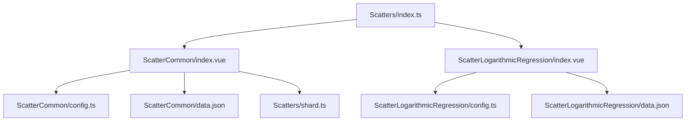
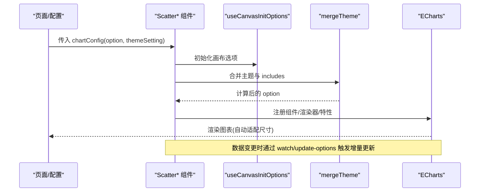
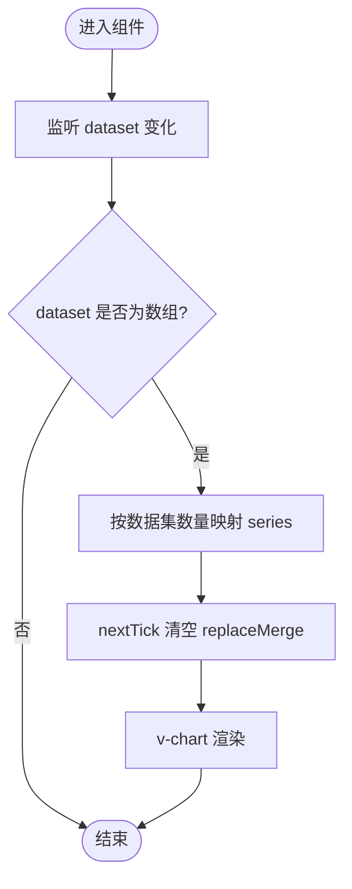
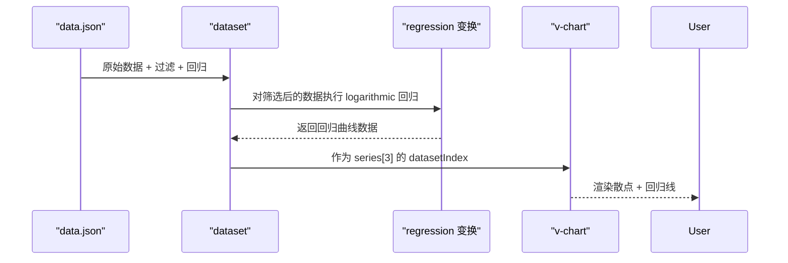
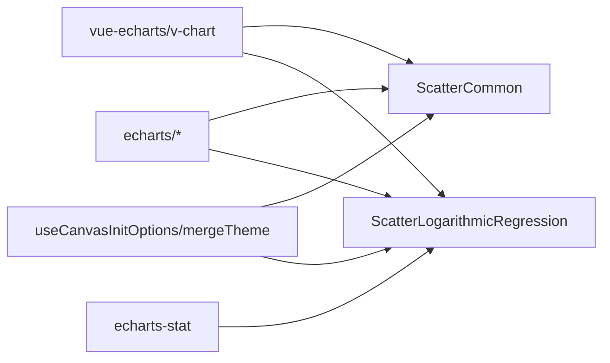

# 散点图组件

<cite>
**本文引用的文件**
- [Scatters/index.ts](file://forge-report-ui/src/packages/components/Charts/Scatters/index.ts)
- [ScatterCommon/index.vue](file://forge-report-ui/src/packages/components/Charts/Scatters/ScatterCommon/index.vue)
- [ScatterCommon/config.ts](file://forge-report-ui/src/packages/components/Charts/Scatters/ScatterCommon/config.ts)
- [ScatterCommon/data.json](file://forge-report-ui/src/packages/components/Charts/Scatters/ScatterCommon/data.json)
- [ScatterLogarithmicRegression/index.vue](file://forge-report-ui/src/packages/components/Charts/Scatters/ScatterLogarithmicRegression/index.vue)
- [ScatterLogarithmicRegression/config.ts](file://forge-report-ui/src/packages/components/Charts/Scatters/ScatterLogarithmicRegression/config.ts)
- [ScatterLogarithmicRegression/data.json](file://forge-report-ui/src/packages/components/Charts/Scatters/ScatterLogarithmicRegression/data.json)
- [Scatters/shard.ts](file://forge-report-ui/src/packages/components/Charts/Scatters/shard.ts)
</cite>

## 目录
1. [简介](#简介)
2. [项目结构](#项目结构)
3. [核心组件](#核心组件)
4. [架构总览](#架构总览)
5. [详细组件分析](#详细组件分析)
6. [依赖关系分析](#依赖关系分析)
7. [性能与大数据优化](#性能与大数据优化)
8. [故障排查指南](#故障排查指南)
9. [结论](#结论)
10. [附录：使用示例与高级场景](#附录：使用示例与高级场景)

## 简介
本章节面向 Forge Admin 报表模块中的散点图组件，覆盖基础散点图（ScatterCommon）与对数回归散点图（ScatterLogarithmicRegression）。文档将系统说明两类图表的配置项、数据绑定方式、样式定制、事件处理、对数回归分析、数据点标记、聚类效果，并提供基础用法与高级分析场景（数据分布可视化、相关性分析、异常值检测），以及大数据集渲染优化与交互查询建议。

## 项目结构
散点图能力位于报表前端包的 Charts/Scatters 目录下，采用“按图表类型分目录”的组织方式：
- ScatterCommon：基础散点图，支持普通散点与特效散点，提供多数据集、标记区域/点等能力。
- ScatterLogarithmicRegression：对数回归散点图，内置数据过滤与回归变换，输出趋势线。
- shard.ts：共享枚举（如散点类型、符号形状）。
- index.ts：统一导出两个图表配置，供上层注册与选择。

**图示来源**
- [Scatters/index.ts:1-5](file://forge-report-ui/src/packages/components/Charts/Scatters/index.ts#L1-L5)
- [ScatterCommon/index.vue:1-100](file://forge-report-ui/src/packages/components/Charts/Scatters/ScatterCommon/index.vue#L1-L100)
- [ScatterLogarithmicRegression/index.vue:1-78](file://forge-report-ui/src/packages/components/Charts/Scatters/ScatterLogarithmicRegression/index.vue#L1-L78)

**章节来源**
- [Scatters/index.ts:1-5](file://forge-report-ui/src/packages/components/Charts/Scatters/index.ts#L1-L5)

## 核心组件
- 基础散点图（ScatterCommon）
  - 渲染：基于 vue-echarts 的 v-chart，启用 Canvas 渲染器与多种 ECharts 组件。
  - 数据：通过 dataset 数组驱动多个 series，动态映射 series 数量。
  - 样式：支持 symbolSize、markArea、markPoint、tooltip、坐标轴 scale 等。
  - 交互：十字准星、提示框延迟、系列高亮聚焦。
- 对数回归散点图（ScatterLogarithmicRegression）
  - 渲染：在基础散点基础上引入折线图用于绘制回归线，并注册 echarts-stat 的回归变换。
  - 数据：dataset 包含原始数据、按年份过滤的数据集、以及经回归变换生成的数据集。
  - 样式：visualMap 控制点大小映射；折线平滑显示并标注回归系数。
  - 交互：十字准星、提示框、图例由过滤后的类别生成。

**章节来源**
- [ScatterCommon/index.vue:14-99](file://forge-report-ui/src/packages/components/Charts/Scatters/ScatterCommon/index.vue#L14-L99)
- [ScatterLogarithmicRegression/index.vue:14-77](file://forge-report-ui/src/packages/components/Charts/Scatters/ScatterLogarithmicRegression/index.vue#L14-L77)

## 架构总览
下图展示从配置到渲染的关键流程：配置对象被主题合并后注入 v-chart，dataset 驱动 series，必要时通过 transform 进行数据转换（如过滤、回归），最终完成渲染与交互。

**图示来源**
- [ScatterCommon/index.vue:51-70](file://forge-report-ui/src/packages/components/Charts/Scatters/ScatterCommon/index.vue#L51-L70)
- [ScatterLogarithmicRegression/index.vue:52-74](file://forge-report-ui/src/packages/components/Charts/Scatters/ScatterLogarithmicRegression/index.vue#L52-L74)

## 详细组件分析

### 基础散点图（ScatterCommon）
- 关键实现要点
  - 注册 ECharts 组件：散点图、特效散点、网格、工具提示、图例、标线/面/点等。
  - 主题合并：通过 mergeTheme 将主题设置与 includes 白名单应用到 option。
  - dataset 动态 series：监听 dataset 变化，根据数据集数量重建 series 列表，确保条数可变更。
  - 默认样式：symbolSize、markArea（透明背景+虚线边框）、markPoint（最大/最小点）。
  - 交互：tooltip 带延迟与十字准星，x/y 轴开启 scale。
- 配置项概览
  - dataset：二维数组或多组维度数据，每组对应一个 series。
  - tooltip：格式化显示 x/y 值或名称与值。
  - xAxis/yAxis：value 类型且开启 scale。
  - series：type 为 scatter 或 effectScatter，symbolSize、emphasis.focus 等。
  - markArea/markPoint：辅助标注区域与极值点。
- 数据格式
  - data.json 中每个元素包含 dimensions 与 source，source 为 [x, y] 数组集合。
- 事件与扩展
  - 可通过 v-chart 的事件机制绑定 click/dblclick 等事件（组件已暴露 ref）。
  - 可通过修改 option.series 的 itemStyle/lineStyle 等实现更细粒度样式定制。

**图示来源**
- [ScatterCommon/index.vue:72-96](file://forge-report-ui/src/packages/components/Charts/Scatters/ScatterCommon/index.vue#L72-L96)

**章节来源**
- [ScatterCommon/index.vue:14-99](file://forge-report-ui/src/packages/components/Charts/Scatters/ScatterCommon/index.vue#L14-L99)
- [ScatterCommon/config.ts:9-80](file://forge-report-ui/src/packages/components/Charts/Scatters/ScatterCommon/config.ts#L9-L80)
- [ScatterCommon/data.json:1-111](file://forge-report-ui/src/packages/components/Charts/Scatters/ScatterCommon/data.json#L1-L111)
- [Scatters/shard.ts:1-16](file://forge-report-ui/src/packages/components/Charts/Scatters/shard.ts#L1-L16)

### 对数回归散点图（ScatterLogarithmicRegression）
- 关键实现要点
  - 注册 ECharts 组件：散点图、折线图、视觉映射、变换组件、通用过渡与标签布局。
  - 注册回归变换：使用 echarts-stat 的 regression 变换，方法为 logarithmic。
  - 数据管道：dataset[0] 原始数据；dataset[1]/[2] 通过 filter 变换按年份筛选；dataset[3] 对筛选后的数据进行回归变换得到趋势线数据。
  - 样式：visualMap 将第三维（如人口）映射为点大小；折线平滑显示，标签显示回归系数。
  - 图例：由过滤后的类别（年份）生成。
- 配置项概览
  - dataset：包含原始数据与多个 transform（filter、ecStat:regression）。
  - visualMap：dimension 指定映射维度，inRange.symbolSize 控制点大小范围。
  - series：前两项为 scatter（分别对应不同年份的数据集），最后一项为 line（回归线）。
  - tooltip：支持多维提示与十字准星。
  - xAxis/yAxis：value 类型，网格线为虚线。
- 数据格式
  - data.json 中每条记录形如 [收入, 寿命, 人口, 国家, 年份]，后续通过 transform 进行过滤与回归。

**图示来源**
- [ScatterLogarithmicRegression/data.json:1-65](file://forge-report-ui/src/packages/components/Charts/Scatters/ScatterLogarithmicRegression/data.json#L1-L65)
- [ScatterLogarithmicRegression/config.ts:9-86](file://forge-report-ui/src/packages/components/Charts/Scatters/ScatterLogarithmicRegression/config.ts#L9-L86)
- [ScatterLogarithmicRegression/index.vue:54-74](file://forge-report-ui/src/packages/components/Charts/Scatters/ScatterLogarithmicRegression/index.vue#L54-L74)

**章节来源**
- [ScatterLogarithmicRegression/index.vue:14-77](file://forge-report-ui/src/packages/components/Charts/Scatters/ScatterLogarithmicRegression/index.vue#L14-L77)
- [ScatterLogarithmicRegression/config.ts:1-94](file://forge-report-ui/src/packages/components/Charts/Scatters/ScatterLogarithmicRegression/config.ts#L1-L94)
- [ScatterLogarithmicRegression/data.json:1-65](file://forge-report-ui/src/packages/components/Charts/Scatters/ScatterLogarithmicRegression/data.json#L1-L65)

## 依赖关系分析
- 运行时依赖
  - vue-echarts：v-chart 封装与生命周期管理。
  - echarts/core/renderers/charts/features：按需注册渲染器、图表、组件与特性。
  - echarts-stat：提供回归变换能力。
- 内部依赖
  - useCanvasInitOptions：初始化画布选项。
  - mergeTheme：主题合并与 includes 白名单控制。
  - useChartDataFetch/useChartEditStore：数据获取与编辑态联动。
- 耦合与内聚
  - 两个组件均通过统一的 config 类暴露 option，便于外部配置与预览。
  - 通过 dataset 与 series 的解耦设计，提升数据与展示的灵活性。

**图示来源**
- [ScatterCommon/index.vue:14-64](file://forge-report-ui/src/packages/components/Charts/Scatters/ScatterCommon/index.vue#L14-L64)
- [ScatterLogarithmicRegression/index.vue:14-66](file://forge-report-ui/src/packages/components/Charts/Scatters/ScatterLogarithmicRegression/index.vue#L14-L66)

**章节来源**
- [ScatterCommon/index.vue:14-64](file://forge-report-ui/src/packages/components/Charts/Scatters/ScatterCommon/index.vue#L14-L64)
- [ScatterLogarithmicRegression/index.vue:14-66](file://forge-report-ui/src/packages/components/Charts/Scatters/ScatterLogarithmicRegression/index.vue#L14-L66)

## 性能与大数据优化
- 渲染策略
  - 使用 Canvas 渲染器以提升大数据量下的绘制性能。
  - 通过 replaceMerge 仅替换 series，减少重绘开销。
- 数据层面
  - 使用 dataset + transform（filter/regression）避免前端重复计算。
  - 合理设置 symbolSize 与 visualMap.inRange，避免过大点导致遮挡与渲染压力。
- 交互体验
  - tooltip.showDelay 降低频繁提示带来的抖动。
  - 使用 axisPointer 十字准星提高定位精度。
- 建议
  - 对超大数据集，考虑分页加载或采样聚合后再渲染。
  - 对复杂交互，结合后端聚合接口减少前端计算负担。

[本节为通用性能建议，不直接分析具体文件]

## 故障排查指南
- 现象：series 数量与数据集不一致
  - 检查是否监听到 dataset 变化并正确重建 series。
  - 确认 replaceMergeArr 在 nextTick 后被清空。
- 现象：回归线未显示
  - 确认已注册 echarts-stat 的 regression 变换。
  - 检查 dataset 中是否存在正确的 transform 序列（filter -> ecStat:regression）。
- 现象：提示框内容异常
  - 检查 tooltip.formatter 逻辑与数据维度顺序。
- 现象：主题未生效
  - 确认 mergeTheme 的 includes 白名单包含需要覆盖的配置键。

**章节来源**
- [ScatterCommon/index.vue:72-96](file://forge-report-ui/src/packages/components/Charts/Scatters/ScatterCommon/index.vue#L72-L96)
- [ScatterLogarithmicRegression/index.vue:68-74](file://forge-report-ui/src/packages/components/Charts/Scatters/ScatterLogarithmicRegression/index.vue#L68-L74)

## 结论
Forge Admin 的散点图组件以 dataset 为核心，配合主题合并与按需注册的 ECharts 能力，提供了灵活、可扩展的基础散点与对数回归散点能力。通过 transform 管线，可在不改动业务代码的前提下完成数据过滤与回归分析，满足数据分布可视化、相关性分析与异常值检测等常见分析需求。对于大数据场景，建议结合采样、分页与后端聚合进一步优化性能。

[本节为总结性内容，不直接分析具体文件]

## 附录：使用示例与高级场景

### 基础散点图使用示例
- 目标：展示身高与体重的分布关系，支持多组数据对比。
- 步骤
  - 准备 dataset：每个数据集包含 dimensions 与 source（[x, y] 数组）。
  - 配置 series：type 为 scatter 或 effectScatter，设置 symbolSize。
  - 配置 tooltip：自定义 formatter 显示 x/y。
  - 可选：添加 markArea/markPoint 标注区间与极值。
- 参考路径
  - [ScatterCommon/config.ts:9-80](file://forge-report-ui/src/packages/components/Charts/Scatters/ScatterCommon/config.ts#L9-L80)
  - [ScatterCommon/data.json:1-111](file://forge-report-ui/src/packages/components/Charts/Scatters/ScatterCommon/data.json#L1-L111)

### 对数回归散点图使用示例
- 目标：分析人均收入与预期寿命的对数关系，并按年份分组。
- 步骤
  - 准备 dataset：原始数据 + filter（按年份）+ ecStat:regression（logarithmic）。
  - 配置 series：前两项 scatter 对应不同年份，最后一项 line 显示回归线。
  - 配置 visualMap：将人口维度映射为点大小。
  - 配置 legend：由过滤后的年份生成。
- 参考路径
  - [ScatterLogarithmicRegression/data.json:1-65](file://forge-report-ui/src/packages/components/Charts/Scatters/ScatterLogarithmicRegression/data.json#L1-L65)
  - [ScatterLogarithmicRegression/config.ts:9-86](file://forge-report-ui/src/packages/components/Charts/Scatters/ScatterLogarithmicRegression/config.ts#L9-L86)

### 高级分析场景
- 数据分布可视化
  - 使用 scatter/effectScatter 展示多维数据的二维投影，结合 visualMap 表达第三维。
- 相关性分析
  - 使用对数回归散点图观察变量间的非线性关系，关注回归线的拟合程度。
- 异常值检测
  - 借助 markPoint 标注最大/最小值，或通过 tooltip 快速定位离群点。
- 交互查询
  - 利用 tooltip 与 axisPointer 进行精确取值；结合点击事件打开详情面板。

[本节为概念性指导，不直接分析具体文件]