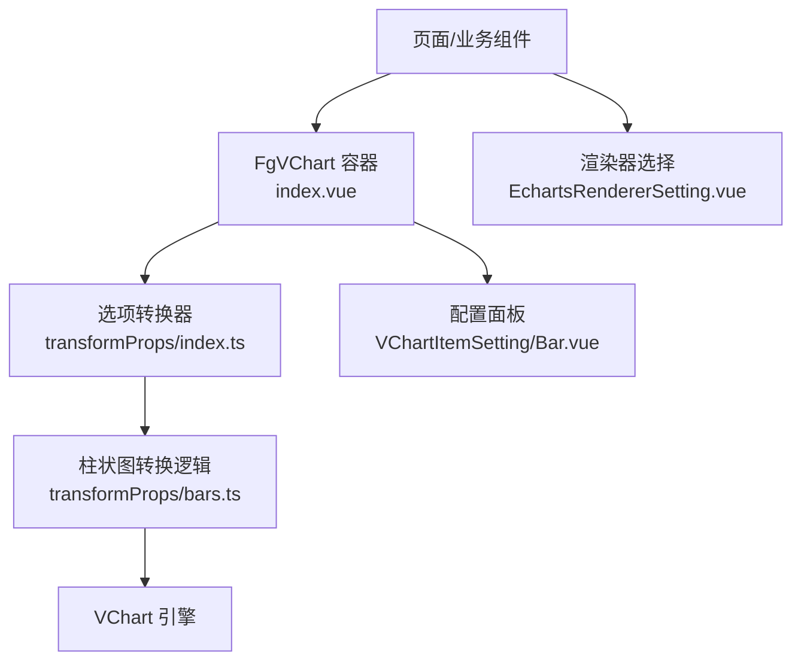
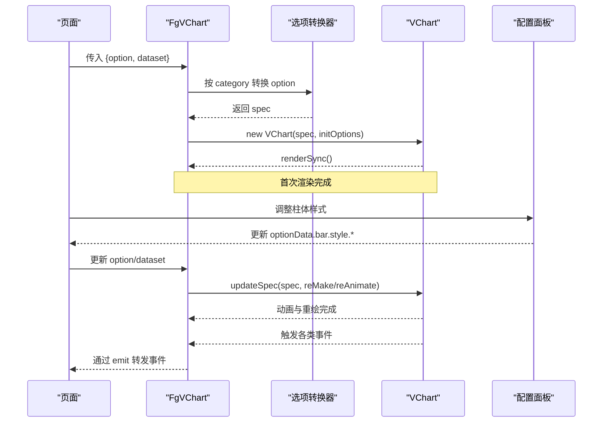
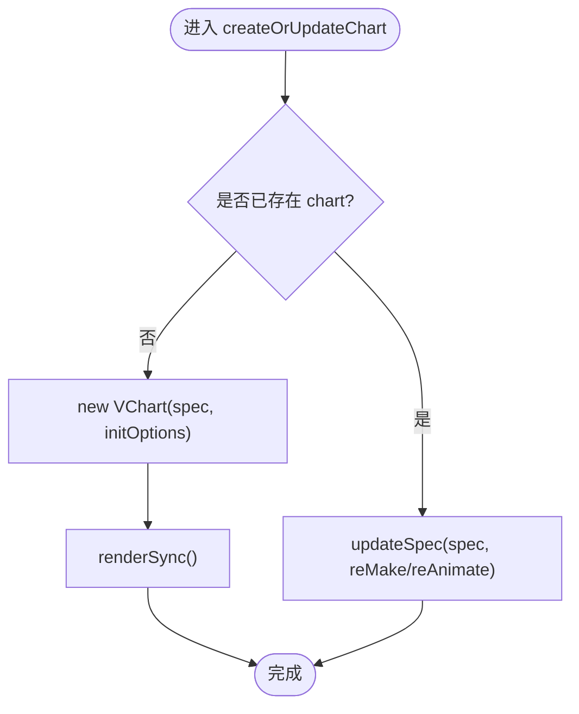
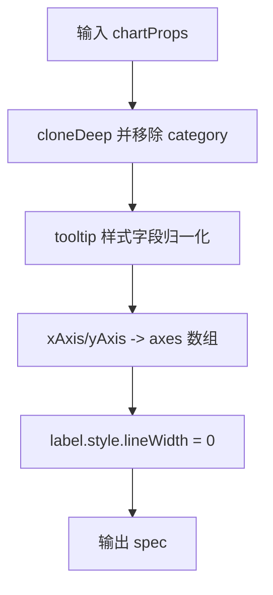
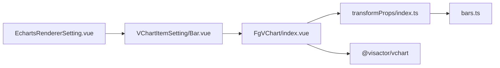

# 柱状图组件

<cite>
**本文引用的文件**
- [index.vue](file://forge-report-ui/src/components/FgVChart/index.vue)
- [bars.ts](file://forge-report-ui/src/components/FgVChart/transformProps/bars.ts)
- [index.ts](file://forge-report-ui/src/components/FgVChart/transformProps/index.ts)
- [Bar.vue](file://forge-report-ui/src/components/Pages/VChartItemSetting/Bar.vue)
- [EchartsRendererSetting.vue](file://forge-report-ui/src/components/Pages/ChartItemSetting/EchartsRendererSetting.vue)
</cite>

## 目录
1. [简介](#简介)
2. [项目结构](#项目结构)
3. [核心组件](#核心组件)
4. [架构总览](#架构总览)
5. [详细组件分析](#详细组件分析)
6. [依赖关系分析](#依赖关系分析)
7. [性能考量](#性能考量)
8. [故障排查指南](#故障排查指南)
9. [结论](#结论)
10. [附录](#附录)

## 简介
本章节面向 Forge Admin 报表模块中的柱状图能力，围绕基于 VChart 的封装组件与配置面板，系统说明：
- 支持的柱状图类型与适用场景（基础柱状、横向柱状、组合图表、胶囊风格）
- 数据绑定方式与选项映射机制
- 样式定制要点（圆角、透明度、纹理、标签与提示框等）
- 事件处理、动画效果与响应式适配
- 最佳实践与常见问题解决方案

## 项目结构
与柱状图相关的代码主要位于报告 UI 的 FgVChart 组件与 VChart 配置面板中：
- 渲染容器：FgVChart 负责实例化 VChart、监听数据与选项变化、转发事件、生命周期管理
- 选项转换：按图表类别将高层配置转换为 VChart spec（以 bars.ts 为例）
- 配置面板：提供柱体样式、坐标轴、标签、图例、提示框等可视化配置入口
- ECharts 渲染器选择：在报表场景中可选择 SVG/Canvas 渲染器，影响交互与大数据量表现

图示来源
- [index.vue:1-251](file://forge-report-ui/src/components/FgVChart/index.vue#L1-L251)
- [index.ts:1-20](file://forge-report-ui/src/components/FgVChart/transformProps/index.ts#L1-L20)
- [bars.ts:1-46](file://forge-report-ui/src/components/FgVChart/transformProps/bars.ts#L1-L46)
- [Bar.vue:1-53](file://forge-report-ui/src/components/Pages/VChartItemSetting/Bar.vue#L1-L53)
- [EchartsRendererSetting.vue:1-46](file://forge-report-ui/src/components/Pages/ChartItemSetting/EchartsRendererSetting.vue#L1-L46)

章节来源
- [index.vue:1-251](file://forge-report-ui/src/components/FgVChart/index.vue#L1-L251)
- [index.ts:1-20](file://forge-report-ui/src/components/FgVChart/transformProps/index.ts#L1-L20)
- [bars.ts:1-46](file://forge-report-ui/src/components/FgVChart/transformProps/bars.ts#L1-L46)
- [Bar.vue:1-53](file://forge-report-ui/src/components/Pages/VChartItemSetting/Bar.vue#L1-L53)
- [EchartsRendererSetting.vue:1-46](file://forge-report-ui/src/components/Pages/ChartItemSetting/EchartsRendererSetting.vue#L1-L46)

## 核心组件
- FgVChart 容器
  - 职责：接收 option 与 dataset，按需注册图表与组件，创建或更新 VChart 实例，统一转发事件，暴露 refresh/release 方法
  - 关键行为：监听 option 与 dataset 变化；根据 category 调用对应转换器生成 spec；updateSpec 时启用重绘与动画
- 柱状图选项转换（bars.ts）
  - 职责：将高层配置（如 xAxis/yAxis、tooltip 样式）转换为 VChart spec 的 axes、label、tooltip 等字段
  - 关键点：坐标轴方向映射、提示框字体颜色字段归一化、标签描边宽度清理
- 配置面板（Bar.vue）
  - 职责：为柱体提供可视化样式配置（宽度、高度、圆角、填充透明度、整体透明度、纹理）
- 渲染器选择（EchartsRendererSetting.vue）
  - 职责：在 SVG/Canvas 之间切换渲染后端，支持继承全局配置

章节来源
- [index.vue:10-251](file://forge-report-ui/src/components/FgVChart/index.vue#L10-L251)
- [bars.ts:1-46](file://forge-report-ui/src/components/FgVChart/transformProps/bars.ts#L1-L46)
- [Bar.vue:1-53](file://forge-report-ui/src/components/Pages/VChartItemSetting/Bar.vue#L1-L53)
- [EchartsRendererSetting.vue:1-46](file://forge-report-ui/src/components/Pages/ChartItemSetting/EchartsRendererSetting.vue#L1-L46)

## 架构总览
下图展示了从页面到渲染的完整链路，包括数据与选项流转、事件转发以及渲染器选择。

图示来源
- [index.vue:17-232](file://forge-report-ui/src/components/FgVChart/index.vue#L17-L232)
- [index.ts:1-20](file://forge-report-ui/src/components/FgVChart/transformProps/index.ts#L1-L20)
- [bars.ts:1-46](file://forge-report-ui/src/components/FgVChart/transformProps/bars.ts#L1-L46)
- [Bar.vue:1-53](file://forge-report-ui/src/components/Pages/VChartItemSetting/Bar.vue#L1-L53)

## 详细组件分析

### FgVChart 容器（index.vue）
- 数据与选项
  - 接收 option（含 category、坐标轴、标签、提示框等）与 dataset
  - 使用 toRefs/toRaw 分离 dataset 与其余 option，避免不必要深监听
- 初始化与更新
  - 首次渲染：new VChart(spec, {dom, ...initOptions}) 并 renderSync
  - 更新路径：updateSpec({ ...spec, data: toRaw(dataset), dataset: undefined }, false, undefined, { change: false, reMake: true, reAnimate: true })
- 事件转发
  - 内置大量鼠标、触摸、拖拽、缩放、刷选、钻取、图例、布局与动画事件，统一通过 emit 抛出
- 生命周期
  - onBeforeUnmount 释放 VChart 实例，防止内存泄漏
  - 暴露 refresh 与 release 方法供外部控制

图示来源
- [index.vue:194-219](file://forge-report-ui/src/components/FgVChart/index.vue#L194-L219)

章节来源
- [index.vue:10-251](file://forge-report-ui/src/components/FgVChart/index.vue#L10-L251)

### 柱状图选项转换（bars.ts）
- 坐标轴映射
  - 将 xAxis/yAxis 合并为 axes 数组，分别设置 orient 为 bottom/left
- 提示框样式归一化
  - 将 tooltip.style.keyLabel/valueLabel/titleLabel 的颜色字段迁移至 fontColor
- 标签样式清理
  - 强制 label.style.lineWidth=0，避免默认描边干扰视觉

图示来源
- [bars.ts:1-46](file://forge-report-ui/src/components/FgVChart/transformProps/bars.ts#L1-L46)

章节来源
- [bars.ts:1-46](file://forge-report-ui/src/components/FgVChart/transformProps/bars.ts#L1-L46)

### 配置面板：柱体样式（Bar.vue）
- 可配置项
  - 宽度、高度、圆角大小、填充透明度、整体透明度、纹理类型
- 数据绑定
  - 双向绑定到 optionData.bar.style.*，实时驱动 spec 更新与重绘
- 主题与样式源
  - 读取全局主题类型定义与样式配置，保证与设计系统一致

章节来源
- [Bar.vue:1-53](file://forge-report-ui/src/components/Pages/VChartItemSetting/Bar.vue#L1-L53)

### 渲染器选择（EchartsRendererSetting.vue）
- 可选值
  - svg：缩放场景下表现更好
  - canvas：数据量大或交互较多时推荐
  - inherit：继承全局配置（当 includeInherit 为真时显示）
- 使用建议
  - 小数据量且需要矢量缩放优先 svg
  - 大数据量或复杂交互优先 canvas

章节来源
- [EchartsRendererSetting.vue:1-46](file://forge-report-ui/src/components/Pages/ChartItemSetting/EchartsRendererSetting.vue#L1-L46)

## 依赖关系分析
- 组件耦合
  - FgVChart 依赖 transformProps 按类别生成 spec，降低与具体图表实现的耦合
  - 配置面板仅操作 optionData，不直接操作 VChart，解耦 UI 与渲染
- 外部依赖
  - VChart 引擎负责实际渲染与交互
  - 可选 ECharts 渲染器用于报表场景下的渲染后端选择

图示来源
- [index.vue:10-251](file://forge-report-ui/src/components/FgVChart/index.vue#L10-L251)
- [index.ts:1-20](file://forge-report-ui/src/components/FgVChart/transformProps/index.ts#L1-L20)
- [bars.ts:1-46](file://forge-report-ui/src/components/FgVChart/transformProps/bars.ts#L1-L46)
- [Bar.vue:1-53](file://forge-report-ui/src/components/Pages/VChartItemSetting/Bar.vue#L1-L53)
- [EchartsRendererSetting.vue:1-46](file://forge-report-ui/src/components/Pages/ChartItemSetting/EchartsRendererSetting.vue#L1-L46)

章节来源
- [index.vue:10-251](file://forge-report-ui/src/components/FgVChart/index.vue#L10-L251)
- [index.ts:1-20](file://forge-report-ui/src/components/FgVChart/transformProps/index.ts#L1-L20)
- [bars.ts:1-46](file://forge-report-ui/src/components/FgVChart/transformProps/bars.ts#L1-L46)
- [Bar.vue:1-53](file://forge-report-ui/src/components/Pages/VChartItemSetting/Bar.vue#L1-L53)
- [EchartsRendererSetting.vue:1-46](file://forge-report-ui/src/components/Pages/ChartItemSetting/EchartsRendererSetting.vue#L1-L46)

## 性能考量
- 数据更新策略
  - 对 option 使用 deepWatch（可通过 initOptions.deepWatch 控制），对 dataset 采用浅监听，减少不必要的深度比较
  - 更新时使用 updateSpec 并开启 reMake/reAnimate，确保增量重绘与动画体验
- 渲染器选择
  - 大数据量或复杂交互优先选择 canvas；需要无损缩放优先 svg
- 资源释放
  - 组件卸载时调用 release，避免内存泄漏
- 刷新控制
  - 外部可通过 expose 的 refresh 方法主动触发重绘，避免频繁全量更新

章节来源
- [index.vue:167-219](file://forge-report-ui/src/components/FgVChart/index.vue#L167-L219)
- [index.vue:222-249](file://forge-report-ui/src/components/FgVChart/index.vue#L222-L249)
- [EchartsRendererSetting.vue:27-44](file://forge-report-ui/src/components/Pages/ChartItemSetting/EchartsRendererSetting.vue#L27-L44)

## 故障排查指南
- 图表未渲染
  - 检查传入的 option.category 是否在转换器中存在映射
  - 确认 dom 引用已就绪后再初始化
- 数据更新无效
  - 确认 dataset 变更触发了 watch；必要时检查 initOptions.deepWatch 配置
  - 若需强制刷新，调用 expose 的 refresh 方法
- 样式不生效
  - 检查 Bar.vue 中配置的 bar.style.* 是否正确写入 optionData
  - 注意 bars.ts 中对 label.style.lineWidth 的覆盖
- 事件未触发
  - 确认外层监听的事件名与 FgVChart 暴露的事件列表一致
- 内存占用过高
  - 确保组件卸载时调用 release；避免重复创建实例
- 渲染卡顿
  - 大数据量场景切换到 canvas 渲染器；减少过多动画与复杂交互

章节来源
- [index.vue:17-79](file://forge-report-ui/src/components/FgVChart/index.vue#L17-L79)
- [index.vue:167-219](file://forge-report-ui/src/components/FgVChart/index.vue#L167-L219)
- [index.vue:234-249](file://forge-report-ui/src/components/FgVChart/index.vue#L234-L249)
- [bars.ts:1-46](file://forge-report-ui/src/components/FgVChart/transformProps/bars.ts#L1-L46)
- [Bar.vue:1-53](file://forge-report-ui/src/components/Pages/VChartItemSetting/Bar.vue#L1-L53)
- [EchartsRendererSetting.vue:27-44](file://forge-report-ui/src/components/Pages/ChartItemSetting/EchartsRendererSetting.vue#L27-L44)

## 结论
本仓库通过 FgVChart 与配置面板的组合，提供了开箱即用且可扩展的柱状图能力。借助统一的选项转换与事件转发机制，开发者可以聚焦于业务数据的组织与样式的精细化配置。结合合适的渲染器选择与性能优化策略，可在不同数据规模与交互复杂度下获得稳定高效的图表体验。

## 附录
- 常用配置项速查
  - 柱体样式：宽度、高度、圆角、填充透明度、整体透明度、纹理
  - 坐标轴：方向与刻度（由 bars.ts 映射为 axes）
  - 提示框：标题与键值文本字体颜色（由 bars.ts 归一化）
  - 标签：默认关闭描边（由 bars.ts 清理）
- 事件清单
  - 鼠标/触摸/拖拽/缩放/刷选/图例/布局/动画等事件均可通过 FgVChart 捕获并转发

章节来源
- [Bar.vue:1-53](file://forge-report-ui/src/components/Pages/VChartItemSetting/Bar.vue#L1-L53)
- [bars.ts:1-46](file://forge-report-ui/src/components/FgVChart/transformProps/bars.ts#L1-L46)
- [index.vue:21-79](file://forge-report-ui/src/components/FgVChart/index.vue#L21-L79)