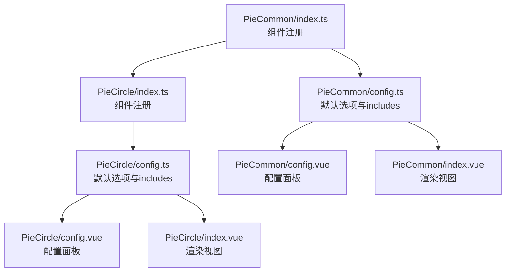
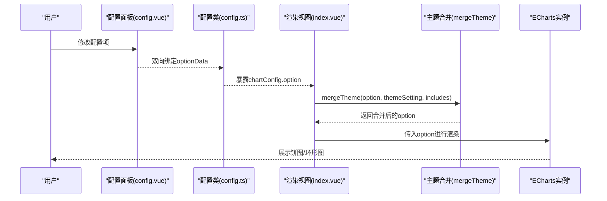
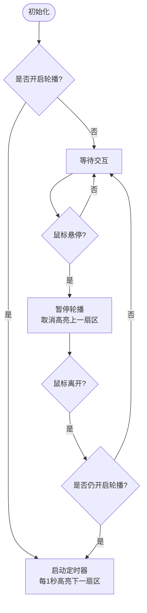
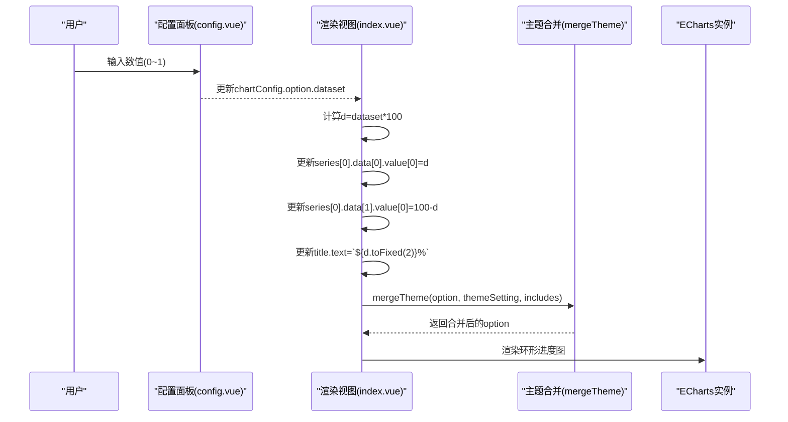
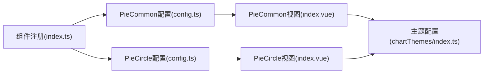

# 饼图组件

<cite>
**本文引用的文件**
- [forge-report-ui/src/packages/components/Charts/Pies/index.ts](file://forge-report-ui/src/packages/components/Charts/Pies/index.ts)
- [forge-report-ui/src/packages/components/Charts/Pies/PieCommon/index.ts](file://forge-report-ui/src/packages/components/Charts/Pies/PieCommon/index.ts)
- [forge-report-ui/src/packages/components/Charts/Pies/PieCommon/config.ts](file://forge-report-ui/src/packages/components/Charts/Pies/PieCommon/config.ts)
- [forge-report-ui/src/packages/components/Charts/Pies/PieCommon/config.vue](file://forge-report-ui/src/packages/components/Charts/Pies/PieCommon/config.vue)
- [forge-report-ui/src/packages/components/Charts/Pies/PieCommon/index.vue](file://forge-report-ui/src/packages/components/Charts/Pies/PieCommon/index.vue)
- [forge-report-ui/src/packages/components/Charts/Pies/PieCircle/index.ts](file://forge-report-ui/src/packages/components/Charts/Pies/PieCircle/index.ts)
- [forge-report-ui/src/packages/components/Charts/Pies/PieCircle/config.ts](file://forge-report-ui/src/packages/components/Charts/Pies/PieCircle/config.ts)
- [forge-report-ui/src/packages/components/Charts/Pies/PieCircle/config.vue](file://forge-report-ui/src/packages/components/Charts/Pies/PieCircle/config.vue)
- [forge-report-ui/src/packages/components/Charts/Pies/PieCircle/index.vue](file://forge-report-ui/src/packages/components/Charts/Pies/PieCircle/index.vue)
- [forge-report-ui/src/settings/chartThemes/index.ts](file://forge-report-ui/src/settings/chartThemes/index.ts)
</cite>

## 目录
1. [简介](#简介)
2. [项目结构](#项目结构)
3. [核心组件](#核心组件)
4. [架构总览](#架构总览)
5. [详细组件分析](#详细组件分析)
6. [依赖关系分析](#依赖关系分析)
7. [性能考量](#性能考量)
8. [故障排查指南](#故障排查指南)
9. [结论](#结论)
10. [附录](#附录)

## 简介
本章节面向 Forge Admin 报表端的饼图组件，覆盖两种实现：
- PieCommon（通用饼图）：支持常规、环形、玫瑰三种类型，提供标签、引导线、轮播高亮等能力。
- PieCircle（环形进度图）：以中心标题+轨道+进度段展示百分比数据，适合指标型可视化。

文档将系统说明两类组件的配置项、数据绑定方式、样式定制、事件处理、环形效果、百分比显示与标签布局，并给出常见应用场景示例与主题可访问性建议。

## 项目结构
饼图相关代码位于报表端图表包中，按“组件注册 + 配置类 + 配置面板 + 渲染视图”组织：
- 组件注册：导出各饼图的元信息（键名、分类、图标等），供设计器/运行时识别。
- 配置类：定义默认 option、包含的 ECharts 子模块、以及通过前缀处理暴露给配置面板的属性集合。
- 配置面板：Vue 表单控件，双向绑定到 optionData，驱动图表实时预览。
- 渲染视图：基于 vue-echarts 渲染，合并主题、监听数据变化、处理交互与动画。

图示来源
- [forge-report-ui/src/packages/components/Charts/Pies/PieCommon/index.ts:1-15](file://forge-report-ui/src/packages/components/Charts/Pies/PieCommon/index.ts#L1-L15)
- [forge-report-ui/src/packages/components/Charts/Pies/PieCircle/index.ts:1-16](file://forge-report-ui/src/packages/components/Charts/Pies/PieCircle/index.ts#L1-L16)
- [forge-report-ui/src/packages/components/Charts/Pies/PieCommon/config.ts:1-83](file://forge-report-ui/src/packages/components/Charts/Pies/PieCommon/config.ts#L1-L83)
- [forge-report-ui/src/packages/components/Charts/Pies/PieCircle/config.ts:1-66](file://forge-report-ui/src/packages/components/Charts/Pies/PieCircle/config.ts#L1-L66)

章节来源
- [forge-report-ui/src/packages/components/Charts/Pies/index.ts:1-4](file://forge-report-ui/src/packages/components/Charts/Pies/index.ts#L1-L4)
- [forge-report-ui/src/packages/components/Charts/Pies/PieCommon/index.ts:1-15](file://forge-report-ui/src/packages/components/Charts/Pies/PieCommon/index.ts#L1-L15)
- [forge-report-ui/src/packages/components/Charts/Pies/PieCircle/index.ts:1-16](file://forge-report-ui/src/packages/components/Charts/Pies/PieCircle/index.ts#L1-L16)

## 核心组件
- PieCommon（通用饼图）
  - 类型切换：常规、环形、玫瑰；自动调整 radius/roseType。
  - 标签与引导线：开关、位置、格式化器（名称/百分比/组合）。
  - 字体与强调态：字号、加粗、边框宽度与颜色。
  - 分段样式：圆角、描边宽度。
  - 轮播高亮：开启后自动循环高亮扇区，鼠标悬停暂停，离开恢复。
  - 数据绑定：dataset 承载数据源；运行时通过 useChartDataFetch 动态更新。
- PieCircle（环形进度图）
  - 数据绑定：dataset 为 0~1 的小数，内部换算为百分比，驱动进度段与中心标题。
  - 样式定制：进度段颜色、阴影模糊与颜色；轨道颜色与宽度预设。
  - 标题：中心文本与字体大小、颜色。
  - 数据绑定：配置时与预览时均会同步更新 series 数据与 title 文本。

章节来源
- [forge-report-ui/src/packages/components/Charts/Pies/PieCommon/config.ts:1-83](file://forge-report-ui/src/packages/components/Charts/Pies/PieCommon/config.ts#L1-L83)
- [forge-report-ui/src/packages/components/Charts/Pies/PieCommon/config.vue:1-153](file://forge-report-ui/src/packages/components/Charts/Pies/PieCommon/config.vue#L1-L153)
- [forge-report-ui/src/packages/components/Charts/Pies/PieCircle/config.ts:1-66](file://forge-report-ui/src/packages/components/Charts/Pies/PieCircle/config.ts#L1-L66)
- [forge-report-ui/src/packages/components/Charts/Pies/PieCircle/config.vue:1-105](file://forge-report-ui/src/packages/components/Charts/Pies/PieCircle/config.vue#L1-L105)

## 架构总览
两类饼图均基于 ECharts 渲染，采用统一的“配置类 + 配置面板 + 渲染视图”模式，并通过主题合并函数注入全局主题色。

图示来源
- [forge-report-ui/src/packages/components/Charts/Pies/PieCommon/index.vue:1-154](file://forge-report-ui/src/packages/components/Charts/Pies/PieCommon/index.vue#L1-L154)
- [forge-report-ui/src/packages/components/Charts/Pies/PieCircle/index.vue:1-78](file://forge-report-ui/src/packages/components/Charts/Pies/PieCircle/index.vue#L1-L78)
- [forge-report-ui/src/settings/chartThemes/index.ts:1-45](file://forge-report-ui/src/settings/chartThemes/index.ts#L1-L45)

## 详细组件分析

### PieCommon（通用饼图）
- 类型与图形
  - 类型：常规、环形、玫瑰；切换时自动设置 radius 与 roseType。
  - 图形参数：内圈范围、外圈范围、X/Y 中心点。
- 标签与引导线
  - 标签：开关、位置、格式化器（名称/百分比/列名:百分比%）。
  - 引导线：开关控制是否显示。
  - 字体：字号、颜色、加粗、文字边框宽度与颜色。
- 分段样式
  - 圆角、描边宽度。
- 交互与动画
  - 轮播高亮：开启后定时高亮下一扇区；鼠标悬停停止，离开恢复。
  - 图例：轮播时隐藏图例，关闭轮播恢复显示。
- 数据绑定
  - dataset 承载数据源；运行时通过数据获取钩子更新，并在轮播模式下重新计算序列长度。
- 事件处理
  - 鼠标进入/离开触发高亮/取消高亮，配合轮播逻辑。

图示来源
- [forge-report-ui/src/packages/components/Charts/Pies/PieCommon/index.vue:69-100](file://forge-report-ui/src/packages/components/Charts/Pies/PieCommon/index.vue#L69-L100)
- [forge-report-ui/src/packages/components/Charts/Pies/PieCommon/index.vue:102-138](file://forge-report-ui/src/packages/components/Charts/Pies/PieCommon/index.vue#L102-L138)

章节来源
- [forge-report-ui/src/packages/components/Charts/Pies/PieCommon/config.ts:1-83](file://forge-report-ui/src/packages/components/Charts/Pies/PieCommon/config.ts#L1-L83)
- [forge-report-ui/src/packages/components/Charts/Pies/PieCommon/config.vue:1-153](file://forge-report-ui/src/packages/components/Charts/Pies/PieCommon/config.vue#L1-L153)
- [forge-report-ui/src/packages/components/Charts/Pies/PieCommon/index.vue:1-154](file://forge-report-ui/src/packages/components/Charts/Pies/PieCommon/index.vue#L1-L154)

### PieCircle（环形进度图）
- 数据绑定
  - dataset 为 0~1 的小数，内部乘以 100 得到百分比，用于：
    - 进度段 value[0] = d
    - 轨道段 value[0] = 100 - d
    - 中心标题 text = `${d.toFixed(2)}%`
- 样式定制
  - 进度段：颜色、阴影模糊等级、阴影颜色。
  - 轨道：颜色、阴影模糊等级、阴影颜色、宽度预设（窄/中/宽/更宽）。
  - 标题：颜色、字号。
- 数据更新路径
  - 配置时：监听 dataset 变化，调用 dataHandle 更新 series 与 title。
  - 预览时：通过数据获取回调直接写入 option.value 对应字段。

图示来源
- [forge-report-ui/src/packages/components/Charts/Pies/PieCircle/index.vue:41-76](file://forge-report-ui/src/packages/components/Charts/Pies/PieCircle/index.vue#L41-L76)
- [forge-report-ui/src/packages/components/Charts/Pies/PieCircle/config.vue:1-105](file://forge-report-ui/src/packages/components/Charts/Pies/PieCircle/config.vue#L1-L105)

章节来源
- [forge-report-ui/src/packages/components/Charts/Pies/PieCircle/config.ts:1-66](file://forge-report-ui/src/packages/components/Charts/Pies/PieCircle/config.ts#L1-L66)
- [forge-report-ui/src/packages/components/Charts/Pies/PieCircle/config.vue:1-105](file://forge-report-ui/src/packages/components/Charts/Pies/PieCircle/config.vue#L1-L105)
- [forge-report-ui/src/packages/components/Charts/Pies/PieCircle/index.vue:1-78](file://forge-report-ui/src/packages/components/Charts/Pies/PieCircle/index.vue#L1-L78)

## 依赖关系分析
- 组件注册层
  - PieCommon/PieCircle 在 index.ts 中统一导出，供上层按需加载。
- 配置层
  - config.ts 定义默认 option 与 includes（需要预加载的 ECharts 子模块），并通过前缀处理暴露给配置面板。
- 视图层
  - index.vue 使用 vue-echarts，注册必要的 ECharts 组件（如 DatasetComponent、PieChart、TooltipComponent、LegendComponent、TitleComponent），并使用 mergeTheme 合并主题。
- 主题层
  - chartThemes/index.ts 提供多套主题色与默认主题名，供运行时选择与应用。

图示来源
- [forge-report-ui/src/packages/components/Charts/Pies/index.ts:1-4](file://forge-report-ui/src/packages/components/Charts/Pies/index.ts#L1-L4)
- [forge-report-ui/src/packages/components/Charts/Pies/PieCommon/config.ts:1-83](file://forge-report-ui/src/packages/components/Charts/Pies/PieCommon/config.ts#L1-L83)
- [forge-report-ui/src/packages/components/Charts/Pies/PieCircle/config.ts:1-66](file://forge-report-ui/src/packages/components/Charts/Pies/PieCircle/config.ts#L1-L66)
- [forge-report-ui/src/settings/chartThemes/index.ts:1-45](file://forge-report-ui/src/settings/chartThemes/index.ts#L1-L45)

章节来源
- [forge-report-ui/src/packages/components/Charts/Pies/index.ts:1-4](file://forge-report-ui/src/packages/components/Charts/Pies/index.ts#L1-L4)
- [forge-report-ui/src/settings/chartThemes/index.ts:1-45](file://forge-report-ui/src/settings/chartThemes/index.ts#L1-L45)

## 性能考量
- 轮播高亮的定时器管理
  - 开启轮播时创建定时器，鼠标悬停暂停，离开恢复；数据更新或销毁时需清理定时器，避免内存泄漏与重复计时。
- 主题合并开销
  - 每次 option 变更都会执行 mergeTheme，建议在大数据集或频繁更新场景下减少不必要的重渲染。
- ECharts 组件按需注册
  - 仅注册所需组件（如 DatasetComponent、PieChart、TooltipComponent、LegendComponent、TitleComponent），降低打包体积与初始化成本。
- 数据量与标签密度
  - 扇区过多时建议关闭部分标签或引导线，提升渲染性能与可读性。

## 故障排查指南
- 轮播不生效
  - 检查是否开启 isCarousel；确认数据源 source 是否为数组且长度大于 1；查看是否在数据更新后正确重建定时器。
- 标签/引导线不显示
  - 确认 label.show 与 labelLine.show 已开启；检查 position 与 formatter 配置是否符合预期。
- 环形进度图百分比异常
  - 确认 dataset 取值范围为 0~1；若传入超出范围的值，需在上层做校验与归一化。
- 主题未生效
  - 确认 themeSetting 与 includes 是否正确传入 mergeTheme；检查主题名是否存在于主题列表中。

章节来源
- [forge-report-ui/src/packages/components/Charts/Pies/PieCommon/index.vue:69-100](file://forge-report-ui/src/packages/components/Charts/Pies/PieCommon/index.vue#L69-L100)
- [forge-report-ui/src/packages/components/Charts/Pies/PieCircle/index.vue:41-76](file://forge-report-ui/src/packages/components/Charts/Pies/PieCircle/index.vue#L41-L76)
- [forge-report-ui/src/settings/chartThemes/index.ts:1-45](file://forge-report-ui/src/settings/chartThemes/index.ts#L1-L45)

## 结论
- PieCommon 适用于多维度占比可视化，支持多种类型与丰富的标签/样式配置，并提供轮播高亮增强交互体验。
- PieCircle 专注于单指标进度展示，配置简洁、直观，适合仪表盘与 KPI 场景。
- 两者均通过统一的主题合并机制接入全局主题，便于品牌化与可访问性优化。

## 附录

### 属性配置速查
- PieCommon
  - 类型：常规/环形/玫瑰
  - 图形：内圈范围、外圈范围、X/Y 中心
  - 标签：开关、位置、格式化器（名称/百分比/列名:百分比%）、字号、颜色、加粗、文字边框宽度与颜色
  - 引导线：开关
  - 分段样式：圆角、描边宽度
  - 交互：轮播高亮开关、图例显隐联动
  - 数据：dataset（数组形式）
- PieCircle
  - 数据：dataset（0~1 小数）
  - 标题：颜色、字号
  - 进度段：颜色、阴影模糊等级、阴影颜色
  - 轨道：颜色、阴影模糊等级、阴影颜色、宽度预设

章节来源
- [forge-report-ui/src/packages/components/Charts/Pies/PieCommon/config.vue:1-153](file://forge-report-ui/src/packages/components/Charts/Pies/PieCommon/config.vue#L1-L153)
- [forge-report-ui/src/packages/components/Charts/Pies/PieCircle/config.vue:1-105](file://forge-report-ui/src/packages/components/Charts/Pies/PieCircle/config.vue#L1-L105)

### 数据绑定与更新流程
- 配置阶段
  - 配置面板双向绑定 optionData，驱动 chartConfig.option 变化。
  - 视图层监听 option 变化，合并主题后渲染。
- 运行阶段
  - PieCommon：通过数据获取钩子更新 dataset，必要时重启轮播定时器。
  - PieCircle：根据 dataset 计算百分比，更新 series 与 title。

章节来源
- [forge-report-ui/src/packages/components/Charts/Pies/PieCommon/index.vue:140-152](file://forge-report-ui/src/packages/components/Charts/Pies/PieCommon/index.vue#L140-L152)
- [forge-report-ui/src/packages/components/Charts/Pies/PieCircle/index.vue:51-76](file://forge-report-ui/src/packages/components/Charts/Pies/PieCircle/index.vue#L51-L76)

### 颜色主题与可访问性建议
- 主题定制
  - 通过 chartThemes 提供的主题列表与默认主题名，结合 mergeTheme 应用到所有图表。
  - 可在业务层扩展自定义主题色板，保持品牌一致性。
- 可访问性
  - 确保对比度足够，避免浅色背景上的浅色前景。
  - 为交互元素提供键盘可达性与焦点可见性（如聚焦扇区时放大/加粗标签）。
  - 对色盲友好的配色方案，避免仅用颜色表达关键信息，辅以标签与图例。

章节来源
- [forge-report-ui/src/settings/chartThemes/index.ts:1-45](file://forge-report-ui/src/settings/chartThemes/index.ts#L1-L45)

### 常见应用场景示例
- 数据占比可视化
  - 使用 PieCommon 的玫瑰图或环形图展示分类占比，开启标签与引导线，便于阅读。
- 交互式筛选
  - 结合图例点击与 tooltip，快速定位某一分组；轮播模式下可自动演示重点分组。
- 动态更新
  - 通过数据获取钩子实时更新 dataset，PieCommon 在数据变更后重置轮播；PieCircle 根据新值刷新进度与标题。

章节来源
- [forge-report-ui/src/packages/components/Charts/Pies/PieCommon/index.vue:102-152](file://forge-report-ui/src/packages/components/Charts/Pies/PieCommon/index.vue#L102-L152)
- [forge-report-ui/src/packages/components/Charts/Pies/PieCircle/index.vue:51-76](file://forge-report-ui/src/packages/components/Charts/Pies/PieCircle/index.vue#L51-L76)