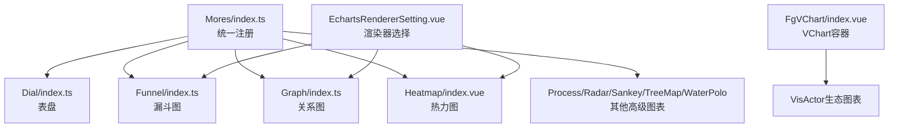
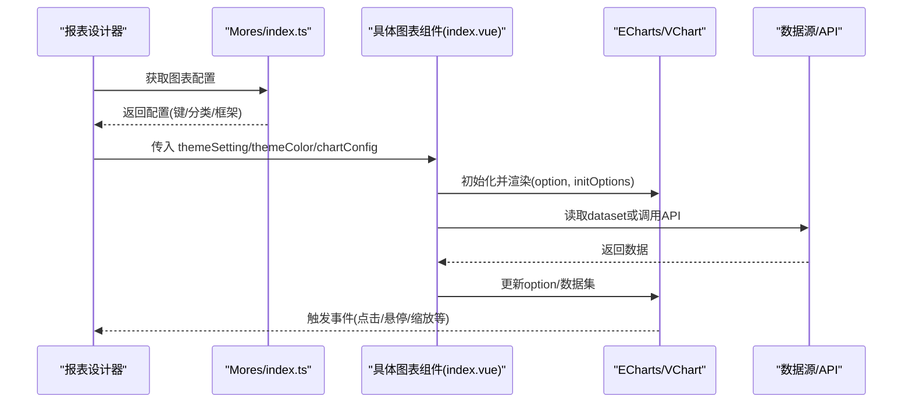
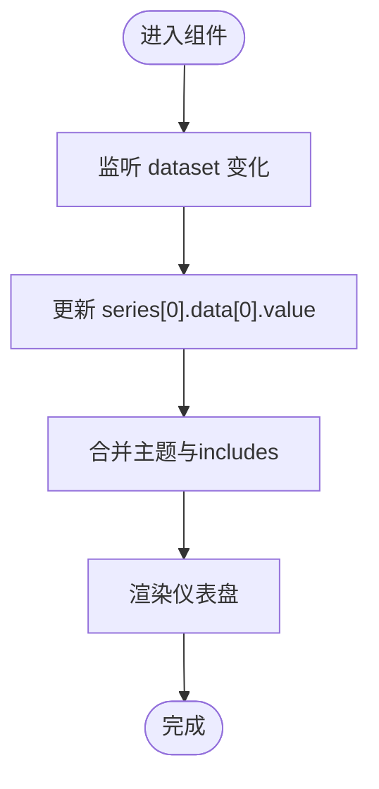
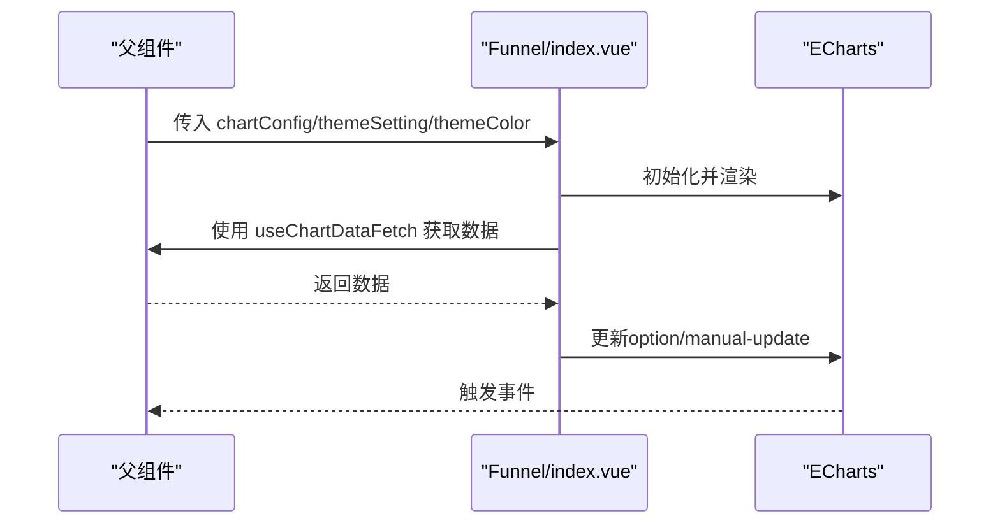
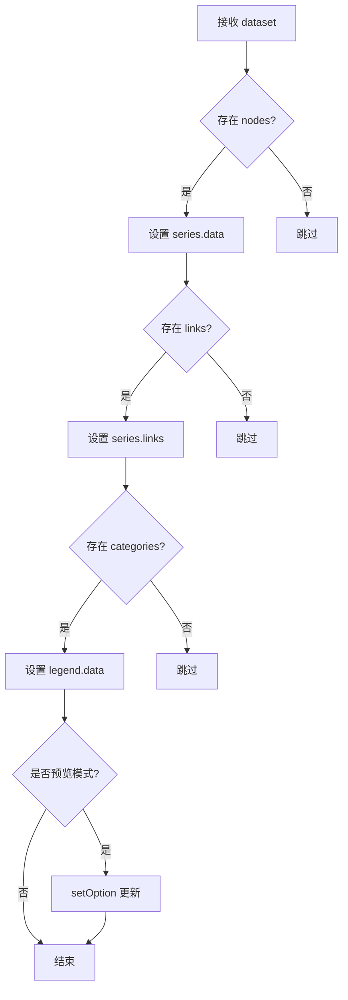
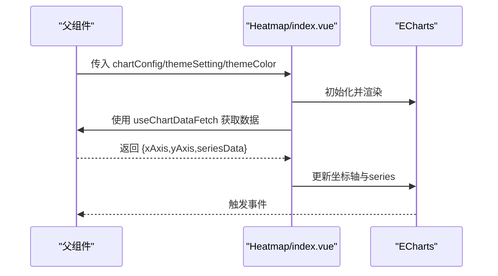
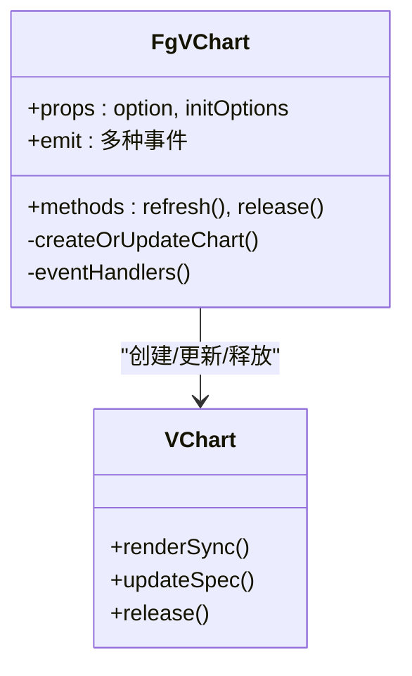
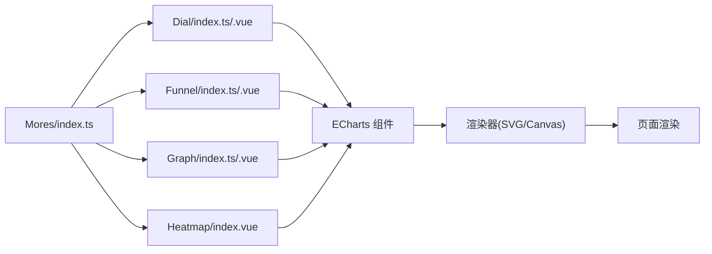

# 高级图表组件

<cite>
**本文引用的文件**
- [Mores/index.ts](file://forge-report-ui/src/packages/components/Charts/Mores/index.ts)
- [Dial/index.ts](file://forge-report-ui/src/packages/components/Charts/Mores/Dial/index.ts)
- [Dial/index.vue](file://forge-report-ui/src/packages/components/Charts/Mores/Dial/index.vue)
- [Funnel/index.ts](file://forge-report-ui/src/packages/components/Charts/Mores/Funnel/index.ts)
- [Funnel/index.vue](file://forge-report-ui/src/packages/components/Charts/Mores/Funnel/index.vue)
- [Graph/index.ts](file://forge-report-ui/src/packages/components/Charts/Mores/Graph/index.ts)
- [Graph/index.vue](file://forge-report-ui/src/packages/components/Charts/Mores/Graph/index.vue)
- [Heatmap/index.vue](file://forge-report-ui/src/packages/components/Charts/Mores/Heatmap/index.vue)
- [EchartsRendererSetting.vue](file://forge-report-ui/src/components/Pages/ChartItemSetting/EchartsRendererSetting.vue)
- [FgVChart/index.vue](file://forge-report-ui/src/components/FgVChart/index.vue)
</cite>

## 目录
1. [简介](#简介)
2. [项目结构](#项目结构)
3. [核心组件](#核心组件)
4. [架构总览](#架构总览)
5. [详细组件分析](#详细组件分析)
6. [依赖关系分析](#依赖关系分析)
7. [性能考虑](#性能考虑)
8. [故障排查指南](#故障排查指南)
9. [结论](#结论)
10. [附录](#附录)

## 简介
本章节面向 Forge Admin 的高级图表组件，聚焦以下特殊类型：仪表盘（Dial）、漏斗图（Funnel）、关系图（Graph）、热力图（Heatmap）、流程图（Process）、雷达图（Radar）、桑基图（Sankey）、矩形树图（TreeMap）、水球图（WaterPolo）。文档将系统说明各图表的配置选项、数据绑定方式、样式定制方法、典型应用场景、数据格式要求、交互效果与性能优化建议。

## 项目结构
- 高级图表统一注册入口位于 Mores/index.ts，集中导出各图表配置项，便于在报表设计器中按类别加载。
- 每个图表子目录包含 index.ts（注册配置）、index.vue（渲染实现）以及可选的 config.ts/config.vue（配置面板与默认配置），部分图表提供 data.json 示例数据。
- EchartsRendererSetting.vue 提供渲染器选择（SVG/Canvas/继承全局），用于控制图表渲染后端。
- FgVChart/index.vue 是基于 VChart 的通用图表容器，支持事件透传、动态更新与生命周期管理，适用于基于 VisActor 的图表场景。

**图示来源**
- [Mores/index.ts:1-21](file://forge-report-ui/src/packages/components/Charts/Mores/index.ts#L1-L21)
- [EchartsRendererSetting.vue:1-46](file://forge-report-ui/src/components/Pages/ChartItemSetting/EchartsRendererSetting.vue#L1-L46)
- [FgVChart/index.vue:1-251](file://forge-report-ui/src/components/FgVChart/index.vue#L1-L251)

**章节来源**
- [Mores/index.ts:1-21](file://forge-report-ui/src/packages/components/Charts/Mores/index.ts#L1-L21)
- [EchartsRendererSetting.vue:1-46](file://forge-report-ui/src/components/Pages/ChartItemSetting/EchartsRendererSetting.vue#L1-L46)
- [FgVChart/index.vue:1-251](file://forge-report-ui/src/components/FgVChart/index.vue#L1-L251)

## 核心组件
- 统一注册：通过 Mores/index.ts 将各高级图表以配置对象形式暴露给上层设计器，便于拖拽与属性面板联动。
- 渲染容器：
  - 基于 ECharts 的图表：使用 vue-echarts + ECharts 组件按需引入，并通过 useCanvasInitOptions 初始化画布选项，mergeTheme 合并主题与 includes 白名单。
  - 基于 VChart 的通用容器：FgVChart/index.vue 封装了事件透传、spec 转换、数据更新与生命周期释放等能力。
- 渲染器选择：EchartsRendererSetting.vue 提供 SVG/Canvas/继承三种模式，适配不同数据规模与交互需求。

**章节来源**
- [Mores/index.ts:1-21](file://forge-report-ui/src/packages/components/Charts/Mores/index.ts#L1-L21)
- [FgVChart/index.vue:1-251](file://forge-report-ui/src/components/FgVChart/index.vue#L1-L251)
- [EchartsRendererSetting.vue:1-46](file://forge-report-ui/src/components/Pages/ChartItemSetting/EchartsRendererSetting.vue#L1-L46)

## 架构总览
下图展示了高级图表在报表系统中的整体流程：设计器通过注册表加载图表配置；运行时根据图表类型选择渲染器（ECharts 或 VChart）；数据通过 dataset 或 API 注入；主题与 includes 白名单合并后生成最终 option；事件经容器透传到父组件。

**图示来源**
- [Mores/index.ts:1-21](file://forge-report-ui/src/packages/components/Charts/Mores/index.ts#L1-L21)
- [Graph/index.vue:1-89](file://forge-report-ui/src/packages/components/Charts/Mores/Graph/index.vue#L1-L89)
- [Heatmap/index.vue:1-104](file://forge-report-ui/src/packages/components/Charts/Mores/Heatmap/index.vue#L1-L104)
- [FgVChart/index.vue:1-251](file://forge-report-ui/src/components/FgVChart/index.vue#L1-L251)

## 详细组件分析

### 仪表盘（Dial）
- 定位与用途：展示单一数值指标，常用于 KPI 看板、设备状态指示。
- 数据绑定：通过 chartConfig.option.series[0].data[0].value 绑定数值；预览时由 useChartDataFetch 注入结果。
- 主题与样式：使用 mergeTheme 合并主题与 includes 白名单；initOptions 由 useCanvasInitOptions 生成。
- 事件与交互：基于 ECharts 的事件体系，可在父层监听 click/dimHover 等事件。
- 性能建议：单值指标开销极低；如需频繁刷新可结合防抖或增量更新。

**图示来源**
- [Dial/index.vue:1-70](file://forge-report-ui/src/packages/components/Charts/Mores/Dial/index.vue#L1-L70)

**章节来源**
- [Dial/index.ts:1-15](file://forge-report-ui/src/packages/components/Charts/Mores/Dial/index.ts#L1-L15)
- [Dial/index.vue:1-70](file://forge-report-ui/src/packages/components/Charts/Mores/Dial/index.vue#L1-L70)

### 漏斗图（Funnel）
- 定位与用途：展示阶段转化与流失，适合销售漏斗、用户转化路径。
- 数据绑定：dataset 直接映射到 series；预览模式使用 manual-update 避免重复更新。
- 主题与样式：mergeTheme 合并主题与 includes；initOptions 控制画布行为。
- 事件与交互：支持 tooltip、legend、click 等；可通过 setOption 在预览时精准更新。
- 性能建议：大数据量时优先选择 Canvas 渲染器；减少不必要的重绘。

**图示来源**
- [Funnel/index.vue:1-53](file://forge-report-ui/src/packages/components/Charts/Mores/Funnel/index.vue#L1-L53)

**章节来源**
- [Funnel/index.ts:1-15](file://forge-report-ui/src/packages/components/Charts/Mores/Funnel/index.ts#L1-L15)
- [Funnel/index.vue:1-53](file://forge-report-ui/src/packages/components/Charts/Mores/Funnel/index.vue#L1-L53)

### 关系图（Graph）
- 定位与用途：节点与边构成的网络图，适合组织关系、知识图谱、链路拓扑。
- 数据绑定：dataset 中的 nodes、links、categories 分别映射到 series.data、series.links、legend.data。
- 主题与样式：mergeTheme 合并主题与 includes；预览模式下通过 setOption 更新。
- 事件与交互：支持节点/边的 hover、click、drag 等；可配合布局算法提升可读性。
- 性能建议：节点与边较多时启用力导向布局缓存；限制初始可见范围；使用 Canvas 渲染。

**图示来源**
- [Graph/index.vue:1-89](file://forge-report-ui/src/packages/components/Charts/Mores/Graph/index.vue#L1-L89)

**章节来源**
- [Graph/index.ts:1-15](file://forge-report-ui/src/packages/components/Charts/Mores/Graph/index.ts#L1-L15)
- [Graph/index.vue:1-89](file://forge-report-ui/src/packages/components/Charts/Mores/Graph/index.vue#L1-L89)

### 热力图（Heatmap）
- 定位与用途：二维矩阵数据的颜色映射，适合时间×维度热度分布、密度可视化。
- 数据绑定：dataset 中的 xAxis、yAxis、seriesData 分别映射到坐标轴与 series.data。
- 主题与样式：mergeTheme 合并主题与 includes；VisualMapComponent 用于色阶映射。
- 事件与交互：tooltip、brush、zoom 等；可结合 VisualMap 自定义区间配色。
- 性能建议：大数据矩阵建议使用 Canvas；合理分片与懒加载；减少视觉映射复杂度。

**图示来源**
- [Heatmap/index.vue:1-104](file://forge-report-ui/src/packages/components/Charts/Mores/Heatmap/index.vue#L1-L104)

**章节来源**
- [Heatmap/index.vue:1-104](file://forge-report-ui/src/packages/components/Charts/Mores/Heatmap/index.vue#L1-L104)

### 流程图（Process）、雷达图（Radar）、桑基图（Sankey）、矩形树图（TreeMap）、水球图（WaterPolo）
- 统一注册：以上图表均在 Mores/index.ts 中统一导出，具备与上述图表一致的接入方式。
- 数据绑定与样式：遵循相同的 chartConfig.option.dataset 约定与 mergeTheme 主题合并机制；各图表可根据自身特性扩展 includes 白名单。
- 事件与交互：依托 ECharts/VChart 的事件体系，支持点击、悬停、缩放、筛选等。
- 性能建议：针对复杂图形（如 Sankey、TreeMap）采用 Canvas 渲染；对大量节点/边进行分页或聚合；合理使用动画与过渡。

**章节来源**
- [Mores/index.ts:1-21](file://forge-report-ui/src/packages/components/Charts/Mores/index.ts#L1-L21)

### 通用 VChart 容器（FgVChart）
- 作用：为基于 VisActor 的图表提供统一容器，负责 spec 转换、数据绑定、事件透传与生命周期管理。
- 关键能力：
  - 事件透传：支持鼠标、触摸、拖拽、缩放、刷选、钻取、图例等丰富事件。
  - 数据更新：watch 监听 option 与 dataset，nextTick 后创建或更新图表实例。
  - 生命周期：onBeforeUnmount 释放实例，避免内存泄漏。
- 适用场景：当需要更丰富的可视化能力或高性能渲染时，可使用该容器承载 VisActor 图表。

**图示来源**
- [FgVChart/index.vue:1-251](file://forge-report-ui/src/components/FgVChart/index.vue#L1-L251)

**章节来源**
- [FgVChart/index.vue:1-251](file://forge-report-ui/src/components/FgVChart/index.vue#L1-L251)

## 依赖关系分析
- 图表注册依赖：Mores/index.ts 汇总所有高级图表配置，供设计器统一加载。
- 渲染依赖：
  - ECharts 系列：vue-echarts、echarts/core、echarts/charts、echarts/components、renderers。
  - VChart 系列：@visactor/vchart 及其生态组件。
- 工具与钩子：useCanvasInitOptions、mergeTheme、setOption、useChartDataFetch、isPreview 等。
- 配置面板：EchartsRendererSetting.vue 提供渲染器切换，影响底层渲染后端。

**图示来源**
- [Mores/index.ts:1-21](file://forge-report-ui/src/packages/components/Charts/Mores/index.ts#L1-L21)
- [Dial/index.vue:1-70](file://forge-report-ui/src/packages/components/Charts/Mores/Dial/index.vue#L1-L70)
- [Funnel/index.vue:1-53](file://forge-report-ui/src/packages/components/Charts/Mores/Funnel/index.vue#L1-L53)
- [Graph/index.vue:1-89](file://forge-report-ui/src/packages/components/Charts/Mores/Graph/index.vue#L1-L89)
- [Heatmap/index.vue:1-104](file://forge-report-ui/src/packages/components/Charts/Mores/Heatmap/index.vue#L1-L104)

**章节来源**
- [Mores/index.ts:1-21](file://forge-report-ui/src/packages/components/Charts/Mores/index.ts#L1-L21)
- [EchartsRendererSetting.vue:1-46](file://forge-report-ui/src/components/Pages/ChartItemSetting/EchartsRendererSetting.vue#L1-L46)

## 性能考虑
- 渲染器选择：
  - 小数据/强缩放：优先 SVG。
  - 大数据/多交互：优先 Canvas。
  - 继承全局：通过 EchartsRendererSetting.vue 的 inherit 选项统一管理。
- 数据更新策略：
  - 预览模式使用 manual-update 与 setOption 精确更新，避免全量重绘。
  - 使用 nextTick 确保 DOM 就绪后再更新图表。
- 资源释放：
  - 组件卸载时调用 release 释放实例，防止内存泄漏。
- 视觉优化：
  - 合理设置动画与过渡，避免频繁重排。
  - 对复杂图形（Sankey、TreeMap）进行数据聚合与分页。

**章节来源**
- [EchartsRendererSetting.vue:1-46](file://forge-report-ui/src/components/Pages/ChartItemSetting/EchartsRendererSetting.vue#L1-L46)
- [Graph/index.vue:1-89](file://forge-report-ui/src/packages/components/Charts/Mores/Graph/index.vue#L1-L89)
- [Heatmap/index.vue:1-104](file://forge-report-ui/src/packages/components/Charts/Mores/Heatmap/index.vue#L1-L104)
- [FgVChart/index.vue:1-251](file://forge-report-ui/src/components/FgVChart/index.vue#L1-L251)

## 故障排查指南
- 图表不显示：
  - 检查 chartConfig.option 与 dataset 是否正确传入。
  - 确认相关 ECharts 组件已按需 use（如 DatasetComponent、GridComponent、TooltipComponent、LegendComponent）。
- 数据未更新：
  - 预览模式下需使用 setOption 或手动触发更新。
  - 检查 watch 的 deep 与 immediate 配置是否符合预期。
- 事件无效：
  - 确认事件名称是否在容器支持列表中（如 click、dimensionHover、legendItemClick 等）。
  - 检查父组件是否正确监听并处理事件。
- 内存泄漏：
  - 确保组件卸载时调用 release 释放图表实例。

**章节来源**
- [Graph/index.vue:1-89](file://forge-report-ui/src/packages/components/Charts/Mores/Graph/index.vue#L1-L89)
- [Heatmap/index.vue:1-104](file://forge-report-ui/src/packages/components/Charts/Mores/Heatmap/index.vue#L1-L104)
- [FgVChart/index.vue:1-251](file://forge-report-ui/src/components/FgVChart/index.vue#L1-L251)

## 结论
Forge Admin 的高级图表组件通过统一的注册机制与灵活的渲染容器，提供了仪表盘、漏斗图、关系图、热力图等多样化可视化能力。借助 ECharts 与 VChart 双引擎，既能满足轻量级快速构建，也能支撑复杂高性能场景。通过合理的主题合并、数据绑定与性能优化策略，可在报表系统中稳定高效地呈现各类业务数据。

## 附录
- 典型应用场景速览：
  - 仪表盘：KPI 指标、设备运行状态。
  - 漏斗图：销售转化、用户留存。
  - 关系图：组织架构、知识图谱、链路拓扑。
  - 热力图：时间×维度热度、密度分布。
  - 流程图：业务流程可视化。
  - 雷达图：多维能力评估。
  - 桑基图：能量/资金流流向。
  - 矩形树图：层级占比分析。
  - 水球图：进度/完成率展示。
- 数据格式要点：
  - 统一通过 chartConfig.option.dataset 注入数据。
  - 各图表内部将 dataset 字段映射到对应 series、坐标轴或图例。
- 交互效果：
  - 支持点击、悬停、缩放、刷选、图例筛选、钻取等。
- 最佳实践：
  - 大数据优先 Canvas；小数据/强缩放优先 SVG。
  - 使用 mergeTheme 与 includes 白名单保证主题一致性。
  - 预览模式使用 setOption 精确更新；组件卸载释放实例。