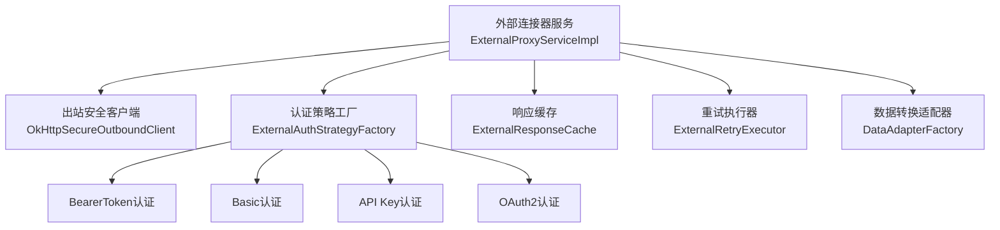
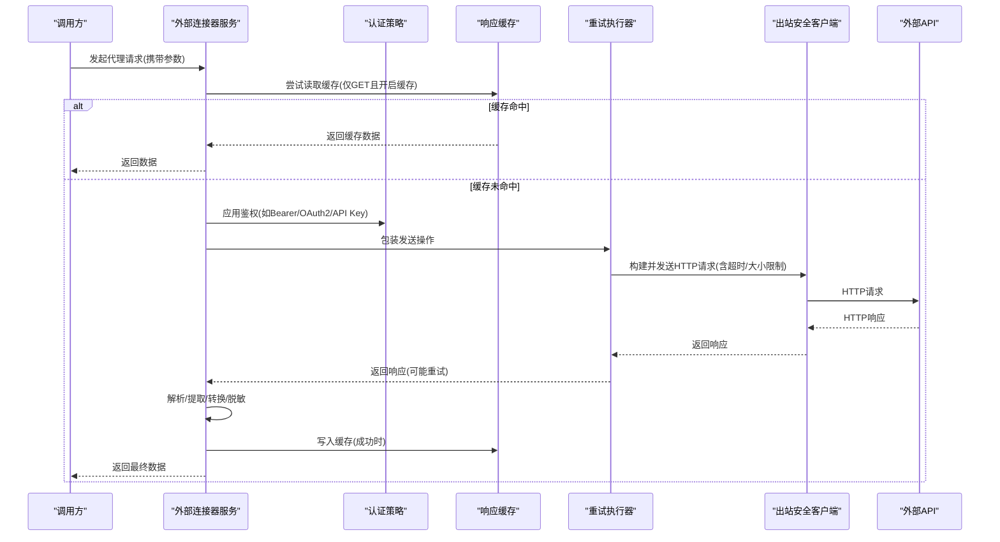
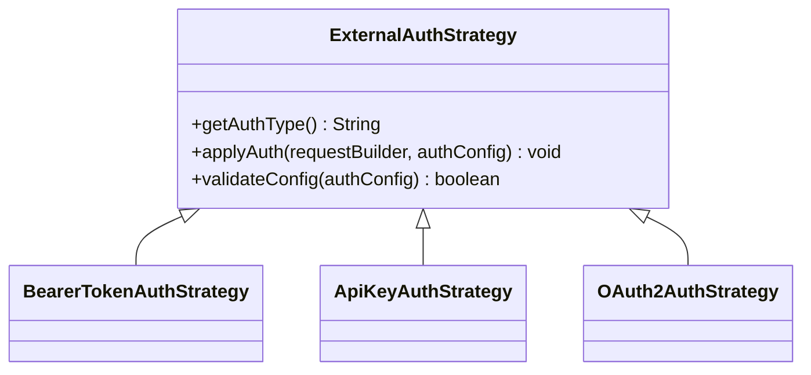
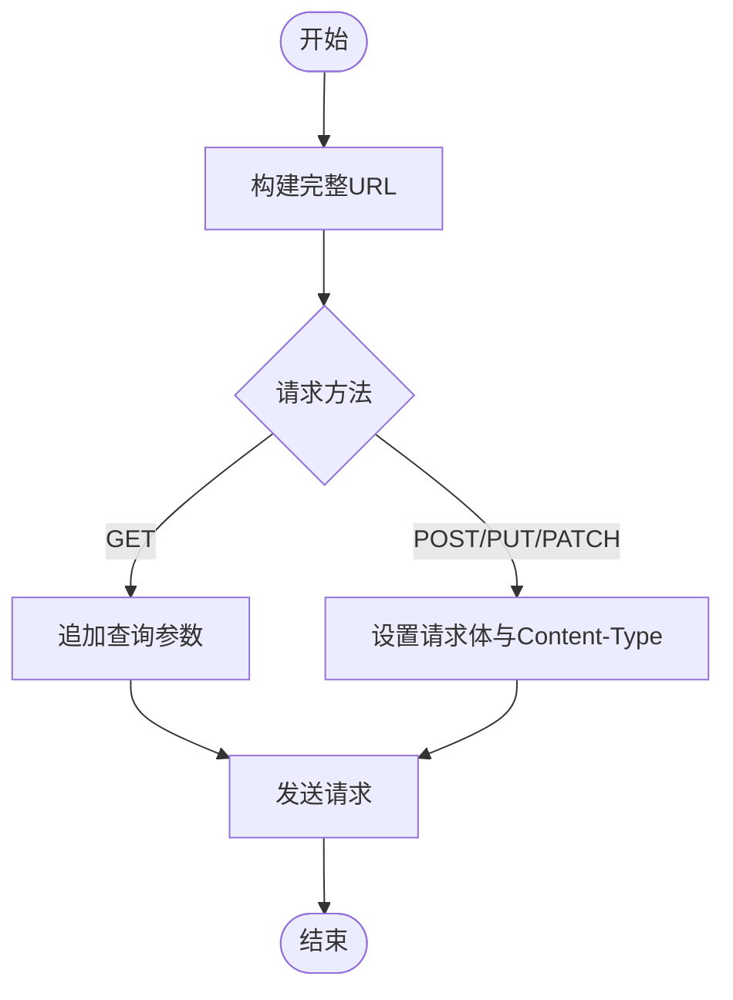
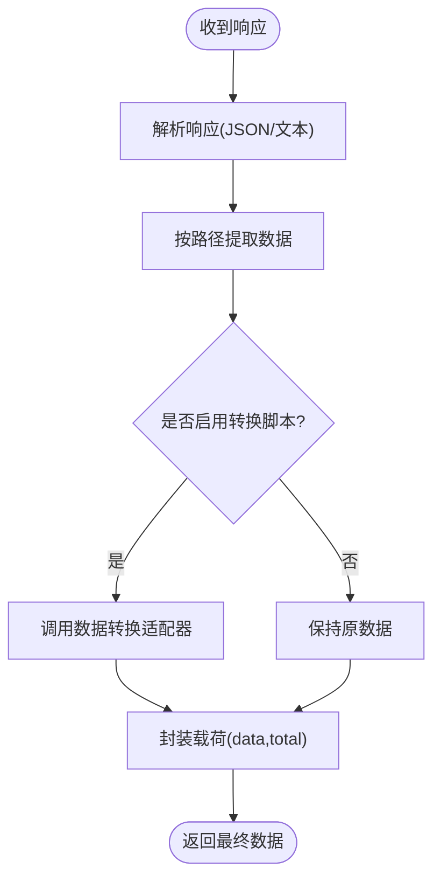
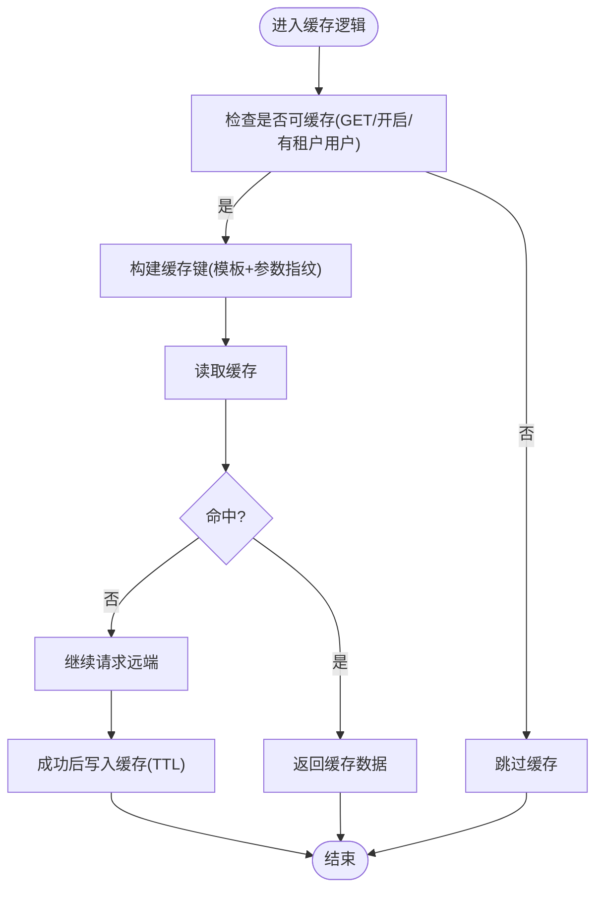
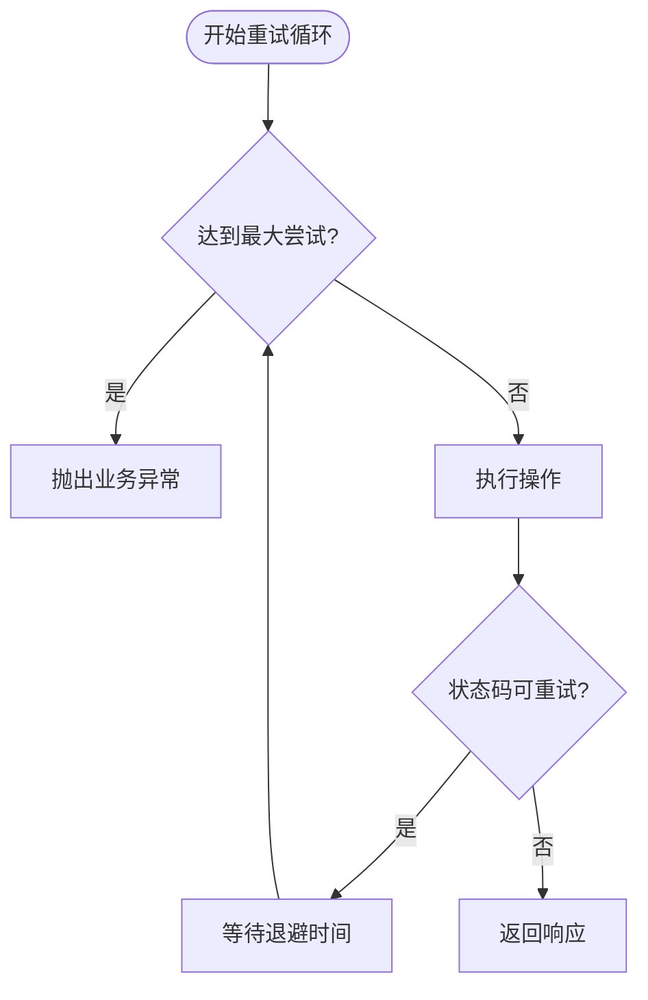
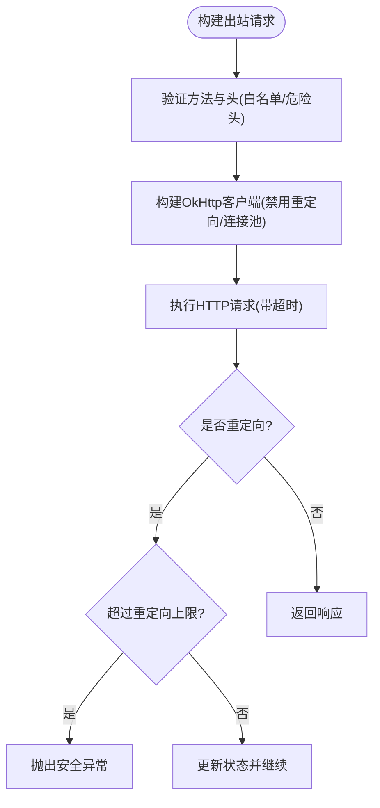
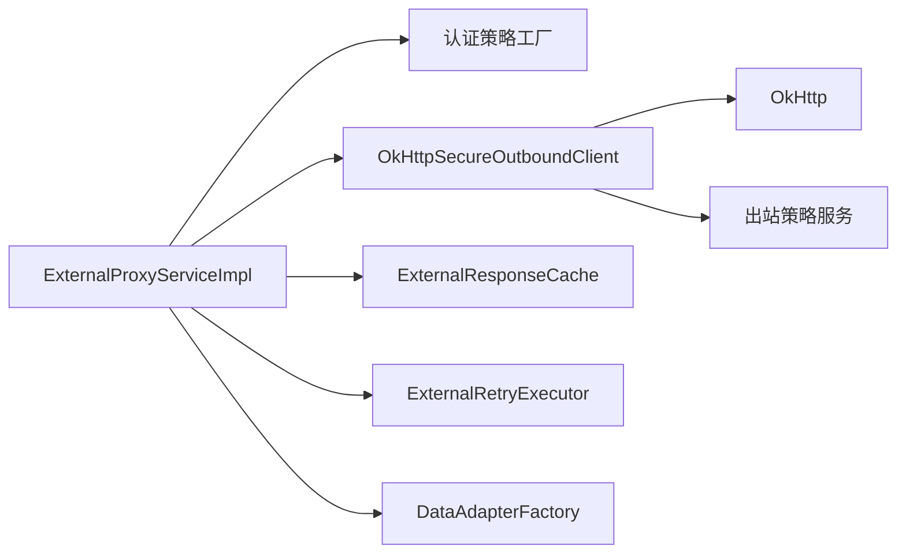

# API接口数据源

<cite>
**本文引用的文件**
- [ExternalProxyServiceImpl.java](file://forge-server/forge-framework/forge-plugin-parent/forge-plugin-external/src/main/java/com/mdframe/forge/plugin/external/service/impl/ExternalProxyServiceImpl.java)
- [OkHttpSecureOutboundClient.java](file://forge-server/forge-framework/forge-starter-parent/forge-starter-outbound/src/main/java/com/mdframe/forge/starter/outbound/client/OkHttpSecureOutboundClient.java)
- [OAuth2AuthStrategy.java](file://forge-server/forge-framework/forge-plugin-parent/forge-plugin-external/src/main/java/com/mdframe/forge/plugin/external/strategy/impl/OAuth2AuthStrategy.java)
- [BearerTokenAuthStrategy.java](file://forge-server/forge-framework/forge-plugin-parent/forge-plugin-external/src/main/java/com/mdframe/forge/plugin/external/strategy/impl/BearerTokenAuthStrategy.java)
- [ApiKeyAuthStrategy.java](file://forge-server/forge-framework/forge-plugin-parent/forge-plugin-external/src/main/java/com/mdframe/forge/plugin/external/strategy/impl/ApiKeyAuthStrategy.java)
- [DataAdapterFactory.java](file://forge-server/forge-framework/forge-plugin-parent/forge-plugin-external/src/main/java/com/mdframe/forge/plugin/external/adapter/DataAdapterFactory.java)
- [ExternalResponseCache.java](file://forge-server/forge-framework/forge-plugin-parent/forge-plugin-external/src/main/java/com/mdframe/forge/plugin/external/support/ExternalResponseCache.java)
- [ExternalRetryExecutor.java](file://forge-server/forge-framework/forge-plugin-parent/forge-plugin-external/src/main/java/com/mdframe/forge/plugin/external/support/ExternalRetryExecutor.java)
- [EffectiveCachePolicy.java](file://forge-server/forge-framework/forge-starter-parent/forge-starter-cache/src/main/java/com/mdframe/forge/starter/cache/managed/model/EffectiveCachePolicy.java)
</cite>

## 目录
1. [简介](#简介)
2. [项目结构](#项目结构)
3. [核心组件](#核心组件)
4. [架构总览](#架构总览)
5. [详细组件分析](#详细组件分析)
6. [依赖关系分析](#依赖关系分析)
7. [性能考量](#性能考量)
8. [故障排查指南](#故障排查指南)
9. [结论](#结论)
10. [附录](#附录)

## 简介
本文件面向Forge Admin的“API接口数据源”能力，系统化说明如何通过平台配置对接外部RESTful API，涵盖认证方式（Bearer Token、Basic Auth、API Key、OAuth2）、请求头与参数传递、响应数据处理、错误处理、数据转换适配器、缓存策略、重试机制与超时配置，并提供集成示例、调试方法与性能优化建议。

## 项目结构
围绕API数据源的核心实现位于外部连接器插件与出站安全客户端中：
- 外部连接器服务负责组装请求、鉴权、加解密、缓存、重试、日志与响应转换。
- 出站安全客户端提供安全的HTTP调用、重定向控制、大小限制、超时控制与DNS校验。
- 认证策略通过工厂模式扩展，支持多种鉴权方式。
- 数据转换适配器用于对响应进行脚本化或规则化变换。
- 缓存与重试分别由专用组件提供，配合系统级缓存策略。

**图示来源**
- [ExternalProxyServiceImpl.java:70-188](file://forge-server/forge-framework/forge-plugin-parent/forge-plugin-external/src/main/java/com/mdframe/forge/plugin/external/service/impl/ExternalProxyServiceImpl.java#L70-L188)
- [OkHttpSecureOutboundClient.java:50-128](file://forge-server/forge-framework/forge-starter-parent/forge-starter-outbound/src/main/java/com/mdframe/forge/starter/outbound/client/OkHttpSecureOutboundClient.java#L50-L128)
- [OAuth2AuthStrategy.java:27-41](file://forge-server/forge-framework/forge-plugin-parent/forge-plugin-external/src/main/java/com/mdframe/forge/plugin/external/strategy/impl/OAuth2AuthStrategy.java#L27-L41)
- [BearerTokenAuthStrategy.java:13-33](file://forge-server/forge-framework/forge-plugin-parent/forge-plugin-external/src/main/java/com/mdframe/forge/plugin/external/strategy/impl/BearerTokenAuthStrategy.java#L13-L33)
- [ApiKeyAuthStrategy.java:13-29](file://forge-server/forge-framework/forge-plugin-parent/forge-plugin-external/src/main/java/com/mdframe/forge/plugin/external/strategy/impl/ApiKeyAuthStrategy.java#L13-L29)
- [ExternalResponseCache.java:32-55](file://forge-server/forge-framework/forge-plugin-parent/forge-plugin-external/src/main/java/com/mdframe/forge/plugin/external/support/ExternalResponseCache.java#L32-L55)
- [ExternalRetryExecutor.java:22-39](file://forge-server/forge-framework/forge-plugin-parent/forge-plugin-external/src/main/java/com/mdframe/forge/plugin/external/support/ExternalRetryExecutor.java#L22-L39)
- [DataAdapterFactory.java:16-26](file://forge-server/forge-framework/forge-plugin-parent/forge-plugin-external/src/main/java/com/mdframe/forge/plugin/external/adapter/DataAdapterFactory.java#L16-L26)

**章节来源**
- [ExternalProxyServiceImpl.java:70-188](file://forge-server/forge-framework/forge-plugin-parent/forge-plugin-external/src/main/java/com/mdframe/forge/plugin/external/service/impl/ExternalProxyServiceImpl.java#L70-L188)
- [OkHttpSecureOutboundClient.java:50-128](file://forge-server/forge-framework/forge-starter-parent/forge-starter-outbound/src/main/java/com/mdframe/forge/starter/outbound/client/OkHttpSecureOutboundClient.java#L50-L128)

## 核心组件
- 外部连接器服务：统一编排请求构建、鉴权、加解密、缓存命中、重试、响应解析与转换、敏感信息脱敏与日志记录。
- 出站安全客户端：基于OkHttp的安全网络层，提供方法白名单、危险头过滤、重定向控制、大小限制、超时控制与DNS校验。
- 认证策略：按类型注入Authorization或自定义Header，支持Bearer Token、Basic、API Key、OAuth2等。
- 数据转换适配器：通过脚本或规则将原始响应转换为目标数据结构。
- 响应缓存：针对GET请求在租户与用户维度缓存结果，支持TTL与键模板。
- 重试执行器：对可重试方法与状态码进行指数退避重试，屏蔽非幂等写入的重试风险。

**章节来源**
- [ExternalProxyServiceImpl.java:70-188](file://forge-server/forge-framework/forge-plugin-parent/forge-plugin-external/src/main/java/com/mdframe/forge/plugin/external/service/impl/ExternalProxyServiceImpl.java#L70-L188)
- [ExternalResponseCache.java:32-78](file://forge-server/forge-framework/forge-plugin-parent/forge-plugin-external/src/main/java/com/mdframe/forge/plugin/external/support/ExternalResponseCache.java#L32-L78)
- [ExternalRetryExecutor.java:22-79](file://forge-server/forge-framework/forge-plugin-parent/forge-plugin-external/src/main/java/com/mdframe/forge/plugin/external/support/ExternalRetryExecutor.java#L22-L79)
- [OkHttpSecureOutboundClient.java:50-128](file://forge-server/forge-framework/forge-starter-parent/forge-starter-outbound/src/main/java/com/mdframe/forge/starter/outbound/client/OkHttpSecureOutboundClient.java#L50-L128)

## 架构总览
下图展示了从业务侧发起一次外部API调用的完整流程，包括鉴权、缓存、重试、出站安全与响应处理。

**图示来源**
- [ExternalProxyServiceImpl.java:70-188](file://forge-server/forge-framework/forge-plugin-parent/forge-plugin-external/src/main/java/com/mdframe/forge/plugin/external/service/impl/ExternalProxyServiceImpl.java#L70-L188)
- [ExternalResponseCache.java:32-55](file://forge-server/forge-framework/forge-plugin-parent/forge-plugin-external/src/main/java/com/mdframe/forge/plugin/external/support/ExternalResponseCache.java#L32-L55)
- [ExternalRetryExecutor.java:22-39](file://forge-server/forge-framework/forge-plugin-parent/forge-plugin-external/src/main/java/com/mdframe/forge/plugin/external/support/ExternalRetryExecutor.java#L22-L39)
- [OkHttpSecureOutboundClient.java:50-128](file://forge-server/forge-framework/forge-starter-parent/forge-starter-outbound/src/main/java/com/mdframe/forge/starter/outbound/client/OkHttpSecureOutboundClient.java#L50-L128)

## 详细组件分析

### 认证机制与请求头配置
- 支持的认证类型与行为：
  - Bearer Token：在指定Header中附加前缀与令牌。
  - Basic Auth：使用用户名与密码生成Basic头。
  - API Key：支持Header或Query/Body位置注入。
  - OAuth2：通过tokenUrl获取access_token，并在Authorization头中设置。
  - 当前会话Token：复用当前登录用户的令牌。
- 请求头：
  - 允许配置自定义请求头，但会过滤保留的系统头。
  - 出站安全客户端会拒绝危险头与包含换行符的头。
- 请求体与Content-Type：
  - GET请求不携带请求体；POST/PUT/PATCH根据配置的Content-Type发送JSON或文本。

**图示来源**
- [BearerTokenAuthStrategy.java:13-33](file://forge-server/forge-framework/forge-plugin-parent/forge-plugin-external/src/main/java/com/mdframe/forge/plugin/external/strategy/impl/BearerTokenAuthStrategy.java#L13-L33)
- [ApiKeyAuthStrategy.java:13-29](file://forge-server/forge-framework/forge-plugin-parent/forge-plugin-external/src/main/java/com/mdframe/forge/plugin/external/strategy/impl/ApiKeyAuthStrategy.java#L13-L29)
- [OAuth2AuthStrategy.java:27-41](file://forge-server/forge-framework/forge-plugin-parent/forge-plugin-external/src/main/java/com/mdframe/forge/plugin/external/strategy/impl/OAuth2AuthStrategy.java#L27-L41)

**章节来源**
- [ExternalProxyServiceImpl.java:457-503](file://forge-server/forge-framework/forge-plugin-parent/forge-plugin-external/src/main/java/com/mdframe/forge/plugin/external/service/impl/ExternalProxyServiceImpl.java#L457-L503)
- [ExternalProxyServiceImpl.java:711-737](file://forge-server/forge-framework/forge-plugin-parent/forge-plugin-external/src/main/java/com/mdframe/forge/plugin/external/service/impl/ExternalProxyServiceImpl.java#L711-L737)
- [BearerTokenAuthStrategy.java:13-33](file://forge-server/forge-framework/forge-plugin-parent/forge-plugin-external/src/main/java/com/mdframe/forge/plugin/external/strategy/impl/BearerTokenAuthStrategy.java#L13-L33)
- [ApiKeyAuthStrategy.java:13-29](file://forge-server/forge-framework/forge-plugin-parent/forge-plugin-external/src/main/java/com/mdframe/forge/plugin/external/strategy/impl/ApiKeyAuthStrategy.java#L13-L29)
- [OAuth2AuthStrategy.java:27-41](file://forge-server/forge-framework/forge-plugin-parent/forge-plugin-external/src/main/java/com/mdframe/forge/plugin/external/strategy/impl/OAuth2AuthStrategy.java#L27-L41)
- [OkHttpSecureOutboundClient.java:39-44](file://forge-server/forge-framework/forge-starter-parent/forge-starter-outbound/src/main/java/com/mdframe/forge/starter/outbound/client/OkHttpSecureOutboundClient.java#L39-L44)

### 请求构建与参数传递
- URL拼接：基础地址与路径组合，自动处理尾部斜杠与路径前导斜杠。
- 查询参数：GET请求将参数编码后追加到URL。
- 请求体：POST/PUT/PATCH根据Content-Type序列化参数为JSON或文本。
- 参数映射：支持运行时参数到目标参数的映射与默认值填充。
- 安全头与保留头：过滤危险头与保留头，避免被覆盖。

**图示来源**
- [ExternalProxyServiceImpl.java:122-145](file://forge-server/forge-framework/forge-plugin-parent/forge-plugin-external/src/main/java/com/mdframe/forge/plugin/external/service/impl/ExternalProxyServiceImpl.java#L122-L145)
- [ExternalProxyServiceImpl.java:657-683](file://forge-server/forge-framework/forge-plugin-parent/forge-plugin-external/src/main/java/com/mdframe/forge/plugin/external/service/impl/ExternalProxyServiceImpl.java#L657-L683)
- [ExternalProxyServiceImpl.java:439-455](file://forge-server/forge-framework/forge-plugin-parent/forge-plugin-external/src/main/java/com/mdframe/forge/plugin/external/service/impl/ExternalProxyServiceImpl.java#L439-L455)

**章节来源**
- [ExternalProxyServiceImpl.java:122-145](file://forge-server/forge-framework/forge-plugin-parent/forge-plugin-external/src/main/java/com/mdframe/forge/plugin/external/service/impl/ExternalProxyServiceImpl.java#L122-L145)
- [ExternalProxyServiceImpl.java:312-353](file://forge-server/forge-framework/forge-plugin-parent/forge-plugin-external/src/main/java/com/mdframe/forge/plugin/external/service/impl/ExternalProxyServiceImpl.java#L312-L353)
- [ExternalProxyServiceImpl.java:657-683](file://forge-server/forge-framework/forge-plugin-parent/forge-plugin-external/src/main/java/com/mdframe/forge/plugin/external/service/impl/ExternalProxyServiceImpl.java#L657-L683)

### 响应数据处理与数据转换适配器
- 响应解析：支持JSON与纯文本；若解析失败回退为字符串。
- 数据提取：通过路径表达式从响应中提取数据节点。
- 成功判定：优先依据配置的errorCodePath与successCodes判断，否则按HTTP状态码。
- 错误消息：优先从配置的错误消息路径提取，否则返回HTTP状态提示。
- 数据转换：当启用响应转换脚本时，通过适配器将原始数据转换为目标结构。
- 载荷封装：可选地将total字段与data合并为标准载荷。

**图示来源**
- [ExternalProxyServiceImpl.java:190-197](file://forge-server/forge-framework/forge-plugin-parent/forge-plugin-external/src/main/java/com/mdframe/forge/plugin/external/service/impl/ExternalProxyServiceImpl.java#L190-L197)
- [ExternalProxyServiceImpl.java:230-247](file://forge-server/forge-framework/forge-plugin-parent/forge-plugin-external/src/main/java/com/mdframe/forge/plugin/external/service/impl/ExternalProxyServiceImpl.java#L230-L247)
- [ExternalProxyServiceImpl.java:355-367](file://forge-server/forge-framework/forge-plugin-parent/forge-plugin-external/src/main/java/com/mdframe/forge/plugin/external/service/impl/ExternalProxyServiceImpl.java#L355-L367)
- [DataAdapterFactory.java:16-26](file://forge-server/forge-framework/forge-plugin-parent/forge-plugin-external/src/main/java/com/mdframe/forge/plugin/external/adapter/DataAdapterFactory.java#L16-L26)

**章节来源**
- [ExternalProxyServiceImpl.java:190-197](file://forge-server/forge-framework/forge-plugin-parent/forge-plugin-external/src/main/java/com/mdframe/forge/plugin/external/service/impl/ExternalProxyServiceImpl.java#L190-L197)
- [ExternalProxyServiceImpl.java:230-247](file://forge-server/forge-framework/forge-plugin-parent/forge-plugin-external/src/main/java/com/mdframe/forge/plugin/external/service/impl/ExternalProxyServiceImpl.java#L230-L247)
- [ExternalProxyServiceImpl.java:355-367](file://forge-server/forge-framework/forge-plugin-parent/forge-plugin-external/src/main/java/com/mdframe/forge/plugin/external/service/impl/ExternalProxyServiceImpl.java#L355-L367)
- [DataAdapterFactory.java:16-26](file://forge-server/forge-framework/forge-plugin-parent/forge-plugin-external/src/main/java/com/mdframe/forge/plugin/external/adapter/DataAdapterFactory.java#L16-L26)

### 缓存策略
- 适用条件：仅GET请求、开启缓存、存在租户与用户上下文。
- 键生成：基于模板与规范化后的参数计算摘要，结合租户与用户标识形成唯一键。
- TTL：默认60秒，最大不超过一天；可通过配置调整。
- 读写保护：读失败或写失败均不影响主流程，仅记录警告日志。

**图示来源**
- [ExternalResponseCache.java:32-78](file://forge-server/forge-framework/forge-plugin-parent/forge-plugin-external/src/main/java/com/mdframe/forge/plugin/external/support/ExternalResponseCache.java#L32-L78)

**章节来源**
- [ExternalResponseCache.java:32-78](file://forge-server/forge-framework/forge-plugin-parent/forge-plugin-external/src/main/java/com/mdframe/forge/plugin/external/support/ExternalResponseCache.java#L32-L78)
- [EffectiveCachePolicy.java:7-39](file://forge-server/forge-framework/forge-starter-parent/forge-starter-cache/src/main/java/com/mdframe/forge/starter/cache/managed/model/EffectiveCachePolicy.java#L7-L39)

### 重试机制
- 可重试方法：GET、HEAD；其他方法不重试以避免非幂等风险。
- 可重试状态码：502、503、504。
- 最大尝试次数：默认3次，上限5次；可通过系统配置调整。
- 退避策略：线性退避，默认500ms，上限5000ms。
- 网络异常：出站安全客户端抛出的特定异常会被识别并重试。

**图示来源**
- [ExternalRetryExecutor.java:22-79](file://forge-server/forge-framework/forge-plugin-parent/forge-plugin-external/src/main/java/com/mdframe/forge/plugin/external/support/ExternalRetryExecutor.java#L22-L79)

**章节来源**
- [ExternalRetryExecutor.java:22-79](file://forge-server/forge-framework/forge-plugin-parent/forge-plugin-external/src/main/java/com/mdframe/forge/plugin/external/support/ExternalRetryExecutor.java#L22-L79)

### 超时配置与安全出站
- 超时维度：连接超时、读取超时、写入超时、整体调用超时。
- 超时裁剪：实际超时不会超过剩余整体超时时间。
- 重定向控制：默认禁止重定向；若允许则限制次数并清理凭据头。
- 大小限制：请求与响应大小受配置上限保护。
- DNS校验：连接前再次校验目标主机与端口，防止DNS劫持。

**图示来源**
- [OkHttpSecureOutboundClient.java:50-128](file://forge-server/forge-framework/forge-starter-parent/forge-starter-outbound/src/main/java/com/mdframe/forge/starter/outbound/client/OkHttpSecureOutboundClient.java#L50-L128)
- [OkHttpSecureOutboundClient.java:151-163](file://forge-server/forge-framework/forge-starter-parent/forge-starter-outbound/src/main/java/com/mdframe/forge/starter/outbound/client/OkHttpSecureOutboundClient.java#L151-L163)
- [OkHttpSecureOutboundClient.java:228-250](file://forge-server/forge-framework/forge-starter-parent/forge-starter-outbound/src/main/java/com/mdframe/forge/starter/outbound/client/OkHttpSecureOutboundClient.java#L228-L250)

**章节来源**
- [OkHttpSecureOutboundClient.java:50-128](file://forge-server/forge-framework/forge-starter-parent/forge-starter-outbound/src/main/java/com/mdframe/forge/starter/outbound/client/OkHttpSecureOutboundClient.java#L50-L128)
- [OkHttpSecureOutboundClient.java:151-163](file://forge-server/forge-framework/forge-starter-parent/forge-starter-outbound/src/main/java/com/mdframe/forge/starter/outbound/client/OkHttpSecureOutboundClient.java#L151-L163)
- [OkHttpSecureOutboundClient.java:228-250](file://forge-server/forge-framework/forge-starter-parent/forge-starter-outbound/src/main/java/com/mdframe/forge/starter/outbound/client/OkHttpSecureOutboundClient.java#L228-L250)

## 依赖关系分析
- 外部连接器服务依赖：
  - 认证策略工厂：动态选择并应用鉴权。
  - 出站安全客户端：统一的HTTP执行与安全策略。
  - 响应缓存：减少重复请求压力。
  - 重试执行器：提升临时错误的成功率。
  - 数据转换适配器：灵活转换响应结构。
- 出站安全客户端依赖：
  - OkHttp：底层HTTP实现。
  - 出站策略服务：目标访问控制与重定向策略。
  - 配置属性：全局超时、大小限制、重定向开关等。

**图示来源**
- [ExternalProxyServiceImpl.java:55-67](file://forge-server/forge-framework/forge-plugin-parent/forge-plugin-external/src/main/java/com/mdframe/forge/plugin/external/service/impl/ExternalProxyServiceImpl.java#L55-L67)
- [OkHttpSecureOutboundClient.java:34-48](file://forge-server/forge-framework/forge-starter-parent/forge-starter-outbound/src/main/java/com/mdframe/forge/starter/outbound/client/OkHttpSecureOutboundClient.java#L34-L48)

**章节来源**
- [ExternalProxyServiceImpl.java:55-67](file://forge-server/forge-framework/forge-plugin-parent/forge-plugin-external/src/main/java/com/mdframe/forge/plugin/external/service/impl/ExternalProxyServiceImpl.java#L55-L67)
- [OkHttpSecureOutboundClient.java:34-48](file://forge-server/forge-framework/forge-starter-parent/forge-starter-outbound/src/main/java/com/mdframe/forge/starter/outbound/client/OkHttpSecureOutboundClient.java#L34-L48)

## 性能考量
- 缓存优先：对高频只读的GET接口开启缓存，显著降低下游压力。
- 合理重试：仅对幂等方法与临时错误重试，避免放大流量。
- 超时裁剪：整体调用超时约束各阶段超时，防止长尾阻塞。
- 连接池与重定向：禁用自动重定向与连接池复用，减少不可控跳转与资源占用。
- 大小限制：限制请求与响应体积，防止内存溢出。
- 数据转换：仅在必要时启用脚本转换，避免不必要的CPU开销。

[本节为通用指导，无需具体文件引用]

## 故障排查指南
- 常见问题定位：
  - 认证失败：检查认证类型与配置项（Token、Basic、API Key、OAuth2）。
  - 请求头被拒绝：确认未包含危险头或包含换行符。
  - 超时：核对连接/读取/写入/整体超时配置，关注出站安全客户端的超时裁剪。
  - 重定向：若被拒绝，检查是否启用了重定向与次数上限。
  - 缓存未命中：确认是否为GET且具备租户与用户上下文。
  - 重试未生效：确认方法是否可重试以及状态码是否在可重试集合内。
- 日志与调试：
  - 连接器保存请求与响应日志（已脱敏），便于问题回溯。
  - 调试模式下返回更详细的错误信息与响应体。
  - 出站安全客户端在异常时抛出明确的安全异常类型，便于上层捕获与告警。

**章节来源**
- [ExternalProxyServiceImpl.java:384-419](file://forge-server/forge-framework/forge-plugin-parent/forge-plugin-external/src/main/java/com/mdframe/forge/plugin/external/service/impl/ExternalProxyServiceImpl.java#L384-L419)
- [ExternalProxyServiceImpl.java:174-187](file://forge-server/forge-framework/forge-plugin-parent/forge-plugin-external/src/main/java/com/mdframe/forge/plugin/external/service/impl/ExternalProxyServiceImpl.java#L174-L187)
- [OkHttpSecureOutboundClient.java:189-211](file://forge-server/forge-framework/forge-starter-parent/forge-starter-outbound/src/main/java/com/mdframe/forge/starter/outbound/client/OkHttpSecureOutboundClient.java#L189-L211)

## 结论
Forge Admin的API接口数据源通过统一的外部连接器服务，结合安全的出站客户端、灵活的认证策略、可配置的缓存与重试机制，提供了稳定、安全、高性能的RESTful API对接能力。通过合理的配置与优化，可在复杂网络与第三方服务环境下保障调用的可靠性与效率。

[本节为总结性内容，无需具体文件引用]

## 附录
- 集成示例（概念步骤）：
  - 在系统中配置外部系统与API，选择认证类型并填写必要参数。
  - 根据需要配置请求头、参数映射、响应数据路径与成功/错误码。
  - 开启缓存与重试，设定合适的TTL与最大尝试次数。
  - 使用调试接口验证请求与响应，观察日志与耗时。
- 最佳实践：
  - 对只读接口开启缓存，对写入接口关闭重试。
  - 严格配置超时与大小限制，避免资源耗尽。
  - 使用数据转换适配器统一响应结构，简化上游消费。
  - 定期审查认证配置与敏感信息，确保最小权限原则。

[本节为通用指导，无需具体文件引用]