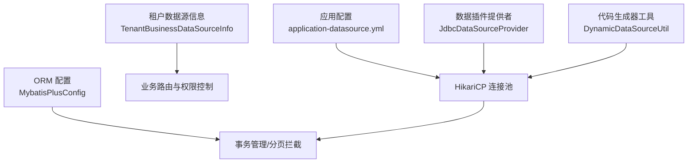
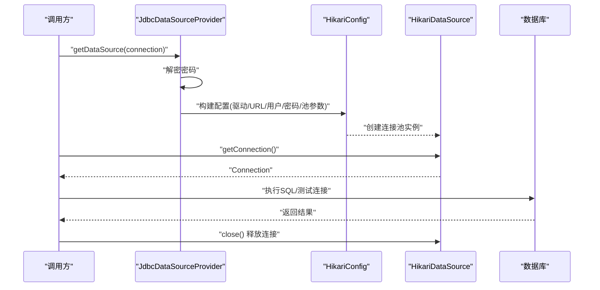
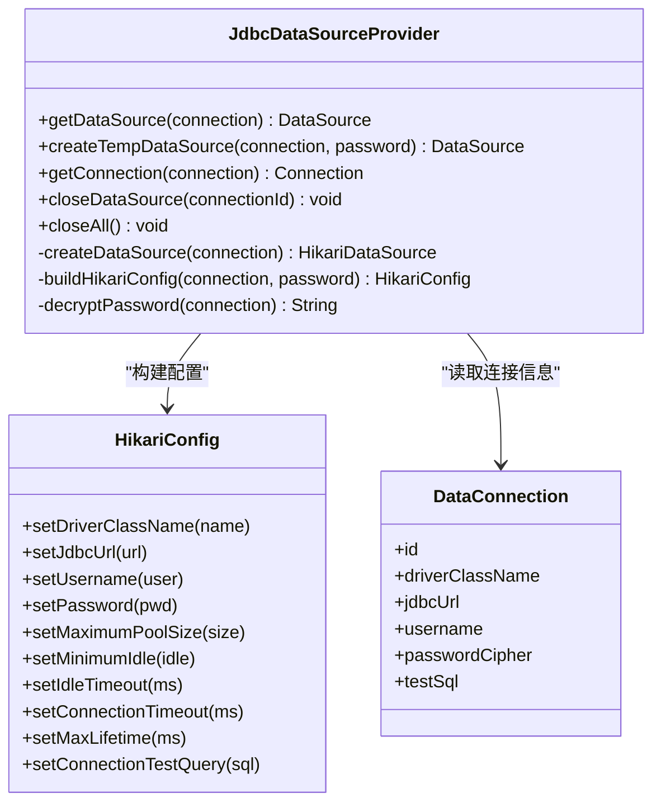
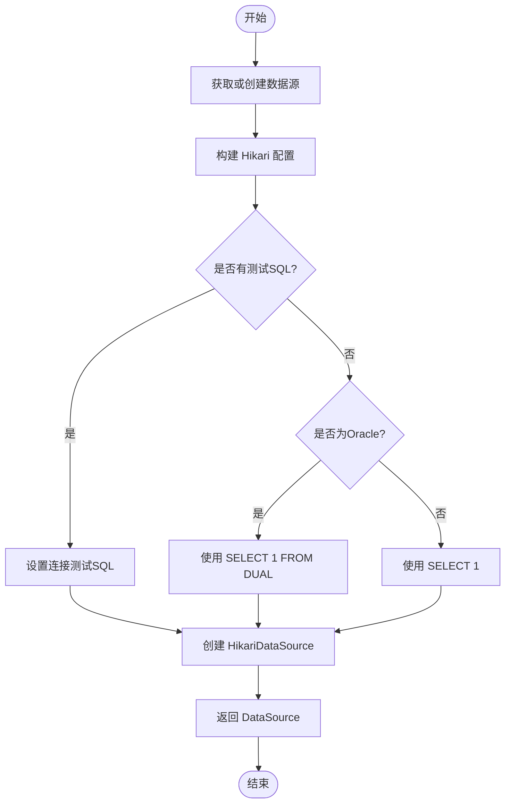
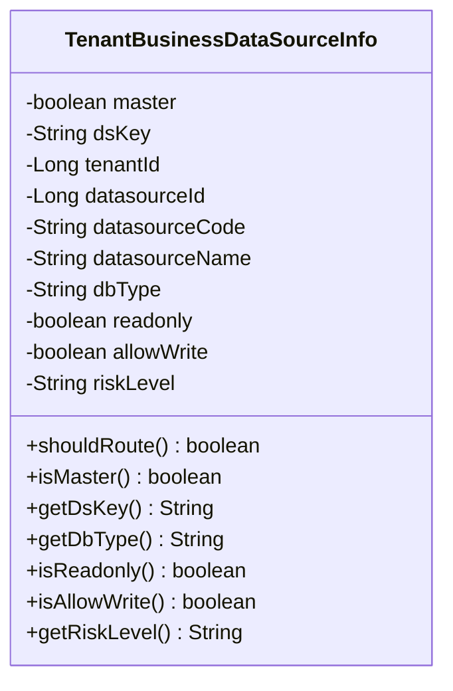
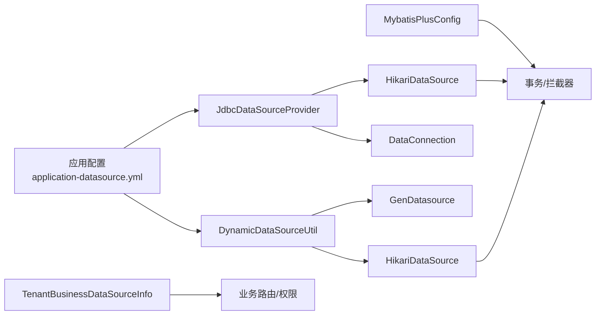

# 数据库数据源

<cite>
**本文引用的文件**
- [application-datasource.yml](file://docker-forge-admin/application-datasource.yml)
- [application.yml](file://forge-server/forge-admin-server/src/main/resources/application.yml)
- [JdbcDataSourceProvider.java](file://forge-server/forge-framework/forge-plugin-parent/forge-plugin-data/src/main/java/com/mdframe/forge/plugin/data/support/JdbcDataSourceProvider.java)
- [DynamicDataSourceUtil.java](file://forge-server/forge-framework/forge-plugin-parent/forge-plugin-generator/src/main/java/com/mdframe/forge/plugin/generator/util/DynamicDataSourceUtil.java)
- [DataConnection.java](file://forge-server/forge-framework/forge-plugin-parent/forge-plugin-data/src/main/java/com/mdframe/forge/plugin/data/entity/DataConnection.java)
- [GenDatasource.java](file://forge-server/forge-framework/forge-plugin-parent/forge-plugin-generator/src/main/java/com/mdframe/forge/plugin/generator/domain/entity/GenDatasource.java)
- [BusinessDataSourceProperties.java](file://forge-server/forge-framework/forge-starter-parent/forge-starter-tenant/src/main/java/com/mdframe/forge/starter/tenant/datasource/BusinessDataSourceProperties.java)
- [TenantBusinessDataSourceInfo.java](file://forge-server/forge-framework/forge-starter-parent/forge-starter-tenant/src/main/java/com/mdframe/forge/starter/tenant/datasource/TenantBusinessDataSourceInfo.java)
- [MybatisPlusConfig.java](file://forge-server/forge-framework/forge-starter-parent/forge-starter-orm/src/main/java/com/mdframe/forge/starter/orm/config/MybatisPlusConfig.java)
</cite>

## 目录
1. [简介](#简介)
2. [项目结构](#项目结构)
3. [核心组件](#核心组件)
4. [架构总览](#架构总览)
5. [详细组件分析](#详细组件分析)
6. [依赖关系分析](#依赖关系分析)
7. [性能考虑](#性能考虑)
8. [故障诊断指南](#故障诊断指南)
9. [结论](#结论)
10. [附录](#附录)

## 简介
本文件面向 Forge Admin 的数据库数据源配置与使用，覆盖多数据库类型支持、连接参数、连接池、安全连接、连接建立与测试、监控与管理、SQL 查询构建、参数化查询、事务处理、性能优化策略、最佳实践与常见问题排查。文档基于仓库中的实际实现进行说明，确保内容可落地、可操作。

## 项目结构
- 应用级动态数据源与连接池通过 Spring Boot 配置集中管理，默认使用 HikariCP 作为连接池实现。
- 运行时数据源由插件模块提供：
  - 代码生成器模块提供“动态数据源工具”，用于按配置创建、缓存、测试和管理数据源。
  - 数据插件模块提供“JDBC 数据源提供者”，负责从持久化的数据连接中解密密码并创建 Hikari 数据源。
- 租户业务数据源路由能力通过 starter 模块暴露配置开关与解析结果对象，便于在业务层进行读写控制与风险等级标记。
- ORM 层集成 MyBatis-Plus，启用事务管理与分页等拦截器。

**图表来源**
- [application-datasource.yml:1-22](file://docker-forge-admin/application-datasource.yml#L1-L22)
- [JdbcDataSourceProvider.java:36-56](file://forge-server/forge-framework/forge-plugin-parent/forge-plugin-data/src/main/java/com/mdframe/forge/plugin/data/support/JdbcDataSourceProvider.java#L36-L56)
- [DynamicDataSourceUtil.java:54-73](file://forge-server/forge-framework/forge-plugin-parent/forge-plugin-generator/src/main/java/com/mdframe/forge/plugin/generator/util/DynamicDataSourceUtil.java#L54-L73)
- [TenantBusinessDataSourceInfo.java:53-95](file://forge-server/forge-framework/forge-starter-parent/forge-starter-tenant/src/main/java/com/mdframe/forge/starter/tenant/datasource/TenantBusinessDataSourceInfo.java#L53-L95)
- [MybatisPlusConfig.java:27-30](file://forge-server/forge-framework/forge-starter-parent/forge-starter-orm/src/main/java/com/mdframe/forge/starter/orm/config/MybatisPlusConfig.java#L27-L30)

**章节来源**
- [application-datasource.yml:1-22](file://docker-forge-admin/application-datasource.yml#L1-L22)
- [application.yml:97-118](file://forge-server/forge-admin-server/src/main/resources/application.yml#L97-L118)

## 核心组件
- 动态数据源提供者（JDBC）：从持久化连接配置中读取驱动、URL、用户名、加密密码，解密后构建 Hikari 配置并缓存 DataSource，提供获取连接与关闭资源的能力。
- 动态数据源工具（代码生成器）：根据 GenDatasource 实体创建 Hikari 数据源，内置连接池参数与测试 SQL 解析，支持连接测试、移除与清空。
- 租户业务数据源信息：封装是否主库、数据源键、租户ID、数据源标识、数据库类型、只读/允许写入、风险等级等，用于路由与权限控制。
- 应用级数据源配置：定义动态数据源主库、Hikari 全局参数、Redis 配置以及 Flowable 流程引擎相关设置。
- ORM 配置：启用 MyBatis-Plus 的事务管理与常用拦截器。

**章节来源**
- [JdbcDataSourceProvider.java:27-69](file://forge-server/forge-framework/forge-plugin-parent/forge-plugin-data/src/main/java/com/mdframe/forge/plugin/data/support/JdbcDataSourceProvider.java#L27-L69)
- [DynamicDataSourceUtil.java:30-88](file://forge-server/forge-framework/forge-plugin-parent/forge-plugin-generator/src/main/java/com/mdframe/forge/plugin/generator/util/DynamicDataSourceUtil.java#L30-L88)
- [TenantBusinessDataSourceInfo.java:8-95](file://forge-server/forge-framework/forge-starter-parent/forge-starter-tenant/src/main/java/com/mdframe/forge/starter/tenant/datasource/TenantBusinessDataSourceInfo.java#L8-L95)
- [application-datasource.yml:1-22](file://docker-forge-admin/application-datasource.yml#L1-L22)
- [MybatisPlusConfig.java:27-30](file://forge-server/forge-framework/forge-starter-parent/forge-starter-orm/src/main/java/com/mdframe/forge/starter/orm/config/MybatisPlusConfig.java#L27-L30)

## 架构总览
下图展示了数据源从配置到连接的完整链路，包括动态数据源创建、连接池参数、测试连接与资源释放。

**图表来源**
- [JdbcDataSourceProvider.java:36-61](file://forge-server/forge-framework/forge-plugin-parent/forge-plugin-data/src/main/java/com/mdframe/forge/plugin/data/support/JdbcDataSourceProvider.java#L36-L61)
- [application-datasource.yml:1-22](file://docker-forge-admin/application-datasource.yml#L1-L22)

## 详细组件分析

### 动态数据源提供者（JDBC）
- 职责：从 DataConnection 实体读取连接元数据，解密密码，构建 Hikari 配置并缓存 DataSource；提供临时数据源创建、获取连接与关闭资源方法。
- 关键特性：
  - 连接池参数：最大连接数、空闲连接数、空闲超时、连接超时、最大生命周期、连接测试 SQL。
  - 密码解密：通过持久化加密服务解密，失败时抛出业务异常。
  - 资源管理：按连接 ID 缓存与关闭，避免连接泄漏。

**图表来源**
- [JdbcDataSourceProvider.java:36-56](file://forge-server/forge-framework/forge-plugin-parent/forge-plugin-data/src/main/java/com/mdframe/forge/plugin/data/support/JdbcDataSourceProvider.java#L36-L56)
- [DataConnection.java:18-37](file://forge-server/forge-framework/forge-plugin-parent/forge-plugin-data/src/main/java/com/mdframe/forge/plugin/data/entity/DataConnection.java#L18-L37)

**章节来源**
- [JdbcDataSourceProvider.java:27-95](file://forge-server/forge-framework/forge-plugin-parent/forge-plugin-data/src/main/java/com/mdframe/forge/plugin/data/support/JdbcDataSourceProvider.java#L27-L95)
- [DataConnection.java:18-37](file://forge-server/forge-framework/forge-plugin-parent/forge-plugin-data/src/main/java/com/mdframe/forge/plugin/data/entity/DataConnection.java#L18-L37)

### 动态数据源工具（代码生成器）
- 职责：根据 GenDatasource 实体创建 Hikari 数据源，维护内存池缓存，提供连接测试、移除与清空功能。
- 关键特性：
  - 连接池参数：最大连接数、最小空闲、连接超时、空闲超时、最大生命周期。
  - 测试 SQL 解析：优先使用配置的测试查询，Oracle 默认使用专用语句，其他数据库使用通用语句。
  - 资源管理：按 datasourceId 缓存与关闭，支持清空所有数据源。

**图表来源**
- [DynamicDataSourceUtil.java:44-73](file://forge-server/forge-framework/forge-plugin-parent/forge-plugin-generator/src/main/java/com/mdframe/forge/plugin/generator/util/DynamicDataSourceUtil.java#L44-L73)
- [DynamicDataSourceUtil.java:127-135](file://forge-server/forge-framework/forge-plugin-parent/forge-plugin-generator/src/main/java/com/mdframe/forge/plugin/generator/util/DynamicDataSourceUtil.java#L127-L135)

**章节来源**
- [DynamicDataSourceUtil.java:30-135](file://forge-server/forge-framework/forge-plugin-parent/forge-plugin-generator/src/main/java/com/mdframe/forge/plugin/generator/util/DynamicDataSourceUtil.java#L30-L135)
- [GenDatasource.java:34-97](file://forge-server/forge-framework/forge-plugin-parent/forge-plugin-generator/src/main/java/com/mdframe/forge/plugin/generator/domain/entity/GenDatasource.java#L34-L97)

### 租户业务数据源信息
- 职责：封装当前租户业务数据源的解析结果，包含是否主库、数据源键、租户ID、数据源标识、数据库类型、只读/允许写入、风险等级等。
- 用途：在业务层进行数据源路由、读写控制与风险评估。

**图表来源**
- [TenantBusinessDataSourceInfo.java:8-95](file://forge-server/forge-framework/forge-starter-parent/forge-starter-tenant/src/main/java/com/mdframe/forge/starter/tenant/datasource/TenantBusinessDataSourceInfo.java#L8-L95)

**章节来源**
- [TenantBusinessDataSourceInfo.java:8-95](file://forge-server/forge-framework/forge-starter-parent/forge-starter-tenant/src/main/java/com/mdframe/forge/starter/tenant/datasource/TenantBusinessDataSourceInfo.java#L8-L95)
- [BusinessDataSourceProperties.java:10-24](file://forge-server/forge-framework/forge-starter-parent/forge-starter-tenant/src/main/java/com/mdframe/forge/starter/tenant/datasource/BusinessDataSourceProperties.java#L10-L24)

### 应用级数据源配置
- 动态数据源：定义主库名称、严格模式、主库驱动与 JDBC URL、用户名与密码。
- Hikari 连接池：全局最大连接数、最小空闲、连接超时、验证超时、空闲超时、最大生命周期、保活时间。
- Redis 与 Flowable：为系统缓存与工作流引擎提供连接配置。

**章节来源**
- [application-datasource.yml:1-22](file://docker-forge-admin/application-datasource.yml#L1-L22)
- [application-datasource.yml:23-61](file://docker-forge-admin/application-datasource.yml#L23-L61)

### ORM 与事务
- MyBatis-Plus：启用事务管理、扫描 Mapper、配置实体别名与映射规则。
- 事务边界：通过注解或编程式事务管理，结合连接池与数据库特性保证一致性。

**章节来源**
- [MybatisPlusConfig.java:27-30](file://forge-server/forge-framework/forge-starter-parent/forge-starter-orm/src/main/java/com/mdframe/forge/starter/orm/config/MybatisPlusConfig.java#L27-L30)
- [application.yml:97-118](file://forge-server/forge-admin-server/src/main/resources/application.yml#L97-L118)

## 依赖关系分析
- 配置层：application-datasource.yml 提供动态数据源与 Hikari 全局参数。
- 提供者层：JdbcDataSourceProvider 与 DynamicDataSourceUtil 分别负责从持久化配置与生成器配置创建数据源。
- 实体层：DataConnection 与 GenDatasource 描述连接元数据与用途范围。
- 业务层：TenantBusinessDataSourceInfo 与 BusinessDataSourceProperties 提供租户数据源路由与开关。
- ORM 层：MybatisPlusConfig 启用事务与拦截器。

**图表来源**
- [application-datasource.yml:1-22](file://docker-forge-admin/application-datasource.yml#L1-L22)
- [JdbcDataSourceProvider.java:36-56](file://forge-server/forge-framework/forge-plugin-parent/forge-plugin-data/src/main/java/com/mdframe/forge/plugin/data/support/JdbcDataSourceProvider.java#L36-L56)
- [DynamicDataSourceUtil.java:54-73](file://forge-server/forge-framework/forge-plugin-parent/forge-plugin-generator/src/main/java/com/mdframe/forge/plugin/generator/util/DynamicDataSourceUtil.java#L54-L73)
- [DataConnection.java:18-37](file://forge-server/forge-framework/forge-plugin-parent/forge-plugin-data/src/main/java/com/mdframe/forge/plugin/data/entity/DataConnection.java#L18-L37)
- [GenDatasource.java:34-97](file://forge-server/forge-framework/forge-plugin-parent/forge-plugin-generator/src/main/java/com/mdframe/forge/plugin/generator/domain/entity/GenDatasource.java#L34-L97)
- [TenantBusinessDataSourceInfo.java:53-95](file://forge-server/forge-framework/forge-starter-parent/forge-starter-tenant/src/main/java/com/mdframe/forge/starter/tenant/datasource/TenantBusinessDataSourceInfo.java#L53-L95)
- [MybatisPlusConfig.java:27-30](file://forge-server/forge-framework/forge-starter-parent/forge-starter-orm/src/main/java/com/mdframe/forge/starter/orm/config/MybatisPlusConfig.java#L27-L30)

**章节来源**
- [application-datasource.yml:1-22](file://docker-forge-admin/application-datasource.yml#L1-L22)
- [JdbcDataSourceProvider.java:27-95](file://forge-server/forge-framework/forge-plugin-parent/forge-plugin-data/src/main/java/com/mdframe/forge/plugin/data/support/JdbcDataSourceProvider.java#L27-L95)
- [DynamicDataSourceUtil.java:30-135](file://forge-server/forge-framework/forge-plugin-parent/forge-plugin-generator/src/main/java/com/mdframe/forge/plugin/generator/util/DynamicDataSourceUtil.java#L30-L135)
- [DataConnection.java:18-37](file://forge-server/forge-framework/forge-plugin-parent/forge-plugin-data/src/main/java/com/mdframe/forge/plugin/data/entity/DataConnection.java#L18-L37)
- [GenDatasource.java:34-97](file://forge-server/forge-framework/forge-plugin-parent/forge-plugin-generator/src/main/java/com/mdframe/forge/plugin/generator/domain/entity/GenDatasource.java#L34-L97)
- [TenantBusinessDataSourceInfo.java:53-95](file://forge-server/forge-framework/forge-starter-parent/forge-starter-tenant/src/main/java/com/mdframe/forge/starter/tenant/datasource/TenantBusinessDataSourceInfo.java#L53-L95)
- [MybatisPlusConfig.java:27-30](file://forge-server/forge-framework/forge-starter-parent/forge-starter-orm/src/main/java/com/mdframe/forge/starter/orm/config/MybatisPlusConfig.java#L27-L30)

## 性能考虑
- 连接池调优：
  - 最大连接数与最小空闲需根据并发与数据库承载能力设定，避免过大导致数据库压力或过小造成等待。
  - 连接超时与空闲超时影响响应时间与资源占用，建议结合业务 SLA 调整。
  - 最大生命周期与保活时间用于防止长连接失效与保持活跃。
- 测试 SQL：
  - 为不同数据库设置合适的测试语句，提高连接健康检查准确性。
- 事务与批处理：
  - 合理使用事务边界，减少不必要的提交次数。
  - 批量操作结合数据库驱动批处理参数提升吞吐。
- 只读与风险等级：
  - 对只读场景限制写操作，降低误改风险。
  - 依据风险等级实施访问控制与审计。

[本节为通用指导，不直接分析具体文件]

## 故障诊断指南
- 连接失败：
  - 检查驱动类名、JDBC URL、用户名与密码是否正确。
  - 确认网络连通性与防火墙策略。
  - 查看连接超时与验证超时是否合理。
- 密码解密失败：
  - 确认持久化加密服务可用且密钥配置正确。
  - 关注解密异常日志，定位密钥或密文问题。
- 连接泄漏：
  - 确保每次获取的连接在使用后及时关闭。
  - 使用 try-with-resources 或框架提供的资源管理方式。
- 连接池耗尽：
  - 观察最大连接数与业务并发是否匹配。
  - 检查是否存在慢查询或长时间事务占用连接。
- 测试连接失败：
  - 核对测试 SQL 是否与数据库类型匹配。
  - 针对 Oracle 使用专用测试语句，其他数据库使用通用语句。

**章节来源**
- [JdbcDataSourceProvider.java:80-95](file://forge-server/forge-framework/forge-plugin-parent/forge-plugin-data/src/main/java/com/mdframe/forge/plugin/data/support/JdbcDataSourceProvider.java#L80-L95)
- [DynamicDataSourceUtil.java:78-88](file://forge-server/forge-framework/forge-plugin-parent/forge-plugin-generator/src/main/java/com/mdframe/forge/plugin/generator/util/DynamicDataSourceUtil.java#L78-L88)
- [DynamicDataSourceUtil.java:127-135](file://forge-server/forge-framework/forge-plugin-parent/forge-plugin-generator/src/main/java/com/mdframe/forge/plugin/generator/util/DynamicDataSourceUtil.java#L127-L135)

## 结论
Forge Admin 的数据源体系以 HikariCP 为核心，结合动态数据源提供者与工具类，实现了灵活的连接创建、缓存与生命周期管理。通过租户数据源信息与业务属性，可在业务层实现细粒度的路由与权限控制。配合 MyBatis-Plus 的事务与拦截器，满足常见 CRUD 与复杂查询需求。生产环境应重点关注连接池参数、测试 SQL、密码解密与资源释放，确保稳定性与性能。

[本节为总结性内容，不直接分析具体文件]

## 附录

### 支持的数据库类型
- 代码生成器数据源实体明确支持 MySQL、Oracle、PostgreSQL、SQLServer。
- 应用级配置示例展示 MySQL 驱动与 URL 格式。
- 测试 SQL 解析逻辑区分 Oracle 与其他数据库。

**章节来源**
- [GenDatasource.java:34-37](file://forge-server/forge-framework/forge-plugin-parent/forge-plugin-generator/src/main/java/com/mdframe/forge/plugin/generator/domain/entity/GenDatasource.java#L34-L37)
- [application-datasource.yml:10-13](file://docker-forge-admin/application-datasource.yml#L10-L13)
- [DynamicDataSourceUtil.java:127-135](file://forge-server/forge-framework/forge-plugin-parent/forge-plugin-generator/src/main/java/com/mdframe/forge/plugin/generator/util/DynamicDataSourceUtil.java#L127-L135)

### 连接参数与连接池设置
- 应用级 Hikari 全局参数：最大连接数、最小空闲、连接超时、验证超时、空闲超时、最大生命周期、保活时间。
- 提供者与工具类 Hikari 配置：驱动、URL、用户名、密码、最大连接数、最小空闲、空闲超时、连接超时、最大生命周期、连接测试 SQL。

**章节来源**
- [application-datasource.yml:14-22](file://docker-forge-admin/application-datasource.yml#L14-L22)
- [JdbcDataSourceProvider.java:43-56](file://forge-server/forge-framework/forge-plugin-parent/forge-plugin-data/src/main/java/com/mdframe/forge/plugin/data/support/JdbcDataSourceProvider.java#L43-L56)
- [DynamicDataSourceUtil.java:54-73](file://forge-server/forge-framework/forge-plugin-parent/forge-plugin-generator/src/main/java/com/mdframe/forge/plugin/generator/util/DynamicDataSourceUtil.java#L54-L73)

### SSL 安全连接
- 应用级 Redis 配置包含 SSL 开关字段，可用于参考开启 SSL 的方式。
- 数据库连接可通过 JDBC URL 参数与驱动配置启用 SSL（需结合数据库与驱动支持）。

**章节来源**
- [application-datasource.yml:23-31](file://docker-forge-admin/application-datasource.yml#L23-L31)

### SQL 查询构建与参数化查询
- 代码生成器在构建查询条件时使用参数化方式，避免 SQL 注入。
- 排序子句与主键条件构建遵循安全校验与参数绑定原则。

**章节来源**
- [DynamicCrudRepository.java:821-847](file://forge-server/forge-framework/forge-plugin-parent/forge-plugin-generator/src/main/java/com/mdframe/forge/plugin/generator/service/DynamicCrudRepository.java#L821-L847)

### 事务处理
- MyBatis-Plus 配置启用事务管理，结合连接池与数据库特性保证一致性。
- 建议在业务方法上声明事务边界，合理设置传播行为与隔离级别。

**章节来源**
- [MybatisPlusConfig.java:27-30](file://forge-server/forge-framework/forge-starter-parent/forge-starter-orm/src/main/java/com/mdframe/forge/starter/orm/config/MybatisPlusConfig.java#L27-L30)

### 最佳实践
- 使用参数化查询，避免拼接 SQL。
- 合理设置连接池参数，监控连接使用率与慢查询。
- 对只读场景限制写操作，降低风险。
- 定期清理不再使用的数据源，避免资源泄漏。
- 使用租户数据源信息进行路由与权限控制，确保多租户隔离。

[本节为通用指导，不直接分析具体文件]