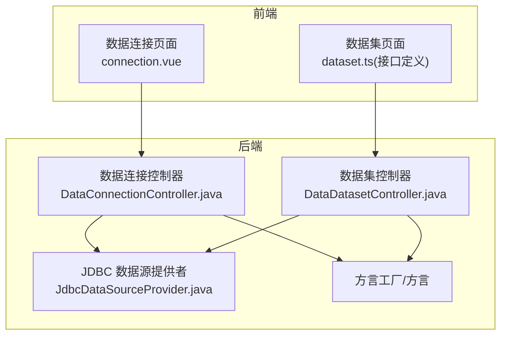
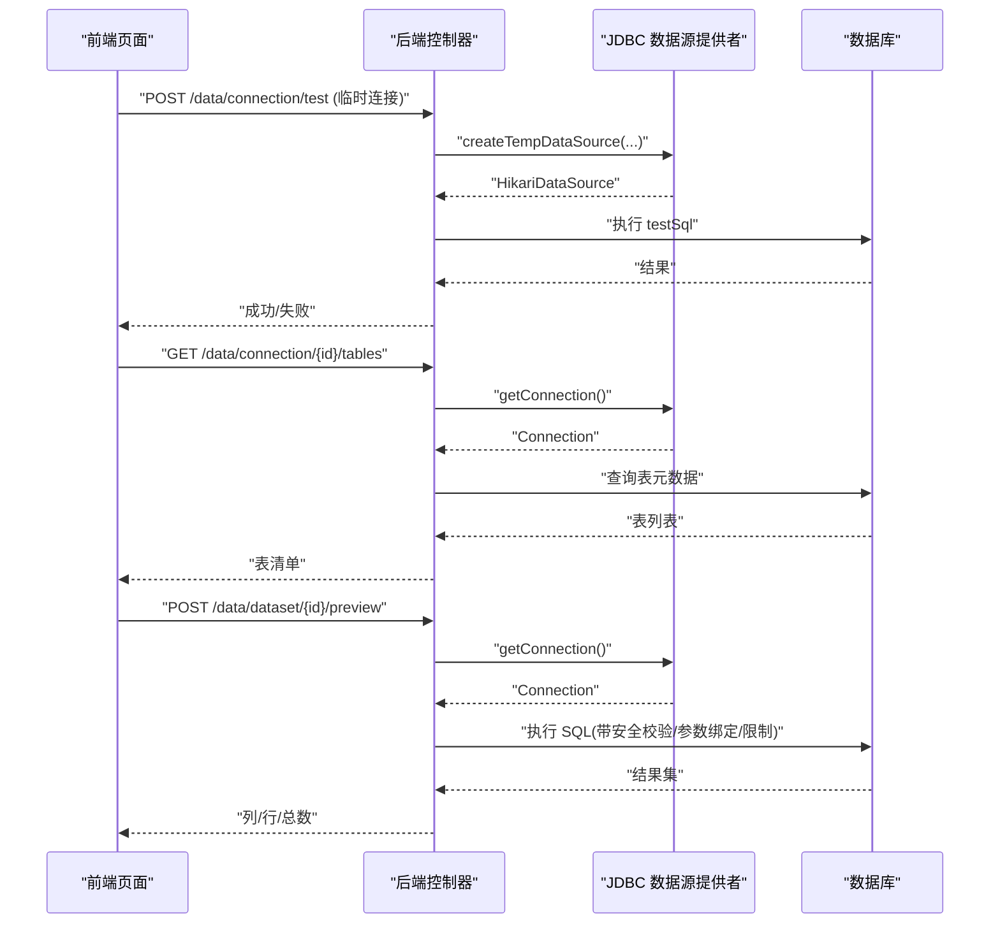
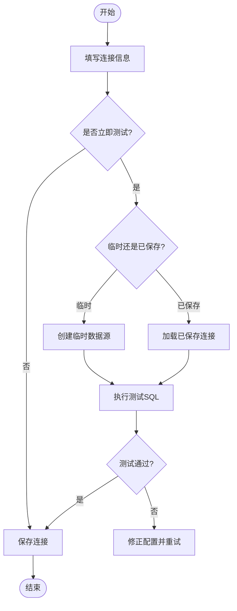
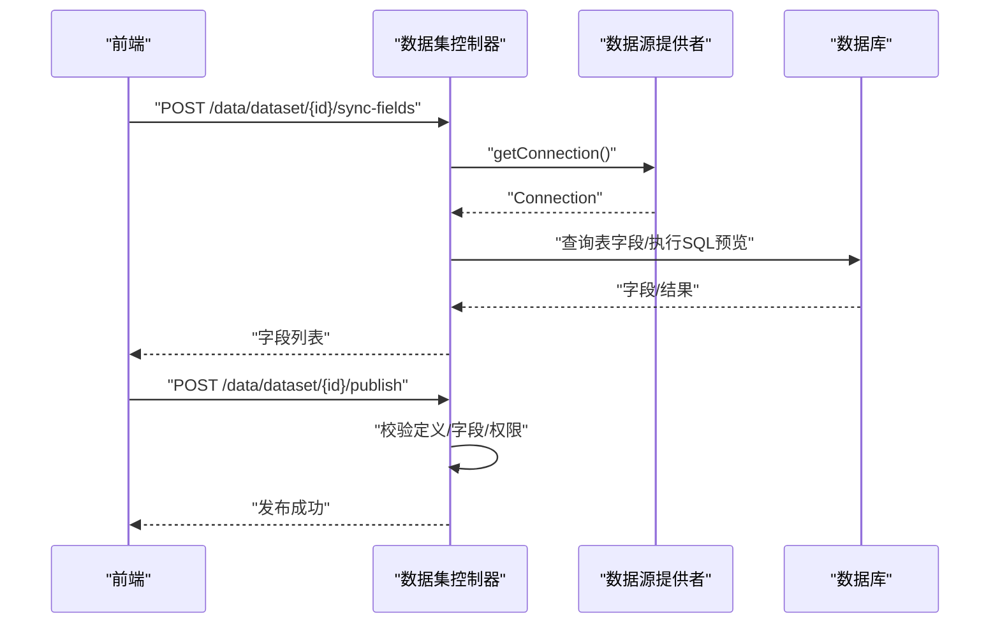
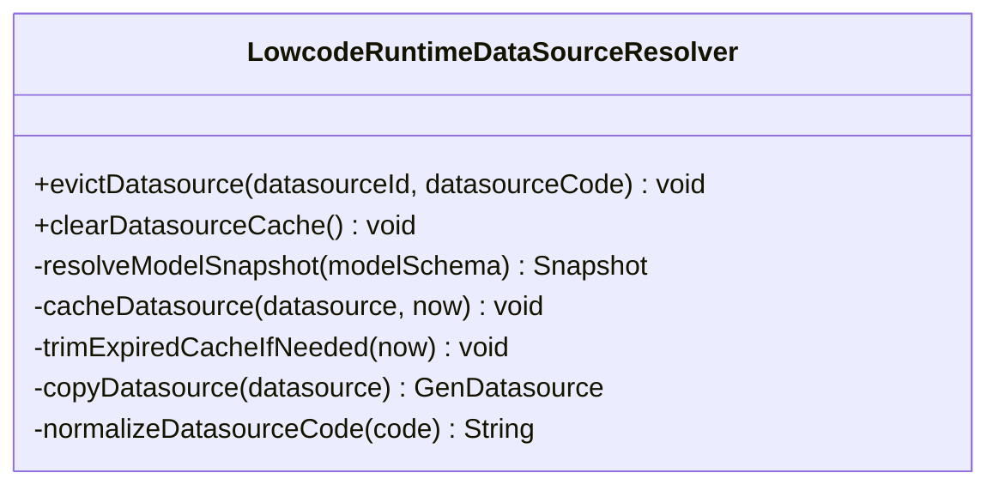
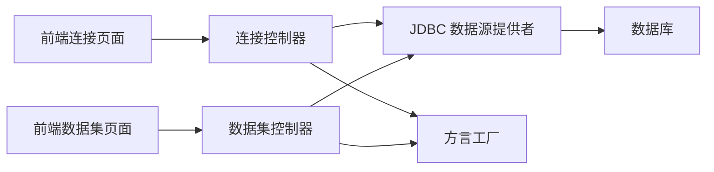

# 数据源配置

<cite>
**本文引用的文件**
- [connection.vue](file://forge-admin-ui/src/views/data/connection.vue)
- [connection.ts](file://forge-admin-ui/src/api/data/connection.ts)
- [dataset.ts](file://forge-admin-ui/src/api/data/dataset.ts)
- [DataConnectionController.java](file://forge-server/forge-framework/forge-plugin-parent/forge-plugin-data/src/main/java/com/mdframe/forge/plugin/data/controller/DataConnectionController.java)
- [DataDatasetController.java](file://forge-server/forge-framework/forge-plugin-parent/forge-plugin-data/src/main/java/com/mdframe/forge/plugin/data/controller/DataDatasetController.java)
- [JdbcDataSourceProvider.java](file://forge-server/forge-framework/forge-plugin-parent/forge-plugin-data/src/main/java/com/mdframe/forge/plugin/data/support/JdbcDataSourceProvider.java)
- [DataConnection.java](file://forge-server/forge-framework/forge-plugin-parent/forge-plugin-data/src/main/java/com/mdframe/forge/plugin/data/entity/DataConnection.java)
- [DataDataset.java](file://forge-server/forge-framework/forge-plugin-parent/forge-plugin-data/src/main/java/com/mdframe/forge/plugin/data/entity/DataDataset.java)
- [LowcodeRuntimeDataSourceResolver.java](file://forge-server/forge-framework/forge-plugin-parent/forge-plugin-generator/src/main/java/com/mdframe/forge/plugin/generator/service/lowcode/runtime/LowcodeRuntimeDataSourceResolver.java)
</cite>

## 目录
1. [简介](#简介)
2. [项目结构](#项目结构)
3. [核心组件](#核心组件)
4. [架构总览](#架构总览)
5. [详细组件分析](#详细组件分析)
6. [依赖关系分析](#依赖关系分析)
7. [性能考虑](#性能考虑)
8. [故障诊断指南](#故障诊断指南)
9. [结论](#结论)
10. [附录](#附录)

## 简介
本文件面向 Forge Admin 的数据源配置能力，系统性说明支持的数据源类型、连接配置、数据集管理、查询构建与预览、发布流程，以及安全与性能最佳实践。内容覆盖数据库连接配置、API 接口对接、文件数据导入（通过 SQL 数据集承载）、实时数据流处理（通过参数化 SQL 与运行时查询）等场景，并提供创建、编辑、测试、发布数据集的完整操作指引与排障方法。

## 项目结构
前端以 Vue 页面组织数据连接与数据集的增删改查、预览与发布；后端以 Spring Boot 控制器暴露 REST API，结合 JDBC 数据源提供者与方言工厂实现跨库表/字段探测、SQL 执行与安全校验。

图表来源
- [connection.vue:1-800](file://forge-admin-ui/src/views/data/connection.vue#L1-L800)
- [dataset.ts:1-219](file://forge-admin-ui/src/api/data/dataset.ts#L1-L219)
- [DataConnectionController.java:1-352](file://forge-server/forge-framework/forge-plugin-parent/forge-plugin-data/src/main/java/com/mdframe/forge/plugin/data/controller/DataConnectionController.java#L1-L352)
- [DataDatasetController.java:1-681](file://forge-server/forge-framework/forge-plugin-parent/forge-plugin-data/src/main/java/com/mdframe/forge/plugin/data/controller/DataDatasetController.java#L1-L681)
- [JdbcDataSourceProvider.java:36-69](file://forge-server/forge-framework/forge-plugin-parent/forge-plugin-data/src/main/java/com/mdframe/forge/plugin/data/support/JdbcDataSourceProvider.java#L36-L69)

章节来源
- [connection.vue:1-800](file://forge-admin-ui/src/views/data/connection.vue#L1-L800)
- [dataset.ts:1-219](file://forge-admin-ui/src/api/data/dataset.ts#L1-L219)
- [DataConnectionController.java:1-352](file://forge-server/forge-framework/forge-plugin-parent/forge-plugin-data/src/main/java/com/mdframe/forge/plugin/data/controller/DataConnectionController.java#L1-L352)
- [DataDatasetController.java:1-681](file://forge-server/forge-framework/forge-plugin-parent/forge-plugin-data/src/main/java/com/mdframe/forge/plugin/data/controller/DataDatasetController.java#L1-L681)

## 核心组件
- 数据连接
  - 前端：列表、新增/编辑表单、即时测试、表清单与字段查看。
  - 后端：连接 CRUD、临时连接测试、表/字段元数据查询、敏感信息脱敏。
- 数据集
  - 前端：分页、详情、字段同步、预览、发布/下架、分类管理、运行时查询。
  - 后端：数据集 CRUD、字段映射、SQL 安全校验、参数绑定、预览执行、发布状态控制。
- 数据源提供者
  - 基于 HikariCP 的连接池管理与临时数据源创建，支持连接复用与关闭。
- 低代码运行时解析
  - 按模型快照解析运行期数据源，提供缓存与失效策略。

章节来源
- [connection.vue:1-800](file://forge-admin-ui/src/views/data/connection.vue#L1-L800)
- [dataset.ts:1-219](file://forge-admin-ui/src/api/data/dataset.ts#L1-L219)
- [DataConnectionController.java:1-352](file://forge-server/forge-framework/forge-plugin-parent/forge-plugin-data/src/main/java/com/mdframe/forge/plugin/data/controller/DataConnectionController.java#L1-L352)
- [DataDatasetController.java:1-681](file://forge-server/forge-framework/forge-plugin-parent/forge-plugin-data/src/main/java/com/mdframe/forge/plugin/data/controller/DataDatasetController.java#L1-L681)
- [JdbcDataSourceProvider.java:36-69](file://forge-server/forge-framework/forge-plugin-parent/forge-plugin-data/src/main/java/com/mdframe/forge/plugin/data/support/JdbcDataSourceProvider.java#L36-L69)
- [LowcodeRuntimeDataSourceResolver.java:129-271](file://forge-server/forge-framework/forge-plugin-parent/forge-plugin-generator/src/main/java/com/mdframe/forge/plugin/generator/service/lowcode/runtime/LowcodeRuntimeDataSourceResolver.java#L129-L271)

## 架构总览
下图展示从前端到后端的请求链路，包括连接测试、表/字段探测、数据集预览与发布。

图表来源
- [connection.vue:680-720](file://forge-admin-ui/src/views/data/connection.vue#L680-L720)
- [connection.ts:61-91](file://forge-admin-ui/src/api/data/connection.ts#L61-L91)
- [DataConnectionController.java:102-158](file://forge-server/forge-framework/forge-plugin-parent/forge-plugin-data/src/main/java/com/mdframe/forge/plugin/data/controller/DataConnectionController.java#L102-L158)
- [DataDatasetController.java:222-249](file://forge-server/forge-framework/forge-plugin-parent/forge-plugin-data/src/main/java/com/mdframe/forge/plugin/data/controller/DataDatasetController.java#L222-L249)
- [JdbcDataSourceProvider.java:36-69](file://forge-server/forge-framework/forge-plugin-parent/forge-plugin-data/src/main/java/com/mdframe/forge/plugin/data/support/JdbcDataSourceProvider.java#L36-L69)

## 详细组件分析

### 数据连接（Database Connection）
- 功能要点
  - 连接资产登记：编码、名称、数据库类型、驱动类名、JDBC URL、用户名、密码、模式名、测试 SQL、描述。
  - 连接测试：支持“已保存连接”和“临时连接”两种测试方式。
  - 表/字段探测：按连接获取表清单与字段元数据，便于后续选择或编写 SQL。
  - 安全与治理：返回时屏蔽敏感信息（如密码），删除前检查是否被数据集引用。
- 关键流程
  - 新增/编辑：前端提交表单，后端校验必填项并持久化；编辑时若修改连接会关闭旧数据源实例。
  - 测试连接：临时连接使用传入参数创建临时数据源；已保存连接读取存储的凭证执行测试 SQL。
  - 表/字段查询：根据数据库类型选择方言生成元数据查询语句，返回表名、类型、注释及字段信息。
- 前端交互
  - 列表页支持搜索、筛选、批量操作；行级“测试连接”具备并发 loading 控制。
  - 表单内嵌“即时测试”，草稿模式下需填写密码方可测试。
- 后端实现
  - 控制器负责参数校验、权限与状态检查、调用数据源提供者执行测试与元数据查询。
  - 数据源提供者封装 Hikari 配置与连接生命周期管理。

图表来源
- [connection.vue:680-720](file://forge-admin-ui/src/views/data/connection.vue#L680-L720)
- [DataConnectionController.java:102-158](file://forge-server/forge-framework/forge-plugin-parent/forge-plugin-data/src/main/java/com/mdframe/forge/plugin/data/controller/DataConnectionController.java#L102-L158)
- [JdbcDataSourceProvider.java:36-69](file://forge-server/forge-framework/forge-plugin-parent/forge-plugin-data/src/main/java/com/mdframe/forge/plugin/data/support/JdbcDataSourceProvider.java#L36-L69)

章节来源
- [connection.vue:1-800](file://forge-admin-ui/src/views/data/connection.vue#L1-L800)
- [connection.ts:61-91](file://forge-admin-ui/src/api/data/connection.ts#L61-L91)
- [DataConnectionController.java:1-352](file://forge-server/forge-framework/forge-plugin-parent/forge-plugin-data/src/main/java/com/mdframe/forge/plugin/data/controller/DataConnectionController.java#L1-L352)
- [JdbcDataSourceProvider.java:36-69](file://forge-server/forge-framework/forge-plugin-parent/forge-plugin-data/src/main/java/com/mdframe/forge/plugin/data/support/JdbcDataSourceProvider.java#L36-L69)
- [DataConnection.java:1-47](file://forge-server/forge-framework/forge-plugin-parent/forge-plugin-data/src/main/java/com/mdframe/forge/plugin/data/entity/DataConnection.java#L1-L47)

### 数据集（Dataset）
- 功能要点
  - 类型：表型（TABLE）与 SQL 型（SQL）。
  - 字段管理：自动同步表字段或基于 SQL 首行推断；支持字段角色、聚合、显示/查询开关、敏感级别与脱敏规则。
  - 预览与发布：预览限制行数；发布前校验定义完整性与 SQL 安全性；发布后可供运行时查询。
  - 分类与权限：支持分类树、访问模式（公开/私有）与行列级范围控制。
- 关键流程
  - 创建/编辑：校验连接启用状态、类型约束、SQL 安全与参数 Schema。
  - 同步字段：表型直接拉取字段；SQL 型通过预览首行推断。
  - 预览：表型构造 SELECT * + LIMIT；SQL 型包装为子查询并限制行数，同时做参数绑定与安全校验。
  - 发布/下架：状态机控制，发布前确保字段存在且可用。
- 前端交互
  - 列表/详情/分类管理；字段编辑界面；预览弹窗；发布/下架按钮。
  - 运行时查询接口用于外部系统消费。
- 后端实现
  - 控制器统一入口，服务层完成实体转换、权限校验、字段映射、SQL 执行与结果组装。
  - 安全：SQL 安全校验器与参数绑定器防止注入与全表扫描风险。

图表来源
- [DataDatasetController.java:197-249](file://forge-server/forge-framework/forge-plugin-parent/forge-plugin-data/src/main/java/com/mdframe/forge/plugin/data/controller/DataDatasetController.java#L197-L249)
- [DataDatasetController.java:424-500](file://forge-server/forge-framework/forge-plugin-parent/forge-plugin-data/src/main/java/com/mdframe/forge/plugin/data/controller/DataDatasetController.java#L424-L500)
- [dataset.ts:138-219](file://forge-admin-ui/src/api/data/dataset.ts#L138-L219)

章节来源
- [DataDatasetController.java:1-681](file://forge-server/forge-framework/forge-plugin-parent/forge-plugin-data/src/main/java/com/mdframe/forge/plugin/data/controller/DataDatasetController.java#L1-L681)
- [dataset.ts:1-219](file://forge-admin-ui/src/api/data/dataset.ts#L1-L219)
- [DataDataset.java:1-69](file://forge-server/forge-framework/forge-plugin-parent/forge-plugin-data/src/main/java/com/mdframe/forge/plugin/data/entity/DataDataset.java#L1-L69)

### 低代码运行时数据源解析
- 作用：在低代码应用运行时，根据模型快照解析出实际使用的数据源（按 ID 或编码），并提供缓存与失效机制，提升查询性能与一致性。
- 关键点：按模型中的 sourceTable 或 runtimeDatasource 确定目标数据源；支持按 code 与 id 双键缓存；过期清理与显式驱逐。

图表来源
- [LowcodeRuntimeDataSourceResolver.java:129-271](file://forge-server/forge-framework/forge-plugin-parent/forge-plugin-generator/src/main/java/com/mdframe/forge/plugin/generator/service/lowcode/runtime/LowcodeRuntimeDataSourceResolver.java#L129-L271)

章节来源
- [LowcodeRuntimeDataSourceResolver.java:129-271](file://forge-server/forge-framework/forge-plugin-parent/forge-plugin-generator/src/main/java/com/mdframe/forge/plugin/generator/service/lowcode/runtime/LowcodeRuntimeDataSourceResolver.java#L129-L271)

## 依赖关系分析
- 前端依赖
  - 连接页面依赖连接 API（列表、详情、新增、更新、删除、测试、表/字段查询）。
  - 数据集页面依赖数据集 API（分页、详情、CRUD、发布/下架、字段同步、预览、分类、运行时查询）。
- 后端依赖
  - 控制器依赖服务层与数据源提供者；数据源提供者依赖 HikariCP 与数据库驱动；SQL 执行依赖方言工厂。
- 实体与配置
  - DataConnection/DataDataset 实体映射数据库表；连接池配置由提供者内部默认值与可选扩展组成。

图表来源
- [connection.vue:1-800](file://forge-admin-ui/src/views/data/connection.vue#L1-L800)
- [dataset.ts:1-219](file://forge-admin-ui/src/api/data/dataset.ts#L1-L219)
- [DataConnectionController.java:1-352](file://forge-server/forge-framework/forge-plugin-parent/forge-plugin-data/src/main/java/com/mdframe/forge/plugin/data/controller/DataConnectionController.java#L1-L352)
- [DataDatasetController.java:1-681](file://forge-server/forge-framework/forge-plugin-parent/forge-plugin-data/src/main/java/com/mdframe/forge/plugin/data/controller/DataDatasetController.java#L1-L681)
- [JdbcDataSourceProvider.java:36-69](file://forge-server/forge-framework/forge-plugin-parent/forge-plugin-data/src/main/java/com/mdframe/forge/plugin/data/support/JdbcDataSourceProvider.java#L36-L69)

章节来源
- [connection.vue:1-800](file://forge-admin-ui/src/views/data/connection.vue#L1-L800)
- [dataset.ts:1-219](file://forge-admin-ui/src/api/data/dataset.ts#L1-L219)
- [DataConnectionController.java:1-352](file://forge-server/forge-framework/forge-plugin-parent/forge-plugin-data/src/main/java/com/mdframe/forge/plugin/data/controller/DataConnectionController.java#L1-L352)
- [DataDatasetController.java:1-681](file://forge-server/forge-framework/forge-plugin-parent/forge-plugin-data/src/main/java/com/mdframe/forge/plugin/data/controller/DataDatasetController.java#L1-L681)
- [JdbcDataSourceProvider.java:36-69](file://forge-server/forge-framework/forge-plugin-parent/forge-plugin-data/src/main/java/com/mdframe/forge/plugin/data/support/JdbcDataSourceProvider.java#L36-L69)

## 性能考虑
- 连接池
  - 默认最大连接数、空闲超时、连接超时与生命周期由提供者内置；建议在高并发场景评估并调整池大小与超时参数。
- 查询限制
  - 预览与运行时查询均限制最大返回行数，避免大结果集拖垮系统。
- 安全与开销
  - SQL 安全校验与参数绑定减少注入风险与无效扫描；建议在 SQL 数据集上添加必要索引与条件。
- 缓存
  - 低代码运行时对数据源解析进行缓存，降低重复解析成本；必要时可显式驱逐或清空缓存。
- 资源释放
  - 每次测试/查询均严格关闭连接与语句；编辑或删除连接时会主动关闭对应数据源，避免资源泄漏。

[本节为通用性能指导，不直接分析具体文件]

## 故障诊断指南
- 连接测试失败
  - 检查数据库类型、驱动类名、JDBC URL、用户名与密码是否正确。
  - 确认网络可达与防火墙策略；核对测试 SQL 是否合法。
  - 临时连接测试需填写密码；已保存连接测试将读取存储凭证。
- 表/字段无法加载
  - 确认连接处于启用状态；检查 schemaName 是否与 JDBC URL 中数据库一致。
  - 不同数据库方言可能要求特定权限或视图访问。
- 数据集预览失败
  - SQL 安全校验未通过：移除危险关键字或使用允许的参数化写法。
  - 参数绑定错误：检查参数 Schema 与实际传入参数是否匹配。
  - 结果过大：调小 maxRows 或增加过滤条件。
- 发布失败
  - 未发布的数据集不可用；发布前需确保字段存在（表型自动同步，SQL 型通过预览推断）。
  - 私有数据集需具备管理权限才能发布。
- 运行时查询异常
  - 检查数据集状态为启用且已发布；确认运行时参数格式正确。
  - 关注日志中的 SQL 执行与参数绑定信息，定位具体错误。

章节来源
- [DataConnectionController.java:102-158](file://forge-server/forge-framework/forge-plugin-parent/forge-plugin-data/src/main/java/com/mdframe/forge/plugin/data/controller/DataConnectionController.java#L102-L158)
- [DataDatasetController.java:222-249](file://forge-server/forge-framework/forge-plugin-parent/forge-plugin-data/src/main/java/com/mdframe/forge/plugin/data/controller/DataDatasetController.java#L222-L249)
- [DataDatasetController.java:502-615](file://forge-server/forge-framework/forge-plugin-parent/forge-plugin-data/src/main/java/com/mdframe/forge/plugin/data/controller/DataDatasetController.java#L502-L615)

## 结论
Forge Admin 的数据源配置提供了完善的数据库连接管理、数据集建模与发布能力，并通过安全校验、参数绑定与连接池优化保障稳定性与性能。借助统一的 API 与可视化界面，用户可快速完成从连接配置到数据集发布的端到端流程，并在运行时安全高效地消费数据。

[本节为总结性内容，不直接分析具体文件]

## 附录

### 支持的数据库类型与驱动
- MySQL：驱动类名 com.mysql.cj.jdbc.Driver
- Oracle：驱动类名 oracle.jdbc.OracleDriver
- PostgreSQL：驱动类名 org.postgresql.Driver
- SQL Server：驱动类名 com.microsoft.sqlserver.jdbc.SQLServerDriver

章节来源
- [connection.vue:251-256](file://forge-admin-ui/src/views/data/connection.vue#L251-L256)

### 数据集字段映射与类型推断
- 表型数据集：自动拉取字段元数据，数值类型标记为度量，其他为维度。
- SQL 型数据集：基于预览首行推断字段类型与角色，支持手动调整。

章节来源
- [DataDatasetController.java:424-500](file://forge-server/forge-framework/forge-plugin-parent/forge-plugin-data/src/main/java/com/mdframe/forge/plugin/data/controller/DataDatasetController.java#L424-L500)

### 运行时查询与预览
- 预览：限制行数，返回列名与数据行。
- 运行时查询：对外暴露查询接口，支持参数与字段裁剪。

章节来源
- [dataset.ts:192-219](file://forge-admin-ui/src/api/data/dataset.ts#L192-L219)
- [DataDatasetController.java:222-249](file://forge-server/forge-framework/forge-plugin-parent/forge-plugin-data/src/main/java/com/mdframe/forge/plugin/data/controller/DataDatasetController.java#L222-L249)

### 安全与治理
- 敏感信息脱敏：返回连接信息时对密码等敏感字段进行遮蔽。
- SQL 安全：执行前进行安全校验，禁止危险操作。
- 访问控制：数据集支持公开/私有模式，私有需管理权限。

章节来源
- [DataConnectionController.java:181-212](file://forge-server/forge-framework/forge-plugin-parent/forge-plugin-data/src/main/java/com/mdframe/forge/plugin/data/controller/DataConnectionController.java#L181-L212)
- [DataDatasetController.java:270-314](file://forge-server/forge-framework/forge-plugin-parent/forge-plugin-data/src/main/java/com/mdframe/forge/plugin/data/controller/DataDatasetController.java#L270-L314)