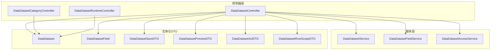
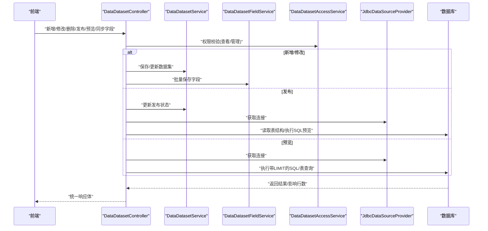
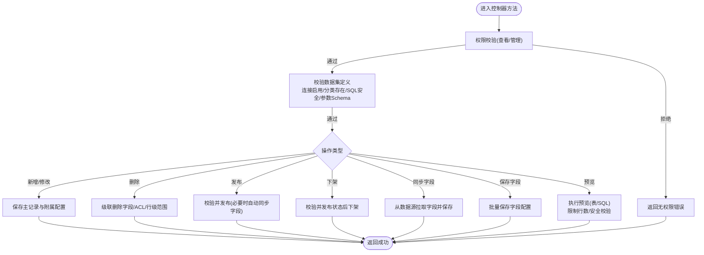
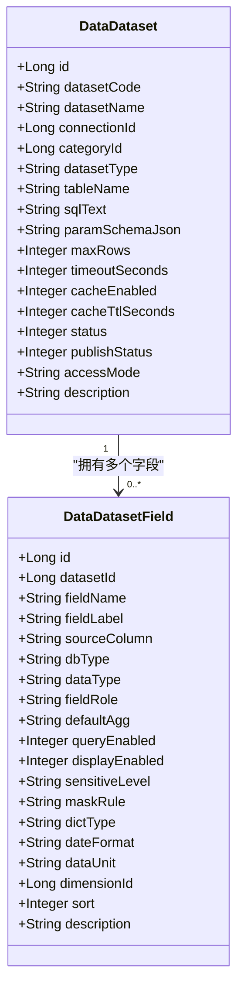
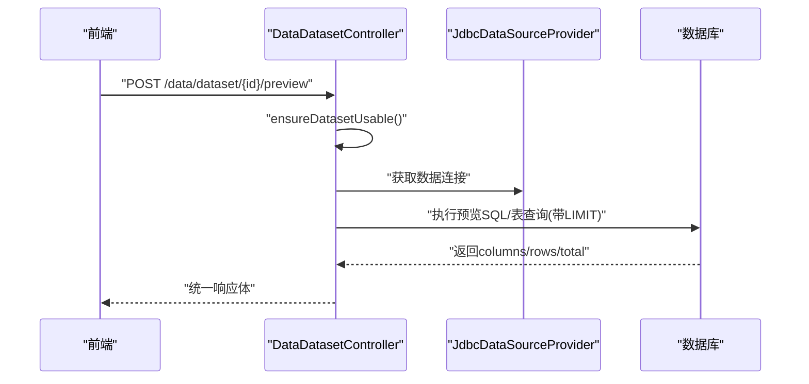
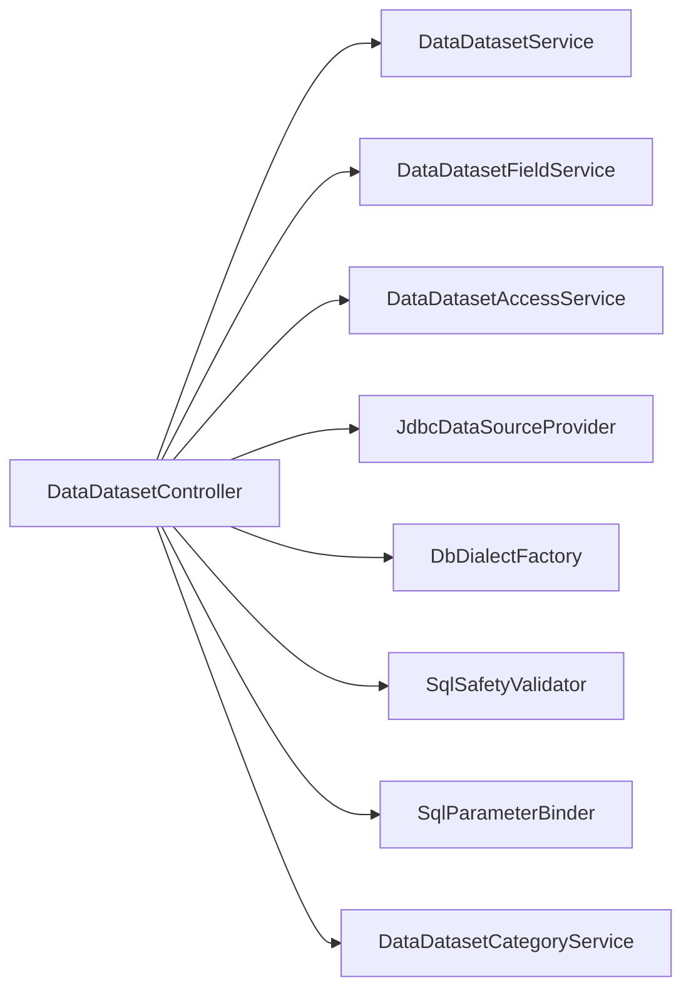
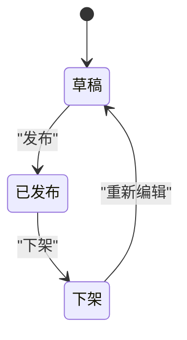

# 数据集管理

<cite>
**本文引用的文件**
- [DataDatasetController.java](file://forge-server/forge-framework/forge-plugin-parent/forge-plugin-data/src/main/java/com/mdframe/forge/plugin/data/controller/DataDatasetController.java)
- [DataDatasetService.java](file://forge-server/forge-framework/forge-plugin-parent/forge-plugin-data/src/main/java/com/mdframe/forge/plugin/data/service/DataDatasetService.java)
- [DataDatasetFieldService.java](file://forge-server/forge-framework/forge-plugin-parent/forge-plugin-data/src/main/java/com/mdframe/forge/plugin/data/service/DataDatasetFieldService.java)
- [DataDataset.java](file://forge-server/forge-framework/forge-plugin-parent/forge-plugin-data/src/main/java/com/mdframe/forge/plugin/data/entity/DataDataset.java)
- [DataDatasetField.java](file://forge-server/forge-framework/forge-plugin-parent/forge-plugin-data/src/main/java/com/mdframe/forge/plugin/data/entity/DataDatasetField.java)
- [DataDatasetAclDTO.java](file://forge-server/forge-framework/forge-plugin-parent/forge-plugin-data/src/main/java/com/mdframe/forge/plugin/data/dto/DataDatasetAclDTO.java)
- [DataDatasetSaveDTO.java](file://forge-server/forge-framework/forge-plugin-parent/forge-plugin-data/src/main/java/com/mdframe/forge/plugin/data/dto/DataDatasetSaveDTO.java)
- [DataDatasetPreviewDTO.java](file://forge-server/forge-framework/forge-plugin-parent/forge-plugin-data/src/main/java/com/mdframe/forge/plugin/data/dto/DataDatasetPreviewDTO.java)
- [DataBusinessDatasetDTO.java](file://forge-server/forge-framework/forge-plugin-parent/forge-plugin-data/src/main/java/com/mdframe/forge/plugin/data/dto/DataBusinessDatasetDTO.java)
- [DataDatasetQueryDTO.java](file://forge-server/forge-framework/forge-plugin-parent/forge-plugin-data/src/main/java/com/mdframe/forge/plugin/data/dto/DataDatasetQueryDTO.java)
- [DataDatasetRowScopeDTO.java](file://forge-server/forge-framework/forge-plugin-parent/forge-plugin-data/src/main/java/com/mdframe/forge/plugin/data/dto/DataDatasetRowScopeDTO.java)
- [DataDatasetAccessService.java](file://forge-server/forge-framework/forge-plugin-parent/forge-plugin-data/src/main/java/com/mdframe/forge/plugin/data/service/DataDatasetAccessService.java)
- [DataDatasetCategoryController.java](file://forge-server/forge-framework/forge-plugin-parent/forge-plugin-data/src/main/java/com/mdframe/forge/plugin/data/controller/DataDatasetCategoryController.java)
- [DataDatasetRuntimeController.java](file://forge-server/forge-framework/forge-plugin-parent/forge-plugin-data/src/main/java/com/mdframe/forge/plugin/data/controller/DataDatasetRuntimeController.java)
</cite>

## 目录
1. [简介](#简介)
2. [项目结构](#项目结构)
3. [核心组件](#核心组件)
4. [架构总览](#架构总览)
5. [详细组件分析](#详细组件分析)
6. [依赖关系分析](#依赖关系分析)
7. [性能与缓存](#性能与缓存)
8. [测试验证](#测试验证)
9. [版本管理与发布流程](#版本管理与发布流程)
10. [权限控制](#权限控制)
11. [监控告警与故障排查](#监控告警与故障排查)
12. [结论](#结论)

## 简介
本章节面向Forge Admin的数据集管理能力，围绕数据集的创建、编辑、删除、复制（通过保存字段配置与同步字段实现）、字段定义与类型映射、计算字段与关联关系、预览测试、发布与下架、权限控制、性能优化与缓存策略、监控告警与故障排查进行系统化说明。文档以代码为依据，提供可追溯的文件路径与行号引用，帮助读者快速定位实现细节。

## 项目结构
数据集管理位于数据插件模块中，核心由控制器、服务接口、实体与DTO组成：
- 控制器：对外暴露数据集CRUD、预览、发布/下架、字段同步与保存等API
- 服务：封装分页查询、按连接ID列表、按编码获取、发布状态更新、字段批量操作等能力
- 实体：数据集主表与字段明细表，承载元数据与运行时配置
- DTO：用于入参校验、预览参数、访问控制、行级范围等

图表来源
- [DataDatasetController.java:53-72](file://forge-server/forge-framework/forge-plugin-parent/forge-plugin-data/src/main/java/com/mdframe/forge/plugin/data/controller/DataDatasetController.java#L53-L72)
- [DataDatasetService.java:9-19](file://forge-server/forge-framework/forge-plugin-parent/forge-plugin-data/src/main/java/com/mdframe/forge/plugin/data/service/DataDatasetService.java#L9-L19)
- [DataDatasetFieldService.java:8-15](file://forge-server/forge-framework/forge-plugin-parent/forge-plugin-data/src/main/java/com/mdframe/forge/plugin/data/service/DataDatasetFieldService.java#L8-L15)
- [DataDataset.java:10-68](file://forge-server/forge-framework/forge-plugin-parent/forge-plugin-data/src/main/java/com/mdframe/forge/plugin/data/entity/DataDataset.java#L10-L68)
- [DataDatasetField.java:10-55](file://forge-server/forge-framework/forge-plugin-parent/forge-plugin-data/src/main/java/com/mdframe/forge/plugin/data/entity/DataDatasetField.java#L10-L55)

章节来源
- [DataDatasetController.java:53-72](file://forge-server/forge-framework/forge-plugin-parent/forge-plugin-data/src/main/java/com/mdframe/forge/plugin/data/controller/DataDatasetController.java#L53-L72)
- [DataDatasetService.java:9-19](file://forge-server/forge-framework/forge-plugin-parent/forge-plugin-data/src/main/java/com/mdframe/forge/plugin/data/service/DataDatasetService.java#L9-L19)
- [DataDatasetFieldService.java:8-15](file://forge-server/forge-framework/forge-plugin-parent/forge-plugin-data/src/main/java/com/mdframe/forge/plugin/data/service/DataDatasetFieldService.java#L8-L15)
- [DataDataset.java:10-68](file://forge-server/forge-framework/forge-plugin-parent/forge-plugin-data/src/main/java/com/mdframe/forge/plugin/data/entity/DataDataset.java#L10-L68)
- [DataDatasetField.java:10-55](file://forge-server/forge-framework/forge-plugin-parent/forge-plugin-data/src/main/java/com/mdframe/forge/plugin/data/entity/DataDatasetField.java#L10-L55)

## 核心组件
- 数据集控制器：提供分页、列表、详情、新增、修改、删除、发布、下架、同步字段、保存字段、预览SQL/表等能力，并集成安全校验、参数绑定、方言适配与结果转换。
- 数据集服务：提供分页查询、按连接ID列表、按编码获取、发布状态更新等。
- 字段服务：提供按数据集ID查询、批量保存、按数据集ID删除等。
- 实体模型：数据集主表包含编码、名称、连接、分类、类型、表名或SQL、参数Schema、排序、最大行数、超时、缓存开关与TTL、状态、发布状态、访问模式、描述等；字段表包含字段名、标签、源列、数据库类型、数据类型、角色、聚合、查询/显示开关、敏感级别、脱敏规则、字典、日期格式、单位、维度、排序、描述等。
- DTO：保存、预览、ACL、行级范围、业务数据集、查询等。

章节来源
- [DataDatasetController.java:74-249](file://forge-server/forge-framework/forge-plugin-parent/forge-plugin-data/src/main/java/com/mdframe/forge/plugin/data/controller/DataDatasetController.java#L74-L249)
- [DataDatasetService.java:9-19](file://forge-server/forge-framework/forge-plugin-parent/forge-plugin-data/src/main/java/com/mdframe/forge/plugin/data/service/DataDatasetService.java#L9-L19)
- [DataDatasetFieldService.java:8-15](file://forge-server/forge-framework/forge-plugin-parent/forge-plugin-data/src/main/java/com/mdframe/forge/plugin/data/service/DataDatasetFieldService.java#L8-L15)
- [DataDataset.java:10-68](file://forge-server/forge-framework/forge-plugin-parent/forge-plugin-data/src/main/java/com/mdframe/forge/plugin/data/entity/DataDataset.java#L10-L68)
- [DataDatasetField.java:10-55](file://forge-server/forge-framework/forge-plugin-parent/forge-plugin-data/src/main/java/com/mdframe/forge/plugin/data/entity/DataDatasetField.java#L10-L55)

## 架构总览
下图展示从前端到后端的核心调用链：控制器接收请求，执行校验与权限检查，调用服务完成持久化或查询，必要时通过数据源提供者与方言构建SQL执行预览或字段同步。

图表来源
- [DataDatasetController.java:105-249](file://forge-server/forge-framework/forge-plugin-parent/forge-plugin-data/src/main/java/com/mdframe/forge/plugin/data/controller/DataDatasetController.java#L105-L249)
- [DataDatasetService.java:9-19](file://forge-server/forge-framework/forge-plugin-parent/forge-plugin-data/src/main/java/com/mdframe/forge/plugin/data/service/DataDatasetService.java#L9-L19)
- [DataDatasetFieldService.java:8-15](file://forge-server/forge-framework/forge-plugin-parent/forge-plugin-data/src/main/java/com/mdframe/forge/plugin/data/service/DataDatasetFieldService.java#L8-L15)
- [DataDatasetAccessService.java:12-12](file://forge-server/forge-framework/forge-plugin-parent/forge-plugin-data/src/main/java/com/mdframe/forge/plugin/data/service/DataDatasetAccessService.java#L12-L12)

## 详细组件分析

### 数据集控制器（CRUD与生命周期）
- 分页与列表：支持按名称、连接、分类、类型、状态、发布状态过滤。
- 详情：组装数据集、连接、分类、字段信息，并在具备管理权限时返回ACL与行级范围。
- 新增：校验数据集定义（编码、名称、连接、分类、类型、表名或SQL、参数Schema），设置草稿状态，保存后写入ACL、行级范围与字段。
- 修改：校验可编辑性（已发布不可直接修改），更新主记录与附属配置。
- 删除：级联删除字段、ACL、行级范围后删除数据集。
- 发布：若未配置字段则自动从数据源提取并保存；更新为已发布。
- 下架：仅允许对已发布数据集执行。
- 同步字段：根据数据集类型从数据源拉取字段并覆盖保存。
- 保存字段：将前端字段配置持久化。
- 预览：支持表与SQL两种模式，限制最大行数，使用安全校验与参数绑定。

图表来源
- [DataDatasetController.java:74-249](file://forge-server/forge-framework/forge-plugin-parent/forge-plugin-data/src/main/java/com/mdframe/forge/plugin/data/controller/DataDatasetController.java#L74-L249)

章节来源
- [DataDatasetController.java:74-249](file://forge-server/forge-framework/forge-plugin-parent/forge-plugin-data/src/main/java/com/mdframe/forge/plugin/data/controller/DataDatasetController.java#L74-L249)

### 字段定义与数据类型映射
- 字段属性：字段名、标签、源列、数据库类型、数据类型、角色（维度/度量）、默认聚合、查询/显示开关、敏感级别、脱敏规则、字典、日期格式、单位、维度、排序、描述。
- 类型映射：
  - 表类型：基于数据库列类型映射为NUMBER/DATE/DATETIME/BOOLEAN/STRING，并根据数值类型设定角色为度量，否则维度。
  - SQL类型：基于首行值推断数据类型与角色。
- 字段同步：表类型通过数据字典查询列信息；SQL类型通过执行预览获取首行推断。

图表来源
- [DataDataset.java:10-68](file://forge-server/forge-framework/forge-plugin-parent/forge-plugin-data/src/main/java/com/mdframe/forge/plugin/data/entity/DataDataset.java#L10-L68)
- [DataDatasetField.java:10-55](file://forge-server/forge-framework/forge-plugin-parent/forge-plugin-data/src/main/java/com/mdframe/forge/plugin/data/entity/DataDatasetField.java#L10-L55)

章节来源
- [DataDatasetController.java:401-465](file://forge-server/forge-framework/forge-plugin-parent/forge-plugin-data/src/main/java/com/mdframe/forge/plugin/data/controller/DataDatasetController.java#L401-L465)
- [DataDatasetField.java:10-55](file://forge-server/forge-framework/forge-plugin-parent/forge-plugin-data/src/main/java/com/mdframe/forge/plugin/data/entity/DataDatasetField.java#L10-L55)

### 计算字段与关联关系配置
- 计算字段：可通过SQL数据集在查询中定义计算列，或通过字段配置的“默认聚合”与“角色”在可视化层进行计算与展示。
- 关联关系：当前模型以单数据集为主，关联关系通常通过SQL JOIN或上层应用建模实现；如需跨数据集关联，可在SQL中表达并通过字段映射输出。

章节来源
- [DataDatasetController.java:424-465](file://forge-server/forge-framework/forge-plugin-parent/forge-plugin-data/src/main/java/com/mdframe/forge/plugin/data/controller/DataDatasetController.java#L424-L465)

### 预览与测试验证
- 预览表：构造SELECT *并追加LIMIT，限制最大行数，避免全表扫描。
- 预览SQL：包裹为子查询并追加LIMIT，执行前进行SQL安全校验与参数绑定，防止注入与资源耗尽。
- 参数Schema：支持参数化查询，参数Schema在保存/发布前进行合法性校验。

图表来源
- [DataDatasetController.java:222-249](file://forge-server/forge-framework/forge-plugin-parent/forge-plugin-data/src/main/java/com/mdframe/forge/plugin/data/controller/DataDatasetController.java#L222-L249)
- [DataDatasetController.java:502-615](file://forge-server/forge-framework/forge-plugin-parent/forge-plugin-data/src/main/java/com/mdframe/forge/plugin/data/controller/DataDatasetController.java#L502-L615)

章节来源
- [DataDatasetController.java:222-249](file://forge-server/forge-framework/forge-plugin-parent/forge-plugin-data/src/main/java/com/mdframe/forge/plugin/data/controller/DataDatasetController.java#L222-L249)
- [DataDatasetController.java:502-615](file://forge-server/forge-framework/forge-plugin-parent/forge-plugin-data/src/main/java/com/mdframe/forge/plugin/data/controller/DataDatasetController.java#L502-L615)

### 复制与克隆
- 复制策略：通过新增数据集并传入相同连接、类型、表名或SQL、参数Schema与字段配置，即可实现逻辑复制。
- 字段复制：可使用“同步字段”或“保存字段配置”将现有字段结构复制到新数据集。

章节来源
- [DataDatasetController.java:105-148](file://forge-server/forge-framework/forge-plugin-parent/forge-plugin-data/src/main/java/com/mdframe/forge/plugin/data/controller/DataDatasetController.java#L105-L148)
- [DataDatasetController.java:197-220](file://forge-server/forge-framework/forge-plugin-parent/forge-plugin-data/src/main/java/com/mdframe/forge/plugin/data/controller/DataDatasetController.java#L197-L220)

## 依赖关系分析
- 控制器依赖服务接口与外部能力：
  - 数据源提供者：获取连接
  - 方言工厂：生成不同数据库的SQL片段（如LIMIT）
  - SQL安全校验器：防止危险SQL
  - 参数绑定器：将参数转换为预编译语句
  - 访问服务：权限与行级范围
  - 分类服务：分类存在性校验
- 服务接口定义了分页、列表、按编码获取、发布状态更新等能力，便于后续实现扩展。

图表来源
- [DataDatasetController.java:53-72](file://forge-server/forge-framework/forge-plugin-parent/forge-plugin-data/src/main/java/com/mdframe/forge/plugin/data/controller/DataDatasetController.java#L53-L72)
- [DataDatasetService.java:9-19](file://forge-server/forge-framework/forge-plugin-parent/forge-plugin-data/src/main/java/com/mdframe/forge/plugin/data/service/DataDatasetService.java#L9-L19)
- [DataDatasetFieldService.java:8-15](file://forge-server/forge-framework/forge-plugin-parent/forge-plugin-data/src/main/java/com/mdframe/forge/plugin/data/service/DataDatasetFieldService.java#L8-L15)
- [DataDatasetAccessService.java:12-12](file://forge-server/forge-framework/forge-plugin-parent/forge-plugin-data/src/main/java/com/mdframe/forge/plugin/data/service/DataDatasetAccessService.java#L12-L12)

章节来源
- [DataDatasetController.java:53-72](file://forge-server/forge-framework/forge-plugin-parent/forge-plugin-data/src/main/java/com/mdframe/forge/plugin/data/controller/DataDatasetController.java#L53-L72)
- [DataDatasetService.java:9-19](file://forge-server/forge-framework/forge-plugin-parent/forge-plugin-data/src/main/java/com/mdframe/forge/plugin/data/service/DataDatasetService.java#L9-L19)
- [DataDatasetFieldService.java:8-15](file://forge-server/forge-framework/forge-plugin-parent/forge-plugin-data/src/main/java/com/mdframe/forge/plugin/data/service/DataDatasetFieldService.java#L8-L15)
- [DataDatasetAccessService.java:12-12](file://forge-server/forge-framework/forge-plugin-parent/forge-plugin-data/src/main/java/com/mdframe/forge/plugin/data/service/DataDatasetAccessService.java#L12-L12)

## 性能与缓存
- 查询限制：预览与同步字段均限制最大行数，避免大结果集导致内存与网络压力。
- 超时控制：数据集支持超时秒数配置，防止长事务阻塞。
- 缓存策略：数据集支持缓存开关与TTL配置，适合读多写少场景提升性能。
- 安全执行：SQL执行前进行安全校验与参数绑定，降低注入风险与解析开销。
- 建议：
  - 合理设置maxRows与timeoutSeconds
  - 开启缓存并设置合适TTL
  - 对高频查询建立索引或物化视图
  - 使用分页与过滤条件减少扫描范围

章节来源
- [DataDatasetController.java:316-338](file://forge-server/forge-framework/forge-plugin-parent/forge-plugin-data/src/main/java/com/mdframe/forge/plugin/data/controller/DataDatasetController.java#L316-L338)
- [DataDatasetController.java:502-615](file://forge-server/forge-framework/forge-plugin-parent/forge-plugin-data/src/main/java/com/mdframe/forge/plugin/data/controller/DataDatasetController.java#L502-L615)

## 测试验证
- 预览SQL：通过专用接口预览SQL数据集，限制行数并返回列与数据，便于调试SQL与参数。
- 预览表：通过表数据集预览，限制行数并返回列与数据。
- 参数Schema：保存/发布前校验参数Schema合法性，确保运行时参数绑定正确。

章节来源
- [DataDatasetController.java:232-249](file://forge-server/forge-framework/forge-plugin-parent/forge-plugin-data/src/main/java/com/mdframe/forge/plugin/data/controller/DataDatasetController.java#L232-L249)
- [DataDatasetController.java:502-615](file://forge-server/forge-framework/forge-plugin-parent/forge-plugin-data/src/main/java/com/mdframe/forge/plugin/data/controller/DataDatasetController.java#L502-L615)

## 版本管理与发布流程
- 发布状态：支持草稿、已发布、下架三种状态。
- 发布流程：
  - 校验数据集定义与字段完整性
  - 若未配置字段，自动从数据源提取并保存
  - 更新发布状态为已发布
- 下架流程：仅允许对已发布数据集执行下架。
- 注意：已发布的数据集不可直接修改或删除，需先下架。

图表来源
- [DataDatasetController.java:163-195](file://forge-server/forge-framework/forge-plugin-parent/forge-plugin-data/src/main/java/com/mdframe/forge/plugin/data/controller/DataDatasetController.java#L163-L195)

章节来源
- [DataDatasetController.java:163-195](file://forge-server/forge-framework/forge-plugin-parent/forge-plugin-data/src/main/java/com/mdframe/forge/plugin/data/controller/DataDatasetController.java#L163-L195)

## 权限控制
- 访问模式：支持私有与共享模式，私有模式下需要管理权限才能修改/删除/发布等操作。
- 访问级别：查看、查询、管理等级别，不同操作要求不同级别。
- ACL与行级范围：支持为数据集配置访问控制列表与行级范围，精细化控制数据可见性。
- 校验点：
  - 查看详情：需要查看权限
  - 预览数据：需要查询权限
  - 修改/删除/发布/同步字段：需要管理权限（私有模式强制）

章节来源
- [DataDatasetController.java:95-103](file://forge-server/forge-framework/forge-plugin-parent/forge-plugin-data/src/main/java/com/mdframe/forge/plugin/data/controller/DataDatasetController.java#L95-L103)
- [DataDatasetController.java:105-148](file://forge-server/forge-framework/forge-plugin-parent/forge-plugin-data/src/main/java/com/mdframe/forge/plugin/data/controller/DataDatasetController.java#L105-L148)
- [DataDatasetController.java:150-220](file://forge-server/forge-framework/forge-plugin-parent/forge-plugin-data/src/main/java/com/mdframe/forge/plugin/data/controller/DataDatasetController.java#L150-L220)
- [DataDatasetAccessService.java:12-12](file://forge-server/forge-framework/forge-plugin-parent/forge-plugin-data/src/main/java/com/mdframe/forge/plugin/data/service/DataDatasetAccessService.java#L12-L12)

## 监控告警与故障排查
- 日志记录：控制器对关键操作记录操作日志，便于审计与追踪。
- 异常处理：
  - 数据集不存在或已删除：抛出业务异常
  - 数据连接不存在或禁用：抛出业务异常
  - SQL预览失败：捕获异常并返回友好提示
- 常见问题排查：
  - 预览失败：检查SQL语法、参数Schema、连接状态与权限
  - 字段同步失败：检查表名、schema、连接与方言
  - 发布失败：检查字段是否完整、SQL是否安全、连接是否启用
- 建议：
  - 结合系统日志与操作日志定位问题
  - 对频繁失败的SQL进行性能分析与优化
  - 对大表查询增加索引或限制扫描范围

章节来源
- [DataDatasetController.java:251-314](file://forge-server/forge-framework/forge-plugin-parent/forge-plugin-data/src/main/java/com/mdframe/forge/plugin/data/controller/DataDatasetController.java#L251-L314)
- [DataDatasetController.java:551-615](file://forge-server/forge-framework/forge-plugin-parent/forge-plugin-data/src/main/java/com/mdframe/forge/plugin/data/controller/DataDatasetController.java#L551-L615)

## 结论
Forge Admin的数据集管理提供了完整的CRUD、预览、发布/下架、字段同步与保存、权限控制与缓存策略，满足多维度数据建模与高效查询需求。通过安全校验、参数绑定与方言适配，保障SQL执行的安全性与兼容性。建议在复杂场景中结合索引、缓存与分页优化性能，并利用操作日志与异常信息进行监控与故障排查。