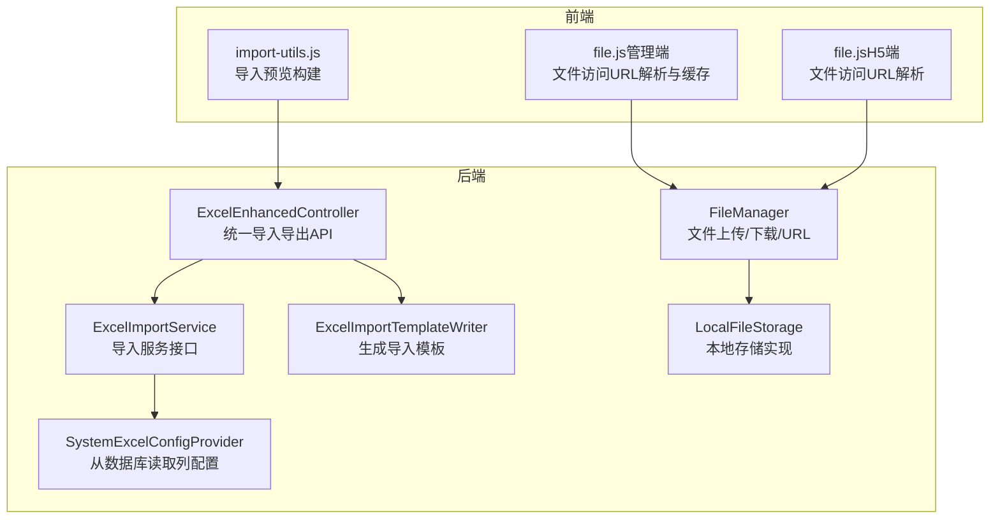
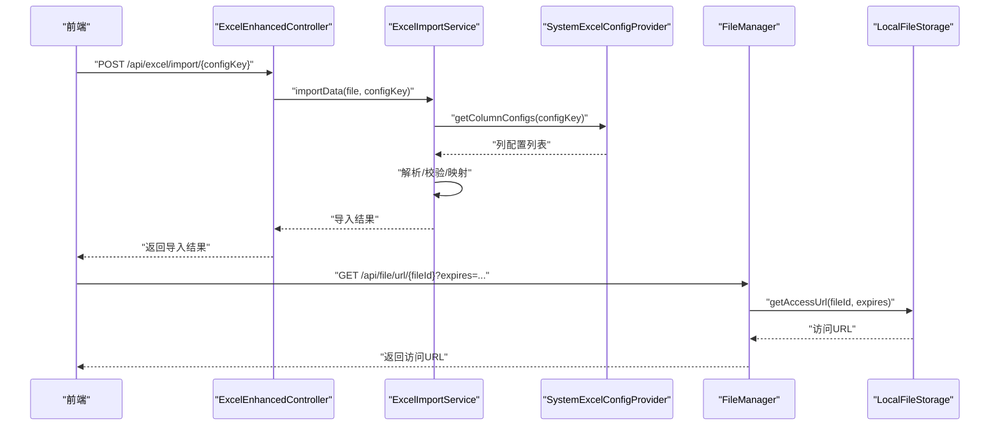
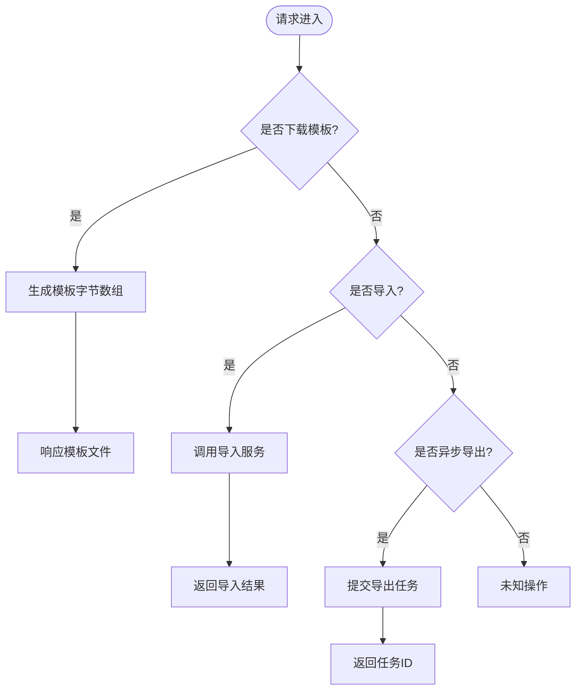
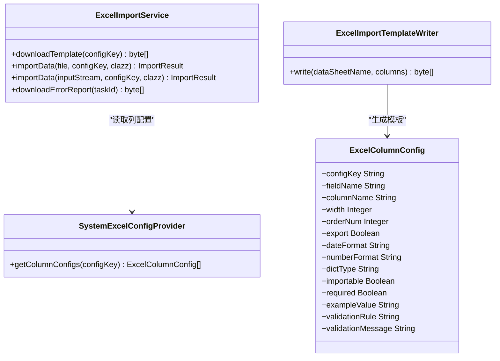
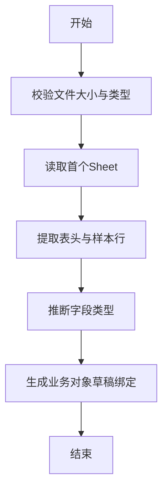
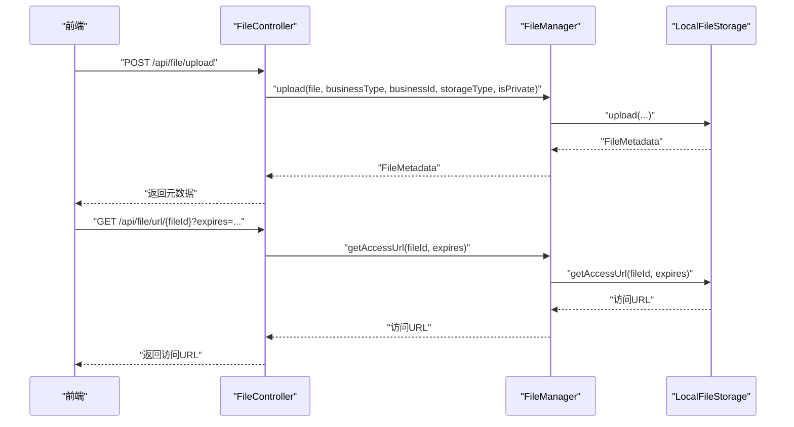
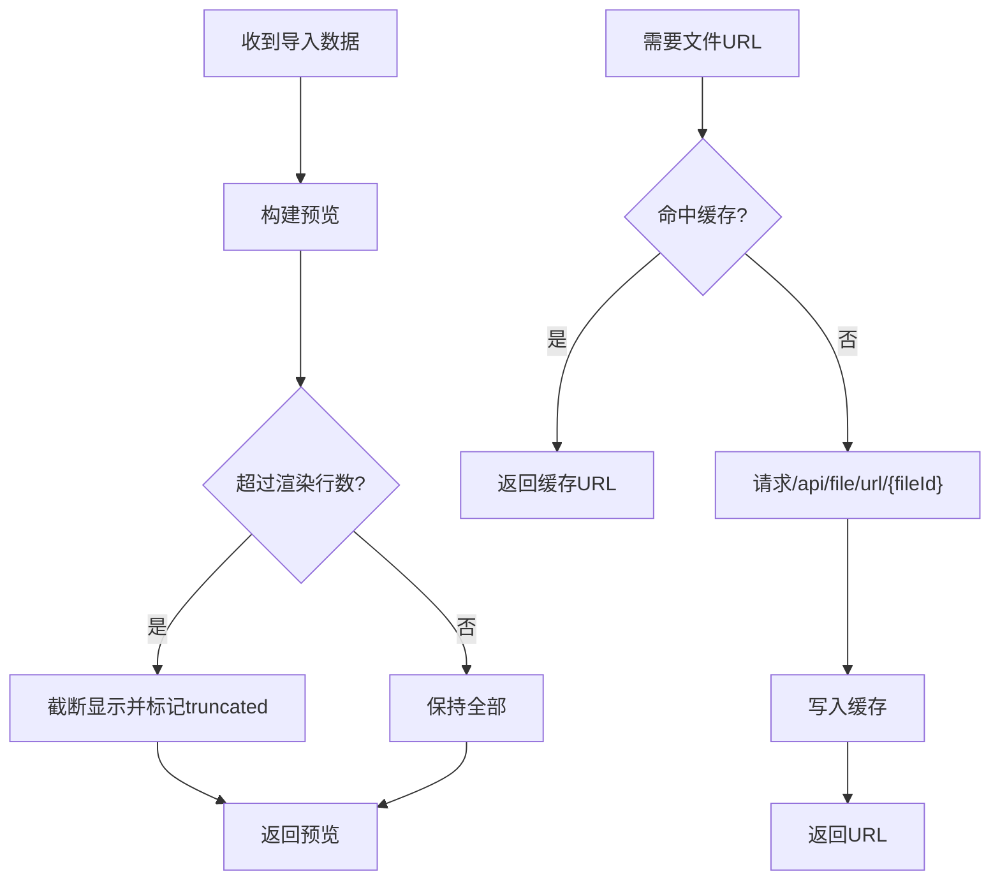
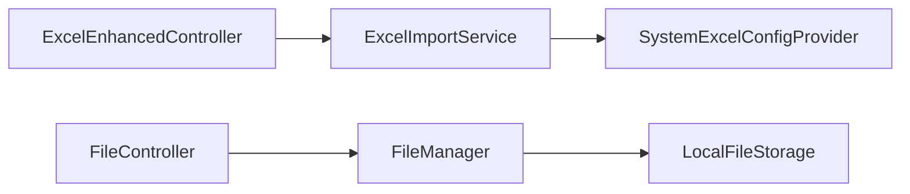

# 文件数据源

<cite>
**本文引用的文件**
- [ExcelEnhancedController.java](file://forge-server/forge-framework/forge-starter-parent/forge-starter-excel/src/main/java/com/mdframe/forge/starter/excel/controller/ExcelEnhancedController.java)
- [ExcelImportService.java](file://forge-server/forge-framework/forge-starter-parent/forge-starter-excel/src/main/java/com/mdframe/forge/starter/excel/service/ExcelImportService.java)
- [ExcelColumnConfig.java](file://forge-server/forge-framework/forge-starter-parent/forge-starter-excel/src/main/java/com/mdframe/forge/starter/excel/model/ExcelColumnConfig.java)
- [ExcelConfigProvider.java](file://forge-server/forge-framework/forge-starter-parent/forge-starter-excel/src/main/java/com/mdframe/forge/starter/excel/spi/ExcelConfigProvider.java)
- [SystemExcelConfigProvider.java](file://forge-server/forge-framework/forge-plugin-parent/forge-plugin-system/src/main/java/com/mdframe/forge/plugin/system/service/impl/SystemExcelConfigProvider.java)
- [ExcelImportTemplateWriter.java](file://forge-server/forge-framework/forge-starter-parent/forge-starter-excel/src/main/java/com/mdframe/forge/starter/excel/core/ExcelImportTemplateWriter.java)
- [BusinessApplicationExcelImportService.java](file://forge-server/forge-framework/forge-plugin-parent/forge-plugin-generator/src/main/java/com/mdframe/forge/plugin/generator/service/businessapp/BusinessApplicationExcelImportService.java)
- [FileManager.java](file://forge-server/forge-framework/forge-starter-parent/forge-starter-file/src/main/java/com/mdframe/forge/starter/file/core/FileManager.java)
- [FileController.java](file://forge-server/forge-framework/forge-starter-parent/forge-starter-file/src/main/java/com/mdframe/forge/starter/file/controller/FileController.java)
- [LocalFileStorage.java](file://forge-server/forge-framework/forge-starter-parent/forge-starter-file/src/main/java/com/mdframe/forge/starter/file/storage/impl/LocalFileStorage.java)
- [import-utils.js](file://forge-admin-ui/src/components/ai-form/import-utils.js)
- [file.js（管理端）](file://forge-admin-ui/src/utils/file.js)
- [file.js（H5端）](file://forge-h5-ui/src/utils/file.js)
</cite>

## 目录
1. [简介](#简介)
2. [项目结构](#项目结构)
3. [核心组件](#核心组件)
4. [架构总览](#架构总览)
5. [详细组件分析](#详细组件分析)
6. [依赖关系分析](#依赖关系分析)
7. [性能考虑](#性能考虑)
8. [故障排查指南](#故障排查指南)
9. [结论](#结论)
10. [附录](#附录)

## 简介
本文件为 Forge Admin 的“文件数据源”提供完整使用与实现说明，覆盖以下能力：
- 支持的文件格式：CSV、Excel（xls/xlsx）、JSON、XML（通过通用文件上传与解析扩展）。
- 文件来源：本地上传、远程下载后导入。
- 解析与映射：基于配置驱动的列映射、校验规则、字典转换、模板生成。
- 编码与大文件：UTF-8 优先、流式处理、分片上传、异步导出。
- 预览与验证：前端行级预览、必填/正则校验、错误报告下载。
- 批量导入导出：模板下载、批量导入、异步导出任务与结果下载。
- 安全与最佳实践：类型白名单、危险扩展拦截、路径越界防护、敏感信息脱敏。

## 项目结构
围绕“文件数据源”，后端主要包含两大模块：
- Excel 导入导出增强能力（starter-excel）
- 通用文件管理与存储（starter-file）

前端提供导入预览、文件访问地址解析与缓存等能力。

图表来源
- [ExcelEnhancedController.java:23-33](file://forge-server/forge-framework/forge-starter-parent/forge-starter-excel/src/main/java/com/mdframe/forge/starter/excel/controller/ExcelEnhancedController.java#L23-L33)
- [ExcelImportService.java:11-49](file://forge-server/forge-framework/forge-starter-parent/forge-starter-excel/src/main/java/com/mdframe/forge/starter/excel/service/ExcelImportService.java#L11-L49)
- [SystemExcelConfigProvider.java:22-41](file://forge-server/forge-framework/forge-plugin-parent/forge-plugin-system/src/main/java/com/mdframe/forge/plugin/system/service/impl/SystemExcelConfigProvider.java#L22-L41)
- [ExcelImportTemplateWriter.java:24-56](file://forge-server/forge-framework/forge-starter-parent/forge-starter-excel/src/main/java/com/mdframe/forge/starter/excel/core/ExcelImportTemplateWriter.java#L24-L56)
- [FileManager.java:107-196](file://forge-server/forge-framework/forge-starter-parent/forge-starter-file/src/main/java/com/mdframe/forge/starter/file/core/FileManager.java#L107-L196)
- [LocalFileStorage.java:77-125](file://forge-server/forge-framework/forge-starter-parent/forge-starter-file/src/main/java/com/mdframe/forge/starter/file/storage/impl/LocalFileStorage.java#L77-L125)
- [import-utils.js:29-34](file://forge-admin-ui/src/components/ai-form/import-utils.js#L29-L34)
- [file.js（管理端）:194-244](file://forge-admin-ui/src/utils/file.js#L194-L244)
- [file.js（H5端）:102-122](file://forge-h5-ui/src/utils/file.js#L102-L122)

章节来源
- [ExcelEnhancedController.java:23-33](file://forge-server/forge-framework/forge-starter-parent/forge-starter-excel/src/main/java/com/mdframe/forge/starter/excel/controller/ExcelEnhancedController.java#L23-L33)
- [FileManager.java:107-196](file://forge-server/forge-framework/forge-starter-parent/forge-starter-file/src/main/java/com/mdframe/forge/starter/file/core/FileManager.java#L107-L196)

## 核心组件
- Excel 导入导出控制器：提供模板下载、导入、错误报告下载、异步导出提交/状态查询/下载等接口。
- 导入服务接口：定义模板下载、导入、错误报告下载能力。
- 列配置提供者：从数据库加载列配置（字段名、表头、宽度、排序、是否导出/导入、日期/数字格式、字典类型、必填、示例值、校验规则与提示）。
- 模板写入器：生成带样例行和填写说明的导入模板。
- 业务应用导入服务：将 Excel 首个 Sheet 转换为业务对象设计草稿（仅识别表头与样本用于类型推荐，不导入业务数据）。
- 文件管理器：统一文件上传、下载、删除、分片上传、访问 URL 生成；内置大小限制、危险扩展/MIME 过滤、扩展名与 MIME 一致性校验。
- 本地存储实现：按业务类型与日期组织目录，支持分片上传合并、路径安全校验、符号链接拒绝。
- 前端工具：导入预览构建、文件访问 URL 解析与缓存。

章节来源
- [ExcelEnhancedController.java:35-229](file://forge-server/forge-framework/forge-starter-parent/forge-starter-excel/src/main/java/com/mdframe/forge/starter/excel/controller/ExcelEnhancedController.java#L35-L229)
- [ExcelImportService.java:11-49](file://forge-server/forge-framework/forge-starter-parent/forge-starter-excel/src/main/java/com/mdframe/forge/starter/excel/service/ExcelImportService.java#L11-L49)
- [ExcelColumnConfig.java:1-81](file://forge-server/forge-framework/forge-starter-parent/forge-starter-excel/src/main/java/com/mdframe/forge/starter/excel/model/ExcelColumnConfig.java#L1-L81)
- [SystemExcelConfigProvider.java:22-41](file://forge-server/forge-framework/forge-plugin-parent/forge-plugin-system/src/main/java/com/mdframe/forge/plugin/system/service/impl/SystemExcelConfigProvider.java#L22-L41)
- [ExcelImportTemplateWriter.java:24-116](file://forge-server/forge-framework/forge-starter-parent/forge-starter-excel/src/main/java/com/mdframe/forge/starter/excel/core/ExcelImportTemplateWriter.java#L24-L116)
- [BusinessApplicationExcelImportService.java:25-144](file://forge-server/forge-framework/forge-plugin-parent/forge-plugin-generator/src/main/java/com/mdframe/forge/plugin/generator/service/businessapp/BusinessApplicationExcelImportService.java#L25-L144)
- [FileManager.java:461-559](file://forge-server/forge-framework/forge-starter-parent/forge-starter-file/src/main/java/com/mdframe/forge/starter/file/core/FileManager.java#L461-L559)
- [LocalFileStorage.java:336-410](file://forge-server/forge-framework/forge-starter-parent/forge-starter-file/src/main/java/com/mdframe/forge/starter/file/storage/impl/LocalFileStorage.java#L336-L410)
- [import-utils.js:29-34](file://forge-admin-ui/src/components/ai-form/import-utils.js#L29-L34)
- [file.js（管理端）:194-244](file://forge-admin-ui/src/utils/file.js#L194-L244)

## 架构总览
下图展示“文件数据源”在前后端的交互流程：前端通过文件上传接口获取临时访问地址，或调用 Excel 导入导出接口完成数据导入与导出；后端通过文件管理器与存储实现完成持久化与访问控制。

图表来源
- [ExcelEnhancedController.java:59-83](file://forge-server/forge-framework/forge-starter-parent/forge-starter-excel/src/main/java/com/mdframe/forge/starter/excel/controller/ExcelEnhancedController.java#L59-L83)
- [SystemExcelConfigProvider.java:26-41](file://forge-server/forge-framework/forge-plugin-parent/forge-plugin-system/src/main/java/com/mdframe/forge/plugin/system/service/impl/SystemExcelConfigProvider.java#L26-L41)
- [FileController.java:63-74](file://forge-server/forge-framework/forge-starter-parent/forge-starter-file/src/main/java/com/mdframe/forge/starter/file/controller/FileController.java#L63-L74)
- [LocalFileStorage.java:253-267](file://forge-server/forge-framework/forge-starter-parent/forge-starter-file/src/main/java/com/mdframe/forge/starter/file/storage/impl/LocalFileStorage.java#L253-L267)

## 详细组件分析

### Excel 导入导出控制器
- 功能要点
  - 模板下载：根据 configKey 生成并返回 Excel 模板。
  - 导入：接收 MultipartFile，调用导入服务，返回导入结果。
  - 错误报告：根据 taskId 下载导入错误报告。
  - 异步导出：提交任务、查询状态、下载结果；失败时对外暴露稳定公共错误消息。
- 关键路径
  - 模板下载：/api/excel/template/{configKey}
  - 导入：/api/excel/import/{configKey}
  - 错误报告：/api/excel/error-report/{taskId}
  - 异步导出：/api/excel/async-export/{configKey}
  - 状态查询：/api/excel/async-export/status/{taskId}
  - 结果下载：/api/excel/async-export/download/{taskId}

图表来源
- [ExcelEnhancedController.java:35-229](file://forge-server/forge-framework/forge-starter-parent/forge-starter-excel/src/main/java/com/mdframe/forge/starter/excel/controller/ExcelEnhancedController.java#L35-L229)

章节来源
- [ExcelEnhancedController.java:35-229](file://forge-server/forge-framework/forge-starter-parent/forge-starter-excel/src/main/java/com/mdframe/forge/starter/excel/controller/ExcelEnhancedController.java#L35-L229)

### 导入服务与列配置
- 导入服务接口定义了模板下载、导入、错误报告下载能力。
- 列配置提供者从数据库读取列配置，包括字段名、表头、宽度、排序、是否导出/导入、日期/数字格式、字典类型、必填、示例值、校验规则与提示。
- 模板写入器生成首个工作表的样例行与第二个工作表的填写说明。

图表来源
- [ExcelImportService.java:11-49](file://forge-server/forge-framework/forge-starter-parent/forge-starter-excel/src/main/java/com/mdframe/forge/starter/excel/service/ExcelImportService.java#L11-L49)
- [SystemExcelConfigProvider.java:22-41](file://forge-server/forge-framework/forge-plugin-parent/forge-plugin-system/src/main/java/com/mdframe/forge/plugin/system/service/impl/SystemExcelConfigProvider.java#L22-L41)
- [ExcelColumnConfig.java:1-81](file://forge-server/forge-framework/forge-starter-parent/forge-starter-excel/src/main/java/com/mdframe/forge/starter/excel/model/ExcelColumnConfig.java#L1-L81)
- [ExcelImportTemplateWriter.java:24-116](file://forge-server/forge-framework/forge-starter-parent/forge-starter-excel/src/main/java/com/mdframe/forge/starter/excel/core/ExcelImportTemplateWriter.java#L24-L116)

章节来源
- [ExcelImportService.java:11-49](file://forge-server/forge-framework/forge-starter-parent/forge-starter-excel/src/main/java/com/mdframe/forge/starter/excel/service/ExcelImportService.java#L11-L49)
- [SystemExcelConfigProvider.java:22-41](file://forge-server/forge-framework/forge-plugin-parent/forge-plugin-system/src/main/java/com/mdframe/forge/plugin/system/service/impl/SystemExcelConfigProvider.java#L22-L41)
- [ExcelColumnConfig.java:1-81](file://forge-server/forge-framework/forge-starter-parent/forge-starter-excel/src/main/java/com/mdframe/forge/starter/excel/model/ExcelColumnConfig.java#L1-L81)
- [ExcelImportTemplateWriter.java:24-116](file://forge-server/forge-framework/forge-starter-parent/forge-starter-excel/src/main/java/com/mdframe/forge/starter/excel/core/ExcelImportTemplateWriter.java#L24-L116)

### 业务应用导入服务（Excel→业务对象草稿）
- 仅读取首个 Sheet，识别表头与少量样本用于类型推荐，不导入业务数据，也不自动执行 DDL。
- 对样本进行类型推断（整数、小数、日期、时间、布尔、选择项），限制最大样本行数与选项数。

图表来源
- [BusinessApplicationExcelImportService.java:25-144](file://forge-server/forge-framework/forge-plugin-parent/forge-plugin-generator/src/main/java/com/mdframe/forge/plugin/generator/service/businessapp/BusinessApplicationExcelImportService.java#L25-L144)

章节来源
- [BusinessApplicationExcelImportService.java:25-144](file://forge-server/forge-framework/forge-plugin-parent/forge-plugin-generator/src/main/java/com/mdframe/forge/plugin/generator/service/businessapp/BusinessApplicationExcelImportService.java#L25-L144)

### 文件管理与存储
- 文件管理器负责上传、下载、删除、分片上传、访问 URL 生成；内置大小限制、危险扩展/MIME 过滤、扩展名与 MIME 一致性校验。
- 本地存储实现按业务类型与日期组织目录，支持分片上传合并、路径安全校验、符号链接拒绝。

图表来源
- [FileController.java:33-74](file://forge-server/forge-framework/forge-starter-parent/forge-starter-file/src/main/java/com/mdframe/forge/starter/file/controller/FileController.java#L33-L74)
- [FileManager.java:107-196](file://forge-server/forge-framework/forge-starter-parent/forge-starter-file/src/main/java/com/mdframe/forge/starter/file/core/FileManager.java#L107-L196)
- [LocalFileStorage.java:77-125](file://forge-server/forge-framework/forge-starter-parent/forge-starter-file/src/main/java/com/mdframe/forge/starter/file/storage/impl/LocalFileStorage.java#L77-L125)
- [LocalFileStorage.java:253-267](file://forge-server/forge-framework/forge-starter-parent/forge-starter-file/src/main/java/com/mdframe/forge/starter/file/storage/impl/LocalFileStorage.java#L253-L267)

章节来源
- [FileController.java:33-74](file://forge-server/forge-framework/forge-starter-parent/forge-starter-file/src/main/java/com/mdframe/forge/starter/file/controller/FileController.java#L33-L74)
- [FileManager.java:107-196](file://forge-server/forge-framework/forge-starter-parent/forge-starter-file/src/main/java/com/mdframe/forge/starter/file/core/FileManager.java#L107-L196)
- [LocalFileStorage.java:77-125](file://forge-server/forge-framework/forge-starter-parent/forge-starter-file/src/main/java/com/mdframe/forge/starter/file/storage/impl/LocalFileStorage.java#L77-L125)

### 前端导入预览与文件访问
- 导入预览：构建表头、去除空白行、限制渲染行数、保留总行数、生成列标签。
- 文件访问 URL：解析 fileId 或 filePath，支持直接直链、内部接口拉取 blob URL，并提供内存与持久化缓存。

图表来源
- [import-utils.js:29-34](file://forge-admin-ui/src/components/ai-form/import-utils.js#L29-L34)
- [file.js（管理端）:194-244](file://forge-admin-ui/src/utils/file.js#L194-L244)
- [file.js（H5端）:102-122](file://forge-h5-ui/src/utils/file.js#L102-L122)

章节来源
- [import-utils.js:29-34](file://forge-admin-ui/src/components/ai-form/import-utils.js#L29-L34)
- [file.js（管理端）:194-244](file://forge-admin-ui/src/utils/file.js#L194-L244)
- [file.js（H5端）:102-122](file://forge-h5-ui/src/utils/file.js#L102-L122)

## 依赖关系分析
- 控制器依赖导入服务与异步导出服务。
- 导入服务依赖列配置提供者。
- 文件控制器依赖文件管理器。
- 文件管理器依赖存储实现与元数据持久化。
- 本地存储实现依赖元数据持久化以获取文件元信息。

图表来源
- [ExcelEnhancedController.java:23-33](file://forge-server/forge-framework/forge-starter-parent/forge-starter-excel/src/main/java/com/mdframe/forge/starter/excel/controller/ExcelEnhancedController.java#L23-L33)
- [SystemExcelConfigProvider.java:22-41](file://forge-server/forge-framework/forge-plugin-parent/forge-plugin-system/src/main/java/com/mdframe/forge/plugin/system/service/impl/SystemExcelConfigProvider.java#L22-L41)
- [FileController.java:22-31](file://forge-server/forge-framework/forge-starter-parent/forge-starter-file/src/main/java/com/mdframe/forge/starter/file/controller/FileController.java#L22-L31)
- [FileManager.java:74-80](file://forge-server/forge-framework/forge-starter-parent/forge-starter-file/src/main/java/com/mdframe/forge/starter/file/core/FileManager.java#L74-L80)
- [LocalFileStorage.java:42-43](file://forge-server/forge-framework/forge-starter-parent/forge-starter-file/src/main/java/com/mdframe/forge/starter/file/storage/impl/LocalFileStorage.java#L42-L43)

章节来源
- [ExcelEnhancedController.java:23-33](file://forge-server/forge-framework/forge-starter-parent/forge-starter-excel/src/main/java/com/mdframe/forge/starter/excel/controller/ExcelEnhancedController.java#L23-L33)
- [FileController.java:22-31](file://forge-server/forge-framework/forge-starter-parent/forge-starter-file/src/main/java/com/mdframe/forge/starter/file/controller/FileController.java#L22-L31)

## 性能考虑
- 大文件导入
  - 使用流式读取与分页/分批处理，避免一次性加载到内存。
  - 利用 EasyExcel 的事件驱动模型进行逐行解析。
- 大文件导出
  - 采用异步导出任务，后台生成文件，前端轮询状态并下载。
  - 失败时对外暴露稳定的公共错误消息，避免泄露内部路径或连接串。
- 文件上传
  - 支持分片上传，降低网络抖动影响，提升大文件稳定性。
  - 默认最大文件大小可通过配置调整，建议结合业务场景设置合理阈值。
- 预览与渲染
  - 前端限制渲染行数，避免 UI 卡顿；保留总行数用于统计。
  - 文件访问 URL 使用内存与持久化缓存，减少重复请求。

[本节为通用指导，无需特定文件引用]

## 故障排查指南
- 导入失败
  - 检查列配置是否存在且正确；确认必填字段已填写。
  - 查看导入错误报告，定位具体行与错误原因。
  - 注意外部异常不应泄露内部信息（如数据库连接串）。
- 导出失败
  - 查询异步导出任务状态，关注错误消息是否为公共稳定消息。
  - 若任务不存在，检查任务 ID 是否正确。
- 文件访问失败
  - 确认 fileId 有效且可访问；检查过期时间与权限。
  - 前端缓存失效时可强制刷新重新获取 URL。
- 上传失败
  - 检查文件类型是否在允许列表中；确认未上传高风险扩展。
  - 检查扩展名与 MIME 类型是否一致；确保文件大小未超限。

章节来源
- [ExcelEnhancedController.java:59-83](file://forge-server/forge-framework/forge-starter-parent/forge-starter-excel/src/main/java/com/mdframe/forge/starter/excel/controller/ExcelEnhancedController.java#L59-L83)
- [ExcelEnhancedController.java:177-206](file://forge-server/forge-framework/forge-starter-parent/forge-starter-excel/src/main/java/com/mdframe/forge/starter/excel/controller/ExcelEnhancedController.java#L177-L206)
- [FileManager.java:461-559](file://forge-server/forge-framework/forge-starter-parent/forge-starter-file/src/main/java/com/mdframe/forge/starter/file/core/FileManager.java#L461-L559)

## 结论
Forge Admin 的文件数据源提供了完善的导入导出与文件管理能力：
- 通过配置驱动的列映射与校验，实现灵活的 CSV/Excel/JSON/XML 数据处理。
- 借助文件管理器与存储实现，支持本地与远程存储，具备安全校验与大文件处理能力。
- 前端提供导入预览与文件访问 URL 解析缓存，提升用户体验与系统性能。
建议在业务中合理使用模板与校验规则，结合异步导出与分片上传，保障大规模数据的稳定处理。

[本节为总结性内容，无需特定文件引用]

## 附录
- 常用接口
  - 模板下载：/api/excel/template/{configKey}
  - 导入：/api/excel/import/{configKey}
  - 错误报告：/api/excel/error-report/{taskId}
  - 异步导出：/api/excel/async-export/{configKey}
  - 状态查询：/api/excel/async-export/status/{taskId}
  - 结果下载：/api/excel/async-export/download/{taskId}
  - 文件上传：/api/file/upload
  - 文件下载：/api/file/download/{fileId}
  - 文件访问URL：/api/file/url/{fileId}?expires=...

[本节为参考信息，无需特定文件引用]