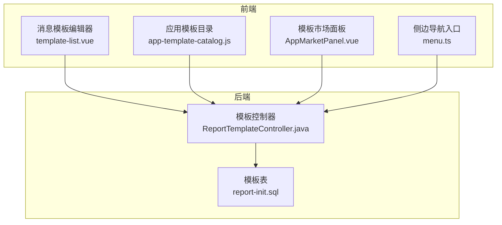
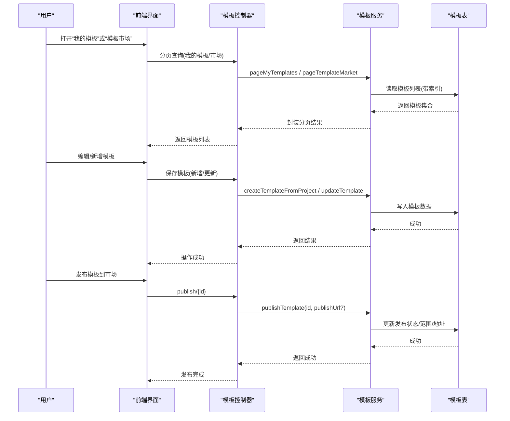
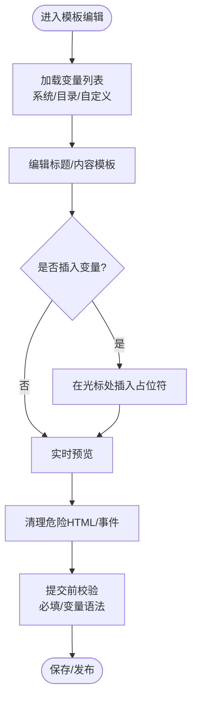
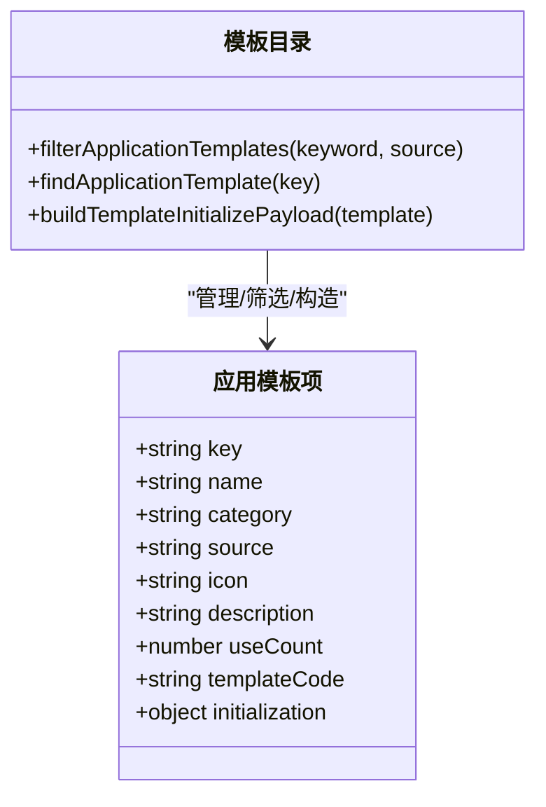
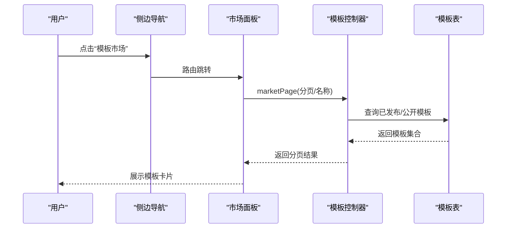
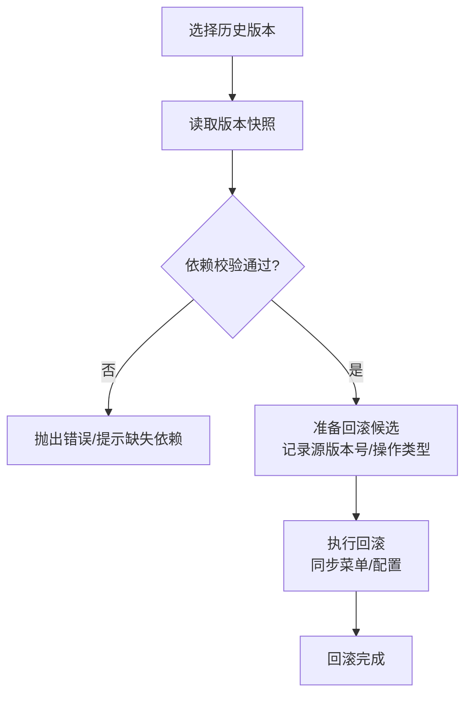
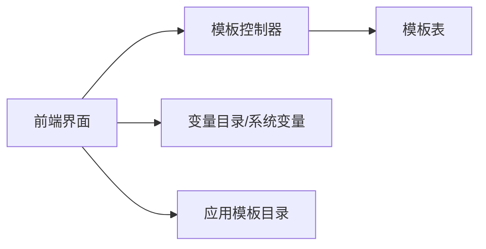

# 模板管理

<cite>
**本文引用的文件**
- [ReportTemplateController.java](file://forge-server/forge-report-server/src/main/java/com/mdframe/forge/report/project/template/controller/ReportTemplateController.java)
- [report-init.sql](file://forge-server/forge-report-server/sql/report-init.sql)
- [template-list.vue](file://forge-admin-ui/src/views/message/template-list.vue)
- [app-template-catalog.js](file://forge-admin-ui/src/views/app-center/components/create/app-template-catalog.js)
- [AppMarketPanel.vue](file://forge-admin-ui/src/views/app-center/components/AppMarketPanel.vue)
- [ProjectLayoutSider/menu.ts](file://forge-report-ui/src/views/project/layout/components/ProjectLayoutSider/menu.ts)
</cite>

## 目录
1. [简介](#简介)
2. [项目结构](#项目结构)
3. [核心组件](#核心组件)
4. [架构总览](#架构总览)
5. [详细组件分析](#详细组件分析)
6. [依赖关系分析](#依赖关系分析)
7. [性能考虑](#性能考虑)
8. [故障排查指南](#故障排查指南)
9. [结论](#结论)
10. [附录](#附录)

## 简介
本章节面向 Forge Admin 的“模板管理”能力，围绕模板的创建、编辑、分类、搜索、分享与复用进行系统化说明。文档覆盖以下主题：
- 模板结构与变量替换：标题模板、内容模板、变量语法、预览校验
- 条件渲染与动态布局：基于业务对象与页面配置的运行时布局推导
- 内置模板与自定义模板：官方模板目录、应用模板初始化载荷
- 版本管理与回滚：设计版本快照、发布与回滚流程
- 模板市场机制：私有/公开范围、发布状态、复制与创建新项目
- 设计规范、最佳实践、性能优化与常见问题

## 项目结构
模板管理涉及前后端多个模块：
- 后端提供模板的增删改查、分页查询、市场分页、从项目创建模板、发布到市场、基于模板创建新项目等接口
- 前端提供消息模板编辑器（变量面板、插入变量、实时预览）、应用模板市场与筛选、侧边导航入口等
- 数据库定义模板表字段与索引，支撑按租户、来源项目、目录、发布状态、范围等维度检索

**图表来源**
- [ReportTemplateController.java:26-100](file://forge-server/forge-report-server/src/main/java/com/mdframe/forge/report/project/template/controller/ReportTemplateController.java#L26-L100)
- [report-init.sql:143-175](file://forge-server/forge-report-server/sql/report-init.sql#L143-L175)
- [template-list.vue:1-136](file://forge-admin-ui/src/views/message/template-list.vue#L1-L136)
- [app-template-catalog.js:1-99](file://forge-admin-ui/src/views/app-center/components/create/app-template-catalog.js#L1-L99)
- [AppMarketPanel.vue:22-161](file://forge-admin-ui/src/views/app-center/components/AppMarketPanel.vue#L22-L161)
- [ProjectLayoutSider/menu.ts:62-114](file://forge-report-ui/src/views/project/layout/components/ProjectLayoutSider/menu.ts#L62-L114)

**章节来源**
- [ReportTemplateController.java:26-100](file://forge-server/forge-report-server/src/main/java/com/mdframe/forge/report/project/template/controller/ReportTemplateController.java#L26-L100)
- [report-init.sql:143-175](file://forge-server/forge-report-server/sql/report-init.sql#L143-L175)
- [template-list.vue:1-136](file://forge-admin-ui/src/views/message/template-list.vue#L1-L136)
- [app-template-catalog.js:1-99](file://forge-admin-ui/src/views/app-center/components/create/app-template-catalog.js#L1-L99)
- [AppMarketPanel.vue:22-161](file://forge-admin-ui/src/views/app-center/components/AppMarketPanel.vue#L22-L161)
- [ProjectLayoutSider/menu.ts:62-114](file://forge-report-ui/src/views/project/layout/components/ProjectLayoutSider/menu.ts#L62-L114)

## 核心组件
- 模板数据模型与存储：模板表包含名称、备注、封面图、画布尺寸、背景色、组件数据、发布状态、范围、发布地址、发布时间、复制次数及审计字段，并提供多维度索引以支持高效检索
- 模板服务接口：提供分页查询我的模板、模板市场分页、详情获取、从项目创建模板、更新、删除、发布到市场、基于模板创建新项目
- 消息模板编辑器：提供变量面板、变量搜索与插入、标题/内容模板编辑、实时预览、XSS 清理、变量使用统计
- 应用模板目录与市场：官方模板清单、筛选与查找、生成源码或立即启用、展示布局类型与使用次数
- 导航入口：侧边菜单提供“我的模板”和“模板市场”入口

**章节来源**
- [report-init.sql:143-175](file://forge-server/forge-report-server/sql/report-init.sql#L143-L175)
- [ReportTemplateController.java:26-100](file://forge-server/forge-report-server/src/main/java/com/mdframe/forge/report/project/template/controller/ReportTemplateController.java#L26-L100)
- [template-list.vue:1-136](file://forge-admin-ui/src/views/message/template-list.vue#L1-L136)
- [app-template-catalog.js:1-99](file://forge-admin-ui/src/views/app-center/components/create/app-template-catalog.js#L1-L99)
- [AppMarketPanel.vue:22-161](file://forge-admin-ui/src/views/app-center/components/AppMarketPanel.vue#L22-L161)
- [ProjectLayoutSider/menu.ts:62-114](file://forge-report-ui/src/views/project/layout/components/ProjectLayoutSider/menu.ts#L62-L114)

## 架构总览
模板管理的整体交互流程如下：用户在“我的模板”或“模板市场”中浏览、筛选、选择模板；通过后端接口完成模板的创建、更新、删除、发布与复制；在消息模板编辑器中进行变量编辑与预览；最终将模板用于报表大屏或应用生成。

**图表来源**
- [ReportTemplateController.java:26-100](file://forge-server/forge-report-server/src/main/java/com/mdframe/forge/report/project/template/controller/ReportTemplateController.java#L26-L100)
- [report-init.sql:143-175](file://forge-server/forge-report-server/sql/report-init.sql#L143-L175)

## 详细组件分析

### 消息模板编辑器（变量与预览）
- 变量体系：系统内置变量、按模板编码扩展的目录变量、当前模板自定义变量三类来源合并展示
- 变量语法：支持 ${var} 与 {var} 两种占位符；禁止使用 @var（后端不替换）
- 变量插入：点击变量按钮在光标位置插入占位符，并维护光标位置
- 预览与清洗：标题与内容分别预览；HTML 预览会移除危险标签与事件，避免 XSS
- 提交校验：必填内容模板；检测不支持的 @ 变量并提示

**图表来源**
- [template-list.vue:165-240](file://forge-admin-ui/src/views/message/template-list.vue#L165-L240)
- [template-list.vue:431-587](file://forge-admin-ui/src/views/message/template-list.vue#L431-L587)

**章节来源**
- [template-list.vue:165-240](file://forge-admin-ui/src/views/message/template-list.vue#L165-L240)
- [template-list.vue:431-587](file://forge-admin-ui/src/views/message/template-list.vue#L431-L587)

### 应用模板目录与市场
- 官方模板清单：包含模板键名、名称、分类、图标、描述、使用次数、模板代码与初始化参数
- 筛选与查找：支持关键词与来源过滤；可定位具体模板并构建初始化载荷
- 市场面板：展示模板卡片、布局类型、使用次数，支持“生成源码”与“立即启用”

**图表来源**
- [app-template-catalog.js:1-99](file://forge-admin-ui/src/views/app-center/components/create/app-template-catalog.js#L1-L99)

**章节来源**
- [app-template-catalog.js:1-99](file://forge-admin-ui/src/views/app-center/components/create/app-template-catalog.js#L1-L99)
- [AppMarketPanel.vue:22-161](file://forge-admin-ui/src/views/app-center/components/AppMarketPanel.vue#L22-L161)

### 模板市场与导航入口
- 侧边导航：提供“我的模板”与“模板市场”入口，便于快速访问
- 市场分页：后端提供市场分页接口，支持按模板名称筛选

**图表来源**
- [ProjectLayoutSider/menu.ts:62-114](file://forge-report-ui/src/views/project/layout/components/ProjectLayoutSider/menu.ts#L62-L114)
- [ReportTemplateController.java:38-47](file://forge-server/forge-report-server/src/main/java/com/mdframe/forge/report/project/template/controller/ReportTemplateController.java#L38-L47)
- [report-init.sql:143-175](file://forge-server/forge-report-server/sql/report-init.sql#L143-L175)

**章节来源**
- [ProjectLayoutSider/menu.ts:62-114](file://forge-report-ui/src/views/project/layout/components/ProjectLayoutSider/menu.ts#L62-L114)
- [ReportTemplateController.java:38-47](file://forge-server/forge-report-server/src/main/java/com/mdframe/forge/report/project/template/controller/ReportTemplateController.java#L38-L47)
- [report-init.sql:143-175](file://forge-server/forge-report-server/sql/report-init.sql#L143-L175)

### 版本管理与回滚（低代码/应用）
- 版本快照：设计版本保存模型、页面、关系、选项等快照，用于发布与回滚
- 回滚流程：根据目标版本快照校验依赖（物理表、扩展版本、挂接），准备回滚候选并执行回滚
- 适用范围：适用于低代码配置与应用设计版本的回滚，保障运行稳定性

**图表来源**
- [BusinessObjectPublishService.java:301-318](file://forge-server/forge-framework/forge-plugin-parent/forge-plugin-generator/src/main/java/com/mdframe/forge/plugin/generator/service/businessapp/BusinessObjectPublishService.java#L301-L318)
- [BusinessApplicationRollbackService.java:186-248](file://forge-server/forge-framework/forge-plugin-parent/forge-plugin-generator/src/main/java/com/mdframe/forge/plugin/generator/service/businessapp/BusinessApplicationRollbackService.java#L186-L248)
- [LowcodePublishService.java:157-175](file://forge-server/forge-framework/forge-plugin-parent/forge-plugin-generator/src/main/java/com/mdframe/forge/plugin/generator/service/lowcode/LowcodePublishService.java#L157-L175)

**章节来源**
- [BusinessObjectPublishService.java:301-318](file://forge-server/forge-framework/forge-plugin-parent/forge-plugin-generator/src/main/java/com/mdframe/forge/plugin/generator/service/businessapp/BusinessObjectPublishService.java#L301-L318)
- [BusinessApplicationRollbackService.java:186-248](file://forge-server/forge-framework/forge-plugin-parent/forge-plugin-generator/src/main/java/com/mdframe/forge/plugin/generator/service/businessapp/BusinessApplicationRollbackService.java#L186-L248)
- [LowcodePublishService.java:157-175](file://forge-server/forge-framework/forge-plugin-parent/forge-plugin-generator/src/main/java/com/mdframe/forge/plugin/generator/service/lowcode/LowcodePublishService.java#L157-L175)

## 依赖关系分析
- 前端依赖后端模板接口进行数据获取与操作
- 后端依赖模板表进行持久化，利用索引提升查询效率
- 消息模板编辑器依赖变量目录与系统内置变量，确保变量可用性与预览准确性
- 应用模板目录与市场依赖官方模板清单，提供筛选与初始化载荷构建

**图表来源**
- [ReportTemplateController.java:26-100](file://forge-server/forge-report-server/src/main/java/com/mdframe/forge/report/project/template/controller/ReportTemplateController.java#L26-L100)
- [report-init.sql:143-175](file://forge-server/forge-report-server/sql/report-init.sql#L143-L175)
- [template-list.vue:165-240](file://forge-admin-ui/src/views/message/template-list.vue#L165-L240)
- [app-template-catalog.js:1-99](file://forge-admin-ui/src/views/app-center/components/create/app-template-catalog.js#L1-L99)

**章节来源**
- [ReportTemplateController.java:26-100](file://forge-server/forge-report-server/src/main/java/com/mdframe/forge/report/project/template/controller/ReportTemplateController.java#L26-L100)
- [report-init.sql:143-175](file://forge-server/forge-report-server/sql/report-init.sql#L143-L175)
- [template-list.vue:165-240](file://forge-admin-ui/src/views/message/template-list.vue#L165-L240)
- [app-template-catalog.js:1-99](file://forge-admin-ui/src/views/app-center/components/create/app-template-catalog.js#L1-L99)

## 性能考虑
- 数据库索引：模板表对租户、来源项目、目录、发布状态、范围、创建者建立索引，提升分页与筛选性能
- 前端缓存与懒加载：变量面板滚动区域限制高度，减少重绘；按需加载变量与预览
- 变量解析复杂度：正则匹配变量占位符，建议控制模板长度与变量数量，避免复杂表达式
- 发布与复制：模板发布与复制为写操作，建议在非高峰时段批量处理

[本节为通用性能建议，无需特定文件引用]

## 故障排查指南
- 变量未生效：检查是否使用了不被支持的 @ 变量；确认变量语法为 ${var} 或 {var}
- 预览显示异常：检查 HTML 预览是否被安全清洗；确认模板内容不含危险脚本或事件
- 模板无法发布：确认模板范围与发布状态；检查发布地址是否为空或不合法
- 市场无数据：确认模板已发布且范围为公开；检查分页参数与筛选条件
- 回滚失败：检查历史版本依赖的物理表、扩展版本与挂接是否存在；根据错误提示修复依赖

**章节来源**
- [template-list.vue:420-428](file://forge-admin-ui/src/views/message/template-list.vue#L420-L428)
- [template-list.vue:569-587](file://forge-admin-ui/src/views/message/template-list.vue#L569-L587)
- [ReportTemplateController.java:83-100](file://forge-server/forge-report-server/src/main/java/com/mdframe/forge/report/project/template/controller/ReportTemplateController.java#L83-L100)
- [BusinessApplicationRollbackService.java:186-248](file://forge-server/forge-framework/forge-plugin-parent/forge-plugin-generator/src/main/java/com/mdframe/forge/plugin/generator/service/businessapp/BusinessApplicationRollbackService.java#L186-L248)

## 结论
Forge Admin 的模板管理提供了完整的生命周期能力：从模板创建、编辑、变量替换与预览，到发布、分享与复用；结合官方模板目录与市场机制，能够快速搭建应用与报表。配合版本快照与回滚机制，保障生产环境的稳定性与可恢复性。遵循本文档的设计规范与最佳实践，可有效提升模板质量与开发效率。

[本节为总结性内容，无需特定文件引用]

## 附录

### 模板设计规范
- 变量命名：使用小写字母与下划线组成的标识符；避免特殊字符与空格
- 模板结构：标题模板简洁明确；内容模板层次清晰，合理使用段落与列表
- 条件渲染：优先使用后端提供的变量与上下文；避免在前端做复杂逻辑判断
- 动态布局：基于业务对象与页面配置进行运行时布局推导，保持组件与数据的解耦

[本节为通用规范，无需特定文件引用]

### 最佳实践案例
- 消息通知模板：使用系统内置变量组合标题与内容，确保关键信息突出
- 应用模板：选择官方模板作为起点，填充初始化参数，快速生成 CRUD 页面
- 模板市场：将常用模板设置为公开并发布，便于团队复用与协作

[本节为通用实践，无需特定文件引用]

### 性能优化建议
- 控制模板大小：避免过长的模板内容与过多变量
- 合理分页：后端分页查询模板列表，前端按需加载
- 缓存策略：对频繁访问的模板与市场数据进行缓存

[本节为通用建议，无需特定文件引用]