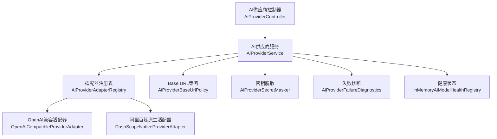
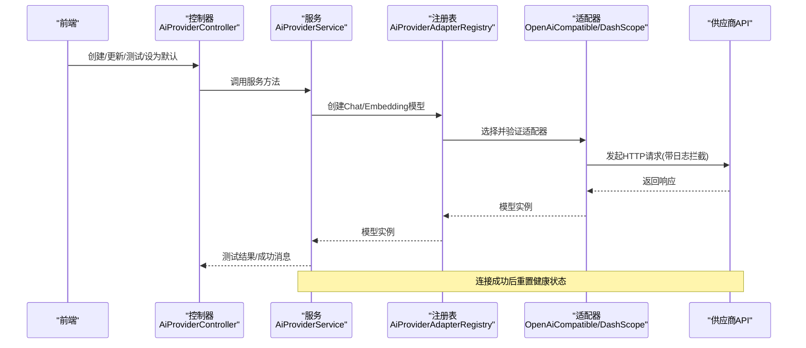
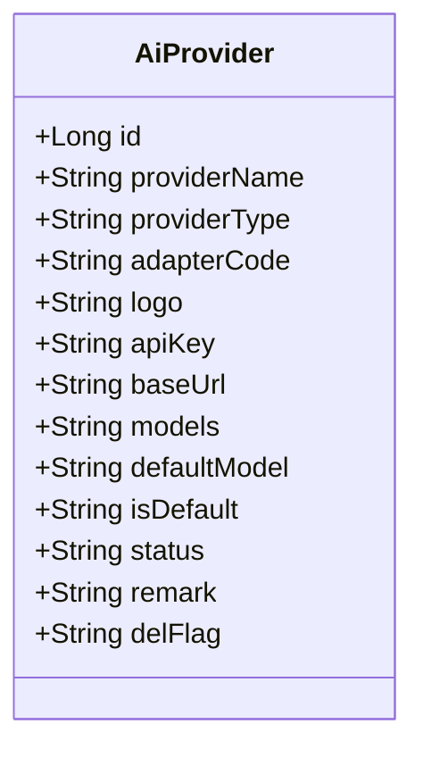
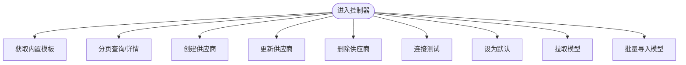
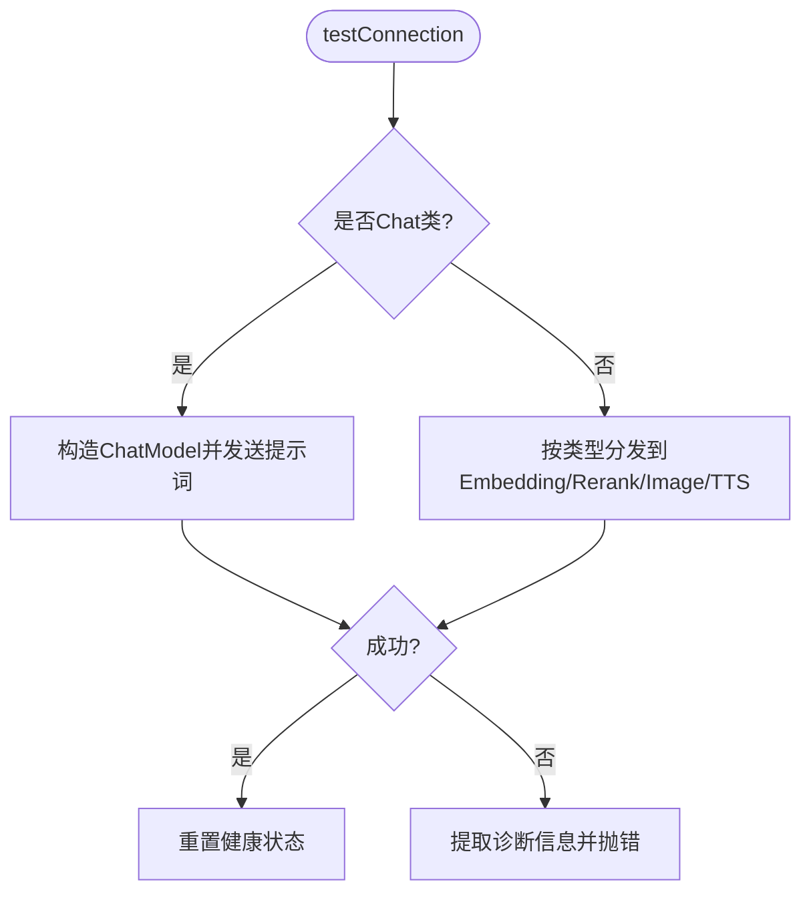
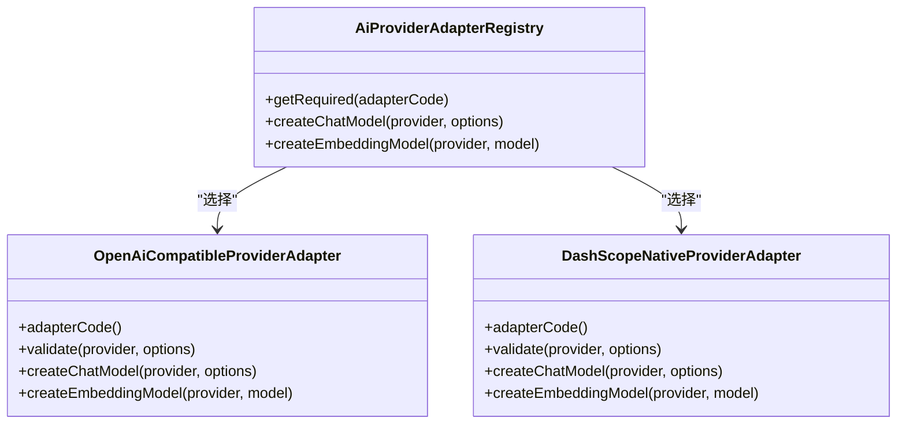
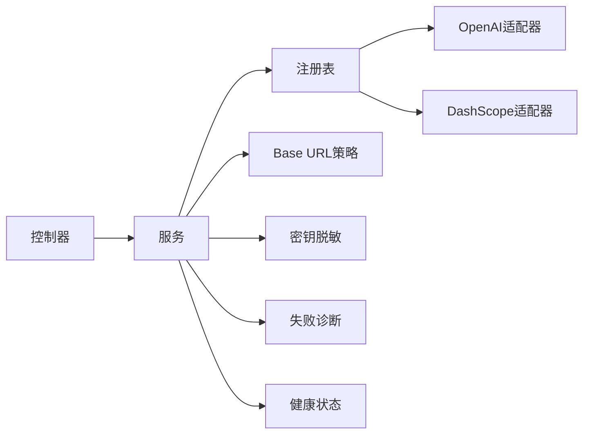

# AI供应商配置

<cite>
**本文引用的文件**
- [AiProvider.java](file://forge-server/forge-framework/forge-plugin-parent/forge-plugin-ai/src/main/java/com/mdframe/forge/plugin/ai/provider/domain/AiProvider.java)
- [AiProviderController.java](file://forge-server/forge-framework/forge-plugin-parent/forge-plugin-ai/src/main/java/com/mdframe/forge/plugin/ai/provider/controller/AiProviderController.java)
- [AiProviderService.java](file://forge-server/forge-framework/forge-plugin-parent/forge-plugin-ai/src/main/java/com/mdframe/forge/plugin/ai/provider/service/AiProviderService.java)
- [AiModelProviderManager.java](file://forge-server/forge-framework/forge-plugin-parent/forge-plugin-ai/src/main/java/com/mdframe/forge/plugin/ai/coordination/AiModelProviderManager.java)
- [AiProviderAdapterRegistry.java](file://forge-server/forge-framework/forge-plugin-parent/forge-plugin-ai/src/main/java/com/mdframe/forge/plugin/ai/provider/adapter/AiProviderAdapterRegistry.java)
- [OpenAiCompatibleProviderAdapter.java](file://forge-server/forge-framework/forge-plugin-parent/forge-plugin-ai/src/main/java/com/mdframe/forge/plugin/ai/provider/adapter/OpenAiCompatibleProviderAdapter.java)
- [DashScopeNativeProviderAdapter.java](file://forge-server/forge-framework/forge-plugin-parent/forge-plugin-ai/src/main/java/com/mdframe/forge/plugin/ai/provider/adapter/DashScopeNativeProviderAdapter.java)
- [AiProviderBaseUrlPolicy.java](file://forge-server/forge-framework/forge-plugin-parent/forge-plugin-ai/src/main/java/com/mdframe/forge/plugin/ai/provider/adapter/AiProviderBaseUrlPolicy.java)
- [AiProviderSecretMasker.java](file://forge-server/forge-framework/forge-plugin-parent/forge-plugin-ai/src/main/java/com/mdframe/forge/plugin/ai/provider/support/AiProviderSecretMasker.java)
- [AiProviderFailureDiagnostics.java](file://forge-server/forge-framework/forge-plugin-parent/forge-plugin-ai/src/main/java/com/mdframe/forge/plugin/ai/provider/support/AiProviderFailureDiagnostics.java)
- [InMemoryAiModelHealthRegistry.java](file://forge-server/forge-framework/forge-plugin-parent/forge-plugin-ai/src/main/java/com/mdframe/forge/plugin/ai/health/InMemoryAiModelHealthRegistry.java)
</cite>

## 目录
1. [简介](#简介)
2. [项目结构](#项目结构)
3. [核心组件](#核心组件)
4. [架构总览](#架构总览)
5. [详细组件分析](#详细组件分析)
6. [依赖关系分析](#依赖关系分析)
7. [性能与限流](#性能与限流)
8. [故障排查指南](#故障排查指南)
9. [结论](#结论)
10. [附录：各供应商配置示例](#附录各供应商配置示例)

## 简介
本文件面向Forge Admin的AI供应商配置能力，系统性说明如何配置多种AI供应商（如OpenAI、阿里百炼、智谱等）的连接参数、认证信息与模型配置；并介绍API密钥管理、请求日志与诊断、连接测试、默认供应商切换、模型同步、健康状态与故障转移等高级能力。文档同时提供主流供应商的配置要点与常见问题排查指引。

## 项目结构
AI供应商配置位于AI插件模块中，围绕“供应商实体—控制器—服务—适配器注册表—具体适配器—基础策略—支持工具”分层组织：
- 数据层：供应商实体定义与持久化字段
- 接口层：REST API用于增删改查、模板获取、连接测试、模型拉取与导入、默认供应商设置
- 服务层：业务编排、校验、加密解密、连接测试、模型摘要同步、健康状态重置
- 适配层：按协议选择具体供应商实现（OpenAI兼容、阿里百炼原生等），负责创建Chat/Embedding等模型实例
- 策略与支持：Base URL规范化与校验、敏感信息脱敏、失败诊断提取、健康状态记录

**图表来源**
- [AiProviderController.java:27-215](file://forge-server/forge-framework/forge-plugin-parent/forge-plugin-ai/src/main/java/com/mdframe/forge/plugin/ai/provider/controller/AiProviderController.java#L27-L215)
- [AiProviderService.java:47-597](file://forge-server/forge-framework/forge-plugin-parent/forge-plugin-ai/src/main/java/com/mdframe/forge/plugin/ai/provider/service/AiProviderService.java#L47-L597)
- [AiProviderAdapterRegistry.java:19-128](file://forge-server/forge-framework/forge-plugin-parent/forge-plugin-ai/src/main/java/com/mdframe/forge/plugin/ai/provider/adapter/AiProviderAdapterRegistry.java#L19-L128)
- [OpenAiCompatibleProviderAdapter.java:37-210](file://forge-server/forge-framework/forge-plugin-parent/forge-plugin-ai/src/main/java/com/mdframe/forge/plugin/ai/provider/adapter/OpenAiCompatibleProviderAdapter.java#L37-L210)
- [DashScopeNativeProviderAdapter.java:19-81](file://forge-server/forge-framework/forge-plugin-parent/forge-plugin-ai/src/main/java/com/mdframe/forge/plugin/ai/provider/adapter/DashScopeNativeProviderAdapter.java#L19-L81)
- [AiProviderBaseUrlPolicy.java:22-116](file://forge-server/forge-framework/forge-plugin-parent/forge-plugin-ai/src/main/java/com/mdframe/forge/plugin/ai/provider/adapter/AiProviderBaseUrlPolicy.java#L22-L116)
- [AiProviderSecretMasker.java:8-80](file://forge-server/forge-framework/forge-plugin-parent/forge-plugin-ai/src/main/java/com/mdframe/forge/plugin/ai/provider/support/AiProviderSecretMasker.java#L8-L80)
- [AiProviderFailureDiagnostics.java:6-90](file://forge-server/forge-framework/forge-plugin-parent/forge-plugin-ai/src/main/java/com/mdframe/forge/plugin/ai/provider/support/AiProviderFailureDiagnostics.java#L6-L90)
- [InMemoryAiModelHealthRegistry.java:13-80](file://forge-server/forge-framework/forge-plugin-parent/forge-plugin-ai/src/main/java/com/mdframe/forge/plugin/ai/health/InMemoryAiModelHealthRegistry.java#L13-L80)

**章节来源**
- [AiProviderController.java:27-215](file://forge-server/forge-framework/forge-plugin-parent/forge-plugin-ai/src/main/java/com/mdframe/forge/plugin/ai/provider/controller/AiProviderController.java#L27-L215)
- [AiProviderService.java:47-597](file://forge-server/forge-framework/forge-plugin-parent/forge-plugin-ai/src/main/java/com/mdframe/forge/plugin/ai/provider/service/AiProviderService.java#L47-L597)

## 核心组件
- 供应商实体：承载供应商名称、类型、适配器代码、Logo、API Key、Base URL、可用模型列表JSON、默认模型、是否默认、状态、备注等。
- 控制器：提供内置模板、分页查询、详情、创建、更新、删除、连接测试、设为默认、拉取模型、批量导入模型等接口。
- 服务：负责创建/更新/删除供应商、连接测试（Chat与非Chat）、模型摘要同步、默认供应商切换、安全视图转换、缓存失效调度等。
- 适配器注册表：根据适配器代码选择对应适配器，构造Chat/Embedding模型，并在构造前解密API Key。
- 具体适配器：OpenAI兼容适配器、阿里百炼原生适配器，分别封装各自SDK构建逻辑与日志拦截。
- Base URL策略：对已知供应商类型进行Base URL规范化与强制校验（例如DashScope兼容模式必须使用/compatible-mode）。
- 支持工具：密钥脱敏、失败诊断提取、健康状态重置等。

**章节来源**
- [AiProvider.java:13-86](file://forge-server/forge-framework/forge-plugin-parent/forge-plugin-ai/src/main/java/com/mdframe/forge/plugin/ai/provider/domain/AiProvider.java#L13-L86)
- [AiProviderController.java:36-183](file://forge-server/forge-framework/forge-plugin-parent/forge-plugin-ai/src/main/java/com/mdframe/forge/plugin/ai/provider/controller/AiProviderController.java#L36-L183)
- [AiProviderService.java:68-416](file://forge-server/forge-framework/forge-plugin-parent/forge-plugin-ai/src/main/java/com/mdframe/forge/plugin/ai/provider/service/AiProviderService.java#L68-L416)
- [AiProviderAdapterRegistry.java:19-128](file://forge-server/forge-framework/forge-plugin-parent/forge-plugin-ai/src/main/java/com/mdframe/forge/plugin/ai/provider/adapter/AiProviderAdapterRegistry.java#L19-L128)
- [OpenAiCompatibleProviderAdapter.java:37-210](file://forge-server/forge-framework/forge-plugin-parent/forge-plugin-ai/src/main/java/com/mdframe/forge/plugin/ai/provider/adapter/OpenAiCompatibleProviderAdapter.java#L37-L210)
- [DashScopeNativeProviderAdapter.java:19-81](file://forge-server/forge-framework/forge-plugin-parent/forge-plugin-ai/src/main/java/com/mdframe/forge/plugin/ai/provider/adapter/DashScopeNativeProviderAdapter.java#L19-L81)
- [AiProviderBaseUrlPolicy.java:22-116](file://forge-server/forge-framework/forge-plugin-parent/forge-plugin-ai/src/main/java/com/mdframe/forge/plugin/ai/provider/adapter/AiProviderBaseUrlPolicy.java#L22-L116)
- [AiProviderSecretMasker.java:8-80](file://forge-server/forge-framework/forge-plugin-parent/forge-plugin-ai/src/main/java/com/mdframe/forge/plugin/ai/provider/support/AiProviderSecretMasker.java#L8-L80)
- [AiProviderFailureDiagnostics.java:6-90](file://forge-server/forge-framework/forge-plugin-parent/forge-plugin-ai/src/main/java/com/mdframe/forge/plugin/ai/provider/support/AiProviderFailureDiagnostics.java#L6-L90)

## 架构总览
下图展示了从控制器到服务、再到适配器与外部供应商的调用链，以及连接测试与健康状态重置的关键路径。

**图表来源**
- [AiProviderController.java:113-161](file://forge-server/forge-framework/forge-plugin-parent/forge-plugin-ai/src/main/java/com/mdframe/forge/plugin/ai/provider/controller/AiProviderController.java#L113-L161)
- [AiProviderService.java:131-173](file://forge-server/forge-framework/forge-plugin-parent/forge-plugin-ai/src/main/java/com/mdframe/forge/plugin/ai/provider/service/AiProviderService.java#L131-L173)
- [AiProviderAdapterRegistry.java:62-78](file://forge-server/forge-framework/forge-plugin-parent/forge-plugin-ai/src/main/java/com/mdframe/forge/plugin/ai/provider/adapter/AiProviderAdapterRegistry.java#L62-L78)
- [OpenAiCompatibleProviderAdapter.java:53-72](file://forge-server/forge-framework/forge-plugin-parent/forge-plugin-ai/src/main/java/com/mdframe/forge/plugin/ai/provider/adapter/OpenAiCompatibleProviderAdapter.java#L53-L72)
- [DashScopeNativeProviderAdapter.java:34-52](file://forge-server/forge-framework/forge-plugin-parent/forge-plugin-ai/src/main/java/com/mdframe/forge/plugin/ai/provider/adapter/DashScopeNativeProviderAdapter.java#L34-L52)

## 详细组件分析

### 供应商实体与数据模型
- 关键字段：providerName、providerType、adapterCode、apiKey、baseUrl、models、defaultModel、isDefault、status、remark。
- 多租户：继承租户实体，支持按租户隔离。
- 软删除：delFlag标记。

**图表来源**
- [AiProvider.java:13-86](file://forge-server/forge-framework/forge-plugin-parent/forge-plugin-ai/src/main/java/com/mdframe/forge/plugin/ai/provider/domain/AiProvider.java#L13-L86)

**章节来源**
- [AiProvider.java:13-86](file://forge-server/forge-framework/forge-plugin-parent/forge-plugin-ai/src/main/java/com/mdframe/forge/plugin/ai/provider/domain/AiProvider.java#L13-L86)

### 控制器：供应商管理与连接测试
- 内置模板：提供阿里百炼（原生/兼容）、OpenAI、智谱、Moonshot、DeepSeek、Ollama、自定义等预设模板，便于快速初始化。
- 分页查询/详情：返回安全视图（API Key脱敏）。
- 创建/更新/删除：更新走协调器以保障模型摘要同步与并发安全。
- 连接测试：支持已保存供应商ID或内联配置；自动判断Chat/非Chat类型。
- 设为默认：通过协调器进行原子切换。
- 拉取/导入模型：调用OpenAI兼容/v1/models端点拉取模型，再批量导入到供应商。

**图表来源**
- [AiProviderController.java:36-183](file://forge-server/forge-framework/forge-plugin-parent/forge-plugin-ai/src/main/java/com/mdframe/forge/plugin/ai/provider/controller/AiProviderController.java#L36-L183)

**章节来源**
- [AiProviderController.java:36-183](file://forge-server/forge-framework/forge-plugin-parent/forge-plugin-ai/src/main/java/com/mdframe/forge/plugin/ai/provider/controller/AiProviderController.java#L36-L183)

### 服务：连接测试、密钥管理、模型摘要与健康
- 连接测试：
  - Chat类（含视觉/视频/音频理解）：构造ChatModel发送最小提示词，解析回复与推理内容，成功后重置健康状态。
  - 非Chat类（Embedding/Rerank/Image/TTS等）：通过模型适配器分发执行轻量测试，成功后重置健康状态。
- 密钥管理：
  - 新增时加密存储；更新时识别未修改则保留密文，否则加密新值。
  - 对外视图统一脱敏。
- 模型摘要同步：在模型增删改后，将模型ID列表与默认模型ID写回供应商的models/defaultModel字段。
- 默认供应商切换：加锁后清空其他默认项并标记目标为默认。
- 健康状态：连接成功后重置供应商健康状态，供路由与监控使用。

**图表来源**
- [AiProviderService.java:131-234](file://forge-server/forge-framework/forge-plugin-parent/forge-plugin-ai/src/main/java/com/mdframe/forge/plugin/ai/provider/service/AiProviderService.java#L131-L234)
- [AiProviderService.java:591-596](file://forge-server/forge-framework/forge-plugin-parent/forge-plugin-ai/src/main/java/com/mdframe/forge/plugin/ai/provider/service/AiProviderService.java#L591-L596)

**章节来源**
- [AiProviderService.java:89-173](file://forge-server/forge-framework/forge-plugin-parent/forge-plugin-ai/src/main/java/com/mdframe/forge/plugin/ai/provider/service/AiProviderService.java#L89-L173)
- [AiProviderService.java:191-234](file://forge-server/forge-framework/forge-plugin-parent/forge-plugin-ai/src/main/java/com/mdframe/forge/plugin/ai/provider/service/AiProviderService.java#L191-L234)
- [AiProviderService.java:424-491](file://forge-server/forge-framework/forge-plugin-parent/forge-plugin-ai/src/main/java/com/mdframe/forge/plugin/ai/provider/service/AiProviderService.java#L424-L491)
- [AiProviderService.java:530-596](file://forge-server/forge-framework/forge-plugin-parent/forge-plugin-ai/src/main/java/com/mdframe/forge/plugin/ai/provider/service/AiProviderService.java#L530-L596)

### 适配器注册与具体实现
- 注册表：收集所有AiProviderAdapter实现，按适配器代码唯一注册；创建模型前先解密API Key，再交由适配器校验与构建。
- OpenAI兼容适配器：基于Spring AI的OpenAI客户端构建Chat/Embedding模型，附带请求/响应日志拦截与敏感头脱敏。
- 阿里百炼原生适配器：基于阿里云DashScope SDK构建Chat/Embedding模型，遵循相同校验流程。

**图表来源**
- [AiProviderAdapterRegistry.java:19-128](file://forge-server/forge-framework/forge-plugin-parent/forge-plugin-ai/src/main/java/com/mdframe/forge/plugin/ai/provider/adapter/AiProviderAdapterRegistry.java#L19-L128)
- [OpenAiCompatibleProviderAdapter.java:37-210](file://forge-server/forge-framework/forge-plugin-parent/forge-plugin-ai/src/main/java/com/mdframe/forge/plugin/ai/provider/adapter/OpenAiCompatibleProviderAdapter.java#L37-L210)
- [DashScopeNativeProviderAdapter.java:19-81](file://forge-server/forge-framework/forge-plugin-parent/forge-plugin-ai/src/main/java/com/mdframe/forge/plugin/ai/provider/adapter/DashScopeNativeProviderAdapter.java#L19-L81)

**章节来源**
- [AiProviderAdapterRegistry.java:19-128](file://forge-server/forge-framework/forge-plugin-parent/forge-plugin-ai/src/main/java/com/mdframe/forge/plugin/ai/provider/adapter/AiProviderAdapterRegistry.java#L19-L128)
- [OpenAiCompatibleProviderAdapter.java:37-210](file://forge-server/forge-framework/forge-plugin-parent/forge-plugin-ai/src/main/java/com/mdframe/forge/plugin/ai/provider/adapter/OpenAiCompatibleProviderAdapter.java#L37-L210)
- [DashScopeNativeProviderAdapter.java:19-81](file://forge-server/forge-framework/forge-plugin-parent/forge-plugin-ai/src/main/java/com/mdframe/forge/plugin/ai/provider/adapter/DashScopeNativeProviderAdapter.java#L19-L81)

### Base URL策略与校验
- 针对已知供应商类型进行Base URL规范化与强制校验，例如DashScope OpenAI兼容协议必须使用/compatible-mode地址。
- 在创建模型前统一调用该策略，确保URL合法且符合供应商要求。

**章节来源**
- [AiProviderBaseUrlPolicy.java:22-116](file://forge-server/forge-framework/forge-plugin-parent/forge-plugin-ai/src/main/java/com/mdframe/forge/plugin/ai/provider/adapter/AiProviderBaseUrlPolicy.java#L22-L116)

### 协调器：模型与供应商一致性
- 在模型增删改、供应商更新时，先锁定相关供应商，再进行数据库操作，最后同步模型摘要，避免并发导致的模型列表不一致。
- 设置默认供应商时全局加锁，保证同一租户仅有一个默认供应商。

**章节来源**
- [AiModelProviderManager.java:30-96](file://forge-server/forge-framework/forge-plugin-parent/forge-plugin-ai/src/main/java/com/mdframe/forge/plugin/ai/coordination/AiModelProviderManager.java#L30-L96)
- [AiModelProviderManager.java:129-140](file://forge-server/forge-framework/forge-plugin-parent/forge-plugin-ai/src/main/java/com/mdframe/forge/plugin/ai/coordination/AiModelProviderManager.java#L129-L140)

## 依赖关系分析
- 控制器依赖服务，服务依赖注册表与策略、支持工具。
- 注册表依赖具体适配器实现，适配器依赖各自SDK与策略。
- 服务在连接成功后通过健康注册表重置供应商健康状态，供后续路由与监控使用。

**图表来源**
- [AiProviderController.java:27-215](file://forge-server/forge-framework/forge-plugin-parent/forge-plugin-ai/src/main/java/com/mdframe/forge/plugin/ai/provider/controller/AiProviderController.java#L27-L215)
- [AiProviderService.java:47-597](file://forge-server/forge-framework/forge-plugin-parent/forge-plugin-ai/src/main/java/com/mdframe/forge/plugin/ai/provider/service/AiProviderService.java#L47-L597)
- [AiProviderAdapterRegistry.java:19-128](file://forge-server/forge-framework/forge-plugin-parent/forge-plugin-ai/src/main/java/com/mdframe/forge/plugin/ai/provider/adapter/AiProviderAdapterRegistry.java#L19-L128)
- [OpenAiCompatibleProviderAdapter.java:37-210](file://forge-server/forge-framework/forge-plugin-parent/forge-plugin-ai/src/main/java/com/mdframe/forge/plugin/ai/provider/adapter/OpenAiCompatibleProviderAdapter.java#L37-L210)
- [DashScopeNativeProviderAdapter.java:19-81](file://forge-server/forge-framework/forge-plugin-parent/forge-plugin-ai/src/main/java/com/mdframe/forge/plugin/ai/provider/adapter/DashScopeNativeProviderAdapter.java#L19-L81)
- [AiProviderBaseUrlPolicy.java:22-116](file://forge-server/forge-framework/forge-plugin-parent/forge-plugin-ai/src/main/java/com/mdframe/forge/plugin/ai/provider/adapter/AiProviderBaseUrlPolicy.java#L22-L116)
- [AiProviderSecretMasker.java:8-80](file://forge-server/forge-framework/forge-plugin-parent/forge-plugin-ai/src/main/java/com/mdframe/forge/plugin/ai/provider/support/AiProviderSecretMasker.java#L8-L80)
- [AiProviderFailureDiagnostics.java:6-90](file://forge-server/forge-framework/forge-plugin-parent/forge-plugin-ai/src/main/java/com/mdframe/forge/plugin/ai/provider/support/AiProviderFailureDiagnostics.java#L6-L90)
- [InMemoryAiModelHealthRegistry.java:13-80](file://forge-server/forge-framework/forge-plugin-parent/forge-plugin-ai/src/main/java/com/mdframe/forge/plugin/ai/health/InMemoryAiModelHealthRegistry.java#L13-L80)

**章节来源**
- [AiProviderService.java:47-597](file://forge-server/forge-framework/forge-plugin-parent/forge-plugin-ai/src/main/java/com/mdframe/forge/plugin/ai/provider/service/AiProviderService.java#L47-L597)

## 性能与限流
- 连接测试使用最小Token数与轻量请求，降低对上游的压力。
- 适配器对HTTP请求/响应进行日志拦截，但会截断过长内容与脱敏敏感头，避免日志膨胀与泄露。
- 模型拉取通过OpenAI兼容/v1/models端点一次性获取，减少多次往返。
- 限流与重试：当前AI供应商配置模块未内置通用重试与限流策略；如需细粒度控制，可在上层调用方结合平台提供的重试策略与限流组件进行扩展。

[本节为通用指导，不直接分析具体文件]

## 故障排查指南
- 连接失败常见原因：
  - Base URL不符合供应商要求（如DashScope兼容模式需/compatible-mode）。
  - API Key为空或不正确。
  - 网络不可达或上游限流。
- 诊断信息：
  - 服务层捕获异常并提取HTTP状态码与错误码，记录到日志，便于定位。
  - 对外返回统一失败提示，避免泄露敏感信息。
- 健康状态：
  - 连接成功后会重置供应商健康状态，若持续失败可观察健康状态变化辅助判断。
- 建议步骤：
  - 使用“连接测试”接口验证配置是否正确。
  - 检查Base URL与适配器代码是否匹配。
  - 核对API Key是否有效且未被篡改。
  - 查看日志中的HTTP状态码与错误码，结合供应商文档定位问题。

**章节来源**
- [AiProviderService.java:144-173](file://forge-server/forge-framework/forge-plugin-parent/forge-plugin-ai/src/main/java/com/mdframe/forge/plugin/ai/provider/service/AiProviderService.java#L144-L173)
- [AiProviderService.java:191-219](file://forge-server/forge-framework/forge-plugin-parent/forge-plugin-ai/src/main/java/com/mdframe/forge/plugin/ai/provider/service/AiProviderService.java#L191-L219)
- [AiProviderFailureDiagnostics.java:6-90](file://forge-server/forge-framework/forge-plugin-parent/forge-plugin-ai/src/main/java/com/mdframe/forge/plugin/ai/provider/support/AiProviderFailureDiagnostics.java#L6-L90)
- [AiProviderBaseUrlPolicy.java:22-116](file://forge-server/forge-framework/forge-plugin-parent/forge-plugin-ai/src/main/java/com/mdframe/forge/plugin/ai/provider/adapter/AiProviderBaseUrlPolicy.java#L22-L116)

## 结论
Forge Admin的AI供应商配置提供了完善的供应商管理、连接测试、模型同步与健康状态管理能力。通过适配器注册机制，系统可灵活接入OpenAI兼容与阿里百炼原生等多种供应商；通过Base URL策略与密钥管理，确保配置的安全性与合规性。建议在业务侧按需引入重试与限流策略，并结合健康状态与日志进行运维治理。

[本节为总结，不直接分析具体文件]

## 附录：各供应商配置示例
以下为常用供应商的推荐配置要点（字段含义参考实体与服务）：
- OpenAI
  - 适配器代码：OpenAI兼容
  - Base URL：https://api.openai.com
  - 默认模型：gpt-4o-mini
- 阿里百炼（兼容模式）
  - 适配器代码：OpenAI兼容
  - Base URL：https://dashscope.aliyuncs.com/compatible-mode
  - 默认模型：qwen-plus
- 阿里百炼（原生）
  - 适配器代码：DashScope原生
  - Base URL：https://dashscope.aliyuncs.com
  - 默认模型：qwen-plus
- 智谱AI
  - 适配器代码：OpenAI兼容
  - Base URL：https://open.bigmodel.cn/api/paas/v4
  - 默认模型：glm-4
- Moonshot
  - 适配器代码：OpenAI兼容
  - Base URL：https://api.moonshot.cn/v1
  - 默认模型：moonshot-v1-8k
- DeepSeek
  - 适配器代码：OpenAI兼容
  - Base URL：https://api.deepseek.com
  - 默认模型：deepseek-chat
- Ollama（本地）
  - 适配器代码：OpenAI兼容
  - Base URL：http://localhost:11434
  - 默认模型：llama3

以上模板可通过控制器提供的内置模板接口快速获取，便于一键初始化。

**章节来源**
- [AiProviderController.java:36-69](file://forge-server/forge-framework/forge-plugin-parent/forge-plugin-ai/src/main/java/com/mdframe/forge/plugin/ai/provider/controller/AiProviderController.java#L36-L69)