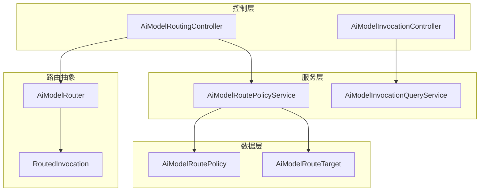
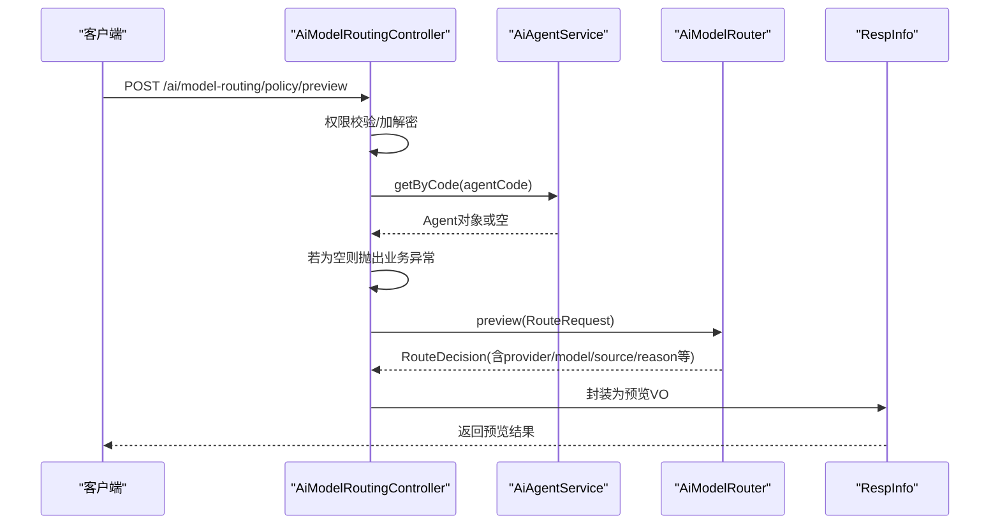
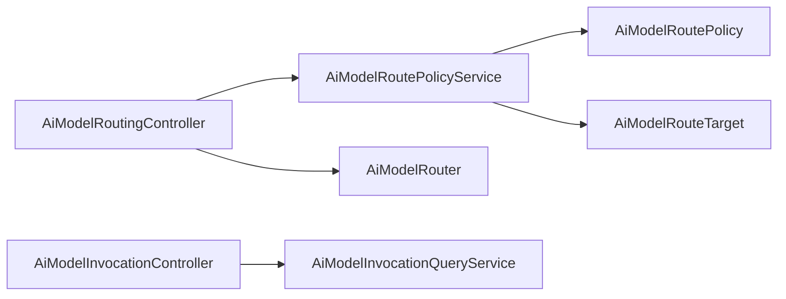

# AI模型路由

<cite>
**本文引用的文件**
- [AiModelRoutingController.java](file://forge-server/forge-framework/forge-plugin-parent/forge-plugin-ai/src/main/java/com/mdframe/forge/plugin/ai/routing/controller/AiModelRoutingController.java)
- [AiModelInvocationController.java](file://forge-server/forge-framework/forge-plugin-parent/forge-plugin-ai/src/main/java/com/mdframe/forge/plugin/ai/invocation/controller/AiModelInvocationController.java)
- [AiModelRoutePolicyService.java](file://forge-server/forge-framework/forge-plugin-parent/forge-plugin-ai/src/main/java/com/mdframe/forge/plugin/ai/routing/service/AiModelRoutePolicyService.java)
- [AiModelRouter.java](file://forge-server/forge-framework/forge-plugin-parent/forge-plugin-ai/src/main/java/com/mdframe/forge/plugin/ai/routing/AiModelRouter.java)
- [RoutedInvocation.java](file://forge-server/forge-framework/forge-plugin-parent/forge-plugin-ai/src/main/java/com/mdframe/forge/plugin/ai/routing/RoutedInvocation.java)
- [AiModelRoutePolicySaveDTO.java](file://forge-server/forge-framework/forge-plugin-parent/forge-plugin-ai/src/main/java/com/mdframe/forge/plugin/ai/routing/dto/AiModelRoutePolicySaveDTO.java)
- [AiModelRoutePreviewDTO.java](file://forge-server/forge-framework/forge-plugin-parent/forge-plugin-ai/src/main/java/com/mdframe/forge/plugin/ai/routing/dto/AiModelRoutePreviewDTO.java)
- [AiModelRoutePolicy.java](file://forge-server/forge-framework/forge-plugin-parent/forge-plugin-ai/src/main/java/com/mdframe/forge/plugin/ai/routing/domain/AiModelRoutePolicy.java)
- [AiModelRouteTarget.java](file://forge-server/forge-framework/forge-plugin-parent/forge-plugin-ai/src/main/java/com/mdframe/forge/plugin/ai/routing/domain/AiModelRouteTarget.java)
- [AiModelInvocationQueryService.java](file://forge-server/forge-framework/forge-plugin-parent/forge-plugin-ai/src/main/java/com/mdframe/forge/plugin/ai/invocation/service/AiModelInvocationQueryService.java)
</cite>

## 目录
1. [简介](#简介)
2. [项目结构](#项目结构)
3. [核心组件](#核心组件)
4. [架构总览](#架构总览)
5. [详细组件分析](#详细组件分析)
6. [依赖关系分析](#依赖关系分析)
7. [性能与成本优化](#性能与成本优化)
8. [故障转移与高可用](#故障转移与高可用)
9. [高级路由策略](#高级路由策略)
10. [配置示例与调优指南](#配置示例与调优指南)
11. [监控与运维](#监控与运维)
12. [故障排查](#故障排查)
13. [结论](#结论)

## 简介
本文件面向Forge Admin的AI模型路由能力，围绕“规则配置、负载均衡、故障转移、上下文感知、A/B测试、灰度发布、监控统计与成本优化”等主题，提供从架构到落地的完整说明。文档基于仓库中已实现的控制器、服务、数据模型与查询接口进行梳理，并给出可操作的配置与调优建议。

## 项目结构
AI模型路由功能主要位于AI插件模块内，包含以下关键层次：
- 控制层：暴露策略管理与调用日志查询的REST API
- 服务层：策略CRUD、预览决策、调用统计汇总
- 路由抽象：定义路由与预览的统一入口
- 数据层：策略与目标模型的持久化与分页查询

图表来源
- [AiModelRoutingController.java:21-85](file://forge-server/forge-framework/forge-plugin-parent/forge-plugin-ai/src/main/java/com/mdframe/forge/plugin/ai/routing/controller/AiModelRoutingController.java#L21-L85)
- [AiModelInvocationController.java:15-33](file://forge-server/forge-framework/forge-plugin-parent/forge-plugin-ai/src/main/java/com/mdframe/forge/plugin/ai/invocation/controller/AiModelInvocationController.java#L15-L33)
- [AiModelRoutePolicyService.java:26-114](file://forge-server/forge-framework/forge-plugin-parent/forge-plugin-ai/src/main/java/com/mdframe/forge/plugin/ai/routing/service/AiModelRoutePolicyService.java#L26-L114)
- [AiModelRouter.java:1-5](file://forge-server/forge-framework/forge-plugin-parent/forge-plugin-ai/src/main/java/com/mdframe/forge/plugin/ai/routing/AiModelRouter.java#L1-L5)
- [RoutedInvocation.java:1-5](file://forge-server/forge-framework/forge-plugin-parent/forge-plugin-ai/src/main/java/com/mdframe/forge/plugin/ai/routing/RoutedInvocation.java#L1-L5)
- [AiModelRoutePolicy.java](file://forge-server/forge-framework/forge-plugin-parent/forge-plugin-ai/src/main/java/com/mdframe/forge/plugin/ai/routing/domain/AiModelRoutePolicy.java)
- [AiModelRouteTarget.java](file://forge-server/forge-framework/forge-plugin-parent/forge-plugin-ai/src/main/java/com/mdframe/forge/plugin/ai/routing/domain/AiModelRouteTarget.java)

章节来源
- [AiModelRoutingController.java:21-85](file://forge-server/forge-framework/forge-plugin-parent/forge-plugin-ai/src/main/java/com/mdframe/forge/plugin/ai/routing/controller/AiModelRoutingController.java#L21-L85)
- [AiModelInvocationController.java:15-33](file://forge-server/forge-framework/forge-plugin-parent/forge-plugin-ai/src/main/java/com/mdframe/forge/plugin/ai/invocation/controller/AiModelInvocationController.java#L15-L33)

## 核心组件
- 策略管理API：提供策略分页、详情、创建、更新、删除与预览能力，支持权限控制与加解密注解
- 路由接口：统一的路由与预览方法，供上层调用或调试使用
- 策略服务：负责策略与目标的校验、持久化、视图转换与能力集处理
- 调用查询服务：提供调用日志分页与汇总（成功率、失败率、Token用量、延迟P95、估算成本）

章节来源
- [AiModelRoutingController.java:31-83](file://forge-server/forge-framework/forge-plugin-parent/forge-plugin-ai/src/main/java/com/mdframe/forge/plugin/ai/routing/controller/AiModelRoutingController.java#L31-L83)
- [AiModelRoutePolicyService.java:34-114](file://forge-server/forge-framework/forge-plugin-parent/forge-plugin-ai/src/main/java/com/mdframe/forge/plugin/ai/routing/service/AiModelRoutePolicyService.java#L34-L114)
- [AiModelInvocationQueryService.java:17-31](file://forge-server/forge-framework/forge-plugin-parent/forge-plugin-ai/src/main/java/com/mdframe/forge/plugin/ai/invocation/service/AiModelInvocationQueryService.java#L17-L31)
- [AiModelRouter.java:1-5](file://forge-server/forge-framework/forge-plugin-parent/forge-plugin-ai/src/main/java/com/mdframe/forge/plugin/ai/routing/AiModelRouter.java#L1-L5)

## 架构总览
下图展示一次“策略预览”请求在系统中的流转过程，包括权限校验、参数校验、Agent校验、路由预览与结果封装。

图表来源
- [AiModelRoutingController.java:67-83](file://forge-server/forge-framework/forge-plugin-parent/forge-plugin-ai/src/main/java/com/mdframe/forge/plugin/ai/routing/controller/AiModelRoutingController.java#L67-L83)

## 详细组件分析

### 策略管理控制器
职责
- 提供策略的分页、详情、创建、更新、删除与预览接口
- 通过权限注解保护敏感操作
- 将路由预览结果转换为前端可读的VO

关键点
- 分页查询支持关键字与状态过滤
- 创建/更新时委托服务完成校验与持久化
- 预览接口需要Agent存在性校验，再调用路由器的预览方法

章节来源
- [AiModelRoutingController.java:31-83](file://forge-server/forge-framework/forge-plugin-parent/forge-plugin-ai/src/main/java/com/mdframe/forge/plugin/ai/routing/controller/AiModelRoutingController.java#L31-L83)

### 策略服务
职责
- 策略与目标模型的CRUD
- 策略能力集序列化/反序列化
- 候选模型有效性校验（启用状态、租户归属、去重）
- 逻辑删除与关联检查（防止删除被Agent使用的策略）

校验要点
- 策略编码唯一性
- 至少一个候选模型
- 候选模型ID非空且不重复
- 候选模型必须存在、启用且属于当前租户

章节来源
- [AiModelRoutePolicyService.java:34-114](file://forge-server/forge-framework/forge-plugin-parent/forge-plugin-ai/src/main/java/com/mdframe/forge/plugin/ai/routing/service/AiModelRoutePolicyService.java#L34-L114)

### 路由抽象
职责
- 定义统一的route与preview方法
- route返回带健康租约的调用包装，便于资源释放
- preview用于无副作用的策略预演

章节来源
- [AiModelRouter.java:1-5](file://forge-server/forge-framework/forge-plugin-parent/forge-plugin-ai/src/main/java/com/mdframe/forge/plugin/ai/routing/AiModelRouter.java#L1-L5)
- [RoutedInvocation.java:1-5](file://forge-server/forge-framework/forge-plugin-parent/forge-plugin-ai/src/main/java/com/mdframe/forge/plugin/ai/routing/RoutedInvocation.java#L1-L5)

### 调用查询服务
职责
- 调用日志分页查询
- 汇总统计：总量、成功/失败/不可用次数、Prompt/Completion Token、P95延迟、估算成本（分）

注意
- 成本汇总可能触发范围异常，需在上层做好防护与提示

章节来源
- [AiModelInvocationQueryService.java:17-31](file://forge-server/forge-framework/forge-plugin-parent/forge-plugin-ai/src/main/java/com/mdframe/forge/plugin/ai/invocation/service/AiModelInvocationQueryService.java#L17-L31)

## 依赖关系分析
- 控制器依赖服务与路由抽象
- 策略服务依赖Mapper与JSON工具，负责数据一致性
- 调用查询服务依赖Mapper，提供聚合统计
- 路由抽象对外暴露统一能力，内部实现可接入多种策略引擎

图表来源
- [AiModelRoutingController.java:21-85](file://forge-server/forge-framework/forge-plugin-parent/forge-plugin-ai/src/main/java/com/mdframe/forge/plugin/ai/routing/controller/AiModelRoutingController.java#L21-L85)
- [AiModelRoutePolicyService.java:26-114](file://forge-server/forge-framework/forge-plugin-parent/forge-plugin-ai/src/main/java/com/mdframe/forge/plugin/ai/routing/service/AiModelRoutePolicyService.java#L26-L114)
- [AiModelInvocationController.java:15-33](file://forge-server/forge-framework/forge-plugin-parent/forge-plugin-ai/src/main/java/com/mdframe/forge/plugin/ai/invocation/controller/AiModelInvocationController.java#L15-L33)
- [AiModelInvocationQueryService.java:17-31](file://forge-server/forge-framework/forge-plugin-parent/forge-plugin-ai/src/main/java/com/mdframe/forge/plugin/ai/invocation/service/AiModelInvocationQueryService.java#L17-L31)

## 性能与成本优化
- 延迟优化
  - 使用P95延迟作为SLO指标，结合调用日志定位长尾问题
  - 对热点策略与模型建立缓存（如模型元信息、权重表），减少冷启动开销
- 吞吐优化
  - 合理设置候选模型优先级与并发上限，避免单点拥塞
  - 对慢模型降级或限流，保障整体SLA
- 成本优化
  - 通过汇总接口获取估算成本（分），按策略/模型维度对比ROI
  - 对高成本模型设置配额与阈值告警，自动切换至低成本替代
  - 结合能力集筛选，优先选择满足需求的最优性价比模型

[本节为通用指导，不直接分析具体文件]

## 故障转移与高可用
- 健康租约机制
  - 路由返回的调用包装包含健康租约，确保资源正确释放
- 重试与退避
  - 参考平台通用的重试策略（指数退避、限流回退、Token失效刷新后重试），对临时错误进行自动恢复
- 熔断与降级
  - 当某模型持续失败或延迟超标，将其暂时移出候选集，优先走备用模型
- 多活与隔离
  - 按租户隔离策略与模型，避免跨租户干扰
  - 多Provider并行探测，快速切换到健康节点

章节来源
- [RoutedInvocation.java:1-5](file://forge-server/forge-framework/forge-plugin-parent/forge-plugin-ai/src/main/java/com/mdframe/forge/plugin/ai/routing/RoutedInvocation.java#L1-L5)
- [AiModelRoutePolicyService.java:73-89](file://forge-server/forge-framework/forge-plugin-parent/forge-plugin-ai/src/main/java/com/mdframe/forge/plugin/ai/routing/service/AiModelRoutePolicyService.java#L73-L89)

## 高级路由策略
- 上下文感知路由
  - 依据租户、Agent、Provider、模型名称等上下文构建路由请求，动态选择最优模型
  - 结合模型能力集（如文本/图像/代码）进行匹配
- A/B测试
  - 通过策略版本或标签分流，将部分流量导向新模型，观察成功率与延迟变化
- 灰度发布
  - 逐步扩大新模型流量比例，配合监控与回滚预案，降低上线风险
- 负载均衡
  - 基于优先级、权重与实时健康状态进行加权轮询或最少连接分配
- 成本优先
  - 在满足质量与延迟的前提下，优先选择成本更低的模型

[本节为概念性说明，不直接分析具体文件]

## 配置示例与调优指南
- 策略配置项
  - 策略编码/名称：唯一标识与可读名
  - 能力集：所需模型能力列表
  - 状态：启用/禁用
  - 备注：变更说明
- 目标模型配置
  - 模型ID：候选模型
  - 优先级：数值越小越优先
  - 状态：启用/禁用
- 调优建议
  - 初期以低优先级引入新模型，观察指标后再提升优先级
  - 对高延迟或高错误率的模型设置阈值告警，自动降权
  - 定期清理无效或长期未使用的策略与目标

章节来源
- [AiModelRoutePolicySaveDTO.java](file://forge-server/forge-framework/forge-plugin-parent/forge-plugin-ai/src/main/java/com/mdframe/forge/plugin/ai/routing/dto/AiModelRoutePolicySaveDTO.java)
- [AiModelRoutePolicy.java](file://forge-server/forge-framework/forge-plugin-parent/forge-plugin-ai/src/main/java/com/mdframe/forge/plugin/ai/routing/domain/AiModelRoutePolicy.java)
- [AiModelRouteTarget.java](file://forge-server/forge-framework/forge-plugin-parent/forge-plugin-ai/src/main/java/com/mdframe/forge/plugin/ai/routing/domain/AiModelRouteTarget.java)

## 监控与运维
- 调用日志
  - 分页查询：支持按时间、Agent、Provider、模型等维度筛选
  - 汇总统计：总量、成功/失败/不可用次数、Token用量、P95延迟、估算成本
- 告警与看板
  - 基于成功率、延迟P95、成本超支等指标设置阈值告警
  - 建立策略级看板，跟踪各策略的流量占比与效果
- 审计与合规
  - 记录策略变更与调用明细，满足审计要求

章节来源
- [AiModelInvocationController.java:23-32](file://forge-server/forge-framework/forge-plugin-parent/forge-plugin-ai/src/main/java/com/mdframe/forge/plugin/ai/invocation/controller/AiModelInvocationController.java#L23-L32)
- [AiModelInvocationQueryService.java:21-31](file://forge-server/forge-framework/forge-plugin-parent/forge-plugin-ai/src/main/java/com/mdframe/forge/plugin/ai/invocation/service/AiModelInvocationQueryService.java#L21-L31)

## 故障排查
- 常见问题
  - 策略不存在：检查策略ID与状态
  - 候选模型无效：确认模型启用状态、租户归属与去重
  - 成本汇总异常：检查数据范围与精度，必要时限制查询范围
- 诊断步骤
  - 使用预览接口验证策略命中路径与原因
  - 查看调用日志与汇总，定位失败与延迟热点
  - 调整优先级与权重，观察指标变化

章节来源
- [AiModelRoutePolicyService.java:48-89](file://forge-server/forge-framework/forge-plugin-parent/forge-plugin-ai/src/main/java/com/mdframe/forge/plugin/ai/routing/service/AiModelRoutePolicyService.java#L48-L89)
- [AiModelInvocationQueryService.java:21-31](file://forge-server/forge-framework/forge-plugin-parent/forge-plugin-ai/src/main/java/com/mdframe/forge/plugin/ai/invocation/service/AiModelInvocationQueryService.java#L21-L31)

## 结论
Forge Admin的AI模型路由提供了完善的策略管理、路由预览、调用统计与成本估算能力。通过优先级、能力集与健康状态的综合调度，可实现高可用、可观测、可优化的模型调用链路。建议在生产环境结合A/B测试与灰度发布，逐步引入新模型，并以监控与告警保障稳定性与成本可控。