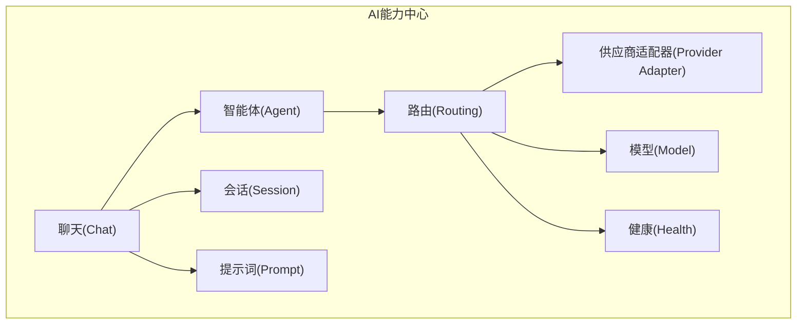
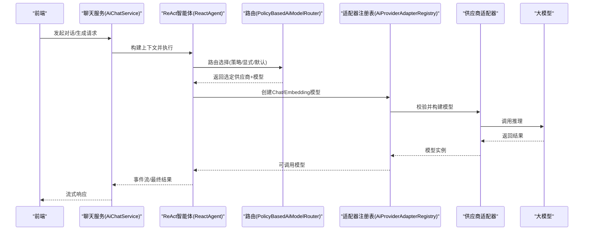
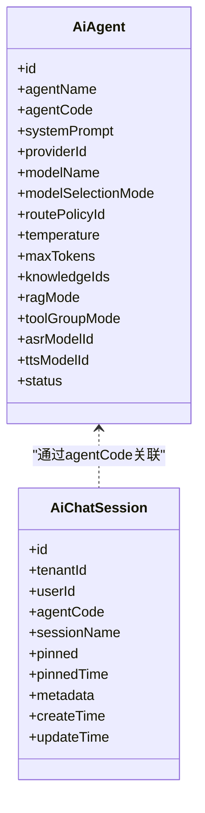
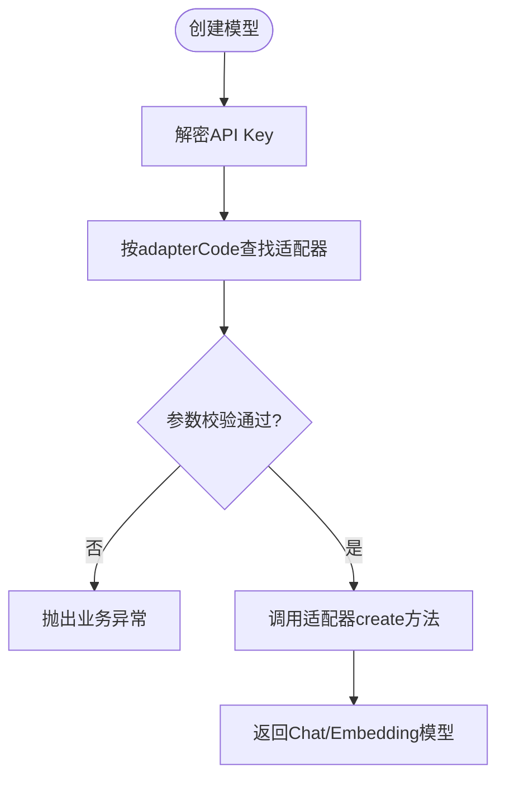
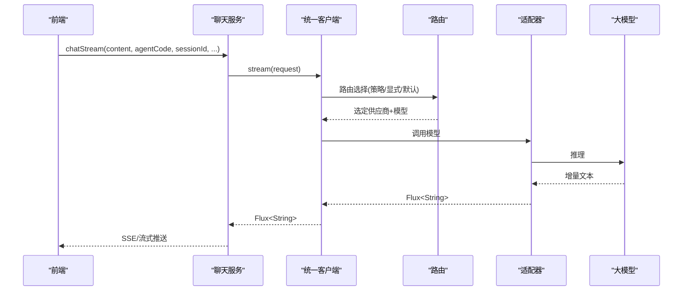
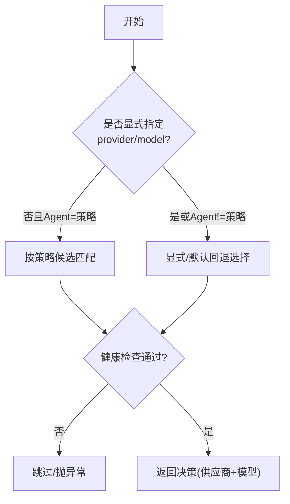
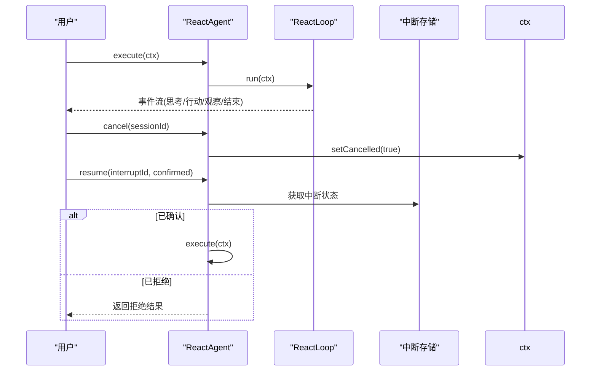
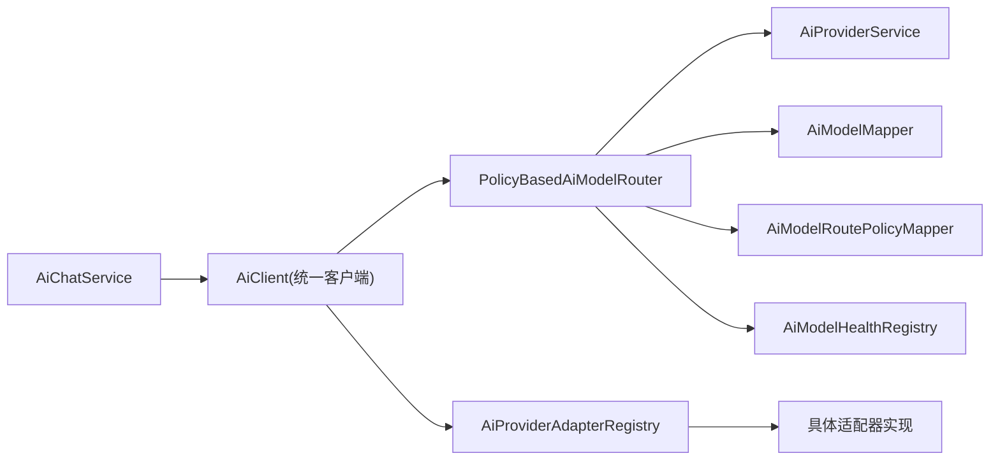
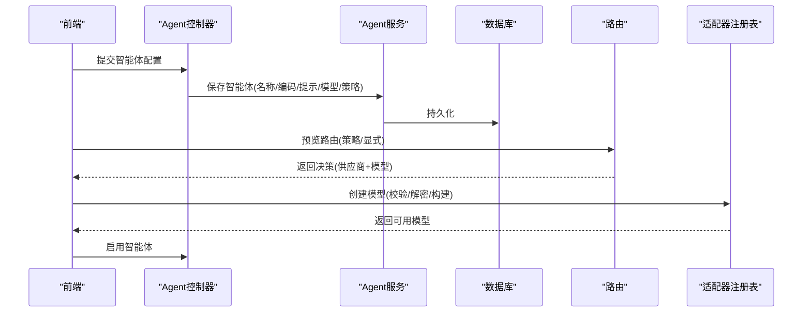

# AI能力中心

<cite>
**本文引用的文件**
- [AiAgent.java](file://forge-server/forge-framework/forge-plugin-parent/forge-plugin-ai/src/main/java/com/mdframe/forge/plugin/ai/agent/domain/AiAgent.java)
- [PolicyBasedAiModelRouter.java](file://forge-server/forge-framework/forge-plugin-parent/forge-plugin-ai/src/main/java/com/mdframe/forge/plugin/ai/routing/PolicyBasedAiModelRouter.java)
- [RouteRequest.java](file://forge-server/forge-framework/forge-plugin-parent/forge-plugin-ai/src/main/java/com/mdframe/forge/plugin/ai/routing/RouteRequest.java)
- [RouteDecision.java](file://forge-server/forge-framework/forge-plugin-parent/forge-plugin-ai/src/main/java/com/mdframe/forge/plugin/ai/routing/RouteDecision.java)
- [AiProviderAdapterRegistry.java](file://forge-server/forge-framework/forge-plugin-parent/forge-plugin-ai/src/main/java/com/mdframe/forge/plugin/ai/provider/adapter/AiProviderAdapterRegistry.java)
- [AiProvider.java](file://forge-server/forge-framework/forge-plugin-parent/forge-plugin-ai/src/main/java/com/mdframe/forge/plugin/ai/provider/domain/AiProvider.java)
- [AiModel.java](file://forge-server/forge-framework/forge-plugin-parent/forge-plugin-ai/src/main/java/com/mdframe/forge/plugin/ai/model/domain/AiModel.java)
- [AiChatSession.java](file://forge-server/forge-framework/forge-plugin-parent/forge-plugin-ai/src/main/java/com/mdframe/forge/plugin/ai/session/domain/AiChatSession.java)
- [AiPromptTemplate.java](file://forge-server/forge-framework/forge-plugin-parent/forge-plugin-ai/src/main/java/com/mdframe/forge/plugin/ai/prompt/domain/AiPromptTemplate.java)
- [AiChatService.java](file://forge-server/forge-framework/forge-plugin-parent/forge-plugin-ai/src/main/java/com/mdframe/forge/plugin/ai/chat/service/AiChatService.java)
- [ReactAgent.java](file://forge-server/forge-framework/forge-plugin-parent/forge-plugin-ai/src/main/java/com/mdframe/forge/plugin/ai/agent/engine/ReactAgent.java)
</cite>

## 目录
1. [简介](#简介)
2. [项目结构](#项目结构)
3. [核心组件](#核心组件)
4. [架构总览](#架构总览)
5. [详细组件分析](#详细组件分析)
6. [依赖关系分析](#依赖关系分析)
7. [性能考虑](#性能考虑)
8. [故障排查指南](#故障排查指南)
9. [结论](#结论)
10. [附录](#附录)

## 简介
本文件为 Forge Admin 的 AI 能力中心提供综合文档，覆盖智能体管理、AI 供应商配置、会话管理、提示词模板库、AI 模型路由等核心能力。重点说明：
- 智能体（Agent）生命周期与创建流程
- 模型路由机制与策略选择
- 供应商抽象层与适配器注册
- 会话状态管理与流式交互
- 提示词工程最佳实践
- 前端集成与 API 调用示例

## 项目结构
AI 能力中心位于插件模块 forge-plugin-ai，按领域分层组织：
- agent：智能体定义、ReAct 引擎、工具与权限
- provider：供应商配置、适配器注册与运行时选项
- model：模型元数据、能力与类型
- routing：基于策略的模型路由与健康检查
- session：会话实体与统计
- prompt：提示词模板库
- chat：聊天服务、消息组装与渲染
- client：统一客户端封装与上下文注入
- health：健康度与熔断
- knowledge/rag：知识库与检索增强
- multimodal：多模态（图像、语音）

[本节为概念性结构说明，不直接分析具体文件]

## 核心组件
- 智能体（AiAgent）：定义系统提示、默认模型、温度、最大Token、RAG模式、工具组模式、ASR/TTS模型等运行参数。
- 供应商（AiProvider）：描述供应商类型、适配器代码、API Key、Base URL、可用模型、默认模型、状态等。
- 模型（AiModel）：描述模型类型、标识、显示名、上下文窗口、价格、图标、是否默认、状态、排序等。
- 会话（AiChatSession）：会话ID、租户/用户、关联Agent编码、标题、置顶、元数据、时间戳。
- 提示词模板（AiPromptTemplate）：模板名称、编码、使用场景、业务/领域分类、标签、内容、示例输入、统计指标等。
- 路由（PolicyBasedAiModelRouter）：根据请求、Agent配置或策略选择供应商与模型，并整合健康检查。
- 适配器注册表（AiProviderAdapterRegistry）：按适配器代码注册、校验、解密密钥并构建 Chat/Embedding 模型。
- 聊天服务（AiChatService）：构造对话请求、流式输出、上下文变量注入。
- ReAct 智能体（ReactAgent）：执行新对话、取消、恢复中断（HITL）。

**章节来源**
- [AiAgent.java:1-48](file://forge-server/forge-framework/forge-plugin-parent/forge-plugin-ai/src/main/java/com/mdframe/forge/plugin/ai/agent/domain/AiAgent.java#L1-L48)
- [AiProvider.java:1-87](file://forge-server/forge-framework/forge-plugin-parent/forge-plugin-ai/src/main/java/com/mdframe/forge/plugin/ai/provider/domain/AiProvider.java#L1-L87)
- [AiModel.java:1-93](file://forge-server/forge-framework/forge-plugin-parent/forge-plugin-ai/src/main/java/com/mdframe/forge/plugin/ai/model/domain/AiModel.java#L1-L93)
- [AiChatSession.java:1-69](file://forge-server/forge-framework/forge-plugin-parent/forge-plugin-ai/src/main/java/com/mdframe/forge/plugin/ai/session/domain/AiChatSession.java#L1-L69)
- [AiPromptTemplate.java:1-62](file://forge-server/forge-framework/forge-plugin-parent/forge-plugin-ai/src/main/java/com/mdframe/forge/plugin/ai/prompt/domain/AiPromptTemplate.java#L1-L62)
- [PolicyBasedAiModelRouter.java:1-160](file://forge-server/forge-framework/forge-plugin-parent/forge-plugin-ai/src/main/java/com/mdframe/forge/plugin/ai/routing/PolicyBasedAiModelRouter.java#L1-L160)
- [AiProviderAdapterRegistry.java:1-128](file://forge-server/forge-framework/forge-plugin-parent/forge-plugin-ai/src/main/java/com/mdframe/forge/plugin/ai/provider/adapter/AiProviderAdapterRegistry.java#L1-L128)
- [AiChatService.java:1-139](file://forge-server/forge-framework/forge-plugin-parent/forge-plugin-ai/src/main/java/com/mdframe/forge/plugin/ai/chat/service/AiChatService.java#L1-L139)
- [ReactAgent.java:1-74](file://forge-server/forge-framework/forge-plugin-parent/forge-plugin-ai/src/main/java/com/mdframe/forge/plugin/ai/agent/engine/ReactAgent.java#L1-L74)

## 架构总览
AI 能力中心采用“智能体驱动 + 策略路由 + 供应商抽象”的分层架构：
- 上层：智能体编排与对话入口（ReAct 引擎、聊天服务）
- 中层：模型路由（策略优先、显式指定、默认回退）与健康检查
- 下层：供应商适配器（OpenAI 兼容、DashScope 原生等）与模型实例化

**图表来源**
- [AiChatService.java:25-74](file://forge-server/forge-framework/forge-plugin-parent/forge-plugin-ai/src/main/java/com/mdframe/forge/plugin/ai/chat/service/AiChatService.java#L25-L74)
- [ReactAgent.java:30-72](file://forge-server/forge-framework/forge-plugin-parent/forge-plugin-ai/src/main/java/com/mdframe/forge/plugin/ai/agent/engine/ReactAgent.java#L30-L72)
- [PolicyBasedAiModelRouter.java:33-122](file://forge-server/forge-framework/forge-plugin-parent/forge-plugin-ai/src/main/java/com/mdframe/forge/plugin/ai/routing/PolicyBasedAiModelRouter.java#L33-L122)
- [AiProviderAdapterRegistry.java:62-98](file://forge-server/forge-framework/forge-plugin-parent/forge-plugin-ai/src/main/java/com/mdframe/forge/plugin/ai/provider/adapter/AiProviderAdapterRegistry.java#L62-L98)

## 详细组件分析

### 智能体管理与会话管理
- 智能体字段涵盖系统提示、默认模型、温度、最大Token、RAG模式、工具组模式、ASR/TTS模型、知识ID集合等，支撑多样化任务编排。
- 会话实体支持租户隔离、用户维度、关联 Agent 编码、标题、置顶、元数据扩展，便于多轮对话与上下文管理。

**图表来源**
- [AiAgent.java:1-48](file://forge-server/forge-framework/forge-plugin-parent/forge-plugin-ai/src/main/java/com/mdframe/forge/plugin/ai/agent/domain/AiAgent.java#L1-L48)
- [AiChatSession.java:1-69](file://forge-server/forge-framework/forge-plugin-parent/forge-plugin-ai/src/main/java/com/mdframe/forge/plugin/ai/session/domain/AiChatSession.java#L1-L69)

**章节来源**
- [AiAgent.java:1-48](file://forge-server/forge-framework/forge-plugin-parent/forge-plugin-ai/src/main/java/com/mdframe/forge/plugin/ai/agent/domain/AiAgent.java#L1-L48)
- [AiChatSession.java:1-69](file://forge-server/forge-framework/forge-plugin-parent/forge-plugin-ai/src/main/java/com/mdframe/forge/plugin/ai/session/domain/AiChatSession.java#L1-L69)

### AI 供应商配置与适配器抽象层
- 供应商实体记录类型、适配器代码、API Key、Base URL、可用模型、默认模型、状态等。
- 适配器注册表负责：
  - 按适配器代码查找实现
  - 校验参数
  - 解密存储的 API Key
  - 构建 Chat/Embedding 模型
- 支持 OpenAI 兼容与 DashScope 原生等多种接入方式。

**图表来源**
- [AiProviderAdapterRegistry.java:62-98](file://forge-server/forge-framework/forge-plugin-parent/forge-plugin-ai/src/main/java/com/mdframe/forge/plugin/ai/provider/adapter/AiProviderAdapterRegistry.java#L62-L98)
- [AiProviderAdapterRegistry.java:107-126](file://forge-server/forge-framework/forge-plugin-parent/forge-plugin-ai/src/main/java/com/mdframe/forge/plugin/ai/provider/adapter/AiProviderAdapterRegistry.java#L107-L126)

**章节来源**
- [AiProvider.java:1-87](file://forge-server/forge-framework/forge-plugin-parent/forge-plugin-ai/src/main/java/com/mdframe/forge/plugin/ai/provider/domain/AiProvider.java#L1-L87)
- [AiProviderAdapterRegistry.java:1-128](file://forge-server/forge-framework/forge-plugin-parent/forge-plugin-ai/src/main/java/com/mdframe/forge/plugin/ai/provider/adapter/AiProviderAdapterRegistry.java#L1-L128)

### 会话管理与流式交互
- 聊天服务负责拼装用户提示、上下文变量（项目名、画布尺寸、风格、数据集上下文等），并通过统一客户端进行流式调用。
- 支持非流式与流式两种模式，便于前端实时渲染。

**图表来源**
- [AiChatService.java:57-74](file://forge-server/forge-framework/forge-plugin-parent/forge-plugin-ai/src/main/java/com/mdframe/forge/plugin/ai/chat/service/AiChatService.java#L57-L74)
- [PolicyBasedAiModelRouter.java:33-77](file://forge-server/forge-framework/forge-plugin-parent/forge-plugin-ai/src/main/java/com/mdframe/forge/plugin/ai/routing/PolicyBasedAiModelRouter.java#L33-L77)

**章节来源**
- [AiChatService.java:25-74](file://forge-server/forge-framework/forge-plugin-parent/forge-plugin-ai/src/main/java/com/mdframe/forge/plugin/ai/chat/service/AiChatService.java#L25-L74)

### 提示词模板库与工程最佳实践
- 提示词模板实体包含模板编码、使用场景、业务/领域分类、标签、内容、示例输入、推荐标记、排序、使用/测试/下载计数等，便于版本化与复用。
- 最佳实践建议：
  - 将通用指令抽离为模板，结合业务上下文动态填充
  - 明确角色、目标、约束、输出格式
  - 使用示例输入提升稳定性
  - 对敏感信息进行脱敏处理
  - 通过 useCount/testCount 评估模板质量

**章节来源**
- [AiPromptTemplate.java:1-62](file://forge-server/forge-framework/forge-plugin-parent/forge-plugin-ai/src/main/java/com/mdframe/forge/plugin/ai/prompt/domain/AiPromptTemplate.java#L1-L62)

### AI 模型路由机制
- 路由决策优先级：
  - 若未显式指定供应商与模型，且 Agent 选择模式为策略，则按策略候选顺序匹配（能力、状态、租户一致性）
  - 否则按请求显式指定、Agent 默认模型、供应商默认模型依次回退
- 健康检查：
  - 预览模式仅读取快照，不占用租约
  - 实际调用尝试获取健康租约，失败时抛出业务异常或跳过候选
- 租户隔离：
  - 严格校验资源归属当前租户

**图表来源**
- [PolicyBasedAiModelRouter.java:36-122](file://forge-server/forge-framework/forge-plugin-parent/forge-plugin-ai/src/main/java/com/mdframe/forge/plugin/ai/routing/PolicyBasedAiModelRouter.java#L36-L122)

**章节来源**
- [PolicyBasedAiModelRouter.java:1-160](file://forge-server/forge-framework/forge-plugin-parent/forge-plugin-ai/src/main/java/com/mdframe/forge/plugin/ai/routing/PolicyBasedAiModelRouter.java#L1-L160)
- [RouteRequest.java:1-3](file://forge-server/forge-framework/forge-plugin-parent/forge-plugin-ai/src/main/java/com/mdframe/forge/plugin/ai/routing/RouteRequest.java#L1-L3)
- [RouteDecision.java:1-11](file://forge-server/forge-framework/forge-plugin-parent/forge-plugin-ai/src/main/java/com/mdframe/forge/plugin/ai/routing/RouteDecision.java#L1-L11)

### ReAct 智能体执行与 HITL 恢复
- ReactAgent 提供 execute（新对话）与 resume（恢复中断）两个入口，维护活跃上下文映射，支持取消与确认/拒绝的用户介入。
- 适合复杂任务的多步推理与工具调用场景。

**图表来源**
- [ReactAgent.java:30-72](file://forge-server/forge-framework/forge-plugin-parent/forge-plugin-ai/src/main/java/com/mdframe/forge/plugin/ai/agent/engine/ReactAgent.java#L30-L72)

**章节来源**
- [ReactAgent.java:1-74](file://forge-server/forge-framework/forge-plugin-parent/forge-plugin-ai/src/main/java/com/mdframe/forge/plugin/ai/agent/engine/ReactAgent.java#L1-L74)

## 依赖关系分析
- 聊天服务依赖统一客户端，客户端再依赖路由与适配器注册表。
- 路由依赖供应商服务、模型映射、策略映射、健康注册表。
- 适配器注册表依赖各具体适配器实现与密钥加密组件。
- 会话与提示词作为上下文与配置被聊天服务消费。

**图表来源**
- [AiChatService.java:25-74](file://forge-server/forge-framework/forge-plugin-parent/forge-plugin-ai/src/main/java/com/mdframe/forge/plugin/ai/chat/service/AiChatService.java#L25-L74)
- [PolicyBasedAiModelRouter.java:23-31](file://forge-server/forge-framework/forge-plugin-parent/forge-plugin-ai/src/main/java/com/mdframe/forge/plugin/ai/routing/PolicyBasedAiModelRouter.java#L23-L31)
- [AiProviderAdapterRegistry.java:23-37](file://forge-server/forge-framework/forge-plugin-parent/forge-plugin-ai/src/main/java/com/mdframe/forge/plugin/ai/provider/adapter/AiProviderAdapterRegistry.java#L23-L37)

**章节来源**
- [AiChatService.java:1-139](file://forge-server/forge-framework/forge-plugin-parent/forge-plugin-ai/src/main/java/com/mdframe/forge/plugin/ai/chat/service/AiChatService.java#L1-L139)
- [PolicyBasedAiModelRouter.java:1-160](file://forge-server/forge-framework/forge-plugin-parent/forge-plugin-ai/src/main/java/com/mdframe/forge/plugin/ai/routing/PolicyBasedAiModelRouter.java#L1-L160)
- [AiProviderAdapterRegistry.java:1-128](file://forge-server/forge-framework/forge-plugin-parent/forge-plugin-ai/src/main/java/com/mdframe/forge/plugin/ai/provider/adapter/AiProviderAdapterRegistry.java#L1-L128)

## 性能考虑
- 路由健康检查与熔断：避免调用不可用模型，减少无效请求。
- 流式响应：降低首字节延迟，提升用户体验。
- 上下文裁剪：在长对话中按需修剪历史，控制 Token 消耗。
- 缓存与预热：对常用供应商/模型连接进行缓存，减少冷启动开销。
- 并发与限流：结合健康注册表与重试策略，防止雪崩。

[本节为通用性能建议，不直接分析具体文件]

## 故障排查指南
- 路由失败常见原因：
  - 未配置路由策略或策略停用
  - 候选模型能力不满足要求
  - 供应商或模型状态为停用
  - 租户不一致
- 健康检查失败：
  - 模型处于熔断或不可用状态
  - 健康租约获取失败
- 适配器问题：
  - 适配器代码未注册
  - 参数校验失败
  - API Key 未正确解密
- 建议排查步骤：
  - 检查 Agent 的路由模式与策略配置
  - 核对供应商与模型状态、默认模型设置
  - 查看健康注册表快照与租约状态
  - 验证适配器代码与参数

**章节来源**
- [PolicyBasedAiModelRouter.java:79-122](file://forge-server/forge-framework/forge-plugin-parent/forge-plugin-ai/src/main/java/com/mdframe/forge/plugin/ai/routing/PolicyBasedAiModelRouter.java#L79-L122)
- [AiProviderAdapterRegistry.java:45-78](file://forge-server/forge-framework/forge-plugin-parent/forge-plugin-ai/src/main/java/com/mdframe/forge/plugin/ai/provider/adapter/AiProviderAdapterRegistry.java#L45-L78)

## 结论
Forge Admin 的 AI 能力中心以智能体为核心，通过策略路由与供应商抽象层，实现对多种 AI 服务的统一接入与治理。配合会话管理、提示词模板库与健康检查，形成稳定、可扩展、可观测的 AI 基础设施。建议在业务侧优先采用策略路由与流式交互，并结合健康监控与日志审计持续优化。

[本节为总结性内容，不直接分析具体文件]

## 附录

### API 调用示例（后端服务层）
- 生成仪表盘（非流式）
  - 入口：AiChatService.generateDashboard
  - 关键参数：prompt、projectName、canvasContext、businessContext、canvasWidth/Height、style、componentCatalog
  - 行为：构建上下文变量，调用统一客户端，返回内容或抛出回退异常
  - 参考路径：[AiChatService.java:25-40](file://forge-server/forge-framework/forge-plugin-parent/forge-plugin-ai/src/main/java/com/mdframe/forge/plugin/ai/chat/service/AiChatService.java#L25-L40)

- 生成仪表盘（流式）
  - 入口：AiChatService.generateDashboardStream
  - 关键参数：同上，增加 sessionId
  - 行为：返回 Flux<String> 流式响应
  - 参考路径：[AiChatService.java:42-55](file://forge-server/forge-framework/forge-plugin-parent/forge-plugin-ai/src/main/java/com/mdframe/forge/plugin/ai/chat/service/AiChatService.java#L42-L55)

- 聊天流式
  - 入口：AiChatService.chatStream
  - 关键参数：content、agentCode、sessionId、userId、providerId、modelName、temperature、maxTokens、projectName、canvasContext
  - 行为：拼装用户提示与上下文，调用统一客户端流式接口
  - 参考路径：[AiChatService.java:57-74](file://forge-server/forge-framework/forge-plugin-parent/forge-plugin-ai/src/main/java/com/mdframe/forge/plugin/ai/chat/service/AiChatService.java#L57-L74)

### 前端组件集成指南
- 会话列表与新建
  - 使用会话实体字段（id、agentCode、sessionName、pinned、metadata）展示与管理
  - 支持置顶与元数据扩展（如 configKey、tableName）
  - 参考路径：[AiChatSession.java:30-69](file://forge-server/forge-framework/forge-plugin-parent/forge-plugin-ai/src/main/java/com/mdframe/forge/plugin/ai/session/domain/AiChatSession.java#L30-L69)

- 智能体创建与配置
  - 填写系统提示、默认模型、温度、最大Token、RAG模式、工具组模式、知识ID集合等
  - 参考路径：[AiAgent.java:24-43](file://forge-server/forge-framework/forge-plugin-parent/forge-plugin-ai/src/main/java/com/mdframe/forge/plugin/ai/agent/domain/AiAgent.java#L24-L43)

- 供应商配置
  - 选择供应商类型与适配器代码，配置 API Key、Base URL、默认模型
  - 参考路径：[AiProvider.java:26-74](file://forge-server/forge-framework/forge-plugin-parent/forge-plugin-ai/src/main/java/com/mdframe/forge/plugin/ai/provider/domain/AiProvider.java#L26-L74)

- 模型路由预览与选择
  - 使用路由预览接口获取决策信息（供应商、模型、来源、原因、跳过候选）
  - 参考路径：[PolicyBasedAiModelRouter.java:33-34](file://forge-server/forge-framework/forge-plugin-parent/forge-plugin-ai/src/main/java/com/mdframe/forge/plugin/ai/routing/PolicyBasedAiModelRouter.java#L33-L34)

- 提示词模板使用
  - 按模板编码加载模板内容，结合业务上下文动态填充
  - 参考路径：[AiPromptTemplate.java:27-59](file://forge-server/forge-framework/forge-plugin-parent/forge-plugin-ai/src/main/java/com/mdframe/forge/plugin/ai/prompt/domain/AiPromptTemplate.java#L27-L59)

### 智能体创建流程（端到端）

[本节为流程示意，不直接分析具体文件]