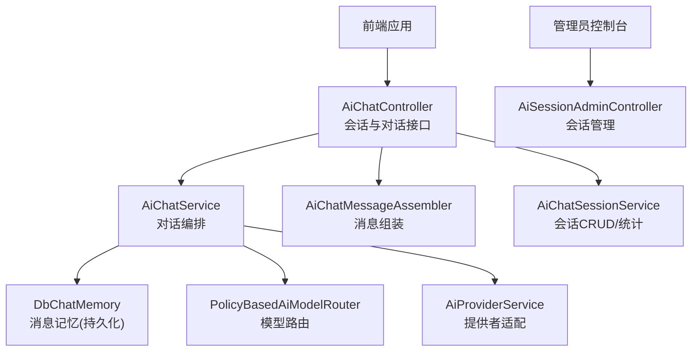
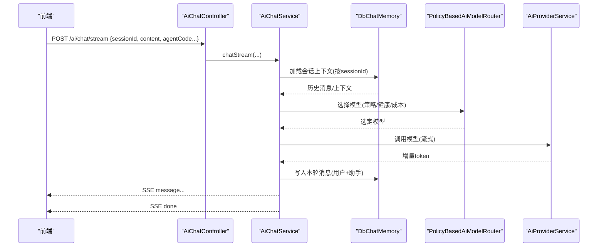
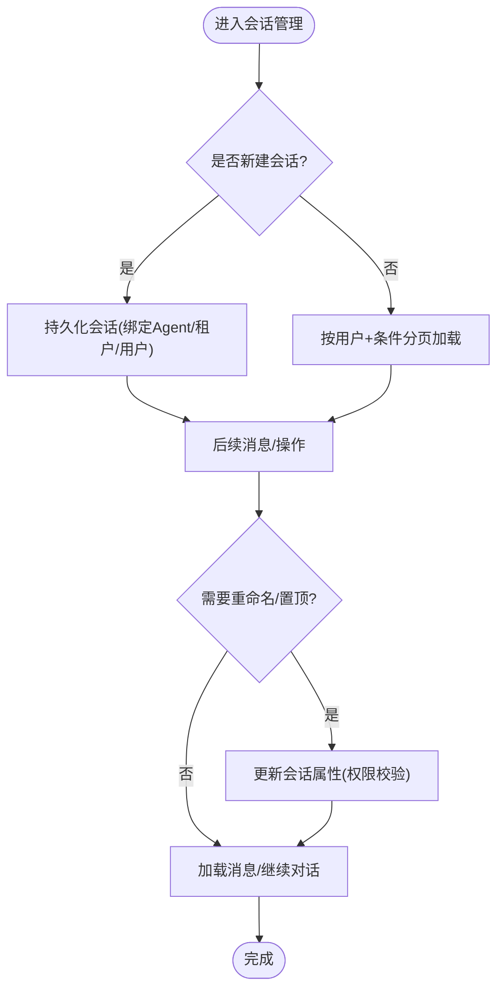
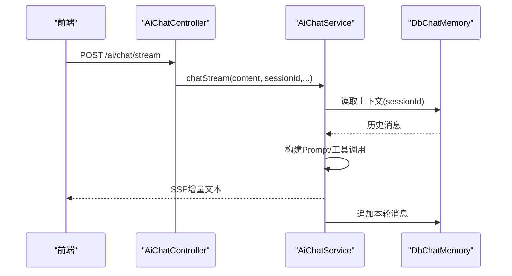
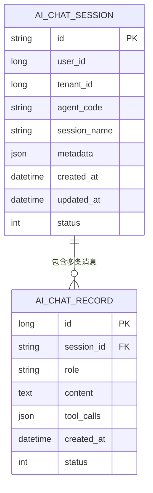
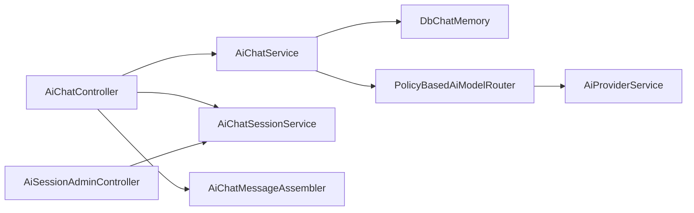

# 会话管理

<cite>
**本文引用的文件**
- [AiChatController.java](file://forge-server/forge-framework/forge-plugin-parent/forge-plugin-ai/src/main/java/com/mdframe/forge/plugin/ai/chat/controller/AiChatController.java)
- [AiSessionAdminController.java](file://forge-server/forge-framework/forge-plugin-parent/forge-plugin-ai/src/main/java/com/mdframe/forge/plugin/ai/admin/controller/AiSessionAdminController.java)
- [AiChatService.java](file://forge-server/forge-framework/forge-plugin-parent/forge-plugin-ai/src/main/java/com/mdframe/forge/plugin/ai/chat/service/AiChatService.java)
- [AiChatMessageAssembler.java](file://forge-server/forge-framework/forge-plugin-parent/forge-plugin-ai/src/main/java/com/mdframe/forge/plugin/ai/chat/service/AiChatMessageAssembler.java)
- [AiChatSessionService.java](file://forge-server/forge-framework/forge-plugin-parent/forge-plugin-ai/src/main/java/com/mdframe/forge/plugin/ai/session/service/AiChatSessionService.java)
- [AiChatSession.java](file://forge-server/forge-framework/forge-plugin-parent/forge-plugin-ai/src/main/java/com/mdframe/forge/plugin/ai/session/domain/AiChatSession.java)
- [AiChatRecord.java](file://forge-server/forge-framework/forge-plugin-parent/forge-plugin-ai/src/main/java/com/mdframe/forge/plugin/ai/chat/domain/AiChatRecord.java)
- [DbChatMemory.java](file://forge-server/forge-framework/forge-plugin-parent/forge-plugin-ai/src/main/java/com/mdframe/forge/plugin/ai/chat/memory/DbChatMemory.java)
- [PolicyBasedAiModelRouter.java](file://forge-server/forge-framework/forge-plugin-parent/forge-plugin-ai/src/main/java/com/mdframe/forge/plugin/ai/routing/PolicyBasedAiModelRouter.java)
- [AiProviderService.java](file://forge-server/forge-framework/forge-plugin-parent/forge-plugin-ai/src/main/java/com/mdframe/forge/plugin/ai/provider/service/AiProviderService.java)
</cite>

## 目录
1. [简介](#简介)
2. [项目结构](#项目结构)
3. [核心组件](#核心组件)
4. [架构总览](#架构总览)
5. [详细组件分析](#详细组件分析)
6. [依赖关系分析](#依赖关系分析)
7. [性能与优化](#性能与优化)
8. [故障排查指南](#故障排查指南)
9. [结论](#结论)
10. [附录：API 调用示例与前端集成](#附录api-调用示例与前端集成)

## 简介
本文件面向 Forge Admin 的 AI 会话管理功能，系统化说明会话的创建、维护、状态管理与持久化机制；详解多轮对话处理、上下文保持与消息历史管理；并给出并发控制、内存优化、数据同步等性能策略。同时提供会话 API 调用示例与前端实时聊天界面集成方案，帮助快速落地生产级应用。

## 项目结构
AI 会话能力集中在 AI 插件模块中，关键目录与职责如下：
- chat/controller：对外暴露会话与流式对话接口（SSE）
- chat/service：对话编排、消息组装、提示词渲染等
- chat/memory：基于数据库的消息记忆层，实现上下文持久化
- session/domain/dto/service/vo/mapper：会话实体、查询与统计、服务层
- admin/controller：管理员侧会话管理与统计
- routing/provider：模型路由与健康检查，支撑高可用与成本优化

图表来源
- [AiChatController.java:30-195](file://forge-server/forge-framework/forge-plugin-parent/forge-plugin-ai/src/main/java/com/mdframe/forge/plugin/ai/chat/controller/AiChatController.java#L30-L195)
- [AiChatService.java](file://forge-server/forge-framework/forge-plugin-parent/forge-plugin-ai/src/main/java/com/mdframe/forge/plugin/ai/chat/service/AiChatService.java)
- [AiChatMessageAssembler.java](file://forge-server/forge-framework/forge-plugin-parent/forge-plugin-ai/src/main/java/com/mdframe/forge/plugin/ai/chat/service/AiChatMessageAssembler.java)
- [DbChatMemory.java](file://forge-server/forge-framework/forge-plugin-parent/forge-plugin-ai/src/main/java/com/mdframe/forge/plugin/ai/chat/memory/DbChatMemory.java)
- [PolicyBasedAiModelRouter.java:156-159](file://forge-server/forge-framework/forge-plugin-parent/forge-plugin-ai/src/main/java/com/mdframe/forge/plugin/ai/routing/PolicyBasedAiModelRouter.java#L156-L159)
- [AiProviderService.java:574-596](file://forge-server/forge-framework/forge-plugin-parent/forge-plugin-ai/src/main/java/com/mdframe/forge/plugin/ai/provider/service/AiProviderService.java#L574-L596)
- [AiSessionAdminController.java:22-69](file://forge-server/forge-framework/forge-plugin-parent/forge-plugin-ai/src/main/java/com/mdframe/forge/plugin/ai/admin/controller/AiSessionAdminController.java#L22-L69)

章节来源
- [AiChatController.java:30-195](file://forge-server/forge-framework/forge-plugin-parent/forge-plugin-ai/src/main/java/com/mdframe/forge/plugin/ai/chat/controller/AiChatController.java#L30-L195)
- [AiSessionAdminController.java:22-69](file://forge-server/forge-framework/forge-plugin-parent/forge-plugin-ai/src/main/java/com/mdframe/forge/plugin/ai/admin/controller/AiSessionAdminController.java#L22-L69)

## 核心组件
- 会话控制器（AiChatController）：统一暴露会话创建、分页、重命名、删除、置顶、消息分页与流式对话等接口
- 会话服务（AiChatSessionService）：会话生命周期管理、权限校验、统计指标、经验指标
- 对话服务（AiChatService）：多轮对话编排、上下文加载、流式输出、错误恢复
- 消息组装器（AiChatMessageAssembler）：会话消息聚合、分页、历史回溯
- 消息记忆（DbChatMemory）：以数据库为后端的消息上下文存储，支持长会话上滑加载
- 模型路由（PolicyBasedAiModelRouter）：按策略选择模型，结合健康度与成本进行决策
- 提供者服务（AiProviderService）：模型调用适配、健康探测、元数据提取

章节来源
- [AiChatController.java:30-195](file://forge-server/forge-framework/forge-plugin-parent/forge-plugin-ai/src/main/java/com/mdframe/forge/plugin/ai/chat/controller/AiChatController.java#L30-L195)
- [AiChatSessionService.java](file://forge-server/forge-framework/forge-plugin-parent/forge-plugin-ai/src/main/java/com/mdframe/forge/plugin/ai/session/service/AiChatSessionService.java)
- [AiChatService.java](file://forge-server/forge-framework/forge-plugin-parent/forge-plugin-ai/src/main/java/com/mdframe/forge/plugin/ai/chat/service/AiChatService.java)
- [AiChatMessageAssembler.java](file://forge-server/forge-framework/forge-plugin-parent/forge-plugin-ai/src/main/java/com/mdframe/forge/plugin/ai/chat/service/AiChatMessageAssembler.java)
- [DbChatMemory.java](file://forge-server/forge-framework/forge-plugin-parent/forge-plugin-ai/src/main/java/com/mdframe/forge/plugin/ai/chat/memory/DbChatMemory.java)
- [PolicyBasedAiModelRouter.java:156-159](file://forge-server/forge-framework/forge-plugin-parent/forge-plugin-ai/src/main/java/com/mdframe/forge/plugin/ai/routing/PolicyBasedAiModelRouter.java#L156-L159)
- [AiProviderService.java:574-596](file://forge-server/forge-framework/forge-plugin-parent/forge-plugin-ai/src/main/java/com/mdframe/forge/plugin/ai/provider/service/AiProviderService.java#L574-L596)

## 架构总览
下图展示一次“用户发起多轮对话”的端到端流程：前端通过 SSE 接收增量文本，后端在每次请求中根据 sessionId 加载上下文，路由到合适的模型，并将新消息持久化到数据库，保证会话可回溯与跨设备一致。

图表来源
- [AiChatController.java:74-97](file://forge-server/forge-framework/forge-plugin-parent/forge-plugin-ai/src/main/java/com/mdframe/forge/plugin/ai/chat/controller/AiChatController.java#L74-L97)
- [AiChatService.java](file://forge-server/forge-framework/forge-plugin-parent/forge-plugin-ai/src/main/java/com/mdframe/forge/plugin/ai/chat/service/AiChatService.java)
- [DbChatMemory.java](file://forge-server/forge-framework/forge-plugin-parent/forge-plugin-ai/src/main/java/com/mdframe/forge/plugin/ai/chat/memory/DbChatMemory.java)
- [PolicyBasedAiModelRouter.java:156-159](file://forge-server/forge-framework/forge-plugin-parent/forge-plugin-ai/src/main/java/com/mdframe/forge/plugin/ai/routing/PolicyBasedAiModelRouter.java#L156-L159)
- [AiProviderService.java:574-596](file://forge-server/forge-framework/forge-plugin-parent/forge-plugin-ai/src/main/java/com/mdframe/forge/plugin/ai/provider/service/AiProviderService.java#L574-L596)

## 详细组件分析

### 会话生命周期与持久化
- 创建会话：服务端幂等创建，绑定 Agent、租户与用户，标题由服务端规则生成
- 会话列表与分页：按当前登录用户过滤，支持关键词与 Agent 过滤，上滑加载
- 会话重命名/置顶/删除：权限校验，软删除或状态变更
- 会话元数据：管理员可更新会话元信息用于审计与分析

图表来源
- [AiChatController.java:101-195](file://forge-server/forge-framework/forge-plugin-parent/forge-plugin-ai/src/main/java/com/mdframe/forge/plugin/ai/chat/controller/AiChatController.java#L101-L195)
- [AiSessionAdminController.java:33-69](file://forge-server/forge-framework/forge-plugin-parent/forge-plugin-ai/src/main/java/com/mdframe/forge/plugin/ai/admin/controller/AiSessionAdminController.java#L33-L69)

章节来源
- [AiChatController.java:101-195](file://forge-server/forge-framework/forge-plugin-parent/forge-plugin-ai/src/main/java/com/mdframe/forge/plugin/ai/chat/controller/AiChatController.java#L101-L195)
- [AiSessionAdminController.java:33-69](file://forge-server/forge-framework/forge-plugin-parent/forge-plugin-ai/src/main/java/com/mdframe/forge/plugin/ai/admin/controller/AiSessionAdminController.java#L33-L69)

### 多轮对话与上下文保持
- 上下文加载：每次对话前按 sessionId 从 DbChatMemory 加载历史消息，确保多轮连贯性
- 消息写入：将用户输入与助手回复持久化，支持长会话上滑加载更早消息
- 消息分页：支持 beforeId 分页，避免一次性加载大量历史导致性能问题

图表来源
- [AiChatController.java:74-97](file://forge-server/forge-framework/forge-plugin-parent/forge-plugin-ai/src/main/java/com/mdframe/forge/plugin/ai/chat/controller/AiChatController.java#L74-L97)
- [AiChatMessageAssembler.java](file://forge-server/forge-framework/forge-plugin-parent/forge-plugin-ai/src/main/java/com/mdframe/forge/plugin/ai/chat/service/AiChatMessageAssembler.java)
- [DbChatMemory.java](file://forge-server/forge-framework/forge-plugin-parent/forge-plugin-ai/src/main/java/com/mdframe/forge/plugin/ai/chat/memory/DbChatMemory.java)

章节来源
- [AiChatController.java:74-97](file://forge-server/forge-framework/forge-plugin-parent/forge-plugin-ai/src/main/java/com/mdframe/forge/plugin/ai/chat/controller/AiChatController.java#L74-L97)
- [AiChatMessageAssembler.java](file://forge-server/forge-framework/forge-plugin-parent/forge-plugin-ai/src/main/java/com/mdframe/forge/plugin/ai/chat/service/AiChatMessageAssembler.java)
- [DbChatMemory.java](file://forge-server/forge-framework/forge-plugin-parent/forge-plugin-ai/src/main/java/com/mdframe/forge/plugin/ai/chat/memory/DbChatMemory.java)

### 消息历史管理
- 会话消息聚合：将用户与助手消息合并为统一视图，便于前端渲染
- 分页回溯：支持 beforeId 分页，适合长会话的上滑加载场景
- 单条消息删除：软删除，保留审计痕迹

章节来源
- [AiChatController.java:146-174](file://forge-server/forge-framework/forge-plugin-parent/forge-plugin-ai/src/main/java/com/mdframe/forge/plugin/ai/chat/controller/AiChatController.java#L146-L174)
- [AiChatMessageAssembler.java](file://forge-server/forge-framework/forge-plugin-parent/forge-plugin-ai/src/main/java/com/mdframe/forge/plugin/ai/chat/service/AiChatMessageAssembler.java)

### 模型路由与健康
- 策略路由：根据租户、模型能力、价格、上下文窗口等维度选择最优模型
- 健康探测：对模型连接进行测试，失败时降级或告警
- 推理内容提取：从消息元数据中提取推理过程，便于调试与审计

章节来源
- [PolicyBasedAiModelRouter.java:156-159](file://forge-server/forge-framework/forge-plugin-parent/forge-plugin-ai/src/main/java/com/mdframe/forge/plugin/ai/routing/PolicyBasedAiModelRouter.java#L156-L159)
- [AiProviderService.java:574-596](file://forge-server/forge-framework/forge-plugin-parent/forge-plugin-ai/src/main/java/com/mdframe/forge/plugin/ai/provider/service/AiProviderService.java#L574-L596)

### 数据模型概览

图表来源
- [AiChatSession.java](file://forge-server/forge-framework/forge-plugin-parent/forge-plugin-ai/src/main/java/com/mdframe/forge/plugin/ai/session/domain/AiChatSession.java)
- [AiChatRecord.java](file://forge-server/forge-framework/forge-plugin-parent/forge-plugin-ai/src/main/java/com/mdframe/forge/plugin/ai/chat/domain/AiChatRecord.java)

## 依赖关系分析
- 控制器依赖服务：AiChatController 依赖 AiChatService、AiChatSessionService、AiChatMessageAssembler
- 服务依赖记忆与路由：AiChatService 依赖 DbChatMemory 与 PolicyBasedAiModelRouter
- 路由依赖提供者：PolicyBasedAiModelRouter 与 AiProviderService 协作完成模型调用与健康检测
- 管理员接口独立：AiSessionAdminController 仅依赖会话服务与消息组装器

图表来源
- [AiChatController.java:30-195](file://forge-server/forge-framework/forge-plugin-parent/forge-plugin-ai/src/main/java/com/mdframe/forge/plugin/ai/chat/controller/AiChatController.java#L30-L195)
- [AiChatService.java](file://forge-server/forge-framework/forge-plugin-parent/forge-plugin-ai/src/main/java/com/mdframe/forge/plugin/ai/chat/service/AiChatService.java)
- [AiChatSessionService.java](file://forge-server/forge-framework/forge-plugin-parent/forge-plugin-ai/src/main/java/com/mdframe/forge/plugin/ai/session/service/AiChatSessionService.java)
- [AiChatMessageAssembler.java](file://forge-server/forge-framework/forge-plugin-parent/forge-plugin-ai/src/main/java/com/mdframe/forge/plugin/ai/chat/service/AiChatMessageAssembler.java)
- [DbChatMemory.java](file://forge-server/forge-framework/forge-plugin-parent/forge-plugin-ai/src/main/java/com/mdframe/forge/plugin/ai/chat/memory/DbChatMemory.java)
- [PolicyBasedAiModelRouter.java:156-159](file://forge-server/forge-framework/forge-plugin-parent/forge-plugin-ai/src/main/java/com/mdframe/forge/plugin/ai/routing/PolicyBasedAiModelRouter.java#L156-L159)
- [AiProviderService.java:574-596](file://forge-server/forge-framework/forge-plugin-parent/forge-plugin-ai/src/main/java/com/mdframe/forge/plugin/ai/provider/service/AiProviderService.java#L574-L596)
- [AiSessionAdminController.java:22-69](file://forge-server/forge-framework/forge-plugin-parent/forge-plugin-ai/src/main/java/com/mdframe/forge/plugin/ai/admin/controller/AiSessionAdminController.java#L22-L69)

## 性能与优化
- 并发控制
  - 会话级锁：同一 sessionId 的写操作串行化，避免并发写入导致上下文错乱
  - 模型调用限流：结合 Provider 健康度与配额限制，防止下游过载
- 内存优化
  - 上下文裁剪：按 token 上限或时间窗口裁剪历史消息，减少 Prompt 体积
  - 分页加载：消息历史采用 beforeId 分页，避免一次性加载全部
- 数据同步
  - 写后即读：消息写入后立即可用于后续对话与分页查询
  - 幂等创建：会话创建支持幂等，重复请求不产生脏数据
- 路由优化
  - 策略路由：依据模型能力、成本、上下文窗口与可用性选择最优模型
  - 健康探测：定期探测模型连通性，异常自动降级

[本节为通用性能建议，不直接分析具体代码文件]

## 故障排查指南
- 流式输出中断
  - 检查 SSE 事件流与前端事件监听是否正确处理 error 与 done
  - 查看日志中的“AI 对话流式输出失败”定位异常原因
- 模型不可用
  - 使用健康探测接口验证模型连通性
  - 检查路由策略与健康注册表，必要时切换备用模型
- 上下文不一致
  - 确认 sessionId 是否稳定传递
  - 检查 DbChatMemory 写入与读取是否成功，核对消息记录

章节来源
- [AiChatController.java:74-97](file://forge-server/forge-framework/forge-plugin-parent/forge-plugin-ai/src/main/java/com/mdframe/forge/plugin/ai/chat/controller/AiChatController.java#L74-L97)
- [AiProviderService.java:574-596](file://forge-server/forge-framework/forge-plugin-parent/forge-plugin-ai/src/main/java/com/mdframe/forge/plugin/ai/provider/service/AiProviderService.java#L574-L596)

## 结论
本方案通过“会话服务 + 消息记忆 + 策略路由”的组合，实现了稳定可靠的多轮对话与上下文管理。借助 SSE 流式输出与分页加载，兼顾了用户体验与系统性能。配合健康探测与路由策略，提升了系统的可用性与经济性。建议在接入时严格遵循会话 ID 管理、权限校验与分页策略，以获得最佳实践效果。

## 附录：API 调用示例与前端集成

### 会话相关 API
- 创建会话
  - 方法：POST
  - 路径：/ai/session
  - 说明：幂等创建，绑定 Agent、租户与用户；标题由服务端生成
  - 参考：[AiChatController.java:120-134](file://forge-server/forge-framework/forge-plugin-parent/forge-plugin-ai/src/main/java/com/mdframe/forge/plugin/ai/chat/controller/AiChatController.java#L120-L134)
- 会话分页
  - 方法：GET
  - 路径：/ai/session/page
  - 说明：按当前用户过滤，支持关键词与 Agent 过滤
  - 参考：[AiChatController.java:110-118](file://forge-server/forge-framework/forge-plugin-parent/forge-plugin-ai/src/main/java/com/mdframe/forge/plugin/ai/chat/controller/AiChatController.java#L110-L118)
- 会话消息分页
  - 方法：GET
  - 路径：/ai/session/{sessionId}/messages/page?beforeId=&size=30
  - 说明：beforeId 为空取最近一页；上滑传最早消息 id 取更早一页
  - 参考：[AiChatController.java:154-164](file://forge-server/forge-framework/forge-plugin-parent/forge-plugin-ai/src/main/java/com/mdframe/forge/plugin/ai/chat/controller/AiChatController.java#L154-L164)
- 删除会话
  - 方法：DELETE
  - 路径：/ai/session/{sessionId}
  - 说明：软删除
  - 参考：[AiChatController.java:186-193](file://forge-server/forge-framework/forge-plugin-parent/forge-plugin-ai/src/main/java/com/mdframe/forge/plugin/ai/chat/controller/AiChatController.java#L186-L193)
- 管理员会话管理
  - 方法：GET/PUT/DELETE
  - 路径：/ai/admin/session/*
  - 说明：分页、消息、统计、经验指标、元数据更新
  - 参考：[AiSessionAdminController.java:33-69](file://forge-server/forge-framework/forge-plugin-parent/forge-plugin-ai/src/main/java/com/mdframe/forge/plugin/ai/admin/controller/AiSessionAdminController.java#L33-L69)

### 流式对话 API
- 流式对话
  - 方法：POST
  - 路径：/ai/chat/stream
  - 说明：SSE 流式输出，支持多轮上下文；需传入 sessionId、agentCode、content 等
  - 参考：[AiChatController.java:74-97](file://forge-server/forge-framework/forge-plugin-parent/forge-plugin-ai/src/main/java/com/mdframe/forge/plugin/ai/chat/controller/AiChatController.java#L74-L97)

### 前端集成要点
- 建立 SSE 客户端
  - 监听 message 事件，逐段拼接助手回复
  - 监听 done 事件，结束流式渲染
  - 监听 error 事件，显示错误并提示重试
- 会话管理
  - 首次对话创建会话并保存 sessionId
  - 后续对话始终携带相同 sessionId 以保持上下文
  - 使用分页接口实现长会话上滑加载
- 体验优化
  - 打字机效果：按 token 增量渲染
  - 骨架屏：等待首包时展示占位
  - 断线重连：网络异常时自动重连并续传

[本节为概念性指导，不直接分析具体代码文件]