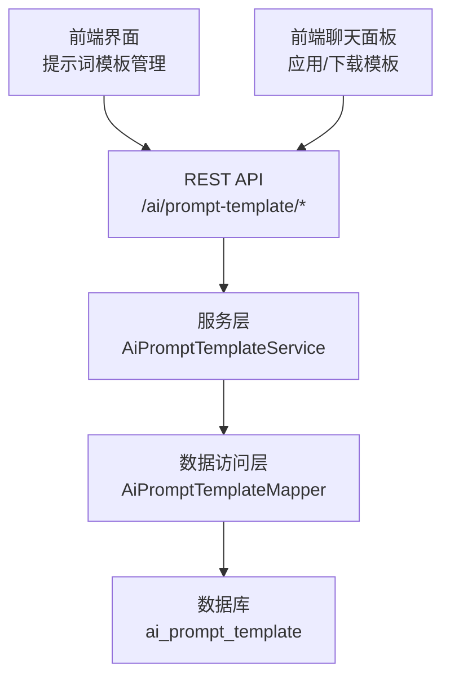
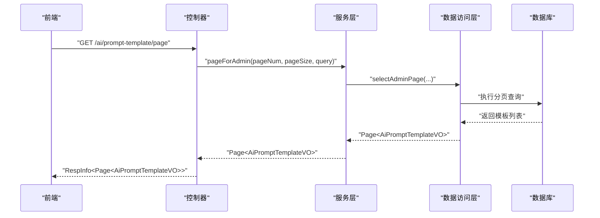
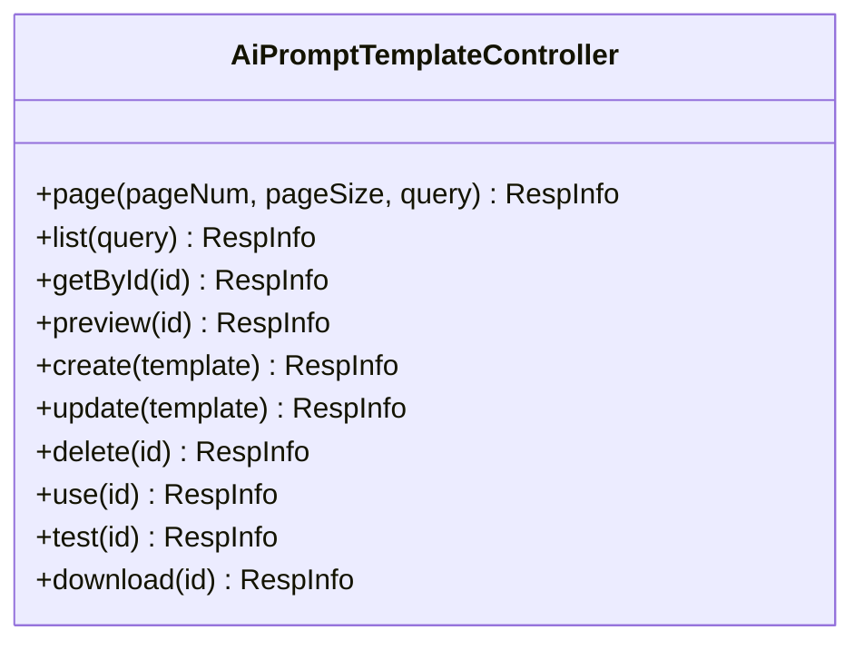
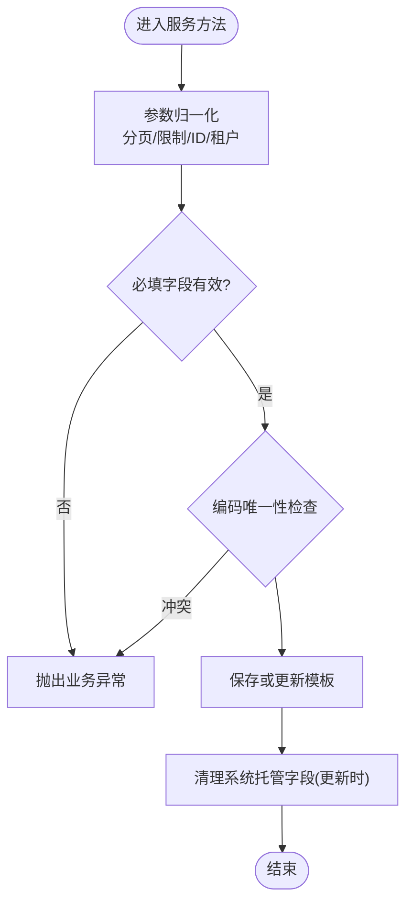
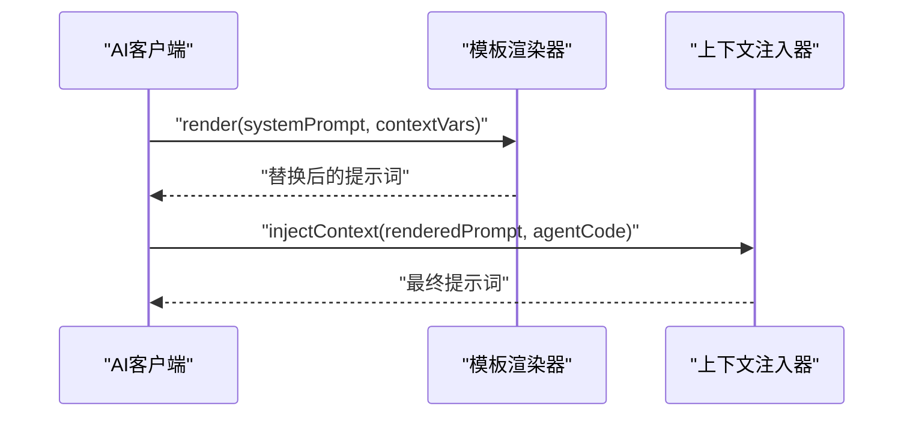
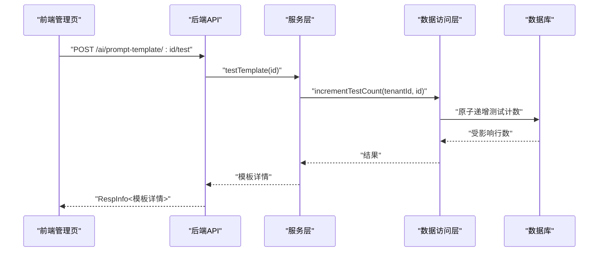
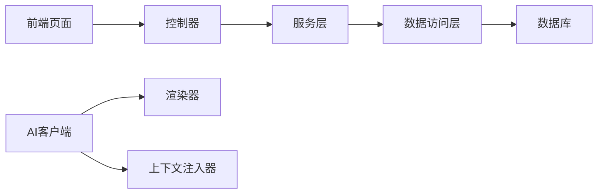

# 提示词模板库

<cite>
**本文引用的文件**
- [AiPromptTemplateController.java](file://forge-server/forge-framework/forge-plugin-parent/forge-plugin-ai/src/main/java/com/mdframe/forge/plugin/ai/prompt/controller/AiPromptTemplateController.java)
- [AiPromptTemplateService.java](file://forge-server/forge-framework/forge-plugin-parent/forge-plugin-ai/src/main/java/com/mdframe/forge/plugin/ai/prompt/service/AiPromptTemplateService.java)
- [AiPromptTemplateMapper.java](file://forge-server/forge-framework/forge-plugin-parent/forge-plugin-ai/src/main/java/com/mdframe/forge/plugin/ai/prompt/mapper/AiPromptTemplateMapper.java)
- [AiPromptTemplate.java](file://forge-server/forge-framework/forge-plugin-parent/forge-plugin-ai/src/main/java/com/mdframe/forge/plugin/ai/prompt/domain/AiPromptTemplate.java)
- [AiPromptTemplateVO.java](file://forge-server/forge-framework/forge-plugin-parent/forge-plugin-ai/src/main/java/com/mdframe/forge/plugin/ai/prompt/vo/AiPromptTemplateVO.java)
- [V1.0.13__add_logic_delete_to_prompt_and_query_scheme_tables.sql](file://forge-server/db/migration/V1.0.13__add_logic删除到提示词和查询方案表.sql)
- [prompt-template.vue](file://forge-admin-ui/src/views/ai/prompt-template.vue)
- [AIChatPanel.vue](file://forge-report-ui/src/components/FgAI/AIChatPanel.vue)
- [AiPromptTemplateRenderer.java](file://forge-server/forge-framework/forge-plugin-parent/forge-plugin-ai/src/main/java/com/mdframe/forge/plugin/ai/chat/service/AiPromptTemplateRenderer.java)
- [AiClientImpl.java](file://forge-server/forge-framework/forge-plugin-parent/forge-plugin-ai/src/main/java/com/mdframe/forge/plugin/ai/client/AiClientImpl.java)
- [template-list.vue](file://forge-admin-ui/src/views/message/template-list.vue)
</cite>

## 目录
1. [简介](#简介)
2. [项目结构](#项目结构)
3. [核心组件](#核心组件)
4. [架构总览](#架构总览)
5. [详细组件分析](#详细组件分析)
6. [依赖关系分析](#依赖关系分析)
7. [性能与容量规划](#性能与容量规划)
8. [故障排查指南](#故障排查指南)
9. [结论](#结论)
10. [附录：最佳实践与设计模式](#附录最佳实践与设计模式)

## 简介
本文件为 Forge Admin 的“提示词模板库”提供完整的技术与使用文档，覆盖模板的创建、分类、版本管理、复用机制，以及变量替换、条件渲染、动态生成等高级能力；同时给出模板测试、调试、性能优化建议，并总结在不同业务场景下的模板设计模式与最佳实践。

## 项目结构
提示词模板功能由前后端协同实现：
- 后端提供 REST API 用于模板的增删改查、预览、试用、下载与计数统计，并通过数据访问层完成分页、列表、详情、唯一性校验与计数更新。
- 前端提供模板管理页面（列表、编辑、预览、试用、下载），并在 AI 聊天面板中支持“应用模板”“下载模板为 Markdown”等能力。
- 数据库通过迁移脚本维护逻辑删除字段与唯一索引，保障多租户隔离与编码唯一性。

**图表来源**
- [AiPromptTemplateController.java:16-81](file://forge-server/forge-framework/forge-plugin-parent/forge-plugin-ai/src/main/java/com/mdframe/forge/plugin/ai/prompt/controller/AiPromptTemplateController.java#L16-L81)
- [AiPromptTemplateService.java:18-219](file://forge-server/forge-framework/forge-plugin-parent/forge-plugin-ai/src/main/java/com/mdframe/forge/plugin/ai/prompt/service/AiPromptTemplateService.java#L18-L219)
- [AiPromptTemplateMapper.java:13-43](file://forge-server/forge-framework/forge-plugin-parent/forge-plugin-ai/src/main/java/com/mdframe/forge/plugin/ai/prompt/mapper/AiPromptTemplateMapper.java#L13-L43)
- [prompt-template.vue:1-497](file://forge-admin-ui/src/views/ai/prompt-template.vue#L1-L497)
- [AIChatPanel.vue:671-1290](file://forge-report-ui/src/components/FgAI/AIChatPanel.vue#L671-L1290)

**章节来源**
- [AiPromptTemplateController.java:16-81](file://forge-server/forge-framework/forge-plugin-parent/forge-plugin-ai/src/main/java/com/mdframe/forge/plugin/ai/prompt/controller/AiPromptTemplateController.java#L16-L81)
- [AiPromptTemplateService.java:18-219](file://forge-server/forge-framework/forge-plugin-parent/forge-plugin-ai/src/main/java/com/mdframe/forge/plugin/ai/prompt/service/AiPromptTemplateService.java#L18-L219)
- [AiPromptTemplateMapper.java:13-43](file://forge-server/forge-framework/forge-plugin-parent/forge-plugin-ai/src/main/java/com/mdframe/forge/plugin/ai/prompt/mapper/AiPromptTemplateMapper.java#L13-L43)
- [prompt-template.vue:1-497](file://forge-admin-ui/src/views/ai/prompt-template.vue#L1-L497)
- [AIChatPanel.vue:671-1290](file://forge-report-ui/src/components/FgAI/AIChatPanel.vue#L671-L1290)

## 核心组件
- 控制器层：暴露模板分页、列表、详情、预览、创建、更新、删除、试用、下载等接口。
- 服务层：封装模板保存前的规范化、唯一性校验、计数递增、分页与列表查询等核心逻辑。
- 数据访问层：定义分页、启用列表、详情、唯一性计数、删除、计数递增等数据操作。
- 领域模型与视图对象：模板实体与对外展示视图，包含名称、编码、场景、分类、标签、内容、示例、状态、推荐、排序、计数等字段。
- 渲染器：提供模板变量占位符替换能力，供系统上下文注入时使用。
- 前端管理页：提供模板的搜索、编辑、预览、试用、下载与 Markdown 导出。
- 前端聊天面板：支持从模板库选择模板并应用到对话输入，支持下载模板为 Markdown。

**章节来源**
- [AiPromptTemplateController.java:16-81](file://forge-server/forge-framework/forge-plugin-parent/forge-plugin-ai/src/main/java/com/mdframe/forge/plugin/ai/prompt/controller/AiPromptTemplateController.java#L16-L81)
- [AiPromptTemplateService.java:18-219](file://forge-server/forge-framework/forge-plugin-parent/forge-plugin-ai/src/main/java/com/mdframe/forge/plugin/ai/prompt/service/AiPromptTemplateService.java#L18-L219)
- [AiPromptTemplateMapper.java:13-43](file://forge-server/forge-framework/forge-plugin-parent/forge-plugin-ai/src/main/java/com/mdframe/forge/plugin/ai/prompt/mapper/AiPromptTemplateMapper.java#L13-L43)
- [AiPromptTemplate.java:13-61](file://forge-server/forge-framework/forge-plugin-parent/forge-plugin-ai/src/main/java/com/mdframe/forge/plugin/ai/prompt/domain/AiPromptTemplate.java#L13-L61)
- [AiPromptTemplateVO.java:8-63](file://forge-server/forge-framework/forge-plugin-parent/forge-plugin-ai/src/main/java/com/mdframe/forge/plugin/ai/prompt/vo/AiPromptTemplateVO.java#L8-L63)
- [AiPromptTemplateRenderer.java:50-68](file://forge-server/forge-framework/forge-plugin-parent/forge-plugin-ai/src/main/java/com/mdframe/forge/plugin/ai/chat/service/AiPromptTemplateRenderer.java#L50-L68)
- [prompt-template.vue:1-497](file://forge-admin-ui/src/views/ai/prompt-template.vue#L1-L497)
- [AIChatPanel.vue:671-1290](file://forge-report-ui/src/components/FgAI/AIChatPanel.vue#L671-L1290)

## 架构总览
提示词模板库采用典型的前后端分离架构：
- 前端通过统一的请求工具调用后端 REST API，完成模板的 CRUD、预览、试用、下载等操作。
- 后端控制器将请求路由至服务层，服务层进行参数校验、规范化、唯一性检查与业务计数更新，再委托数据访问层执行 SQL。
- 数据库通过迁移脚本维护逻辑删除与唯一索引，确保多租户隔离与模板编码唯一性。
- 在 AI 运行时，系统通过渲染器对系统提示词中的变量占位符进行替换，并结合上下文注入，形成最终发送给模型的提示词。

**图表来源**
- [AiPromptTemplateController.java:25-31](file://forge-server/forge-framework/forge-plugin-parent/forge-plugin-ai/src/main/java/com/mdframe/forge/plugin/ai/prompt/controller/AiPromptTemplateController.java#L25-L31)
- [AiPromptTemplateService.java:31-34](file://forge-server/forge-framework/forge-plugin-parent/forge-plugin-ai/src/main/java/com/mdframe/forge/plugin/ai/prompt/service/AiPromptTemplateService.java#L31-L34)
- [AiPromptTemplateMapper.java:16-18](file://forge-server/forge-framework/forge-plugin-parent/forge-plugin-ai/src/main/java/com/mdframe/forge/plugin/ai/prompt/mapper/AiPromptTemplateMapper.java#L16-L18)

**章节来源**
- [AiPromptTemplateController.java:25-31](file://forge-server/forge-framework/forge-plugin-parent/forge-plugin-ai/src/main/java/com/mdframe/forge/plugin/ai/prompt/controller/AiPromptTemplateController.java#L25-L31)
- [AiPromptTemplateService.java:31-34](file://forge-server/forge-framework/forge-plugin-parent/forge-plugin-ai/src/main/java/com/mdframe/forge/plugin/ai/prompt/service/AiPromptTemplateService.java#L31-L34)
- [AiPromptTemplateMapper.java:16-18](file://forge-server/forge-framework/forge-plugin-parent/forge-plugin-ai/src/main/java/com/mdframe/forge/plugin/ai/prompt/mapper/AiPromptTemplateMapper.java#L16-L18)

## 详细组件分析

### 控制器层：模板 API
- 提供分页、列表、详情、预览、创建、更新、删除、试用、下载等接口。
- 所有接口统一返回响应包装对象，便于前端处理成功与失败分支。
- 试用、下载接口会触发计数递增，便于统计模板使用情况。

**图表来源**
- [AiPromptTemplateController.java:16-81](file://forge-server/forge-framework/forge-plugin-parent/forge-plugin-ai/src/main/java/com/mdframe/forge/plugin/ai/prompt/controller/AiPromptTemplateController.java#L16-L81)

**章节来源**
- [AiPromptTemplateController.java:16-81](file://forge-server/forge-framework/forge-plugin-parent/forge-plugin-ai/src/main/java/com/mdframe/forge/plugin/ai/prompt/controller/AiPromptTemplateController.java#L16-L81)

### 服务层：模板业务逻辑
- 分页与列表：支持管理员分页查询与启用列表查询，内置默认与最大限制保护。
- 详情获取：按租户与 ID 查询详情，不存在时抛出业务异常。
- 创建与更新：保存前进行字段规范化、长度截断、默认值填充、唯一性校验；更新时清理系统托管字段。
- 删除：按租户与 ID 删除，不存在时报错。
- 计数递增：试用、下载、使用三种计数类型，分别调用对应 Mapper 方法，不存在或已停用时报错。
- 安全与健壮性：参数归一化、空值处理、非负计数、租户隔离。

**图表来源**
- [AiPromptTemplateService.java:50-71](file://forge-server/forge-framework/forge-plugin-parent/forge-plugin-ai/src/main/java/com/mdframe/forge/plugin/ai/prompt/service/AiPromptTemplateService.java#L50-L71)
- [AiPromptTemplateService.java:117-167](file://forge-server/forge-framework/forge-plugin-parent/forge-plugin-ai/src/main/java/com/mdframe/forge/plugin/ai/prompt/service/AiPromptTemplateService.java#L117-L167)

**章节来源**
- [AiPromptTemplateService.java:31-48](file://forge-server/forge-framework/forge-plugin-parent/forge-plugin-ai/src/main/java/com/mdframe/forge/plugin/ai/prompt/service/AiPromptTemplateService.java#L31-L48)
- [AiPromptTemplateService.java:50-71](file://forge-server/forge-framework/forge-plugin-parent/forge-plugin-ai/src/main/java/com/mdframe/forge/plugin/ai/prompt/service/AiPromptTemplateService.java#L50-L71)
- [AiPromptTemplateService.java:73-115](file://forge-server/forge-framework/forge-plugin-parent/forge-plugin-ai/src/main/java/com/mdframe/forge/plugin/ai/prompt/service/AiPromptTemplateService.java#L73-L115)
- [AiPromptTemplateService.java:117-167](file://forge-server/forge-framework/forge-plugin-parent/forge-plugin-ai/src/main/java/com/mdframe/forge/plugin/ai/prompt/service/AiPromptTemplateService.java#L117-L167)

### 数据访问层：持久化与统计
- 分页查询：管理员分页，支持租户过滤与查询条件。
- 启用列表：仅返回启用的模板，支持限制条数。
- 详情查询：按租户与 ID 获取详情。
- 唯一性计数：按租户与编码（排除当前 ID）计数，用于唯一性校验。
- 删除：按租户与 ID 删除。
- 计数递增：使用、测试、下载三类计数原子递增。

**章节来源**
- [AiPromptTemplateMapper.java:13-43](file://forge-server/forge-framework/forge-plugin-parent/forge-plugin-ai/src/main/java/com/mdframe/forge/plugin/ai/prompt/mapper/AiPromptTemplateMapper.java#L13-L43)

### 领域模型与视图对象
- 领域模型：模板实体包含名称、编码、场景、分类、标签、描述、提示词内容、示例输入、状态、逻辑删除标志、推荐标记、排序号、计数与备注等。
- 视图对象：对外展示的模板列表视图，包含摘要、统计与时间戳等。

**章节来源**
- [AiPromptTemplate.java:13-61](file://forge-server/forge-framework/forge-plugin-parent/forge-plugin-ai/src/main/java/com/mdframe/forge/plugin/ai/prompt/domain/AiPromptTemplate.java#L13-L61)
- [AiPromptTemplateVO.java:8-63](file://forge-server/forge-framework/forge-plugin-parent/forge-plugin-ai/src/main/java/com/mdframe/forge/plugin/ai/prompt/vo/AiPromptTemplateVO.java#L8-L63)

### 变量替换与上下文注入
- 渲染器：提供基于正则的占位符替换能力，支持 ${key} 形式，缺失变量以空字符串替代。
- 上下文注入：在构建系统提示词时，先进行变量替换，再注入上下文信息，形成最终提示词。

**图表来源**
- [AiPromptTemplateRenderer.java:50-68](file://forge-server/forge-framework/forge-plugin-parent/forge-plugin-ai/src/main/java/com/mdframe/forge/plugin/ai/chat/service/AiPromptTemplateRenderer.java#L50-L68)
- [AiClientImpl.java:276-282](file://forge-server/forge-framework/forge-plugin-parent/forge-plugin-ai/src/main/java/com/mdframe/forge/plugin/ai/client/AiClientImpl.java#L276-L282)

**章节来源**
- [AiPromptTemplateRenderer.java:50-68](file://forge-server/forge-framework/forge-plugin-parent/forge-plugin-ai/src/main/java/com/mdframe/forge/plugin/ai/chat/service/AiPromptTemplateRenderer.java#L50-L68)
- [AiClientImpl.java:276-282](file://forge-server/forge-framework/forge-plugin-parent/forge-plugin-ai/src/main/java/com/mdframe/forge/plugin/ai/client/AiClientImpl.java#L276-L282)

### 前端模板管理与聊天集成
- 模板管理页：提供搜索、编辑、预览、试用、下载与 Markdown 导出；支持字典联动显示场景、状态、推荐等。
- 聊天面板：支持从模板库选择模板并应用到输入框，支持下载模板为 Markdown，并显示使用/测试/下载计数。

**图表来源**
- [prompt-template.vue:382-398](file://forge-admin-ui/src/views/ai/prompt-template.vue#L382-L398)
- [AiPromptTemplateController.java:71-74](file://forge-server/forge-framework/forge-plugin-parent/forge-plugin-ai/src/main/java/com/mdframe/forge/plugin/ai/prompt/controller/AiPromptTemplateController.java#L71-L74)
- [AiPromptTemplateService.java:87-91](file://forge-server/forge-framework/forge-plugin-parent/forge-plugin-ai/src/main/java/com/mdframe/forge/plugin/ai/prompt/service/AiPromptTemplateService.java#L87-L91)
- [AiPromptTemplateMapper.java:37-38](file://forge-server/forge-framework/forge-plugin-parent/forge-plugin-ai/src/main/java/com/mdframe/forge/plugin/ai/prompt/mapper/AiPromptTemplateMapper.java#L37-L38)

**章节来源**
- [prompt-template.vue:1-497](file://forge-admin-ui/src/views/ai/prompt-template.vue#L1-L497)
- [AIChatPanel.vue:671-1290](file://forge-report-ui/src/components/FgAI/AIChatPanel.vue#L671-L1290)

### 数据库迁移与约束
- 逻辑删除：为模板表添加逻辑删除字段，并设置默认值与回刷。
- 唯一索引：新增未删除标识列，并建立租户+编码+未删除的唯一索引，保证多租户下编码唯一。

**章节来源**
- [V1.0.13__add_logic删除到提示词和查询方案表.sql:7-33](file://forge-server/db/migration/V1.0.13__add_logic删除到提示词和查询方案表.sql#L7-L33)

## 依赖关系分析
- 控制器依赖服务层，服务层依赖数据访问层，数据访问层依赖数据库。
- 前端依赖后端 API，聊天面板与管理页均通过 API 与后端交互。
- 渲染器与上下文注入器在 AI 客户端中被调用，形成提示词最终文本。

**图表来源**
- [AiPromptTemplateController.java:16-81](file://forge-server/forge-framework/forge-plugin-parent/forge-plugin-ai/src/main/java/com/mdframe/forge/plugin/ai/prompt/controller/AiPromptTemplateController.java#L16-L81)
- [AiPromptTemplateService.java:18-219](file://forge-server/forge-framework/forge-plugin-parent/forge-plugin-ai/src/main/java/com/mdframe/forge/plugin/ai/prompt/service/AiPromptTemplateService.java#L18-L219)
- [AiPromptTemplateMapper.java:13-43](file://forge-server/forge-framework/forge-plugin-parent/forge-plugin-ai/src/main/java/com/mdframe/forge/plugin/ai/prompt/mapper/AiPromptTemplateMapper.java#L13-L43)
- [AiClientImpl.java:276-282](file://forge-server/forge-framework/forge-plugin-parent/forge-plugin-ai/src/main/java/com/mdframe/forge/plugin/ai/client/AiClientImpl.java#L276-L282)

**章节来源**
- [AiPromptTemplateController.java:16-81](file://forge-server/forge-framework/forge-plugin-parent/forge-plugin-ai/src/main/java/com/mdframe/forge/plugin/ai/prompt/controller/AiPromptTemplateController.java#L16-L81)
- [AiPromptTemplateService.java:18-219](file://forge-server/forge-framework/forge-plugin-parent/forge-plugin-ai/src/main/java/com/mdframe/forge/plugin/ai/prompt/service/AiPromptTemplateService.java#L18-L219)
- [AiPromptTemplateMapper.java:13-43](file://forge-server/forge-framework/forge-plugin-parent/forge-plugin-ai/src/main/java/com/mdframe/forge/plugin/ai/prompt/mapper/AiPromptTemplateMapper.java#L13-L43)
- [AiClientImpl.java:276-282](file://forge-server/forge-framework/forge-plugin-parent/forge-plugin-ai/src/main/java/com/mdframe/forge/plugin/ai/client/AiClientImpl.java#L276-L282)

## 性能与容量规划
- 分页与限制：服务层对分页大小与列表限制进行归一化与上限控制，避免过大查询导致性能问题。
- 原子计数：使用计数递增接口，减少并发竞争与重复读取。
- 唯一性校验：通过数据库唯一索引与服务层双重校验，降低冲突概率。
- 缓存建议：对于频繁使用的模板列表，可在前端或网关层引入短期缓存策略，减少重复请求。
- 资源释放：前端下载模板后及时释放 URL 对象，避免内存泄漏。

[本节为通用性能建议，不直接分析具体文件]

## 故障排查指南
- 模板不存在：获取详情或删除时若不存在，服务层抛出业务异常，需检查 ID 与租户上下文。
- 模板编码冲突：创建或更新时若编码已存在，服务层抛出业务异常，需调整编码或排除当前 ID。
- 计数递增失败：试用、下载、使用计数递增若受影响行数为 0，说明模板不存在或已停用，需检查状态与租户。
- 变量替换为空：渲染器缺失变量会以空字符串替代，需检查传入变量键名与模板占位符是否一致。
- 前端错误提示：管理页与聊天面板在失败时会显示错误消息，可据此定位网络或后端异常。

**章节来源**
- [AiPromptTemplateService.java:42-48](file://forge-server/forge-framework/forge-plugin-parent/forge-plugin-ai/src/main/java/com/mdframe/forge/plugin/ai/prompt/service/AiPromptTemplateService.java#L42-L48)
- [AiPromptTemplateService.java:73-79](file://forge-server/forge-framework/forge-plugin-parent/forge-plugin-ai/src/main/java/com/mdframe/forge/plugin/ai/prompt/service/AiPromptTemplateService.java#L73-L79)
- [AiPromptTemplateService.java:99-115](file://forge-server/forge-framework/forge-plugin-parent/forge-plugin-ai/src/main/java/com/mdframe/forge/plugin/ai/prompt/service/AiPromptTemplateService.java#L99-L115)
- [AiPromptTemplateRenderer.java:50-68](file://forge-server/forge-framework/forge-plugin-parent/forge-plugin-ai/src/main/java/com/mdframe/forge/plugin/ai/chat/service/AiPromptTemplateRenderer.java#L50-L68)
- [prompt-template.vue:382-398](file://forge-admin-ui/src/views/ai/prompt-template.vue#L382-L398)
- [AIChatPanel.vue:1211-1250](file://forge-report-ui/src/components/FgAI/AIChatPanel.vue#L1211-L1250)

## 结论
提示词模板库提供了完整的模板生命周期管理能力，包括创建、分类、状态管理、复用与统计；通过变量替换与上下文注入，支持灵活的提示词动态生成；前端提供友好的管理界面与聊天集成，便于快速应用与调试。建议在工程实践中遵循变量命名规范、模板分层与复用原则，结合性能优化与故障排查策略，持续提升提示词工程效率与稳定性。

[本节为总结，不直接分析具体文件]

## 附录：最佳实践与设计模式
- 变量命名规范：使用小写字母与下划线组成的键名，避免特殊字符；在模板中使用 ${key} 或 {key} 占位符。
- 模板分层：将通用指令放入基础模板，业务特定内容放入子模板，通过组合复用提升一致性。
- 条件渲染：在前端或后端根据上下文变量进行条件拼接，避免复杂逻辑污染模板。
- 动态生成：结合上下文注入与变量替换，生成个性化提示词，如用户信息、业务上下文、系统时间等。
- 测试与调试：使用“试用”接口记录测试次数，配合预览与 Markdown 导出，便于离线验证与分享。
- 版本管理：通过模板编码与状态字段管理版本演进，结合唯一索引保障多租户隔离。
- 性能优化：合理设置分页与限制，避免大列表；对高频模板引入缓存；下载后及时释放资源。
- 安全加固：对用户输入进行清洗与长度限制，防止注入与溢出；渲染器对缺失变量安全降级。

**章节来源**
- [template-list.vue:485-567](file://forge-admin-ui/src/views/message/template-list.vue#L485-L567)
- [AiPromptTemplateRenderer.java:50-68](file://forge-server/forge-framework/forge-plugin-parent/forge-plugin-ai/src/main/java/com/mdframe/forge/plugin/ai/chat/service/AiPromptTemplateRenderer.java#L50-L68)
- [prompt-template.vue:425-459](file://forge-admin-ui/src/views/ai/prompt-template.vue#L425-L459)
- [AIChatPanel.vue:1253-1290](file://forge-report-ui/src/components/FgAI/AIChatPanel.vue#L1253-L1290)