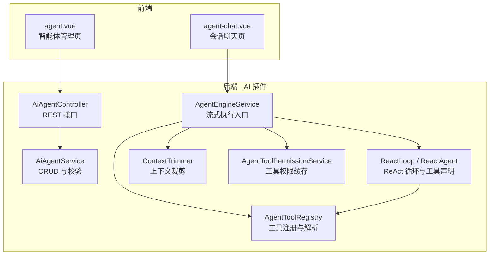
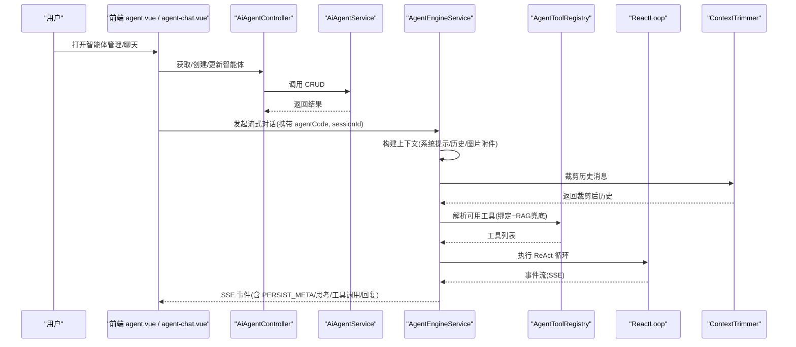
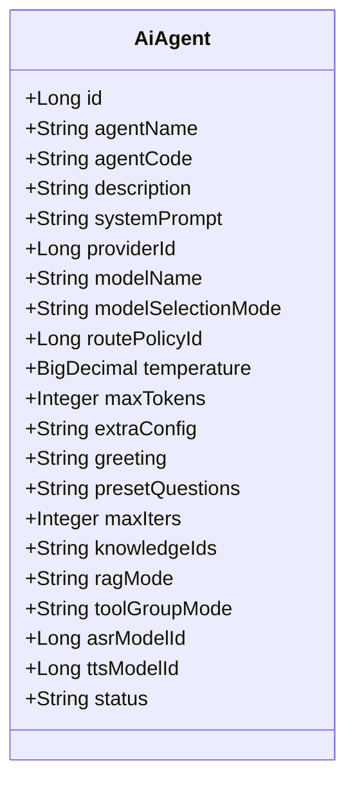
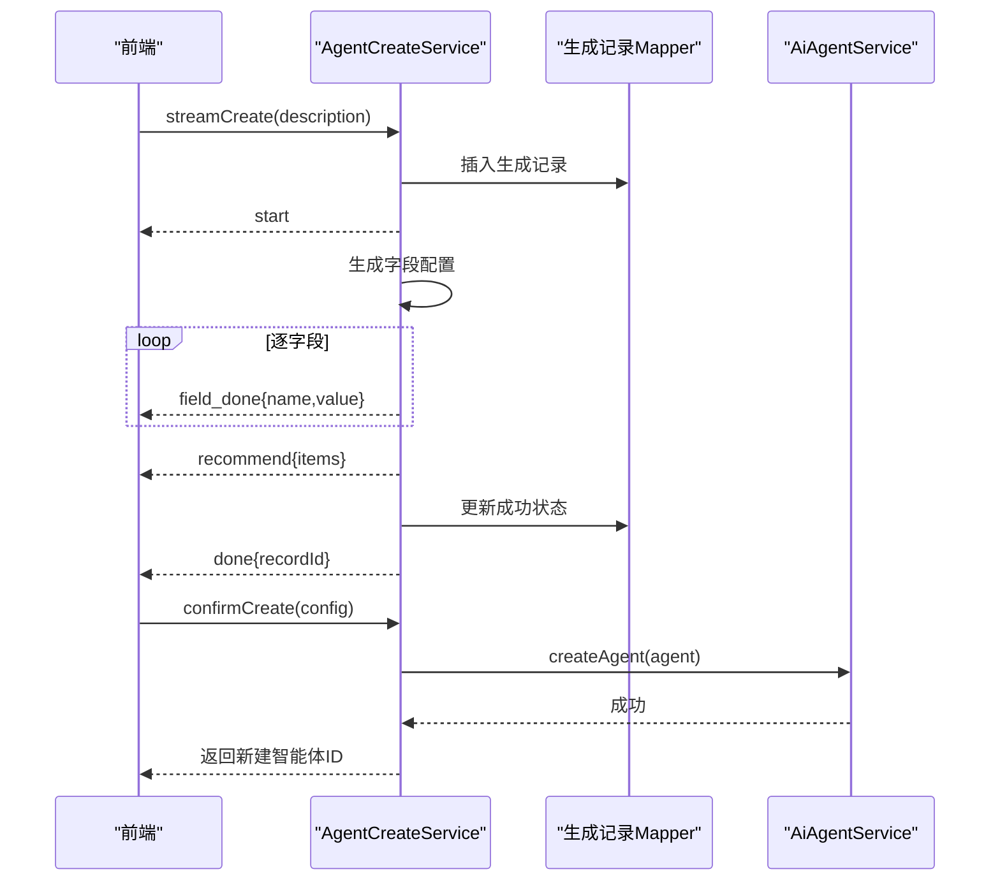
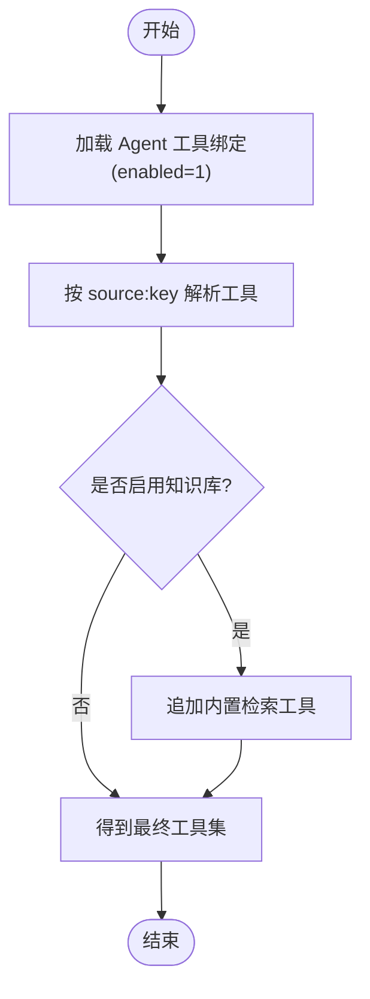
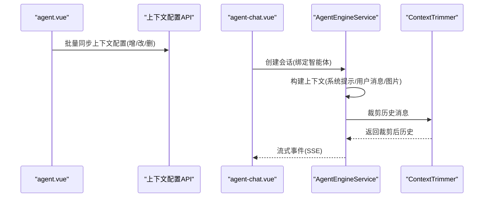
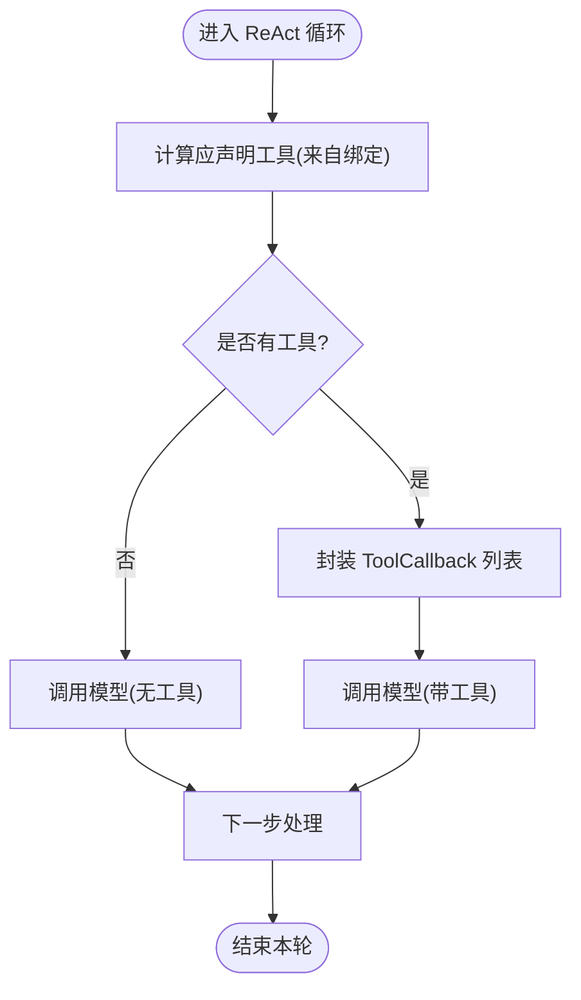
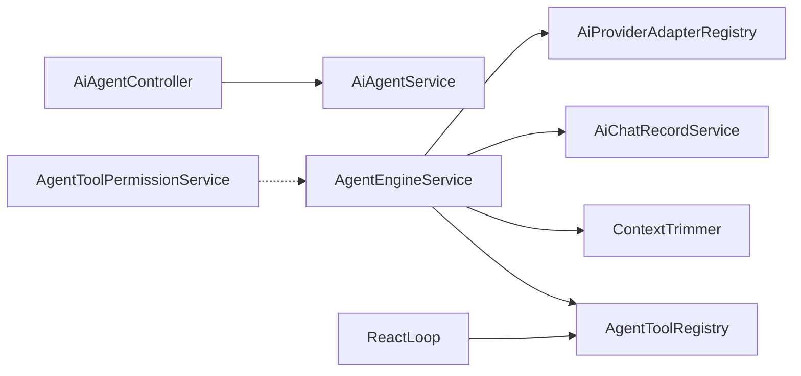

# 智能体管理

<cite>
**本文引用的文件**
- [AiAgent.java](file://forge-server/forge-framework/forge-plugin-parent/forge-plugin-ai/src/main/java/com/mdframe/forge/plugin/ai/agent/domain/AiAgent.java)
- [AiAgentController.java](file://forge-server/forge-framework/forge-plugin-parent/forge-plugin-ai/src/main/java/com/mdframe/forge/plugin/ai/agent/controller/AiAgentController.java)
- [AiAgentService.java](file://forge-server/forge-framework/forge-plugin-parent/forge-plugin-ai/src/main/java/com/mdframe/forge/plugin/ai/agent/service/AiAgentService.java)
- [AgentCreateService.java](file://forge-server/forge-framework/forge-plugin-parent/forge-plugin-ai/src/main/java/com/mdframe/forge/plugin/ai/agent/engine/create/AgentCreateService.java)
- [AgentToolRegistry.java](file://forge-server/forge-framework/forge-plugin-parent/forge-plugin-ai/src/main/java/com/mdframe/forge/plugin/ai/agent/engine/tool/registry/AgentToolRegistry.java)
- [AgentEngineService.java](file://forge-server/forge-framework/forge-plugin-parent/forge-plugin-ai/src/main/java/com/mdframe/forge/plugin/ai/agent/engine/service/AgentEngineService.java)
- [ReactLoop.java](file://forge-server/forge-framework/forge-plugin-parent/forge-plugin-ai/src/main/java/com/mdframe/forge/plugin/ai/agent/engine/ReactLoop.java)
- [ContextTrimmer.java](file://forge-server/forge-framework/forge-plugin-parent/forge-plugin-ai/src/main/java/com/mdframe/forge/plugin/ai/agent/engine/context/ContextTrimmer.java)
- [AgentToolPermissionService.java](file://forge-server/forge-framework/forge-plugin-parent/forge-plugin-ai/src/main/java/com/mdframe/forge/plugin/ai/agent/engine/permission/AgentToolPermissionService.java)
- [agent.vue](file://forge-admin-ui/src/views/ai/agent.vue)
- [agent-chat.vue](file://forge-admin-ui/src/views/ai/agent-chat.vue)
</cite>

## 目录
1. [简介](#简介)
2. [项目结构](#项目结构)
3. [核心组件](#核心组件)
4. [架构总览](#架构总览)
5. [详细组件分析](#详细组件分析)
6. [依赖关系分析](#依赖关系分析)
7. [性能考量](#性能考量)
8. [故障排查指南](#故障排查指南)
9. [结论](#结论)
10. [附录](#附录)

## 简介
本文件面向 Forge Admin 的智能体（Agent）管理能力，覆盖智能体的创建、配置、管理与生命周期流程；重点说明属性配置、工具绑定、权限设置、与业务对象的关联、上下文配置与会话管理等高级特性。文档同时提供端到端示例与最佳实践，帮助在不同场景下设计并落地智能体。

## 项目结构
智能体能力由后端插件模块与前端管理界面共同实现：
- 后端核心位于 AI 插件模块中，包含智能体领域模型、控制器与服务、引擎服务、工具注册表、上下文裁剪、事件与持久化等。
- 前端管理界面提供智能体列表、创建向导、会话聊天、上下文配置等页面。

图表来源
- [AiAgentController.java:14-59](file://forge-server/forge-framework/forge-plugin-parent/forge-plugin-ai/src/main/java/com/mdframe/forge/plugin/ai/agent/controller/AiAgentController.java#L14-L59)
- [AiAgentService.java:21-62](file://forge-server/forge-framework/forge-plugin-parent/forge-plugin-ai/src/main/java/com/mdframe/forge/plugin/ai/agent/service/AiAgentService.java#L21-L62)
- [AgentEngineService.java:65-153](file://forge-server/forge-framework/forge-plugin-parent/forge-plugin-ai/src/main/java/com/mdframe/forge/plugin/ai/agent/engine/service/AgentEngineService.java#L65-L153)
- [AgentToolRegistry.java:18-92](file://forge-server/forge-framework/forge-plugin-parent/forge-plugin-ai/src/main/java/com/mdframe/forge/plugin/ai/agent/engine/tool/registry/AgentToolRegistry.java#L18-L92)
- [ReactLoop.java:492-518](file://forge-server/forge-framework/forge-plugin-parent/forge-plugin-ai/src/main/java/com/mdframe/forge/plugin/ai/agent/engine/ReactLoop.java#L492-L518)
- [ContextTrimmer.java:23-129](file://forge-server/forge-framework/forge-plugin-parent/forge-plugin-ai/src/main/java/com/mdframe/forge/plugin/ai/agent/engine/context/ContextTrimmer.java#L23-L129)
- [AgentToolPermissionService.java:15-48](file://forge-server/forge-framework/forge-plugin-parent/forge-plugin-ai/src/main/java/com/mdframe/forge/plugin/ai/agent/engine/permission/AgentToolPermissionService.java#L15-L48)
- [agent.vue:1669-1719](file://forge-admin-ui/src/views/ai/agent.vue#L1669-L1719)
- [agent-chat.vue:508-537](file://forge-admin-ui/src/views/ai/agent-chat.vue#L508-L537)

章节来源
- [AiAgentController.java:14-59](file://forge-server/forge-framework/forge-plugin-parent/forge-plugin-ai/src/main/java/com/mdframe/forge/plugin/ai/agent/controller/AiAgentController.java#L14-L59)
- [AiAgentService.java:21-62](file://forge-server/forge-framework/forge-plugin-parent/forge-plugin-ai/src/main/java/com/mdframe/forge/plugin/ai/agent/service/AiAgentService.java#L21-L62)
- [AgentEngineService.java:65-153](file://forge-server/forge-framework/forge-plugin-parent/forge-plugin-ai/src/main/java/com/mdframe/forge/plugin/ai/agent/engine/service/AgentEngineService.java#L65-L153)
- [agent.vue:1669-1719](file://forge-admin-ui/src/views/ai/agent.vue#L1669-L1719)
- [agent-chat.vue:508-537](file://forge-admin-ui/src/views/ai/agent-chat.vue#L508-L537)

## 核心组件
- 智能体领域模型与基础 CRUD：定义智能体实体字段与基本增删改查能力。
- 智能体创建服务：基于描述流式生成配置，支持推荐绑定与确认创建。
- 引擎服务：负责会话级上下文构建、工具解析、历史消息裁剪、流式执行与恢复/停止。
- 工具注册表：集中管理所有可用工具，按 source:key 索引，并按 Agent 绑定配置解析出本次可用的工具集合。
- 上下文裁剪器：对长会话历史进行条数与 token 预算双重裁剪，避免超出模型上下文窗口。
- 工具权限服务：维护 Agent 维度的工具权限决策缓存，用于运行时权限判定。
- 前端管理页与会话页：提供智能体配置编辑、上下文配置同步、会话创建与绑定智能体等交互。

章节来源
- [AiAgent.java:13-47](file://forge-server/forge-framework/forge-plugin-parent/forge-plugin-ai/src/main/java/com/mdframe/forge/plugin/ai/agent/domain/AiAgent.java#L13-L47)
- [AgentCreateService.java:44-149](file://forge-server/forge-framework/forge-plugin-parent/forge-plugin-ai/src/main/java/com/mdframe/forge/plugin/ai/agent/engine/create/AgentCreateService.java#L44-L149)
- [AgentEngineService.java:127-187](file://forge-server/forge-framework/forge-plugin-parent/forge-plugin-ai/src/main/java/com/mdframe/forge/plugin/ai/agent/engine/service/AgentEngineService.java#L127-L187)
- [AgentToolRegistry.java:18-92](file://forge-server/forge-framework/forge-plugin-parent/forge-plugin-ai/src/main/java/com/mdframe/forge/plugin/ai/agent/engine/tool/registry/AgentToolRegistry.java#L18-L92)
- [ContextTrimmer.java:23-129](file://forge-server/forge-framework/forge-plugin-parent/forge-plugin-ai/src/main/java/com/mdframe/forge/plugin/ai/agent/engine/context/ContextTrimmer.java#L23-L129)
- [AgentToolPermissionService.java:15-48](file://forge-server/forge-framework/forge-plugin-parent/forge-plugin-ai/src/main/java/com/mdframe/forge/plugin/ai/agent/engine/permission/AgentToolPermissionService.java#L15-L48)

## 架构总览
智能体从“创建—配置—运行—会话”的完整链路如下：
- 创建：通过流式生成配置，推荐工具/知识库绑定，确认后落库。
- 配置：设置系统提示词、模型选择策略、温度与最大 token、预设问题、知识库与 RAG 模式、工具分组模式等。
- 运行：引擎服务根据 Agent 配置构建上下文，解析工具集合，调用模型执行 ReAct 循环，流式返回事件。
- 会话：会话创建时绑定智能体，不可更改；支持历史裁剪、恢复与停止。

图表来源
- [AiAgentController.java:23-58](file://forge-server/forge-framework/forge-plugin-parent/forge-plugin-ai/src/main/java/com/mdframe/forge/plugin/ai/agent/controller/AiAgentController.java#L23-L58)
- [AiAgentService.java:28-62](file://forge-server/forge-framework/forge-plugin-parent/forge-plugin-ai/src/main/java/com/mdframe/forge/plugin/ai/agent/service/AiAgentService.java#L28-L62)
- [AgentEngineService.java:65-153](file://forge-server/forge-framework/forge-plugin-parent/forge-plugin-ai/src/main/java/com/mdframe/forge/plugin/ai/agent/engine/service/AgentEngineService.java#L65-L153)
- [AgentToolRegistry.java:60-69](file://forge-server/forge-framework/forge-plugin-parent/forge-plugin-ai/src/main/java/com/mdframe/forge/plugin/ai/agent/engine/tool/registry/AgentToolRegistry.java#L60-L69)
- [ReactLoop.java:492-518](file://forge-server/forge-framework/forge-plugin-parent/forge-plugin-ai/src/main/java/com/mdframe/forge/plugin/ai/agent/engine/ReactLoop.java#L492-L518)
- [ContextTrimmer.java:53-89](file://forge-server/forge-framework/forge-plugin-parent/forge-plugin-ai/src/main/java/com/mdframe/forge/plugin/ai/agent/engine/context/ContextTrimmer.java#L53-L89)
- [agent-chat.vue:508-537](file://forge-admin-ui/src/views/ai/agent-chat.vue#L508-L537)

## 详细组件分析

### 智能体领域模型与基础管理
- 实体字段涵盖名称、编码、描述、系统提示词、供应商与模型、模型选择模式、路由策略、温度、最大 token、额外配置、问候语、预设问题、最大迭代次数、知识库 ID 列表、RAG 模式、工具分组模式、语音识别/合成模型、状态等。
- 控制器暴露分页查询、启用列表、详情、新增、更新、删除等接口。
- 服务层提供按编码查询、分页、启用列表、新增/更新（含模型选择模式校验与路由策略有效性校验）。

图表来源
- [AiAgent.java:13-47](file://forge-server/forge-framework/forge-plugin-parent/forge-plugin-ai/src/main/java/com/mdframe/forge/plugin/ai/agent/domain/AiAgent.java#L13-L47)

章节来源
- [AiAgentController.java:23-58](file://forge-server/forge-framework/forge-plugin-parent/forge-plugin-ai/src/main/java/com/mdframe/forge/plugin/ai/agent/controller/AiAgentController.java#L23-L58)
- [AiAgentService.java:28-62](file://forge-server/forge-framework/forge-plugin-parent/forge-plugin-ai/src/main/java/com/mdframe/forge/plugin/ai/agent/service/AiAgentService.java#L28-L62)
- [AiAgent.java:13-47](file://forge-server/forge-framework/forge-plugin-parent/forge-plugin-ai/src/main/java/com/mdframe/forge/plugin/ai/agent/domain/AiAgent.java#L13-L47)

### 智能体创建流程（流式生成与确认）
- 流式生成：输入需求描述，后台逐字段生成配置并通过 SSE 推送 field_done 事件；完成后触发推荐绑定；最终保存生成记录并发送 done。
- 确认创建：将前端编辑后的配置映射为智能体实体，设置默认值（如固定模型、最大迭代、RAG 模式、工具分组模式、状态），写入知识库绑定则自动开启智能检索模式。

图表来源
- [AgentCreateService.java:44-149](file://forge-server/forge-framework/forge-plugin-parent/forge-plugin-ai/src/main/java/com/mdframe/forge/plugin/ai/agent/engine/create/AgentCreateService.java#L44-L149)

章节来源
- [AgentCreateService.java:44-149](file://forge-server/forge-framework/forge-plugin-parent/forge-plugin-ai/src/main/java/com/mdframe/forge/plugin/ai/agent/engine/create/AgentCreateService.java#L44-L149)

### 工具绑定与权限控制
- 工具注册表：收集所有贡献者提供的工具，按 source:key 索引，支持按来源获取与按绑定配置解析可用工具。
- 引擎侧解析：优先读取 Agent 的工具绑定配置（enabled=1），若绑定了知识库且未显式配置检索工具，则自动兜底加入内置检索工具，确保知识库可被检索。
- 权限缓存：维护 Agent 维度工具权限决策缓存，支持按 agentId:toolKey 查询与清除。

图表来源
- [AgentEngineService.java:150-187](file://forge-server/forge-framework/forge-plugin-parent/forge-plugin-ai/src/main/java/com/mdframe/forge/plugin/ai/agent/engine/service/AgentEngineService.java#L150-L187)
- [AgentToolRegistry.java:60-69](file://forge-server/forge-framework/forge-plugin-parent/forge-plugin-ai/src/main/java/com/mdframe/forge/plugin/ai/agent/engine/tool/registry/AgentToolRegistry.java#L60-L69)
- [AgentToolPermissionService.java:22-48](file://forge-server/forge-framework/forge-plugin-parent/forge-plugin-ai/src/main/java/com/mdframe/forge/plugin/ai/agent/engine/permission/AgentToolPermissionService.java#L22-L48)

章节来源
- [AgentToolRegistry.java:18-92](file://forge-server/forge-framework/forge-plugin-parent/forge-plugin-ai/src/main/java/com/mdframe/forge/plugin/ai/agent/engine/tool/registry/AgentToolRegistry.java#L18-L92)
- [AgentEngineService.java:150-187](file://forge-server/forge-framework/forge-plugin-parent/forge-plugin-ai/src/main/java/com/mdframe/forge/plugin/ai/agent/engine/service/AgentEngineService.java#L150-L187)
- [AgentToolPermissionService.java:22-48](file://forge-server/forge-framework/forge-plugin-parent/forge-plugin-ai/src/main/java/com/mdframe/forge/plugin/ai/agent/engine/permission/AgentToolPermissionService.java#L22-L48)

### 上下文配置与会话管理
- 上下文配置：前端支持为智能体添加/删除/更新上下文配置项（名称、内容、类型、排序、启用状态），并在保存时批量同步到后端。
- 会话创建：在聊天页创建会话时即选定并绑定智能体，绑定后不可更改；若当前为空会话且未发消息，可直接复用并切换智能体。
- 历史裁剪：引擎在服务层抓取最近历史消息，结合系统提示与用户消息的 token 估算，进行条数与 token 预算双重裁剪，避免超出模型上下文窗口。

图表来源
- [agent.vue:1669-1719](file://forge-admin-ui/src/views/ai/agent.vue#L1669-L1719)
- [agent-chat.vue:508-537](file://forge-admin-ui/src/views/ai/agent-chat.vue#L508-L537)
- [AgentEngineService.java:223-241](file://forge-server/forge-framework/forge-plugin-parent/forge-plugin-ai/src/main/java/com/mdframe/forge/plugin/ai/agent/engine/service/AgentEngineService.java#L223-L241)
- [ContextTrimmer.java:53-89](file://forge-server/forge-framework/forge-plugin-parent/forge-plugin-ai/src/main/java/com/mdframe/forge/plugin/ai/agent/engine/context/ContextTrimmer.java#L53-L89)

章节来源
- [agent.vue:1669-1719](file://forge-admin-ui/src/views/ai/agent.vue#L1669-L1719)
- [agent-chat.vue:508-537](file://forge-admin-ui/src/views/ai/agent-chat.vue#L508-L537)
- [AgentEngineService.java:223-241](file://forge-server/forge-framework/forge-plugin-parent/forge-plugin-ai/src/main/java/com/mdframe/forge/plugin/ai/agent/engine/service/AgentEngineService.java#L223-L241)
- [ContextTrimmer.java:53-89](file://forge-server/forge-framework/forge-plugin-parent/forge-plugin-ai/src/main/java/com/mdframe/forge/plugin/ai/agent/engine/context/ContextTrimmer.java#L53-L89)

### 工具声明与 ReAct 循环
- 引擎在每次循环前计算应向模型声明的工具集合，来源于已解析的绑定工具；若无工具则走普通对话路径。
- 工具以 Spring AI ToolCallback 形式声明，仅携带定义，不承担执行；实际执行由工具提供者完成。

图表来源
- [ReactLoop.java:492-518](file://forge-server/forge-framework/forge-plugin-parent/forge-plugin-ai/src/main/java/com/mdframe/forge/plugin/ai/agent/engine/ReactLoop.java#L492-L518)

章节来源
- [ReactLoop.java:492-518](file://forge-server/forge-framework/forge-plugin-parent/forge-plugin-ai/src/main/java/com/mdframe/forge/plugin/ai/agent/engine/ReactLoop.java#L492-L518)

## 依赖关系分析
- 控制器依赖服务层进行数据访问与校验。
- 引擎服务依赖工具注册表、上下文裁剪器、会话持久化、历史记录服务、模型适配器注册中心等。
- 工具注册表依赖工具贡献者集合，启动时完成工具发现与索引。
- 权限服务使用内存缓存存储 Agent 维度的工具权限决策。

图表来源
- [AiAgentController.java:23-58](file://forge-server/forge-framework/forge-plugin-parent/forge-plugin-ai/src/main/java/com/mdframe/forge/plugin/ai/agent/controller/AiAgentController.java#L23-L58)
- [AgentEngineService.java:65-153](file://forge-server/forge-framework/forge-plugin-parent/forge-plugin-ai/src/main/java/com/mdframe/forge/plugin/ai/agent/engine/service/AgentEngineService.java#L65-L153)
- [AgentToolRegistry.java:18-92](file://forge-server/forge-framework/forge-plugin-parent/forge-plugin-ai/src/main/java/com/mdframe/forge/plugin/ai/agent/engine/tool/registry/AgentToolRegistry.java#L18-L92)
- [ContextTrimmer.java:23-129](file://forge-server/forge-framework/forge-plugin-parent/forge-plugin-ai/src/main/java/com/mdframe/forge/plugin/ai/agent/engine/context/ContextTrimmer.java#L23-L129)
- [AgentToolPermissionService.java:15-48](file://forge-server/forge-framework/forge-plugin-parent/forge-plugin-ai/src/main/java/com/mdframe/forge/plugin/ai/agent/engine/permission/AgentToolPermissionService.java#L15-L48)

章节来源
- [AgentEngineService.java:65-153](file://forge-server/forge-framework/forge-plugin-parent/forge-plugin-ai/src/main/java/com/mdframe/forge/plugin/ai/agent/engine/service/AgentEngineService.java#L65-L153)
- [AgentToolRegistry.java:18-92](file://forge-server/forge-framework/forge-plugin-parent/forge-plugin-ai/src/main/java/com/mdframe/forge/plugin/ai/agent/engine/tool/registry/AgentToolRegistry.java#L18-L92)

## 性能考量
- 历史消息裁剪：采用“条数上限 + token 预算 + 最近优先”的策略，避免长会话撑爆模型上下文窗口；token 估算保守高估，降低风险。
- 工具解析去重：按 source:key 去重，减少重复声明带来的开销。
- 权限缓存：内存缓存 Agent 维度的工具权限决策，降低频繁鉴权成本。
- 流式执行：全程使用 SSE 流式返回，提升首字延迟体验。

[本节为通用性能建议，不直接分析具体文件]

## 故障排查指南
- 智能体不存在：当传入的 agentCode 无法匹配到启用的智能体时，会抛出业务异常。请检查 agentCode 是否正确以及状态是否为启用。
- 工具未注册：若绑定表中配置了工具但注册表找不到对应 source:key，将被跳过并记录告警日志。请核对工具键名与来源是否一致。
- 路由策略无效：当模型选择模式为路由策略但未选择有效策略或策略已停用，会抛出业务异常。请重新选择有效的路由策略。
- 上下文过大：若出现响应变慢或失败，检查历史消息裁剪配置与系统提示长度，必要时减少历史条数或缩短提示词。
- 会话创建失败：前端创建会话时会校验是否选择了智能体，若失败请检查网络与后端可用性。

章节来源
- [AgentEngineService.java:65-70](file://forge-server/forge-framework/forge-plugin-parent/forge-plugin-ai/src/main/java/com/mdframe/forge/plugin/ai/agent/engine/service/AgentEngineService.java#L65-L70)
- [AgentEngineService.java:167-176](file://forge-server/forge-framework/forge-plugin-parent/forge-plugin-ai/src/main/java/com/mdframe/forge/plugin/ai/agent/engine/service/AgentEngineService.java#L167-L176)
- [AiAgentService.java:50-61](file://forge-server/forge-framework/forge-plugin-parent/forge-plugin-ai/src/main/java/com/mdframe/forge/plugin/ai/agent/service/AiAgentService.java#L50-L61)
- [ContextTrimmer.java:53-89](file://forge-server/forge-framework/forge-plugin-parent/forge-plugin-ai/src/main/java/com/mdframe/forge/plugin/ai/agent/engine/context/ContextTrimmer.java#L53-L89)
- [agent-chat.vue:508-537](file://forge-admin-ui/src/views/ai/agent-chat.vue#L508-L537)

## 结论
Forge Admin 的智能体管理提供了从创建、配置到运行与会话管理的完整闭环。通过工具注册与绑定、权限缓存、上下文裁剪与流式执行，既能满足复杂业务场景下的工具编排与权限控制，又能保证长会话的性能与稳定性。建议在项目中遵循最小必要工具原则、合理配置 RAG 模式与上下文裁剪参数，并结合业务对象进行知识绑定，以获得更高质量的智能体表现。

## 附录
- 智能体属性配置要点
  - 模型选择：固定模型需选择供应商；路由策略需选择有效策略。
  - 温度与最大 token：影响生成质量与长度，建议按场景调优。
  - 预设问题与问候语：提升用户体验，便于引导对话。
  - 知识库与 RAG：绑定知识库后建议开启智能检索模式，并确保检索工具可用。
  - 工具分组模式：可按组过滤工具，简化模型可见范围。
- 工具绑定最佳实践
  - 仅启用必要的工具，减少模型认知负担。
  - 使用 source:key 精确绑定，避免拼写错误导致工具缺失。
  - 绑定知识库时，确保内置检索工具存在并被正确解析。
- 会话管理最佳实践
  - 会话创建时绑定智能体，避免后续变更造成不一致。
  - 合理设置历史消息条数与 token 预算，平衡上下文完整性与性能。
  - 利用恢复与停止机制，提升交互可控性。

[本节为概念性总结，不直接分析具体文件]