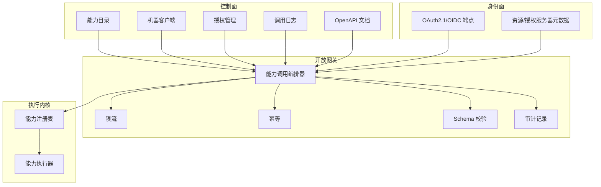
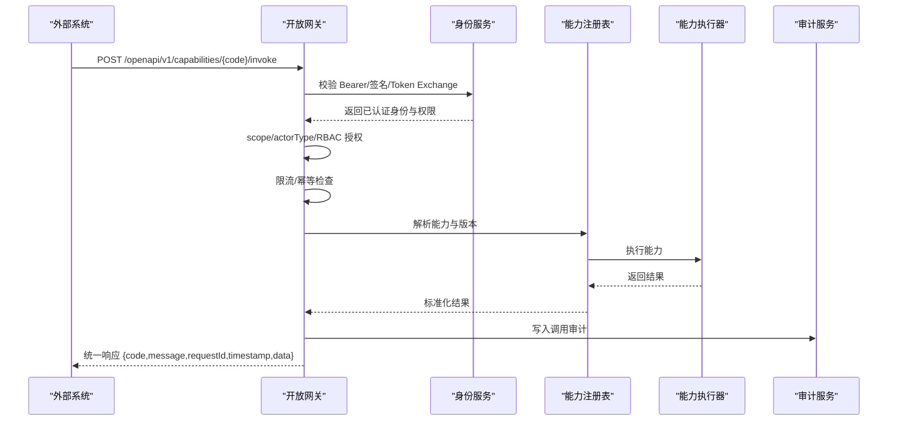
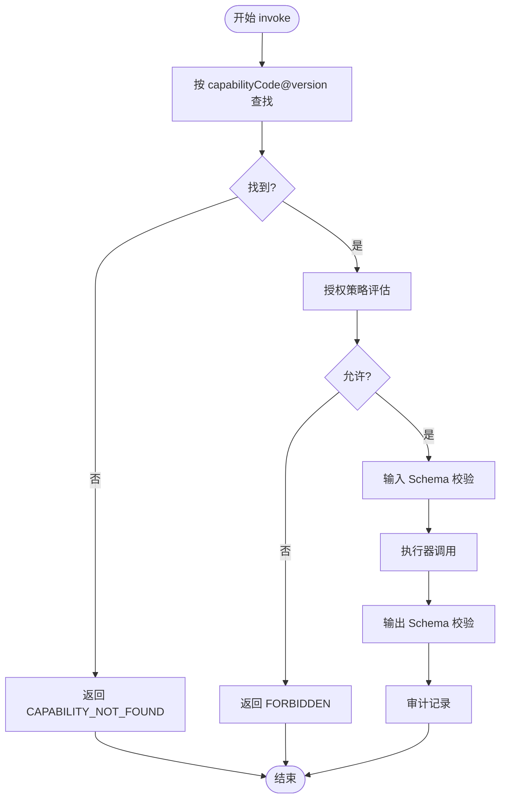
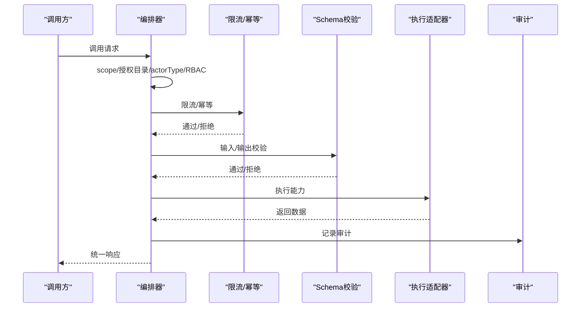
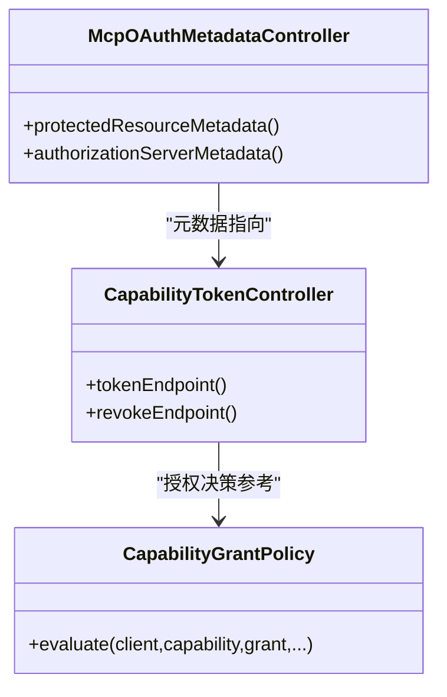
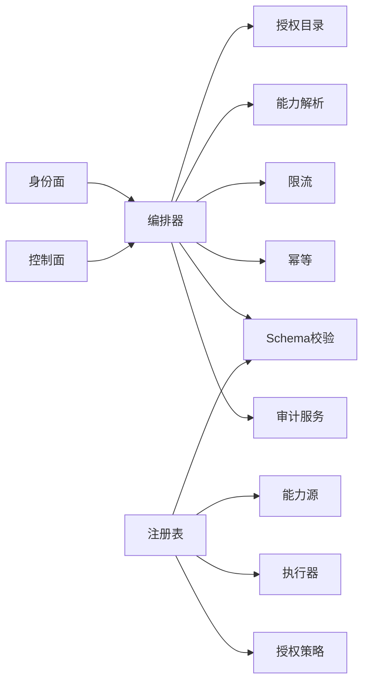

# 能力开放平台

<cite>
**本文引用的文件**
- [统一能力开放平台规格说明](file://code-copilot/changes/unified-capability-open-platform/spec.md)
- [MCP OAuth 元数据控制器](file://forge-server/forge-framework/forge-plugin-parent/forge-plugin-capability-parent/forge-plugin-capability-platform/src/main/java/com/mdframe/forge/plugin/capability/identity/oauth/McpOAuthMetadataController.java)
- [能力令牌控制器](file://forge-server/forge-framework/forge-plugin-parent/forge-plugin-capability-parent/forge-plugin-capability-platform/src/main/java/com/mdframe/forge/plugin/capability/identity/token/CapabilityTokenController.java)
- [能力调用编排器](file://forge-server/forge-framework/forge-plugin-parent/forge-plugin-capability-parent/forge-plugin-capability-platform/src/main/java/com/mdframe/forge/plugin/capability/opengateway/service/CapabilityInvokeOrchestrator.java)
- [授权策略](file://forge-server/forge-framework/forge-plugin-parent/forge-plugin-capability-parent/forge-plugin-capability-platform/src/main/java/com/mdframe/forge/plugin/capability/controlplane/security/CapabilityGrantPolicy.java)
- [内存能力注册表](file://forge-server/forge-framework/forge-plugin-parent/forge-plugin-capability-parent/forge-plugin-capability-core/src/main/java/com/mdframe/forge/plugin/capability/registry/InMemoryCapabilityRegistry.java)
- [能力调用指南服务](file://forge-server/forge-framework/forge-plugin-parent/forge-plugin-capability-parent/forge-plugin-capability-platform/src/main/java/com/mdframe/forge/plugin/capability/controlplane/service/CapabilityCallGuideService.java)
- [OpenAPI 文档服务](file://forge-server/forge-framework/forge-plugin-parent/forge-plugin-capability-parent/forge-plugin-capability-platform/src/main/java/com/mdframe/forge/plugin/capability/controlplane/service/CapabilityOpenApiDocumentService.java)
- [在线测试面板](file://forge-admin-ui/src/views/ai/capability/components/CapabilityOnlineTestPanel.vue)
</cite>

## 目录
1. [简介](#简介)
2. [项目结构](#项目结构)
3. [核心组件](#核心组件)
4. [架构总览](#架构总览)
5. [详细组件分析](#详细组件分析)
6. [依赖关系分析](#依赖关系分析)
7. [性能与治理](#性能与治理)
8. [故障排查指南](#故障排查指南)
9. [结论](#结论)
10. [附录：开发指南与SDK示例](#附录：开发指南与sdk示例)

## 简介
本文件面向 Forge Admin 的“能力开放平台”，系统性说明能力的注册、发布、授权与管理机制，覆盖 MCP 协议支持、OAuth2/OIDC 认证、REST 开放网关集成等企业级能力；并给出能力调用审计、限流控制、错误处理等治理实践。同时提供能力开发与第三方系统集成的最佳实践与 SDK 使用指引，帮助外部系统安全、稳定地接入已发布的能力。

## 项目结构
能力开放平台由“控制面 + 身份面 + 开放网关 + 执行内核”组成：
- 控制面：能力目录、客户端管理、授权管理、调用日志查询、OpenAPI 文档下载。
- 身份面：OAuth2.1/OIDC Token 颁发、资源元数据、用户委托 Token Exchange。
- 开放网关：统一的 REST 入口，承载认证、防重放、授权、限流、幂等、Schema 校验、执行与审计闭环。
- 执行内核：能力注册、发现、参数/结果 Schema 校验、执行器调度与审计观察点。

图表来源
- [能力调用编排器:44-61](file://forge-server/forge-framework/forge-plugin-parent/forge-plugin-capability-parent/forge-plugin-capability-platform/src/main/java/com/mdframe/forge/plugin/capability/opengateway/service/CapabilityInvokeOrchestrator.java#L44-L61)
- [内存能力注册表:44-109](file://forge-server/forge-framework/forge-plugin-parent/forge-plugin-capability-parent/forge-plugin-capability-core/src/main/java/com/mdframe/forge/plugin/capability/registry/InMemoryCapabilityRegistry.java#L44-L109)

章节来源
- [统一能力开放平台规格说明:1-20](file://code-copilot/changes/unified-capability-open-platform/spec.md#L1-L20)

## 核心组件
- 能力注册与发现：通过能力源加载定义，按协议工具名与版本建立索引，提供分页游标与快照一致性保护。
- 能力执行内核：在注册表中完成授权策略评估、输入/输出 Schema 校验、执行器调度与审计观察。
- 开放网关编排：统一入口实现“scope → 授权目录 → 主体类型 → RBAC → 限流 → 幂等 → Schema 校验 → 执行 → 审计”。
- 身份与授权：OAuth2.1/OIDC 元数据与令牌端点、Token Exchange、资源元数据；控制面授权策略校验租户/组织/版本策略/风险等级。
- 控制台与文档：能力目录、客户端、授权、调用日志页面；按能力版本生成 OpenAPI 3.1 文档与调用示例。

章节来源
- [内存能力注册表:111-214](file://forge-server/forge-framework/forge-plugin-parent/forge-plugin-capability-parent/forge-plugin-capability-core/src/main/java/com/mdframe/forge/plugin/capability/registry/InMemoryCapabilityRegistry.java#L111-L214)
- [能力调用编排器:63-140](file://forge-server/forge-framework/forge-plugin-parent/forge-plugin-capability-parent/forge-plugin-capability-platform/src/main/java/com/mdframe/forge/plugin/capability/opengateway/service/CapabilityInvokeOrchestrator.java#L63-L140)
- [授权策略:14-83](file://forge-server/forge-framework/forge-plugin-parent/forge-plugin-capability-parent/forge-plugin-capability-platform/src/main/java/com/mdframe/forge/plugin/capability/controlplane/security/CapabilityGrantPolicy.java#L14-L83)
- [MCP OAuth 元数据控制器:15-65](file://forge-server/forge-framework/forge-plugin-parent/forge-plugin-capability-parent/forge-plugin-capability-platform/src/main/java/com/mdframe/forge/plugin/capability/identity/oauth/McpOAuthMetadataController.java#L15-L65)

## 架构总览
能力开放平台的请求链路如下：外部系统通过 REST 或 MCP 进入平台，经身份认证后，由网关编排器进行授权、限流、幂等、Schema 校验，再交由能力执行器完成业务逻辑，最终统一响应并落库审计。

图表来源
- [能力调用编排器:63-140](file://forge-server/forge-framework/forge-plugin-parent/forge-plugin-capability-parent/forge-plugin-capability-platform/src/main/java/com/mdframe/forge/plugin/capability/opengateway/service/CapabilityInvokeOrchestrator.java#L63-L140)
- [能力调用编排器:142-196](file://forge-server/forge-framework/forge-plugin-parent/forge-plugin-capability-parent/forge-plugin-capability-platform/src/main/java/com/mdframe/forge/plugin/capability/opengateway/service/CapabilityInvokeOrchestrator.java#L142-L196)
- [能力调用编排器:373-398](file://forge-server/forge-framework/forge-plugin-parent/forge-plugin-capability-parent/forge-plugin-capability-platform/src/main/java/com/mdframe/forge/plugin/capability/opengateway/service/CapabilityInvokeOrchestrator.java#L373-L398)

## 详细组件分析

### 能力注册与执行内核（InMemoryCapabilityRegistry）
- 能力加载与索引：从 CapabilitySource 加载定义，按协议工具名+版本排序，构建只读映射。
- 列表与游标：支持分页游标，游标包含快照版本、查询指纹与签名，防止篡改与越权。
- 调用流程：查找能力 → 授权策略评估 → 输入 Schema 校验 → 执行器调用 → 输出 Schema 校验 → 审计观察。
- 错误与审计：统一封装错误码与耗时，并通过观察者回调上报审计。

图表来源
- [内存能力注册表:170-214](file://forge-server/forge-framework/forge-plugin-parent/forge-plugin-capability-parent/forge-plugin-capability-core/src/main/java/com/mdframe/forge/plugin/capability/registry/InMemoryCapabilityRegistry.java#L170-L214)
- [内存能力注册表:244-278](file://forge-server/forge-framework/forge-plugin-parent/forge-plugin-capability-parent/forge-plugin-capability-core/src/main/java/com/mdframe/forge/plugin/capability/registry/InMemoryCapabilityRegistry.java#L244-L278)

章节来源
- [内存能力注册表:44-109](file://forge-server/forge-framework/forge-plugin-parent/forge-plugin-capability-parent/forge-plugin-capability-core/src/main/java/com/mdframe/forge/plugin/capability/registry/InMemoryCapabilityRegistry.java#L44-L109)
- [内存能力注册表:111-214](file://forge-server/forge-framework/forge-plugin-parent/forge-plugin-capability-parent/forge-plugin-capability-core/src/main/java/com/mdframe/forge/plugin/capability/registry/InMemoryCapabilityRegistry.java#L111-L214)

### 开放网关编排（CapabilityInvokeOrchestrator）
- 九步编排：scope → 授权目录 → actorType → RBAC → 限流 → 幂等 → 输入 Schema → 执行 → 输出 Schema → 审计。
- 限流：按客户端维度区分读写配额，超限返回 429。
- 幂等：写操作强制 Idempotency-Key，命中则返回首次响应快照。
- 错误映射：将异常映射为统一错误码与 HTTP 状态，失败路径均审计。
- 上下文桥接：认证成功后打开执行上下文，透传租户/组织/用户信息到下游。

图表来源
- [能力调用编排器:63-140](file://forge-server/forge-framework/forge-plugin-parent/forge-plugin-capability-parent/forge-plugin-capability-platform/src/main/java/com/mdframe/forge/plugin/capability/opengateway/service/CapabilityInvokeOrchestrator.java#L63-L140)
- [能力调用编排器:142-196](file://forge-server/forge-framework/forge-plugin-parent/forge-plugin-capability-parent/forge-plugin-capability-platform/src/main/java/com/mdframe/forge/plugin/capability/opengateway/service/CapabilityInvokeOrchestrator.java#L142-L196)
- [能力调用编排器:288-335](file://forge-server/forge-framework/forge-plugin-parent/forge-plugin-capability-parent/forge-plugin-capability-platform/src/main/java/com/mdframe/forge/plugin/capability/opengateway/service/CapabilityInvokeOrchestrator.java#L288-L335)

章节来源
- [能力调用编排器:63-140](file://forge-server/forge-framework/forge-plugin-parent/forge-plugin-capability-parent/forge-plugin-capability-platform/src/main/java/com/mdframe/forge/plugin/capability/opengateway/service/CapabilityInvokeOrchestrator.java#L63-L140)
- [能力调用编排器:142-196](file://forge-server/forge-framework/forge-plugin-parent/forge-plugin-capability-parent/forge-plugin-capability-platform/src/main/java/com/mdframe/forge/plugin/capability/opengateway/service/CapabilityInvokeOrchestrator.java#L142-L196)
- [能力调用编排器:288-335](file://forge-server/forge-framework/forge-plugin-parent/forge-plugin-capability-parent/forge-plugin-capability-platform/src/main/java/com/mdframe/forge/plugin/capability/opengateway/service/CapabilityInvokeOrchestrator.java#L288-L335)

### 身份与授权（OAuth2.1/OIDC + 授权策略）
- 资源与授权服务器元数据：/.well-known 暴露资源、授权端点、支持的 grant/response_type/scope。
- 令牌端点：支持 client_credentials、authorization_code+PKCE、token-exchange（受信 OIDC JWT）。
- 授权策略：校验租户/组织范围、客户端状态与过期、能力发布/启用/风险等级、授权状态与版本策略。

图表来源
- [MCP OAuth 元数据控制器:15-65](file://forge-server/forge-framework/forge-plugin-parent/forge-plugin-capability-parent/forge-plugin-capability-platform/src/main/java/com/mdframe/forge/plugin/capability/identity/oauth/McpOAuthMetadataController.java#L15-L65)
- [能力令牌控制器:402-440](file://forge-server/forge-framework/forge-plugin-parent/forge-plugin-capability-parent/forge-plugin-capability-platform/src/main/java/com/mdframe/forge/plugin/capability/identity/token/CapabilityTokenController.java#L402-L440)
- [授权策略:14-83](file://forge-server/forge-framework/forge-plugin-parent/forge-plugin-capability-parent/forge-plugin-capability-platform/src/main/java/com/mdframe/forge/plugin/capability/controlplane/security/CapabilityGrantPolicy.java#L14-L83)

章节来源
- [MCP OAuth 元数据控制器:15-65](file://forge-server/forge-framework/forge-plugin-parent/forge-plugin-capability-parent/forge-plugin-capability-platform/src/main/java/com/mdframe/forge/plugin/capability/identity/oauth/McpOAuthMetadataController.java#L15-L65)
- [能力令牌控制器:402-440](file://forge-server/forge-framework/forge-plugin-parent/forge-plugin-capability-parent/forge-plugin-capability-platform/src/main/java/com/mdframe/forge/plugin/capability/identity/token/CapabilityTokenController.java#L402-L440)
- [授权策略:14-83](file://forge-server/forge-framework/forge-plugin-parent/forge-plugin-capability-parent/forge-plugin-capability-platform/src/main/java/com/mdframe/forge/plugin/capability/controlplane/security/CapabilityGrantPolicy.java#L14-L83)

### 控制面与文档（目录/客户端/授权/日志/OpenAPI）
- 能力目录：列出已发布能力，支持前缀过滤与分页游标。
- 机器客户端：创建/轮换/吊销凭据，支持 OAuth 与 HMAC 签名模式。
- 授权管理：为客户端授予能力访问权限，支持固定版本或主版本跟随策略。
- 调用日志：分页查询调用审计详情。
- OpenAPI 文档：按能力版本生成标准文档，包含认证方式、限流/幂等约定、错误码与调用示例。

章节来源
- [能力调用指南服务:595-852](file://forge-server/forge-framework/forge-plugin-parent/forge-plugin-capability-parent/forge-plugin-capability-platform/src/main/java/com/mdframe/forge/plugin/capability/controlplane/service/CapabilityCallGuideService.java#L595-L852)
- [OpenAPI 文档服务:333-397](file://forge-server/forge-framework/forge-plugin-parent/forge-plugin-capability-parent/forge-plugin-capability-platform/src/main/java/com/mdframe/forge/plugin/capability/controlplane/service/CapabilityOpenApiDocumentService.java#L333-L397)

## 依赖关系分析
- 编排器依赖：授权目录、能力解析、限流/幂等、Schema 校验、审计服务、对象序列化。
- 注册表依赖：能力源、执行器集合、授权策略、Schema 校验、名称映射。
- 身份面依赖：配置属性（issuer/resource）、Sa-Token 白名单、OAuth2.1/OIDC 标准端点。
- 控制面依赖：领域模型（能力/客户端/授权/日志）、Mapper、DTO/VO。

图表来源
- [能力调用编排器:44-61](file://forge-server/forge-framework/forge-plugin-parent/forge-plugin-capability-parent/forge-plugin-capability-platform/src/main/java/com/mdframe/forge/plugin/capability/opengateway/service/CapabilityInvokeOrchestrator.java#L44-L61)
- [内存能力注册表:44-109](file://forge-server/forge-framework/forge-plugin-parent/forge-plugin-capability-parent/forge-plugin-capability-core/src/main/java/com/mdframe/forge/plugin/capability/registry/InMemoryCapabilityRegistry.java#L44-L109)

章节来源
- [能力调用编排器:44-61](file://forge-server/forge-framework/forge-plugin-parent/forge-plugin-capability-parent/forge-plugin-capability-platform/src/main/java/com/mdframe/forge/plugin/capability/opengateway/service/CapabilityInvokeOrchestrator.java#L44-L61)
- [内存能力注册表:44-109](file://forge-server/forge-framework/forge-plugin-parent/forge-plugin-capability-parent/forge-plugin-capability-core/src/main/java/com/mdframe/forge/plugin/capability/registry/InMemoryCapabilityRegistry.java#L44-L109)

## 性能与治理
- 限流控制：按客户端维度对读/写能力分别设置每分钟配额，超限返回 429。
- 幂等保障：写操作必须携带 Idempotency-Key，重复请求返回首次响应快照，避免重复单据。
- 防重放：时间窗与一次性 nonce 校验，Redis 不可用失败关闭。
- Schema 校验：输入/输出严格校验，失败快速返回，减少无效执行。
- 审计记录：每次调用（含被拒绝）均记录，便于追溯与分析。
- 错误处理：统一错误码与 HTTP 状态映射，失败阶段可诊断。

章节来源
- [能力调用编排器:101-134](file://forge-server/forge-framework/forge-plugin-parent/forge-plugin-capability-parent/forge-plugin-capability-platform/src/main/java/com/mdframe/forge/plugin/capability/opengateway/service/CapabilityInvokeOrchestrator.java#L101-L134)
- [能力调用编排器:288-335](file://forge-server/forge-framework/forge-plugin-parent/forge-plugin-capability-parent/forge-plugin-capability-platform/src/main/java/com/mdframe/forge/plugin/capability/opengateway/service/CapabilityInvokeOrchestrator.java#L288-L335)
- [统一能力开放平台规格说明:46-75](file://code-copilot/changes/unified-capability-open-platform/spec.md#L46-L75)

## 故障排查指南
- 401 未认证：检查 Authorization 头或签名头是否完整，确认客户端凭据有效且未过期。
- 403 禁止访问：检查 scope、actorType、RBAC 权限与授权是否生效；高风险能力默认禁止授权。
- 400 参数错误：检查 Idempotency-Key 格式与必填字段；查看 Schema 校验错误路径。
- 429 限流：降低调用频率或申请更高配额；检查 Redis 可用性。
- 503 暂时不可用：限流/幂等/审计依赖不可用；等待恢复或切换实例。
- 审计缺失：检查审计服务可用性与网络连通性；关注“审计服务暂时不可用”提示。

章节来源
- [能力调用编排器:288-335](file://forge-server/forge-framework/forge-plugin-parent/forge-plugin-capability-parent/forge-plugin-capability-platform/src/main/java/com/mdframe/forge/plugin/capability/opengateway/service/CapabilityInvokeOrchestrator.java#L288-L335)
- [能力调用编排器:373-398](file://forge-server/forge-framework/forge-plugin-parent/forge-plugin-capability-parent/forge-plugin-capability-platform/src/main/java/com/mdframe/forge/plugin/capability/opengateway/service/CapabilityInvokeOrchestrator.java#L373-L398)

## 结论
能力开放平台以“控制面 + 身份面 + 开放网关 + 执行内核”的分层架构，实现了企业级的能力注册、发布、授权与管理闭环。通过 OAuth2.1/OIDC、MCP 协议支持与 REST 开放网关，结合限流、幂等、Schema 校验与审计，确保能力对外暴露的安全性与稳定性。控制台与 OpenAPI 文档进一步降低了第三方系统的接入成本。

## 附录：开发指南与SDK示例
- 能力注册与发布
  - 在控制面登记能力定义，声明输入/输出 Schema、行为（READ_ONLY/写）、风险等级与 required_actor_type。
  - 发布能力版本，选择版本策略（固定/主版本跟随），并为客户端授予授权。
- 客户端与认证
  - 创建机器客户端，选择认证模式（OAuth/HMAC），保存凭据（仅创建/轮换时展示明文）。
  - 使用 client_credentials 或 Token Exchange 获取短期 Token；USER 委托场景需传入受信 OIDC JWT。
- 调用与重试
  - 调用地址：POST /openapi/v1/capabilities/{capabilityCode}/invoke。
  - 写操作必须携带 Idempotency-Key；重试复用同一 key，避免重复单据。
- 文档与示例
  - 下载单能力 OpenAPI 3.1 文档，获取认证方式、限流/幂等约定、错误码与 curl/Java 示例。
  - 控制台在线测试面板支持选择认证模式、填写凭据与请求体，一键生成接入示例。

章节来源
- [能力调用指南服务:595-852](file://forge-server/forge-framework/forge-plugin-parent/forge-plugin-capability-parent/forge-plugin-capability-platform/src/main/java/com/mdframe/forge/plugin/capability/controlplane/service/CapabilityCallGuideService.java#L595-L852)
- [OpenAPI 文档服务:333-397](file://forge-server/forge-framework/forge-plugin-parent/forge-plugin-capability-parent/forge-plugin-capability-platform/src/main/java/com/mdframe/forge/plugin/capability/controlplane/service/CapabilityOpenApiDocumentService.java#L333-L397)
- [在线测试面板:199-237](file://forge-admin-ui/src/views/ai/capability/components/CapabilityOnlineTestPanel.vue#L199-L237)
- [在线测试面板:774-814](file://forge-admin-ui/src/views/ai/capability/components/CapabilityOnlineTestPanel.vue#L774-L814)